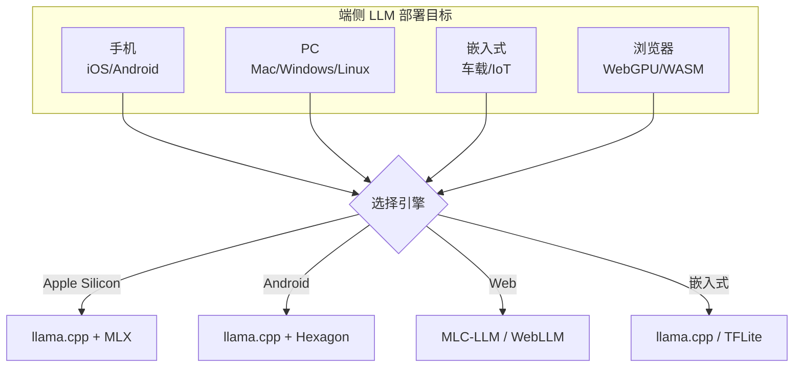
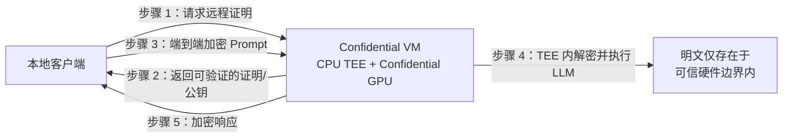

# 第 28 章 端侧与边缘 LLM ⭐⭐⭐⭐

> [!abstract] 本章导航
> **定位**：把模型部署约束下沉到个人设备、浏览器和边缘节点。
>
> **先修**：[[12_Transformer与大模型原理]]、[[16_模型微调与推理优化]]、[[25_推理引擎与高性能服务]]。
>
> **学习目标**：
> - 比较 MLX、llama.cpp、WebGPU 和移动端推理栈。
> - 估算端侧模型的内存、功耗和延迟需求。
> - 根据隐私、体验和维护成本选择端云方案。
>
> **建议路径**：端侧 LLM 全景 → 量化与压缩 → Apple MLX 框架 → … → 端云协同部署模式。先完成主线，再按需要阅读进阶内容。
>
> **配套代码**：`code/ch28_edge_llm/`。

> [!info] 阅读提示
> **🆕 2026年新主题**：Apple MLX、Ollama、WebGPU/WASM 浏览器推理、Snapdragon Hexagon NPU、Ascend CANN，以及 confidential computing/TEE 隐私推理的边界。

将大模型部署到手机、PC 和嵌入式设备，是持续发展的端侧工程方向。原因：隐私（数据不出端）、低延迟（无网络往返）、成本（无需 GPU 云）、离线可用。本章系统介绍端侧 LLM 推理的关键技术和框架。

## 28.1 端侧 LLM 全景

```
[云端大模型]   →   [端侧大模型]
- 70B+ 推理       - 1B-7B 量化
- H100/A100 GPU   - 移动 NPU/Apple Silicon
- 高延迟            - 亚秒响应
- 隐私风险          - 数据本地
```



## 28.2 量化与压缩

### 28.2.1 GGUF 格式

GGUF (GPT-Generated Unified Format) 是 llama.cpp 的标准模型格式：

| 量化类型 | 相对体积 | 使用边界 |
|---------|----------|---------|
| **Q2_K** | 最小 | 质量风险通常最高，只应在目标任务上实测 |
| **Q4_K_M** | 较小 | 常见体积/质量折中，不代表“几乎无损” |
| **Q5_K_M / Q6_K** | 中等 | 通常降低量化误差，但占用同步增加 |
| **Q8_0** | 最大 | 量化误差较低但不等于零损失 |

具体文件大小取决于参数量、张量类型、词表和 GGUF 元数据；质量必须用目标模型、
数据集和推理参数评估，不能从量化名称直接推出。

### 28.2.2 端侧量化目标

| 设备示例 | 容量预筛 | 仍需验证 |
|------|----------|------------|
| 8GB 手机 | 先从 1B–3B 量化模型筛选 | OS 可用内存、温控、算子覆盖、上下文 |
| 16GB Apple Silicon | 7B 4-bit 可作为候选 | 统一内存压力、KV cache、实际速度 |
| 24GB NVIDIA GPU | 7B–14B 高精度或更大量化模型候选 | 权重 + KV cache + workspace + 并发；不能据此宣称 70B Q4 可单卡运行 |
| 12GB Snapdragon 设备 | 先从已验证的 1B–3B 模型开始 | Hexagon 后端支持矩阵、CPU/GPU 回退和真机日志 |

## 28.3 Apple MLX 框架

Apple MLX 是 Apple 在 2023 年底推出的机器学习框架，专为 Apple Silicon 优化。
截至 2026-07-31，Ollama 已提供 MLX 引擎，但支持的模型架构/格式仍需查当前模型页与发行说明。

```python
import mlx.core as mx
from mlx_lm import load, generate

# 加载模型 (Q4 量化)
model, tokenizer = load("mlx-community/Meta-Llama-3-8B-Instruct-4bit")

# 推理
prompt = "Hello, my name is"
messages = [{"role": "user", "content": prompt}]
prompt = tokenizer.apply_chat_template(messages, add_generation_prompt=True)

text = generate(model, tokenizer, prompt=prompt, max_tokens=100, verbose=True)
print(text)
```

### 28.3.1 MLX vs Core ML vs PyTorch MPS

| 维度 | MLX | Core ML | PyTorch MPS |
|------|-----|---------|-------------|
| 主要定位 | Apple Silicon 数组/模型开发框架 | Apple 平台模型部署与设备调度 | PyTorch 的 Metal 加速后端 |
| 常见工作流 | Python 研究、微调、推理 | 转换/编译后在 App 内推理 | 复用 PyTorch 训练与推理代码 |
| 训练能力 | 支持自动微分与训练 | 以部署为主，更新能力受模型/任务约束 | 支持，但算子覆盖和 fallback 需核对 |
| 内存说明 | 面向 Apple 统一内存设计 | 运行在统一内存硬件上，由 Core ML 管理 | 同样运行在统一内存硬件上；张量迁移/算子语义仍由 PyTorch 管理 |

## 28.4 llama.cpp 多平台

llama.cpp 是本地/端侧 LLM 部署中广泛使用的开源运行时之一：

### 28.4.1 后端 (Backends)

| 后端 | 硬件 | 加速 |
|------|------|------|
| **Metal** | Apple Silicon | GPU |
| **CUDA** | NVIDIA | GPU |
| **Vulkan** | 跨平台 GPU | GPU |
| **OpenCL** | Adreno/Mali | GPU |
| **Hexagon** | Snapdragon NPU | NPU |
| **CANN** | 华为昇腾 | NPU |
| **MUSA** | Moore Threads | GPU |
| **CPU** | 任意 | AVX/NEON |

### 28.4.2 Ollama 一键部署

```bash
# 安装 Ollama
curl -fsSL https://ollama.com/install.sh | sh

# 运行模型
ollama run llama3.2:3b

# 自定义 Modelfile
FROM llama3.2:3b
PARAMETER temperature 0.7
PARAMETER top_p 0.9
SYSTEM "You are a helpful assistant."
```

## 28.5 WebGPU / WASM 浏览器推理

### 28.5.1 WebLLM / MLC-LLM

```javascript
// WebLLM 浏览器推理
import { CreateMLCEngine } from "@mlc-ai/web-llm";

const engine = await CreateMLCEngine("Llama-3.2-3B-Instruct-q4f16_1-MLC", {
  initProgressCallback: (report) => console.log(report)
});

const response = await engine.chat.completions.create({
  messages: [{ role: "user", content: "Hello!" }]
});
console.log(response.choices[0].message.content);
```

### 28.5.2 WebGPU vs WebAssembly

| 特性 | WebGPU | WASM |
|------|--------|------|
| 执行设备 | 浏览器可用的 GPU adapter | CPU（以及运行时提供的 SIMD/线程能力） |
| 优势 | 适合并行张量计算 | 兼容路径较广、适合控制逻辑/CPU 算子 |
| 限制 | adapter、驱动、浏览器和显存/共享内存差异大 | 大模型张量计算通常受 CPU 与内存带宽限制 |
| 选型 | 运行时 feature detection + 目标设备实测 | 作为实现组成或受控 fallback，不给固定模型上限 |

## 28.6 Minions Secure Chat：Confidential Computing 研究原型

Stanford Hazy Research 于 **2025-05-12**公开了 Minions Secure Chat Protocol 研究原型。它不是“本地小模型生成加密嵌入、云端只看嵌入、本地解码”，而是使用远程证明与 confidential CPU/GPU **TEE** 建立可信执行边界：



**核心边界**：

- TLS/mTLS 只保护传输；远程证明用于确认服务端确实运行预期代码和 TEE 配置。
- Prompt 会在 TEE 内解密为明文供模型推理，并非“云端模型只看不可逆嵌入”。
- 安全保证依赖硬件、固件、证明服务、镜像/代码测量值和密钥管理；不能简化成“用了 HTTPS 就对云厂商保密”。
- 原作者明确说明这是**未经第三方安全审计、不可直接用于生产**的探索性原型。

来源：[Stanford Hazy Research: Mind the Trust Gap](https://hazyresearch.stanford.edu/blog/2025-05-12-security)（截至 2026-07-31）。

## 28.7 端云协同部署模式

| 模式 | 描述 | 适用 |
|------|------|------|
| **纯端侧** | 全部在本地 | 简单任务、隐私敏感 |
| **云端主力** | 主力在云端 | 复杂推理 |
| **路由分流** | 简单→端侧，复杂→云端 | 通用应用 |
| **Confidential TEE 推理** | 远程证明 + 加密传输 + TEE 内推理 | 需可信硬件、证明链与安全审计 |
| **端侧缓存** | 重复 query 本地缓存 | 客服/工具类 |

## 🧭 本章小结

> **章节小结**：本章介绍端侧与边缘 LLM 的主要技术栈。Apple MLX 利用 Apple Silicon 统一内存；GGUF + llama.cpp 面向跨平台本地推理；Ollama 提供本地模型管理与 API；WebLLM/WebGPU 支持浏览器推理。敏感数据场景仍需威胁建模：纯端侧、可信云 TEE、普通云 API 的安全边界不同，研究原型不能直接等同于生产级隐私保证。

## ✅ 自测与练习

先合上正文，再回答以下问题；无法说明证据或边界时，回到对应小节复习。

1. 你能否比较 MLX、llama.cpp、WebGPU 和移动端推理栈？
2. 你能否估算端侧模型的内存、功耗和延迟需求？
3. 你能否根据隐私、体验和维护成本选择端云方案？

## 🧪 配套代码与验收

> 本章包含 10 个 GPU tier 示例。默认 runner 会传 `--mock`，因此 MLX、llama.cpp、Ollama、
> WebLLM、wasmtime、证书生成和本地服务路径应 `[SKIP]`；这能验证“离线不产生外部副作用”，
> 不能证明对应硬件、模型、浏览器或服务已可用。第 09 个是设备能力教学，第 10 个最多验证
> 本地 TLS 流程，不实现 TEE 或远程证明。

### 28.11.1 文件 × 能力边界速查表

| # | 文件 | 默认验收 | 条件性真实路径 | 不能据此宣称 |
|---|------|---------|---------------|---------------|
| 01 | `apple_mlx_basic.py` | `[SKIP]` | Apple Silicon + MLX + 本地兼容权重 | 任意 Mac 的固定 tok/s |
| 02 | `mlx_unified_memory.py` | `[SKIP]` | Apple Silicon + MLX | 统一内存一定快于其他后端 |
| 03 | `llama_cpp_gguf_quantization.py` | `[SKIP]` | llama-cpp-python + 指定 GGUF | 固定质量/速度或所有 GGUF 兼容 |
| 04 | `llama_cpp_backends.py` | `[SKIP]` | 匹配平台的 llama.cpp 构建 + GGUF | 后端已正确使用 GPU |
| 05 | `ollama_http_api.py` | `[SKIP]` | 本地 Ollama 服务 + 已拉取模型 | Ollama Cloud 或完整 OpenAI API 兼容 |
| 06 | `ollama_modelfile.py` | `[SKIP]` | Ollama CLI/服务；会写文件并创建模型 | 默认验收无副作用时已创建模型 |
| 07 | `webllm_browser_inference.py` | `[SKIP]` | Playwright/Chromium/WebGPU/网络下载 | 任意浏览器性能或离线可用 |
| 08 | `webgpu_vs_wasm.py` | `[SKIP]` | wasmtime CLI；会创建临时 benchmark 文件 | WebGPU 与 WASM 的通用速度比 |
| 09 | `snapdragon_hexagon_npu.py` | `[SKIP]` + 当前命令提纲 | Snapdragon 真机 + 当前 llama.cpp Snapdragon 文档指定工具链 | NPU 推理已执行或性能已测 |
| 10 | `secure_minions_protocol.py` | `[SKIP]` | OpenSSL + 临时证书 + loopback socket | TEE、confidential GPU 或远程证明 |

### 28.11.2 默认验收与条件性真跑

```bash
cd code

# 默认：不下载、不联网、不创建 Ollama 模型或证书
python scripts/run_all_examples.py --tier gpu --chapter ch28

# 仅在核对脚本副作用和本机依赖后逐个启用
python scripts/run_all_examples.py --tier gpu --chapter ch28 --real-gpu
```

`--real-gpu` 是条件性执行开关，不是安全或兼容性证明。应先锁定模型/工具版本、检查许可证和
下载路径，并在目标设备记录实际 RAM/VRAM、后端日志、首 token/吞吐和输出质量。

> 工作区中出现模型或 adapter 文件，只说明本地存在相应文件；使用前仍需校验 hash、完整性、
> 基座兼容性、许可证和模型卡。不得由目录存在推断“已预置可在固定时间启动”。

## 🎯 面试题精讲

### 高频题1: Apple MLX 与 PyTorch MPS 区别？

**答案**: 
- **MLX**：Apple 面向 Apple Silicon 的数组/模型框架，围绕统一内存和惰性计算设计。
- **MPS**：PyTorch 的 Metal 后端，便于复用 PyTorch 生态；并非“模拟 CUDA API”。
- 不能笼统断言 MLX 一定更快；需比较相同模型、精度、batch、上下文和算子 fallback。

### 高频题2: WebGPU 浏览器推理的局限性？

**答案**:
1. 浏览器/adapter：必须运行时检查 `navigator.gpu`、adapter 特性和所需扩展，不能锁死旧版本号；
2. 容量：受权重、KV cache、浏览器进程和 GPU/共享内存共同限制，无通用“<7B”上限；
3. 首次加载：模型工件可能从数百 MB 到多 GB，应显示进度、校验完整性并设计缓存；
4. 生命周期：Web Worker/Service Worker 可改善体验，但 Service Worker 仍可能被浏览器终止，必须可恢复。

### 高频题3: 端侧 LLM 与云端 LLM 的核心权衡？

**答案**:
- 端侧: 隐私、延迟、离线；但模型小、显存受限
- 云端: 大模型、强能力；但需联网、隐私风险
- 端云协同需结合路由、数据最小化、远程证明和供应商/硬件信任边界

### 高频题4: GGUF 格式的核心优势？

**答案**:
1. 单文件部署 (模型+配置+元数据)
2. 支持 mmap 等加载方式，可能减少复制；启动时间仍取决于存储、模型和后端
3. 同一 GGUF 可被多个 llama.cpp 后端使用，但具体算子/量化兼容性需核对
4. 量化粒度细 (Q2-Q8)
5. llama.cpp 生态完善

### 高频题5: Ollama vs llama.cpp 直接调用？

**答案**:
- **Ollama**: 包装层，提供原生 HTTP API、部分 OpenAI-compatible 端点、Modelfile 与模型管理
- **llama.cpp**: C++ 库，需自行集成
- 选型: 快速原型用 Ollama；产品嵌入用 llama.cpp

### 高频题6: Snapdragon NPU (Hexagon) 与 GPU 推理区别？

**答案**:
- **NPU**：擅长受支持的低精度矩阵算子与能效优化，但可能发生 CPU/GPU 回退。
- **GPU**：算子覆盖通常更灵活，具体性能/功耗取决于芯片、后端和模型。
- 选型不能只看 TOPS；要分别测 prefill、decode、内存、温控，并从日志确认真实卸载路径。

### 高频题7: Minions Secure Chat 的核心思想与限制？

**答案**：客户端先验证 confidential CPU/GPU 的远程证明，再建立加密会话；Prompt 只在通过验证的 TEE 内解密并完成推理。它不依赖“不可逆嵌入 + 本地解码”。截至 2026-07-31，该方案仍是未经第三方审计的研究原型，生产落地还需供应链、证明服务、镜像测量、密钥轮换和事件响应审计。

### 高频题8: 端侧 LLM 的 KV Cache 显存挑战？

**答案**：端侧可用内存通常同时被 OS、权重、运行时 workspace 与 KV cache 占用。候选手段包括：
1. **KV Cache 量化**：仅在后端和模型支持时采用，并评估质量；
2. **分页/分块管理**：降低碎片，但具体端侧后端未必支持 vLLM 的 PagedAttention；
3. **高效 Attention kernel**：主要减少中间激活/访存，不会消除 KV 本体；
4. **Sliding Window / context truncation**：直接限制保留历史，需接受能力损失。

## 📋 本章速查表

| 概念 | 关键点 |
|------|--------|
| **Apple MLX** | 统一内存，Apple Silicon 原生 |
| **GGUF** | llama.cpp 标准格式，Q2-Q8 量化 |
| **Ollama** | llama.cpp 包装，OpenAI 兼容 API |
| **WebLLM** | MLC-LLM 浏览器推理，WebGPU |
| **WebGPU** | 浏览器 GPU 加速 |
| **Hexagon NPU** | Qualcomm 端侧 NPU |
| **Minions Secure Chat** | 远程证明 + confidential CPU/GPU TEE；研究原型 |
| **端云协同** | 路由分流 / KV cache 复用 |
| **配套代码（W4）** | `01-02` MLX；`03-04` llama.cpp；`05-06` Ollama；`07` WebLLM；`08` wasmtime；`09` Hexagon NPU 教学；`10` 仅演示 TLS 信道及 TEE 威胁模型，不冒充远程证明实现。 |

## 🔗 相关章节

- [[24_云原生部署与工程化]] — 云端部署基础，Docker/K8s 与端侧镜像构建对比
- [[16_模型微调与推理优化]] — 量化技术 (FP4/INT4/AWQ)，端侧量化的上游方法
- [[25_推理引擎与高性能服务]] — 云端推理引擎 (vLLM/SGLang) 与端侧 (llama.cpp) 的能力对比
- [[21_多模态大模型]] — 多模态端侧部署，CoreML / TFLite 加速
- [[15_Agent智能体开发]] — 端侧 Agent 趋势，Edge AI Agent 框架

## 📖 一手参考资料

> 核验日期：2026-08-04。版本、价格、法规、模型能力和 benchmark 以链接页面当前状态为准。

- [[docs/AUTHORITATIVE_SOURCES|章节权威来源索引]]：按章节维护的官方文档、标准、原论文和官方仓库。
