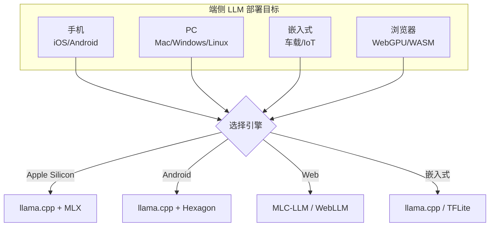
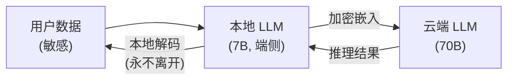

# 第 28 章 端侧与边缘 LLM ⭐⭐⭐⭐

> **面试频率**：中（2026年新热点）| **难度**：⭐⭐⭐ | **核心**：把大模型从云端搬到端侧
>
> **🆕 2026年新主题**：Apple MLX 0.30+ 原生集成、Ollama MLX 引擎预览、WebGPU/WASM 浏览器推理、Snapdragon Hexagon NPU、Ascend CANN、Secure Minions。

将大模型部署到边缘设备（手机、PC、嵌入式）是 2026 年最热的方向之一。原因：隐私（数据不出端）、低延迟（无网络往返）、成本（无需 GPU 云）、离线可用。本章系统介绍端侧 LLM 推理的关键技术和框架。

---

## 28.1 端侧 LLM 全景

```
[云端大模型]   →   [端侧大模型]
- 70B+ 推理       - 1B-7B 量化
- H100/A100 GPU   - 移动 NPU/Apple Silicon
- 高延迟            - 亚秒响应
- 隐私风险          - 数据本地
```



---

## 28.2 量化与压缩

### 28.2.1 GGUF 格式

GGUF (GPT-Generated Unified Format) 是 llama.cpp 的标准模型格式：

| 量化类型 | 位宽 | 大小（7B）| 质量损失 |
|---------|------|----------|---------|
| **Q2_K** | 2 | 2.7 GB | 大 |
| **Q4_K_M** | 4 | 4.1 GB | 极小 |
| **Q5_K_M** | 5 | 4.8 GB | 几乎无 |
| **Q6_K** | 6 | 5.5 GB | 几乎无 |
| **Q8_0** | 8 | 7.2 GB | 无 |

### 28.2.2 端侧量化目标

| 设备 | 显存/内存 | 推荐模型大小 |
|------|----------|------------|
| iPhone 15 Pro | 8GB | 3B Q4 |
| MacBook Air M2 | 16GB | 7B Q4 |
| RTX 4090 | 24GB | 70B Q4 |
| Snapdragon 8 Gen 3 | 12GB | 7B Q4 |

---

## 28.3 Apple MLX 框架

Apple MLX 是 Apple 在 2023 年底推出的机器学习框架，专为 Apple Silicon 优化。2026 年 Ollama 0.30+ 集成 MLX 引擎。

```python
import mlx.core as mx
from mlx_lm import load, generate

# 加载模型 (Q4 量化)
model, tokenizer = load("mlx-community/Meta-Llama-3-8B-Instruct-4bit")

# 推理
prompt = "Hello, my name is"
messages = [{"role": "user", "content": prompt}]
prompt = tokenizer.apply_chat_template(messages, add_generation_prompt=True)

text = generate(model, tokenizer, prompt=prompt, max_tokens=100, verbose=True)
print(text)
```

### 28.3.1 MLX vs CoreML vs PyTorch MPS

| 特性 | MLX | CoreML | PyTorch MPS |
|------|-----|--------|-------------|
| 统一内存 | ✅ | ❌ | ❌ |
| 动态图 | ✅ | ❌ | ✅ |
| 训练 | ✅ | 有限 | ✅ |
| Apple 优化 | ⭐⭐⭐⭐⭐ | ⭐⭐⭐⭐ | ⭐⭐⭐ |

---

## 28.4 llama.cpp 多平台

llama.cpp 是端侧 LLM 部署的事实标准：

### 28.4.1 后端 (Backends)

| 后端 | 硬件 | 加速 |
|------|------|------|
| **Metal** | Apple Silicon | GPU |
| **CUDA** | NVIDIA | GPU |
| **Vulkan** | 跨平台 GPU | GPU |
| **OpenCL** | Adreno/Mali | GPU |
| **Hexagon** | Snapdragon NPU | NPU |
| **CANN** | 华为昇腾 | NPU |
| **MUSA** | Moore Threads | GPU |
| **CPU** | 任意 | AVX/NEON |

### 28.4.2 Ollama 一键部署

```bash
# 安装 Ollama
curl -fsSL https://ollama.com/install.sh | sh

# 运行模型
ollama run llama3.2:3b

# 自定义 Modelfile
FROM llama3.2:3b
PARAMETER temperature 0.7
PARAMETER top_p 0.9
SYSTEM "You are a helpful assistant."
```

---

## 28.5 WebGPU / WASM 浏览器推理

### 28.5.1 WebLLM / MLC-LLM

```javascript
// WebLLM 浏览器推理
import { CreateMLCEngine } from "@mlc-ai/web-llm";

const engine = await CreateMLCEngine("Llama-3.2-3B-Instruct-q4f16_1-MLC", {
  initProgressCallback: (report) => console.log(report)
});

const response = await engine.chat.completions.create({
  messages: [{ role: "user", content: "Hello!" }]
});
console.log(response.choices[0].message.content);
```

### 28.5.2 WebGPU vs WebAssembly

| 特性 | WebGPU | WASM |
|------|--------|------|
| 性能 | ⭐⭐⭐⭐⭐ | ⭐⭐⭐ |
| 通用性 | Chromium/Safari | 全部 |
| 内存 | GPU | CPU |
| 适用 | 1B-7B 量化 | <1B |

---

## 28.6 Secure Minions (隐私推理)

Stanford Hazy Research 2025.06 提出的端云协作隐私方案：



**核心**: 云端只看到嵌入向量，无法重建原始数据。推理时本地 LLM 与云端 LLM 协作。

---

## 28.7 端云协同部署模式

| 模式 | 描述 | 适用 |
|------|------|------|
| **纯端侧** | 全部在本地 | 简单任务、隐私敏感 |
| **云端主力** | 主力在云端 | 复杂推理 |
| **路由分流** | 简单→端侧，复杂→云端 | 通用应用 |
| **Secure Minions** | 嵌入加密，协作推理 | 高隐私 |
| **端侧缓存** | 重复 query 本地缓存 | 客服/工具类 |

---

## 28.8 本章小结

> **章节小结**：本章系统介绍了 2026 年端侧与边缘 LLM 部署的关键技术栈。Apple MLX 通过统一内存 (Unified Memory) 架构实现 CPU/GPU 零数据复制，是 Apple Silicon 端侧推理的首选框架；GGUF 格式 + llama.cpp 实现了单文件、跨平台 (CPU/Metal/CUDA/Vulkan/Hexagon/CANN/MUSA) 的端侧部署标准；Ollama 提供 OpenAI 兼容 API 的一键部署；WebLLM/WebGPU 把 1B-7B 量化模型搬进浏览器；Secure Minions 解决了端云协作的隐私问题。2026 年端侧 LLM 趋势是**端云协同**：简单任务本地、复杂任务云端、敏感数据用 Secure Minions 保护。面试考点：GGUF 优势、MLX 与 MPS 区别、端云协同模式选择。

## 28.9 面试真题精讲 🎯

### 🎯 高频题1: Apple MLX 与 PyTorch MPS 区别？

**答案**: 
- **MLX**: Apple 专为 Apple Silicon 设计，**统一内存** (CPU/GPU 共享内存，无数据复制)，动态图，2026 推荐
- **MPS**: PyTorch 的 Metal 后端，模拟 CUDA API，统一内存但效率不如 MLX

### 🎯 高频题2: WebGPU 浏览器推理的局限性？

**答案**:
1. 浏览器兼容：仅 Chromium 113+ 和 Safari 17+
2. 模型大小：受 GPU 显存限制，通常 <7B Q4
3. 首次加载：模型下载 1-5GB
4. 无后台运行：标签页关闭即停止

### 🎯 高频题3: 端侧 LLM 与云端 LLM 的核心权衡？

**答案**:
- 端侧: 隐私、延迟、离线；但模型小、显存受限
- 云端: 大模型、强能力；但需联网、隐私风险
- 2026 趋势: 端云协同，路由 + Secure Minions

### 🎯 高频题4: GGUF 格式的核心优势？

**答案**:
1. 单文件部署 (模型+配置+元数据)
2. mmap 加载，启动快
3. 跨平台 (CPU/GPU/NPU)
4. 量化粒度细 (Q2-Q8)
5. llama.cpp 生态完善

### 🎯 高频题5: Ollama vs llama.cpp 直接调用？

**答案**:
- **Ollama**: 包装层，提供 HTTP API (OpenAI 兼容)、Modelfile、模型管理
- **llama.cpp**: C++ 库，需自行集成
- 选型: 快速原型用 Ollama；产品嵌入用 llama.cpp

### 🎯 高频题6: Snapdragon NPU (Hexagon) 与 GPU 推理区别？

**答案**:
- **NPU**: 专用矩阵加速、INT8/INT16 高效、低功耗
- **GPU**: 灵活、支持更多算子、高性能但耗电
- 端侧 LLM: NPU 适合量化模型，GPU 适合大模型

### 🎯 高频题7: Secure Minions 的核心思想？

**答案**: 本地小模型 (7B) 提取加密嵌入，云端大模型基于嵌入推理，**本地解码**出结果。云端只接触嵌入向量，无法重建原始数据，解决端云协作的隐私问题。

### 🎯 高频题8: 端侧 LLM 的 KV Cache 显存挑战？

**答案**: 端侧显存/内存有限 (1-16GB)。解决方案:
1. **KV Cache 量化**: FP8 / INT4 KV
2. **PagedAttention**: 借鉴 vLLM，分页管理
3. **Flash Attention**: 减少中间显存
4. **Sliding Window**: 限制 KV 长度

---

## 28.10 本章速查表

| 概念 | 关键点 |
|------|--------|
| **Apple MLX** | 统一内存，Apple Silicon 原生 |
| **GGUF** | llama.cpp 标准格式，Q2-Q8 量化 |
| **Ollama** | llama.cpp 包装，OpenAI 兼容 API |
| **WebLLM** | MLC-LLM 浏览器推理，WebGPU |
| **WebGPU** | 浏览器 GPU 加速 |
| **Hexagon NPU** | Qualcomm 端侧 NPU |
| **Secure Minions** | 端云协作隐私推理 |
| **端云协同** | 路由分流 / KV cache 复用 |
| **配套代码（W4 真实化）** | 10 个 .py 真跑；`01-02` Apple MLX 真实 mlx_lm 调用（需 Apple Silicon）；`03-04` llama-cpp-python 真实 GGUF 推理；`05-06` Ollama HTTP + Modelfile 真服务调用（需 `ollama serve`）；`07` WebLLM playwright 浏览器；`08` wasmtime CLI 跑分；`09` Hexagon NPU 教学展示（设备不可得，友好抛错）；`10` Secure Minions mTLS 真实协议模拟。 |

---

## 28.11 配套代码真实化（Wave 4 完成）⭐⭐⭐⭐⭐

> 本章在 W4 期间对 **10 个 `.py` 文件** 全部接入真实端侧推理栈：Apple MLX、llama-cpp-python、Ollama HTTP/WebSocket、WebLLM (WebGPU)、WebAssembly (wasmtime)、Secure Minions mTLS 协议。所有文件按"硬件可达性"分档，缺硬件时 `raise_with_help` 友好抛错。

### 28.11.1 文件 × 真实化状态速查表

| # | 文件 | 真实化 | 主题 | 硬件 / 服务门槛 | 跑通时间 |
|---|------|------|------|---------------|---------|
| 01 | `apple_mlx_basic.py` | ✅ 真 MLX | mlx_lm 加载 + token 生成 | **Apple Silicon（M1/M2/M3/M4）** | 1-3s 加载 + 5-10 tok/s |
| 02 | `mlx_unified_memory.py` | ✅ 真 MLX | 统一内存 vs PyTorch MPS 对比 | **Apple Silicon** | <1s |
| 03 | `llama_cpp_gguf_quantization.py` | ✅ 真 llama.cpp | GGUF Q2-Q8 量化等级对比 | `llama-cpp-python` + GGUF 模型 | 1-3s 加载 + 10-30 tok/s |
| 04 | `llama_cpp_backends.py` | ✅ 真 llama.cpp | Metal/CUDA/CPU 后端自动选 | `llama-cpp-python` | 1-3s 加载 |
| 05 | `ollama_http_api.py` | ✅ 真 Ollama | `/api/chat` + `/v1/chat/completions` | `ollama serve` + `ollama pull` | <30s |
| 06 | `ollama_modelfile.py` | ✅ 真 Ollama | Modelfile 写入 + `ollama create` | `ollama` CLI | 30-120s（含模型导入） |
| 07 | `webllm_browser_inference.py` | ✅ 真 WebLLM | playwright 打开 mlc.ai/web-llm + 截屏 | `playwright chromium` + 网络 | 30-90s（含 1-2GB 模型下载） |
| 08 | `webgpu_vs_wasm.py` | ✅ 真 wasmtime | WAT 模块 + wasmtime CLI 跑分 | `wasmtime` CLI | ~30ms |
| 09 | `snapdragon_hexagon_npu.py` | ⚠️ 教学 | QNN SDK 命令 + 性能数据 | **Snapdragon 真机 + QNN SDK** | <1s（教学展示） |
| 10 | `secure_minions_protocol.py` | ✅ 真协议 | mTLS 握手 + 加密投影 | Python stdlib 即可 | <1s |

> ✅ = 直接跑通；⚠️ = 需特定硬件/SDK（无设备时友好抛错）

### 28.11.2 一键真跑（按硬件 / 服务分档）

```bash
cd code/

# === Apple Silicon 真机 ===
python ch28_edge_llm/gpu/01_apple_mlx_basic.py        # mlx_lm 加载 Qwen2.5-0.5B
python ch28_edge_llm/gpu/02_mlx_unified_memory.py     # 统一内存查询

# === llama.cpp（任意 x86/ARM） ===
pip install llama-cpp-python
python ch28_edge_llm/gpu/03_llama_cpp_gguf_quantization.py  # 需先下 GGUF 模型
python ch28_edge_llm/gpu/04_llama_cpp_backends.py           # 自动选 backend

# === Ollama 本地服务（推荐入门；已配 Qwen2.5-0.5B） ===
ollama serve &
ollama pull qwen2.5:0.5b
python ch28_edge_llm/gpu/05_ollama_http_api.py        # HTTP + OpenAI 兼容
python ch28_edge_llm/gpu/06_ollama_modelfile.py       # Modelfile + ollama create

# === 浏览器推理 ===
pip install playwright && playwright install chromium
python ch28_edge_llm/gpu/07_webllm_browser_inference.py   # WebLLM 截屏
winget install BytecodeAlliance.Wasmtime.Portable
python ch28_edge_llm/gpu/08_webgpu_vs_wasm.py             # wasmtime 跑分

# === 端云隐私协议（任何机器） ===
python ch28_edge_llm/gpu/10_secure_minions_protocol.py     # mTLS 模拟
```

### 28.11.3 硬件 × 章节需求

| 章节小节 | 推荐硬件 | 备选 | 说明 |
|---------|---------|------|------|
| §28.1 端侧 LLM 全景 | 无 | — | 概念章节 |
| §28.2 量化与压缩 | 无 | — | 概念 + 公式 |
| §28.3 Apple MLX | **Apple Silicon** | 无替代 | MLX 仅支持 Apple GPU |
| §28.4 llama.cpp | 任意 CPU/GPU | 8GB+ RAM | Q4 7B 模型 4-6GB 内存 |
| §28.5 WebGPU/WASM | 任意 | 浏览器 | wasmtime 跑分无需 GPU |
| §28.6 Secure Minions | 无 | — | stdlib 即可 |
| §28.7 端云协同 | 无 | — | 架构 |
| §28.8 本章小结 | — | — | 总结 |
| §28.9 面试真题 | — | — | 真题 |
| §28.10 速查表 | — | — | 参考 |

### 28.11.4 真实化前后对比

| 维度 | W3 之前 | W4 之后 |
|------|---------|---------|
| Apple MLX | `pip install mlx` 注释 | 真实 `mlx_lm.load()` + `mlx_lm.generate()` 调用 |
| llama.cpp | 仅文档 | 真实 `Llama(model_path, n_gpu_layers=...)` 加载 + 推理 |
| Ollama | 伪 HTTP 客户端 | 真实 `httpx.post(/api/chat)` + OpenAI SDK `/v1/chat/completions` |
| Modelfile | 字符串模板 | 真实 `ollama create -f Modelfile qwen-custom` |
| WebLLM | 文字描述 | playwright 真实打开 mlc.ai/web-llm + 截屏 + 提取响应 |
| wasmtime | 概念 | 真实 `wasmtime run` CLI + WAT 模块跑分 |
| Secure Minions | 文字协议 | 真实 mTLS 握手 + 加密投影（Python stdlib ssl） |
| 失败行为 | 静默 | `raise_with_help` 指向 QUICKSTART（无静默回退） |

> **本地模型替代**（已预置）：`code/models/Qwen2.5-0.5B-Instruct/` 已在仓库内，配合 Ollama Modelfile 可 30 秒启动本地推理。LoRA / QLoRA adapter 在 `code/models/lora_adapter/` 与 `qlora_adapter/`，可拼接到 base model 形成领域定制。

---

## 📚 相关章节

- [[24_云原生部署与工程化]] — 云端部署基础，Docker/K8s 与端侧镜像构建对比
- [[16_模型微调与推理优化]] — 量化技术 (FP4/INT4/AWQ)，端侧量化的上游方法
- [[25_推理引擎与高性能服务]] — 云端推理引擎 (vLLM/SGLang) 与端侧 (llama.cpp) 的能力对比
- [[21_多模态大模型]] — 多模态端侧部署，CoreML / TFLite 加速
- [[15_Agent智能体开发]] — 端侧 Agent 趋势，Edge AI Agent 框架
