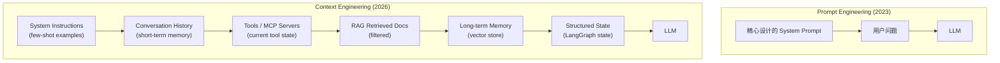
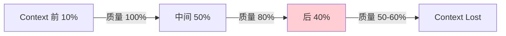
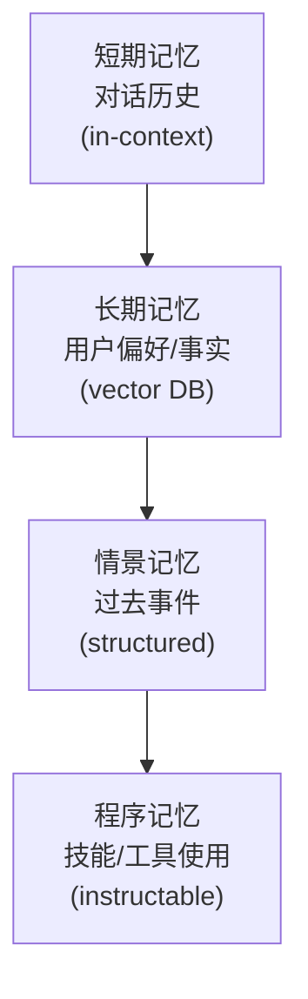
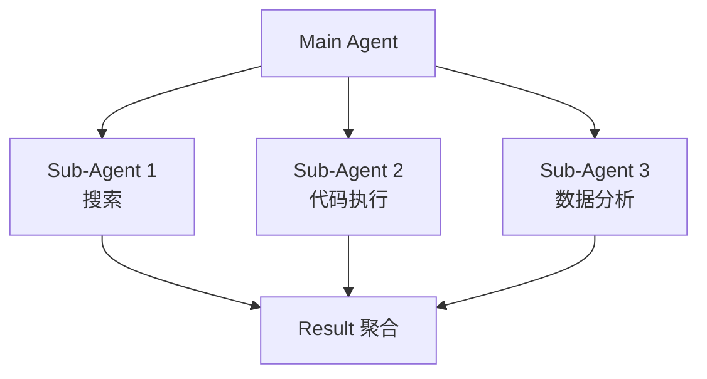

# 第 29 章 Context Engineering ⭐⭐⭐⭐

> **面试频率**：高（2026年 Agent 工程师必考）| **难度**：⭐⭐⭐⭐ | **核心范式**：Context is the new code
>
> **🆕 2026年新主题**：从 Prompt Engineering 演进到 Context Engineering。Anthropic 倡导 "Context window is the most important resource"，Haystack 2.x 推出 context-engineered pipelines，LangGraph 持久化，Pydantic AI 内存原语。

Context Engineering 是 Prompt Engineering 的自然演进。2026 年，Anthropic 等公司明确提出：**Prompt 只是一次性指令，Context 是模型在每一步推理时所看到的所有信息**。优秀的 Context Engineering 能让小模型在特定任务上击败大模型。

---

## 29.1 从 Prompt 到 Context



**核心洞察**: Context = Prompt + History + Tools + RAG + Memory + State。

---

## 29.2 Context 的四大组成

### 29.2.1 Instructions (指令)

- System prompt
- Few-shot examples
- Tool definitions
- Output format spec

### 29.2.2 Knowledge (知识)

- RAG 检索结果
- User-uploaded documents
- Database query results
- Web search results

### 29.2.3 Tools (工具)

- Available MCP servers
- Function schemas
- Current tool state
- Recent tool outputs

### 29.2.4 State (状态)

- Conversation history
- Long-term memory
- Structured state (LangGraph)
- Sub-agent results

---

## 29.3 上下文窗口经济学

### 29.3.1 Token 经济学公式

```
总成本 = 输入tokens × 输入价 + 输出tokens × 输出价
延迟 = TTFT (Prefill) + TPOT × 输出tokens
质量 = f(模型能力, Context Quality)
```

| Context 长度 | Claude 4 | Gemini 2.5 | GPT-5 |
|------------|----------|-----------|-------|
| 标准 | 200K | 1M | 1M |
| 扩展 | 1M (β) | 2M | - |

### 29.3.2 Context 衰减现象 (Context Rot)



**经验法则**: 即使 200K context，模型对中后段信息关注度显著下降。Chromium 研究显示 64K 后质量下降明显。

---

## 29.4 压缩与裁剪策略

### 29.4.1 三大策略对比

| 策略 | 原理 | 优势 | 劣势 |
|------|------|------|------|
| **Summarization** | LLM 生成历史摘要 | 保留语义 | 需额外 LLM 调用 |
| **Sliding Window** | 只保留最近 K 轮 | 简单 | 丢失早期信息 |
| **Compaction** | 关键事实抽取 | 保留事实 | 需规则定义 |

### 29.4.2 LangGraph 持久化示例

```python
from langgraph.checkpoint.memory import MemorySaver
from langgraph.graph import StateGraph

# 持久化状态 - 即使 LLM "忘记"，state 仍保留
memory = MemorySaver()

workflow = StateGraph(AgentState)
workflow.add_node("agent", call_model)
workflow.add_node("tools", ToolNode(tools))
workflow.set_entry_point("agent")
workflow.add_conditional_edges("agent", should_continue, {"tools": "tools", "end": END})
workflow.add_edge("tools", "agent")

app = workflow.compile(checkpointer=memory)

# 多轮对话
config = {"configurable": {"thread_id": "user-123"}}
result1 = app.invoke({"messages": [...]}, config)
result2 = app.invoke({"messages": [...]}, config)  # 状态保留
```

---

## 29.5 记忆系统设计

### 29.5.1 记忆分层架构



### 29.5.2 Pydantic AI 内存原语

```python
from pydantic_ai import Agent
from pydantic_ai.memory import MemoryTool

agent = Agent(
    'openai:gpt-4o',
    memory=[
        MemoryTool(load_recent_messages, top_k=10),
        MemoryTool(load_user_preferences, vector_search=True),
    ]
)
```

---

## 29.6 Sub-Agent 模式



**优势**: 
- 每个 sub-agent 拥有干净的 context
- 并行执行
- 错误隔离

**代表实现**: Claude Code / Cursor Agent / Devin。

---

## 29.7 Context Caching (提示缓存)

| 提供方 | 缓存时长 | 价格折扣 |
|--------|---------|---------|
| **Anthropic** | 5min / 1hr | 写入×1.25, 读取×0.1 |
| **OpenAI** | 自动 (5-10min) | 自动 |
| **Gemini** | 显式 (1hr) | 免费 cache hit |

**最佳实践**: 把稳定的 system prompt + few-shot 放在缓存前缀。

---

## 29.8 Haystack 2.x Context-Engineered Pipelines

```python
from haystack import Pipeline
from haystack.components.builders import ChatPromptBuilder
from haystack.components.generators import OpenAIGenerator
from haystack.components.retrievers import InMemoryBM25Retriever

# Context-engineered pipeline
pipe = Pipeline()
pipe.add_component("retriever", InMemoryBM25Retriever(document_store=doc_store))
pipe.add_component("prompt_builder", ChatPromptBuilder(template=template))
pipe.add_component("llm", OpenAIGenerator(model="gpt-4o"))

pipe.connect("retriever.documents", "prompt_builder.documents")
pipe.connect("prompt_builder.prompt", "llm.messages")

result = pipe.run({
    "retriever": {"query": query},
    "prompt_builder": {"question": query}
})
```

---

## 29.9 面试真题精讲 🎯

### 🎯 高频题1: Context Engineering 与 Prompt Engineering 区别？

**答案**: Prompt Engineering 关注**单次指令**的优化；Context Engineering 关注模型在每一步推理时**所看到的所有信息**的管理——包括 history、tools、memory、RAG、state。一个优秀的 Context Engineer 关注 4 件事：放什么 (what)、何时放 (when)、怎么放 (how)、何时不放 (when not)。

### 🎯 高频题2: 200K context 是否真的能用？

**答案**: 实际有效长度远小于标称。Context Rot 现象表明，模型对中后段信息的关注度持续下降。经验：64K 内效果良好，64K-200K 中段质量下降，超 200K 后段几乎"忘记"。建议：长 context ≠ 高质量，需结合检索/压缩。

### 🎯 高频题3: Sub-Agent 模式优缺点？

**答案**:
- 优点: 干净 context、并行执行、错误隔离、Token 经济
- 缺点: 协调开销、调试复杂、共享状态困难
- 适用: 复杂多步任务；不适用: 简单单步任务

### 🎯 高频题4: Prompt Caching 的最佳实践？

**答案**:
1. 缓存前缀放稳定的 system prompt + few-shot
2. 把变化的部分放在缓存前缀之后
3. 利用多轮对话的累积 prefix
4. Anthropic 缓存可省 90% token 成本

### 🎯 高频题5: Context Compaction 怎么做？

**答案**:
1. **触发条件**: token 超过窗口 X% 时
2. **方法**: LLM 总结历史 + 关键事实抽取
3. **保留**: 用户偏好/关键事实/最近 N 轮
4. **LangGraph 实现**: 持久化 state + summarization node

### 🎯 高频题6: Agent 记忆系统的设计原则？

**答案**:
1. 分层: 短期/长期/情景/程序
2. 选择性: 不是所有信息都值得记忆
3. 可检索: 向量化 + metadata
4. 可更新: 记忆会过时，需要清理
5. 隐私: 敏感信息需脱敏

### 🎯 高频题7: Haystack 与 LangChain/LlamaIndex 区别？

**答案**:
- **Haystack 2.x**: 强调 context-engineered pipelines、组件化、production-ready
- **LangChain**: 通用 LLM 框架，覆盖面广
- **LlamaIndex**: 专注 RAG
- 2026 趋势: Haystack 在企业级 RAG 中份额上升

### 🎯 高频题8: 如何设计一个高效的 Context Pipeline？

**答案**:
1. **输入层**: 清洗/分类查询意图
2. **检索层**: RAG + Rerank，Top-3
3. **压缩层**: 长文档分块+摘要
4. **组装层**: Template + Few-shot + RAG + Memory
5. **输出层**: 结构化 + 后处理

---

## 29.10 本章小结

> **章节小结**：Context Engineering 是 Prompt Engineering 在 2026 年的自然演进，强调模型每步推理时所见**所有信息**（指令、知识、工具、状态）的管理。核心挑战是 Context Rot——即使 200K context，模型对中后段信息关注度仍持续下降。关键技术包括：LangGraph 持久化 checkpoint 解决长会话状态丢失；Sub-Agent 模式为每个子任务提供干净 Context；Compaction/Summarization 解决窗口溢出；Prompt Caching (Anthropic 5min/1hr) 节省 90% token 成本；Haystack 2.x 提供 context-engineered pipelines。Anthropic 明确指出："Context window is the most important resource"。面试考点：Context Engineering 与 Prompt Engineering 区别、Context Rot 现象、Sub-Agent 优缺点、Prompt Caching 最佳实践。

## 29.11 本章速查表

| 概念 | 关键点 |
|------|--------|
| **Context Engineering** | 超越 Prompt Engineering 的全栈方法 |
| **Context Rot** | 长 context 质量衰减 |
| **Sub-Agent** | 干净 context 的子代理 |
| **Compaction** | 历史摘要压缩 |
| **Prompt Caching** | 节省 90% token 成本 |
| **LangGraph Checkpointer** | 持久化 state |
| **Haystack 2.x** | context-engineered pipelines |
| **Memory Layers** | 短/长/情景/程序记忆 |

---

## 📚 相关章节

- [[13_Prompt_Engineering]] — Prompt Engineering 基础，Context Engineering 的前置
- [[15_Agent智能体开发]] — Agent 上下文管理，ReAct/Function Calling 的 Context 组装
- [[14_RAG检索增强生成]] — RAG 作为 Context 来源，检索结果注入到 prompt
- [[20_LLMOps与模型可观测性]] — Token 成本监控，Context 大小直接影响成本
- [[18_LLM工程框架实战]] — Haystack/LangGraph 框架实现 context-engineered pipelines
- [[25_推理引擎与高性能服务]] — 推理引擎如何高效管理 Context (KV Cache, Prefix Cache)
