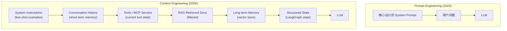
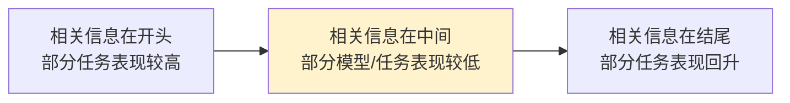
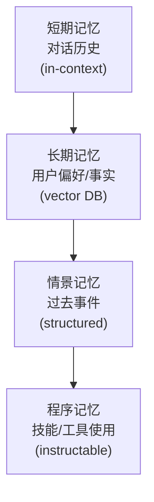
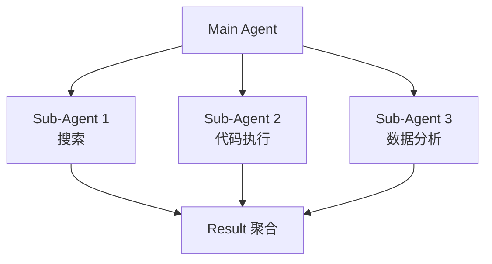

# 第 29 章 Context Engineering ⭐⭐⭐⭐

> **面试频率**：高 | **难度**：⭐⭐⭐⭐ | **核验日期**：2026-07-31
>
> **定义边界**：Context Engineering 关注推理时进入上下文窗口的全部 token，而不只是
> prompt 文案；实践包括检索、工具结果、消息历史、状态、压缩与记忆。参见
> [Anthropic 的定义](https://www.anthropic.com/engineering/effective-context-engineering-for-ai-agents)。

Context Engineering 是 Prompt Engineering 的自然演进。它解决的问题是：在有限窗口和成本预算内，
每一步应该给模型哪些高信号信息、按什么顺序给、何时检索或压缩，以及哪些内容不应进入上下文。
其收益必须用目标任务评测，不能笼统承诺“小模型一定超过大模型”。

---

## 29.1 从 Prompt 到 Context



**核心洞察**: Context = Prompt + History + Tools + RAG + Memory + State。

---

## 29.2 Context 的四大组成

### 29.2.1 Instructions (指令)

- System prompt
- Few-shot examples
- Tool definitions
- Output format spec

### 29.2.2 Knowledge (知识)

- RAG 检索结果
- User-uploaded documents
- Database query results
- Web search results

### 29.2.3 Tools (工具)

- Available MCP servers
- Function schemas
- Current tool state
- Recent tool outputs

### 29.2.4 State (状态)

- Conversation history
- Long-term memory
- Structured state (LangGraph)
- Sub-agent results

---

## 29.3 上下文窗口经济学

### 29.3.1 Token 经济学公式

```
总成本 = 未缓存输入 + 缓存写入 + 缓存读取 + 输出 + 缓存存储/工具/基础设施
端到端延迟 = 排队 + TTFT（含 prefill）+ TPOT × 输出tokens + 工具调用
质量 = f(模型快照, 任务, 上下文长度/位置/结构, 干扰项, 解码配置)
```

模型窗口、区域可用性和计价变化很快，不在教程中冻结一张“永久有效”的数值表。部署前应逐项核验：

| 核验项 | 为什么不能只看宣传窗口 |
|---|---|
| 精确模型 ID / 快照 | 同一家族不同快照的窗口、输入类型和缓存规则可能不同 |
| 最大输入与最大输出 | “上下文窗口”通常包含输入、输出及部分工具内容，口径需看 API 文档 |
| 超长上下文计价 | 部分提供方在阈值后采用不同费率，区域/服务层也可能影响价格 |
| 目标任务有效性 | API 能接收不等于模型能可靠利用；必须做位置、长度和干扰项评测 |

当前入口：[OpenAI 模型目录](https://developers.openai.com/api/docs/models)、
[Claude 模型概览](https://platform.claude.com/docs/en/about-claude/models/overview)、
[Gemini 模型目录](https://ai.google.dev/gemini-api/docs/models)。

### 29.3.2 Context 衰减现象 (Context Rot)



这里必须区分两个现象：

- [Lost in the Middle](https://aclanthology.org/2024.tacl-1.9/) 在多文档问答和键值检索中观察到：
  相关信息位于开头或结尾时常优于位于中间，呈任务相关的 U 型位置效应。
- [Chroma Context Rot](https://www.trychroma.com/research/context-rot) 控制任务复杂度并改变输入长度、
  语义相似度、干扰项和文本结构，观察到长度增加时性能会变得更不可靠；但其特定 NIAH
  设置并未观察到显著的位置差异。

因此不存在适用于所有模型的 `64K`、`200K` 质量分界，也不能断言“尾部几乎忘记”。
配套 `03_context_rot_demo.py` 只画一条**合成教学 U 型曲线**，不是任何模型的测量结果。

真实评测至少应固定模型快照和解码配置，交叉改变：

1. 输入长度与证据位置（覆盖首/中/尾多个位置）；
2. 词面匹配与语义匹配；
3. 无干扰、单干扰和多干扰；
4. 连贯与打乱的 haystack；
5. 多个样本/随机种子，并报告准确率、拒答率、置信区间、延迟和实际 token 成本。

---

## 29.4 压缩与裁剪策略

### 29.4.1 三大策略对比

| 策略 | 原理 | 优势 | 劣势 |
|------|------|------|------|
| **Summarization** | LLM 生成历史摘要 | 保留语义 | 需额外 LLM 调用 |
| **Sliding Window** | 只保留最近 K 轮 | 简单 | 丢失早期信息 |
| **Compaction** | 关键事实抽取 | 保留事实 | 需规则定义 |

### 29.4.2 LangGraph 持久化示例

```python
from langgraph.checkpoint.memory import MemorySaver
from langgraph.graph import StateGraph

# 持久化状态 - 即使 LLM "忘记"，state 仍保留
memory = MemorySaver()

workflow = StateGraph(AgentState)
workflow.add_node("agent", call_model)
workflow.add_node("tools", ToolNode(tools))
workflow.set_entry_point("agent")
workflow.add_conditional_edges("agent", should_continue, {"tools": "tools", "end": END})
workflow.add_edge("tools", "agent")

app = workflow.compile(checkpointer=memory)

# 多轮对话
config = {"configurable": {"thread_id": "user-123"}}
result1 = app.invoke({"messages": [...]}, config)
result2 = app.invoke({"messages": [...]}, config)  # 状态保留
```

---

## 29.5 记忆系统设计

### 29.5.1 记忆分层架构



### 29.5.2 Pydantic AI 消息历史（当前官方 API）

```python
import os

from pydantic_ai import Agent, ModelMessagesTypeAdapter
from pydantic_core import to_json

agent = Agent(os.environ["PYDANTIC_AI_MODEL"])

first = agent.run_sync("记住：我的发布窗口是周三。")
serialized = to_json(first.all_messages())

# 实际应用把 serialized 存入受信任的服务端存储；下一轮再恢复并传入。
history = ModelMessagesTypeAdapter.validate_json(serialized)
second = agent.run_sync("发布窗口是哪天？", message_history=history)
```

Pydantic AI 当前公开 API 没有上述旧稿中虚构的 `pydantic_ai.memory.MemoryTool`。框架本身的
run 是无状态的：应用负责持久化 `all_messages()`，下一轮通过 `message_history` 恢复。
如需裁剪，可用官方 `ProcessHistory` capability；但不能机械切断 tool call / tool result 对。
长期偏好、向量检索和删除策略仍属于应用层设计。客户端提交的历史是不可信输入，进入 agent 前应清洗。
参见 [Pydantic AI Messages and chat history](https://ai.pydantic.dev/message-history/)。

---

## 29.6 Sub-Agent 模式



**优势**: 
- 每个 sub-agent 拥有干净的 context
- 并行执行
- 错误隔离

代价是额外调用、协调状态和汇总信息可能增加总 token 与延迟；是否更省需要实测。

**代表实现**: Claude Code / Cursor Agent / Devin。

---

## 29.7 Context Caching (提示缓存)

以下为 2026-07-31 官方文档口径；上线前仍需重新核对模型与价格页：

| 提供方 | 当前机制与时效 | 成本边界 |
|---|---|---|
| **Anthropic** | 自动或显式 breakpoint；默认 5 分钟，可选 1 小时 | 相对基础输入价：5 分钟写入 `1.25×`、1 小时写入 `2×`、读取 `0.1×` |
| **OpenAI（GPT-5.6+）** | 默认 implicit，也可显式 breakpoint；`ttl` 表示最短生命周期，当前唯一值/默认值为 `30m`，服务可能保留更久 | 写入 `1.25×` 未缓存输入价；命中按 cached-input 价，需查目标模型价格页 |
| **Gemini（2.5+）** | implicit 默认启用但不保证命中；Generate Content 可显式缓存，默认 TTL 1 小时 | implicit 命中才传递折扣；显式缓存另计 token 存储时长，绝非“免费命中” |

官方依据：[Anthropic Prompt Caching](https://platform.claude.com/docs/en/build-with-claude/prompt-caching)、
[OpenAI Prompt Caching](https://developers.openai.com/api/docs/guides/prompt-caching)、
[Gemini implicit caching](https://ai.google.dev/gemini-api/docs/caching) 与
[Gemini Generate Content explicit caching](https://ai.google.dev/gemini-api/docs/generate-content/caching)。

**最佳实践**：把完全稳定的 system prompt、few-shot 和工具 schema 放在前缀，动态内容放在后缀；
记录 cache-write/cache-read token、命中率和 TTL。`0.1×` 只表示 Anthropic **已命中的输入 token**
相对基础输入价便宜 90%，不等于整次请求或整套系统总成本下降 90%；首次写入、未命中输入、
输出、存储、工具和基础设施仍会计费。

---

## 29.8 Haystack 2.x Context-Engineered Pipelines

```python
import os

from haystack import Pipeline
from haystack.components.builders import ChatPromptBuilder
from haystack.components.generators import OpenAIGenerator
from haystack.components.retrievers import InMemoryBM25Retriever

# Context-engineered pipeline
pipe = Pipeline()
pipe.add_component("retriever", InMemoryBM25Retriever(document_store=doc_store))
pipe.add_component("prompt_builder", ChatPromptBuilder(template=template))
pipe.add_component("llm", OpenAIGenerator(model=os.environ["OPENAI_MODEL"]))

pipe.connect("retriever.documents", "prompt_builder.documents")
pipe.connect("prompt_builder.prompt", "llm.messages")

result = pipe.run({
    "retriever": {"query": query},
    "prompt_builder": {"question": query}
})
```

---

## 29.9 面试真题精讲 🎯

### 🎯 高频题1: Context Engineering 与 Prompt Engineering 区别？

**答案**: Prompt Engineering 关注**单次指令**的优化；Context Engineering 关注模型在每一步推理时**所看到的所有信息**的管理——包括 history、tools、memory、RAG、state。一个优秀的 Context Engineer 关注 4 件事：放什么 (what)、何时放 (when)、怎么放 (how)、何时不放 (when not)。

### 🎯 高频题2: 200K context 是否真的能用？

**答案**：先区分“API 可接收长度”和“目标任务有效长度”。后者没有跨模型通用的
`64K/200K` 阈值，且同时受证据位置、语义相似度、干扰项和结构影响。应在目标模型快照上做
长度 × 位置 × 干扰项评测，再决定直接长上下文、RAG、压缩或分工给 sub-agent。

### 🎯 高频题3: Sub-Agent 模式优缺点？

**答案**:
- 优点: 干净 context、可并行、错误隔离、减少主 agent 的上下文污染
- 缺点: 额外调用可能增加总 token/延迟，协调、调试和共享状态更复杂
- 适用: 复杂多步任务；不适用: 简单单步任务

### 🎯 高频题4: Prompt Caching 的最佳实践？

**答案**:
1. 缓存前缀放稳定的 system prompt + few-shot
2. 把变化的部分放在缓存前缀之后
3. 保证缓存边界前完全一致，并按提供方设置 key / breakpoint / TTL
4. 监控写入、读取、未命中和输出成本；不能把“命中 token 折扣”当成“总成本折扣”

### 🎯 高频题5: Context Compaction 怎么做？

**答案**:
1. **触发条件**: token 超过窗口 X% 时
2. **方法**: LLM 总结历史 + 关键事实抽取
3. **保留**: 用户偏好/关键事实/最近 N 轮
4. **LangGraph 实现**: 持久化 state + summarization node

### 🎯 高频题6: Agent 记忆系统的设计原则？

**答案**:
1. 分层: 短期/长期/情景/程序
2. 选择性: 不是所有信息都值得记忆
3. 可检索: 向量化 + metadata
4. 可更新: 记忆会过时，需要清理
5. 隐私: 敏感信息需脱敏

### 🎯 高频题7: Haystack 与 LangChain/LlamaIndex 区别？

**答案**:
- **Haystack 2.x**: 组件化 Pipeline，适合显式连接检索、模板和生成器
- **LangChain**: 通用 LLM 框架，覆盖面广
- **LlamaIndex**: 专注 RAG
- 选型需用团队维护能力、连接器、可观测性、部署边界和基准验证，不凭未经来源支持的“份额”判断

### 🎯 高频题8: 如何设计一个高效的 Context Pipeline？

**答案**:
1. **输入层**: 清洗/分类查询意图
2. **检索层**: RAG + Rerank，Top-3
3. **压缩层**: 长文档分块+摘要
4. **组装层**: Template + Few-shot + RAG + Memory
5. **输出层**: 结构化 + 后处理

---

## 29.10 本章小结

> **章节小结**：Context Engineering 管理推理时可见的指令、知识、工具结果、历史和状态。
> 标称窗口不等于任务有效窗口；Context Rot 与 Lost in the Middle 都必须绑定模型、任务和评测条件。
> 长会话可组合 checkpoint、检索、compaction、结构化笔记与 sub-agent。Prompt Caching
> 只能复用完全匹配的稳定前缀，收益取决于写入成本、命中率、TTL、输出与存储等总账。

## 29.11 本章速查表

| 概念 | 关键点 |
|------|--------|
| **Context Engineering** | 超越 Prompt Engineering 的全栈方法 |
| **Context Rot** | 长度增加时性能可能非均匀退化；没有通用 token 阈值 |
| **Sub-Agent** | 干净 context 的子代理 |
| **Compaction** | 历史摘要压缩 |
| **Prompt Caching** | 复用稳定前缀；按提供方规则核算写入、读取、存储与未命中 |
| **LangGraph Checkpointer** | 持久化 state |
| **Haystack 2.x** | context-engineered pipelines |
| **Memory Layers** | 短/长/情景/程序记忆 |
| **配套代码** | `ch29_context_engineering/llm/*.py`；默认离线验收，真实 API 需显式配置 |

## 29.x 配套代码与验收边界

本章包含两类示例：纯离线教学模型，以及需要可选依赖/真实提供方配置的集成示例。
离线计算不冒充线上模型测量；其中 `03_context_rot_demo.py` 明确输出合成位置偏差示意，
`10_prompt_caching.py` 只按官方倍率展示输入侧算式，不冻结某个模型的美元标价。

```bash
# 从 code/ 目录运行
python ch29_context_engineering/llm/03_context_rot_demo.py
python ch29_context_engineering/llm/08_pydantic_ai_memory.py
python ch29_context_engineering/llm/09_sub_agent_pattern.py   # Sub-Agent 干净 context
python ch29_context_engineering/llm/07_langgraph_compaction.py # Compaction/Summarization
python ch29_context_engineering/llm/10_prompt_caching.py       # Prompt Caching
```

真实 API、外部数据库和远程模型不属于默认离线验收；启用前请显式配置目标提供方、模型与凭据。

---

## 📚 相关章节

- [[13_Prompt_Engineering]] — Prompt Engineering 基础，Context Engineering 的前置
- [[15_Agent智能体开发]] — Agent 上下文管理，ReAct/Function Calling 的 Context 组装
- [[14_RAG检索增强生成]] — RAG 作为 Context 来源，检索结果注入到 prompt
- [[20_LLMOps与模型可观测性]] — Token 成本监控，Context 大小直接影响成本
- [[18_LLM工程框架实战]] — Haystack/LangGraph 框架实现 context-engineered pipelines
- [[25_推理引擎与高性能服务]] — 推理引擎如何高效管理 Context (KV Cache, Prefix Cache)
