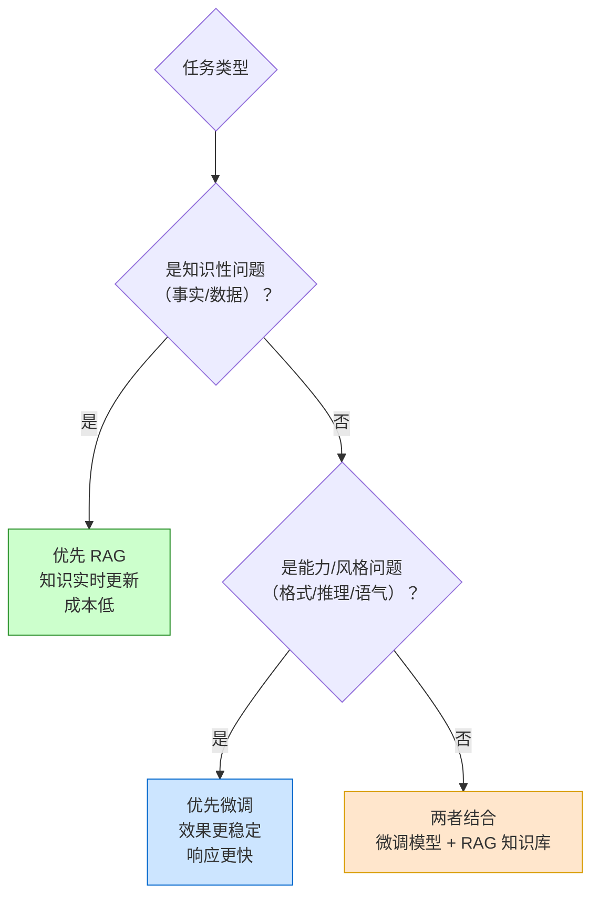
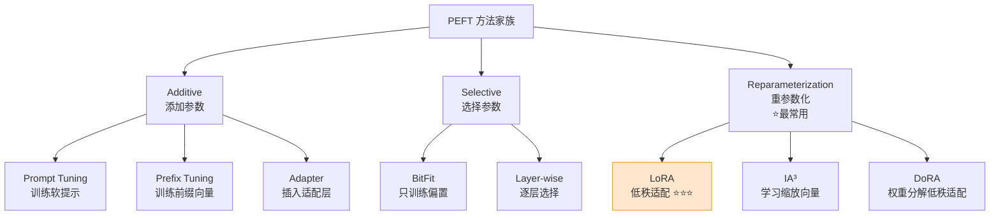
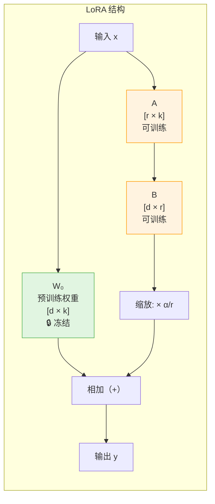
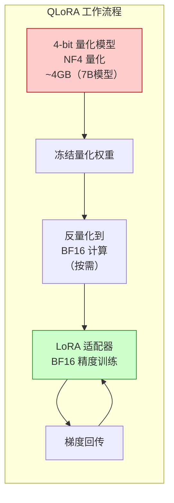
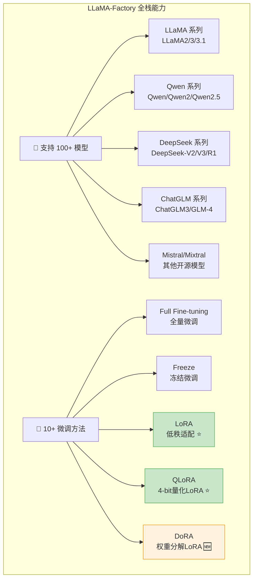

# 第 30 章 SFT、LoRA 与 QLoRA ⭐⭐⭐⭐
> [!abstract] 本章导航
> **定位**：第五部分 数据、训练、对齐、评估与安全中的第 30 章；围绕“SFT、LoRA 与 QLoRA”建立单一、可追踪的知识主线。
>
> **先修**：[[29_大模型数据工程|第 29 章 大模型数据工程]]。
>
> **学习目标**：
> - 解释 微调概述 ⭐⭐⭐⭐ 的核心问题、机制与适用边界。
> - 实现或评估 LoRA 与 QLoRA ⭐⭐⭐⭐⭐ 的最小闭环。
> - 使用可复现证据诊断 LLaMA-Factory 全栈微调 ⭐⭐⭐⭐⭐ 的工程取舍与失败模式。
>
> **建议路径**：微调概述 ⭐⭐⭐⭐ → LoRA 与 QLoRA ⭐⭐⭐⭐⭐ → LLaMA-Factory 全栈微调 ⭐⭐⭐⭐⭐。
>
> **配套代码**：`code/ch30_lora_qlora/`。

本章先回答“微调概述 ⭐⭐⭐⭐”为什么成立，再沿着机制、实现、评估和边界逐步展开。阅读时先建立因果链，再运行或推演示例，最后用章末自测检查能否脱离原文复述。
## 30.1 微调概述 ⭐⭐⭐⭐

### 30.1.1 为什么需要微调

微调（Fine-tuning）是在预训练大模型的基础上，使用特定领域或任务的数据继续训练，使模型适应特定场景。

**需要微调的场景**：

| 场景 | 说明 | 替代方案 |
|------|------|---------|
| **垂直领域知识** | 医疗、法律、金融等专业领域 | RAG（知识性内容优先用 RAG）|
| **特定输出格式** | JSON、SQL、特定代码风格 | Few-shot Prompting |
| **品牌语气** | 企业特定的语言风格 | 微调效果更稳定 |
| **推理能力增强** | 数学、逻辑推理能力 | 需要大量推理数据微调 |
| **长上下文适配** | 适应超长文档理解 | 与位置编码扩展结合 |

**微调 vs RAG 的选择原则**：



### 30.1.2 全量微调 vs PEFT

| 维度 | 全量微调（Full Fine-tuning） | PEFT（参数高效微调）|
|------|---------------------------|-------------------|
| **训练参数** | 全部参数 | 由 rank、目标模块和方法决定，通常远少于全量 |
| **显存需求** | 需保存全部可训练参数及优化器状态 | 通常更低；仍取决于模型、序列、batch、精度与量化 |
| **训练速度** | 基线 | 可能减少反向与通信开销；端到端耗时必须实测 |
| **效果** | 容量上限高，但不保证优于 PEFT | 依任务、数据和目标模块而定 |
| **灾难性遗忘** | 风险取决于数据和训练配方 | 冻结基座可降低部分风险，不等于免疫 |
| **存储成本** | 每个任务保存完整 checkpoint | 每个任务保存 adapter；大小由 rank/模块决定 |

**PEFT 主要方法家族**：



## 30.2 LoRA 与 QLoRA ⭐⭐⭐⭐⭐

### 30.2.1 LoRA 数学原理

LoRA（Low-Rank Adaptation）的核心洞察：**模型权重的更新是低秩的**。

对于预训练权重矩阵 $W_0 \in \mathbb{R}^{d \times k}$，微调时不直接更新 $W_0$，而是引入一对低秩矩阵：

$$
W = W_0 + \Delta W = W_0 + BA
$$

其中 $B \in \mathbb{R}^{d \times r}$，$A \in \mathbb{R}^{r \times k}$，$r \ll \min(d, k)$（典型 $r = 8, 16, 32, 64$）。



**参数量对比**：

| 配置 | 原始参数量 | LoRA 参数量 | 比例 |
|------|-----------|-------------|------|
| 7B 模型, r=16 | 7,000 M | ~33 M | 0.47% |
| 7B 模型, r=64 | 7,000 M | ~131 M | 1.87% |
| 13B 模型, r=16 | 13,000 M | ~50 M | 0.38% |
| 70B 模型, r=16 | 70,000 M | ~100 M | 0.14% |

**缩放因子 $\alpha$**：

$$h = W_0 x + \frac{\alpha}{r} \cdot BAx$$

$\alpha/r$ 是适配器分支的缩放系数。它只缩放 $BAx$，不能据此断言 LoRA 分支与
原始权重“影响力相当”，也不能脱离初始化、学习率、rank、目标模块和数据给出任务选择规则。

### 30.2.2 LoRA 实战代码

```python
"""
使用 PEFT 库进行 LoRA 微调 - 完整实战
"""
import torch
from transformers import (
    AutoModelForCausalLM,
    AutoTokenizer,
    TrainingArguments,
    DataCollatorForSeq2Seq,
    Trainer
)
from peft import LoraConfig, get_peft_model, prepare_model_for_kbit_training, TaskType
from datasets import Dataset

# ========== Step 1: 加载模型和分词器 ==========

model_name = "Qwen/Qwen2.5-7B-Instruct"  # 或其他模型

tokenizer = AutoTokenizer.from_pretrained(model_name, trust_remote_code=True)

# 加载模型（bfloat16 节省显存）
model = AutoModelForCausalLM.from_pretrained(
    model_name,
    torch_dtype=torch.bfloat16,
    device_map="auto",           # 自动分配 GPU/CPU
    trust_remote_code=True,
)

print(f"模型加载完成，原始参数量: {sum(p.numel() for p in model.parameters()) / 1e6:.1f}M")

# ========== Step 2: 配置 LoRA ==========

lora_config = LoraConfig(
    r=16,                        # LoRA 秩
    lora_alpha=32,               # 缩放因子 = alpha / r = 2
    target_modules=[             # 应用 LoRA 的模块（不同模型名称不同）
        "q_proj",                # Query 投影
        "k_proj",                # Key 投影
        "v_proj",                # Value 投影
        "o_proj",                # Output 投影
        "gate_proj",             # MLP Gate 投影
        "up_proj",               # MLP Up 投影
        "down_proj",             # MLP Down 投影
    ],
    lora_dropout=0.05,           # LoRA 层的 Dropout
    bias="none",                 # 不训练偏置
    task_type=TaskType.CAUSAL_LM,
    # 推理时可将 LoRA 权重合并回原模型（merge_and_unload）
)

# 应用 LoRA
model = get_peft_model(model, lora_config)

# 打印可训练参数
model.print_trainable_parameters()
# 输出示例：trainable params: 33,554,432 || all params: 7,000,000,000 || trainable%: 0.479

# ========== Step 3: 准备训练数据 ==========

def format_instruction(sample: dict) -> str:
    """将样本格式化为指令格式"""
    return f"""<|im_start|>system
你是一个专业的客服助手。<|im_end|>
<|im_start|>user
{sample['instruction']}<|im_end|>
<|im_start|>assistant
{sample['output']}<|im_end|>"""


# 准备示例数据
train_data = [
    {
        "instruction": "你们的退换货政策是什么？",
        "output": "我们支持7天无理由退货。商品需保持原状，附完整包装。退货申请通过后，款项将在3-5个工作日内原路退回。"
    },
    {
        "instruction": "订单多久能到？",
        "output": "一般下单后24小时内发货，国内快递3-5天送达，偏远地区可能需要5-7天。您可以在订单详情页查看实时物流信息。"
    },
    # ... 更多数据（实际训练需要 1000+ 条）
]

# 格式化并编码
def preprocess(samples):
    texts = [format_instruction(s) for s in samples]
    model_inputs = tokenizer(
        texts,
        max_length=512,
        truncation=True,
        padding="max_length",
    )
    # 对于 Causal LM，labels = input_ids（预测下一个 token）
    model_inputs["labels"] = model_inputs["input_ids"].copy()
    return model_inputs

dataset = Dataset.from_list(train_data)
tokenized_dataset = dataset.map(
    lambda samples: preprocess([samples]),
    batched=False,
    remove_columns=dataset.column_names,
)

# ========== Step 4: 训练配置 ==========

training_args = TrainingArguments(
    output_dir="./lora_output",
    num_train_epochs=3,
    per_device_train_batch_size=4,      # 根据显存调整
    gradient_accumulation_steps=4,       # 有效 batch_size = 4 * 4 = 16
    learning_rate=2e-4,                  # LoRA 通常用较大学习率
    max_grad_norm=0.3,                   # 梯度裁剪
    warmup_ratio=0.03,                   # 预热比例
    lr_scheduler_type="cosine",          # 余弦退火
    logging_steps=10,
    save_strategy="epoch",
    fp16=False,
    bf16=True,                           # 需支持 BF16 的硬件（如 NVIDIA Ampere 及更新架构）
    optim="paged_adamw_32bit",           # 分页优化器（节省显存）
    group_by_length=True,                # 相近长度样本分组，提升效率
    report_to="none",
)

# ========== Step 5: 开始训练 ==========

trainer = Trainer(
    model=model,
    args=training_args,
    train_dataset=tokenized_dataset,
    data_collator=DataCollatorForSeq2Seq(tokenizer, pad_to_multiple_of=8),
)

trainer.train()

# ========== Step 6: 保存 LoRA 权重 ==========

model.save_pretrained("./lora_output/final")
tokenizer.save_pretrained("./lora_output/final")

# ========== Step 7: 推理测试 ==========

def generate_response(model, tokenizer, instruction: str) -> str:
    """使用微调后的模型生成回答"""
    prompt = f"""<|im_start|>system\n你是一个专业的客服助手。<|im_end|>
<|im_start|>user\n{instruction}<|im_end|>
<|im_start|>assistant\n"""

    inputs = tokenizer(prompt, return_tensors="pt").to(model.device)

    outputs = model.generate(
        **inputs,
        max_new_tokens=256,
        temperature=0.7,
        top_p=0.9,
        do_sample=True,
    )

    response = tokenizer.decode(outputs[0], skip_special_tokens=True)
    # 提取 assistant 部分
    return response.split("assistant")[-1].strip()

# 测试
test_query = "你们的退换货政策是什么？"
response = generate_response(model, tokenizer, test_query)
print(f"Q: {test_query}")
print(f"A: {response}")

# ========== Step 8: 合并 LoRA 到原模型（可选）==========

# 合并后可以直接用原始模型方式推理，无需 PEFT 库
merged_model = model.merge_and_unload()
merged_model.save_pretrained("./merged_model")
```

### 30.2.3 QLoRA：4-bit 量化 + LoRA ⭐⭐⭐⭐⭐

QLoRA 将 LoRA 与 4-bit 量化结合，实现**单卡消费级 GPU 微调 7B/13B 模型**。



**QLoRA 关键技术**：

| 技术 | 说明 | 作用 |
|------|------|------|
| **4-bit NormalFloat (NF4)** | QLoRA 论文面向正态分布权重设计的 4-bit 数据类型 | 质量需按模型与任务回归 |
| **Double Quantization** | 对量化常数再次量化 | 减少量化常数的平均存储开销 |
| **Paged Optimizer** | 通过统一内存分页处理显存峰值 | 缓解长序列/小批次下的瞬时 OOM 风险 |

```python
# QLoRA 配置（只需修改模型加载部分）
from transformers import BitsAndBytesConfig

# 4-bit 量化配置
bnb_config = BitsAndBytesConfig(
    load_in_4bit=True,                           # 启用 4-bit 量化
    bnb_4bit_quant_type="nf4",                   # NF4 量化类型
    bnb_4bit_compute_dtype=torch.bfloat16,       # 计算时用 bf16
    bnb_4bit_use_double_quant=True,              # 二次量化
)

model = AutoModelForCausalLM.from_pretrained(
    model_name,
    quantization_config=bnb_config,  # 使用量化配置
    device_map="auto",
    trust_remote_code=True,
)

# 准备模型用于量化训练（必须！）
model = prepare_model_for_kbit_training(model)

# 然后正常应用 LoRA 配置
model = get_peft_model(model, lora_config)

# 训练参数相同
# 不给“7B=固定显存”结论：峰值还取决于具体架构、目标模块、rank、
# 序列长度、micro-batch、梯度累积、checkpointing、量化元数据和内核工作区。
# 在目标配置上记录 torch.cuda.max_memory_allocated() 与端到端训练吞吐。
```

### 30.2.4 LoRA 超参数调优指南

| 超参数 | 推荐值 | 影响 | 调优建议 |
|--------|--------|------|---------|
| **r (rank)** | 8-64 | 表达能力 | 简单任务 8-16，复杂任务 32-64 |
| **alpha** | 2r | 缩放强度 | 通常设为 2r，效果与 r 不匹配时调整 |
| **target_modules** | q/v_proj 或全部 | 训练范围 | 内存受限时只训 q/v_proj |
| **dropout** | 0.05-0.1 | 正则化 | 数据少时增大，数据多时减小 |
| **lr** | 1e-4 ~ 1e-3 | 学习速度 | QLoRA 可用更大 lr |
| **有效 batch** | 任务相关 | 梯度方差与吞吐 | 用 micro-batch + gradient accumulation 调整并做消融 |

## 30.3 LLaMA-Factory 全栈微调 ⭐⭐⭐⭐⭐

### 30.3.1 为什么选择 LLaMA-Factory

LLaMA-Factory（原名 LLaMA Board）是目前**最易用、最全面的开源微调框架**，支持超过 **100+ 种模型**、**10+ 种微调方法**，提供 Web UI 和命令行双模式。

**核心竞争力**：

| 维度 | LLaMA-Factory | 传统方案（HuggingFace 原生） |
|------|--------------|---------------------------|
| **上手难度** | ⭐ 一键启动 Web UI | ⭐⭐⭐ 手写训练代码 |
| **模型支持** | 100+（LLaMA, Qwen, DeepSeek, ChatGLM...） | 手动适配 |
| **微调方法** | LoRA, QLoRA, Full, Freeze 等 | 手动配置 |
| **数据集管理** | 内置数据加载+格式转换 | 自己写预处理 |
| **显存优化** | 自动 4bit/8bit QLoRA | 手动配置 |
| **监控可视化** | 内置 TensorBoard + SwanLab | 手动集成 |

### 30.3.2 支持的模型和方法



### 30.3.3 Web UI 使用指南

```bash
# 安装 LLaMA-Factory
git clone https://github.com/hiyouga/LLaMA-Factory.git
cd LLaMA-Factory
pip install -e ".[torch,metrics]"

# 启动 Web UI（推荐新手使用）
llamafactory-cli webui
# 访问 http://localhost:7860
```

**Web UI 操作流程**：

1. **选择模型**：在 "Model" 选项卡选择基座模型（如 Qwen2.5-7B-Instruct）
2. **配置微调方法**：选择 LoRA / QLoRA / Full
3. **上传/选择数据集**：支持 Alpaca/ShareGPT 格式
4. **设置超参数**：learning rate, epochs, batch size, LoRA rank
5. **预览命令行**：Web UI 自动生成对应的 CLI 命令
6. **一键启动训练**：点击 "Start" 开始微调
7. **推理测试**：在 "Chat" 选项卡测试微调后的模型

### 30.3.4 命令行微调实战 ⭐⭐⭐⭐

#### 30.3.4.1 数据集准备

```python
"""
准备微调数据的标准格式
支持 Alpaca 格式和 ShareGPT 格式
"""
import json

# Alpaca 格式（推荐用于指令微调）
alpaca_data = [
    {
        "instruction": "你是一个Python专家，请解释以下概念。",
        "input": "Python中的GIL是什么？",
        "output": "GIL（Global Interpreter Lock，全局解释器锁）是CPython中的一个互斥锁，它确保同一时刻只有一个线程执行Python字节码。这意味着在多核CPU上，CPU密集型的Python多线程程序无法利用多核优势。但I/O密集型任务仍然可以受益于多线程，因为I/O操作会释放GIL。\n\n解决方案：\n1. 使用多进程（multiprocessing）替代多线程\n2. 使用C扩展释放GIL\n3. 使用其他Python实现（如Jython、IronPython）",
        "system": "",
        "history": []
    },
    # ... 更多数据（建议至少 1000+ 条）
]

# ShareGPT 格式（适合对话数据）
sharegpt_data = [
    {
        "conversations": [
            {"from": "human", "value": "你好，请问Python的装饰器是什么？"},
            {"from": "gpt", "value": "装饰器是Python中一种特殊的语法，允许在不修改原函数代码的情况下增加额外功能..."},
            {"from": "human", "value": "能给我一个实际例子吗？"},
            {"from": "gpt", "value": "当然！比如@staticmethod、@classmethod就是内置装饰器..."}
        ],
        "system": "你是一个Python教学助手"
    }
]

# 保存为 JSON 文件
with open("my_dataset.json", "w", encoding="utf-8") as f:
    json.dump(alpaca_data, f, ensure_ascii=False, indent=2)
```

#### 30.3.4.2 LoRA 微调命令

```bash
# ===== LoRA 微调 Qwen2.5-7B =====
llamafactory-cli train \
    --model_name_or_path Qwen/Qwen2.5-7B-Instruct \
    --output_dir ./output/qwen2.5-lora \
    --dataset my_dataset \
    --template qwen \
    --finetuning_type lora \
    --lora_target q_proj,v_proj \
    --lora_rank 8 \
    --lora_alpha 16 \
    --lora_dropout 0.05 \
    --per_device_train_batch_size 4 \
    --gradient_accumulation_steps 4 \
    --lr_scheduler_type cosine \
    --logging_steps 10 \
    --save_steps 500 \
    --learning_rate 1e-4 \
    --num_train_epochs 3.0 \
    --bf16 \
    --plot_loss
```

#### 30.3.4.3 QLoRA 微调命令（低显存方案）

```bash
# ===== QLoRA 微调（推荐单卡 24GB 场景）=====
llamafactory-cli train \
    --model_name_or_path Qwen/Qwen2.5-7B-Instruct \
    --output_dir ./output/qwen2.5-qlora \
    --dataset my_dataset \
    --template qwen \
    --finetuning_type lora \
    --quantization_method bitsandbytes \
    --quantization_bit 4 \
    --lora_target q_proj,v_proj,k_proj,o_proj \
    --lora_rank 16 \
    --lora_alpha 32 \
    --per_device_train_batch_size 2 \
    --gradient_accumulation_steps 8 \
    --learning_rate 2e-4 \
    --num_train_epochs 3.0 \
    --fp16
```

### 30.3.5 LoRA/QLoRA 参数配置详解 ⭐⭐⭐⭐

| 参数 | 含义 | 推荐值 | 调参建议 |
|------|------|--------|---------|
| **lora_rank (r)** | 低秩矩阵的秩 | 8-32 | r越大参数越多，效果越好但过拟合风险增加 |
| **lora_alpha** | LoRA缩放系数 | r的1-2倍（如 r=8 → alpha=16） | 增大相当于提高学习率 |
| **lora_dropout** | Dropout概率 | 0.05-0.1 | 防止过拟合，小数据集可适当增大 |
| **lora_target** | 应用LoRA的目标模块 | q_proj, v_proj (基础) / 全部线性层 (完整) | 完整效果好但参数多 |
| **learning_rate** | 学习率 | LoRA: 1e-4 ~ 5e-4 / QLoRA: 2e-4 | 全量微调用 1e-5 ~ 5e-5 |
| **quantization_bit** | 量化位数 | 4 (推荐) / 8 | 4-bit 显存最小但可能精度损失 |
| **per_device_train_batch_size** | 每卡批次大小 | 2-8 | 受显存限制，结合 gradient_accumulation |
| **gradient_accumulation_steps** | 梯度累积步数 | 4-8 | 有效批次 = batch_size × accumulation_steps |
| **num_train_epochs** | 训练轮数 | 2-5 | 小数据集多轮，大数据集少轮 |
| **lr_scheduler_type** | 学习率调度器 | cosine | cosine 是最稳定选择 |
| **warmup_ratio** | 预热比例 | 0.03-0.1 | 稳定训练初期 |
| **bf16 / fp16** | 混合精度训练 | bf16 (推荐) | bf16 数值稳定性更好 |

```python
# ✅ 最佳实践：不同场景的参数组推荐
configs = {
    "快速实验": {
        "finetuning_type": "lora",
        "lora_rank": 8,
        "lora_alpha": 16,
        "lora_target": "q_proj,v_proj",
        "per_device_train_batch_size": 4,
        "learning_rate": 2e-4,
        "num_train_epochs": 2,
    },
    "生产级微调": {
        "finetuning_type": "lora",
        "lora_rank": 32,
        "lora_alpha": 64,
        "lora_target": "q_proj,k_proj,v_proj,o_proj",
        "per_device_train_batch_size": 2,
        "gradient_accumulation_steps": 8,
        "learning_rate": 1e-4,
        "num_train_epochs": 3,
        "lr_scheduler_type": "cosine",
        "warmup_ratio": 0.05,
    },
    "低显存QLoRA": {
        "finetuning_type": "lora",
        "quantization_bit": 4,
        "lora_rank": 16,
        "lora_alpha": 32,
        "per_device_train_batch_size": 1,
        "gradient_accumulation_steps": 16,
        "learning_rate": 2e-4,
        "num_train_epochs": 3,
    }
}
```

#### 30.3.5.1 模型导出与推理

```bash
# 合并 LoRA 权重到基座模型
llamafactory-cli export \
    --model_name_or_path Qwen/Qwen2.5-7B-Instruct \
    --adapter_name_or_path ./output/qwen2.5-lora \
    --template qwen \
    --finetuning_type lora \
    --export_dir ./output/qwen2.5-merged \
    --export_size 2 \
    --export_legacy_format False

# 使用微调后模型进行推理
llamafactory-cli chat \
    --model_name_or_path ./output/qwen2.5-merged \
    --template qwen
```

> 📚 **相关章节**：微调理论详解见 [[30_SFT_LoRA与QLoRA]]。
## 🧭 本章小结

- 微调概述 ⭐⭐⭐⭐：能够说清问题、机制、证据与边界。
- LoRA 与 QLoRA ⭐⭐⭐⭐⭐：能够说清问题、机制、证据与边界。
- LLaMA-Factory 全栈微调 ⭐⭐⭐⭐⭐：能够说清问题、机制、证据与边界。

## ✅ 自测与练习

1. 不看正文，解释“微调概述 ⭐⭐⭐⭐”解决什么问题，并给出一个不适用场景。
2. 为“LoRA 与 QLoRA ⭐⭐⭐⭐⭐”设计一个最小可复现实验，明确输入、指标和通过条件。
3. 比较“LLaMA-Factory 全栈微调 ⭐⭐⭐⭐⭐”的至少两种方案，说明质量、成本、延迟或风险取舍。

## 🧪 配套代码与验收

- `code/ch30_lora_qlora/`

```powershell
python code/scripts/run_all_examples.py --chapter ch30 --tier core
```

默认验收不下载模型、不调用付费 API；真实 API 或 GPU 示例必须按 metadata 显式启用。成功标准是相关脚本输出 `OK`，条件不足时输出可解释的 `[SKIP]`。

## 🎯 面试题精讲

回答本章问题时使用四步结构：先给结论，再解释机制，然后给项目证据，最后主动说明适用边界。涉及性能或效果时，补充模型、硬件、数据、并发、版本和统计口径；条件不完整时明确说“需要实测”。

## 📋 本章速查表

| 主题 | 回答主线 |
|---|---|
| 微调概述 ⭐⭐⭐⭐ | 问题 → 机制 → 示例 → 指标 → 边界 |
| LoRA 与 QLoRA ⭐⭐⭐⭐⭐ | 问题 → 机制 → 示例 → 指标 → 边界 |
| LLaMA-Factory 全栈微调 ⭐⭐⭐⭐⭐ | 问题 → 机制 → 示例 → 指标 → 边界 |

## 🔗 相关章节

- [[29_大模型数据工程|第 29 章 大模型数据工程]]
- [[31_偏好对齐与强化学习|第 31 章 偏好对齐与强化学习]]

## 📖 一手参考资料

> 核验基线：2026-07-31；结构复核：2026-08-05。产品、API、法规、价格与 benchmark 会变化，使用前应再次核验。

- [[docs/AUTHORITATIVE_SOURCES|章节权威来源索引]]：按主题维护官方文档、标准、原论文和官方仓库。
