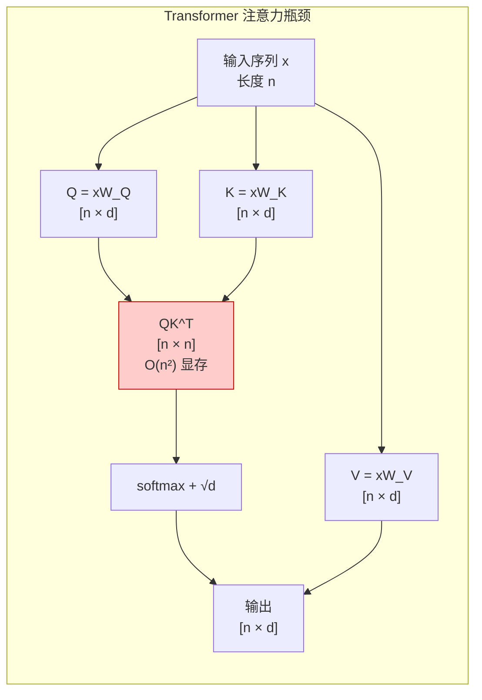
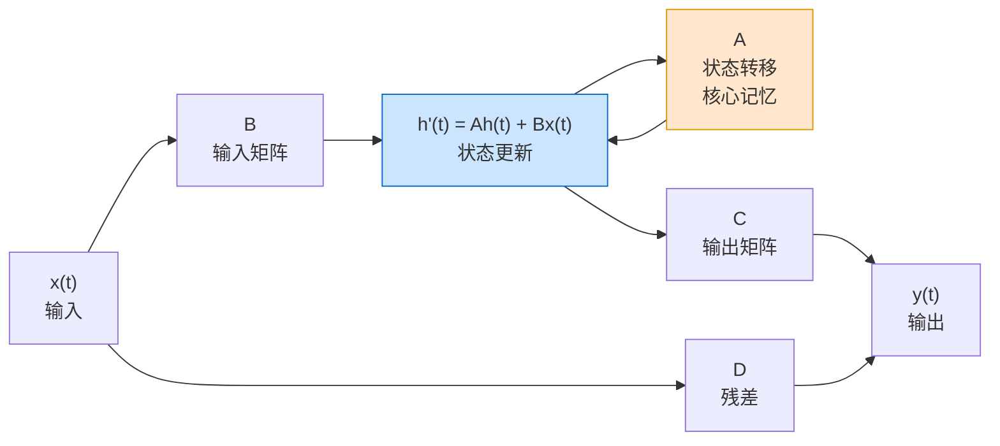
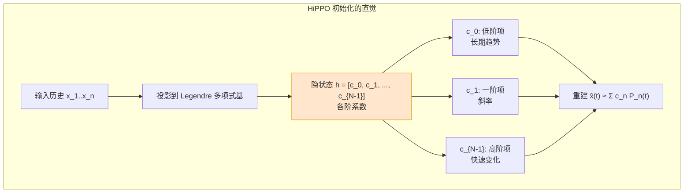
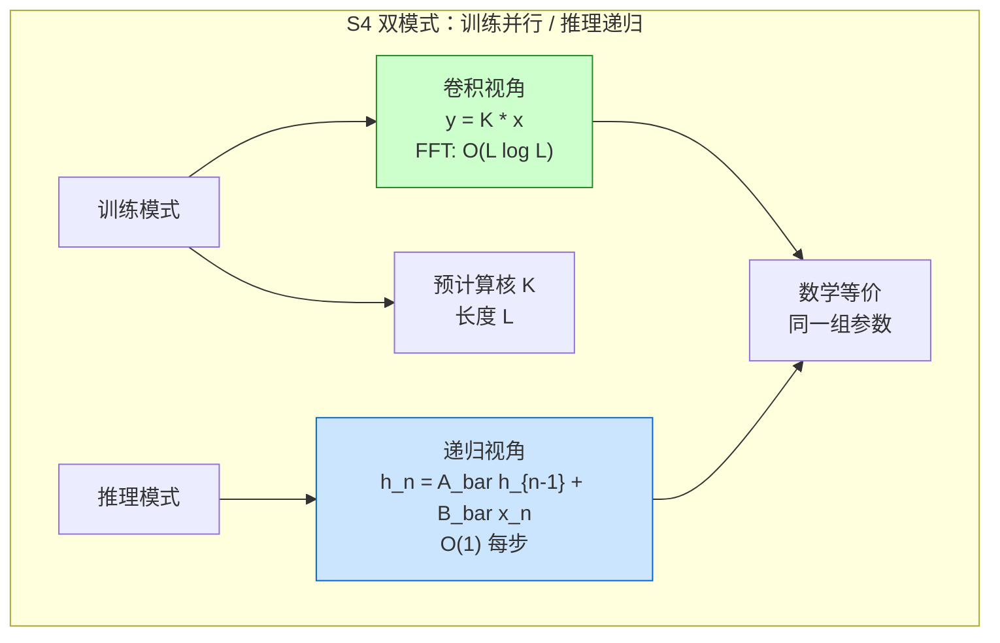
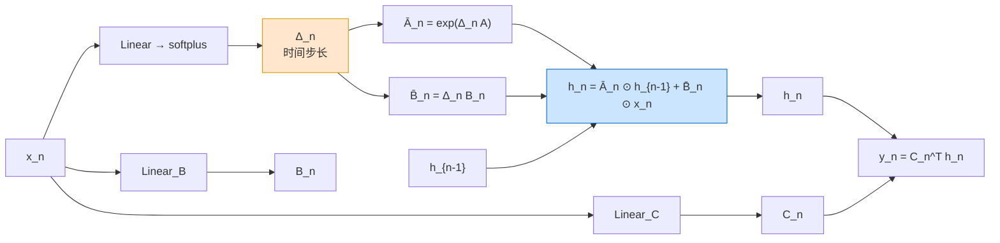
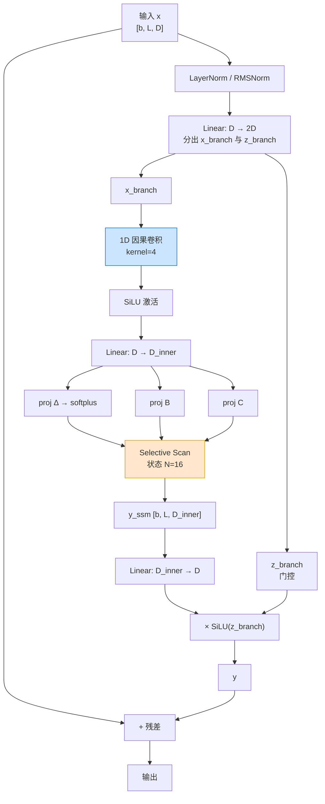
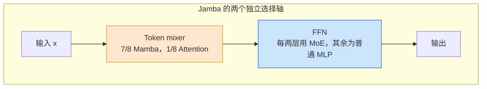

# 第30章 高效序列架构：SSM、Mamba 与线性注意力 ⭐⭐⭐⭐

> **面试频率**：中高（架构/算法岗常见）| **技术热度**：★★★★★
>
> 从 Transformer 的 $O(n^2)$ 注意力瓶颈，到 S4 的结构化状态空间、Mamba 的选择性扫描、
> Mamba-2/3 的演进，再到 RWKV/RetNet/Linear Attention 家族与 Jamba 混合架构，本章梳理
> 高效序列建模的主要技术谱系。
>
> 🆕 **截至 2026-07-31**：Mamba-3 论文与官方实现已经发布，在 Mamba-2/SSD 基础上进一步
> 引入新的离散化递推、复数状态更新与 MIMO 结构；官方仓库仍要求从源码安装 Mamba-3，不能把
> “有论文/代码”写成成熟生产默认。RWKV-7 在既有 token-shift/time-mix 基础上引入广义
> delta rule；Jamba 验证了 Attention-Mamba-MoE 混合路线，MiniMax-01 则采用
> Lightning Attention 与 Softmax Attention 的混合架构。它们是重要候选路线，但不能据此断言
> Linear Attention 已成为所有 RAG 或 Agent 场景的默认选择。

---

## 30.1 SSM 理论基础 ⭐⭐⭐⭐⭐

### 30.1.1 为什么需要超越 Transformer

标准自注意力机制的计算复杂度为：

$$
\text{Attention}(Q, K, V) = \text{softmax}\left(\frac{QK^\top}{\sqrt{d_k}}\right) V
$$

其中 $Q, K, V \in \mathbb{R}^{n \times d}$，$QK^\top$ 的形状为 $n \times n$。朴素实现的
注意力计算量为 $O(n^2d)$，显式注意力矩阵的显存为 $O(n^2)$（FlashAttention 等实现可降低
中间激活显存，但不改变全注意力的二次计算量）。当上下文长度 $n$ 从 4K 增长到 1M 时，
注意力矩阵元素数约增长 62500 倍。自回归推理的 KV Cache 则是随已生成/输入 token 数线性增长的
$O(nd)$，不要把它与训练时的 $n\times n$ 注意力矩阵混为一谈。



**核心痛点对比**：

| 架构家族 | 训练复杂度 | 推理每步复杂度 | 推理状态 | 历史表示与边界 |
|---------|-----------|---------------|---------|---------------|
| Transformer | $O(n^2 d)$ | $O(n d)$（有 KV Cache） | $O(n d)$ 线性增长 | 窗口内显式注意力；计算与缓存随长度增长 |
| RNN/LSTM | $O(n d^2)$ | $O(d^2)$ | $O(d)$ 固定状态 | 压缩进递归状态；长程效果依门控、训练和任务 |
| SSM（S4/Mamba） | $O(n d)$ 或 $O(n \log n)$ | $O(d)$ 固定状态 | $O(d)$ 固定状态 | 结构化压缩历史；精确召回需单独评测 |
| Linear Attention | 常见形式为 $O(n d^2)$ | 常见形式为 $O(d^2)$ | 常见形式为 $O(d^2)$ | 固定聚合状态或近似；质量依具体算法与任务 |

理想架构应同时满足：**训练可并行**（像 Transformer）、**推理恒定开销**（像 RNN）、**长程依赖可建模**（超越 LSTM）。这正是 SSM（State Space Model，状态空间模型）家族的设计目标。

### 30.1.2 连续状态空间方程

SSM 源自控制论与信号处理，用一个**连续的潜在状态** $h(t) \in \mathbb{R}^N$ 来压缩历史信息。其连续时间形式为：

$$
\begin{aligned}
h'(t) &= A\, h(t) + B\, x(t) \\
y(t) &= C\, h(t) + D\, x(t)
\end{aligned}
$$

其中：
- $x(t) \in \mathbb{R}$ 为输入信号（逐通道处理，每通道独立 SSM）
- $h(t) \in \mathbb{R}^N$ 为隐状态（$N$ 为状态维度，典型 16~256）
- $A \in \mathbb{R}^{N \times N}$ 为**状态转移矩阵**（决定记忆衰减与振荡）
- $B \in \mathbb{R}^{N \times 1}$ 为输入投影
- $C \in \mathbb{R}^{1 \times N}$ 为输出投影
- $D$ 为逐通道 skip 参数；在 S4/Mamba 等实现中通常是可学习参数，外层残差连接是另一层结构

直觉上：$A$ 控制「过去信息如何保留」，$B$ 控制「新信息如何写入」，$C$ 控制「隐状态如何读出」。**$A$ 的特征值若位于左半复平面且实部为负，系统稳定且记忆按指数衰减**。



### 30.1.3 离散化：从连续到离散

神经网络处理的是离散序列（token 序列），需将连续 SSM 离散化。常用 **Zero-Order Hold（ZOH）** 方法：假设输入在区间 $[t_n, t_{n+1})$ 内保持常量 $x(t_n)$，步长为 $\Delta$。求解常微分方程可得离散递归：

$$
\begin{aligned}
\bar{A} &= \exp(\Delta A) \\
\bar{B} &= (\Delta A)^{-1} (\exp(\Delta A) - I) \cdot \Delta B \approx \Delta B \quad(\text{一阶近似})\\
h_n &= \bar{A}\, h_{n-1} + \bar{B}\, x_n \\
y_n &= C\, h_n \quad (+ D\, x_n)
\end{aligned}
$$

其中 $\bar{A}, \bar{B}$ 为离散化后的矩阵，$\Delta$ 是可学习的时间步长。离散化后的形式就是一个**线性 RNN**：

$$
h_n = \bar{A} h_{n-1} + \bar{B} x_n, \qquad y_n = C h_n
$$

它可以用 LSTM 的「遗忘/写入」作直觉类比：$\bar{A}$ 决定历史衰减，$\bar{B}$ 决定新输入写入。
但二者并不同构：经典线性 SSM 没有 LSTM 的输入依赖 sigmoid 门、cell/output gate 与非线性状态更新。

```python
import torch
import torch.nn as nn
import math

class ContinuousSSM(nn.Module):
    """连续 SSM 的离散化实现（教学版，逐通道独立处理）。"""
    def __init__(self, d_model: int, state_dim: int = 16):
        super().__init__()
        self.d_model = d_model
        self.N = state_dim
        # 教学版保留完整 HiPPO-LegS 矩阵；生产实现通常采用 NPLR/对角化参数化。
        # 不能对 -A 逐元素取 log：HiPPO 的非对角元素含 0/负值，会产生 inf/NaN。
        self.register_buffer("A", self._hippo_init(state_dim))
        self.B = nn.Parameter(torch.randn(state_dim, d_model) * 0.01)
        self.C = nn.Parameter(torch.randn(d_model, state_dim) * 0.01)
        self.D = nn.Parameter(torch.ones(d_model))
        self.delta = nn.Parameter(torch.randn(d_model) * 0.1 + 0.5)

    @staticmethod
    def _hippo_init(N: int) -> torch.Tensor:
        """HiPPO-LegS 矩阵初始化（见 30.1.4）。"""
        A = torch.zeros(N, N)
        for n in range(N):
            for k in range(n):
                A[n, k] = -math.sqrt(2 * n + 1) * math.sqrt(2 * k + 1)
            A[n, n] = -(n + 1)
        return A

    def discretize(self):
        """ZOH 离散化：返回离散的 (A_bar, B_bar)。"""
        delta = torch.nn.functional.softplus(self.delta)         # [d_model]
        A = self.A.to(dtype=self.B.dtype)                         # [N, N]
        # 逐通道共享 A，故广播
        # A_bar = exp(Δ A) ≈ I + ΔA（一阶），这里用矩阵指数
        dA = delta.view(1, 1, -1) * A.unsqueeze(-1)              # [N, N, d_model]
        A_bar = torch.matrix_exp(dA.permute(2, 0, 1))            # [d_model, N, N]
        # 简化：B_bar ≈ Δ * B（一阶近似足够说明原理）
        B_bar = delta.unsqueeze(1) * self.B.T                    # [d_model, N]
        return A_bar, B_bar                                      # [d_model,N,N], [d_model,N]

    def forward(self, x: torch.Tensor) -> torch.Tensor:
        """x: [batch, seq_len, d_model] -> y: [batch, seq_len, d_model]"""
        b, l, d = x.shape
        A_bar, B_bar = self.discretize()                         # [d,N,N], [d,N]
        h = torch.zeros(b, d, self.N, device=x.device)           # 初始隐状态
        outputs = []
        for n in range(l):
            # h_n = A_bar h_{n-1} + B_bar x_n   （逐通道）
            # A_bar: [d,N,N], h: [b,d,N] -> einsum
            h = torch.einsum('dij,bdj->bdi', A_bar, h) + \
                torch.einsum('dn,bd->bdn', B_bar, x[:, n, :])
            y_n = torch.einsum('bdn,dn->bd', h, self.C) + self.D * x[:, n, :]
            outputs.append(y_n)
        return torch.stack(outputs, dim=1)                       # [b, l, d]
```

上述逐 token 递归实现是 $O(n)$ 的，但无法并行训练。30.1.5 将展示 S4 如何通过卷积视角实现并行。

### 30.1.4 HiPPO 初始化：记忆压缩的数学基石

**HiPPO（High-order Polynomial Projection Operators）**（Gu et al., 2020）给出一族在线投影算子，
使有限维状态逼近截至当前时刻的历史函数在正交多项式基上的投影。它为 S4 的初始化和结构化参数化
提供了理论起点，但有限状态仍是有损摘要，不能表述为“保证不遗忘无限历史”。

HiPPO-LegS 矩阵定义为：

$$
A_{n,k} = \begin{cases} -\sqrt{2n+1}\sqrt{2k+1} & \text{if } n > k \\ -(n+1) & \text{if } n = k \\ 0 & \text{if } n < k \end{cases}
$$

其直觉是：将历史信号投影到 Legendre 多项式基 $\{P_n\}$，用固定维数的系数近似不同时间尺度的
历史变化。近似误差取决于状态维度、信号性质、离散化和训练；S4 在 LRA 上的结果还来自 NPLR
参数化、高效卷积核计算和端到端训练，不能只归因于 HiPPO。

**记忆衰减谱分析**：$A$ 的特征值 $\lambda_i$ 决定每个状态分量的衰减时间常数 $\tau_i = -1/\text{Re}(\lambda_i)$。HiPPO 矩阵的特征值沿实轴负方向分布，覆盖从快衰减（短程记忆）到慢衰减（长程记忆）的完整谱，使 SSM 同时具备局部细节捕捉与全局上下文压缩能力。



### 30.1.5 S4：对角化与卷积视角

S4（Structured State Space sequence model，Gu, Goel, Ré, 2022）的核心贡献是解决了 SSM 训练的并行性问题。其关键洞察：

**1. NPLR 结构**。S4 利用 HiPPO 矩阵可写成 Normal Plus Low-Rank（NPLR）形式，并通过
Cauchy 核和 Woodbury 恒等式高效求核。它不是声称任意一般矩阵都能无条件、数值稳定地对角化。
在合适基下，normal 部分可写成对角形式，从而把主要计算化为结构化标量运算：

$$
h_n^{(i)} = \lambda_i\, h_{n-1}^{(i)} + \bar{B}_i\, x_n, \qquad y_n = \sum_i C_i\, h_n^{(i)}
$$

**2. 卷积视角**。展开递归 $h_n = \bar{A} h_{n-1} + \bar{B} x_n$（设 $h_0 = 0$）：

$$
\begin{aligned}
h_1 &= \bar{B} x_1 \\
h_2 &= \bar{A}\bar{B} x_1 + \bar{B} x_2 \\
&\vdots \\
h_n &= \sum_{k=1}^{n} \bar{A}^{n-k} \bar{B} x_k \\
y_n &= C h_n = \sum_{k=1}^{n} C \bar{A}^{n-k} \bar{B}\, x_k
\end{aligned}
$$

这正是**卷积**形式 $y = K * x$，其中卷积核为：

$$
K = \left(C\bar{B},\ C\bar{A}\bar{B},\ C\bar{A}^2\bar{B},\ \ldots,\ C\bar{A}^{L-1}\bar{B}\right) \in \mathbb{R}^L
$$

于是整个序列的 SSM 计算可写为：

$$
y = K * x, \qquad K = (C\bar{B},\ C\bar{A}\bar{B},\ \ldots,\ C\bar{A}^{L-1}\bar{B})
$$

利用 FFT，卷积可在 $O(L \log L)$ 完成（vs 递归 $O(L)$）。更重要的是，**卷积天然并行**，可在 GPU 上高效训练。



**3. 计算技巧：高效生成核 $K$**。直接计算 $C\bar{A}^k\bar{B}$ 代价高。S4 借助 NPLR、
Cauchy 核与快速多项式/FFT 技术，将核计算降为关于状态维和序列长近线性的结构化运算；具体复杂度
取决于实现和是否计入 FFT，不能笼统写成对所有情形都严格为 $O(N+L)$。

**S4 vs Transformer 在 Long Range Arena（LRA）**：

| 任务 | Transformer | S4 |
|------|------------|-----|
| ListOps (2K) | 36.4% | 59.6% |
| Text (1K) | 65.0% | 86.1% |
| Retrieval (4K) | 79.0% | 90.9% |
| Pathfinder (1K) | 74.0% | 93.0% |
| Path-X (16K) | 41.0% | **88.0%** |

这些是原论文特定模型、训练预算和 LRA 版本下的结果，说明 S4 在这些长序列任务上有明显优势；
单个基准不能“证明”所有结构化状态空间模型对 Transformer 存在根本优势。

---

## 30.2 Selective SSM 与 Mamba ⭐⭐⭐⭐⭐

### 30.2.1 S4 的局限：内容无关的选择性缺失

S4 的卷积核 $K$ 是**固定**的——无论输入是什么，$A, B, C, \Delta$ 都是常数。这意味着 SSM 无法像 Attention 那样「根据输入内容决定关注哪些 token」。

举个直觉例子：在 code completion 中，看到 `def fibonacci(` 后的下一个 token 是函数名，模型应「记住」这个名字直到 `return`；而看到注释 `# ...` 时，应「忽略」注释内容。S4 的固定参数无法实现这种**内容感知的遗忘/记忆**。

Mamba（Gu & Dao, 2023, arXiv:2312.00752）的核心创新：让 $B, C, \Delta$ 成为**输入依赖**（input-dependent）的，即选择性（Selectivity）。

| 参数 | S4 / S5 | Mamba (Selective SSM) |
|------|---------|----------------------|
| $A$ | 固定的结构化/NPLR 参数 | 固定的对角负实参数；官方实现常以 $1,\ldots,N$ 初始化其幅值 |
| $B$ | 固定 | $B(x_n) = \text{Linear}(x_n)$ 输入依赖 |
| $C$ | 固定 | $C(x_n) = \text{Linear}(x_n)$ 输入依赖 |
| $\Delta$ | 固定 | $\Delta(x_n) = \text{softplus}(\text{Linear}(x_n))$ 输入依赖 |
| 计算模式 | 卷积（并行） | 并行扫描（parallel scan） |

### 30.2.2 选择机制的数学形式

Mamba 的 Selective SSM 离散递归为：

$$
\begin{aligned}
\Delta_n &= \tau_\Delta(\text{Linear}(x_n)) \quad\text{（softplus 或加上偏置）}\\
B_n &= \text{Linear}_B(x_n) \in \mathbb{R}^N \\
C_n &= \text{Linear}_C(x_n) \in \mathbb{R}^N \\
\bar{A}_n &= \exp(\Delta_n A) \quad\text{（对角 } A \text{，逐元素）}\\
\bar{B}_n &= \Delta_n B_n \\
h_n &= \bar{A}_n \odot h_{n-1} + \bar{B}_n \odot x_n \\
y_n &= C_n^\top h_n
\end{aligned}
$$

由于 $\Delta_n$ 依赖 $x_n$，$\bar{A}_n$ 也依赖 $x_n$，**卷积视角失效**——核 $K$ 不再固定。Mamba 转而采用**并行扫描算法（Parallel Scan）**实现并行训练。

**$\Delta$ 的直觉**：$\Delta$ 控制「时间分辨率」。大 $\Delta$ → $\bar{A} = \exp(\Delta A) \to 0$（快速遗忘，聚焦当前 token）；小 $\Delta$ → $\bar{A} \to 1$（长期记忆）。这等价于 Attention 中「关注当前 vs 关注全局」的动态权衡，但用 $O(1)$ 状态实现。



### 30.2.3 并行扫描算法

选择机制破坏了卷积可并行性，但递归 $h_n = \bar{A}_n h_{n-1} + \bar{B}_n x_n$ 仍属于**关联扫描（associative scan）**问题。定义二元算子：

$$
(a_1, b_1) \oplus (a_2, b_2) = (a_2 a_1,\ a_2 b_1 + b_2)
$$

可验证该算子满足结合律（这是关键）。于是 $h_n$ 的递归可写为前缀积（prefix product）：

$$
h_n = \bigoplus_{k=1}^{n} (\bar{A}_k, \bar{B}_k x_k)
$$

前缀积可用**Blelloch 扫描**在 $O(\log n)$ 深度、$O(n)$ 工作量内并行完成（类似并行前缀和）。CUDA 上用 `cub::DeviceScan` 或自定义 kernel 实现，配合 warp-level 原语。

```python
import torch

def selective_scan_naive(x, delta, A, B, C):
    """
    逐 token 递归实现（教学版，仅说明原理，实际用 CUDA kernel）。
    x:     [batch, seq, d_model]
    delta: [batch, seq, d_model]  (已经过 softplus)
    A:     [d_model, N]           (对角化后的 A，存为对角向量)
    B:     [batch, seq, N]
    C:     [batch, seq, N]
    返回 y: [batch, seq, d_model]
    """
    b, l, d = x.shape
    N = A.shape[1]
    h = torch.zeros(b, d, N, device=x.device, dtype=x.dtype)
    ys = []
    for n in range(l):
        # Ā_n = exp(Δ_n * A)，逐通道逐状态：[b, d, N]
        A_bar = torch.exp(delta[:, n, :].unsqueeze(-1) * A.unsqueeze(0))  # [b, d, N]
        B_bar = delta[:, n, :].unsqueeze(-1) * B[:, n, :].unsqueeze(1)    # [b, d, N]
        h = A_bar * h + B_bar * x[:, n, :].unsqueeze(-1)                   # [b, d, N]
        y_n = (h * C[:, n, :].unsqueeze(1)).sum(-1)                       # [b, d]
        ys.append(y_n)
    return torch.stack(ys, dim=1)

# 真实库调用：mamba_ssm.ops.selective_scan_interface.selective_scan_fn
# 官方实现使用硬件感知的 fused selective-scan kernel；加速倍数依模型、序列和硬件而异
```

### 30.2.4 硬件感知实现

Mamba 的工程贡献是针对 GPU 内存层级优化的 **selective scan kernel**：

1. **状态分块（chunking）**：将序列切分为块，块内并行扫描，块间串行传递状态，减少 HBM 读写。
2. **融合 kernel**：将 $\Delta, B, C$ 投影、离散化、扫描、$C^\top h$ 读出融合为单个 CUDA kernel，避免中间张量落地到 HBM。
3. **SRAM 复用**：状态 $h$（典型 $N \cdot d \approx 16 \cdot 1024 = 16K$ 浮点）放入 SRAM，每个 warp 处理一个通道子集。
4. **反向传播重计算**：前向只存输入与参数，反向时重算中间状态，显存从 $O(b \cdot L \cdot N \cdot d)$ 降到 $O(b \cdot L \cdot d)$。

**性能边界**：Mamba 论文 Figure 12 在作者的模型与实现对比中报告最高约 4–5× Transformer
推理吞吐，并把原因归于固定递归状态允许更大 batch；这是论文基准结果，不是对 A100、128K 或
所有实现成立的固定常数。复现必须同时报告论文/代码 revision、模型规模、batch、生成长度、精度、
kernel 与硬件。来源：[Mamba 论文 §4.5](https://arxiv.org/abs/2312.00752)。

### 30.2.5 Mamba Block 完整结构

Mamba 用 Selective SSM 替换 Transformer 中的 Attention，整体 Block 结构：



```python
import torch
import torch.nn as nn
import torch.nn.functional as F

class MambaBlock(nn.Module):
    """Mamba Block 的简化可读实现（生产用 mamba_ssm 包的 CUDA 版本）。"""
    def __init__(self, d_model: int = 1024, d_inner: int = 2048,
                 state_dim: int = 16, conv_kernel: int = 4):
        super().__init__()
        self.d_model = d_model
        self.d_inner = d_inner
        self.N = state_dim
        self.dt_rank = math.ceil(d_model / 16)
        self.norm = nn.RMSNorm(d_model)
        # 投影到 [x_branch, z_branch]
        self.in_proj = nn.Linear(d_model, 2 * d_inner, bias=False)
        # 局部 1D 因果卷积（捕获短程 shift，弥补 SSM 的初始状态）
        self.conv = nn.Conv1d(d_inner, d_inner, conv_kernel,
                              padding=conv_kernel - 1, groups=d_inner)
        # 官方结构先产生低秩 dt、B、C，再由 dt_proj 将 dt 扩到 d_inner。
        self.x_proj = nn.Linear(d_inner, self.dt_rank + state_dim * 2, bias=False)
        self.dt_proj = nn.Linear(self.dt_rank, d_inner, bias=True)
        # 输出投影
        self.out_proj = nn.Linear(d_inner, d_model, bias=False)
        # A 参数（对角化，存为向量）
        A = torch.arange(1, state_dim + 1, dtype=torch.float32).repeat(d_inner, 1)
        self.A_log = nn.Parameter(torch.log(A))     # [d_inner, N]
        self.D = nn.Parameter(torch.ones(d_inner))

    def forward(self, x: torch.Tensor) -> torch.Tensor:
        b, l, _ = x.shape
        residual = x
        x_norm = self.norm(x)
        xz = self.in_proj(x_norm)                     # [b, l, 2*d_inner]
        x_b, z = xz.chunk(2, dim=-1)
        # 因果卷积
        x_b = x_b.transpose(1, 2)                     # [b, d_inner, l]
        x_b = self.conv(x_b)[:, :, :l].transpose(1, 2)  # [b, l, d_inner]
        x_b = F.silu(x_b)
        # 选择性投影
        x_proj = self.x_proj(x_b)                     # [b, l, dt_rank + 2N]
        dt_lr = x_proj[..., :self.dt_rank]
        B = x_proj[..., self.dt_rank:self.dt_rank + self.N]
        C = x_proj[..., self.dt_rank + self.N:]
        dt = F.softplus(self.dt_proj(dt_lr))          # [b, l, d_inner], Δ > 0
        A = -torch.exp(self.A_log)                     # [d_inner, N], A < 0
        # 简化扫描（生产环境调用 selective_scan_fn）
        # 这里用 einsum 伪代码示意；真实实现见 30.2.3
        y = self._selective_scan(x_b, dt, A, B, C)     # [b, l, d_inner]
        y = y * F.silu(z)                              # 门控
        return residual + self.out_proj(y)

    def _selective_scan(self, x, dt, A, B, C):
        """简化扫描：逐 token 递归（教学，非生产）。"""
        b, l, d = x.shape
        N = self.N
        h = torch.zeros(b, d, N, device=x.device, dtype=x.dtype)
        ys = []
        for n in range(l):
            A_bar = torch.exp(dt[:, n, :].unsqueeze(-1) * A.unsqueeze(0))  # [b,d,N]
            B_bar = dt[:, n, :].unsqueeze(-1) * B[:, n, :].unsqueeze(1)
            h = A_bar * h + B_bar * x[:, n, :].unsqueeze(-1)
            ys.append((h * C[:, n, :].unsqueeze(1)).sum(-1))
        return torch.stack(ys, dim=1)

class MambaLM(nn.Module):
    """Mamba 语言模型骨架。"""
    def __init__(self, vocab_size: int = 50304, d_model: int = 1024,
                 n_layers: int = 24, state_dim: int = 16):
        super().__init__()
        self.embed = nn.Embedding(vocab_size, d_model)
        self.blocks = nn.ModuleList([MambaBlock(d_model, state_dim=state_dim)
                                      for _ in range(n_layers)])
        self.norm_f = nn.RMSNorm(d_model)
        self.lm_head = nn.Linear(d_model, vocab_size, bias=False)

    def forward(self, tokens: torch.Tensor) -> torch.Tensor:
        x = self.embed(tokens)
        for blk in self.blocks:
            x = blk(x)
        x = self.norm_f(x)
        return self.lm_head(x)
```

**Mamba 的关键经验结论**：
- 原始 Mamba 论文在其 scaling 与评测设置下报告了相对同规模 Transformer 基线的竞争性结果；
  结论不能外推到任意数据、模型规模或长上下文任务。
- 生成式推理：固定递归状态不随上下文增长，可避免 Transformer 式 KV Cache，并可能支持更大
  batch；端到端吞吐收益取决于具体模型、kernel、精度、batch、长度与硬件。
- 局限：固定维状态是对历史的有损压缩，纯 Mamba 在部分复制、状态追踪和精确查找任务上可能
  弱于全注意力；这为保留部分 Attention 的混合设计提供了动机，但不是混合架构出现的唯一原因。

---

## 30.3 Mamba-2 与状态空间对偶性 ⭐⭐⭐⭐

Mamba-2（Dao & Gu, 2024, arXiv:2405.21060）引入 **SSD（Structured State Space
Duality）**：在特定标量-恒等状态转移结构下，SSM 的序列变换矩阵是 1-semiseparable matrix，
可在递归、扫描和分块矩阵乘三种视角间转换。论文报告其核心层相对 Mamba-1 快约 2～8 倍；
这不是端到端训练/推理在所有配置下的固定倍数。

### 30.3.1 SSD：分块矩阵算法

对长度为 $T$ 的序列，SSM 可写成 $Y=MX$，其中因果变换矩阵 $M$ 的下三角块具有低秩
（semiseparable）结构。SSD 算法将序列分块：

1. 块内的对角部分用矩阵乘法计算，充分使用 Tensor Core；
2. 每块压缩为固定维状态并在块间递推；
3. 再把传入状态展开到各块输出。

它不依赖所谓“小状态/大状态双路径”，也不要求把状态维硬编码为某个 warp 大小。实际性能由
chunk size、head dimension、state dimension、dtype 和硬件共同决定。

### 30.3.2 SSM 与 Attention 的统一视角

SSD 揭示的是一个有条件的对应：标量-恒等结构的 SSM、1-semiseparable 因果矩阵和一类
structured masked attention 可以描述同一序列变换。它不表示任意 SSM 与任意 Linear Attention
都等价。

| 视角 | 表示 | 计算复杂度 |
|-----|------|-----------|
| 二次/矩阵视角 | $Y=MX$，$M$ 是带因果 mask 的 1-semiseparable 矩阵 | 适合分块 matmul |
| 递归视角 | $h_t=A_t h_{t-1}+B_t x_t,\ y_t=C_t^\top h_t$ | 流式推理固定状态 |

等价性来自 $A_t=a_tI$ 等结构约束，而不是 $N\approx d$。Mamba-2 可使用比 Mamba-1 更大的
state dimension，并通过分块矩阵算法保持硬件效率。

### 30.3.3 Mamba-3：从 SSD 到更强递推与 MIMO

Mamba-3 在 Mamba-2/SSD 视角上继续扩展三类机制：更有表达力的 SSM 离散化递推、复数状态
更新，以及允许多输入多输出通道交互的 MIMO 形式。论文在其匹配规模实验中报告了增益，但这只是
特定训练配方和评测的研究结果，不代表对所有任务、硬件或模型规模都优于 Mamba-2/Transformer。

官方 `state-spaces/mamba` 仓库已提供 `mamba_ssm/modules/mamba3.py`，其 README 截至本章
复核日期仍要求从源码安装 Mamba-3。工程采用前应锁定 commit，验证 CUDA/依赖、前后向正确性、
长上下文质量、吞吐和 checkpoint 兼容性；不能只凭模块可导入就宣称生产就绪。

---

## 30.4 同代架构横评 ⭐⭐⭐⭐

### 30.4.1 RWKV-7：线性递归与广义 delta rule

RWKV（Receptance Weighted Key Value）是线性递归架构。token-shift/time-mix 在早期 RWKV
版本中已经存在；RWKV-7 的新增重点是带向量门控与数据依赖学习率的广义 delta rule，而不是
“首次引入 token-shift”。

1. **时间混合（time-mix）**：引入 token-shift 机制——混合当前 token 与上一 token 的隐状态：
   $$x_t' = x_t + (x_{t-1} - x_t) \odot \mu$$
   其中 $\mu$ 可学习，捕捉局部变化。

2. **空间混合（channel-mix）**：用线性变换替代 Attention 的乘积。

RWKV 的递归推理状态不随上下文增长。参考实现可以用纯 PyTorch 表达，但高吞吐训练/推理仍常依赖
CUDA/Triton 等优化 kernel；是否适合端侧还取决于模型大小、量化、算子支持与内存。

### 30.4.2 RetNet：递归/并行双模式

RetNet（Retentive Network）提出「Retention」机制——一种同时支持：
- **递归模式**：推理 $O(1)$
- **并行模式**：训练 $O(n)$
- **分块递归模式**：长上下文 $O(n)$

的统一架构。其核心是带多尺度指数衰减和相对位置相位的 retention；并行、递归和 chunkwise
recurrent 三种形式数学等价，并非依靠 Cholesky 分解。

### 30.4.3 Linear Attention 家族

Linear Attention 用核函数替换 Attention 的 $QK^\top$ 乘积：
$$\text{LinearAttention}(Q,K,V) = \frac{\sum_{i=1}^n \phi(q_n)^\top \phi(k_i) v_i}{\sum_{i=1}^n \phi(q_n)^\top \phi(k_i)}$$

其中 $\phi$ 是特征映射（如 exponential、ReLU、cosine-similarity）。常见变体：
- **Performer**：用随机傅里叶特征近似
- **Nyströmformer**：用 Nyström 方法近似 Softmax 注意力矩阵

Ring Attention 是把精确块注意力沿设备环传输，以分布式方式扩展上下文；它不是线性注意力算法，
应放在“分布式长上下文注意力”类别。

---

## 30.5 Hybrid SSM-Transformer 混合架构 ⭐⭐⭐⭐⭐

纯递归状态在精确复制/查找任务上可能弱于全注意力，因此混合架构是一条重要路线；是否最优必须按
质量、上下文、延迟、显存和硬件实测，不能给出无条件的“2026 最优解”。

### 30.5.1 Jamba：Mamba + 混合专家

Jamba（AI21, 2024）把 token mixer 与 FFN 两个维度分开设计：每个 8 层 block 中通常为
1 个 Attention mixer + 7 个 Mamba mixer；每两层把普通 MLP 替换为 MoE FFN（16 个专家、
每 token 激活 2 个）。原始 Jamba 支持 256K context；结果应限定具体版本和评测，不能泛称
“长上下文性能最佳”。



### 30.5.2 MiniMax-01：Lightning Attention 与百万级上下文

MiniMax-01 于 2025 年发布。MiniMax-Text-01 使用 Lightning Attention（线性注意力）与传统
Softmax Attention 的混合架构：每 8 层中 7 层 Lightning Attention、1 层 Softmax Attention，
并结合 MoE 与长序列并行。技术报告给出的边界是**训练上下文 1M token、推理外推至 4M token**，
不是 100 亿 token，也不是“滑窗 4K + 分层 SSM”。4M 是模型声明的最大上下文能力，不等于所有
任务都能无损利用 4M 信息。

---

## 📋 本章速查表

| 知识点 | 核心公式/关键参数 | 面试考察重点 |
|-------|----------------|-------------|
| 标准 Attention 复杂度 | $O(n^2 d)$ | 理解瓶颈来源 |
| SSM 连续方程 | $h'(t) = A h(t) + B x(t), y(t) = C h(t)$ | $A/B/C$ 的物理含义 |
| HiPPO 初始化 | 结构化矩阵，Legendre 多项式投影 | 为什么能长程记忆 |
| S4 卷积视角 | $y = K * x$, $K = (CB, C\bar{A}B, ...)$ | FFT 的作用 |
| Mamba Selectivity | $\Delta(x), B(x), C(x)$ 输入依赖 | 选择机制的直觉 |
| 并行扫描 | 前缀积算子 $\oplus$，Blelloch 算法 | 结合律的关键作用 |
| Mamba Block 结构 | 因果卷积 + SSM + 门控 $\times$ SiLU(z) | 完整结构与残差 |
| Mamba-2/3 | SSD；新离散化、复数状态与 MIMO | 论文结果、官方实现与生产成熟度分开 |
| RWKV token-shift | $x_t' = x_t + (x_{t-1} - x_t) \odot \mu$ | 局部混合的作用 |
| Jamba 混合架构 | 1:7 Attention:Mamba；MoE 位于 FFN | 两个设计轴不要混淆 |
| 推理开销 | SSM: $O(d)$ / 步；Transformer: $O(nd)$ / 步 | 吞吐与 KV Cache |

---

## 🎯 面试真题精讲

### 真题 1：解释为什么 Attention 是 $O(n^2)$ 的，以及 SSM 如何在 $O(n)$ 实现长程建模

**答**：Attention 的计算需构造 $n \times n$ 的注意力矩阵 $QK^\top$，用于计算 softmax 权重再与 $V$ 组合，因此时间/显存都是 $O(n^2)$。

SSM 的核心：用**固定维结构化状态 $h$**汇总历史。输入通过
$h_n=\bar A h_{n-1}+\bar Bx_n$ 递归更新，状态维固定时总复杂度随序列长度线性增长。
HiPPO/结构化参数化有助于覆盖不同时间尺度，但固定维状态是有损压缩，不能保证信息不丢失。

---

### 真题 2：Mamba 的「选择性」指什么？为什么需要它？与 S4 的区别？

**答**：「选择性」指 $\Delta, B, C$ 是输入依赖的（input-dependent），而非固定参数。

原因：S4 固定核无法根据内容动态调整遗忘/记忆（如看到注释应忽略，看到函数名应记住）。Mamba 用 $\Delta(x_n)$ 控制时间分辨率（大 $\Delta$ 快速遗忘，小 $\Delta$ 长期记忆），用 $B(x_n)/C(x_n)$ 控制读写门控。

区别：S4 固定参数 → 卷积并行；Mamba 选择性 → 并行扫描。

---

### 真题 3：并行扫描为什么需要结合律？请写出二元算子

**答**：前缀积 $\bigoplus_{k=1}^n (\bar{A}_k, \bar{B}_k x_k)$ 需按任意分组计算再合并，这需要算子 $\oplus$ 满足结合律。

Mamba 的算子：
$$(a_1, b_1) \oplus (a_2, b_2) = (a_2 a_1,\ a_2 b_1 + b_2)$$

可验证：$((a1,b1)⊕(a2,b2))⊕(a3,b3) = (a3(a2a1), a3(a2b1+b2)+b3) = (a3a2a1, a3a2b1 + a3b2 + b3) = (a1,b1)⊕((a2,b2)⊕(a3,b3))$，结合律成立。

---

### 真题 4：Mamba vs Transformer 各有什么优缺点？分别适合什么场景？

**答**：

| 对比项 | Mamba | Transformer |
|-------|------|-------------|
| 计算复杂度 | $O(n)$ 训练/推理 | $O(n^2)$ 训练，$O(n)$ 推理（有 KV Cache） |
| 推理 KV Cache | 无，状态 $h$ 固定大小 | 有，线性增长 $O(n d)$ |
| 长上下文能力 | 状态大小不随长度增长；有效记忆质量需实测 | 配置窗口内可全注意力；计算/KV 成本增长，可选滑窗或压缩 |
| 精确查找/复制 | 固定状态压缩可能受限，依任务实测 | 窗口内可显式访问历史，但不保证任务必然正确 |
| 并行训练 | 并行扫描；依赖匹配的优化 kernel | 矩阵乘生态成熟；长序列成本更高 |

**场景选择**：
- 超长流式生成、固定推理状态或端侧显存受限：把 Mamba/混合架构列为候选并做质量—吞吐实测
- 窗口内显式检索、成熟训练/推理生态优先：把 Transformer 作为强基线；最终仍按任务指标选型

---

### 真题 5：手写 Mamba 推理的单步递归（伪代码/数学式），解释 $A$ 为什么要小于 0

**答**：单步递归：
$$
\begin{aligned}
\Delta_n &= \text{softplus}(\text{Linear}_\Delta(x_n)) \\
\bar{A}_n &= \exp(\Delta_n A) \\
\bar{B}_n &= \Delta_n \cdot \text{Linear}_B(x_n) \\
h_n &= \bar{A}_n \odot h_{n-1} + \bar{B}_n \odot x_n \\
y_n &= \text{Linear}_C(x_n)^\top h_n
\end{aligned}
$$

在标量/对角教学情形且 $\Delta>0$ 时，$A<0$ 使
$\bar{A}=\exp(\Delta A)\in(0,1)$，状态递推具有收缩性。$A=0$ 对应中性保留
$\bar A=1$，$A>0$ 才给出放大因子；对一般矩阵应检查特征值实部，而不能把逐元素小于零当成完整稳定性证明。

---

## 📚 相关章节

- [[12_Transformer与大模型原理]]：对比本章 SSM 与 Attention 的核心差异
- [[16_模型微调与推理优化]]：KV Cache、量化等 Transformer 推理技术与 Mamba 的无 KV 对比
- [[26_世界模型与具身AI]]：Mamba 在物理模拟/机器人控制的应用（结构化状态天然适合）
- [[32_DeepSeek风格MoE与MLA深度解析]]：MoE 可与 SSM 混合构建超大规模模型
- [[36_JAX与TPU大规模预训练]]：大规模预训练对长上下文的架构选择

## 📖 一手参考资料（核验至 2026-07-31）

- Gu et al., [HiPPO: Recurrent Memory with Optimal Polynomial Projections](https://arxiv.org/abs/2008.07669)
- Gu, Goel & Ré, [Efficiently Modeling Long Sequences with Structured State Spaces](https://arxiv.org/abs/2111.00396)
- Gu & Dao, [Mamba: Linear-Time Sequence Modeling with Selective State Spaces](https://arxiv.org/abs/2312.00752)
- Dao & Gu, [Transformers are SSMs: Structured State Space Duality](https://arxiv.org/abs/2405.21060)
- Lahoti et al., [Mamba-3: Improved Sequence Modeling using State Space Principles](https://arxiv.org/abs/2603.15569)
- State Spaces, [Mamba 官方仓库（含 Mamba-3 实现与安装边界）](https://github.com/state-spaces/mamba)
- AI21 Labs, [Jamba: A Hybrid Transformer-Mamba Language Model](https://arxiv.org/abs/2403.19887)
- MiniMax, [MiniMax-01: Scaling Foundation Models with Lightning Attention](https://arxiv.org/abs/2501.08313)
- Peng et al., [RWKV-7 “Goose” with Expressive Dynamic State Evolution](https://arxiv.org/abs/2503.14456)
- Sun et al., [Retentive Network](https://arxiv.org/abs/2307.08621)
