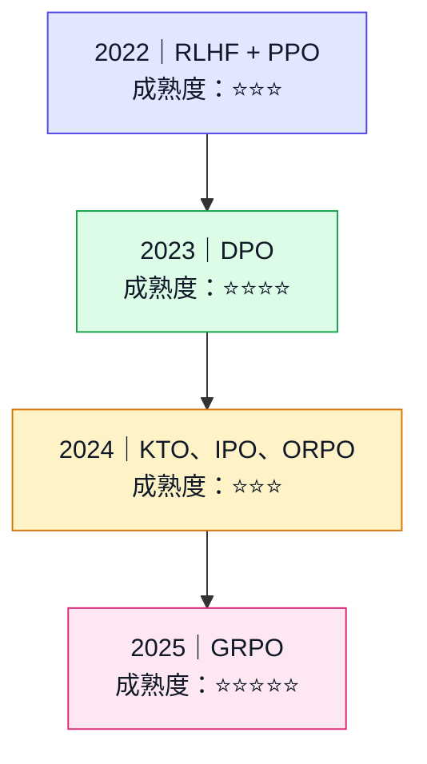
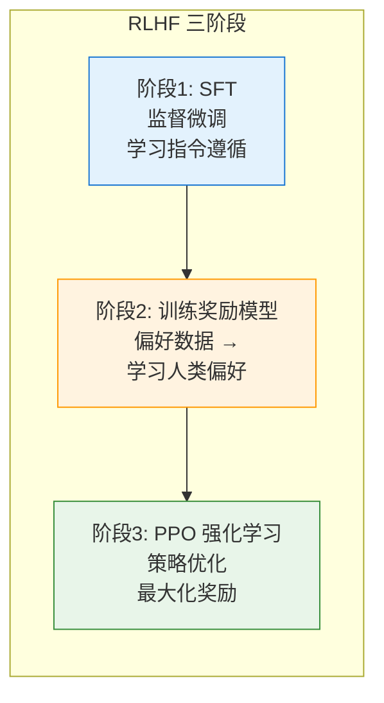
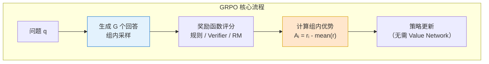
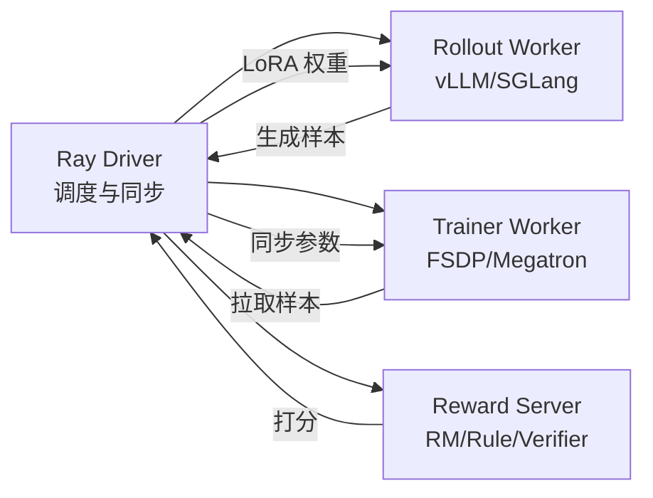

# 第 31 章 偏好对齐与强化学习 ⭐⭐⭐⭐
> [!abstract] 本章导航
> **定位**：第五部分 数据、训练、对齐、评估与安全中的第 31 章；围绕“偏好对齐与强化学习”建立单一、可追踪的知识主线。
>
> **先修**：[[30_SFT_LoRA与QLoRA|第 30 章 SFT、LoRA 与 QLoRA]]。
>
> **学习目标**：
> - 解释 对齐技术 ⭐⭐⭐⭐ 的核心问题、机制与适用边界。
> - 实现或评估 RL Post-Training 专题 ⭐⭐⭐⭐⭐ 的最小闭环。
> - 使用可复现证据诊断 RL Post-Training 专题 ⭐⭐⭐⭐⭐ 的工程取舍与失败模式。
>
> **建议路径**：对齐技术 ⭐⭐⭐⭐ → RL Post-Training 专题 ⭐⭐⭐⭐⭐。
>
> **配套代码**：`code/ch30_lora_qlora/`。

本章先回答“对齐技术 ⭐⭐⭐⭐”为什么成立，再沿着机制、实现、评估和边界逐步展开。阅读时先建立因果链，再运行或推演示例，最后用章末自测检查能否脱离原文复述。
## 31.1 对齐技术 ⭐⭐⭐⭐

### 31.1.1 对齐技术概述

对齐（Alignment）的目标是使模型行为符合**人类价值观和偏好**，核心方法是让模型学习"什么回答是人类更喜欢的"。



### 31.1.2 RLHF（基于人类反馈的强化学习）

RLHF 三阶段流程：



**阶段1：监督微调（Supervised Fine-Tuning, SFT）**

从预训练模型出发，使用经过筛选的人类示范数据（指令 $x$ 与目标回答 $y$）进行教师强制训练，
最小化目标回答 token 的负对数似然：

$$
\mathcal{L}_{SFT} = -\mathbb{E}_{(x,y) \sim D_{SFT}}
\left[\sum_{t=1}^{|y|}\log \pi_{\theta}(y_t \mid x, y_{<t})\right]
$$

- **训练产物**：得到初始策略 $\pi_{SFT}$，使模型掌握基本的指令遵循、回答格式与任务行为；
  这不等于已经学会全部人类偏好。
- **与后续阶段的关系**：经典 PPO-RLHF 通常用 $\pi_{SFT}$ 初始化待优化策略，并保留其冻结副本
  $\pi_{ref}$ 作为 KL 约束的参考策略；奖励模型是否复用同一初始化取决于具体实现。
- **实现边界**：常见训练器只对回答 token 计算损失并屏蔽 prompt token，但应以聊天模板、
  数据整理器和训练框架的实际掩码逻辑为准。

> 这里描述的是经典 InstructGPT 风格的 SFT → RM → PPO 流程，并非所有 RL 后训练都必须先做
> SFT；例如 R1-Zero 的公开路线从基础模型直接进入 RL。

**阶段2：奖励模型（Reward Model）**

收集偏好数据（同一问题的两个回答，标注哪个更好），训练评分模型：

$$
\mathcal{L}_{RM} = -\mathbb{E}_{(x, y_w, y_l) \sim D} \left[ \log \sigma \left( r(x, y_w) - r(x, y_l) \right) \right]
$$

其中 $y_w$ 是人类偏好的回答（win），$y_l$ 是不被偏好的回答（lose）。

**阶段3：PPO 强化学习**

$$
\mathcal{L}_{PPO} = \mathbb{E} \left[ \min \left( \rho_t \hat{A}_t, \text{clip}(\rho_t, 1-\epsilon, 1+\epsilon) \hat{A}_t \right) \right] - \beta \mathbb{KL}[\pi_\theta \| \pi_{ref}]
$$

**RLHF + PPO 的工程代价**：

- 典型链路包含 SFT 策略、奖励模型、参考策略和价值函数；它们可能共享基座、使用 adapter、
  预计算部分 logits，或在不同阶段加载，不能简单等同为固定数量的常驻完整模型。
- 在线采样、奖励尺度、KL 控制、价值函数拟合和批次构成都可能影响训练稳定性。
- 资源成本取决于模型是否共享/冻结、优化器状态、rollout 后端及 ZeRO/FSDP/PEFT 配置。

### 31.1.3 DPO（直接偏好优化）⭐⭐⭐⭐

DPO 的核心洞察：**不需要显式训练奖励模型**，直接用偏好数据优化策略：

$$
\mathcal{L}_{DPO} = -\mathbb{E}_{(x, y_w, y_l) \sim D} \left[ \log \sigma \left( \beta \log \frac{\pi_\theta(y_w|x)}{\pi_{ref}(y_w|x)} - \beta \log \frac{\pi_\theta(y_l|x)}{\pi_{ref}(y_l|x)} \right) \right]
$$

**DPO 与典型 PPO-RLHF 的结构差异**：

| 维度 | RLHF+PPO | DPO |
|------|----------|-----|
| **训练组件** | 策略、奖励信号、价值函数、参考约束等 | 可训练策略 + 参考策略/logits；不单独训练奖励模型 |
| **稳定性** | 对奖励、KL、采样与超参敏感 | 目标更接近监督学习，但仍依赖数据和 $\beta$ |
| **实现复杂度** | 高 | 低（类 SFT） |
| **训练成本** | 含在线 rollout 与奖励模型路径 | 通常链路更短；墙钟时间按同模型/数据/硬件实测 |

### 31.1.4 GRPO（Group Relative Policy Optimization）⭐⭐⭐⭐⭐

GRPO 由 DeepSeekMath（2024）提出，并用于 DeepSeek-R1 公开技术报告中的 RL 阶段。



**GRPO vs PPO 的核心区别**：

| 维度 | PPO | GRPO |
|------|-----|------|
| **Value Network** | 需要独立的 Critic 网络估计优势 | ❌ 不需要 |
| **优势计算** | GAE（Generalized Advantage Estimation）| 组内相对奖励：$A_i = \frac{r_i - \text{mean}(r)}{\text{std}(r)}$ |
| **采样方式** | 单轨迹 | 每组采样 $G$ 个回答 |
| **组件** | 策略、Critic；常见实现还含参考/奖励模型 | 去掉 Critic；参考/奖励组件取决于目标与实现 |
| **稳定性因素** | Critic 拟合、GAE、奖励/KL 与采样 | 组大小、组内奖励方差、奖励尺度、clip/KL 与采样 |
| **代表模型** | InstructGPT | **DeepSeek-R1** |

**GRPO 的损失函数**：

$$
\mathcal{L}_{GRPO} = \mathbb{E}_{q \sim P(Q), \{o_i\}_{i=1}^G \sim \pi_{\theta_{old}}} \left[ \frac{1}{G} \sum_{i=1}^G \min \left( \rho_i A_i, \text{clip}(\rho_i) A_i \right) - \beta \mathbb{D}_{KL}[\pi_\theta \| \pi_{ref}] \right]
$$

其中 $A_i = \frac{r_i - \text{mean}(\{r_j\})}{\text{std}(\{r_j\})}$ 是组内归一化的优势函数。

**能确认与不能外推的结论**：

1. **能确认**：GRPO 用组内相对奖励估计优势，因此不训练独立 Critic / Value Model。
2. **资源影响**：去掉 Critic 可减少对应参数、梯度或优化器状态，但总显存和速度仍由
   rollout、参考/奖励模型、序列长度、优化器、并行和卸载方案决定。
3. **稳定性边界**：组内奖励无方差时优势退化；组大小、奖励缩放、长度偏差和采样分布
   都会改变训练行为。原论文实验结果不是“GRPO 在所有任务更稳定/更好”的证明。

原始证据：[DeepSeekMath](https://arxiv.org/abs/2402.03300) 与
[DeepSeek-R1 technical report](https://arxiv.org/abs/2501.12948)。

## 31.2 RL Post-Training 专题 ⭐⭐⭐⭐⭐

> **证据口径**：本节以 DeepSeekMath、DeepSeek-R1 等公开论文/技术报告解释 RL
> post-training，不从闭源产品表现反推其未公开训练配方。框架和后端能力按
> **2026-07-31** 的官方文档快照描述，选型前仍需锁版本复核。

### 31.2.1 GRPO 深挖：去 Critic、组内相对优势、DeepSeek-R1 配方

**GRPO（Group Relative Policy Optimization）** 由 DeepSeekMath（2024）提出。它不训练
独立 Critic / Value Model，而是在同一 prompt 下采样一组回答，用组内奖励统计量构造相对优势。
这是结构差异；“质量更好、训练更稳、固定省多少资源”都不是由结构本身保证的结论。

#### 31.2.1.1 核心思想与公式

对每个 prompt $q$，从旧策略 $\pi_{\theta_{old}}$ 采样 $G$ 个回答 $\{o_1, \dots, o_G\}$，获得奖励 $\{r_1, \dots, r_G\}$。组内归一化后的优势为：

$$A_i = \frac{r_i - \text{mean}(r_1,\dots,r_G)}{\text{std}(r_1,\dots,r_G)}$$

下面是便于理解的 token-level 示意目标（带 clip 与参考策略 KL）；不同论文/框架版本在
归一化粒度、长度归一、KL 估计器和是否保留参考策略上可能不同：

$$\mathcal{L}_{\text{GRPO}}(\theta) = -\mathbb{E}_{q,\{o_i\}} \left[ \frac{1}{G}\sum_{i=1}^{G} \frac{1}{|o_i|}\sum_{t=1}^{|o_i|} \min\!\Big(\rho_{i,t} A_i, \text{clip}(\rho_{i,t}, 1-\epsilon, 1+\epsilon) A_i\Big) - \beta\, \mathbb{D}_{KL}(\pi_\theta \Vert \pi_{\text{ref}}) \right]$$

其中重要性采样比 $\rho_{i,t} = \frac{\pi_\theta(o_{i,t} \mid q, o_{i,<t})}{\pi_{\theta_{old}}(o_{i,t} \mid q, o_{i,<t})}$，$\beta$ 控制与参考策略的偏离。

#### 31.2.1.2 与 PPO 的差异

| 维度 | PPO | GRPO |
|------|-----|------|
| **价值模型 Critic** | 通常需要独立 Value Network | 不需要独立 Critic；节省量取决于其规模与分片/卸载 |
| **优势估计** | GAE + Value Bootstrap | 组内归一化（z-score） |
| **奖励来源** | Reward Model（学习而来） | 规则奖励 / Verifier / Reward Model 均可 |
| **训练稳定性** | 依赖 Critic 质量 | 依赖组大小 $G$ 与奖励方差 |
| **适用场景** | 通用 RLHF | 推理 / 数学 / 代码（可验证任务） |
| **显存/资源** | 策略、Critic、优化器及可能的参考/奖励模型 | 去掉 Critic，但参考/奖励模型是否常驻、ZeRO/FSDP/PEFT 和 optimizer state 仍决定总量 |

#### 31.2.1.3 DeepSeek-R1 公开报告中的训练链路

- **R1-Zero 路线**：报告描述其从 DeepSeek-V3-Base 开始、未先做 SFT，直接进行大规模 RL；
  观察到自我验证、反思和更长推理等行为，同时也报告了可读性差、语言混杂等问题。
- **冷启动 → RL → 拒绝采样 → SFT → 二阶段 RL** 的 R1 完整流水线：
  1. 使用少量长 CoT 冷启动数据（公开报告未给出可完整复现的全部数据与超参数）
  2. 面向推理的 RL（可验证正确性、格式及语言一致性信号）
  3. 拒绝采样后结合非推理数据再做 SFT
  4. 第二阶段 RL 同时覆盖推理与通用偏好/安全目标
- **可复现边界**：技术报告公开了阶段和若干奖励设计，不等于公开了训练语料、采样器、
  超参数和基础设施的完整 recipe；教程不能把该链路写成适用于任意基座的保证。
- **蒸馏链路**：R1-Distill-Qwen / Llama 系列（详见 16.10.6）。

```python
# GRPO 教学目标（PyTorch 风格；完整可运行版见配套 12_grpo_loss.py）
import torch

def grpo_loss(log_probs, old_log_probs, ref_log_probs, rewards, group_size, beta=0.04, eps=0.2):
    # 前提：同一 prompt 的 group_size 条回答在 batch 中连续排列
    grouped = rewards.reshape(-1, group_size)
    advantages = (
        (grouped - grouped.mean(dim=1, keepdim=True))
        / grouped.std(dim=1, keepdim=True, unbiased=False).clamp_min(1e-4)
    ).reshape(-1)

    ratio = torch.exp(log_probs - old_log_probs)
    surr1 = ratio * advantages.unsqueeze(-1)
    surr2 = ratio.clamp(1 - eps, 1 + eps) * advantages.unsqueeze(-1)
    policy_loss = -torch.minimum(surr1, surr2).mean()

    # k3 KL 估计器；生产实现还要处理 response mask、分布式聚合与数值稳定性
    log_ratio = ref_log_probs - log_probs
    kl = (log_ratio.exp() - log_ratio - 1).mean()
    return policy_loss + beta * kl
```

### 31.2.2 RL Post-Training 框架全景

不要把“训练框架”和“rollout 后端”混成一个排行榜。常见栈由以下可替换组件组成：

| 层 | 官方可核验示例 | 选型时核对 |
|----|----------------|------------|
| 算法/Trainer | TRL 的 GRPO、RLOO、DPO、KTO 等 Trainer | stable/main 版本、loss 变体、数据格式、参考策略语义 |
| 参数高效训练 | PEFT LoRA/QLoRA | 目标模块、rank、量化与并行兼容性 |
| 分布式训练 | Accelerate/FSDP、DeepSpeed ZeRO | stage、参数/梯度/优化器分片、offload 与 checkpoint |
| Rollout/Serving | vLLM、SGLang 或训练框架内置引擎 | 模型兼容、权重同步、采样语义、吞吐、恢复与可观测性 |
| 编排 | verl 等专用 RL 框架或自研编排 | 同步/异步一致性、背压、失败重试、数据血缘 |

例如，TRL 当前 GRPO 文档分别提供 vLLM colocate 和 server 模式；两者在 GPU 隔离、
NCCL 风险、显存竞争和网络开销上不同，不能只凭后端名称判断优劣。DeepSpeed ZeRO
分别分片优化器状态、梯度和参数，仍需按 stage 与 offload 配置核算资源。

**典型组件关系**：



关键点：训练与 rollout 可以共置或分离；权重同步方式、暂停时间和一致性语义取决于
框架/后端版本，必须通过版本化集成测试确认。奖励可混合规则、Verifier 与 Reward Model。

官方入口：[TRL GRPO](https://huggingface.co/docs/trl/grpo_trainer)、
[PEFT LoRA](https://huggingface.co/docs/peft/en/package_reference/lora)、
[DeepSpeed ZeRO](https://deepspeed.readthedocs.io/en/latest/zero3.html) 和
[vLLM 功能兼容矩阵](https://docs.vllm.ai/en/stable/features/)。

### 31.2.3 SGLang 作为 Rollout 后端

SGLang 是可用于 rollout 的 serving 后端之一。RadixAttention、连续批处理、结构化输出、
工具调用和 LoRA 能力是否可用，要同时核对 SGLang 版本、模型、attention backend 与启动参数。
前缀缓存只有在请求确实共享前缀时才可能产生收益；adapter 加载也不等于异步训练自动实现了
原子权重切换和零停机。

以下命令只演示“启动服务 + 用官方 benchmark 客户端压测”的可复核路径，不伪造易漂移的
进程内 `Engine.load_lora()` API：

```bash
python -m sglang.launch_server \
  --model-path Qwen/Qwen2.5-7B-Instruct \
  --port 30000

python -m sglang.bench_serving \
  --backend sglang-oai-chat \
  --base-url http://127.0.0.1:30000 \
  --model Qwen/Qwen2.5-7B-Instruct \
  --dataset-name random \
  --num-prompts 256 \
  --max-concurrency 32
```

压测至少记录成功率、request/input/output token throughput、TTFT、TPOT/ITL 和 E2E P95/P99；
再用同一模型、采样参数、输入/输出长度分布和并发与 vLLM 或框架内置后端对照。

**Rollout 后端验收表**：

| 维度 | 必答问题 |
|------|----------|
| 模型与采样 | 目标模型、量化、reasoning parser、logprobs 与采样参数是否兼容？ |
| 权重同步 | 全量/adapter 如何更新？请求看到哪个版本？失败后能否回滚？ |
| 结构化与工具 | 约束解码/工具调用语义是否满足环境协议？ |
| 性能 | 同一流量下 TTFT、TPOT、吞吐、显存和失败率如何？ |
| 运维 | 背压、超时、重试、指标、trace、故障恢复是否完整？ |

官方入口：[SGLang Benchmark Serving](https://docs.sglang.ai/developer_guide/bench_serving)。

### 31.2.4 RLVR：RL with Verifiable Rewards

**RLVR**（RL with Verifiable Rewards，可验证奖励的强化学习）通常指把可程序化检查的
任务结果作为 RL 奖励。它描述的是**奖励来源**，不是某个唯一算法；可与 GRPO、RLOO 等
策略优化方法组合，也可再混合 Reward Model 或人工反馈。

- **数学题**：最终答案与标准答案匹配（符号/数值）
- **代码题**：单元测试通过率
- **形式化证明**：Lean / Coq kernel-check
- **结构约束**：JSON schema 验证、字符串匹配（只能证明格式/局部规则满足）
- **指令博弈**：可计算的胜负判定

**优势与风险**：

1. 在可判定任务上，verifier 可以减少逐样本人类偏好标注，并提供可重复的结果级信号。
2. 奖励并非“几乎无噪声”：标准答案、解析器、单元测试和沙箱都可能有缺陷、覆盖不足、
   假阴性/假阳性或被策略钻空子；二元结果奖励还可能稀疏。
3. 结果 verifier 不自动证明中间推理正确或可泛化。可结合过程监督、独立测试集、
   对抗样例和人工抽检，但这些也各有误差。

**RLVR 与传统 RLHF 对比**：

| 维度 | RLHF | RLVR |
|------|------|------|
| **奖励来源** | Reward Model（学习） | 规则 / Verifier（程序） |
| **主要误差** | 标注偏差、RM 泛化/过优化 | verifier 规格/实现错误、覆盖不足、reward hacking |
| **成本结构** | 人类偏好采集 + RM 训练/维护 | 规格、测试、沙箱与 verifier 工程；不一定更低 |
| **适用任务** | 通用对话、风格 | 数学、代码、形式化推理 |
| **可泛化性** | 强 | 受限于 verifier 覆盖 |
| **公开证据示例** | InstructGPT 等公开 RLHF 工作 | DeepSeek-R1 报告中的规则奖励路径 |

> 不能从闭源模型的输出风格反推它是否或如何使用 RLVR。DeepSeek-R1 的技术报告是这里
> 可引用的公开训练证据；其结果也只支持报告中的模型、数据、奖励和评测设置。

**Verifier 编写示例**（数学题）：

```python
# 简化版 math_verifier：检查模型最终答案是否在 \boxed{} 中且等于标准答案
import re

def math_reward(model_output: str, ground_truth: str) -> float:
    # 1) 提取 \boxed{...} 中的答案
    match = re.search(r"\\boxed\{([^{}]+)\}", model_output)
    if not match:
        return 0.0
    pred = match.group(1).strip()
    # 2) 简单字符串等价 + 数值等价
    if pred == ground_truth.strip():
        return 1.0
    try:
        if abs(float(pred) - float(ground_truth)) < 1e-6:
            return 1.0
    except ValueError:
        pass
    return 0.0

# 复合奖励：准确性 + 格式
def composite_reward(model_output, gt, fmt_ok):
    return math_reward(model_output, gt) + 0.1 * float(fmt_ok)
```

### 31.2.5 RLOO 与直接偏好优化方法

RLOO 是在线 REINFORCE 风格算法；IPO、ORPO、CPO、KTO 属于离线偏好/反馈优化方法。
把它们统称为“五大无 Critic 算法”会掩盖数据来源和参考策略语义的差异。

#### 31.2.5.1 方法边界

| 方法 | 训练信号 | 在线采样 | Critic | 参考策略/基线 | 论文能支持的窄结论 |
|------|----------|----------|--------|---------------|--------------------|
| **RLOO** | 在线标量奖励 | 是 | 不需要 | 通常用参考策略做 KL 约束 | leave-one-out baseline 可替代 Critic；具体收益限于论文设置 |
| **IPO** | 成对偏好 | 否 | 不需要 | 需要 | $\Psi$PO 的 identity 特例；不能泛化为“必然防过拟合/收敛更快” |
| **ORPO** | chosen/rejected + chosen NLL | 否 | 不需要 | 不需要 | reference-free，把 SFT NLL 与 odds-ratio 偏好项联合优化 |
| **CPO** | 成对偏好 + chosen NLL | 否 | 不需要 | 不需要 | 原论文聚焦机器翻译；不能外推为通用 DPO 稳定性修复 |
| **KTO** | 单条输出的 desirable/undesirable 标签 | 否 | 不需要 | 目标中使用参考策略 | 不要求同一 prompt 的成对偏好；论文也明确不存在普适最优 HALO |

`reference-free` 只是目标函数属性，不等于固定节省 50% 显存。DPO 可预计算参考 logits、
用 adapter 切换或分片；ORPO/CPO 也仍有可训练参数、优化器、激活、长序列和并行通信开销。

#### 31.2.5.2 选型时先看信号和验收，不背“唯一推荐”

| 已有条件 | 候选 | 必做对照 |
|----------|------|----------|
| 能在线生成并获得标量奖励 | RLOO、GRPO 等在线方法 | on-policy 程度、采样成本、KL、reward hacking、失败恢复 |
| 有成对偏好数据 | DPO、IPO、ORPO、CPO 等 | 同一基座/数据预算下的质量、长度偏差、稳定性和峰值显存 |
| 只有逐条好/坏标签 | KTO、BCO 等 pointwise 方法 | 类别不平衡、参考点估计、校准和域外泛化 |
| 显存紧张 | PEFT、量化、预计算 reference logits、ZeRO/FSDP/offload | 先测峰值显存/吞吐，再判断算法目标是否值得改变 |

```python
# ORPO 损失核心（序列级示意；不传 reference logits）
import torch, torch.nn.functional as F

def log_odds(sequence_logp):
    p = sequence_logp.exp().clamp(max=1 - 1e-7)
    return sequence_logp - torch.log1p(-p)

def orpo_loss(chosen_logp, rejected_logp, chosen_nll, lam=0.1):
    log_odds_ratio = log_odds(chosen_logp) - log_odds(rejected_logp)
    preference_loss = -F.logsigmoid(log_odds_ratio).mean()
    return chosen_nll + lam * preference_loss
```

配套 `gpu/15_orpo_loss.py` 演示可微目标；生产实现还要正确处理 prompt/response mask、
不同 completion 长度、分布式聚合与数值稳定性。TRL 当前把 ORPO/CPO 放在 experimental
命名空间，升级前应检查版本迁移说明。

原始论文：[RLOO](https://arxiv.org/abs/2402.14740)、
[IPO](https://arxiv.org/abs/2310.12036)、[ORPO](https://arxiv.org/abs/2403.07691)、
[CPO](https://arxiv.org/abs/2401.08417)、[KTO](https://arxiv.org/abs/2402.01306)。

### 31.2.6 Reasoning Model 训练：R1-Distill-Qwen 与 CoT Faithfulness

#### 31.2.6.1 R1-Distill 系列：只按公开 benchmark 口径下结论

DeepSeek-R1 报告使用约 800K 条由 R1 生成并筛选的样本微调多个 Qwen/Llama 基座。
下表是报告/官方模型仓库发布的 **AIME 2024 pass@1 / MATH-500 pass@1**，不是“通用
推理能力迁移率”：

| 模型 | 官方列出的基座 | 公开结果：AIME 2024 / MATH-500 pass@1 |
|------|----------------|------------------------------------------|
| DeepSeek-R1-Distill-Qwen-1.5B | Qwen2.5-Math-1.5B | 28.9 / 83.9 |
| DeepSeek-R1-Distill-Qwen-7B | Qwen2.5-Math-7B | 55.5 / 92.8 |
| DeepSeek-R1-Distill-Llama-8B | Llama-3.1-8B | 50.4 / 89.1 |
| DeepSeek-R1-Distill-Qwen-14B | Qwen2.5-14B | 69.7 / 93.9 |
| DeepSeek-R1-Distill-Qwen-32B | Qwen2.5-32B | 72.6 / 94.3 |
| DeepSeek-R1-Distill-Llama-70B | Llama-3.3-70B-Instruct | 70.0 / 94.5 |

官方仓库说明：最大生成长度为 32,768 tokens；需要采样的 benchmark 使用 temperature
0.6、top-p 0.95，并为每题生成 64 个回答来估计 pass@1。复测还需锁定 prompt、
答案解析器、数据版本和随机种子。

**可支持的结论**：这些学生模型在上述设置下获得了较强的数学 benchmark 表现。
**不能支持的结论**：推理能力“几乎完全迁移”、对所有领域接近 671B R1，或生成的
CoT 必然忠实。模型规模、基座、数据筛选和目标任务都会影响结果。

数据来源：[DeepSeek-R1 官方仓库的 Distilled Model Evaluation](https://github.com/deepseek-ai/DeepSeek-R1#deepseek-r1-evaluation)。

#### 31.2.6.2 CoT Faithfulness（思维链忠实性）

模型输出的 CoT 是可观察文本，不是其内部计算过程的完整证明。不要把“答案正确”、
“解释听起来合理”和“每一步对答案有因果贡献”混为一谈。

工程上可以提高**可验证性**，但不要承诺“忠实性已解决”：

1. 对可形式化步骤使用计算器、Python、单元测试或证明内核复核。
2. 用独立样本检查中间步骤、最终答案和引用证据，而不是让同一模型自证。
3. 对过程奖励模型和 LLM judge 做人工校准、对抗测试和跨模型一致性分析。
4. 将面向用户的解释与内部/隐藏 reasoning token 分开；不要求或展示供应商未公开的私有推理过程。

#### 31.2.6.3 工程决策路径（不是“2026 统一 Recipe”）

```text
Gate 0  定义任务集、质量/安全/成本指标，先做未微调基线
Gate 1  数据与许可通过后，用 SFT/PEFT 验证是否已满足需求
Gate 2  仅在奖励可审计且在线采样有净收益时引入 GRPO/RLOO 等 RL
Gate 3  偏好、通用能力与安全分别回归，防止局部 benchmark 优化掩盖退化
Gate 4  蒸馏需验证学生模型相对自身基线的增益、域外泛化和数据来源
Gate 5  以可回滚 checkpoint、独立评测和在线小流量实验决定是否发布
```

DeepSeek-R1 的公开多阶段流水线是一个重要案例，不是所有基座、任务和预算的默认答案。
TRL、PEFT、vLLM/SGLang、DeepSpeed 也只是实现组件；组合前必须按所锁版本验证兼容性。

**2026 面试高频追问**：

1. R1-Zero 跳过 SFT 说明了什么？——只说明该报告的基座与训练设置中，RL 可诱发若干
   推理行为；报告同时记录可读性和语言混杂问题，不能外推到任意模型。
2. GRPO 必须用规则奖励吗？——不必须；规则、verifier 和 Reward Model 都可用或混合，
   但各自存在覆盖、偏差、尺度和 reward hacking 风险。
3. “671B 蒸馏到 1.5B”准确吗？——它是用 R1 生成数据微调 1.5B 基座，不是参数逐层迁移；
   28.9 是官方 AIME 2024 pass@1 结果，不能代表全能力保留比例。
4. 蒸馏、SFT 和 RL 谁性价比最高？——没有跨任务答案；先统一数据、计算预算和评测口径，
   用增量实验比较质量、峰值显存、吞吐、稳定性和域外退化。

### 31.2.7 章节速记卡

| 主题 | 一句话总结 |
|------|----------|
| GRPO | 去独立 Critic、用组内奖励构造优势；资源与稳定性仍需实测 |
| 训练/rollout 栈 | Trainer、PEFT、分布式训练和 serving 后端分层选型并锁版本 |
| SGLang / vLLM | 都是候选 rollout 后端；用同一流量和 SLO 做兼容性、性能与恢复测试 |
| RLVR | verifier 提供可重复信号，但仍有规格错误、覆盖不足和 reward hacking |
| 偏好/反馈方法 | 先区分在线奖励、成对偏好和 pointwise 标签，再做同口径实验 |
| Reasoning 蒸馏 | 公开 benchmark 显示学生模型可获益，不等于全能力或 CoT 忠实性完全迁移 |
## 🧭 本章小结

- 对齐技术 ⭐⭐⭐⭐：能够说清问题、机制、证据与边界。
- RL Post-Training 专题 ⭐⭐⭐⭐⭐：能够说清问题、机制、证据与边界。

## ✅ 自测与练习

1. 不看正文，解释“对齐技术 ⭐⭐⭐⭐”解决什么问题，并给出一个不适用场景。
2. 为“RL Post-Training 专题 ⭐⭐⭐⭐⭐”设计一个最小可复现实验，明确输入、指标和通过条件。
3. 比较“RL Post-Training 专题 ⭐⭐⭐⭐⭐”的至少两种方案，说明质量、成本、延迟或风险取舍。

## 🧪 配套代码与验收

- `code/ch30_lora_qlora/`

```powershell
python code/scripts/run_all_examples.py --chapter ch30 --tier core
```

默认验收不下载模型、不调用付费 API；真实 API 或 GPU 示例必须按 metadata 显式启用。成功标准是相关脚本输出 `OK`，条件不足时输出可解释的 `[SKIP]`。

## 🎯 面试题精讲

回答本章问题时使用四步结构：先给结论，再解释机制，然后给项目证据，最后主动说明适用边界。涉及性能或效果时，补充模型、硬件、数据、并发、版本和统计口径；条件不完整时明确说“需要实测”。

## 📋 本章速查表

| 主题 | 回答主线 |
|---|---|
| 对齐技术 ⭐⭐⭐⭐ | 问题 → 机制 → 示例 → 指标 → 边界 |
| RL Post-Training 专题 ⭐⭐⭐⭐⭐ | 问题 → 机制 → 示例 → 指标 → 边界 |

## 🔗 相关章节

- [[30_SFT_LoRA与QLoRA|第 30 章 SFT、LoRA 与 QLoRA]]
- [[32_推理模型与Test_Time_Compute|第 32 章 推理模型与 Test-Time Compute]]

## 📖 一手参考资料

> 核验基线：2026-07-31；结构复核：2026-08-05。产品、API、法规、价格与 benchmark 会变化，使用前应再次核验。

- [[docs/AUTHORITATIVE_SOURCES|章节权威来源索引]]：按主题维护官方文档、标准、原论文和官方仓库。
