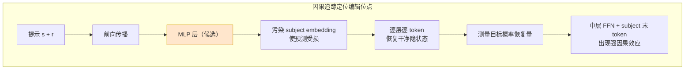
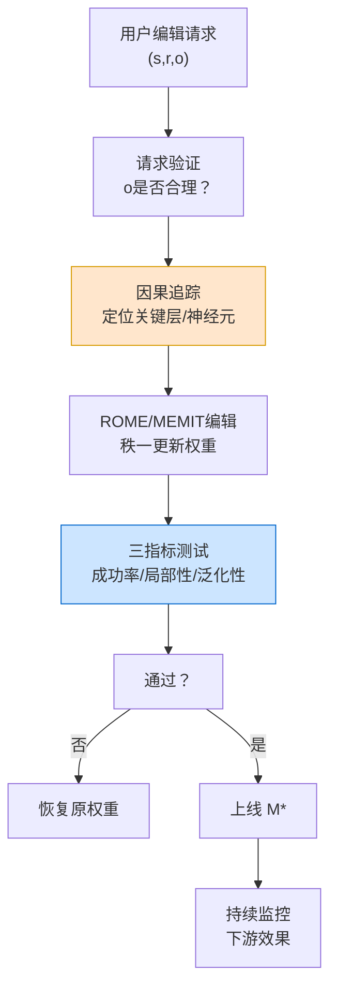

# 第 31 章 知识编辑与模型记忆：ROME、MEMIT 与 Unlearning ⭐⭐⭐⭐

> [!abstract] 本章导航
> **定位**：区分参数知识、外部知识和可删除记忆，建立知识修改的工程边界。
>
> **先修**：[[12_Transformer与大模型原理]]、[[14_RAG检索增强生成]]。
>
> **学习目标**：
> - 区分知识编辑、持续学习、机器遗忘和 RAG。
> - 解释 ROME、MEMIT 等方法的目标与评估。
> - 根据可追溯性、更新频率和风险选择方案。
>
> **建议路径**：问题定义 → ROME / MEMIT 算法 → 知识注入与持续学习 → … → 与 RAG 的权衡：工程选择。先完成主线，再按需要阅读进阶内容。
>
> **配套代码**：本章暂无独立代码目录，使用正文推导、自测题和决策表验收。

> [!info] 阅读提示
> 预训练模型把事实与行为分布式编码在参数中，精确修改或移除某条影响并不等同于普通微调；
> 后者可能产生无关干扰，也不能自动提供删除保证。本章梳理 ROME、MEMIT、知识注入与
> Machine Unlearning，并强调研究指标与生产合规之间的边界。
>
> 🆕 **截至 2026-07-31**：MEMIT 原论文在 GPT-J 6B 与 GPT-NeoX 20B 上演示了上千条
> association 的批量编辑，不能外推为已验证 GPT-4 级闭源模型。TOFU 是机器遗忘评测基准，
> 其原论文反而指出所测基线均未实现有效遗忘；因此 Unlearning 仍是活跃研究问题，而非成熟、
> 可直接满足监管要求的工具链。

## 31.1 问题定义 ⭐⭐⭐⭐⭐

### 31.1.1 什么是知识编辑？

知识编辑指**在不重新预训练、不破坏其他知识的前提下，修改模型对特定事实的输出**。典型场景：

| 场景 | 例子 |
|------|-----|
| **纠错** | 修正模型对某个有明确生效日期和来源的事实；政治人物等时变事实应注明核验日期 |
| **注入新事实** | 插入「[新公司名]成立于 2026 年」 |
| **遗忘个人数据** | 在适用法律、请求范围与例外明确后，删除源数据并评估模型残留影响 |

形式化定义：给定事实 $(s, r, o)$（主语-关系-宾语，如「(巴黎, 首都, 法国)」），当前模型输出 $M(s) \neq o$，希望修改 $M \to M^*$ 使得：
1. $M^*(s) = o$（成功编辑）
2. $M^*$ 在其他知识上的表现接近 $M$（**局部性**：不破坏无关知识）
3. $M^*$ 在相关知识上表现一致（**泛化性**：如「法国的首都是哪里」也返回正确）

### 31.1.2 知识神经元假说与因果追踪

知识在模型中是如何存储的？「知识神经元假说」（Knowledge Neurons）提出：特定事实由特定小集合神经元编码。

**因果追踪实验**（ROME 论文核心）：先给 subject token 的 embedding 加噪声，使事实预测受损；
再逐层、逐 token 恢复干净的隐藏状态，测量目标答案概率恢复量。结果将重要因果效应定位到
**中间层 FFN 在处理 subject 最后一个 token 时的计算**。这不是在末层逐个置零神经元，也没有
得到“每条事实由约 10 个神经元控制”的通用结论。



### 31.1.3 为什么微调不是好选择？

| 方法 | 优点 | 缺点 |
|------|------|-----|
| 全量微调 | 效果好 | 成本高、灾难性遗忘 |
| LoRA 微调 | 成本低 | 易破坏局部性、泛化弱 |
| Prompt 工程 | 无需改权重、实施成本低 | 占上下文，可绕过且不保证可靠 |
| **知识编辑** | 一次性修改、局部性好 | 技术复杂、需定位位点 |

## 31.2 ROME / MEMIT 算法 ⭐⭐⭐⭐⭐

### 31.2.1 ROME：Rank-One Model Editing

ROME（Rank-One Model Editing，Meng et al., 2022, arXiv:2202.05262）用因果追踪选择一个
中间层 MLP，并对其第二个线性层权重施加秩一更新，以编辑单条 factual association。

**直觉**：事实 $(s,r,o)$ 的计算可建模为：
$$o \approx W_2 \cdot \sigma(W_1 \cdot h_{\text{last}})$$
其中 $k^*$ 是所选中间层、subject 最后一个 token 处的 MLP key，$W$ 是该 MLP 的
key-to-value 投影；它不是“最后一层注意力后的隐藏态”。

ROME 的两步：
1. **定位**：找到编码该事实的「关键隐藏向量」$k^*$（MLP 输入）与「值向量」$v^*$（MLP 输出）
2. **修改权重**：对所选 MLP 的 key-to-value 权重 $W$ 做秩一更新，使 $Wk^*\approx v^*$

令 $C=\lambda\,\mathbb{E}[kk^\top]$ 为预先估计的 key 二阶矩，ROME 的更新可写为：

$$
\hat W =
W + (v^*-Wk^*)\,
\frac{(C^{-1}k^*)^\top}{(C^{-1}k^*)^\top k^*}
$$

这是秩一更新，但它只是在实验中改善 specificity/locality，并不数学保证所有无关行为不变。

### 31.2.2 MEMIT：批量编辑千条事实

MEMIT（Meng et al., 2022, arXiv:2210.07229）把多条 association 的残差分配到一组
“critical layers”，并为各层求低秩闭式更新。论文展示了上千条编辑，但仍会出现干扰和效用下降，
不能写成“互不干扰”。

核心改进：
- 为一批 key/value 约束求**闭式低秩更新**，并结合 key 协方差抑制对既有映射的影响
- 将目标残差跨多个关键 MLP 层分摊，而不是只在单层顺序套用 ROME
- 通过 paraphrase、neighborhood prompts 等测泛化与局部性；编辑关系的逆命题不会自动成立

```python
"""MEMIT 批量编辑的简化教学实现（伪代码，清晰展示核心逻辑）"""
import torch
import torch.nn as nn

def memit_edit_layer(W2: torch.Tensor,  # 原 MLP 输出层: [d_out, d_in]
                      k_list: list[torch.Tensor],  # 多个关键向量 k_i: [d_in]
                      v_list: list[torch.Tensor],  # 目标值向量 v_i: [d_out]
                      lambda_reg: float = 1e-4):
    """
    多目标 ridge 更新示意：修改 W2 使 W2 k_i ≈ v_i。
    注意：这不是完整 MEMIT；完整算法还需二阶矩、跨层残差分配和逐层更新。
    """
    d_in, d_out = W2.shape[1], W2.shape[0]
    n = len(k_list)
    K = torch.stack(k_list).t()  # [d_in, n]
    V = torch.stack(v_list).t()  # [d_out, n]
    # MEMIT 的核心：求解 (W2 + Δ) K ≈ V，Δ 低秩
    # 这里简化：用伪逆 + 正则
    # Δ = (V - W2 K) @ K.t() @ (K K.t() + λ I)^{-1}
    eye = torch.eye(d_in, device=W2.device, dtype=W2.dtype)
    system = K @ K.t() + lambda_reg * eye
    delta_W2 = torch.linalg.solve(system, K @ (V - W2 @ K).T).T
    return W2 + delta_W2

# 官方研究代码与数据：https://github.com/kmeng01/memit
```

### 31.2.3 编辑的三个评价指标

| 指标 | 定义 | 目标 |
|------|------|-----|
| **成功率/efficacy** | 编辑后目标 prompt 的目标概率或正确率 | 相对未编辑基线与业务门槛报告 |
| **局部性/specificity** | neighborhood/unrelated prompts 的输出变化 | 越小越好，并报告置信区间 |
| **泛化性/generalization** | paraphrased prompts 上的目标概率或正确率 | 越高越好，阈值由任务校准 |

不存在跨模型、跨数据集通用的“95%/5%/85% 合格线”。还应测多轮编辑后的 interference、
fluency、通用能力回归以及编辑是否能被反向提示恢复。

## 31.3 知识注入与持续学习 ⭐⭐⭐⭐

### 31.3.1 知识注入：参数高效插入新知识

知识注入（Knowledge Injection）与知识编辑不同：前者是**插入新事实**，后者是**修改已有事实**。常用方法：
1. **前缀调优**：用 soft prompt 前缀编码新知识，插入到输入前
2. **适配器**：加小 Adapter 层注入，不修改原权重
3. **LoRA+事实**：用 LoRA 微调仅在新知识数据上

### 31.3.2 持续学习与灾难性遗忘

持续学习（Continual Learning）指模型不断学习新任务而不遗忘旧任务——这与知识编辑紧密相关。灾难性遗忘（Catastrophic Forgetting）的三大缓解策略：

| 策略 | 原理 | 代表方法 |
|------|------|---------|
| **正则化** | 惩罚对旧任务重要权重的修改 | EWC、MAS |
| **回放** | 训练新任务时混合旧数据/生成伪数据 | Experience Replay |
| **模块化/稀疏更新** | 每个任务用独立参数子集 | Expert Gate、PackNet |

## 31.4 机器遗忘 Unlearning ⭐⭐⭐⭐

### 31.4.1 Unlearning 的正式定义

给定训练数据集 $D = D_F \cup D_E$（$D_E$ 是「需遗忘数据」），模型 $M$ 在 $D$ 上训练。Unlearning 目标：找到 $M_{\text{unlearn}}$ 使得：
1. $M_{\text{unlearn}}$ 表现接近 $M$（效用保留）
2. $M_{\text{unlearn}}$ 表现得像从未见过 $D_E$（隐私/遗忘要求）
3. 计算成本远低于从头训练在 $D_F$ 上（效率要求）

### 31.4.2 主流 Unlearning 算法

| 方法 | 原理 | 适用场景 |
|------|------|---------|
| **Whitening / 去相关** | 移除 $D_E$ 激活的协方差成分 | 小规模、特征级别 |
| **GradDiff / 梯度差分** | 减去在 $D_E$ 上的梯度 | 中规模 |
| **TOFU** | 虚构作者数据集与评测协议（不是遗忘算法） | 学术评测 |
| **SISA** | 分片、隔离、分片聚合 | 大规模数据删除 |

```python
"""GradDiff 梯度差分 Unlearning（教学版）"""
import torch
import torch.nn.functional as F

def grad_diff_unlearn(model: nn.Module,
                      D_F: list,  # 保留数据
                      D_E: list,  # 遗忘数据
                      alpha: float = 0.1):
    """
    先在 D_F 上微调，减去在 D_E 上的梯度（类似反学习）。
    """
    # 1. 前向：分别在 D_F、D_E 上计算 loss
    loss_F = compute_loss(model, D_F)
    loss_E = compute_loss(model, D_E)
    # 2. 计算两个梯度
    params = [p for p in model.parameters() if p.requires_grad]
    grad_F = torch.autograd.grad(loss_F, params, retain_graph=True)
    grad_E = torch.autograd.grad(loss_E, params)
    # 3. 更新：grad = grad_F - alpha * grad_E
    with torch.no_grad():
        for p, gF, gE in zip(params, grad_F, grad_E):
            if gF is None or gE is None:
                continue
            p -= 1e-4 * (gF - alpha * gE)  # 学习率 1e-4
```

### 31.4.3 隐私与合规：GDPR 的遗忘权

GDPR 第 17 条赋予数据主体在特定条件下请求删除其**个人数据**的权利，同时存在表达自由、法定义务、
公共利益、研究和法律请求等例外。法规规定的是控制者义务，不规定必须采用某一种 unlearning
算法，也没有把“Membership Inference Attack 成功率”规定为法定验收指标。

工程上应由法务/隐私团队先确定适用范围，再同时处理源数据、派生数据、索引、日志、备份和模型影响。
模型侧可以组合输出探测、exposure、成员推断、retain-set 效用和与 retrain oracle 的差距，但任何
单一指标都不能单独证明合规。

## 31.5 与 RAG 的权衡：工程选择 ⭐⭐⭐⭐

知识编辑 vs RAG 是常见的系统设计对比：

| 维度 | 知识编辑 | RAG |
|------|---------|-----|
| **知识来源** | 内化在模型参数 | 外部检索库 |
| **实时性** | 权重发布后生效，但可能被后续编辑覆盖或产生干扰 | 检索库可版本化更新 |
| **可追溯性** | 权重输出通常没有内置来源链 | 可返回检索来源，但仍需校验引用与生成一致性 |
| **置信度** | 不能从生成文本直接推出知识可靠性 | 可结合证据与检索分数，仍不等于事实保证 |
| **实现复杂度** | 需定位、编辑、回归、版本与回滚 | 需解析、索引、检索、权限、引用与持续评测 |
| **成本** | 产生训练/编辑、全量回归与模型发布成本 | 产生建库、更新与逐请求检索/重排成本 |
| **上下文机制** | 修改权重行为，不是文档上下文机制 | 可检索跨文档/版本证据，受召回与模型窗口约束 |

**工程选择法则**：
- 知识频繁变化 → RAG
- 知识稳定、需「模型自然输出」 → 知识编辑
- 需来源引用、可审计 → RAG
- 需模型权重内化且能承担回归评测成本 → 可实验性评估知识编辑
- 人设/风格通常优先用 system prompt、policy、adapter 或微调，不要与 factual editing 混为一谈
- 敏感个人事实优先留在可访问控制、可删除、可审计的外部存储，不建议写入模型权重

## 🧭 本章小结

本章应形成以下可复述结论：

- 区分知识编辑、持续学习、机器遗忘和 RAG。
- 解释 ROME、MEMIT 等方法的目标与评估。
- 根据可追溯性、更新频率和风险选择方案。

## ✅ 自测与练习

先合上正文，再回答以下问题；无法说明证据或边界时，回到对应小节复习。

1. 你能否区分知识编辑、持续学习、机器遗忘和 RAG？
2. 你能否解释 ROME、MEMIT 等方法的目标与评估？
3. 你能否根据可追溯性、更新频率和风险选择方案？

## 🧪 配套代码与验收

本章暂无独立代码目录。验收时应完成正文中的推导或决策题，并能在自测中说明适用边界。

成功标准：概念、输入输出、关键指标和失败条件能够相互对应，不用未经验证的性能数字代替结论。

## 🎯 面试题精讲

### 真题 1：解释 ROME 为什么用秩一更新，而不是更大的更新？这样做有什么好处？

**答**：秩一更新 $\Delta = u v^\top$ 把改动限制为低秩方向，是减少干扰的归纳偏置之一；
它不保证局部性，仍要用无关事实、邻近事实和下游任务回归来测 specificity/locality。

好处：
1. 仅修改与目标事实相关的权重方向，其他方向不变
2. 计算高效（无需矩阵分解，直接外积）
3. 可解释：$u$ 对应「哪里改」，$v$ 对应「改成什么」

若用全秩更新（整个矩阵重训），会破坏大量无关知识（灾难性遗忘）。

---

### 真题 2：知识编辑的「局部性」是什么？如何测量？举一个测量基准例子

**答**：局部性指「仅修改目标事实，不破坏其他无关知识」。

测量方法：用 ZeroRel / UnRel 基准，或：
1. 构建一个「无关问题集」（与编辑事实完全无关，如编辑地理时问历史问题）
2. 编辑前后在该集上的准确率变化越小越好

例子：可构建与目标事实无共享实体/关系的 neighborhood/unrelated 集，报告编辑前后概率或准确率
变化；可接受阈值应由基线、样本量、业务风险和置信区间确定，而不是固定为 5%。

---

### 真题 3：对比知识编辑与 RAG 的优缺点，什么时候该选哪个？

**答**：

- **RAG 优先**：
  - 知识频繁更新（如新闻、产品价格）
  - 需要来源引用、可审计
  - 长文档/多文档知识
  - 实现成本低，团队熟悉向量库

- **知识编辑优先**：
  - 知识稳定、能明确表达为 factual association，且已有编辑后回归集
  - 需要无检索路径的特定事实响应，并能接受模型版本化与回滚成本
  - 希望推理/生成时无检索延迟
  - 不应因“隐私敏感”而优先写入权重；敏感信息通常更适合受 ACL/加密/删除策略控制的存储

- **混合方案**：RAG 做动态、需引用的知识；prompt/adapter 管行为；知识编辑只用于经评测确认的
  稳定 factual association。

---

### 真题 4：什么是 Unlearning？它与简单的「数据删除然后重训」有什么区别？为什么需要 Unlearning？

**答**：Unlearning 指模型表现得像从未见过某数据，但成本远低于从头重训。

区别：
- 简单重训：从不含待删除数据的保留集重新训练，通常需要重新承担计算、数据与工程成本
- Unlearning：从现有 $M$ 出发近似移除指定数据影响；成本收益取决于方法、模型和删除规模

需要 Unlearning 的原因：
1. **成本**：重训太贵
2. **隐私**：在适用请求下，模型影响可能是完整数据删除流程的一部分
3. **速度**：目标是比从头重训低成本，但不能承诺所有模型都能分钟级完成或通过验收

---

### 真题 5：设计一个知识编辑 pipeline（从用户请求到模型更新），列出关键模块与风险

**答**：



关键模块：
- 请求验证层（防止编辑矛盾/有害事实）
- 因果追踪定位器（可选 GPU 加速）
- MEMIT 批量编辑器
- 三指标测试套件
- 回滚机制
- 监控（编辑事实的输出分布）

风险：
- 局部性破坏（误删相关知识）
- 编辑泛化不足（仅原 prompt 生效）
- 恶意编辑后门

## 📋 本章速查表

| 知识点 | 核心公式/关键概念 | 面试考察重点 |
|-------|-----------------|-------------|
| 知识编辑定义 | $M \to M^*$，满足：$M^*(s)=o$、局部性、泛化性 | 三条要求 |
| 因果追踪 | 污染 subject embedding，再逐层逐 token 恢复状态 | 定位中层 FFN 因果位点 |
| ROME 秩一更新 | 使用 $C^{-1}k^*$ 加权的 key 方向 | 闭式解与二阶矩作用 |
| MEMIT 批量编辑 | 低秩约束解 $\Delta$ 使得 $(W+\Delta) K \approx V$ | 低秩的作用 |
| 编辑三指标 | 成功率、局部性、泛化性 | 每个指标的含义与目标 |
| 持续学习 | 正则化、回放、模块化 | 灾难性遗忘缓解策略 |
| Unlearning | 与只在 retain set 重训的 oracle 接近，同时保留效用 | 仍是研究目标，不等于自动合规 |
| GradDiff | $grad = grad_F - \alpha grad_E$ | 梯度差分的直觉 |
| RAG vs 编辑 | 内化/参数 vs 外部/检索 | 工程选择法则 |

## 🔗 相关章节

- [[12_Transformer与大模型原理]]：MLP 层的知识存储机制
- [[16_模型微调与推理优化]]：LoRA 与知识编辑的对比
- [[14_RAG检索增强生成]]：RAG vs 编辑的权衡
- [[23_AI安全与伦理]]：Unlearning 的合规要求
- [[30_高效序列架构SSM与Mamba]]：不同架构上的知识编辑难度

## 📖 一手参考资料

- Meng et al., [Locating and Editing Factual Associations in GPT（ROME）](https://arxiv.org/abs/2202.05262)
- Meng et al., [Mass-Editing Memory in a Transformer（MEMIT）](https://arxiv.org/abs/2210.07229)
- ROME/MEMIT 官方研究代码：[kmeng01/memit](https://github.com/kmeng01/memit)
- Maini et al., [TOFU: A Task of Fictitious Unlearning for LLMs](https://arxiv.org/abs/2401.06121)
- European Commission, [Do we always have to delete personal data if a person asks?](https://commission.europa.eu/law/law-topic/data-protection/information-business-and-organisations/dealing-requests-individuals/do-we-always-have-delete-personal-data-if-person-asks_en)
- EUR-Lex, [GDPR Article 17 — Right to erasure](https://eur-lex.europa.eu/eli/reg/2016/679/art_17/oj)

> 核验日期：2026-08-04。版本、价格、法规、模型能力和 benchmark 以链接页面当前状态为准。

- [[docs/AUTHORITATIVE_SOURCES|章节权威来源索引]]：按章节维护的官方文档、标准、原论文和官方仓库。
