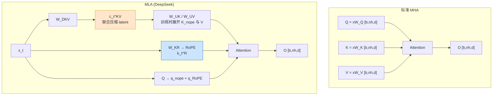
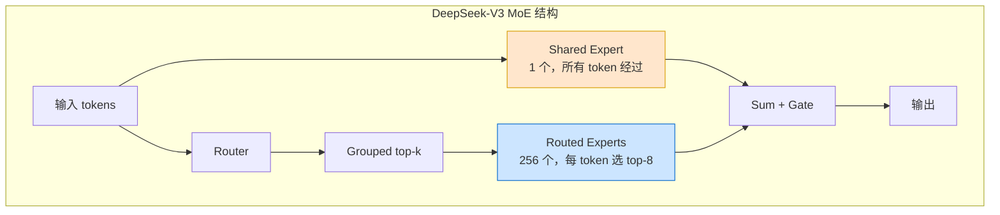

# 第 32 章 DeepSeek 风格 MoE 深水区：MLA、无辅助损失均衡、MTP 与 FP8 ⭐⭐⭐⭐⭐

> [!abstract] 本章导航
> **定位**：拆解现代高效大模型中的 MLA、MoE、MTP 和低精度训练机制。
>
> **先修**：[[12_Transformer与大模型原理]]、[[19_分布式训练系统]]、[[30_高效序列架构SSM与Mamba]]。
>
> **学习目标**：
> - 解释 MLA、细粒度 MoE、MTP 和 FP8 的协作方式。
> - 计算关键结构对显存、通信和吞吐的影响。
> - 区分公开证据、可复现实现和未经证实推断。
>
> **建议路径**：MLA：Multi-head Latent Attention → Auxiliary-loss-free 负载均衡 → Shared Experts 与细粒度分割 → … → DeepSeek-V3 成本拆解：2.788M H800 hours。先完成主线，再按需要阅读进阶内容。
>
> **配套代码**：本章暂无独立代码目录，使用正文推导、自测题和决策表验收。

> [!info] 阅读提示
> 从 DeepSeek-V2 的 MLA（Multi-head Latent Attention）到 DeepSeek-V3 的
> auxiliary-loss-free 负载均衡、shared experts、FP8 训练与 Multi-Token Prediction，
> DeepSeek 是理解公开 MoE 工程实践的代表性案例。本章讲清原理、代码边界与成本口径。
>
> 🆕 **截至 2026-07-31**：DeepSeek-V4 Preview 已于 2026-04-24 正式上线、开放 API 并
> 开源权重；官方材料给出 V4-Pro 1.6T/49B 激活、V4-Flash 284B/13B 激活，以及 token-wise
> compression + DeepSeek Sparse Attention。它仍明确标为 **Preview**。本章聚焦具有完整公开
> 细节的 V2/V3：V3 为 671B 总参数、每 token 激活 37B，采用 auxiliary-loss-free 主路由均衡，
> 同时仍保留很小的 sequence-wise auxiliary loss。不要把 V3 的路由、FP8、训练成本或尺寸直接
> 套到 V4；V4 的生产成熟度也必须按实际服务、权重 revision 和评测重新确认。

## 32.1 MLA：Multi-head Latent Attention ⭐⭐⭐⭐⭐

### 32.1.1 为什么需要 MLA：Attention 的显存瓶颈

标准 MHA 需同时缓存 K 和 V，元素数为
$2n\,n_h d_h$。当 $n=128\text{K}$、$n_h=128$、$d_h=128$ 时，每层为
$2\times131072\times128\times128=4{,}294{,}967{,}296$ 个 FP16 元素，即约 **8 GiB/层**。
实际模型可能使用 GQA/MQA、分页和低精度 KV，必须按真实 KV heads、head dim、dtype、batch
与层数重新计算。

MLA 的核心洞察：**KV 可被联合低秩压缩，而不会显著影响精度**。

### 32.1.2 MLA 的数学形式

MLA（Multi-head Latent Attention）先把每个 token 的 K/V 信息联合压缩为低秩 latent
$c_t^{KV}$，并为 decoupled RoPE 另存一个小的 key 分量。DeepSeek-V3 的关键维度为
$d_c=512$、$d_h^R=64$。



数学推导：
$$
\begin{aligned}
c_t^{KV} &= W^{DKV}h_t \in \mathbb{R}^{d_c} \\
[k_{t,1}^{C},\ldots,k_{t,n_h}^{C},v_{t,1}^{C},\ldots,v_{t,n_h}^{C}]
  &= W^{UKV}c_t^{KV} \\
k_t^R &= \operatorname{RoPE}(W^{KR}h_t) \\
q_{t,i} &= [q_{t,i}^{C};q_{t,i}^{R}],\qquad
k_{t,i}=[k_{t,i}^{C};k_t^R]
\end{aligned}
$$

推理时可把上投影吸收到 Q/输出投影中，缓存只需每 token 的
$c_t^{KV}$ 与 $k_t^R$，即 $512+64=576$ 个标量。若与同维度的 MHA
$2\times128\times128=32768$ 个标量比较，理论元素数约减少 **56.9 倍**；与 GQA、不同 dtype
或包含量化元数据的实现比较时比例会不同。

```python
"""MLA 教学实现：缓存联合 KV latent 与 decoupled-RoPE key。

为便于阅读，代码在计算时显式展开 K/V；生产 decode 会吸收投影，避免每步展开全部历史。
"""
import torch
import torch.nn as nn
import torch.nn.functional as F

class MLAttention(nn.Module):
    def __init__(self, d_model: int, n_heads: int, kv_rank: int = 512,
                 qk_nope_dim: int = 128, rope_dim: int = 64,
                 v_head_dim: int = 128):
        super().__init__()
        self.n_heads = n_heads
        self.kv_rank = kv_rank
        self.qk_nope_dim = qk_nope_dim
        self.rope_dim = rope_dim
        self.v_head_dim = v_head_dim
        self.q_proj = nn.Linear(
            d_model, n_heads * (qk_nope_dim + rope_dim), bias=False
        )
        # 一次下投影同时产生 KV latent 与独立 RoPE key。
        self.kv_down = nn.Linear(d_model, kv_rank + rope_dim, bias=False)
        self.kv_up = nn.Linear(
            kv_rank, n_heads * (qk_nope_dim + v_head_dim), bias=False
        )
        self.out_proj = nn.Linear(n_heads * v_head_dim, d_model, bias=False)

    @staticmethod
    def _rotate_half(x: torch.Tensor) -> torch.Tensor:
        x1, x2 = x.chunk(2, dim=-1)
        return torch.cat((-x2, x1), dim=-1)

    def _rope(self, x: torch.Tensor, offset: int) -> torch.Tensor:
        # x: [batch, seq, heads, rope_dim]
        positions = torch.arange(
            offset, offset + x.shape[1], device=x.device, dtype=torch.float32
        )
        inv_freq = 1.0 / (
            10000 ** (
                torch.arange(0, self.rope_dim, 2, device=x.device).float()
                / self.rope_dim
            )
        )
        angles = torch.outer(positions, inv_freq)
        emb = torch.cat((angles, angles), dim=-1)[None, :, None, :]
        return x * emb.cos().to(x.dtype) + self._rotate_half(x) * emb.sin().to(x.dtype)

    def forward(self, x: torch.Tensor, past_kv=None):
        """
        x: [batch, seq_len, d_model]
        past_kv: (past_c_kv, past_k_rope)
        """
        b, l, _ = x.shape
        nh = self.n_heads
        q = self.q_proj(x).view(
            b, l, nh, self.qk_nope_dim + self.rope_dim
        )
        q_nope, q_rope = q.split([self.qk_nope_dim, self.rope_dim], dim=-1)

        down = self.kv_down(x)
        c_kv, k_rope = down.split([self.kv_rank, self.rope_dim], dim=-1)
        past_len = 0 if past_kv is None else past_kv[0].shape[1]
        q_rope = self._rope(q_rope, past_len)
        k_rope = self._rope(k_rope.unsqueeze(2), past_len)

        if past_kv is not None:
            c_kv = torch.cat((past_kv[0], c_kv), dim=1)
            k_rope = torch.cat((past_kv[1], k_rope), dim=1)
        new_past_kv = (c_kv, k_rope)

        # 教学版显式上投影；生产版会通过权重吸收避免展开历史 K/V。
        kv = self.kv_up(c_kv).view(
            b, c_kv.shape[1], nh, self.qk_nope_dim + self.v_head_dim
        )
        k_nope, value = kv.split(
            [self.qk_nope_dim, self.v_head_dim], dim=-1
        )
        key = torch.cat((k_nope, k_rope.expand(-1, -1, nh, -1)), dim=-1)
        query = torch.cat((q_nope, q_rope), dim=-1)
        scores = torch.einsum("blhd,bshd->bhls", query, key)
        scores = scores / (query.shape[-1] ** 0.5)
        key_pos = torch.arange(c_kv.shape[1], device=x.device)
        query_pos = past_len + torch.arange(l, device=x.device)
        causal = key_pos[None, :] <= query_pos[:, None]
        scores = scores.masked_fill(~causal[None, None, :, :], float("-inf"))
        probs = F.softmax(scores, dim=-1)
        out = torch.einsum("bhls,bshv->blhv", probs, value)
        return self.out_proj(out.reshape(b, l, -1)), new_past_kv
```

### 32.1.3 RoPE 的位置编码处理

MLA 将每个 head 的 Q/K 拆成 non-RoPE 与 RoPE 两部分。Q 的 $q_i^R$ 和共享的 key 分量
$k_t^R$ 都应用 RoPE；V 不使用 RoPE。缓存因此除了 $c_t^{KV}$ 还必须保存 $k_t^R$。

## 32.2 Auxiliary-loss-free 负载均衡 ⭐⭐⭐⭐

### 32.2.1 Switch Transformer 的辅助损失问题

Switch Transformer 的主要辅助负载损失写为：

$$
\mathcal{L}_{aux}=N\sum_{i=1}^{N} f_iP_i
$$

其中 $f_i$ 是发往专家 $i$ 的 token 比例，$P_i$ 是该专家平均路由概率。CV 形式见于其他
MoE 工作，不能直接标成 Switch Transformer 公式。

问题：
- 调参敏感（需平衡任务 loss 与负载 loss）
- 易「过均衡」——路由往均匀靠，牺牲任务性能
- 训练不稳定

### 32.2.2 DeepSeek-V3 的方案：动态偏置路由

DeepSeek-V3 对主负载均衡采用**不参与反向传播的 expert-wise correction bias**。它只影响
top-k 专家选择，实际混合权重仍来自未加 bias 的 affinity score。训练时根据近期负载，以固定
update speed 调低过载专家 bias、调高欠载专家 bias。论文还保留了很小的 sequence-wise
auxiliary loss，不能表述为“完全没有 auxiliary loss”。

路由概率计算：
$$
s_i(x)=\sigma(h_x^\top e_i),\qquad
g_i'(x)=
\begin{cases}
s_i(x),&s_i(x)+b_i\in\operatorname{TopK}\\
0,&\text{otherwise}
\end{cases}
$$

其中 $b_i$ 是非梯度 correction bias：
- 专家负载过高：**减小** $b_i$，降低后续入选概率；
- 专家负载过低：**增大** $b_i$，提高后续入选概率。

```python
"""DeepSeek-V3 风格 correction-bias 路由（省略 grouped top-k 与分布式同步）。"""
import torch
import torch.nn as nn

class CorrectionBiasRouter(nn.Module):
    def __init__(self, d_model: int, n_experts: int,
                 bias_update_speed: float = 1e-3):
        super().__init__()
        self.n_experts = n_experts
        self.bias_update_speed = bias_update_speed
        self.router = nn.Linear(d_model, n_experts, bias=False)
        # buffer：不由 optimizer/gradient 更新。
        self.register_buffer("correction_bias", torch.zeros(n_experts))

    def forward(self, x: torch.Tensor, top_k: int = 8):
        scores = self.router(x).sigmoid()
        selection_scores = scores + self.correction_bias
        indices = selection_scores.topk(top_k, dim=-1).indices
        # 组合专家输出时使用原始 score，不把 correction bias 混入权重。
        weights = scores.gather(-1, indices)
        weights = weights / weights.sum(dim=-1, keepdim=True).clamp_min(1e-9)
        if self.training:
            self.update_bias(indices)
        return indices, weights

    @torch.no_grad()
    def update_bias(self, indices: torch.Tensor) -> None:
        counts = torch.bincount(indices.reshape(-1), minlength=self.n_experts)
        target = counts.float().mean()
        # 生产分布式实现需先跨 DP ranks 汇总 counts。
        self.correction_bias.add_(
            self.bias_update_speed * torch.sign(target - counts.float())
        )
```

**为什么这样有效**：
- 主 task loss 不再被较强的全局均衡项直接牵引
- correction bias 形成负反馈，缓解专家过载
- 仍需 grouped top-k、capacity/通信监控和小的 sequence-wise auxiliary loss

## 32.3 Shared Experts 与细粒度分割 ⭐⭐⭐⭐

### 32.3.1 Shared Experts：常驻通用专家

Shared Experts 来自 DeepSeekMoE/DeepSeek-V2，并非 V3 首次引入。DeepSeek-V3 每个 MoE 层有
**1 个 shared expert、256 个 routed experts，每 token 激活 8 个 routed experts**，并采用
grouped top-k 限制通信范围。

动机：
- shared expert 用于捕获跨 token 常见模式，减少 routed experts 的知识冗余
- routed experts 允许更细粒度组合；不能在没有可解释性实验时把具体专家直接命名为“代码/数学/中文”
- shared expert 是额外的常驻 FFN 计算，并不会让部分 token 跳过路由

### 32.3.2 细粒度专家分割（Fine-grained Segmentation）

DeepSeek-V3 还将每个专家进一步分割为「小专家」，实现更细粒度的能力组合：



## 32.4 Multi-Token Prediction (MTP) ⭐⭐⭐⭐⭐

### 32.4.1 MTP 的动机：增加未来 token 的训练信号

MTP（Multi-Token Prediction）让每个位置除 next token 外再预测更远的未来 token，以提高
训练信号密度并鼓励表示预判后续内容。训练目标本身不等于投机解码；训练后可把 MTP 模块用于
speculative decoding，但还需实现 draft 生成、主模型验证和接受策略。

DeepSeek-V3 的第 $k$ 个 MTP module 将上一深度表示与第 $k$ 个未来 token 的共享 embedding
拼接并投影，经过一个 Transformer block，再复用共享输出 head。多个深度是**顺序依赖**的，
不是从同一个 hidden state 并行接若干小线性 head：

$$
h_i^{(k)}=\operatorname{TransformerBlock}_k
\left(M_k[h_i^{(k-1)};\operatorname{Emb}(t_{i+k})]\right)
$$

### 32.4.2 MTP 训练损失

标准 next-token prediction 仅预测下一个：
$$\mathcal{L}_\text{ce} = -\log P(y_t | x_1..x_{t-1})$$

MTP 在不同预测深度产生额外交叉熵：
$$\mathcal{L}_\text{mtp} = \frac{1}{D}\sum_{k=1}^{D}\mathcal{L}^{(k)}_\text{CE}$$

两者结合：
$$\mathcal{L}_\text{total} = \mathcal{L}_\text{ce} + \lambda \mathcal{L}_\text{mtp}$$

MTP 可以在推理系统中充当 draft proposer，但 DeepSeek-V3 的整体速度还来自 MLA、MoE、
FP8、并行与服务实现；不能把速度归因于 MTP 单一机制。

## 32.5 FP8 混合精度训练 ⭐⭐⭐⭐⭐

### 32.5.1 FP8 格式：E4M3 vs E5M2

FP8 有两种格式：

| 格式 | 指数位 | 尾数位 | 范围 | 精度 | 用途 |
|------|-------|-------|-----|-----|-----|
| **E4M3** | 4 | 3 | 最大有限值约 448 | 较高 | 常用于前向张量 |
| **E5M2** | 5 | 2 | 最大有限值约 57344 | 较低 | 需要更大动态范围的张量 |

DeepSeek-V3 报告对主要 GEMM 使用 E4M3 FP8，并保留高精度 master weights、归一化、部分累加与
敏感算子。常见 Transformer Engine HYBRID recipe 会前向用 E4M3、反向用 E5M2，但不能把该
通用 recipe 直接当作 V3 全部张量的固定映射。“显存减半/计算翻倍”也只在特定张量和支持 FP8
Tensor Core 的瓶颈下近似成立。

### 32.5.2 Block-wise Scaling（块级缩放）

直接转换会溢出或量化过粗。DeepSeek-V3 对**权重采用 128×128 block-wise scaling**，对
**激活采用 1×128 tile-wise scaling**；以下函数演示二维权重块量化，不代表完整训练 kernel。

```python
"""FP8 block-wise scaling 的简化实现"""
import torch

def to_fp8_blockwise(x: torch.Tensor, block_size: int = 128):
    """x: [m,n] → fp8 tensor + scale factors"""
    m, n = x.shape
    # padding 到 block_size 整数倍
    m_pad = ((m + block_size - 1) // block_size) * block_size
    n_pad = ((n + block_size - 1) // block_size) * block_size
    x_pad = torch.zeros(m_pad, n_pad, device=x.device, dtype=x.dtype)
    x_pad[:m, :n] = x
    # reshape 到 blocks
    blocks = x_pad.view(m_pad//block_size, block_size, n_pad//block_size, block_size)
    # 每个块独立 scale
    fp8_max = 448.0
    amax = blocks.abs().amax(dim=(1, 3), keepdim=True)
    scales = (amax / fp8_max).clamp_min(torch.finfo(torch.float32).tiny)
    q = (blocks / scales).clamp(-fp8_max, fp8_max).to(torch.float8_e4m3fn)
    return q, scales, (m, n)

def from_fp8_blockwise(fp8_blocks, scales, orig_shape):
    m, n = orig_shape
    blocks = fp8_blocks.to(torch.float32) * scales
    m_pad = blocks.shape[0] * blocks.shape[1]
    n_pad = blocks.shape[2] * blocks.shape[3]
    return blocks.reshape(m_pad, n_pad)[:m, :n]
```

### 32.5.3 数值稳定性技巧

- **scaling 因子更新**：EMA 平滑，避免每步剧烈变化
- **梯度裁剪**：保护 FP8 溢出
- **关键层保持 FP16**：LayerNorm、LM Head 等敏感层保持 FP16/BF16

## 32.6 DeepSeek-V3 成本拆解：2.788M H800 hours ⭐⭐⭐⭐

报告列出：预训练 2.664M、context extension 119K、alignment/post-training 5K H800
GPU-hours，合计 2.788M。按报告采用的假设租价 2 美元/GPU-hour，可得到 5.576M 美元。

这个数字只覆盖官方训练运行，不包含前期研究、消融实验、失败运行、数据获取/清洗、人员、存储、
网络、机房和推理服务，不能称为“完整训练总成本”。论文也没有给出“MoE 40%、通信 25%”或
“FP8 省 30%”等分项比例，故不应自行拆账。

## 🧭 本章小结

本章应形成以下可复述结论：

- 解释 MLA、细粒度 MoE、MTP 和 FP8 的协作方式。
- 计算关键结构对显存、通信和吞吐的影响。
- 区分公开证据、可复现实现和未经证实推断。

## ✅ 自测与练习

先合上正文，再回答以下问题；无法说明证据或边界时，回到对应小节复习。

1. 你能否解释 MLA、细粒度 MoE、MTP 和 FP8 的协作方式？
2. 你能否计算关键结构对显存、通信和吞吐的影响？
3. 你能否区分公开证据、可复现实现和未经证实推断？

## 🧪 配套代码与验收

本章暂无独立代码目录。验收时应完成正文中的推导或决策题，并能在自测中说明适用边界。

成功标准：概念、输入输出、关键指标和失败条件能够相互对应，不用未经验证的性能数字代替结论。

## 🎯 面试题精讲

### 真题 1：解释 MLA 如何压缩 KV Cache？压缩倍数如何计算？

**答**：

压缩原理：
- 标准 MHA：每 token 缓存 K 和 V，共 $2n_hd_h$ 个标量
- V3 MLA：每 token 缓存 512 维 $c_t^{KV}$ 与 64 维 decoupled-RoPE key
- 以 $n_h=128,d_h=128$ 的 MHA 为基线：$32768/576\approx56.9$；换成 GQA 或不同 dtype
  必须重算，不能背“128 倍”

精度损失小的原因：
- 注意力本质是低秩的（不需要完整 $n_h d_k$ 空间来表示相关性）
- 压缩是端到端学习的（$W_c, W_{o_k}, W_{o_v}$ 一起训练）
- Q/K 的小 RoPE 分量保留位置信息，较大的 non-RoPE K/V 信息走低秩 latent

---

### 真题 2：Switch Transformer 的辅助损失有什么问题？DeepSeek-V3 如何解决？

**答**：

辅助损失的问题：
1. 调参敏感：需平衡任务 loss 与负载 loss，权重 $\lambda$ 难调
2. 过均衡：为了负载均匀，路由「不敢」选最适合的专家，牺牲任务性能
3. 训练不稳定：负载统计抖动导致路由分布剧烈变化

DeepSeek-V3 的解决：
- 主路由均衡使用**非梯度 correction bias**：高负载专家 bias 减小
- bias 仅影响 top-k 选择，混合权重仍来自原始 affinity score
- 保留很小的 sequence-wise auxiliary loss，并结合 grouped top-k 与跨 rank 负载统计

---

### 真题 3：什么是 Shared Experts？设计动机是什么？共享专家与路由专家如何分工？

**答**：

Shared Experts 是「被所有 token 选中的专家」，不参与路由。

动机：
- 通用能力（如基础语法、连贯性）不需要路由选择 → 放在 shared experts
- 减少路由计算量（部分计算是固定的）
- 训练更稳定（shared experts 不随路由抖动变化）

分工：
- **Shared Expert**：1 个，每 token 都经过
- **Routed Experts**：256 个，每 token top-8，并先做 grouped top-k
- “通用/专用”是设计动机；具体某个 expert 是否对应代码、数学或语言需实证分析

---

### 真题 4：MTP 是什么？训练时与推理时分别如何使用？与投机解码的关系？

**答**：

MTP = Multi-Token Prediction：通过顺序 MTP modules 对更远未来 token 增加训练目标。

训练时：
- 每一深度组合上一层表示与对应未来 token embedding，再经过 Transformer block
- 与标准 CE 结合：$\mathcal{L} = \mathcal{L}_\text{ce} + \lambda \mathcal{L}_\text{mtp}$

推理时：
- 可将 MTP module 改作 draft proposer
- 由主模型并行验证（投机解码）
- 接受率高 → 加速显著

关系：MTP 目标可为投机解码提供原生 draft 能力，但训练目标与推理验收算法是两个模块。

---

### 真题 5：FP8 混合精度训练有什么关键技巧？块级缩放 vs 全局缩放？

**答**：

关键技巧：
1. **格式选择**：按动态范围和硬件 recipe 选择 E4M3/E5M2；V3 主要 GEMM 报告为 E4M3
2. **细粒度缩放**：权重 128×128 block-wise，激活 1×128 tile-wise
3. **关键层保持 FP16**：LayerNorm、LM Head、路由层等敏感层用 FP16/BF16
4. **梯度裁剪**：保护 FP8 溢出
5. **EMA 更新 scale**：缩放因子平滑更新，避免每步抖动

块级 vs 全局缩放：
- 全局缩放：简单但精度损失大（对整个矩阵找一个 scale，尾部被截断）
- 块级缩放：复杂但精度高（每个小尺度适配）

## 📋 本章速查表

| 知识点 | 核心公式/关键参数 | 面试考察重点 |
|-------|-----------------|-------------|
| MLA 动机 | MHA KV Cache 为 $2n n_h d_h$ 个元素 | K/V 两项不能漏算 |
| MLA 压缩 | 缓存 $c_t^{KV}$（512）+$k_t^R$（64） | 与同配置 MHA 约 56.9× 元素压缩 |
| MLA 实现 | non-RoPE + decoupled RoPE；推理权重吸收 | Q/K 都有 RoPE 分量 |
| Switch 负载均衡 | $\mathcal{L}_{aux}=N\sum_i f_iP_i$ | 辅助损失与任务损失的权衡 |
| Correction bias | bias 只影响选择，高负载专家 bias 下调 | 非梯度更新与分布式统计 |
| Shared Experts | 1 shared + 256 routed，top-8 | 不给专家能力作无证据命名 |
| MTP | 顺序 MTP modules + 共享 embedding/output head | 训练目标与 speculative decode 分开 |
| FP8 格式 | E4M3 最大约 448，E5M2 最大约 57344 | 权重 128×128、激活 1×128 缩放 |
| DeepSeek-V3 规模 | 671B MoE、14.8T tokens、2.788M H800 h | 成本拆解 |

## 🔗 相关章节

- [[12_Transformer与大模型原理]]：MoE 基础、注意力原理
- [[16_模型微调与推理优化]]：KV Cache、量化、投机解码
- [[19_分布式训练系统]]：MoE 的专家并行、NCCL 通信
- [[25_推理引擎与高性能服务]]：DeepSeek 推理引擎与 MoE 推理优化
- [[30_高效序列架构SSM与Mamba]]：不同架构的 MoE 适配

## 📖 一手参考资料

- DeepSeek-AI, [DeepSeek-V4 Preview 官方发布说明](https://api-docs.deepseek.com/news/news260424/)
- DeepSeek-AI, [DeepSeek-V4 Technical Report](https://huggingface.co/deepseek-ai/DeepSeek-V4-Pro/blob/main/DeepSeek_V4.pdf)
- DeepSeek-AI, [DeepSeek-V3 Technical Report](https://arxiv.org/abs/2412.19437)
- DeepSeek-AI, [DeepSeek-V3 官方仓库与推理实现](https://github.com/deepseek-ai/DeepSeek-V3)
- DeepSeek-AI, [DeepSeek-V2: MLA 与 DeepSeekMoE](https://arxiv.org/abs/2405.04434)
- Fedus et al., [Switch Transformers](https://jmlr.org/papers/v23/21-0998.html)
- NVIDIA Megatron Core, [Multi-Token Prediction](https://docs.nvidia.com/megatron-core/developer-guide/latest/user-guide/features/multi_token_prediction.html)
- NVIDIA Transformer Engine, [FP8 Current Scaling](https://docs.nvidia.com/deeplearning/transformer-engine/user-guide/features/low_precision_training/fp8_current_scaling/fp8_current_scaling.html)
- NVIDIA Transformer Engine, [FP8 Blockwise Scaling](https://docs.nvidia.com/deeplearning/transformer-engine/user-guide/features/low_precision_training/fp8_blockwise_scaling/fp8_blockwise_scaling.html)

> 核验日期：2026-08-04。版本、价格、法规、模型能力和 benchmark 以链接页面当前状态为准。

- [[docs/AUTHORITATIVE_SOURCES|章节权威来源索引]]：按章节维护的官方文档、标准、原论文和官方仓库。
