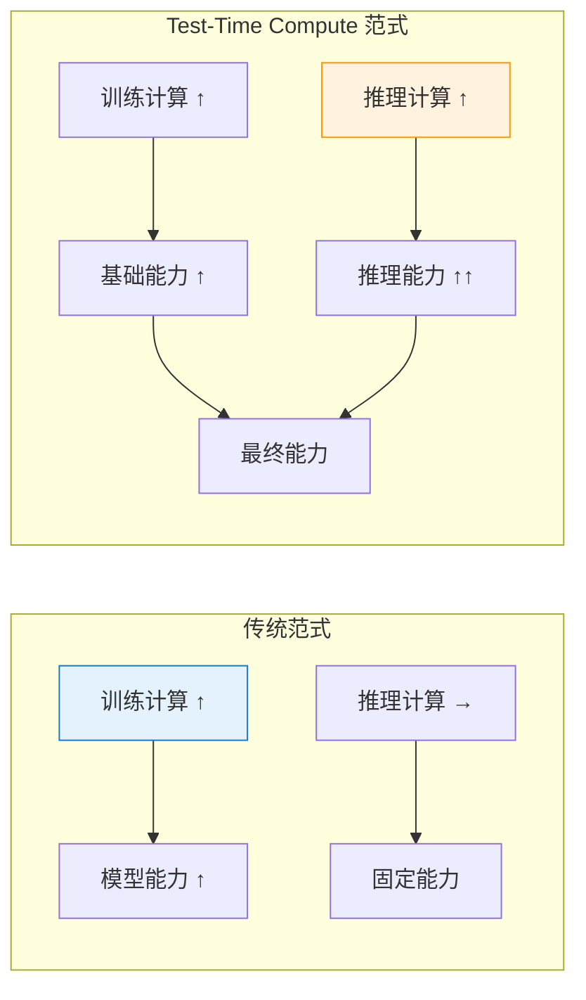
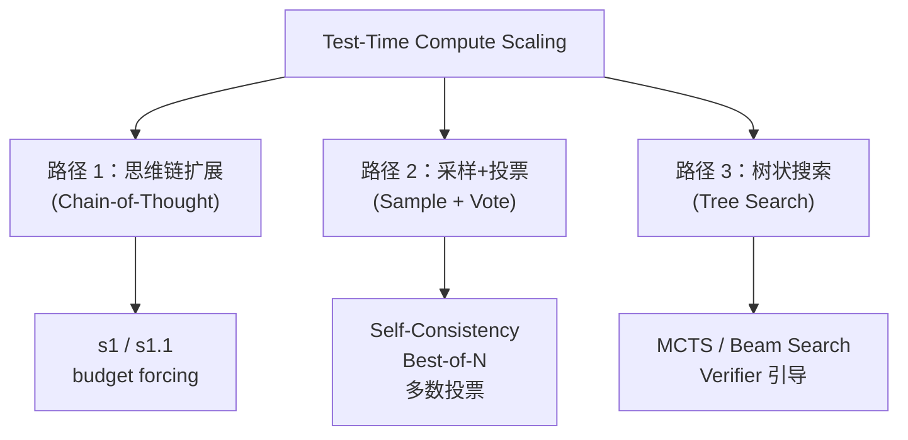
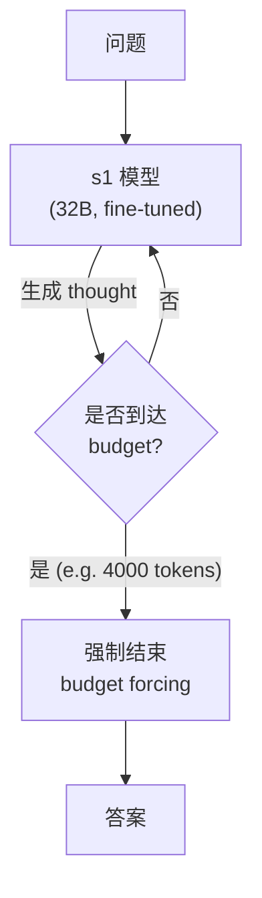
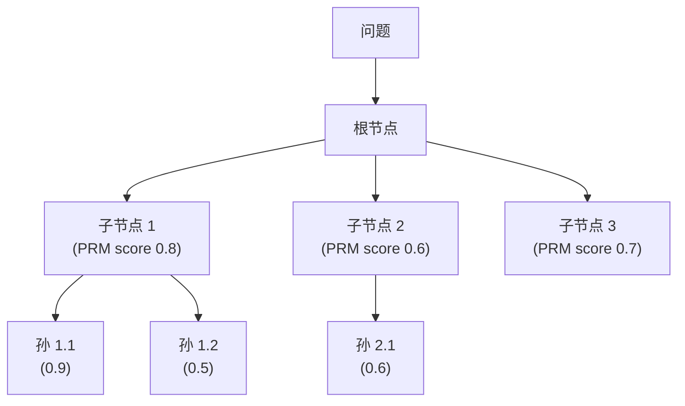
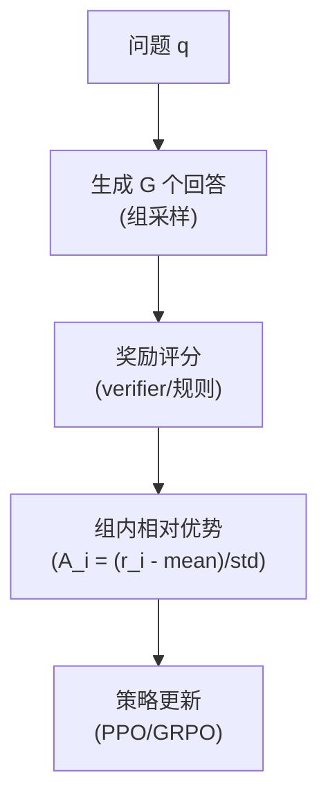

# 第 32 章 推理模型与 Test-Time Compute ⭐⭐⭐⭐
> [!abstract] 本章导航
> **定位**：第五部分 数据、训练、对齐、评估与安全中的第 32 章；围绕“推理模型与 Test-Time Compute”建立单一、可追踪的知识主线。
>
> **先修**：[[31_偏好对齐与强化学习|第 31 章 偏好对齐与强化学习]]。
>
> **学习目标**：
> - 解释 Extended Thinking 与推理提示 的核心问题、机制与适用边界。
> - 实现或评估 推理时计算（Test-Time Compute） ⭐⭐⭐⭐⭐ 的最小闭环。
> - 使用可复现证据诊断 推理模型数据工程 的工程取舍与失败模式。
>
> **建议路径**：Extended Thinking 与推理提示 → 推理时计算（Test-Time Compute） ⭐⭐⭐⭐⭐ → 推理模型数据工程 → 推理模型范式 → Reasoning Effort API → 推理时计算扩展 (Test-Time Compute Scaling) → 生产边界与面试表达。
>
> **配套代码**：`code/ch32_reasoning_ttc/`。

本章先回答“Extended Thinking 与推理提示”为什么成立，再沿着机制、实现、评估和边界逐步展开。阅读时先建立因果链，再运行或推演示例，最后用章末自测检查能否脱离原文复述。
## 32.1 Extended Thinking 与推理提示
### 32.1.1 Extended Thinking 与 Reasoning Prompts

Extended Thinking/Reasoning 是模型厂商提供的**推理强度控制机制**。它能在部分任务上改善质量，但参数语义、是否返回 thinking block、计费方式和可用档位均是**模型版本相关**的，不能把它理解为可精确分配“真实思考 token”的统一标准。

#### 32.1.1.1 主流厂商实现对比

| 厂商/模型代际 | 当前控制方式 | 迁移注意 |
|------|---------|---------|
| **Anthropic Claude 4.7+** | `thinking={"type": "adaptive"}`，用 `output_config={"effort": ...}` 调节 | 旧版 4.5 的手动 `budget_tokens` 不能照搬到 4.7+ |
| **OpenAI GPT-5.6** | Responses API：`reasoning={"effort": "none\|low\|medium\|high\|xhigh\|max"}` | 先用代表性评测比较相邻档位；最高档不必然最优 |
| **Google Gemini 3+** | `thinking_level` | Gemini 2.5 的数值 `thinking_budget` 属于旧代际接口 |
| **DeepSeek / Qwen** | 由具体模型与推理框架决定 | “thinking 模型”与参数名不能跨服务商类推 |

#### 32.1.1.2 Anthropic Extended Thinking 代码示例

```python
import anthropic

client = anthropic.Anthropic()

# Claude 4.7+：启用 adaptive thinking，并用 effort 调节
response = client.messages.create(
    model="claude-opus-4-8",
    max_tokens=16000,
    thinking={"type": "adaptive"},
    output_config={"effort": "high"},
    messages=[{
        "role": "user",
        "content": (
            "一家公司有 3 个仓库，分别有 2400/1800/3000 件商品。"
            "需按 7:3 比例分配到区域 A 和 B。仓库 A 到 A/B 距离 10/25km，"
            "仓库 B 到 A/B 距离 15/10km，仓库 C 到 A/B 距离 20/5km，"
            "单位运输成本 2 元/km/件。求最小化运输成本的分配方案。"
        )
    }]
)

# 按实际响应类型处理；不要假设每次都有 thinking block
for block in response.content:
    if block.type == "thinking":
        print(f"【API 提供的 thinking 内容】{block.thinking[:500]}...")
    elif block.type == "text":
        print(f"【最终答案】{block.text}")

print(f"输入 tokens:  {response.usage.input_tokens}")
print(f"输出 tokens:  {response.usage.output_tokens}")
```

> `output_tokens` 已按该 API 的计费口径统计输出；不要臆造一个 SDK 未提供的 `thinking_tokens` 字段。生产日志也不应默认保存 thinking 内容，其中可能包含用户数据或内部上下文。Anthropic 4.6 的手动 `enabled/budget_tokens` 已弃用，4.7+ 会拒绝该旧配置。

#### 32.1.1.3 Reasoning Prompt 设计原则

| 原则 | 说明 | 示例 |
|------|------|------|
| **任务分层** | 区分是否值得增加推理成本 | 数学/规划可比较相邻 effort；简单改写优先低延迟基线 |
| **评测选档** | 用代表性任务比较质量、延迟与 token | 不根据任务名称直接硬编码最高档 |
| **外部验证** | 用计算器、测试、约束器或人工复核 | “让模型自检”不能替代独立验证 |
| **截断保护** | 设置输出上限、超时和总成本预算 | 截断后按 API 的 incomplete/stop reason 分支处理 |

权威参考（核验日期：2026-07-31）：[Anthropic Extended Thinking](https://platform.claude.com/docs/en/build-with-claude/extended-thinking)、[OpenAI GPT-5.6 model guidance](https://developers.openai.com/api/docs/guides/latest-model)。

---

## 32.2 推理时计算（Test-Time Compute） ⭐⭐⭐⭐⭐

> **2026年重要趋势**：Test-Time Compute（推理时计算 / 推理时扩展）成为部署架构的核心考量因素。
> 不同提供商暴露的参数并不统一，应按具体模型文档配置，不能自造一套“通用档位”。

### 32.2.1 什么是推理时计算

传统范式：模型能力只取决于**训练时的计算量**（模型大小 × 训练数据量）。

**Test-Time Compute 范式**：模型能力 = 训练计算 + **推理计算**（思考时间/采样次数）。



**核心洞察**：增加推理步骤、采样或验证预算，可能在不改变参数的情况下改善部分任务，但必须同时核算正确率、延迟、token 和计算成本。

### 32.2.2 推理时计算的技术手段

| 技术 | 原理 | 额外开销来源 | 如何验证效果 |
|------|------|------------|------------|
| **模型原生 reasoning effort** | 由 API 调节模型内部推理计算 | 推理 token、响应时间与费用可能增加 | 按档位比较任务成功率、token、P95 延迟与成本 |
| **Self-Consistency** | 多次采样后投票或聚合 | 多次模型调用，可串行或并行 | 比较单次采样与 N 路采样的净收益 |
| **Best-of-N Sampling** | 生成 N 个候选，用评分器选最优 | N 次生成 + 评分器调用 | 同时评估评分器偏差与端到端成功率 |
| **Tree of Thoughts** | 维护多个推理路径并搜索 | 分支数、深度与回溯次数 | 设停止条件，在目标任务集上消融 |
| **Multi-Agent Verification** | 由独立角色复核证据或结果 | Agent 调用、工具调用和同步开销 | 检查最终正确率是否覆盖额外成本 |

### 32.2.3 对部署架构的影响

Test-Time Compute 对部署架构提出了全新挑战：

下面以 **2026-07-31 官方模型指引中的 GPT-5.6** 为时点快照。`gpt-5.6` 是
`gpt-5.6-sol` 的别名；其 `reasoning.effort` 枚举为 `none`、`low`、`medium`（默认）、
`high`、`xhigh`、`max`。模型 ID 和枚举会演进，生产配置应由模型页/SDK schema 校验：

```python
from openai import AsyncOpenAI


class AdaptiveInferenceEngine:
    """示例路由器：路由规则必须由业务评测校准。"""

    EFFORT_BY_TASK = {
        "lookup": "none",
        "routine": "low",
        "analysis": "medium",
        "complex": "high",
        "critical": "max",
    }

    def __init__(self, client: AsyncOpenAI, model: str = "gpt-5.6"):
        self.client = client
        self.model = model

    async def generate(
        self,
        query: str,
        task_class: str = "routine",
        service_tier: str | None = None,
    ) -> dict:
        effort = self.EFFORT_BY_TASK[task_class]
        request_options = {}
        if service_tier is not None:
            request_options["service_tier"] = service_tier

        response = await self.client.responses.create(
            model=self.model,
            input=query,
            reasoning={"effort": effort},
            **request_options,
        )
        return {
            "answer": response.output_text,
            "reasoning_effort": effort,
            "usage": response.usage,
        }
```

这里的 `service_tier` 与 `reasoning.effort` 是两个独立维度：

| 维度 | 控制什么 | 官方示例 |
|------|----------|----------|
| `reasoning.effort` | 模型为一次回答投入多少推理计算 | GPT-5.6：`none` / `low` / `medium` / `high` / `xhigh` / `max` |
| 处理服务层级 | 请求的调度、时延与计价特征 | Standard（默认）、Fast（`service_tier="fast"`）、Flex（`service_tier="flex"`，仅支持的模型） |
| 推理模式 | 一次请求的执行方式 | GPT-5.6 的 Pro 是 `reasoning.mode="pro"`，不是独立 `-pro` 模型 slug；与 effort 独立 |

Fast mode（2026-07-30 由 Priority processing 更名）面向延迟敏感请求；Flex 面向可容忍更慢处理和
资源不可用风险的低优先级任务。二者都不会替你选择 reasoning effort，也不能保证某个固定毫秒延迟。

> 官方核验：[OpenAI 模型列表](https://developers.openai.com/api/docs/models)、
> [GPT-5.6 模型指引](https://developers.openai.com/api/docs/guides/latest-model)、
> [Fast mode](https://developers.openai.com/api/docs/guides/fast-mode) 与
> [Flex processing](https://developers.openai.com/api/docs/guides/flex-processing)。

### 32.2.4 Test-Time Compute 部署要点

**面试高频考点**：

1. **成本-质量权衡**
   - 以 `none` / `low` 作为延迟与成本基线，再逐档比较质量收益
   - `high` / `xhigh` 只在代表性任务上证明有净收益时启用
   - 模型、effort 和 service tier 分开做实验，不把效果归因混在一起

2. **Token 预算管理**
   - 监控输入、输出和可观测的 reasoning token，用产品预算设置限额与降级
   - 只使用模型页或 API schema 明确公开的预算与输出限制参数
   - 预算阈值来自线上分布和任务价值，不来自教程中的固定 token 数

3. **延迟管理**
   - 更高 effort、更多采样和更长输出都可能增加延迟，关系并非固定倍数
   - 分别记录排队、首 token、生成与工具调用耗时，并看 P50/P95/P99
   - 是否流式输出取决于模型支持；不要向用户暴露私有推理过程

4. **模型与服务边界**
   - GPT-5.6：六档 `reasoning.effort`；默认 `medium`
   - GPT-5.6 Pro mode：同一模型上的 `reasoning.mode="pro"`；与 effort 分开评估质量、延迟和用量
   - Standard / Fast / Flex：处理服务层级，不是推理强度等级；支持范围以当前模型页为准

## 32.3 推理模型数据工程
### 32.3.1 推理模型数据：R1-Distill 与 s1 长 CoT 策划 ⭐⭐⭐⭐⭐

2025 年初 DeepSeek-R1 的发布震撼业界，其开源的 **R1-Distill 数据** 与 Stanford **s1 长 CoT 数据**（s1: Simple test-time scaling）共同定义了推理模型数据工程的新范式。

**推理模型数据 vs 普通 SFT 数据的本质差异**：

| 维度 | 普通 SFT 数据 | 推理模型数据 |
|-----|------------|------------|
| **回复长度** | 由任务与输出约束决定 | 可能包含更长的中间推理或验证轨迹 |
| **结构** | 直接回答 | Think + Answer 双段 |
| **Think 内容** | 无 | 反思、回溯、自我修正、Aha-moment |
| **正确性** | 关注答案正确 | 关注推理路径正确 |
| **数据规模** | 用学习曲线确定 | 用学习曲线与可验证覆盖率确定 |
| **标注成本** | 中等 | 极高（人工写长 CoT 几乎不可行）|

**R1-Distill 数据构建流程**：

```
1. 收集高难度问题（数学、代码、逻辑）—— AIME、MATH、Codeforces
2. 用 DeepSeek-R1（强推理模型）生成完整的 <think> 推理轨迹
3. 验证答案正确性（自动验证 + 拒绝采样，只保留正确轨迹）
4. 过滤过短/过长/重复的轨迹
5. 用于蒸馏到 Llama/Qwen 等基础模型 → R1-Distill-Llama-70B 等
```

DeepSeek-R1 论文报告收集约 **800K** 样本用于后训练，但公开发布重点是模型与蒸馏模型；不要把
论文报告的内部训练样本数写成“已开放可下载的数据集”。使用任何衍生数据或权重前仍需核对实际
发布物、许可证和数据来源。

**s1 数据集的关键设计（Stanford 2025）**：

s1 论文使用 **1000 条**精选问题和对应推理轨迹微调 Qwen2.5-32B，并在论文选定的数学竞赛
评估上报告了有竞争力的结果。该结论受模型、数据筛选、budget forcing 和评估集约束，不能简化为
“1000 条即可获得通用 o1 能力”。

**s1 数据筛选三大标准**：

1. **Difficulty（难度）**：按论文定义选择足够困难、能区分方法的问题
2. **Diversity（多样性）**：覆盖 50+ 领域（数学奥赛、博士级物理、量子计算、金融建模等）
3. **Quality（质量）**：按论文流程生成并筛选轨迹，同时以可验证答案和人工复核控制质量

**Budget Forcing 技术**：

s1 引入的核心创新——在推理时通过添加 "Wait" token 强制模型继续思考，延长 think tokens 数量。这意味着数据中的 think 段必须支持这种"可截断、可延长"的特性，即推理过程是可分段、可继续的。

```python
# 推理数据格式示例（R1 / s1 风格）
reasoning_data_sample = {
    "question": "证明：任意 n 个正整数中，必存在若干个数，其和能被 n 整除。",
    "think": """让我思考一下这个问题。

设这 n 个数为 a_1, a_2, ..., a_n。

考虑前缀和 S_0=0, S_1=a_1, S_2=a_1+a_2, ..., S_n=a_1+...+a_n。

总共有 n+1 个前缀和。

考虑它们模 n 的余数，可能的余数只有 0, 1, ..., n-1 共 n 种。

由鸽笼原理，n+1 个前缀和中必有两个模 n 同余，设为 S_i 和 S_j（i<j）。

那么 S_j - S_i = a_{i+1} + a_{i+2} + ... + a_j 能被 n 整除。

等等，我需要验证一下边界情况。如果 i=0，则 S_j 本身就能被 n 整除，也符合条件。

所以证明成立。让我整理一下完整的证明过程。""",
    "answer": """**证明**：设这 n 个正整数为 a_1, a_2, ..., a_n。

构造前缀和：S_0=0, S_k=a_1+a_2+...+a_k（1≤k≤n）。

共有 n+1 个前缀和（包括 S_0=0），它们模 n 的余数只有 n 种可能（0, 1, ..., n-1）。

**由鸽笼原理**，必有两个前缀和 S_i, S_j（0≤i<j≤n）模 n 同余。

则 S_j - S_i = a_{i+1} + a_{i+2} + ... + a_j ≡ 0 (mod n)。

即存在若干个数（a_{i+1} 到 a_j），其和能被 n 整除。■""",
    "metadata": {
        "domain": "math_olympiad",
        "difficulty": "hard",
        "think_tokens": 287,
        "answer_tokens": 195,
        "source": "s1_v1",
        "verified": True
    }
}
```

**推理数据的质量陷阱**：

- **思考-答案不一致**：think 段推理出 A，answer 给出 B（最严重的错误）
- **冗余反思**：think 段反复检查无意义的内容，浪费 tokens
- **格式污染**：think 段混入特殊 token 或 markdown 干扰训练
- **过度蒸馏**：盲目用强模型蒸馏，导致基础模型容量不足以承载长 CoT
- **领域不匹配**：用数学推理数据训练后，对话能力下降（Alignment Tax）
- **答案泄露**：think 段提前透露"答案是 42"破坏推理链可学习性

**推理数据采集的工程化**：

| 工具/框架 | 用途 |
|----------|------|
| **DeepSeek-R1 API** | 蒸馏长 CoT 轨迹 |
| **vLLM + 采样多样性** | 高吞吐生成候选 |
| **Outcome Reward Model** | 自动验证最终答案 |
| **Process Reward Model** | 验证中间步骤 |
| **Math-Verify / Sympy** | 数学答案符号验证 |
| **Code Sandbox** | 代码答案运行验证 |

> 📚 **交叉引用**：推理模型架构详见 [[15_Transformer架构与实现]]，推理时计算缩放（Test-Time Scaling）详见 [[30_SFT_LoRA与QLoRA]]。

## 32.4 推理模型范式


**核心洞察**：推理时可以通过更长推理、采样/验证或搜索增加计算预算，但收益取决于任务难度、
基础模型、采样策略和 verifier；不能把某个基准上的提升外推为通用倍数。

### 32.4.1 Reasoning vs Standard LLM

| 维度 | Standard LLM | Reasoning Model |
|------|-------------|----------------|
| 输出 | 直接答案 | 内部推理 + 最终答案；是否返回摘要由 API 决定 |
| 延迟 | 通常较低，按模型与负载实测 | 通常更高，按预算、模型与负载实测 |
| 适用 | 简单 QA / 对话 | 数学/代码/逻辑 |
| 成本 | 通常较低 | 通常更高，按实际 token/请求计费 |
| 训练 | SFT | SFT + RL with verifier |

### 32.4.2 当前接口与历史节点

| 定位 | 模型 / 系列 | 2026-07-31 接口要点 |
|------|-------------|----------------------|
| **当前推荐** | OpenAI GPT-5.6 Sol | Responses API；`reasoning={"effort": ...}` |
| **当前推荐** | Anthropic Claude Fable 5 | Claude API 已 GA；adaptive thinking 始终开启；`output_config.effort` 控制深度 |
| **当前可用** | DeepSeek-R1 系列 | 开放权重/托管版本需分别核验模型卡、许可证和 API |
| **历史节点** | OpenAI o3 / o4-mini | 早期 reasoning effort 接口；不作为本章当前默认 |
| **历史节点** | Claude 4.5 手动 Extended Thinking | `budget_tokens` 属旧式接口；Fable 5 不支持 |

## 32.5 Reasoning Effort API

```python
from openai import OpenAI
from anthropic import Anthropic

# OpenAI 当前推荐：GPT-5.6 Sol + Responses API
openai_client = OpenAI()
openai_response = openai_client.responses.create(
    model="gpt-5.6-sol",
    input="证明 √2 是无理数",
    reasoning={"effort": "high"},
    max_output_tokens=10_000,
)

# Anthropic 当前接口：Fable 5 的 adaptive thinking 始终开启
anthropic_client = Anthropic()
claude_response = anthropic_client.messages.create(
    model="claude-fable-5",
    max_tokens=10_000,
    thinking={"type": "adaptive", "display": "summarized"},
    output_config={"effort": "high"},
    messages=[{"role": "user", "content": "..."}]
)
```

| 提供方 | 当前 effort 档位 | 默认 / 语义 |
|--------|-----------------|-------------|
| OpenAI GPT-5.6 | `none/low/medium/high/xhigh/max` | 默认 `medium`；是行为控制，不是固定 token 数 |
| Claude Fable 5 | `low/medium/high/xhigh/max` | 默认 `high`；影响整次响应及 adaptive thinking 深度 |

`max_output_tokens` / `max_tokens` 是输出上限，不是对“思考 token”的硬预算。增加 effort 可能提升质量，
也可能在特定任务上饱和或退化；生产选档必须同时评测任务成功率、总 token、P95/P99 延迟和成本。

Claude Fable 5 不接受旧式 `thinking={"type": "enabled", "budget_tokens": ...}`；它始终启用 adaptive
thinking。`thinking.display="summarized"` 返回的是可读**摘要**，`"omitted"`（默认）返回空 thinking
文本但保留签名供多轮连续性使用；两种模式都不返回原始思维链。多轮对话应原样回传 thinking block。

官方依据：
[OpenAI GPT-5.6 模型指导](https://developers.openai.com/api/docs/guides/latest-model)、
[GPT-5.6 Sol 模型页](https://developers.openai.com/api/docs/models/gpt-5.6-sol)、
[Claude Fable 5 接口变化](https://platform.claude.com/docs/en/about-claude/models/introducing-claude-fable-5-and-claude-mythos-5)、
[Claude effort](https://platform.claude.com/docs/en/build-with-claude/effort)。

## 32.6 推理时计算扩展 (Test-Time Compute Scaling)

### 32.6.1 三大扩展方法



### 32.6.2 扩展定律

```
Performance = f(模型参数, 训练数据, 推理计算)
            = f(P, D, C_test)
```

**Snell et al. 2024** 研究了基于过程 verifier 的搜索和自适应调整模型分布两类方法。论文的关键
发现是：方法效果随题目难度显著变化，按题目自适应分配预算的 compute-optimal 策略，在其设置下
比 Best-of-N 基线的计算效率高 4 倍以上；在基础模型已有非零成功率的一部分题目上，固定 FLOPs
比较中，小模型的推理时计算也可能超过更大模型。这是特定模型、MATH 子集、verifier 与预算口径下
的结果，不能简化为固定采样数对应固定准确率提升的通用定律。来源：
[Snell et al., 2024](https://arxiv.org/abs/2408.03314)。

### 32.6.3 s1: Simple Test-Time Scaling (Stanford 2025)



**核心技巧**:
- 监督微调 1000 个高质量长 CoT 样本
- 推理时用 `<|im_start|>think\n...<|im_end|>\n<|im_start|>answer\n` 强制结束
- **Wait token**: 让模型"再多想想"再给答案

## 32.7 过程奖励模型 (PRM)

推理时扩展需要**验证**每一步是否正确。

### 32.7.1 PRM vs ORM

| 类型 | 评分对象 | 训练方式 |
|------|---------|---------|
| **ORM** (Outcome Reward) | 最终答案 | 答案对错 |
| **PRM** (Process Reward) | 推理每一步 | 逐步标注对错 |

### 32.7.2 PRM 训练数据

- **PRM800K**: 800K 数学推理步骤标注
- **Math-Shepherd**: 自动逐步验证
- **rStar-Math**: MCTS 构造
- **OmegaPRM**: 2025 自动化

## 32.8 搜索式推理

### 32.8.1 MCTS + PRM (AlphaProof 风格)



**UCB 选择**: 平衡探索与利用

### 32.8.2 Best-of-N Sampling

```python
# Best-of-N 推理
answers = [model.generate(question) for _ in range(N)]  # N=64, 256...
scores = [reward_model(question, ans) for ans in answers]
best = answers[argmax(scores)]
```

**2026 关键**: N 越大，效果越好（直到 verifier 饱和）。

## 32.9 推理模型的训练

### 32.9.1 SFT 阶段


**DeepSeek-R1 蒸馏**: 用 R1 生成 800K 样本，蒸馏到 Qwen/Llama。

### 32.9.2 RL 阶段 (GRPO / RLOO / RLVR)



**RLVR (RL with Verifiable Rewards)**: 2026 主流方向，奖励由**可验证的规则**给出（数学答案正确性、代码通过测试等），无需 RM。

### 32.9.3 R1-Zero 与 R1

- **R1-Zero**: 纯 RL，无 SFT，"涌现"推理
- **R1**: SFT (冷启动) + RL，更稳定

## 32.10 推理模型的部署挑战

| 挑战 | 原因 | 解决方案 |
|------|------|---------|
| **高 token 输出** | 输出随模型与预算增长 | 流式输出、上限、压缩 |
| **延迟高** | 延迟随模型、预算和负载变化 | 异步处理、缓存、超时与取消 |
| **成本高** | 更多推理/输出 token，幅度依模型和任务而变 | 按难度分级、模型路由、预算与超时 |
| **可观测性有限** | 托管 API 通常不返回原始思维链 | 记录结果、工具轨迹、usage 与 verifier；谨慎处理摘要 |
## 🧭 本章小结

- Extended Thinking 与推理提示：能够说清问题、机制、证据与边界。
- 推理时计算（Test-Time Compute） ⭐⭐⭐⭐⭐：能够说清问题、机制、证据与边界。
- 推理模型数据工程：能够说清问题、机制、证据与边界。

## ✅ 自测与练习

1. 不看正文，解释“Extended Thinking 与推理提示”解决什么问题，并给出一个不适用场景。
2. 为“推理时计算（Test-Time Compute） ⭐⭐⭐⭐⭐”设计一个最小可复现实验，明确输入、指标和通过条件。
3. 比较“推理模型数据工程”的至少两种方案，说明质量、成本、延迟或风险取舍。

## 🧪 配套代码与验收

- `code/ch32_reasoning_ttc/`

```powershell
python code/scripts/run_all_examples.py --chapter ch32 --tier core
```

默认验收不下载模型、不调用付费 API；真实 API 或 GPU 示例必须按 metadata 显式启用。成功标准是相关脚本输出 `OK`，条件不足时输出可解释的 `[SKIP]`。

## 🎯 面试题精讲

回答本章问题时使用四步结构：先给结论，再解释机制，然后给项目证据，最后主动说明适用边界。涉及性能或效果时，补充模型、硬件、数据、并发、版本和统计口径；条件不完整时明确说“需要实测”。

## 📋 本章速查表

| 主题 | 回答主线 |
|---|---|
| Extended Thinking 与推理提示 | 问题 → 机制 → 示例 → 指标 → 边界 |
| 推理时计算（Test-Time Compute） ⭐⭐⭐⭐⭐ | 问题 → 机制 → 示例 → 指标 → 边界 |
| 推理模型数据工程 | 问题 → 机制 → 示例 → 指标 → 边界 |
| 推理模型范式 | 问题 → 机制 → 示例 → 指标 → 边界 |
| Reasoning Effort API | 问题 → 机制 → 示例 → 指标 → 边界 |

## 🔗 相关章节

- [[31_偏好对齐与强化学习|第 31 章 偏好对齐与强化学习]]
- [[33_大模型分布式训练|第 33 章 大模型分布式训练]]

## 📖 一手参考资料

> 核验基线：2026-07-31；结构复核：2026-08-05。产品、API、法规、价格与 benchmark 会变化，使用前应再次核验。

- [[docs/AUTHORITATIVE_SOURCES|章节权威来源索引]]：按主题维护官方文档、标准、原论文和官方仓库。
