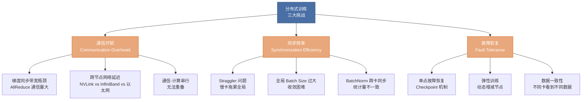
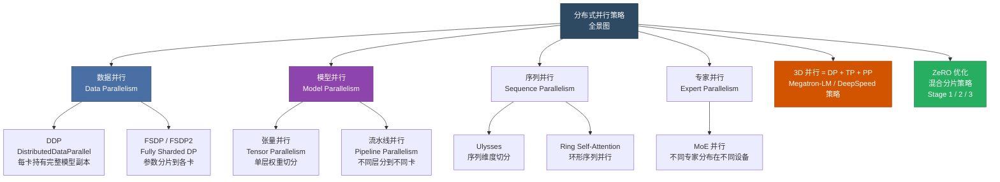
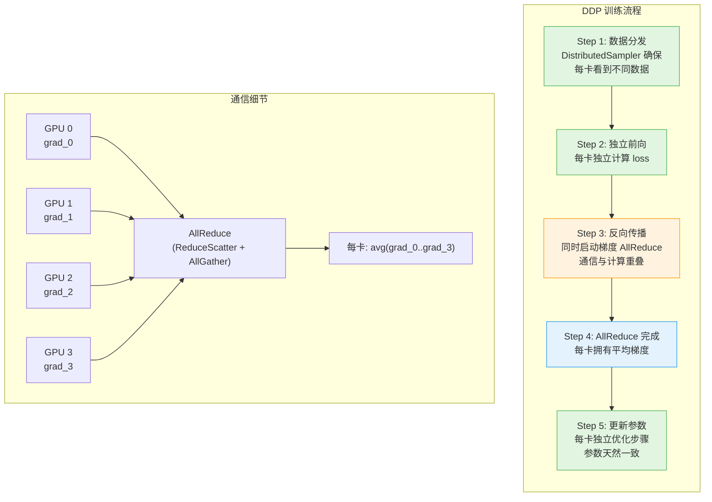
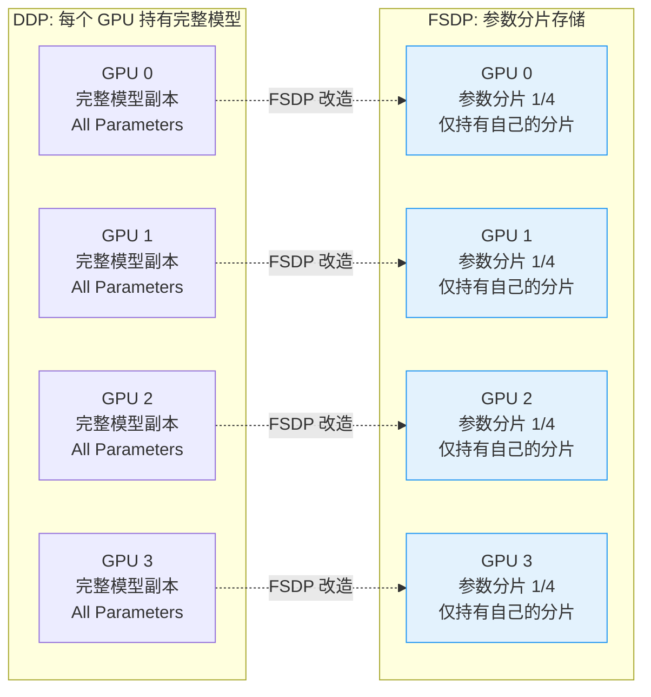
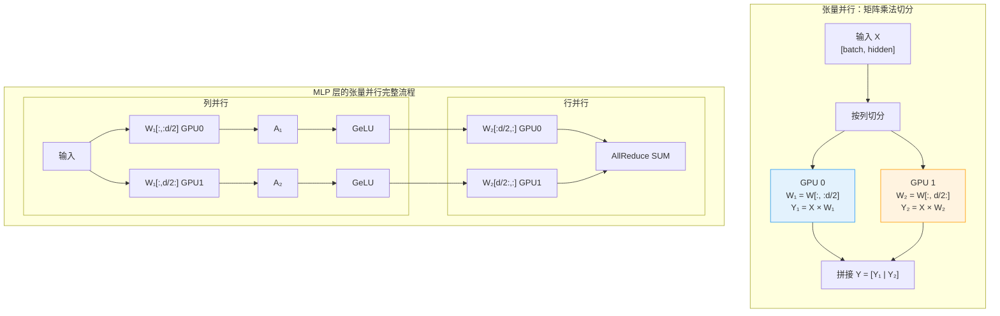
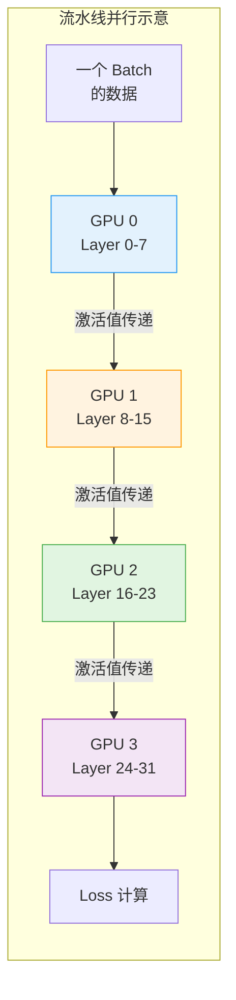
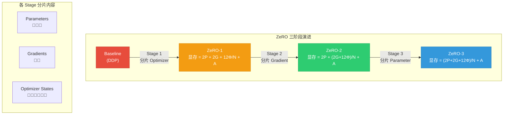
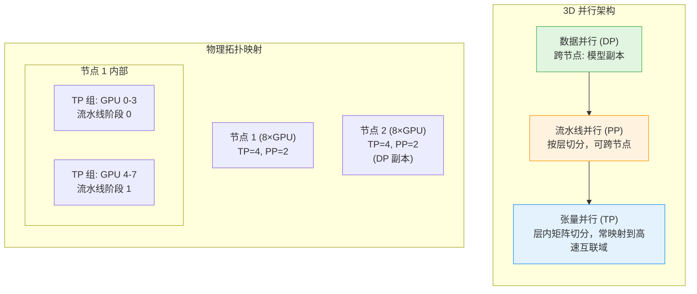
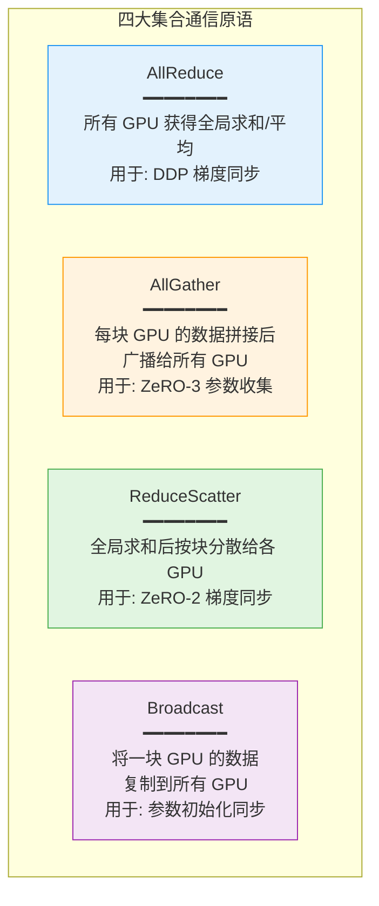
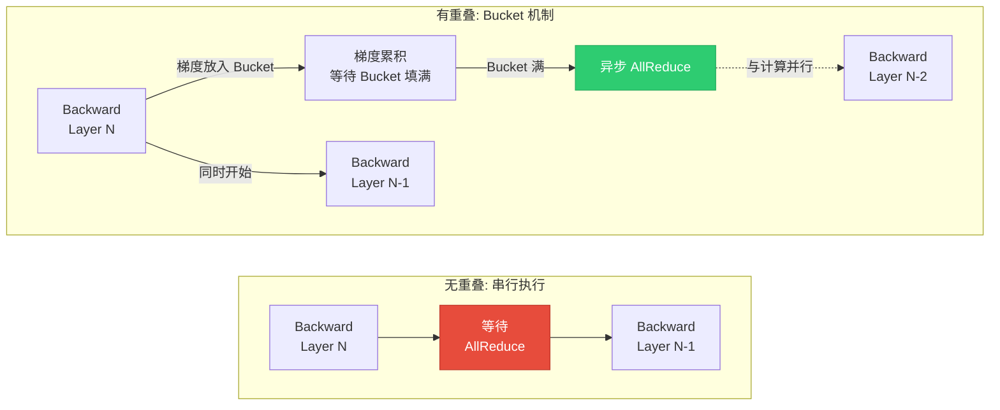

# 第 33 章 大模型分布式训练 ⭐⭐⭐⭐
> [!abstract] 本章导航
> **定位**：第五部分 数据、训练、对齐、评估与安全中的第 33 章；围绕“大模型分布式训练”建立单一、可追踪的知识主线。
>
> **先修**：[[32_推理模型与Test_Time_Compute|第 32 章 推理模型与 Test-Time Compute]]。
>
> **学习目标**：
> - 解释 分布式训练概述 ⭐⭐⭐⭐⭐ 的核心问题、机制与适用边界。
> - 实现或评估 数据并行 ⭐⭐⭐⭐ 的最小闭环。
> - 使用可复现证据诊断 模型并行 ⭐⭐⭐⭐⭐ 的工程取舍与失败模式。
>
> **建议路径**：分布式训练概述 ⭐⭐⭐⭐⭐ → 数据并行 ⭐⭐⭐⭐ → 模型并行 ⭐⭐⭐⭐⭐ → ZeRO 优化 ⭐⭐⭐⭐⭐ → DeepSpeed 实战 ⭐⭐⭐⭐⭐ → Megatron-LM 架构 ⭐⭐⭐⭐ → 生产边界与面试表达。
>
> **配套代码**：`code/ch33_distributed/`。

本章先回答“分布式训练概述 ⭐⭐⭐⭐⭐”为什么成立，再沿着机制、实现、评估和边界逐步展开。阅读时先建立因果链，再运行或推演示例，最后用章末自测检查能否脱离原文复述。
## 33.1 分布式训练概述 ⭐⭐⭐⭐⭐

### 33.1.1 为什么需要分布式训练

单卡训练大模型面临两个根本性瓶颈：

| 瓶颈 | 具体表现 | 举例 |
|------|---------|------|
| **显存不足** | 模型参数 + 梯度 + 优化器状态远超单卡显存 | Llama-70B 以 FP16 加载需 ~140GB，单张 H100（80GB）无法容纳 |
| **训练太慢** | 单卡吞吐有限，训练墙钟时间不可接受 | 175B 级预训练的时间取决于 token 数、精度、硬件与有效利用率；单卡不具备工程可行性 |

**显存占用估算公式**：

下面采用一个便于面试估算的假设：参数和梯度为 FP16/BF16（各 2
字节），Adam 保留 FP32 主参数、动量和方差（共 12 字节）。不同优化器、
量化方式和框架实现会改变系数：

$$
M_{\text{total}} = \underbrace{2\Phi}_{\text{模型参数(FP16)}} + \underbrace{2\Phi}_{\text{梯度(FP16)}} + \underbrace{12\Phi}_{\text{Adam优化器(FP32)}} + \underbrace{M_{\text{activation}}}_{\text{激活值}}
$$

> 在上述假设下，持久化训练状态为 $16\Phi$ 字节，是“仅加载 2
> 字节权重”的 8 倍。不能把它直接写成训练端到端显存相对推理的固定倍数：
> 训练还受激活、临时缓冲区和碎片影响，推理还受 KV Cache、并发与上下文长度影响。

**以 Llama-7B 为例**：

| 组件 | 计算公式 | 显存占用 |
|------|---------|---------|
| 模型参数 (FP16) | $2 \times 7\text{B}$ | 14 GB |
| 梯度 (FP16) | $2 \times 7\text{B}$ | 14 GB |
| Adam 优化器 (FP32) | $12 \times 7\text{B}$ | 84 GB |
| 持久化训练状态小计 | $16 \times 7\text{B}$ | 112 GB |
| 激活与临时缓冲区 | 取决于 batch、序列长度、checkpoint、算子与并行策略 | 需实测 |

因此，是否能在某张卡上训练、能用多大的 microbatch，必须把目标模型配置、
序列长度、精度、优化器、PEFT/全量训练和峰值临时内存代入后实测；LoRA
也不存在“一张 A100 固定只能 batch size 1”的通用结论。

### 33.1.2 分布式训练的挑战



### 33.1.3 并行策略分类全景图



**并行策略速查表**：

| 策略 | 解决什么问题 | 适用场景 | 代表框架 |
|------|------------|---------|---------|
| 数据并行 (DDP) | 扩大数据吞吐 | 完整训练状态能在每个 rank 驻留 | PyTorch DDP |
| FSDP | 分片参数、梯度和优化器状态 | DDP 状态冗余成为容量瓶颈 | PyTorch FSDP |
| 张量并行 (TP) | 切分单层的参数与计算 | 单层容量或算子吞吐需要跨 rank | Megatron Core 等 |
| 流水线并行 (PP) | 按层/模块切分 | 模型较深且能接受调度空泡 | DeepSpeed、Megatron Core 等 |
| 序列/上下文并行 | 切分序列维度相关的激活与计算 | 长序列成为容量或吞吐瓶颈 | Ulysses、Megatron 等 |
| ZeRO-1/2/3 | 分阶段消除 DP 状态冗余 | 按参数副本与目标峰值选择 stage | DeepSpeed |
| 混合并行 | 同时解决层、深度、状态和吞吐约束 | 单一并行维度无法满足容量/性能目标 | Megatron + DeepSpeed 等 |

## 33.2 数据并行 ⭐⭐⭐⭐

### 33.2.1 DP（DataParallel）原理与局限性

DP 是 PyTorch 最早提供的数据并行方案，原理简单但效率低下。

```python
# ❌ DataParallel 用法（不推荐）
import torch.nn as nn

model = nn.DataParallel(model)  # 单机多卡
output = model(input_data)

# DP 的工作流程：
# 1. 将每个 batch 的数据均匀分配到所有 GPU
# 2. 每个 GPU 独立前向传播
# 3. 将各设备输出 gather 到主设备（默认 output_device）
# 4. backward 在各副本执行，副本梯度归约到主模块参数
# 5. optimizer 更新主模块；下一次 forward 再复制/同步副本
```

**DP 的主要局限**：

| 问题 | 原因 | 后果 |
|------|------|------|
| **主设备瓶颈** | 输出 gather 和梯度归约集中到主模块 | 主设备有额外内存与通信负担 |
| **单进程多线程** | Python 线程负责副本调度 | Python 工作负载可能受 GIL/调度开销影响 |
| **不支持多机** | 只能在单机内使用 | 无法扩展到多机多卡 |
| **扩展性较弱** | 集中式复制、gather 与梯度归约 | 通常不如每卡一进程的 DDP |

### 33.2.2 DDP（DistributedDataParallel）原理与优势

DDP 是 PyTorch 推荐的多进程数据并行方案，避免了 `DataParallel` 单进程集中复制/聚合造成的
主要瓶颈，并支持多机；但它仍会在每个 rank 复制完整模型与优化器状态，还受梯度 AllReduce、
慢 rank、网络拓扑和故障恢复约束。模型放不下单卡时应考虑 FSDP/ZeRO/模型并行，而不能说 DDP
“彻底解决”了数据并行问题。来源：
[PyTorch DDP 设计说明](https://docs.pytorch.org/docs/stable/notes/ddp.html)。

**DDP 核心设计**：



**DP vs DDP 对比**：

| 维度 | DataParallel (DP) | DistributedDataParallel (DDP) |
|------|-------------------|-------------------------------|
| **通信方式** | 主设备负责 scatter/gather 与梯度归约 | 每进程一张 GPU，通常通过 collective 同步梯度 |
| **多机支持** | 不支持 | 支持（TCP/NCCL 后端） |
| **通信效率** | 主设备容易成为瓶颈 | 通常优于 DP；具体算法与效率由拓扑、消息大小和后端决定 |
| **负载均衡** | 主设备有额外 gather/scatter 与输出负担 | 模型副本较对等，但仍可能有数据或算子 straggler |
| **GIL 问题** | 有（多线程） | 无（多进程） |
| **梯度同步时机** | loss.backward() 之后 | backward() 过程中（overlap） |
| **官方使用建议** | 简单原型可用 | 单机多卡训练也优先使用 DDP |

### 33.2.3 梯度同步：AllReduce 通信原语

梯度同步是数据并行的核心。设 $N$ 个 GPU，每个 GPU $i$ 有梯度 $\mathbf{g}_i$，所有 GPU 都需要获得平均梯度：

$$
\bar{\mathbf{g}} = \frac{1}{N} \sum_{i=1}^{N} \mathbf{g}_i
$$

**Ring AllReduce 算法**（最常用的实现）：

```
Ring AllReduce = ReduceScatter + AllGather

ReduceScatter 阶段（N-1 步）:
  每个 GPU 沿着环形拓扑传递和累加部分梯度块
  最终每个 GPU 拥有 1/N 的完整求和结果

AllGather 阶段（N-1 步）:
  每个 GPU 将持有的 1/N 结果沿环广播
  最终所有 GPU 拥有完整结果

通信量: 2(N-1)/N × 数据量 ≈ 2× 数据量（与 GPU 数量无关！）
```

> **面试重点**：Ring AllReduce 的通信量与 GPU 数量 $N$ **无关**（当 $N$ 很大时），这是它成为标准的根本原因。

### 33.2.4 FSDP（Fully Sharded Data Parallel）

FSDP 是 PyTorch 官方提供的参数分片方案，相当于 DeepSpeed ZeRO Stage 3 的 PyTorch 原生实现。

**FSDP 核心思想**：



FSDP 稳定存储的是本 rank 的参数分片；前向/反向会按模块 all-gather
临时物化参数，并根据 reshard/prefetch 配置释放或保留。因此峰值还包括临时
完整参数、通信 buffer 和激活，不能把运行时描述为“任何时刻只有 $1/N$ 参数”。

### 33.2.5 DDP / FSDP 代码示例

**DDP 完整实战代码**：

```python
"""
DDP 训练完整示例 - 单机多卡 / 多机多卡
启动方式: torchrun --nproc_per_node=8 train_ddp.py
"""
import os
import torch
import torch.nn as nn
import torch.distributed as dist
from torch.nn.parallel import DistributedDataParallel as DDP
from torch.utils.data import DataLoader, DistributedSampler

# ============================================================
# 1. 初始化分布式环境
# ============================================================
def setup_distributed():
    """初始化 NCCL 分布式后端"""
    dist.init_process_group(
        backend="nccl",          # GPU 通信使用 NCCL
        init_method="env://",    # 从环境变量读取配置（torchrun 自动设置）
    )
    local_rank = int(os.environ["LOCAL_RANK"])
    torch.cuda.set_device(local_rank)
    return local_rank

def cleanup():
    dist.destroy_process_group()

# ============================================================
# 2. 模型定义
# ============================================================
class SimpleLLM(nn.Module):
    """模拟大模型结构"""
    def __init__(self, vocab_size=50000, hidden_dim=4096, num_layers=32):
        super().__init__()
        self.embed = nn.Embedding(vocab_size, hidden_dim)
        self.layers = nn.ModuleList([
            nn.TransformerDecoderLayer(
                d_model=hidden_dim,
                nhead=32,
                dim_feedforward=hidden_dim * 4,
                batch_first=True
            )
            for _ in range(num_layers)
        ])
        self.lm_head = nn.Linear(hidden_dim, vocab_size)

    def forward(self, x):
        x = self.embed(x)
        for layer in self.layers:
            x = layer(x, memory=torch.zeros_like(x))  # 简化的 decoder
        return self.lm_head(x)

# ============================================================
# 3. 训练主函数（DDP 方式）
# ============================================================
def train_ddp():
    local_rank = setup_distributed()
    world_size = dist.get_world_size()
    global_rank = dist.get_rank()

    print(f"[Rank {global_rank}/{world_size}] Initializing on GPU {local_rank}")

    # --- 模型 ---
    model = SimpleLLM().to(local_rank)
    # 关键：使用 DDP 包装模型
    model = DDP(
        model,
        device_ids=[local_rank],
        output_device=local_rank,
        find_unused_parameters=False,   # 生产环境设为 False 提升性能
        gradient_as_bucket_view=True,   # 减少内存拷贝
    )

    # --- 数据集 ---
    dataset = torch.randint(0, 50000, (100000, 2048))  # 模拟数据
    # 关键：使用 DistributedSampler 确保每卡看到不同数据
    sampler = DistributedSampler(
        dataset,
        num_replicas=world_size,
        rank=global_rank,
        shuffle=True,
    )
    dataloader = DataLoader(dataset, batch_size=4, sampler=sampler)

    # --- 优化器 ---
    optimizer = torch.optim.AdamW(model.parameters(), lr=3e-4)

    # ============================================================
    # 4. 训练循环
    # ============================================================
    model.train()
    for epoch in range(3):
        sampler.set_epoch(epoch)  # 每个 epoch 重新 shuffle

        for step, batch in enumerate(dataloader):
            batch = batch.to(local_rank)

            # 前向
            outputs = model(batch)
            loss = outputs.mean()

            # 反向 —— DDP 在这里自动进行梯度 AllReduce
            # backward() 过程中梯度同步与计算重叠
            optimizer.zero_grad()
            loss.backward()
            optimizer.step()

            if step % 10 == 0 and global_rank == 0:
                # 注意：每张卡上的 loss 不同（数据不同），
                # 需要 all_reduce 求平均才能得到全局 loss
                loss_tensor = loss.detach().clone()
                dist.all_reduce(loss_tensor, op=dist.ReduceOp.AVG)
                print(f"Epoch {epoch}, Step {step}, "
                      f"Global Loss: {loss_tensor.item():.4f}")

    cleanup()

if __name__ == "__main__":
    train_ddp()
```

**FSDP 实战代码**：

```python
"""
FSDP 训练示例 - PyTorch 原生参数分片
启动方式: torchrun --nproc_per_node=8 train_fsdp.py
"""
import os
import torch
import torch.nn as nn
import torch.distributed as dist
from torch.distributed.fsdp import (
    FullyShardedDataParallel as FSDP,
    MixedPrecision,
    ShardingStrategy,
    BackwardPrefetch,
    CPUOffload,
)
from torch.distributed.fsdp.wrap import (
    transformer_auto_wrap_policy,
    size_based_auto_wrap_policy,
)

def setup():
    dist.init_process_group(backend="nccl")
    local_rank = int(os.environ["LOCAL_RANK"])
    torch.cuda.set_device(local_rank)
    return local_rank

def train_fsdp():
    local_rank = setup()

    # ============================================================
    # FSDP 混合精度配置
    # ============================================================
    mixed_precision_policy = MixedPrecision(
        param_dtype=torch.bfloat16,   # 参数用 BF16 存储
        reduce_dtype=torch.bfloat16,  # 梯度 reduce 用 BF16
        buffer_dtype=torch.bfloat16,  # buffer 用 BF16
    )

    # ============================================================
    # FSDP 分片策略
    # ============================================================
    # HYBRID_SHARD: 节点内全分片，节点间 DDP
    # FULL_SHARD: ZeRO Stage 3 等价
    # SHARD_GRAD_OP: ZeRO Stage 2 等价
    sharding_strategy = ShardingStrategy.FULL_SHARD

    # ============================================================
    # FSDP 配置
    # ============================================================
    from transformers import AutoModelForCausalLM, AutoConfig

    config = AutoConfig.from_pretrained("meta-llama/Llama-2-7b-hf")
    model = AutoModelForCausalLM.from_config(config)

    # 定义哪些子模块需要被 FSDP 包装
    auto_wrap_policy = transformer_auto_wrap_policy(
        transformer_layer_cls={
            # 每个 TransformerBlock 是一个 FSDP 单元
            type(model.model.layers[0]),
        }
    )

    model = FSDP(
        model,
        auto_wrap_policy=auto_wrap_policy,
        sharding_strategy=sharding_strategy,
        mixed_precision=mixed_precision_policy,
        backward_prefetch=BackwardPrefetch.BACKWARD_PRE,  # 预取下一层参数
        cpu_offload=CPUOffload(offload_params=False),      # 是否卸载到 CPU
        device_id=local_rank,
        # 关键：限制 FSDP 单元内的参数数量
        # 太小 → 通信过多，太大 → 显存占用大
        limit_all_gathers=True,
    )

    print(f"Model wrapped with FSDP on rank {dist.get_rank()}")
    print(f"Sharding strategy: {sharding_strategy}")

    # 训练循环（与 DDP 类似，但 FSDP 自动管理参数收集和释放）
    optimizer = torch.optim.AdamW(model.parameters(), lr=3e-4)
    for step in range(100):
        input_ids = torch.randint(0, 32000, (2, 1024)).to(local_rank)
        outputs = model(input_ids, labels=input_ids)
        loss = outputs.loss
        loss.backward()
        optimizer.step()
        optimizer.zero_grad()
        if step % 10 == 0:
            print(f"Step {step}, Loss: {loss.item():.4f}")

    dist.destroy_process_group()

if __name__ == "__main__":
    train_fsdp()
```

**启动命令**：

```bash
# 单机 8 卡 DDP 训练
torchrun --nproc_per_node=8 train_ddp.py

# 多机多卡（2 台机器，每台 8 卡）
# 在机器 0（master）上：
torchrun --nproc_per_node=8 --nnodes=2 --node_rank=0 \
    --master_addr="192.168.1.100" --master_port=29500 \
    train_ddp.py

# 在机器 1 上：
torchrun --nproc_per_node=8 --nnodes=2 --node_rank=1 \
    --master_addr="192.168.1.100" --master_port=29500 \
    train_ddp.py

# FSDP 训练
torchrun --nproc_per_node=8 train_fsdp.py
```

## 33.3 模型并行 ⭐⭐⭐⭐⭐

当模型单层参数量太大，或总层数太多，即使做了数据并行也无法放入单卡时，就需要模型并行。

### 33.3.1 张量并行（Tensor Parallelism）

**核心思想**：将一层内的权重矩阵**按列或按行切分**到多张 GPU 上，每张 GPU 计算一部分，然后合并结果。



**MLP 张量并行的数学描述**：

设 MLP 层为 $Y = W_2 \cdot \text{GeLU}(W_1 \cdot X)$

- **列并行**（第1个全连接层）：将 $W_1$ 按列切分
  $$W_1 = [W_1^{(1)} | W_1^{(2)}], \quad Y_1 = \text{GeLU}(X W_1^{(1)}), \quad Y_2 = \text{GeLU}(X W_1^{(2)})$$

- **行并行**（第2个全连接层）：将 $W_2$ 按行切分，最后 AllReduce
  $$W_2 = \begin{bmatrix} W_2^{(1)} \\ W_2^{(2)} \end{bmatrix}, \quad Z = W_2^{(1)} Y_1 + W_2^{(2)} Y_2$$

**Self-Attention 的张量并行**：

对于 Multi-Head Attention，按 head 数量切分是最自然的方案：
- GPU 0 持有 head 0~N/2-1 的 Q/K/V/O 权重
- GPU 1 持有 head N/2~N-1 的 Q/K/V/O 权重

### 33.3.2 流水线并行（Pipeline Parallelism）

**核心思想**：将模型按层切分，GPU 0 负责 layer 0-7，GPU 1 负责 layer 8-15，GPU 2 负责 layer 16-23，GPU 3 负责 layer 24-31。数据像流水线一样依次经过各 GPU。



**Microbatch 与 Bubble 时间**：

流水线并行的关键效率问题之一是 **Bubble（气泡）**，即部分 stage 等待输入或梯度时产生的设备空闲。

```
朴素流水线（GPipe 方案）:
Time →
GPU 0: [F0][F1][F2][F3] | ●●●●●●●● | [B3][B2][B1][B0]
GPU 1: ●● | [F0][F1][F2][F3] | [B3][B2][B1][B0] | ●●●●●●●●
GPU 2: ●●●● | [F0][F1][F2][F3] | [B3][B2][B1][B0] | ●●●●
GPU 3: ●●●●●● | [F0][F1][F2][F3] | [B3][B2][B1][B0] | ●●

F = Forward, B = Backward, ● = Idle (Bubble)
相对理想计算时间的 Bubble 开销 = (P-1) / M
按总调度时间计算的空泡占比 = (P-1) / (M+P-1)
(P=Pipeline stage 数, M=microbatch 数；均为简化的均衡 GPipe 模型)
```

**Bubble 时间公式（均衡 GPipe 的简化模型）**：

设 microbatch 数量为 $m$，Pipeline Stage 数量为 $p$：

$$
\text{Bubble Overhead} = \frac{p - 1}{m}, \qquad
\text{Bubble Fraction} = \frac{p - 1}{m+p-1}
$$

> **面试要点**：增加 microbatch 数量 $m$ 可以减小 bubble 比例，但 $m$ 受全局 batch size 约束。**1F1B 调度**可以在不增加 $m$ 的情况下减少显存占用。

### 33.3.3 1F1B 调度策略

1F1B（One Forward One Backward）是 DeepSpeed 采用的调度策略，核心是**让前向和反向交替进行**，减少缓存激活值的数量。

```
1F1B 调度（DeepSpeed 方案）:
Time →
GPU 0: [F0][F1][F2][F3][B0][F4][B1][F5][B2][B3][B4][B5]
GPU 1:     [F0][F1][F2][F3][B0][F4][B1][F5][B2][B3][B4][B5]
GPU 2:         [F0][F1][F2][F3][B0][F4][B1][F5][B2][B3][B4]
GPU 3:             [F0][F1][F2][F3][B0][F4][B1][F5][B2][B3]

相比于“先完成全部 forward、再执行 backward”的调度:
- 稳态阶段更早启动 backward，减少同时存活的激活数量；峰值取决于 stage 位置、warmup 和实现
- 对相同 stage 数和 microbatch 数，基础 flush 版本的空泡开销量级相近
- 更早释放已反向传播完毕的层的激活值
```

**流水线调度对比**：

| 调度策略 | 来源 | Bubble 比例 | 激活值缓存 | 特点 |
|---------|------|-------------|-----------|------|
| **GPipe** | Google | 基础开销约 $\frac{p-1}{m}$ | 随 microbatch 数增长 | 先全部 forward 再全部 backward |
| **Flush 1F1B** | 多种实现 | 基础开销量级相近 | 通常更低 | warmup + 稳态交替 + cooldown |
| **Interleaved 1F1B** | Megatron-LM 等 | 受 virtual stage 与切分影响 | 依实现而定 | 每个设备分配多个 stage chunks |

## 33.4 ZeRO 优化 ⭐⭐⭐⭐⭐

> **面试重点**：这是分布式训练中被问频率最高的知识点。面试官期待你能清晰区分三个 Stage 的分片内容和显存节省比例。

ZeRO（Zero Redundancy Optimizer）是 DeepSpeed 的状态分片方案，用于减少
数据并行中参数、梯度和优化器状态的冗余。

### 33.4.1 训练时显存都去哪儿了

回顾训练显存占用：

| 组件 | 大小 | 是否冗余 |
|------|------|---------|
| 模型参数 (Parameters) | $2\Phi$ (FP16) | 每卡一份完整副本（DDP模式） |
| 梯度 (Gradients) | $2\Phi$ (FP16) | 每卡一份完整副本 |
| 优化器状态 (Optimizer States) | $12\Phi$ (FP32) | 每卡一份完整副本 |
| 激活值 (Activations) | 依赖 batch、序列、模型和重计算策略 | 各 rank 的本地样本不同，通常不是 DP 冗余 |

**核心洞察**：在 DDP 中，每张 GPU 都持有**完整的**参数、梯度和优化器状态 —— 这造成了 $(2+2+12)\Phi = 16\Phi$ 字节的冗余存储。

### 33.4.2 ZeRO 三个 Stage 全景



### 33.4.3 ZeRO Stage 1：优化器状态分片

**分片内容**：仅分片优化器状态（Adam 的 $m$ 和 $v$）

**显存节省**：

$$
M_{\text{ZeRO-1}} = \underbrace{2\Phi}_{\text{参数}} + \underbrace{2\Phi}_{\text{梯度}} + \underbrace{\frac{12\Phi}{N}}_{\text{优化器分片}} + M_{\text{activation}}
$$

- 4 卡时，公式中的优化器状态项由 $12\Phi$ 降为 $3\Phi$，即该项减少 75%；若只统计
  参数、梯度和优化器状态，总量由 $16\Phi$ 降为 $7\Phi$。激活、临时缓冲区和碎片不按同一
  比例缩放，因此不能概括成端到端“显存节省 4 倍”
- 通信开销：与 DDP 相同（仅 AllReduce 梯度）
- **推荐场景**：模型能放入单卡但 batch size 受限时

### 33.4.4 ZeRO Stage 2：梯度 + 优化器状态分片

**分片内容**：分片梯度 + 优化器状态

每个 GPU 只持有与自己优化器状态分片对应的梯度分片。在 backward 过程中，梯度通过 ReduceScatter 而不是 AllReduce 通信，每个 GPU 只接收自己负责的那部分梯度平均值。

$$
M_{\text{ZeRO-2}} = \underbrace{2\Phi}_{\text{参数}} + \underbrace{\frac{2\Phi + 12\Phi}{N}}_{\text{梯度+优化器分片}} + M_{\text{activation}}
$$

- 只统计上述持久化状态时，8 卡由 $16\Phi$ 降为
  $2\Phi+14\Phi/8=3.75\Phi$，约为基线的 4.3 倍；端到端峰值还要加激活和临时缓冲区
- 通信变化：AllReduce → ReduceScatter（通信量不变，但语义不同）
- **选择条件**：参数副本能驻留单卡、但梯度和优化器状态需要分片时可评估

### 33.4.5 ZeRO Stage 3：参数 + 梯度 + 优化器状态分片

**分片内容**：一切分片 —— 参数、梯度、优化器状态全部切分

这是分片最完整的方案。稳定存储时，每个 rank 只保留自己的参数分片；
计算某个模块前通常通过 AllGather 临时物化所需参数，何时释放或预取由实现和配置决定，
所以峰值并非任何时刻都严格只有 $1/N$ 参数。

$$
M_{\text{ZeRO-3}} = \frac{2\Phi + 2\Phi + 12\Phi}{N} + M_{\text{activation}} = \frac{16\Phi}{N} + M_{\text{activation}}
$$

- 显存节省：接近线性 $N\times$（$N$ 为 GPU 数）
- 通信代价：增加参数 AllGather/ReduceScatter 等 collective；实际开销取决于
  模块粒度、预取、互联、重用距离和通信计算重叠，不能写成固定 1.5 倍
- **选择条件**：单卡放不下参数副本，或希望进一步降低持久化状态时评估

### 33.4.6 显存节省汇总

| ZeRO Stage | 参数存储 | 梯度存储 | 优化器存储 | 总参数量显存 | 节省倍数 (N=8) |
|-----------|---------|---------|-----------|------------|---------------|
| **DDP (基线)** | $2\Phi$ | $2\Phi$ | $12\Phi$ | $16\Phi$ | 1x |
| **ZeRO-1** | $2\Phi$ | $2\Phi$ | $12\Phi / N$ | $4\Phi + 12\Phi/N$ | ~2.9x |
| **ZeRO-2** | $2\Phi$ | $2\Phi / N$ | $12\Phi / N$ | $2\Phi + 14\Phi/N$ | ~4.3x |
| **ZeRO-3** | $2\Phi / N$ | $2\Phi / N$ | $12\Phi / N$ | $16\Phi / N$ | ~8x |

> 该表只比较理想均匀分片的**持久化模型状态**，不含激活、临时
> AllGather 缓冲、通信 bucket、CUDA 上下文和碎片。以 7B、8 卡为例，
> DDP 的该项约 112 GB/卡，ZeRO-3 的理论分片项约 14 GB/卡；14 GB
> 不能据此解释为“训练绰绰有余”，仍需做目标配置的峰值 profile。

### 33.4.7 ZeRO-Offload 与 ZeRO-Infinity

当 GPU 显存仍然不够时，可以进一步将部分数据卸载到 CPU 内存甚至 NVMe SSD：

| 技术 | 卸载目标 | 卸载内容 | 额外开销 |
|------|---------|---------|---------|
| **ZeRO-Offload** | CPU DRAM | 可卸载优化器状态、梯度等 | 受实际 PCIe/互联、CPU 与 NUMA 拓扑限制 |
| **ZeRO-Infinity** | CPU/NVMe 分层 | 可进一步卸载参数与优化器状态 | 受存储吞吐、延迟、队列深度和数据搬运重叠限制 |

## 33.5 DeepSpeed 实战 ⭐⭐⭐⭐⭐

### 33.5.1 DeepSpeed 配置文件详解

DeepSpeed 的核心是 JSON 配置文件，通过它控制所有分布式训练策略。

```json
{
    "train_batch_size": 128,
    "train_micro_batch_size_per_gpu": 4,

    "optimizer": {
        "type": "AdamW",
        "params": {
            "lr": 3e-4,
            "betas": [0.9, 0.95],
            "eps": 1e-8,
            "weight_decay": 0.1
        }
    },

    "scheduler": {
        "type": "WarmupDecayLR",
        "params": {
            "total_num_steps": 10000,
            "warmup_min_lr": 0,
            "warmup_max_lr": 3e-4,
            "warmup_num_steps": 1000
        }
    },

    "zero_optimization": {
        "stage": 2,
        "offload_optimizer": {
            "device": "none",
            "pin_memory": true
        },
        "allgather_partitions": true,
        "allgather_bucket_size": 5e8,
        "overlap_comm": true,
        "reduce_scatter": true,
        "reduce_bucket_size": 5e8,
        "contiguous_gradients": true,
        "round_robin_gradients": true
    },

    "fp16": {
        "enabled": true,
        "auto_cast": true,
        "loss_scale": 0,
        "initial_scale_power": 16,
        "loss_scale_window": 1000,
        "hysteresis": 2,
        "min_loss_scale": 1
    },

    "bf16": {
        "enabled": false
    },

    "gradient_clipping": 1.0,

    "steps_per_print": 10,
    "wall_clock_breakdown": false,

    "activation_checkpointing": {
        "partition_activations": true,
        "cpu_checkpointing": false,
        "number_checkpoints": null,
        "synchronize_checkpoint_boundary": false
    }
}
```

**DeepSpeed 配置文件关键参数说明**：

| 参数 | 含义 |选择方法 |
|------|------|--------|
| `train_micro_batch_size_per_gpu` | 每卡每步处理的 micro batch 大小 | 同时满足峰值显存、全局 batch 与吞吐目标 |
| `zero_optimization.stage` | ZeRO 阶段 (1/2/3) | 按哪些状态必须分片及通信代价选择 |
| `offload_optimizer.device` | 优化器卸载目标 | 仅在容量需要时评估 CPU，并测量数据搬运瓶颈 |
| `overlap_comm` | 是否尝试通信与计算重叠 | 检查额外 buffer 后用 profiler A/B |
| `reduce_bucket_size` | 梯度桶大小 | 示例可从框架默认/自动值开始，再按显存与 profiler 调整 |
| `activation_checkpointing` | 激活重计算 | 显存紧张时开启，以时间换空间 |

### 33.5.2 ZeRO Stage 2/3 实战代码

```python
"""
DeepSpeed ZeRO Stage 2/3 完整训练示例
启动方式: deepspeed --num_gpus=8 train_deepspeed.py \
              --deepspeed ds_config.json
"""
import os
import torch
import deepspeed
from transformers import (
    AutoModelForCausalLM,
    AutoTokenizer,
    AutoConfig,
    TrainingArguments,
    Trainer,
    HfArgumentParser,
)

# ============================================================
# 方式一: 使用 DeepSpeed 原生 API
# ============================================================
def train_with_deepspeed_api():
    """使用 DeepSpeed 原生 API 进行训练"""

    # 1. 解析 DeepSpeed 配置
    parser = argparse.ArgumentParser()
    parser.add_argument("--local_rank", type=int, default=-1)
    parser = deepspeed.add_config_arguments(parser)
    args = parser.parse_args()

    # 2. 构建模型
    config = AutoConfig.from_pretrained("meta-llama/Llama-2-7b-hf")
    model = AutoModelForCausalLM.from_config(config)

    # 3. DeepSpeed 初始化（关键步骤）
    model_engine, optimizer, _, _ = deepspeed.initialize(
        args=args,
        model=model,
        model_parameters=model.parameters(),
        # DeepSpeed 会自动:
        # - 包装模型为 DeepSpeedEngine
        # - 创建 ZeRO 优化器（替代 PyTorch 优化器）
        # - 初始化分布式通信
    )

    # 4. 训练循环
    for step in range(10000):
        # 准备数据
        input_ids = torch.randint(0, 32000, (4, 2048)).to(model_engine.device)

        # 前向传播
        outputs = model_engine(input_ids, labels=input_ids)
        loss = outputs.loss

        # 反向传播（DeepSpeed 自动处理梯度同步和分片）
        model_engine.backward(loss)

        # 参数更新（DeepSpeed 自动处理优化器状态分片和 offload）
        model_engine.step()

        if step % 100 == 0:
            print(f"Step {step}, Loss: {loss.item():.4f}")

        # 保存 Checkpoint
        if step % 1000 == 0:
            model_engine.save_checkpoint(f"./checkpoints/step_{step}")


# ============================================================
# 方式二: 使用 Hugging Face Trainer + DeepSpeed
# ============================================================
def train_with_hf_trainer():
    """使用 HuggingFace Trainer + DeepSpeed 插件"""

    # Trainer 可读取 deepspeed 配置；模型、数据、分布式启动和版本兼容仍需配置。

    from transformers import Trainer, TrainingArguments

    training_args = TrainingArguments(
        output_dir="./output",
        per_device_train_batch_size=4,
        gradient_accumulation_steps=8,  # 全局 batch = 4 * 8 * data_parallel_world_size
        learning_rate=3e-4,
        warmup_steps=1000,
        max_steps=10000,
        logging_steps=10,
        save_steps=1000,
        fp16=False,
        bf16=True,              # 仅在目标硬件、算子和版本支持时启用
        deepspeed="ds_config_stage3.json",
        # 其他参数...
    )

    model = AutoModelForCausalLM.from_pretrained(
        "meta-llama/Llama-2-7b-hf",
        torch_dtype=torch.bfloat16,
        use_cache=False,  # 使用 gradient checkpointing 时通常需要关闭
    )

    tokenizer = AutoTokenizer.from_pretrained("meta-llama/Llama-2-7b-hf")
    tokenizer.pad_token = tokenizer.eos_token

    trainer = Trainer(
        model=model,
        args=training_args,
        train_dataset=train_dataset,
        tokenizer=tokenizer,
    )

    trainer.train()
```

### 33.5.3 ZeRO Stage 3 专项配置

```json
{
    "zero_optimization": {
        "stage": 3,

        "offload_optimizer": {
            "device": "cpu",
            "pin_memory": true
        },
        "offload_param": {
            "device": "cpu",
            "pin_memory": true,
            "buffer_count": 5,
            "buffer_size": 1e8
        },

        "overlap_comm": true,
        "contiguous_gradients": true,
        "reduce_bucket_size": 5e8,
        "stage3_prefetch_bucket_size": 5e8,
        "stage3_param_persistence_threshold": 1e6,
        "stage3_max_live_parameters": 1e9,
        "stage3_max_reuse_distance": 1e9,
        "stage3_gather_16bit_weights_on_model_save": true,

        "sub_group_size": 1e9
    }
}
```

### 33.5.4 DeepSpeed Chat（RLHF 训练）

DeepSpeed Chat 是专门为 RLHF 三阶段训练设计的端到端系统：

```python
"""
DeepSpeed-Chat RLHF 训练流程（简化示例）
实际使用 deepspeed-chat 命令行工具
"""
# 阶段一：SFT（监督微调）
# deepspeed --num_gpus=8 main.py \
#     --data_path ./sft_data.json \
#     --model_name_or_path meta-llama/Llama-2-7b-hf \
#     --per_device_train_batch_size 4 \
#     --zero_stage 2 \
#     --sft_only

# 阶段二：Reward Model 训练
# deepspeed --num_gpus=8 main.py \
#     --data_path ./rm_data.json \
#     --model_name_or_path ./sft_checkpoint \
#     --num_padding_at_beginning 1 \
#     --zero_stage 2 \
#     --reward_model_only

# 阶段三：RLHF (PPO) 训练
# deepspeed --num_gpus=8 main.py \
#     --actor_model ./sft_checkpoint \
#     --critic_model ./rm_checkpoint \
#     --zero_stage 3 \
#     --offload \
#     --rlhf_only

# 经典 PPO-RLHF 逻辑上包含 Actor、Reference、Reward、Critic。
# 它们可以分片、卸载、量化、合并部分组件或分阶段部署；
# 具体是否使用 ZeRO-3/Offload 必须由峰值显存和吞吐基准决定。
```

**PPO-RLHF 的容量规划**：

| 阶段 | 逻辑组件 | 规划重点 |
|------|---------|---------|
| SFT | 训练模型 | 参数、梯度、优化器、激活和序列长度 |
| Reward Model | 训练模型 | pairwise batch、序列长度与模型状态 |
| PPO-RLHF | Actor、Reference、Reward、Critic | 各组件是否训练、是否共置，以及分片、卸载、量化与跨阶段调度 |

不存在“8 张 A100 必然轻松/可行”或“固定为 16 倍模型大小”的通用结论；
要按各组件的精度、训练状态、并发 rollout 和 KV Cache 分别估算并压测。

### 33.5.5 训练效率优化技巧

```bash
# ============================================================
# DeepSpeed 训练效率优化 Checklist
# ============================================================

# 1. 梯度累积
# 增大 effective batch size 而不增加显存
# ds_config.json:
#   "gradient_accumulation_steps": 8

# 2. 通信与计算重叠
# ds_config.json:
#   "overlap_comm": true  # ZeRO-1/2 的通信重叠
#   "contiguous_gradients": true  # 梯度连续存储减少拷贝

# 3. 激活检查点 (Activation Checkpointing)
# 用计算时间换显存空间
# ds_config.json:
#   "activation_checkpointing": {
#       "partition_activations": true
#   }
# 代码中：
#   model.gradient_checkpointing_enable()

# 4. 在硬件和算子支持时评估 BF16
# ds_config.json:
#   "bf16": {"enabled": true}

# 5. 关闭不必要的特性
#   - 关闭 wall_clock_breakdown（生产环境）
#   - 关闭 tensorboard logging 的频繁写入
#   - 只启用已验证、与当前模型和框架版本兼容的优化

# 6. 通信后端优化
# 设置 NCCL 环境变量:
#   export NCCL_IB_DISABLE=0           # 启用 InfiniBand
#   export NCCL_SOCKET_IFNAME=eth0     # 指定网卡
#   export NCCL_DEBUG=INFO             # 调试通信（生产关掉）
#   export NCCL_P2P_DISABLE=0          # 允许 GPU 间 P2P 通信
```

## 33.6 Megatron-LM 架构 ⭐⭐⭐⭐

### 33.6.1 3D 并行：TP + PP + DP

Megatron-LM 是 NVIDIA 开发的大模型训练框架，核心创新是提出 **张量并行（TP）+ 流水线并行（PP）+ 数据并行（DP）的组合策略**，即 **3D 并行**。



**3D 并行的 GPU 分配公式**：

$$
N_{\text{total}} = N_{\text{TP}} \times N_{\text{PP}} \times N_{\text{DP}}
$$

> 示例：若 TP=8、PP=16、DP=8，则总 rank 数为 1024；这只是公式演示，
> 不是 175B 模型的推荐配置或最低硬件要求。

**各并行度的选择原则**：

| 并行维度 | 优先选择原因 | 通信代价 | 推荐配置 |
|---------|------------|---------|---------|
| **TP (张量并行)** | 层内通信频繁，优先放在高速互联域 | collective 类型和次数取决于切分与架构 | 由单层容量、算子形状和拓扑基准确定 |
| **PP (流水线并行)** | 按层/模块切分，可跨节点 | 传递层间激活与梯度，并有空泡 | 由层数、负载均衡和 microbatch 确定 |
| **DP (数据并行)** | 扩大全局 batch 与吞吐 | 同步梯度或分片状态 | 由收敛目标、带宽与总 rank 预算确定 |

### 33.6.2 Megatron-LM 与 DeepSpeed 对比

| 维度 | Megatron-LM | DeepSpeed |
|------|------------|-----------|
| **开发者** | NVIDIA | Microsoft |
| **核心策略** | 3D 并行（TP+PP+DP） | ZeRO 优化（Stage 1/2/3） |
| **张量并行** | 原生支持，实现最成熟 | 可结合 Megatron 的 TP |
| **配置方式** | 需要设计并行维度、拓扑映射与模型切分 | 以 ZeRO/运行时配置为主，也需容量与性能调优 |
| **通信特征** | 提供 TP/PP/DP 等组合能力 | ZeRO 各阶段的通信与驻留状态不同 |
| **适用边界** | 取决于模型支持、集群拓扑和团队工程能力 | 取决于功能需求、生态集成和实测性能 |
| **组合使用** | 可与 DeepSpeed 组合 | 可与 Megatron-LM 组合；版本兼容、状态保存和性能都需单独验证 |

```python
# Megatron-DeepSpeed 组合使用（伪代码）
# 仅演示 3D 并行乘法关系，不代表 175B+ 的通用配置

# Megatron-LM 负责:
#   - 张量并行 (TP=8): 节点内 8 张 GPU 切分单层
#   - 流水线并行 (PP=16): 16 个 pipeline stage

# DeepSpeed 负责:
#   - ZeRO Stage 1: 在 DP 维度做优化器分片
#   - 优化器状态和数据加载

# 示例总 rank 数: 8 × 16 × 8 = 1024
# TP=8, PP=16, DP=8
```

## 33.7 混合精度训练 ⭐⭐⭐⭐

### 33.7.1 FP16/BF16/FP8 的区别

混合精度训练是指在训练过程中同时使用多种数值精度，以减少显存占用和加速计算。

| 精度 | 总位数 | 指数位 | 尾数位 | 动态范围 | 精度 | 适用场景 |
|------|-------|--------|--------|---------|------|---------|
| **FP32** | 32 | 8 | 23 | $\pm 3.4 \times 10^{38}$ | 最高 | 累积/存储 |
| **TF32** | 19（计算格式） | 8 | 10 | 与 FP32 同量级 | 低于 FP32 | Ampere+ Tensor Core 的 FP32 矩阵运算路径之一 |
| **FP16** | 16 | 5 | 10 | $\pm 65504$ | 中 | 传统混合精度训练 |
| **BF16** | 16 | 8 | 7 | 与 FP32 同量级 | 低于 FP16 | 硬件与算子支持时常用的混合精度候选 |
| **FP8 (E4M3)** | 8 | 4 | 3 | 取决于具体 FP8 变体（常见有限最大值 448） | 低 | 支持 FP8 的硬件/框架，需缩放与数值验证 |
| **FP8 (E5M2)** | 8 | 5 | 2 | 常见有限最大值 57344 | 更低 | 更大动态范围的 FP8 路径，需数值验证 |

**BF16 vs FP16 的关键区别**：

```
FP16: [S] [EEEEE] [MMMMMMMMMM]    ← 5位指数 + 10位尾数
                                    → 范围小但精度高
                                    需要 Loss Scaling

BF16: [S] [EEEEEEEE] [MMMMMMM]    ← 8位指数 + 7位尾数
   (Brain Float 16)                → 指数范围与 FP32 同量级
                                    通常无需梯度 Loss Scaling
```

$$
\text{FP16 最小正规格化正数} = 2^{-14} \approx 6.1 \times 10^{-5}
$$
$$
\text{BF16 最小正规格化正数} = 2^{-126} \approx 1.2 \times 10^{-38}
$$

> **关键结论**：BF16 与 FP32 具有相同的指数位宽，通常不需要为梯度下溢使用
> Loss Scaling；但它的尾数更短，仍可能出现精度、溢出或算子兼容问题。FP8
> 通常还需要缩放、统计与回退策略。两者都必须以目标硬件和训练曲线验证。

### 33.7.2 损失缩放（Loss Scaling）

当使用 FP16 训练时，很多梯度值会小于 FP16 能表示的最小正数（$6.1 \times 10^{-5}$），导致 **Underflow（下溢）** —— 梯度变为 0，训练停滞。

**解决方案**：在 FP16 训练中将 loss 乘以一个大常数（如 $2^{16}$），使得小梯度的值落入 FP16 可表示范围，然后在更新参数前再除以相同常数。

```python
# PyTorch 的自动混合精度示例（AMP）
import torch
from torch.amp import GradScaler

def train_with_amp(model, dataloader, optimizer):
    """
    使用 FP16 AMP 进行混合精度训练
    本例只演示 CUDA FP16；设备、dtype 与 scaler 策略应按硬件调整。
    """
    scaler = GradScaler("cuda", init_scale=2**16)

    for batch in dataloader:
        optimizer.zero_grad()

        # autocast 自动将前向传播转为 FP16
        with torch.autocast(device_type="cuda", dtype=torch.float16):
            outputs = model(batch)
            loss = outputs.loss

        # 反向传播：scaler 自动处理梯度缩放
        # scaler.scale(loss) 将 loss 乘以 scale_factor
        # backward 后 scaler 会自动检测溢出（inf/nan）
        scaler.scale(loss).backward()

        # 如果有溢出，跳过本次更新并降低 scale
        # 连续若干次没有溢出后，才按配置尝试提高 scale
        scaler.step(optimizer)
        scaler.update()

        # 内部逻辑（简化）:
        # if 检测到 INF/NaN:
        #     skip update, scale *= 0.5 (backoff_factor)
        # else:
        #     unscale gradients, optimizer.step()
        #     达到 growth_interval 后 scale *= growth_factor
```

**Loss Scaling 的动态调整策略**：

| 阶段 | Scale 变化 | 说明 |
|------|-----------|------|
| **连续成功** | 达到 `growth_interval` 后乘 `growth_factor` | 具体默认值和参数可配置 |
| **检测到溢出** | 乘 `backoff_factor` | 跳过本次参数更新 |
| **其余成功步骤** | 保持 | 动态策略不保证收敛到固定阈值 |
| **BF16 训练** | 通常不用 GradScaler | 仍需监控 loss、梯度与算子兼容性 |

### 33.7.3 Automatic Mixed Precision (AMP)

AMP 的完整工作流程：

```python
"""
混合精度训练示例 —— 先按硬件能力选择并做数值验证
"""
import torch

# ============================================================
# 方式一：硬件和算子支持时使用 PyTorch BF16 autocast
# ============================================================
def train_with_bf16():
    """BF16 autocast 训练骨架；MyModel 与 dataloader 需由项目提供。"""
    model = MyModel().to("cuda")
    optimizer = torch.optim.AdamW(model.parameters(), lr=3e-4)

    for batch in dataloader:
        optimizer.zero_grad()

        # 只需一行：开启 BF16 autocast
        with torch.autocast(device_type="cuda", dtype=torch.bfloat16):
            outputs = model(batch)
            loss = outputs.loss

        # 参数/梯度 dtype 取决于模型与 autocast 规则，不能笼统写成“反向自动用 BF16”
        loss.backward()
        optimizer.step()
        # BF16 通常不使用 GradScaler，但仍需监控有限值和训练稳定性。


# ============================================================
# 方式二：DeepSpeed 的 BF16 配置
# ============================================================
# ds_config.json:
# {
#     "bf16": {
#         "enabled": true
#     },
#     "fp16": {
#         "enabled": false   // 只启用 BF16
#     }
# }

# ============================================================
# 方式三：FSDP + BF16
# ============================================================
from torch.distributed.fsdp import MixedPrecision

mp_policy = MixedPrecision(
    param_dtype=torch.bfloat16,
    reduce_dtype=torch.bfloat16,
    buffer_dtype=torch.bfloat16,
)
```

**精度候选与验证路径**：

```
训练硬件
├── H100/H200/B200
│   └── 比较 BF16 与受支持的 FP8 路径；验证算子覆盖、缩放、吞吐和收敛
├── A100
│   └── 比较 BF16/FP16；BF16 通常无需 GradScaler，但仍做数值监控
├── V100
│   └── 通常评估 FP16 + GradScaler，并检查不支持算子的回退
└── 老旧 GPU
    └── 先查询 compute capability 与框架支持，再决定 FP32 或可用混合精度
```

硬件代际只是筛选条件；最终选择还取决于框架版本、算子实现、通信 dtype、
训练稳定性和端到端吞吐。

## 33.8 通信原语 ⭐⭐⭐⭐

### 33.8.1 核心通信原语

分布式训练中，GPU 之间的通信依赖 NCCL 库提供的集合通信原语。



**各原语的数学描述与通信量**：

| 原语 | 输入 | 输出 | 理想 payload（每 rank） | 用途 |
|------|------|------|--------|------|
| **AllReduce** | 每卡有 $x_i$ | 每卡得到 $\sum x_i$ | $2\frac{N-1}{N}K$ | DDP 梯度同步 |
| **AllGather** | 每卡有 $K/N$ 数据 | 每卡得到全部 $K$ 数据 | $\frac{N-1}{N}K$ | ZeRO-3 参数收集 |
| **ReduceScatter** | 每卡有 $K$ 数据 | 每卡得到 $K/N$ 的求和 | $\frac{N-1}{N}K$ | ZeRO-2 梯度分片 |
| **Broadcast** | 卡 0 有 $K$ 数据 | 所有卡得到 $K$ 数据 | $K$ | 参数初始化 |
| **Scatter** | 卡 0 有 $K$ 数据 | 每卡得到 $K/N$ | $\frac{N-1}{N}K$ | 数据分发 |

> 表中 AllReduce/AllGather/ReduceScatter 采用常见 ring 的理想 payload
> 估算，不含协议、对齐、延迟和拓扑开销；Broadcast/Scatter 的根节点与非根
> 节点流量不同，表值只用于量级分析。

### 33.8.2 NCCL 通信库

NCCL（NVIDIA Collective Communications Library）是 NVIDIA GPU 间通信的事实标准：

```bash
# NCCL 诊断示例；只在自动探测错误或基准证明有收益时固定接口
export NCCL_DEBUG=INFO              # 调试信息级别 (生产关掉)
export NCCL_SOCKET_IFNAME='=eth0'   # 示例：精确选择实际存在的网卡
export NCCL_IB_HCA='=mlx5_0:1'      # 示例：精确选择实际存在的 HCA/端口
# NCCL_IB_DISABLE / NCCL_P2P_DISABLE / NCCL_NET_GDR_LEVEL 等不要盲目设置；
# 先保留自动探测，再结合 nccl-tests、NCCL_DEBUG 和目标作业 A/B。

# 规格示例（标称值不等于实测 collective 带宽）
# H100 SXM NVLink: 单 GPU 双向聚合标称 900 GB/s
# InfiniBand NDR: 常见单端口标称 400 Gb/s（约 50 GB/s）
# RoCE: 规格取决于网卡代际/端口；不能把 Gb/s 写成 GB/s
```

**NCCL 通信拓扑感知**：

```python
import torch.distributed as dist

def inspect_nccl_topology():
    """检查 NCCL 通信拓扑"""
    if dist.is_initialized():
        # 获取当前 rank 和 world_size
        rank = dist.get_rank()
        world_size = dist.get_world_size()

        # NCCL 会结合拓扑、collective、消息大小、版本和环境变量选算法/协议，
        # 不能把 NVSwitch 简化成“必然使用 Tree”。

        print(f"Rank {rank}/{world_size}")
        print(f"NCCL version: {torch.cuda.nccl.version()}")

# NCCL 内部通信算法选择:
# - Ring / Tree: NCCL 会按运行条件选择
# - CollNet / NVLS 等: 仅在版本、硬件与拓扑支持时可用
```

### 33.8.3 通信与计算重叠

这是提升分布式训练效率最关键的技巧 —— 让通信和计算在时间上重叠，隐藏通信延迟。



**Bucket 机制实现原理**：

```python
# DDP 的梯度 Bucket 机制（源码简化）
class BucketManager:
    """
    DDP 将梯度按 bucket_size 分组，
    一个 bucket 填满后立即启动异步 AllReduce，
    同时继续计算其他层的梯度。
    """
    def __init__(self, bucket_size_mb=25):
        self.bucket_size = bucket_size_mb * 1024 * 1024  # 25 MB 默认
        self.buckets = []  # 待填充的 bucket

    def add_gradient(self, param_name, grad):
        """将梯度加入对应 bucket"""
        bucket = self._find_bucket(param_name)
        bucket.add(grad)

        if bucket.is_full():
            # 异步启动 AllReduce，不阻塞后续层的 backward
            bucket.start_async_allreduce()

    # 效果:
    # Backward(Layer 32) → Bucket 满 → Async AllReduce(Layer 32-29)
    # Backward(Layer 28)                                          ← 同时进行
    # Backward(Layer 27) → Bucket 满 → Async AllReduce(Layer 27-24)
    # ...
```

**通信重叠的优化配置**：

```python
# DeepSpeed 通信重叠配置
# ds_config.json:
{
    "zero_optimization": {
        "overlap_comm": true,          # ✅ 启用通信重叠
        "reduce_bucket_size": 5e8,    # 示例值；更大不必然更快，也会增加内存与等待
        "allgather_bucket_size": 5e8,
        "contiguous_gradients": true, # ✅ 梯度连续存储
        "round_robin_gradients": true # ✅ 轮询梯度分组（更好的负载均衡）
    }
}

# FSDP 通信重叠配置
model = FSDP(
    model,
    backward_prefetch=BackwardPrefetch.BACKWARD_PRE,
    # BACKWARD_PRE: 在当前层 backward 时预取下一层参数
    # BACKWARD_POST: 在当前层 backward 后预取（默认）
    # 预取让 AllGather（收集参数）与 backward（计算梯度）重叠
    forward_prefetch=True,  # FSDP2 支持前向预取
)
```

## 33.9 2026 年训练技术更新与边界 ⭐⭐⭐⭐⭐

> 截至 **2026-07-31**，本节只保留能从官方文档复核的能力与适用条件。任何“提速/收敛更快”数字都必须连同模型、数据、精度、硬件、并行方式和基线一起报告，不能跨场景外推。

| 技术 | 官方可核验的定位 | 使用边界 |
|------|------------------|----------|
| **Muon** | 对神经网络隐藏层的二维权重使用动量与 Newton–Schulz 正交化 | bias、embedding、norm、lm_head 等非二维参数应使用 AdamW 等常规优化器；学习率与收益需实测 |
| **Schedule-Free AdamW** | 以插值和平均替代递减学习率 schedule | 仍需调学习率、正则化和 momentum；官方实现建议 warmup，并要求正确切换 `optimizer.train()/eval()` |
| **TokenSpeed** | 面向 Agent 工作负载的 **LLM 推理引擎** | 不属于训练栈；公开吞吐只对指定模型、B200、TP8、batch=1 等条件成立 |
| **TLX Block Attention** | 基于 **Triton Language Extensions** 的 Blackwell 专用固定块对角注意力 kernel | 官方实现针对 64-token block、Blackwell `sm_100+`、head dim 64/128；不是通用长上下文方案，也不会由 FlexAttention 自动选路 |

### 33.9.1 Muon 与 Schedule-Free：先看参数域和训练协议

`torch.optim.Muon` 面向隐藏层二维参数；PyTorch 官方示例把其他参数交给 AdamW。DeepSpeed 已公开 Muon 支持与具体验证配置，但其结果不能概括成固定倍数或“工业标准”。来源：[PyTorch `torch.optim.Muon`](https://docs.pytorch.org/docs/stable/generated/torch.optim.Muon.html)、[PyTorch：Using Muon Optimizer with DeepSpeed](https://pytorch.org/blog/using-muon-optimizer-with-deepspeed/)。

Schedule-Free 官方实现不需要递减学习率 schedule，但 README 明确说明它仍需要调学习率、正则化和 `beta`，通常建议 warmup；评估与保存 checkpoint 前还要按要求切换 optimizer 状态。来源：[facebookresearch/schedule_free](https://github.com/facebookresearch/schedule_free)。

### 33.9.2 TokenSpeed：归入推理侧

PyTorch 官方 2026-05-27 文章把 TokenSpeed 定义为 LLM inference engine。“约 580 tok/s/user”对应 Qwen3.5-397B-A17B-NVFP4、B200、TP8、batch=1 等特定单用户解码设置，不是训练吞吐。训练侧应报告 tokens/GPU/s、MFU、global batch、sequence length、精度与并行拓扑；推理侧则报告 TTFT、TPOT/ITL、并发、吞吐与 SLO。来源：[PyTorch TokenSpeed 文章](https://pytorch.org/blog/up-to-580tps-new-speed-record-of-qwen3-5-397b-a17b-on-gpu-for-agentic-workloads-with-tokenspeed/)。

### 33.9.3 TLX Block Attention：固定块对角、Blackwell 专用

TLX 的全名是 **Triton Language Extensions**。官方 kernel 利用编译期已知的固定 64-token block-diagonal 结构，使每个 Q tile 只访问同块 K/V；适用范围是 Blackwell 训练、head dimension 64/128。它针对推荐/特征交互类固定块稀疏模式，不能据此宣称对 128K/1M 任意长上下文普遍加速，也不能把示例伪写成 FlexAttention 的自动后端。来源：[PyTorch：TLX Block Attention](https://pytorch.org/blog/tlx-block-attention-a-warp-specialized-blackwell-kernel-for-fixed-block-sparse-self-attention/)。

> **面试提示**：回答训练选型时先讲模型规模、序列长度、并行拓扑和硬件，再讨论优化器或专用 kernel；把适用条件与基准口径说清楚，比背一个提速数字更重要。
## 🧭 本章小结

- 分布式训练概述 ⭐⭐⭐⭐⭐：能够说清问题、机制、证据与边界。
- 数据并行 ⭐⭐⭐⭐：能够说清问题、机制、证据与边界。
- 模型并行 ⭐⭐⭐⭐⭐：能够说清问题、机制、证据与边界。

## ✅ 自测与练习

1. 不看正文，解释“分布式训练概述 ⭐⭐⭐⭐⭐”解决什么问题，并给出一个不适用场景。
2. 为“数据并行 ⭐⭐⭐⭐”设计一个最小可复现实验，明确输入、指标和通过条件。
3. 比较“模型并行 ⭐⭐⭐⭐⭐”的至少两种方案，说明质量、成本、延迟或风险取舍。

## 🧪 配套代码与验收

- `code/ch33_distributed/`

```powershell
python code/scripts/run_all_examples.py --chapter ch33 --tier core
```

默认验收不下载模型、不调用付费 API；真实 API 或 GPU 示例必须按 metadata 显式启用。成功标准是相关脚本输出 `OK`，条件不足时输出可解释的 `[SKIP]`。

## 🎯 面试题精讲

回答本章问题时使用四步结构：先给结论，再解释机制，然后给项目证据，最后主动说明适用边界。涉及性能或效果时，补充模型、硬件、数据、并发、版本和统计口径；条件不完整时明确说“需要实测”。

## 📋 本章速查表

| 主题 | 回答主线 |
|---|---|
| 分布式训练概述 ⭐⭐⭐⭐⭐ | 问题 → 机制 → 示例 → 指标 → 边界 |
| 数据并行 ⭐⭐⭐⭐ | 问题 → 机制 → 示例 → 指标 → 边界 |
| 模型并行 ⭐⭐⭐⭐⭐ | 问题 → 机制 → 示例 → 指标 → 边界 |
| ZeRO 优化 ⭐⭐⭐⭐⭐ | 问题 → 机制 → 示例 → 指标 → 边界 |
| DeepSpeed 实战 ⭐⭐⭐⭐⭐ | 问题 → 机制 → 示例 → 指标 → 边界 |

## 🔗 相关章节

- [[32_推理模型与Test_Time_Compute|第 32 章 推理模型与 Test-Time Compute]]
- [[34_JAX_XLA与TPU预训练|第 34 章 JAX、XLA 与 TPU 预训练]]

## 📖 一手参考资料

> 核验基线：2026-07-31；结构复核：2026-08-05。产品、API、法规、价格与 benchmark 会变化，使用前应再次核验。

- [[docs/AUTHORITATIVE_SOURCES|章节权威来源索引]]：按主题维护官方文档、标准、原论文和官方仓库。
