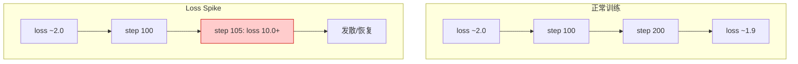
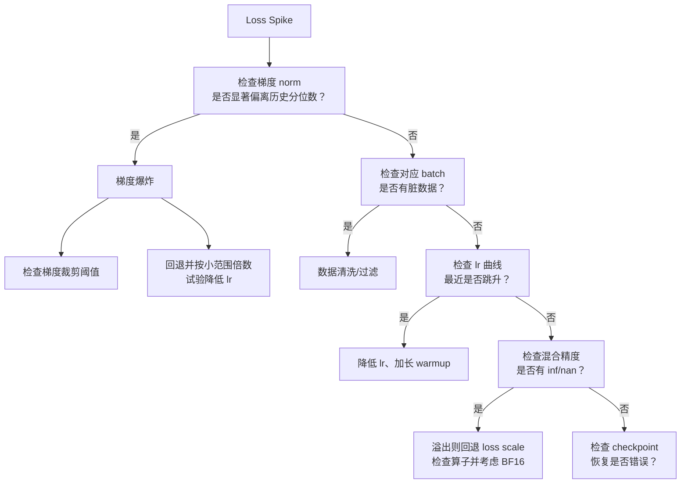

# 第33章 训练稳定性与诊断：loss spike、attention sink 与 checkpoint 恢复 ⭐⭐⭐⭐

> **面试频率**：中高（预训练/算法岗常见）| **技术热度**：★★★★☆
>
> 训练稳定性排障常占显著工程时间：loss spike、梯度爆炸/消失、混合精度溢出、学习率不匹配、
> checkpoint 恢复失败等都可能浪费大规模算力。本章按证据链梳理根因、诊断与恢复。
>
> 🆕 **截至 2026-07-31**：Muon 是面向二维隐藏层权重的 momentum-orthogonalization
> 优化器，已有大规模实验但未无条件替代 AdamW/Lion；Embedding、Norm、bias 等通常仍用 AdamW。
> StreamingLLM 的 attention sink 主要是流式推理 KV 保留策略。PyTorch Distributed
> Checkpoint 支持 load-time resharding，但“跨框架/跨版本”仍需 schema、版本和数值验证。

---

## 33.1 Loss Spike 根因分析 ⭐⭐⭐⭐⭐

### 33.1.1 什么是 loss spike？

Loss spike 指训练损失在几步内从正常值（如 2.0）跳升到异常高值（如 10.0+），可能随后恢复、也可能发散：



### 33.1.2 Loss Spike 的五大根因

| 根因 | 表现 | 检测方法 | 解决方案 |
|-----|------|---------|---------|
| **梯度爆炸** | 梯度 norm 相对历史基线突然放大并伴随 loss/更新异常 | 监控分层与全局 grad norm | 梯度裁剪、降低 lr、定位异常 batch |
| **数据异常** | 特定 batch 有脏数据（如 token 溢出、格式错误） | 检查对应 batch 的 token count、长度分布 | 数据清洗、过滤超长样本 |
| **学习率过大** | loss 先降后跳，lr schedule 拐点处常见 | 对比 lr 曲线与 loss 曲线 | 降低 lr、warmup 加长 |
| **优化器状态错误** | Adam 的动量/二阶矩溢出、checkpoint 恢复错误 | 检查优化器 state 的值范围与恢复日志 | 回滚到已验证 checkpoint；必要时重置状态并重新建立训练基线 |
| **混合精度溢出** | FP16/BF16 下梯度/激活溢出 | 检查梯度的动态范围、是否有 inf/nan | 动态损失缩放（loss scaling）、切换到 BF16 |

### 33.1.3 诊断决策树



---

## 33.2 Attention Sink 现象 ⭐⭐⭐⭐

### 33.2.1 什么是 Attention Sink？

Attention Sink 指某些 head 会给初始 token 很高注意力，即使这些 token 语义并不重要。它是一种
可观测现象，不等价于模型必然“忽略后续内容”，也不能只凭一个 head 的注意力图判断训练失败。

StreamingLLM 发现：
- 对论文测试的多种模型，滑动窗口同时保留少量初始 KV 可显著恢复流式生成稳定性
- “4 个初始 token”是论文实验中的常用配置，不是所有模型的固定值；论文没有给通用 0.8 阈值

### 33.2.2 训练与推理时如何处理 Attention Sink？

| 方法 | 原理 | 实现复杂度 |
|------|------|-----------|
| **StreamingLLM 推理** | KV cache 保留少量初始 sink token + 最近窗口 | 不扩展模型真实记忆窗口 |
| **专用 sink token 训练** | 预训练时加入不承载语义的占位 token | 论文验证可改善流式部署 |
| **先诊断再干预** | 按 layer/head/query position 测 sink mass 与任务质量相关性 | 不用任意正则破坏有用 head |

```python
"""Attention-sink 诊断：只测量，不把未经验证的阈值直接加入训练 loss。"""
import torch
import torch.nn.functional as F

def attention_sink_mass(attn_weights: torch.Tensor,
                        sink_size: int = 4) -> torch.Tensor:
    """
    attn_weights: [batch, n_heads, seq_len, seq_len]
    返回每个 batch/head/query 对初始 sink_size 个 key 的注意力质量。
    """
    if attn_weights.ndim != 4:
        raise ValueError("expected [batch, heads, query_len, key_len]")
    if not 0 < sink_size <= attn_weights.shape[-1]:
        raise ValueError("invalid sink_size")
    return attn_weights[..., :sink_size].sum(dim=-1)
```

---

## 33.3 Gradient Norm 监控与裁剪 ⭐⭐⭐⭐

### 33.3.1 Gradient Norm 必须相对基线解释

梯度 norm（范数）是训练稳定性的第一指标：

| 梯度 norm 区间 | 含义 | 动作 |
|--------------|-----|-----|
| 长期接近 0 且更新率/学习停滞 | 可能梯度消失、loss scale/冻结配置错误 | 查分层梯度、更新率和数据 |
| 位于稳定历史分布内 | 不能仅凭绝对值判定好坏 | 结合 loss、lr、batch tokens 继续监控 |
| 突然超过历史高分位并伴随异常 | spike/异常 batch/溢出的候选信号 | 保存 batch、检查 finite、必要时裁剪 |
| 全局正常但个别层异常 | 局部数值或架构问题 | 看 per-layer norm、activation、update ratio |

全局 norm 会随参数量、损失归约、batch/token 数、梯度累积、并行归约和精度变化；不存在通用的
`1e-3~1`“黄金区间”或 `1e4` 爆炸线。应在固定口径下建立健康 run 的分位数基线。

### 33.3.2 自适应梯度裁剪

标准梯度裁剪：
$$\hat{g} = g \cdot \min\left(1, \frac{\text{max\_norm}}{\|g\|}\right)$$

Adaptive Gradient Clipping（AGC，Brock et al.）按参数单元比较梯度 norm 与参数 norm：
$\|g_i\| \le \lambda \max(\|w_i\|,\epsilon)$。用历史分位数/EMA 调整全局阈值属于
AutoClip/ZClip 一类思路，不应与 AGC 混名。

```python
"""AGC 教学实现：对矩阵/卷积核按输出单元裁剪，跳过 bias/Norm 标量参数。"""
import torch

@torch.no_grad()
def adaptive_gradient_clip(parameters, clipping: float = 0.01,
                           eps: float = 1e-3) -> None:
    params = list(parameters)  # 防止 model.parameters() 生成器被第二次遍历耗尽
    for p in params:
        if p.grad is None or p.ndim <= 1:
            continue
        unit_dims = tuple(range(1, p.ndim))
        p_norm = p.norm(dim=unit_dims, keepdim=True).clamp_min(eps)
        g_norm = p.grad.norm(dim=unit_dims, keepdim=True)
        max_norm = clipping * p_norm
        clipped_grad = p.grad * (max_norm / g_norm.clamp_min(1e-6))
        p.grad.copy_(torch.where(g_norm > max_norm, clipped_grad, p.grad))
```

### 33.3.3 监控看板设计

标准训练监控看板应包含：
- 梯度 norm（每层、总 norm）
- 梯度 norm 的直方图
- 权重更新与权重值的比值（$\|\Delta W\|/\|W\|$）
- 激活 norm（每层）
- Loss（训练/验证）
- 学习率

---

## 33.4 Checkpoint 恢复工程 ⭐⭐⭐⭐

### 33.4.1 什么是 Checkpoint？

Checkpoint 是训练的「快照」，包含：
- 模型权重
- 优化器状态（动量、二阶矩）
- lr scheduler 状态
- 当前步数/epoch
- 随机数种子（可复现性）

### 33.4.2 Checkpoint 恢复的常见坑

| 坑 | 表现 | 解决方案 |
|----|-----|---------|
| **优化器状态不兼容** | 恢复后 loss spike（Adam 的动量在不同框架/版本不兼容） | 可选「重置优化器状态」（仅恢复权重，重新初始化优化器） |
| **随机种子未恢复** | 恢复后数据顺序/采样不同，验证不稳定 | 保存并恢复所有种子（torch, numpy, python random, cuda） |
| **混合精度缩放因子丢失** | FP16 恢复后溢出 | 保存动态损失缩放器的状态 |
| **分片/拓扑变化** | 恢复时 world size 或 sharding 改变 | 使用支持 reshard 的 DCP/框架 checkpoint，并固定 schema |
| **数据位置丢失** | mid-epoch 恢复后重复/跳过样本 | 保存 sampler/dataloader、epoch、micro-step 与 token 计数 |
| **非原子写入** | 抢占时留下半个 checkpoint | 临时文件写完、校验后原子替换，并保留多个代次 |

### 33.4.3 单进程断点续训的可移植实现

```python
"""单进程 checkpoint 示例；FSDP/多节点请使用 torch.distributed.checkpoint。"""
from pathlib import Path
import random
import shutil

import numpy as np
import torch


def atomic_torch_save(obj, destination: Path) -> None:
    destination.parent.mkdir(parents=True, exist_ok=True)
    temporary = destination.with_suffix(destination.suffix + ".tmp")
    torch.save(obj, temporary)
    temporary.replace(destination)  # 同一卷上的原子替换，Windows/Linux 均可用

def save_checkpoint(model, optimizer, scheduler, scaler, step,
                    save_dir: str, dataloader=None,
                    is_latest: bool = True):
    ckpt = {
        "format_version": 1,
        "step": step,
        "model_state_dict": model.state_dict(),
        "optimizer_state_dict": optimizer.state_dict() if optimizer else None,
        "scheduler_state_dict": scheduler.state_dict() if scheduler else None,
        "scaler_state_dict": scaler.state_dict() if scaler else None,
        "dataloader_state_dict": (
            dataloader.state_dict()
            if dataloader is not None and hasattr(dataloader, "state_dict")
            else None
        ),
        "torch_rng_state": torch.get_rng_state(),
        "torch_cuda_rng_state": (
            torch.cuda.get_rng_state_all() if torch.cuda.is_available() else None
        ),
        "numpy_rng_state": np.random.get_state(),
        "python_rng_state": random.getstate(),
    }
    directory = Path(save_dir)
    path = directory / f"checkpoint_step_{step}.pt"
    atomic_torch_save(ckpt, path)
    if is_latest:
        # 不依赖 Unix `ln -sf`；复制到临时文件后再替换 latest。
        latest = directory / "checkpoint_latest.pt"
        temporary = latest.with_suffix(".pt.tmp")
        shutil.copyfile(path, temporary)
        temporary.replace(latest)

def load_checkpoint(save_dir: str, model, optimizer=None,
                    scheduler=None, scaler=None, dataloader=None,
                    reset_optimizer: bool = False):
    ckpt_path = Path(save_dir) / "checkpoint_latest.pt"
    ckpt = torch.load(ckpt_path, map_location="cpu", weights_only=False)
    if ckpt.get("format_version") != 1:
        raise ValueError("unsupported checkpoint format")
    model.load_state_dict(ckpt["model_state_dict"])
    if optimizer is not None and not reset_optimizer:
        optimizer.load_state_dict(ckpt["optimizer_state_dict"])
    # 重置 optimizer 时通常也要重新定义 scheduler 起点，避免二者步数不一致。
    if scheduler is not None and not reset_optimizer:
        scheduler.load_state_dict(ckpt["scheduler_state_dict"])
    if scaler is not None and ckpt.get("scaler_state_dict") is not None:
        scaler.load_state_dict(ckpt["scaler_state_dict"])
    if dataloader is not None and ckpt.get("dataloader_state_dict") is not None:
        dataloader.load_state_dict(ckpt["dataloader_state_dict"])
    torch.set_rng_state(ckpt["torch_rng_state"])
    if torch.cuda.is_available() and ckpt["torch_cuda_rng_state"] is not None:
        torch.cuda.set_rng_state_all(ckpt["torch_cuda_rng_state"])
    np.random.set_state(ckpt["numpy_rng_state"])
    random.setstate(ckpt["python_rng_state"])
    return ckpt["step"]
```

该示例覆盖单进程可移植性，但生产环境还应记录代码/配置/数据版本、并行拓扑、校验和、各 rank
完成标记与远端存储提交状态。PyTorch DCP 支持 load-time resharding；它不等于任意框架和未来
版本都能无迁移加载。

---

## 33.5 优化器选型诊断：AdamW vs Lion vs Muon ⭐⭐⭐⭐⭐

### 33.5.1 三者对比

| 优化器 | 原理 | 稳定性 | 内存占用 | 适用场景 |
|------|------|-------|--------|---------|
| **AdamW** | 一阶矩 + 二阶矩自适应缩放 + decoupled decay | 经广泛验证 | 每参数两份主要状态 | 通用训练/微调 |
| **Lion** | 两组动量组合的 sign update | 依任务实测 | 每参数一份主要动量状态 | 内存受限实验 |
| **Muon** | momentum 后对二维更新做 Newton–Schulz 近似正交化 | 新兴、结果依配置 | 二维权重一份主要 momentum；其余参数常配 AdamW | 大规模预训练候选 |

### 33.5.2 Muon 优化器：稳定性的新选择

Muon = **MomentUm Orthogonalized by Newton–Schulz**。它不估计 Hessian，也不维护 Adam 式
二阶矩；Newton–Schulz 用于近似矩阵更新的 polar/orthogonal factor。典型做法只给二维 hidden
weights 用 Muon，embedding、output head、norm 与 bias 仍交给 AdamW。稳定性、学习率和收益需
按模型规模与 recipe 验证，不能宣称“对 lr 不敏感”。

Muon 更新：
$$
\begin{aligned}
M_t &= \mu M_{t-1}+G_t \\
O_t &\approx \operatorname{Polar}(M_t)
\quad\text{（若干次 Newton\text{–}Schulz 迭代）}\\
W_{t+1} &= W_t-\eta\,s(W)\,O_t
\end{aligned}
$$

### 33.5.3 优化器诊断清单

- [ ] 梯度 norm 位于同一口径健康 run 的历史分布内
- [ ] 权重更新率按 layer/type 与基线比较，而不是固定要求 $10^{-3}$
- [ ] 优化器状态无 inf/nan
- [ ] Loss 曲线平滑，无尖刺
- [ ] 验证 loss 与训练 loss 无过大 gap

---

## 📋 本章速查表

| 知识点 | 核心概念/公式 | 面试考察重点 |
|-------|-------------|-------------|
| Loss Spike 五大根因 | 梯度爆炸、数据异常、lr过大、优化器错误、混合精度溢出 | 诊断决策树 |
| Attention Sink | 初始 token 获得高注意力；无通用 0.8 阈值 | StreamingLLM 保留 sink + 最近窗口 |
| 梯度 norm | 依模型、归约和并行口径 | 建健康基线、看分层分位数 |
| AGC | $\lVert g_i \rVert\le\lambda\max(\lVert w_i \rVert,\epsilon)$ | 与 EMA/AutoClip 区分 |
| Checkpoint 内容 | 权重、优化器、lr调度、随机种子、缩放器 | 保存与恢复 |
| Checkpoint 常见坑 | 优化器不兼容、种子未恢复、混合精度丢失 | 解决方案 |
| AdamW/Lion/Muon | 三者对比：状态、适用参数与场景 | 适用边界与等预算对照实验 |

---

## 🎯 面试真题精讲

### 真题 1：你遇到过哪些训练稳定性问题？如何定位根因？请画诊断流程

**答**：

常见问题：loss spike、梯度爆炸/消失、attention sink、验证不收敛、checkpoint 恢复失败。

诊断流程（决策树）：
```
Loss 跳升
  ↓
检查梯度 norm → 显著偏离健康基线 → 检查 batch/finite/裁剪/lr
  ↓ 否
检查对应 batch → 数据异常 → 清洗/过滤
  ↓ 否
检查 lr 曲线 → 最近跳升 → 降 lr/加长 warmup
  ↓ 否
检查混合精度 → inf/nan → 回退 loss scale、定位算子/考虑 BF16
  ↓ 否
检查 checkpoint → 优化器状态错误 → 重置优化器
```

---

### 真题 2：什么是 Attention Sink？训练时如何缓解？推理时如何利用？

**答**：

Attention Sink：部分 head 会把初始 token 当作吸收多余注意力质量的“汇点”，没有通用 0.8 阈值。

训练时可实验论文支持的 dedicated sink token，并同时验证通用能力；不要把位置编码平滑、随机
sink 或任意注意力正则当成 StreamingLLM 的既定结论。

推理时利用（StreamingLLM）：
- 保留前 4 个 sink token，滑动窗口丢弃中间
- 可以持续生成，但中间 token 已被丢弃，因此没有获得“无限记忆”或扩展真实 context window

---

### 真题 3：为什么梯度 norm 没有通用黄金区间？AGC 如何工作？

**答**：

绝对 norm 受参数量、loss reduction、batch/token、梯度累积和并行归约影响。先固定口径并用健康
run 建立全局/分层分位数。AGC 对每个参数单元限制
$\|g_i\|/\max(\|w_i\|,\epsilon)$；它仍需调 clipping coefficient，不能保证免调参。

---

### 真题 4：Checkpoint 恢复有哪些常见坑？如何设计一个稳健的恢复流程？

**答**：

常见坑：
- 优化器状态不兼容（跨框架/版本）
- 随机种子未恢复（数据顺序不同）
- 混合精度缩放因子丢失
- 分片权重拓扑不兼容

稳健恢复流程：
1. 保存：权重、优化器、lr调度、scaler、所有随机种子（torch/numpy/python/cuda）
2. 恢复：先恢复权重，再恢复其他（可选「重置优化器」作为降级方案）
3. 验证：在固定回放窗口内核对数据游标、RNG、logits/loss 与更新；容差按 dtype、并行与确定性协议定义
4. 回滚：若失败，回到更早 checkpoint

---

### 真题 5：AdamW vs Lion vs Muon 各有什么优缺点？大规模预训练选哪个？

**答**：

| | 原理 | 主要优化器状态 | 证据与场景边界 |
|--|-----|----------------|---------------|
| AdamW | 一、二阶矩自适应缩放 + decoupled decay | 每个被优化参数通常有一阶、二阶矩；总内存还取决于 master weights、dtype 与分片 | 广泛使用的训练/微调基线 |
| Lion | 用动量与符号更新 | 通常一份主要动量；以具体实现为准 | 内存受限时的候选，需重新调学习率/衰减并做等预算对照 |
| Muon | 对二维隐藏层权重的 momentum 做 Newton–Schulz 近似正交化 | Muon 参数一份主要 momentum；非二维参数通常仍由 AdamW 管理 | 大规模预训练候选；收益、通信与恢复行为需实测 |

大规模预训练不能只凭名称选优化器：以 AdamW 健康 recipe 为基线，对 Muon+AdamW 参数分组做
等 token/算力对照，比较 loss、下游质量、更新率、吞吐、通信、显存和恢复行为，再决定是否采用。

---

## 📚 相关章节

- [[19_分布式训练系统]]：分布式训练下的稳定性问题
- [[11_深度学习与PyTorch]]：混合精度训练
- [[32_DeepSeek风格MoE与MLA深度解析]]：MoE 训练的额外稳定性挑战
- [[22_大模型数据工程]]：数据清洗与预处理
- [[36_JAX与TPU大规模预训练]]：JAX/TPU 生态下的稳定性工具

## 📖 一手参考资料（核验至 2026-07-31）

- PyTorch, [Automatic Mixed Precision](https://docs.pytorch.org/docs/stable/amp.html)
- Xiao et al., [Efficient Streaming Language Models with Attention Sinks](https://arxiv.org/abs/2309.17453)
- Brock et al., [High-Performance Large-Scale Image Recognition Without Normalization（AGC）](https://proceedings.mlr.press/v139/brock21a.html)
- PyTorch, [Distributed Checkpoint](https://docs.pytorch.org/docs/main/distributed.checkpoint.html)
- TorchData, [StatefulDataLoader Tutorial](https://meta-pytorch.org/data/main/stateful_dataloader_tutorial.html)
- Jordan et al., [Muon: An Optimizer for Hidden Layers in Neural Networks](https://kellerjordan.github.io/posts/muon/)
- Liu et al., [Muon is Scalable for LLM Training](https://arxiv.org/abs/2502.16982)
- PyTorch, [Using Muon Optimizer with DeepSpeed](https://pytorch.org/blog/using-muon-optimizer-with-deepspeed/)
