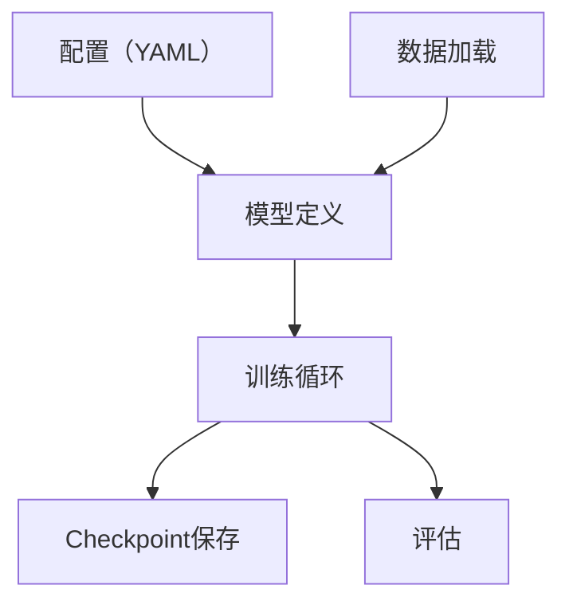

# 第 34 章 JAX、XLA 与 TPU 预训练 ⭐⭐⭐⭐
> [!abstract] 本章导航
> **定位**：第五部分 数据、训练、对齐、评估与安全中的第 34 章；围绕“JAX、XLA 与 TPU 预训练”建立单一、可追踪的知识主线。
>
> **先修**：[[33_大模型分布式训练|第 33 章 大模型分布式训练]]。
>
> **学习目标**：
> - 解释 JAX 编程模型：函数式、纯函数、变换 ⭐⭐⭐⭐ 的核心问题、机制与适用边界。
> - 实现或评估 XLA：加速线性代数编译器 ⭐⭐⭐⭐ 的最小闭环。
> - 使用可复现证据诊断 Pallas：自定义加速器 Kernel ⭐⭐⭐⭐ 的工程取舍与失败模式。
>
> **建议路径**：JAX 编程模型：函数式、纯函数、变换 ⭐⭐⭐⭐ → XLA：加速线性代数编译器 ⭐⭐⭐⭐ → Pallas：自定义加速器 Kernel ⭐⭐⭐⭐ → Pathways：分布式编排系统 ⭐⭐⭐ → MaxText：预训练参考实现 ⭐⭐⭐⭐ → PyTorch ↔ JAX 转换与迁移 ⭐⭐⭐。
>
> **配套代码**：本章暂无独立代码目录。

本章先回答“JAX 编程模型：函数式、纯函数、变换 ⭐⭐⭐⭐”为什么成立，再沿着机制、实现、评估和边界逐步展开。阅读时先建立因果链，再运行或推演示例，最后用章末自测检查能否脱离原文复述。
## 34.1 JAX 编程模型：函数式、纯函数、变换 ⭐⭐⭐⭐

### 34.1.1 JAX = NumPy + Autograd + XLA

JAX 提供 NumPy 风格的数组 API，并以可组合的函数变换为核心。面试最常见的是以下四类：

| 变换 | 作用 | 代码示例 |
|-----|-----|---------|
| `grad` | 自动微分 | `grad(f)(x)` |
| `jit` | XLA 编译加速 | `jit(f)(x)` |
| `vmap` | 自动向量化 | `vmap(f)(batch_x)` |
| `pmap` | 旧的多设备映射入口；现有代码仍可用 | `pmap(f)(data)` |

> **版本提示**：从 JAX 0.8.0 起，默认 `pmap` 实现已迁移到 `jit` + `shard_map`。截至
> JAX 0.11.0，`pmap` 文档直接建议改用 `jax.shard_map()`，或按场景评估 `jax.smap`。需要显式
> 布局时，可结合 `Mesh`、`NamedSharding` 与 `PartitionSpec`；迁移必须重新检查 rank 语义、
> 输入放置、collective 和数值结果。

### 34.1.2 JAX 的纯函数要求

JAX 要求：函数必须是**纯函数**（无副作用、输入相同则输出相同）。

```python
"""JAX 最小示例（纯函数 + 常用函数变换）"""
import jax
import jax.numpy as jnp

# 1. 纯函数（无副作用）
def f(x, w):
    return jnp.sum(w * x ** 2)

# 2. 自动微分
df_dw = jax.grad(f, argnums=1)  # 对第二个参数 w 求导

# 3. JIT 编译加速
f_jit = jax.jit(f)

# 4. vmap 向量化（批量处理）
f_vmap = jax.vmap(f, in_axes=(0, None))  # 对 x 的第0维做 batch，w 共享

# 5. pmap 兼容示例；新代码优先评估 shard_map/smap
f_pmap = jax.pmap(f, axis_name='devices')
```

### 34.1.3 JAX 的「不可变」数组

JAX 数组是不可变的（immutable）——不能 `x[0] = 5`，只能：
```python
x = jnp.array([1,2,3])
x_new = x.at[0].set(5)  # 返回新数组，原 x 不变
```

## 34.2 XLA：加速线性代数编译器 ⭐⭐⭐⭐

### 34.2.1 XLA = Accelerated Linear Algebra

XLA 是 Google 开发的编译器：
- 输入：计算图（从 JAX/TensorFlow）
- 输出：优化后的机器码（TPU/GPU/CPU）

XLA 可执行的优化包括：
- 算子融合（fuse kernels，减少内存访问）
- 自动向量化
- 根据显式或推导出的 sharding 做 SPMD 分区与通信优化
- 内存规划（减少峰值显存）

### 34.2.2 JIT 编译：静态形状要求

常规 `jax.jit` 工作流要求会影响数组形状或 Python 控制流的值在 tracing/编译时可知；否则容易发生
concretization error 或反复重编译。JAX 的动态形状支持仍有边界，工程上应优先保持稳定的 shape bucket：

```python
"""JIT 静态形状示例"""
@jax.jit
def g(x):
    # 正确：形状固定
    return x + 1

@jax.jit
def h(x, n):
    # 错误：形状依赖于 n（运行时才知道）
    return jnp.arange(n) + x

# 解决：用 static_argnums 标记静态参数
h_jit = jax.jit(h, static_argnums=1)
```

## 34.3 Pallas：自定义加速器 Kernel ⭐⭐⭐⭐

### 34.3.1 为什么需要 Pallas？

标准 JAX 算子无法覆盖所有融合和访存模式时，可以用 Pallas 编写更低层的 kernel。当前官方文档
分别提供 TPU 与 Mosaic GPU 后端指南；Pallas 仍位于 `jax.experimental`，且文档明确说明 API
变化频繁、仍有未实现情形，因此升级 JAX/驱动后要重新做正确性与性能回归。

Pallas 编程模型：
- 基于网格（Grid）：分块计算
- 显式读写 `Ref`，控制 tile、访存与并行方式
- 后端内存语义不同：不能把 TPU 的 VMEM/SMEM 与 GPU 的 HBM/SRAM 简单画成同一层次
- 编程思路与 Triton 有相似之处，但 Pallas 同时支持 TPU 和 GPU

### 34.3.2 Pallas 最小示例：向量相加

```python
"""Pallas 最小示例；需要受支持的 TPU/GPU，开发时可用 interpret=True 对照检查。"""
import jax
import jax.numpy as jnp
from jax.experimental import pallas as pl

def add_vector_kernel(x_ref, y_ref, out_ref):
    out_ref[...] = x_ref[...] + y_ref[...]

@jax.jit
def add_vectors(x, y):
    if x.shape != y.shape:
        raise ValueError("x and y must have the same shape")
    return pl.pallas_call(
        add_vector_kernel,
        out_shape=jax.ShapeDtypeStruct(x.shape, x.dtype),
    )(x, y)

x = jnp.arange(8, dtype=jnp.float32)
y = jnp.ones_like(x)
# assert jnp.allclose(add_vectors(x, y), x + y)
```

真实矩阵乘 kernel 还必须设计 M/N/K 分块、K 维累加、边界 mask、输入/输出 `BlockSpec` 和后端适配；
不能把一次固定 `128×128` 相乘当成通用矩阵乘。

## 34.4 Pathways：分布式编排系统 ⭐⭐⭐

### 34.4.1 Pathways 是什么？

Pathways 是 Google 的分布式编排系统：
- 以单控制器模型表达复杂的并行计算
- 用异步分布式数据流协调大量加速器上的算子、依赖和数据传输
- 支持 gang scheduling 和异构并行计算

Pathways 降低了表达复杂并行模式的控制面成本，但它**不会把任意单设备 JAX 程序自动变成高效的千卡训练**。
模型与数组仍需正确的 sharding、并行轴、批大小、输入管线和容错配置；公开论文报告的是特定工作负载上扩展到
数千加速器的系统能力。

### 34.4.2 Pathways vs PyTorch Distributed

| 维度 | Pathways | PyTorch Distributed |
|-----|---------|--------------------|
| 控制模型 | 单控制器、异步分布式数据流 | 常见为多进程/多控制器 |
| 并行表达 | 与 JAX sharding/SPMD 等机制协同 | DDP/FSDP/TP/PP 等 |
| 可获得性 | 主要是 Google/Google Cloud 体系能力 | PyTorch 分布式组件公开且部署面广 |
| 性能判断 | 必须在相同模型、硬件、并行策略和容错目标下实测 | 同左，不能脱离配置笼统排序 |

## 34.5 MaxText：预训练参考实现 ⭐⭐⭐⭐

### 34.5.1 MaxText 简介

MaxText 是开源的 JAX 大模型库与参考实现，面向 Google Cloud TPU 和 GPU：
- 支持预训练、SFT 与多种强化学习后训练流程
- 支持数据并行、张量并行、流水线并行等可组合 sharding 配置
- 提供 Llama、Gemma、DeepSeek、Qwen、Mistral 等模型配置；实际支持列表随版本变化
- 是可复用工程起点，不等于复制默认配置即可达到生产 SLO

### 34.5.2 MaxText 架构



> **目录版本门禁**：MaxText 在 2026-02-27 宣布新目录结构，随后移除了旧的 `MaxText.*` 后训练兼容入口。
> 当前代码主要位于 `src/MaxText/`；教程、命令和配置路径必须绑定具体 release/commit，不要照搬旧博客中的
> `MaxText/train.py` 路径。

## 34.6 PyTorch ↔ JAX 转换与迁移 ⭐⭐⭐

### 34.6.1 何时用 JAX？何时用 PyTorch？

| 场景 | JAX/TPU | PyTorch |
|-----|---------|---------|
| 已有 TPU 配额、JAX 能力和成熟 MaxText 基线 | ✅ 强候选 | 需评估 TPU 生态适配 |
| 已有 GPU 集群、PyTorch 模型与运维体系 | 迁移成本较高 | ✅ 强候选 |
| 单卡/小集群研究迭代 | 可用 | 通常生态与调试工具更丰富 |
| 生产推理部署 | 取决于服务栈和目标硬件 | 生态选择较多 |
| 已有 PyTorch 代码 | ⚠️ 需迁移 | ✅ 已有 |

### 34.6.2 权重转换工具

需要区分三类工具：
- NumPy/DLPack/`safetensors` 可以搬运张量数据，但不会自动解决参数语义和布局差异；
- Orbax 是 JAX checkpoint/持久化工具，不是 PyTorch → JAX 的自动模型转换器；
- 第三方转换脚本必须绑定明确的模型版本，并经过逐层数值验证。

```python
"""单个张量的数据搬运示例；这不等于完整模型转换。"""
import torch
import jax.numpy as jnp

def torch_to_jax(pt_tensor):
    np_tensor = pt_tensor.detach().cpu().numpy()
    return jnp.array(np_tensor)
```

完整迁移至少要核对：参数名映射、线性层/卷积布局与转置、QKV 排列、RoPE 定义、归一化 epsilon、
是否绑定词嵌入、dtype、量化元数据、tokenizer/chat template、checkpoint 分片与随机数语义。最后用固定输入比较
中间层和最终 logits；容差应按 dtype 与模型规模设定，而不是统一写死为 `1e-6`。
## 🧭 本章小结

- JAX 编程模型：函数式、纯函数、变换 ⭐⭐⭐⭐：能够说清问题、机制、证据与边界。
- XLA：加速线性代数编译器 ⭐⭐⭐⭐：能够说清问题、机制、证据与边界。
- Pallas：自定义加速器 Kernel ⭐⭐⭐⭐：能够说清问题、机制、证据与边界。

## ✅ 自测与练习

1. 不看正文，解释“JAX 编程模型：函数式、纯函数、变换 ⭐⭐⭐⭐”解决什么问题，并给出一个不适用场景。
2. 为“XLA：加速线性代数编译器 ⭐⭐⭐⭐”设计一个最小可复现实验，明确输入、指标和通过条件。
3. 比较“Pallas：自定义加速器 Kernel ⭐⭐⭐⭐”的至少两种方案，说明质量、成本、延迟或风险取舍。

## 🧪 配套代码与验收

本章暂无独立代码目录。先完成正文中的设计题与自测；跨章示例以导航中指向的伴侣目录为准。

## 🎯 面试题精讲

回答本章问题时使用四步结构：先给结论，再解释机制，然后给项目证据，最后主动说明适用边界。涉及性能或效果时，补充模型、硬件、数据、并发、版本和统计口径；条件不完整时明确说“需要实测”。

## 📋 本章速查表

| 主题 | 回答主线 |
|---|---|
| JAX 编程模型：函数式、纯函数、变换 ⭐⭐⭐⭐ | 问题 → 机制 → 示例 → 指标 → 边界 |
| XLA：加速线性代数编译器 ⭐⭐⭐⭐ | 问题 → 机制 → 示例 → 指标 → 边界 |
| Pallas：自定义加速器 Kernel ⭐⭐⭐⭐ | 问题 → 机制 → 示例 → 指标 → 边界 |
| Pathways：分布式编排系统 ⭐⭐⭐ | 问题 → 机制 → 示例 → 指标 → 边界 |
| MaxText：预训练参考实现 ⭐⭐⭐⭐ | 问题 → 机制 → 示例 → 指标 → 边界 |

## 🔗 相关章节

- [[33_大模型分布式训练|第 33 章 大模型分布式训练]]
- [[35_训练稳定性与诊断|第 35 章 训练稳定性与诊断]]

## 📖 一手参考资料

> 核验基线：2026-07-31；结构复核：2026-08-05。产品、API、法规、价格与 benchmark 会变化，使用前应再次核验。

- [[docs/AUTHORITATIVE_SOURCES|章节权威来源索引]]：按主题维护官方文档、标准、原论文和官方仓库。
