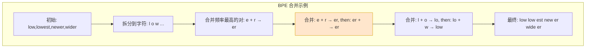

# 第 34 章 Tokenizer 设计与词表工程：BPE、BBPE、SentencePiece ⭐⭐⭐

> [!abstract] 本章导航
> **定位**：解释文本如何进入模型，并把词表设计连接到成本、多语言和领域效果。
>
> **先修**：[[01_Python编程基础]]、[[12_Transformer与大模型原理]]、[[22_大模型数据工程]]。
>
> **学习目标**：
> - 解释 BPE、Unigram 和 SentencePiece 的训练与解码。
> - 测量压缩率、未知词和多语言 token 效率。
> - 根据领域数据与兼容性设计词表适配。
>
> **建议路径**：BPE/BBPE 算法原理 → SentencePiece 与 Unigram LM → 词表大小权衡：压缩率 vs 下游性能 → … → 主流 Tokenizer 对比。先完成主线，再按需要阅读进阶内容。
>
> **配套代码**：本章暂无独立代码目录，使用正文推导、自测题和决策表验收。

> [!info] 阅读提示
> Tokenizer 决定文本如何映射为模型序列，会共同影响序列长度、词表参数、语言覆盖、成本与
> 下游质量；不存在只看“压缩率”就能选出的单一最佳方案。本章梳理
> BPE/BBPE/SentencePiece/Unigram 原理、词表大小权衡与多语言覆盖工程。
>
> 🆕 **截至 2026-07-31**：多语言 byte-level BPE 与 SentencePiece 仍广泛使用，但不存在
> “Qwen-LLaMA Tokenizer”这一统一标准。Tokenizer 评估除压缩率外，还必须覆盖 Unicode
> normalization、特殊 token/chat template、byte fallback、跨语言成本和下游任务回归。

## 34.1 BPE/BBPE 算法原理 ⭐⭐⭐⭐

### 34.1.1 什么是 BPE？

BPE = Byte-Pair Encoding。名称来自早期压缩算法，但 NLP BPE 的初始符号可以是字符、字节或
其他基础单元：GPT-2 使用 byte-level BPE；LLaMA 1/2 使用 SentencePiece BPE；Llama 3
使用 tiktoken 风格的 byte-level BPE，不能把三者写成同一实现。

核心思想：**反复合并训练语料中出现频率最高的相邻符号对**，直到达到目标词表大小。

BPE 训练步骤：
1. 初始：把每个字符（或 UTF-8 字节）作为独立 token
2. 迭代：找到出现频率最高的相邻字符对，合并为新 token
3. 终止：词表大小达到目标（如 50257）



### 34.1.2 完整 BPE 实现

```python
"""BPE 的完整实现（教学版，清晰展示合并逻辑）"""
from collections import defaultdict, Counter

def get_vocab(corpus: list[str]):
    """初始词表：每个字符/字节单独，加 </w> 表示词结尾"""
    vocab = Counter()
    for line in corpus:
        words = line.split()
        for word in words:
            chars = list(word) + ['</w>']
            vocab[' '.join(chars)] += 1
    return vocab

def get_stats(vocab: dict[str, int]):
    """统计所有相邻字节对的频率"""
    pairs = defaultdict(int)
    for word, count in vocab.items():
        symbols = word.split()
        for i in range(len(symbols)-1):
            pairs[(symbols[i], symbols[i+1])] += count
    return pairs

def merge_vocab(pair: tuple[str, str], vocab_in: dict[str, int]):
    """合并最高频字节对"""
    vocab_out = {}
    bigram = ' '.join(pair)
    replacement = ''.join(pair)
    for word in vocab_in:
        w_out = word.replace(bigram, replacement)
        vocab_out[w_out] = vocab_in[word]
    return vocab_out

def train_bpe(corpus: list[str], num_merges: int):
    """完整 BPE 训练"""
    vocab = get_vocab(corpus)
    merges = []
    for i in range(num_merges):
        pairs = get_stats(vocab)
        if not pairs:
            break
        best = max(pairs, key=pairs.get)
        vocab = merge_vocab(best, vocab)
        merges.append(best)
    return vocab, merges

# 推理时按训练得到的 merge rank/顺序反复应用规则
def bpe_tokenize(word: str, merges: list[tuple[str, str]]):
    """给定词与合并规则，做 BPE tokenization"""
    chars = list(word) + ['</w>']
    for pair in merges:
        bigram = ' '.join(pair)
        replacement = ''.join(pair)
        # 反复应用当前合并规则
        while bigram in ' '.join(chars):
            i = 0
            while i < len(chars) - 1:
                if chars[i] == pair[0] and chars[i+1] == pair[1]:
                    chars = chars[:i] + [replacement] + chars[i+2:]
                else:
                    i += 1
    return chars
```

### 34.1.3 BBPE：Byte-level BPE

BBPE = Byte-level BPE（字节级 BPE），是 GPT-2 用的方案：
- 先将文本转换为 UTF-8 字节（0~255）
- 然后对字节做 BPE
- 无需处理 OOV（任何 Unicode 字符可表示为字节序列）

优点与边界：
- 所有 Unicode 文本都可编码为 UTF-8 字节，避免真正的字符 OOV
- 仍可能包含 Unicode normalization、正则 pre-tokenization、特殊 token 识别与 byte-to-Unicode
  映射；“无需预处理”并不准确
- 罕见脚本可能被拆成很多字节 token，能表示不等于跨语言效率或效果公平

## 34.2 SentencePiece 与 Unigram LM ⭐⭐⭐⭐

### 34.2.1 SentencePiece 简介

SentencePiece 是 Google 开源的 tokenizer（T5/PaLM 用），特点：
- **将空格作为 token 的一部分**（不是预分词）
- 同时支持 **Unigram LM** 与 **BPE** 两种 model type
- 端到端（从 raw text 到 token ids）
- 对“规范化后的文本”可逆；默认 NFKC 等 normalizer 可能改变原始码点

### 34.2.2 Unigram LM 算法

Unigram LM 是与 BPE 正交的方案：
1. 初始：用大量候选 token（从 n-gram 提取）
2. 迭代：计算每个 token 的「loss 增加量」（删除该 token 后，数据 log likelihood 下降多少）
3. 剪枝：删除 loss 增加最小的 token（即最不重要的）
4. 终止：词表大小达到目标

推理时：用 Viterbi 算法找概率最高的分词路径。

```python
"""Unigram LM 简化实现（Viterbi 分词）"""
import math

class UnigramTokenizer:
    def __init__(self, vocab: dict[str, float]):
        """vocab: token -> log prob"""
        self.vocab = vocab
        # 按长度降序（贪心匹配最长可能）
        self.sorted_tokens = sorted(vocab.keys(), key=lambda x: -len(x))

    def tokenize(self, text: str):
        """Viterbi 分词（简化版，动态规划找最优路径）"""
        n = len(text)
        # dp[i] = 前 i 个字符的最佳 log prob + 对应分词
        dp = [(-float('inf'), []) for _ in range(n+1)]
        dp[0] = (0.0, [])
        for i in range(n):
            for token in self.sorted_tokens:
                l = len(token)
                if i + l > n:
                    continue
                if text[i:i+l] == token:
                    new_prob = dp[i][0] + self.vocab[token]
                    if new_prob > dp[i+l][0]:
                        dp[i+l] = (new_prob, dp[i][1] + [token])
        return dp[n][1] if dp[n][1] else []
```

### 34.2.3 SentencePiece 的特殊 token 处理

SentencePiece 用 U+2581 `▁`（LOWER ONE EIGHTH BLOCK，不是 ASCII 下划线）表示空格：
- 输入：`hello world` → 内部形态近似 `▁hello▁world`
- Tokenization：可能分为 `▁hello` + `▁world` 或更小 subwords

优点：
- 无需预分词（如 spaCy/NLTK）
- 能恢复规范化文本中的空格位置；若 normalizer 改写了原始文本，则不能逐码点还原原文

## 34.3 词表大小权衡：压缩率 vs 下游性能 ⭐⭐⭐

### 34.3.1 Pareto 最优选择

词表大小 $V$ 的权衡：

| 维度 | 小 $V$（如 32K） | 大 $V$（如 256K） |
|-----|-----------------|------------------|
| 压缩率 | 低（平均每 token 字符少） | 高（整词/子词多） |
| 序列长度 | 通常更长，Attention/激活成本可能增加 | 通常更短，但 embedding/LM head 与 softmax 成本增加；端到端速度需实测 |
| 模型参数量 | 小（embedding 层 $V \times d$ 小） | 大（embedding 占显存） |
| 未登录字符 | 取决于基础 alphabet、byte fallback 与 `unk` 策略 | 同样取决于 fallback/覆盖；大词表不自动消除 `unk` |
| 下游性能 | 可能因序列更长或碎片化受损 | 不保证更高；稀有 embedding、参数预算和数据覆盖也会影响 |

**工程选择**不能只按“通用/多语言”背固定区间。应在固定总参数/训练 token 预算下扫描候选词表，
比较序列长度、embedding/LM head 参数、吞吐、各语言 fertility、代码/数字切分和下游质量。

### 34.3.2 压缩率与 parity 评测

`字符数/token 数` 便于同一 normalization 下比较同种脚本，但不同语言的 Unicode code point、
grapheme 和信息密度不同。跨语言至少同时报告 bytes/token、tokens/word 或语言适用的 fertility、
每请求 token 成本与下游质量：
```python
def compression_ratio(text: str, tokenized: list[str]):
    return len(text) / len(tokenized)
```

Parity（跨语言成本与质量）不能简化为“各语言压缩率必须相同”。应按每种语言合适的单位比较
fertility/bytes/token、请求成本与下游质量，识别某些语言是否被系统性过度切分或成本异常。

## 34.4 多语言与领域适配工程 ⭐⭐⭐

### 34.4.1 多语言语料配比

训练多语言 tokenizer 时，语料配比影响各语言的压缩率：

| 方案 | 优点 | 缺点 |
|-----|-----|-----|
| **均匀采样** | 各语言机会均等 | 小语种可能 data 不足 |
| **按语言大小采样** | 大语言覆盖好 | 小语种压缩率低 |
| **温度采样** | 平衡：$p_i \propto n_i^T, T \in [0,1]$ | 需调参 T |

温度采样：
- T=1：按语料大小采样
- T=0：均匀采样
- $T$（也常写作指数 $\alpha$）必须明确公式并在开发集调参；不存在通用推荐 0.7～0.8

### 34.4.2 Tokenizer Drift 问题

Tokenizer Drift（漂移）：预训练用 tokenizer A，微调/推理用 tokenizer B（略有不同），导致：
- Tokenization 不一致
- OOV/unk 增加
- 性能下降

解决方案：
- 严格保存预训练 tokenizer 的完整配置（merges、vocab 顺序、正则化规则）
- 微调时必须用完全相同的 tokenizer
- 用 `save_pretrained()` 保存 `tokenizer.json`/SentencePiece model、vocab/merges、added/special
  token 及其 ID、normalizer、pre-tokenizer、chat template，并记录仓库 revision 与文件 hash
- 建立 encode/decode round-trip、特殊 token、Unicode 边界和固定语料 token IDs 回归测试

## 34.5 主流 Tokenizer 对比 ⭐⭐⭐

| Tokenizer | 代表实现 | 算法 | 空格处理 | 核验边界 |
|----------|---------|------|---------|---------|
| GPT-2 Tokenizer | GPT-2 | byte-level BPE | pre-tokenization 中处理 | 具体 vocab/merges 与正则以 checkpoint 为准 |
| LLaMA Tokenizer | LLaMA 1/2 | SentencePiece BPE | `▁` 标记空格 | 不代表所有 Llama 版本 |
| Llama 3 Tokenizer | Llama 3 | tiktoken 风格 byte-level BPE | 正则 pre-tokenization | special tokens/chat template 需随 revision 固定 |
| T5 Tokenizer | T5 | Unigram（SentencePiece） | 空格作为归一化后文本的一部分 | normalization 与 extra IDs 属于模型契约 |
| Qwen Tokenizer | Qwen/Qwen2 时代实现 | UTF-8 byte-level BPE | 正则 pre-tokenization | 必须核对目标 checkpoint 的 `tokenizer.json`、revision 与模板 |

表中是代表实现，不是品牌级永久承诺；同一模型家族的后续版本也可能更换算法、词表或模板。

## 🧭 本章小结

本章应形成以下可复述结论：

- 解释 BPE、Unigram 和 SentencePiece 的训练与解码。
- 测量压缩率、未知词和多语言 token 效率。
- 根据领域数据与兼容性设计词表适配。

## ✅ 自测与练习

先合上正文，再回答以下问题；无法说明证据或边界时，回到对应小节复习。

1. 你能否解释 BPE、Unigram 和 SentencePiece 的训练与解码？
2. 你能否测量压缩率、未知词和多语言 token 效率？
3. 你能否根据领域数据与兼容性设计词表适配？

## 🧪 配套代码与验收

本章暂无独立代码目录。验收时应完成正文中的推导或决策题，并能在自测中说明适用边界。

成功标准：概念、输入输出、关键指标和失败条件能够相互对应，不用未经验证的性能数字代替结论。

## 🎯 面试题精讲

### 真题 1：解释 BPE 训练与推理的完整流程，手写最小实现

**答**：

训练：
1. 初始词表：每个字符（加 `</w>` 词尾）
2. 迭代：找频率最高的字节对，合并
3. 终止：达到词表大小

推理：
1. 将词拆分为字符
2. 按训练得到的 merge rank/顺序反复合并当前相邻符号

代码：见本章 `train_bpe` + `bpe_tokenize` 实现。

---

### 真题 2：BBPE 是什么？与标准 BPE 相比有什么优点？

**答**：

BBPE = Byte-level BPE：先将文本转 UTF-8 字节，再对字节做 BPE。

优点：
- 天然支持所有 Unicode 字符（无需处理 OOV）
- 可以避免语言专用分词器，但仍可能有 normalization/正则 pre-tokenization
- 任何语言/符号都可表示为字节序列
- 提供统一可表示性；跨语言泛化是否更好必须实测

---

### 真题 3：SentencePiece 有什么特点？Unigram LM 与 BPE 的区别？

**答**：

SentencePiece 特点：
- 空格作为 token 的一部分（以 `▁` 表示）
- 支持 Unigram LM 和 BPE
- 可还原 normalization 后文本；不保证恢复 normalization 前的原始码点
- 端到端（无需预分词）

Unigram vs BPE：
- BPE：自底向上，从小合并到大
- Unigram：自顶向下，从大词表剪枝到小
- BPE：推理时贪心合并
- Unigram：推理时 Viterbi 找最优路径

---

### 真题 4：词表大小如何选择？大/小词表各有什么优缺点？

**答**：

没有“通用模型/多语言模型”的固定词表区间。相邻模型只能提供候选起点；最终应固定总参数、训练
token/算力和语料配比，扫描多个词表并比较序列长度、embedding/head 参数、吞吐、各语言成本与
下游质量。

较小词表：
- embedding/LM head 参数更少；
- 可能让序列更长、切分更碎，端到端训练不一定更快。

较大词表：
- 可能缩短高频语言/领域的序列并保留更多完整片段；
- 增大 embedding/head 与 softmax 成本，低频 token 学习不足；是否改善小语种取决于语料采样与覆盖。

---

### 真题 5：什么是 Tokenizer Drift？如何避免？

**答**：

Tokenizer Drift：预训练用 tokenizer A，微调/推理用 tokenizer B（略有不同），导致 tokenization 不一致、性能下降。

避免：
- 严格保存预训练 tokenizer 的完整配置（merges、vocab 顺序、正则化规则）
- 微调时必须用完全相同的 tokenizer
- 保存完整 tokenizer artifacts、chat template、revision 与 hashes
- 自动化测试验证 tokenization 一致性

## 📋 本章速查表

| 知识点 | 核心概念/公式 | 面试考察重点 |
|-------|-------------|-------------|
| BPE 训练步骤 | 初始字符、迭代合并最高频字节对、达到词表大小停止 | 合并逻辑的代码实现 |
| BBPE | 先转 UTF-8 字节，再对字节做 BPE | Unicode 全覆盖的优点 |
| SentencePiece | 支持 Unigram/BPE，空格记为 `▁` | normalization 与可逆边界 |
| Unigram LM | Viterbi 分词、迭代剪枝最不重要 token | 与 BPE 的对比 |
| 词表权衡 | Pareto：压缩率 vs 下游性能 vs 参数量 | 固定预算扫描候选并测端到端指标 |
| 多语言配比 | 温度/指数采样 $p_i \propto n_i^\alpha$ | 明确定义并用开发集调参 |
| Tokenizer Drift | 预训练与微调 tokenizer 不一致 → 性能下降 | 严格版本控制 |

## 🔗 相关章节

- [[12_Transformer与大模型原理]]：embedding 层与 tokenizer 的关系
- [[22_大模型数据工程]]：预训练数据 pipeline 与 tokenizer 的配合
- [[28_端侧与边缘LLM]]：端侧上的 tokenizer 轻量化

## 📖 一手参考资料

- Google, [SentencePiece 官方仓库](https://github.com/google/sentencepiece)
- Hugging Face, [Tokenizers pipeline 与组件](https://huggingface.co/docs/tokenizers/main/pipeline)
- Hugging Face Transformers, [Tokenizer API 与 save_pretrained](https://huggingface.co/docs/transformers/main_classes/tokenizer)
- Meta Llama, [Llama 3 tokenizer 实现](https://github.com/meta-llama/llama3/blob/main/llama/tokenizer.py)
- QwenLM, [Qwen tokenization note](https://github.com/QwenLM/Qwen/blob/main/tokenization_note.md)

> 核验日期：2026-08-04。版本、价格、法规、模型能力和 benchmark 以链接页面当前状态为准。

- [[docs/AUTHORITATIVE_SOURCES|章节权威来源索引]]：按章节维护的官方文档、标准、原论文和官方仓库。
