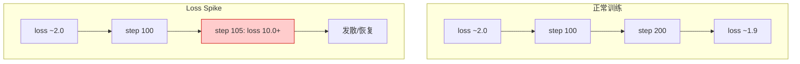
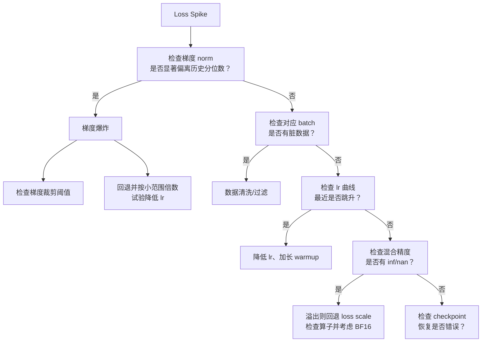

# 第 35 章 训练稳定性与诊断 ⭐⭐⭐⭐
> [!abstract] 本章导航
> **定位**：第五部分 数据、训练、对齐、评估与安全中的第 35 章；围绕“训练稳定性与诊断”建立单一、可追踪的知识主线。
>
> **先修**：[[34_JAX_XLA与TPU预训练|第 34 章 JAX、XLA 与 TPU 预训练]]。
>
> **学习目标**：
> - 解释 Loss Spike 根因分析 ⭐⭐⭐⭐⭐ 的核心问题、机制与适用边界。
> - 实现或评估 Attention Sink 现象 ⭐⭐⭐⭐ 的最小闭环。
> - 使用可复现证据诊断 Gradient Norm 监控与裁剪 ⭐⭐⭐⭐ 的工程取舍与失败模式。
>
> **建议路径**：Loss Spike 根因分析 ⭐⭐⭐⭐⭐ → Attention Sink 现象 ⭐⭐⭐⭐ → Gradient Norm 监控与裁剪 ⭐⭐⭐⭐ → Checkpoint 恢复工程 ⭐⭐⭐⭐ → 优化器选型诊断：AdamW vs Lion vs Muon ⭐⭐⭐⭐⭐。
>
> **配套代码**：本章暂无独立代码目录。

本章先回答“Loss Spike 根因分析 ⭐⭐⭐⭐⭐”为什么成立，再沿着机制、实现、评估和边界逐步展开。阅读时先建立因果链，再运行或推演示例，最后用章末自测检查能否脱离原文复述。
## 35.1 Loss Spike 根因分析 ⭐⭐⭐⭐⭐

### 35.1.1 什么是 loss spike？

Loss spike 指训练损失在几步内从正常值（如 2.0）跳升到异常高值（如 10.0+），可能随后恢复、也可能发散：



### 35.1.2 Loss Spike 的五大根因

| 根因 | 表现 | 检测方法 | 解决方案 |
|-----|------|---------|---------|
| **梯度爆炸** | 梯度 norm 相对历史基线突然放大并伴随 loss/更新异常 | 监控分层与全局 grad norm | 梯度裁剪、降低 lr、定位异常 batch |
| **数据异常** | 特定 batch 有脏数据（如 token 溢出、格式错误） | 检查对应 batch 的 token count、长度分布 | 数据清洗、过滤超长样本 |
| **学习率过大** | loss 先降后跳，lr schedule 拐点处常见 | 对比 lr 曲线与 loss 曲线 | 降低 lr、warmup 加长 |
| **优化器状态错误** | Adam 的动量/二阶矩溢出、checkpoint 恢复错误 | 检查优化器 state 的值范围与恢复日志 | 回滚到已验证 checkpoint；必要时重置状态并重新建立训练基线 |
| **混合精度溢出** | FP16/BF16 下梯度/激活溢出 | 检查梯度的动态范围、是否有 inf/nan | 动态损失缩放（loss scaling）、切换到 BF16 |

### 35.1.3 诊断决策树



## 35.2 Attention Sink 现象 ⭐⭐⭐⭐

### 35.2.1 什么是 Attention Sink？

Attention Sink 指某些 head 会给初始 token 很高注意力，即使这些 token 语义并不重要。它是一种
可观测现象，不等价于模型必然“忽略后续内容”，也不能只凭一个 head 的注意力图判断训练失败。

StreamingLLM 发现：
- 对论文测试的多种模型，滑动窗口同时保留少量初始 KV 可显著恢复流式生成稳定性
- “4 个初始 token”是论文实验中的常用配置，不是所有模型的固定值；论文没有给通用 0.8 阈值

### 35.2.2 训练与推理时如何处理 Attention Sink？

| 方法 | 原理 | 实现复杂度 |
|------|------|-----------|
| **StreamingLLM 推理** | KV cache 保留少量初始 sink token + 最近窗口 | 不扩展模型真实记忆窗口 |
| **专用 sink token 训练** | 预训练时加入不承载语义的占位 token | 论文验证可改善流式部署 |
| **先诊断再干预** | 按 layer/head/query position 测 sink mass 与任务质量相关性 | 不用任意正则破坏有用 head |

```python
"""Attention-sink 诊断：只测量，不把未经验证的阈值直接加入训练 loss。"""
import torch
import torch.nn.functional as F

def attention_sink_mass(attn_weights: torch.Tensor,
                        sink_size: int = 4) -> torch.Tensor:
    """
    attn_weights: [batch, n_heads, seq_len, seq_len]
    返回每个 batch/head/query 对初始 sink_size 个 key 的注意力质量。
    """
    if attn_weights.ndim != 4:
        raise ValueError("expected [batch, heads, query_len, key_len]")
    if not 0 < sink_size <= attn_weights.shape[-1]:
        raise ValueError("invalid sink_size")
    return attn_weights[..., :sink_size].sum(dim=-1)
```

## 35.3 Gradient Norm 监控与裁剪 ⭐⭐⭐⭐

### 35.3.1 Gradient Norm 必须相对基线解释

梯度 norm（范数）是训练稳定性的第一指标：

| 梯度 norm 区间 | 含义 | 动作 |
|--------------|-----|-----|
| 长期接近 0 且更新率/学习停滞 | 可能梯度消失、loss scale/冻结配置错误 | 查分层梯度、更新率和数据 |
| 位于稳定历史分布内 | 不能仅凭绝对值判定好坏 | 结合 loss、lr、batch tokens 继续监控 |
| 突然超过历史高分位并伴随异常 | spike/异常 batch/溢出的候选信号 | 保存 batch、检查 finite、必要时裁剪 |
| 全局正常但个别层异常 | 局部数值或架构问题 | 看 per-layer norm、activation、update ratio |

全局 norm 会随参数量、损失归约、batch/token 数、梯度累积、并行归约和精度变化；不存在通用的
`1e-3~1`“黄金区间”或 `1e4` 爆炸线。应在固定口径下建立健康 run 的分位数基线。

### 35.3.2 自适应梯度裁剪

标准梯度裁剪：
$$\hat{g} = g \cdot \min\left(1, \frac{\text{max\_norm}}{\|g\|}\right)$$

Adaptive Gradient Clipping（AGC，Brock et al.）按参数单元比较梯度 norm 与参数 norm：
$\|g_i\| \le \lambda \max(\|w_i\|,\epsilon)$。用历史分位数/EMA 调整全局阈值属于
AutoClip/ZClip 一类思路，不应与 AGC 混名。

```python
"""AGC 教学实现：对矩阵/卷积核按输出单元裁剪，跳过 bias/Norm 标量参数。"""
import torch

@torch.no_grad()
def adaptive_gradient_clip(parameters, clipping: float = 0.01,
                           eps: float = 1e-3) -> None:
    params = list(parameters)  # 防止 model.parameters() 生成器被第二次遍历耗尽
    for p in params:
        if p.grad is None or p.ndim <= 1:
            continue
        unit_dims = tuple(range(1, p.ndim))
        p_norm = p.norm(dim=unit_dims, keepdim=True).clamp_min(eps)
        g_norm = p.grad.norm(dim=unit_dims, keepdim=True)
        max_norm = clipping * p_norm
        clipped_grad = p.grad * (max_norm / g_norm.clamp_min(1e-6))
        p.grad.copy_(torch.where(g_norm > max_norm, clipped_grad, p.grad))
```

### 35.3.3 监控看板设计

标准训练监控看板应包含：
- 梯度 norm（每层、总 norm）
- 梯度 norm 的直方图
- 权重更新与权重值的比值（$\|\Delta W\|/\|W\|$）
- 激活 norm（每层）
- Loss（训练/验证）
- 学习率

## 35.4 Checkpoint 恢复工程 ⭐⭐⭐⭐

### 35.4.1 什么是 Checkpoint？

Checkpoint 是训练的「快照」，包含：
- 模型权重
- 优化器状态（动量、二阶矩）
- lr scheduler 状态
- 当前步数/epoch
- 随机数种子（可复现性）

### 35.4.2 Checkpoint 恢复的常见坑

| 坑 | 表现 | 解决方案 |
|----|-----|---------|
| **优化器状态不兼容** | 恢复后 loss spike（Adam 的动量在不同框架/版本不兼容） | 可选「重置优化器状态」（仅恢复权重，重新初始化优化器） |
| **随机种子未恢复** | 恢复后数据顺序/采样不同，验证不稳定 | 保存并恢复所有种子（torch, numpy, python random, cuda） |
| **混合精度缩放因子丢失** | FP16 恢复后溢出 | 保存动态损失缩放器的状态 |
| **分片/拓扑变化** | 恢复时 world size 或 sharding 改变 | 使用支持 reshard 的 DCP/框架 checkpoint，并固定 schema |
| **数据位置丢失** | mid-epoch 恢复后重复/跳过样本 | 保存 sampler/dataloader、epoch、micro-step 与 token 计数 |
| **非原子写入** | 抢占时留下半个 checkpoint | 临时文件写完、校验后原子替换，并保留多个代次 |

### 35.4.3 单进程断点续训的可移植实现

```python
"""单进程 checkpoint 示例；FSDP/多节点请使用 torch.distributed.checkpoint。"""
from pathlib import Path
import random
import shutil

import numpy as np
import torch


def atomic_torch_save(obj, destination: Path) -> None:
    destination.parent.mkdir(parents=True, exist_ok=True)
    temporary = destination.with_suffix(destination.suffix + ".tmp")
    torch.save(obj, temporary)
    temporary.replace(destination)  # 同一卷上的原子替换，Windows/Linux 均可用

def save_checkpoint(model, optimizer, scheduler, scaler, step,
                    save_dir: str, dataloader=None,
                    is_latest: bool = True):
    ckpt = {
        "format_version": 1,
        "step": step,
        "model_state_dict": model.state_dict(),
        "optimizer_state_dict": optimizer.state_dict() if optimizer else None,
        "scheduler_state_dict": scheduler.state_dict() if scheduler else None,
        "scaler_state_dict": scaler.state_dict() if scaler else None,
        "dataloader_state_dict": (
            dataloader.state_dict()
            if dataloader is not None and hasattr(dataloader, "state_dict")
            else None
        ),
        "torch_rng_state": torch.get_rng_state(),
        "torch_cuda_rng_state": (
            torch.cuda.get_rng_state_all() if torch.cuda.is_available() else None
        ),
        "numpy_rng_state": np.random.get_state(),
        "python_rng_state": random.getstate(),
    }
    directory = Path(save_dir)
    path = directory / f"checkpoint_step_{step}.pt"
    atomic_torch_save(ckpt, path)
    if is_latest:
        # 不依赖 Unix `ln -sf`；复制到临时文件后再替换 latest。
        latest = directory / "checkpoint_latest.pt"
        temporary = latest.with_suffix(".pt.tmp")
        shutil.copyfile(path, temporary)
        temporary.replace(latest)

def load_checkpoint(save_dir: str, model, optimizer=None,
                    scheduler=None, scaler=None, dataloader=None,
                    reset_optimizer: bool = False):
    ckpt_path = Path(save_dir) / "checkpoint_latest.pt"
    ckpt = torch.load(ckpt_path, map_location="cpu", weights_only=False)
    if ckpt.get("format_version") != 1:
        raise ValueError("unsupported checkpoint format")
    model.load_state_dict(ckpt["model_state_dict"])
    if optimizer is not None and not reset_optimizer:
        optimizer.load_state_dict(ckpt["optimizer_state_dict"])
    # 重置 optimizer 时通常也要重新定义 scheduler 起点，避免二者步数不一致。
    if scheduler is not None and not reset_optimizer:
        scheduler.load_state_dict(ckpt["scheduler_state_dict"])
    if scaler is not None and ckpt.get("scaler_state_dict") is not None:
        scaler.load_state_dict(ckpt["scaler_state_dict"])
    if dataloader is not None and ckpt.get("dataloader_state_dict") is not None:
        dataloader.load_state_dict(ckpt["dataloader_state_dict"])
    torch.set_rng_state(ckpt["torch_rng_state"])
    if torch.cuda.is_available() and ckpt["torch_cuda_rng_state"] is not None:
        torch.cuda.set_rng_state_all(ckpt["torch_cuda_rng_state"])
    np.random.set_state(ckpt["numpy_rng_state"])
    random.setstate(ckpt["python_rng_state"])
    return ckpt["step"]
```

该示例覆盖单进程可移植性，但生产环境还应记录代码/配置/数据版本、并行拓扑、校验和、各 rank
完成标记与远端存储提交状态。PyTorch DCP 支持 load-time resharding；它不等于任意框架和未来
版本都能无迁移加载。

## 35.5 优化器选型诊断：AdamW vs Lion vs Muon ⭐⭐⭐⭐⭐

### 35.5.1 三者对比

| 优化器 | 原理 | 稳定性 | 内存占用 | 适用场景 |
|------|------|-------|--------|---------|
| **AdamW** | 一阶矩 + 二阶矩自适应缩放 + decoupled decay | 经广泛验证 | 每参数两份主要状态 | 通用训练/微调 |
| **Lion** | 两组动量组合的 sign update | 依任务实测 | 每参数一份主要动量状态 | 内存受限实验 |
| **Muon** | momentum 后对二维更新做 Newton–Schulz 近似正交化 | 新兴、结果依配置 | 二维权重一份主要 momentum；其余参数常配 AdamW | 大规模预训练候选 |

### 35.5.2 Muon 优化器：稳定性的新选择

Muon = **MomentUm Orthogonalized by Newton–Schulz**。它不估计 Hessian，也不维护 Adam 式
二阶矩；Newton–Schulz 用于近似矩阵更新的 polar/orthogonal factor。典型做法只给二维 hidden
weights 用 Muon，embedding、output head、norm 与 bias 仍交给 AdamW。稳定性、学习率和收益需
按模型规模与 recipe 验证，不能宣称“对 lr 不敏感”。

Muon 更新：
$$
\begin{aligned}
M_t &= \mu M_{t-1}+G_t \\
O_t &\approx \operatorname{Polar}(M_t)
\quad\text{（若干次 Newton\text{–}Schulz 迭代）}\\
W_{t+1} &= W_t-\eta\,s(W)\,O_t
\end{aligned}
$$

### 35.5.3 优化器诊断清单

- [ ] 梯度 norm 位于同一口径健康 run 的历史分布内
- [ ] 权重更新率按 layer/type 与基线比较，而不是固定要求 $10^{-3}$
- [ ] 优化器状态无 inf/nan
- [ ] Loss 曲线平滑，无尖刺
- [ ] 验证 loss 与训练 loss 无过大 gap
## 🧭 本章小结

- Loss Spike 根因分析 ⭐⭐⭐⭐⭐：能够说清问题、机制、证据与边界。
- Attention Sink 现象 ⭐⭐⭐⭐：能够说清问题、机制、证据与边界。
- Gradient Norm 监控与裁剪 ⭐⭐⭐⭐：能够说清问题、机制、证据与边界。

## ✅ 自测与练习

1. 不看正文，解释“Loss Spike 根因分析 ⭐⭐⭐⭐⭐”解决什么问题，并给出一个不适用场景。
2. 为“Attention Sink 现象 ⭐⭐⭐⭐”设计一个最小可复现实验，明确输入、指标和通过条件。
3. 比较“Gradient Norm 监控与裁剪 ⭐⭐⭐⭐”的至少两种方案，说明质量、成本、延迟或风险取舍。

## 🧪 配套代码与验收

本章暂无独立代码目录。先完成正文中的设计题与自测；跨章示例以导航中指向的伴侣目录为准。

## 🎯 面试题精讲

回答本章问题时使用四步结构：先给结论，再解释机制，然后给项目证据，最后主动说明适用边界。涉及性能或效果时，补充模型、硬件、数据、并发、版本和统计口径；条件不完整时明确说“需要实测”。

## 📋 本章速查表

| 主题 | 回答主线 |
|---|---|
| Loss Spike 根因分析 ⭐⭐⭐⭐⭐ | 问题 → 机制 → 示例 → 指标 → 边界 |
| Attention Sink 现象 ⭐⭐⭐⭐ | 问题 → 机制 → 示例 → 指标 → 边界 |
| Gradient Norm 监控与裁剪 ⭐⭐⭐⭐ | 问题 → 机制 → 示例 → 指标 → 边界 |
| Checkpoint 恢复工程 ⭐⭐⭐⭐ | 问题 → 机制 → 示例 → 指标 → 边界 |
| 优化器选型诊断：AdamW vs Lion vs Muon ⭐⭐⭐⭐⭐ | 问题 → 机制 → 示例 → 指标 → 边界 |

## 🔗 相关章节

- [[34_JAX_XLA与TPU预训练|第 34 章 JAX、XLA 与 TPU 预训练]]
- [[36_大模型评估基础|第 36 章 大模型评估基础]]

## 📖 一手参考资料

> 核验基线：2026-07-31；结构复核：2026-08-05。产品、API、法规、价格与 benchmark 会变化，使用前应再次核验。

- [[docs/AUTHORITATIVE_SOURCES|章节权威来源索引]]：按主题维护官方文档、标准、原论文和官方仓库。
