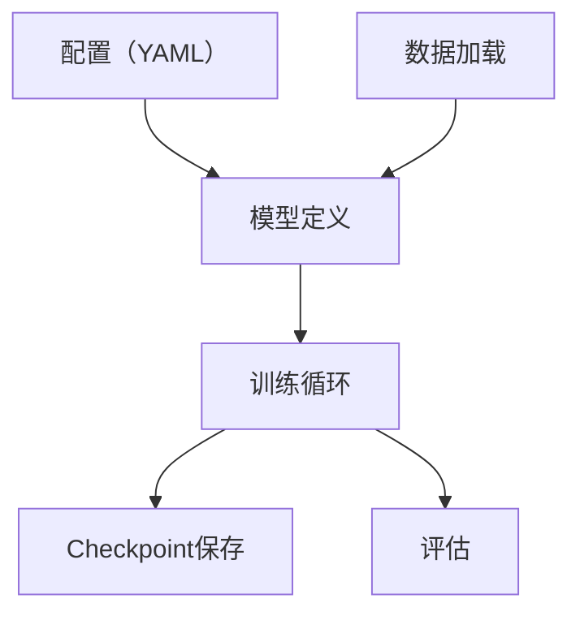

# 第36章 JAX 与 TPU 大规模预训练：Pathways、Pallas、XLA ⭐⭐⭐

> **面试频率**：中（JAX/TPU 相关研究与基础设施岗位更常见）| **技术热度**：★★★★☆
>
> JAX/TPU 与 PyTorch/GPU 都是大模型训练的重要技术路线；不同机构、项目乃至训练与推理阶段的选型并不相同，不能仅凭机构名称推断内部技术栈。本章梳理 JAX 编程模型、XLA 编译、Pallas 自定义 kernel、Pathways 编排和 MaxText 参考实现。
>
> 🆕 **截至 2026-07-31**：JAX 最新正式版本线已到 **0.11.0（2026-07-16）**，项目采用
> effort-based versioning，部署必须同时锁定并验证 `jax`/`jaxlib`。`pmap` 仍可运行，但官方文档
> 已将其标为旧入口并建议优先使用 `jax.shard_map()`，或按场景评估 `jax.smap`；Pallas 同时面向
> TPU 与 GPU，但仍是实验性 API。MaxText 在 2026 年完成目录重构，命令和文件路径应以锁定
> revision 的文档为准。

---

## 36.1 JAX 编程模型：函数式、纯函数、变换 ⭐⭐⭐⭐

### 36.1.1 JAX = NumPy + Autograd + XLA

JAX 提供 NumPy 风格的数组 API，并以可组合的函数变换为核心。面试最常见的是以下四类：

| 变换 | 作用 | 代码示例 |
|-----|-----|---------|
| `grad` | 自动微分 | `grad(f)(x)` |
| `jit` | XLA 编译加速 | `jit(f)(x)` |
| `vmap` | 自动向量化 | `vmap(f)(batch_x)` |
| `pmap` | 旧的多设备映射入口；现有代码仍可用 | `pmap(f)(data)` |

> **版本提示**：从 JAX 0.8.0 起，默认 `pmap` 实现已迁移到 `jit` + `shard_map`。截至
> JAX 0.11.0，`pmap` 文档直接建议改用 `jax.shard_map()`，或按场景评估 `jax.smap`。需要显式
> 布局时，可结合 `Mesh`、`NamedSharding` 与 `PartitionSpec`；迁移必须重新检查 rank 语义、
> 输入放置、collective 和数值结果。

### 36.1.2 JAX 的纯函数要求

JAX 要求：函数必须是**纯函数**（无副作用、输入相同则输出相同）。

```python
"""JAX 最小示例（纯函数 + 常用函数变换）"""
import jax
import jax.numpy as jnp

# 1. 纯函数（无副作用）
def f(x, w):
    return jnp.sum(w * x ** 2)

# 2. 自动微分
df_dw = jax.grad(f, argnums=1)  # 对第二个参数 w 求导

# 3. JIT 编译加速
f_jit = jax.jit(f)

# 4. vmap 向量化（批量处理）
f_vmap = jax.vmap(f, in_axes=(0, None))  # 对 x 的第0维做 batch，w 共享

# 5. pmap 兼容示例；新代码优先评估 shard_map/smap
f_pmap = jax.pmap(f, axis_name='devices')
```

### 36.1.3 JAX 的「不可变」数组

JAX 数组是不可变的（immutable）——不能 `x[0] = 5`，只能：
```python
x = jnp.array([1,2,3])
x_new = x.at[0].set(5)  # 返回新数组，原 x 不变
```

---

## 36.2 XLA：加速线性代数编译器 ⭐⭐⭐⭐

### 36.2.1 XLA = Accelerated Linear Algebra

XLA 是 Google 开发的编译器：
- 输入：计算图（从 JAX/TensorFlow）
- 输出：优化后的机器码（TPU/GPU/CPU）

XLA 可执行的优化包括：
- 算子融合（fuse kernels，减少内存访问）
- 自动向量化
- 根据显式或推导出的 sharding 做 SPMD 分区与通信优化
- 内存规划（减少峰值显存）

### 36.2.2 JIT 编译：静态形状要求

常规 `jax.jit` 工作流要求会影响数组形状或 Python 控制流的值在 tracing/编译时可知；否则容易发生
concretization error 或反复重编译。JAX 的动态形状支持仍有边界，工程上应优先保持稳定的 shape bucket：

```python
"""JIT 静态形状示例"""
@jax.jit
def g(x):
    # 正确：形状固定
    return x + 1

@jax.jit
def h(x, n):
    # 错误：形状依赖于 n（运行时才知道）
    return jnp.arange(n) + x

# 解决：用 static_argnums 标记静态参数
h_jit = jax.jit(h, static_argnums=1)
```

---

## 36.3 Pallas：自定义加速器 Kernel ⭐⭐⭐⭐

### 36.3.1 为什么需要 Pallas？

标准 JAX 算子无法覆盖所有融合和访存模式时，可以用 Pallas 编写更低层的 kernel。当前官方文档
分别提供 TPU 与 Mosaic GPU 后端指南；Pallas 仍位于 `jax.experimental`，且文档明确说明 API
变化频繁、仍有未实现情形，因此升级 JAX/驱动后要重新做正确性与性能回归。

Pallas 编程模型：
- 基于网格（Grid）：分块计算
- 显式读写 `Ref`，控制 tile、访存与并行方式
- 后端内存语义不同：不能把 TPU 的 VMEM/SMEM 与 GPU 的 HBM/SRAM 简单画成同一层次
- 编程思路与 Triton 有相似之处，但 Pallas 同时支持 TPU 和 GPU

### 36.3.2 Pallas 最小示例：向量相加

```python
"""Pallas 最小示例；需要受支持的 TPU/GPU，开发时可用 interpret=True 对照检查。"""
import jax
import jax.numpy as jnp
from jax.experimental import pallas as pl

def add_vector_kernel(x_ref, y_ref, out_ref):
    out_ref[...] = x_ref[...] + y_ref[...]

@jax.jit
def add_vectors(x, y):
    if x.shape != y.shape:
        raise ValueError("x and y must have the same shape")
    return pl.pallas_call(
        add_vector_kernel,
        out_shape=jax.ShapeDtypeStruct(x.shape, x.dtype),
    )(x, y)

x = jnp.arange(8, dtype=jnp.float32)
y = jnp.ones_like(x)
# assert jnp.allclose(add_vectors(x, y), x + y)
```

真实矩阵乘 kernel 还必须设计 M/N/K 分块、K 维累加、边界 mask、输入/输出 `BlockSpec` 和后端适配；
不能把一次固定 `128×128` 相乘当成通用矩阵乘。

---

## 36.4 Pathways：分布式编排系统 ⭐⭐⭐

### 36.4.1 Pathways 是什么？

Pathways 是 Google 的分布式编排系统：
- 以单控制器模型表达复杂的并行计算
- 用异步分布式数据流协调大量加速器上的算子、依赖和数据传输
- 支持 gang scheduling 和异构并行计算

Pathways 降低了表达复杂并行模式的控制面成本，但它**不会把任意单设备 JAX 程序自动变成高效的千卡训练**。
模型与数组仍需正确的 sharding、并行轴、批大小、输入管线和容错配置；公开论文报告的是特定工作负载上扩展到
数千加速器的系统能力。

### 36.4.2 Pathways vs PyTorch Distributed

| 维度 | Pathways | PyTorch Distributed |
|-----|---------|--------------------|
| 控制模型 | 单控制器、异步分布式数据流 | 常见为多进程/多控制器 |
| 并行表达 | 与 JAX sharding/SPMD 等机制协同 | DDP/FSDP/TP/PP 等 |
| 可获得性 | 主要是 Google/Google Cloud 体系能力 | PyTorch 分布式组件公开且部署面广 |
| 性能判断 | 必须在相同模型、硬件、并行策略和容错目标下实测 | 同左，不能脱离配置笼统排序 |

---

## 36.5 MaxText：预训练参考实现 ⭐⭐⭐⭐

### 36.5.1 MaxText 简介

MaxText 是开源的 JAX 大模型库与参考实现，面向 Google Cloud TPU 和 GPU：
- 支持预训练、SFT 与多种强化学习后训练流程
- 支持数据并行、张量并行、流水线并行等可组合 sharding 配置
- 提供 Llama、Gemma、DeepSeek、Qwen、Mistral 等模型配置；实际支持列表随版本变化
- 是可复用工程起点，不等于复制默认配置即可达到生产 SLO

### 36.5.2 MaxText 架构



> **目录版本门禁**：MaxText 在 2026-02-27 宣布新目录结构，随后移除了旧的 `MaxText.*` 后训练兼容入口。
> 当前代码主要位于 `src/MaxText/`；教程、命令和配置路径必须绑定具体 release/commit，不要照搬旧博客中的
> `MaxText/train.py` 路径。

---

## 36.6 PyTorch ↔ JAX 转换与迁移 ⭐⭐⭐

### 36.6.1 何时用 JAX？何时用 PyTorch？

| 场景 | JAX/TPU | PyTorch |
|-----|---------|---------|
| 已有 TPU 配额、JAX 能力和成熟 MaxText 基线 | ✅ 强候选 | 需评估 TPU 生态适配 |
| 已有 GPU 集群、PyTorch 模型与运维体系 | 迁移成本较高 | ✅ 强候选 |
| 单卡/小集群研究迭代 | 可用 | 通常生态与调试工具更丰富 |
| 生产推理部署 | 取决于服务栈和目标硬件 | 生态选择较多 |
| 已有 PyTorch 代码 | ⚠️ 需迁移 | ✅ 已有 |

### 36.6.2 权重转换工具

需要区分三类工具：
- NumPy/DLPack/`safetensors` 可以搬运张量数据，但不会自动解决参数语义和布局差异；
- Orbax 是 JAX checkpoint/持久化工具，不是 PyTorch → JAX 的自动模型转换器；
- 第三方转换脚本必须绑定明确的模型版本，并经过逐层数值验证。

```python
"""单个张量的数据搬运示例；这不等于完整模型转换。"""
import torch
import jax.numpy as jnp

def torch_to_jax(pt_tensor):
    np_tensor = pt_tensor.detach().cpu().numpy()
    return jnp.array(np_tensor)
```

完整迁移至少要核对：参数名映射、线性层/卷积布局与转置、QKV 排列、RoPE 定义、归一化 epsilon、
是否绑定词嵌入、dtype、量化元数据、tokenizer/chat template、checkpoint 分片与随机数语义。最后用固定输入比较
中间层和最终 logits；容差应按 dtype 与模型规模设定，而不是统一写死为 `1e-6`。

---

## 36.7 面试高频对比：JAX vs PyTorch ⭐⭐⭐⭐⭐

| 维度 | JAX | PyTorch |
|-----|-----|---------|
| 编程模型 | 函数式、纯函数、不可变 | 命令式、OO、可变 |
| 自动微分 | 函数式 grad（数学优美） | Autograd（追踪 tape） |
| 编译 | `jit` + XLA/OpenXLA | `torch.compile` + Dynamo/Inductor 等 |
| 分布式 | `Mesh`/sharding/`shard_map`；Pathways 是更高层编排 | DDP/FSDP/TP/PP 等 |
| 调试 | tracing/异步执行会增加定位成本 | eager 易定位，编译模式也有 graph break 等成本 |
| 生态 | 以 JAX/Flax/MaxText 与 XLA/TPU 工作流为中心 | 通用深度学习、GPU 与部署生态覆盖更广 |

---

## 📋 本章速查表

| 知识点 | 核心概念 | 面试考察重点 |
|-------|---------|-------------|
| JAX 常用变换 | grad/jit/vmap；多设备再看 shard_map/pmap | 组合方式、静态值和 tracing 边界 |
| 纯函数要求 | 无副作用、输入相同输出相同 | JAX 为什么要求纯函数 |
| XLA 优化 | 算子融合、向量化、并行化、内存规划 | XLA 对训练速度的提升 |
| Pallas | TPU/GPU 自定义 kernel、网格/分块、后端内存语义 | 实验性 API、正确性与性能回归 |
| Pathways | 单控制器、异步分布式数据流 | 编排不等于自动获得最优 sharding |
| MaxText | JAX 预训练参考实现 | 架构与关键文件 |
| JAX vs PyTorch | 编程模型/生态/调试对比 | 何时选哪个 |

---

## 🎯 面试真题精讲

### 真题 1：JAX 常用函数变换是什么？各有什么用？手写代码示例

**答**：

常用变换：
- `grad`：自动微分
- `jit`：XLA 编译加速
- `vmap`：自动向量化
- `pmap`：旧的多设备映射兼容入口；新项目优先了解 `shard_map`，并关注 `smap` 的适用边界

代码：见本章开头 `f(x,w)` 示例。

---

### 真题 2：JAX 为什么要求纯函数？「不可变数组」有什么好处？

**答**：

纯函数原因：
- JAX 的变换（jit/grad/vmap）依赖函数无副作用
- 可安全地重排、并行计算
- 可缓存、可复现

不可变数组好处：
- 引用安全（不会意外被其他代码修改）
- 更容易做优化（XLA 可假设数组不变）

---

### 真题 3：JAX/TPU 与 PyTorch/GPU 如何选择？你的团队为什么用 JAX？

**答**：

选择原则不是按卡数硬切：
- 先看已有硬件与配额、模型实现、团队能力、调试/观测、checkpoint 和推理部署链路；
- 有 TPU/JAX 基础与可复用 MaxText 配置时，JAX/TPU 是强候选；
- 已有 GPU/PyTorch 资产时，迁移收益必须覆盖重写、验证和运维成本。

回答“团队为何选 JAX”时只陈述真实证据，例如已有 TPU 配额、MaxText 基线和已测 MFU/恢复时间；
不要用无法验证的其他机构内部技术栈替代本团队的选型依据。

---

### 真题 4：PyTorch 训练的模型如何迁移到 JAX？权重转换有什么坑？

**答**：

迁移步骤：
1. 模型定义：从 Torch 重写为 JAX/Flax/Haiku
2. 权重转换：numpy 作为中间格式
3. 数值验证：固定输入，逐层比较激活和最终 logits，并按 dtype 设定容差

常见坑：
- 参数顺序不同（PyTorch 可能按层序、JAX 按字母序）
- 命名不同（`layer.0.weight` vs `layer_0_w`）
- 形状/转置问题（PyTorch 卷积 `OIHW` vs JAX `HWIO`）

---

### 真题 5：XLA 有什么优化？为什么 JIT 能加速那么多？

**答**：

XLA 优化：
- 算子融合（减少内存访问，比如 `x+1` 与 `x*2` 融合为一个 kernel）
- 自动向量化
- 自动并行化
- 内存规划（减少峰值显存）

JIT 加速原因：
- 编译一次、多次运行（节省解释开销）
- XLA 可跨算子融合并针对固定 shape/layout 生成专门代码
- 形状固定后可做专门优化

同时要说明首轮编译成本、shape 变化导致的重编译和 host/device 同步可能抵消收益。

---

## 📚 截至 2026-07-31 的权威资料

- [JAX 变更日志（含 0.11.0 与 effort-based versioning）](https://docs.jax.dev/en/latest/changelog.html)
- [JAX：迁移到新版 `pmap`](https://docs.jax.dev/en/latest/migrate_pmap.html)
- [JAX：`pmap` API 与 `shard_map` 建议](https://docs.jax.dev/en/latest/_autosummary/jax.pmap.html)
- [JAX：Pallas Quickstart](https://docs.jax.dev/en/latest/pallas/quickstart.html)
- [JAX：TPU Pallas 细节与实验性说明](https://docs.jax.dev/en/latest/pallas/tpu/details.html)
- [Pathways: Asynchronous Distributed Dataflow for ML（MLSys 2022）](https://research.google/pubs/pathways-asynchronous-distributed-dataflow-for-ml/)
- [MaxText 官方仓库与版本动态](https://github.com/AI-Hypercomputer/maxtext)

---

## 📚 相关章节

- [[19_分布式训练系统]]：FSDP/TP 与 Pathways 的类比
- [[33_训练稳定性与诊断]]：JAX/TPU 下的训练稳定性问题
- [[32_DeepSeek风格MoE与MLA深度解析]]：DeepSeek 用 PyTorch/FSDP、非 JAX
