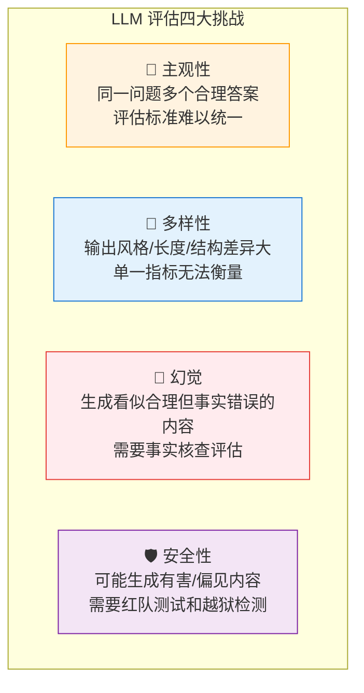
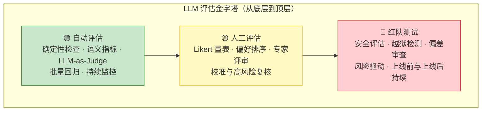
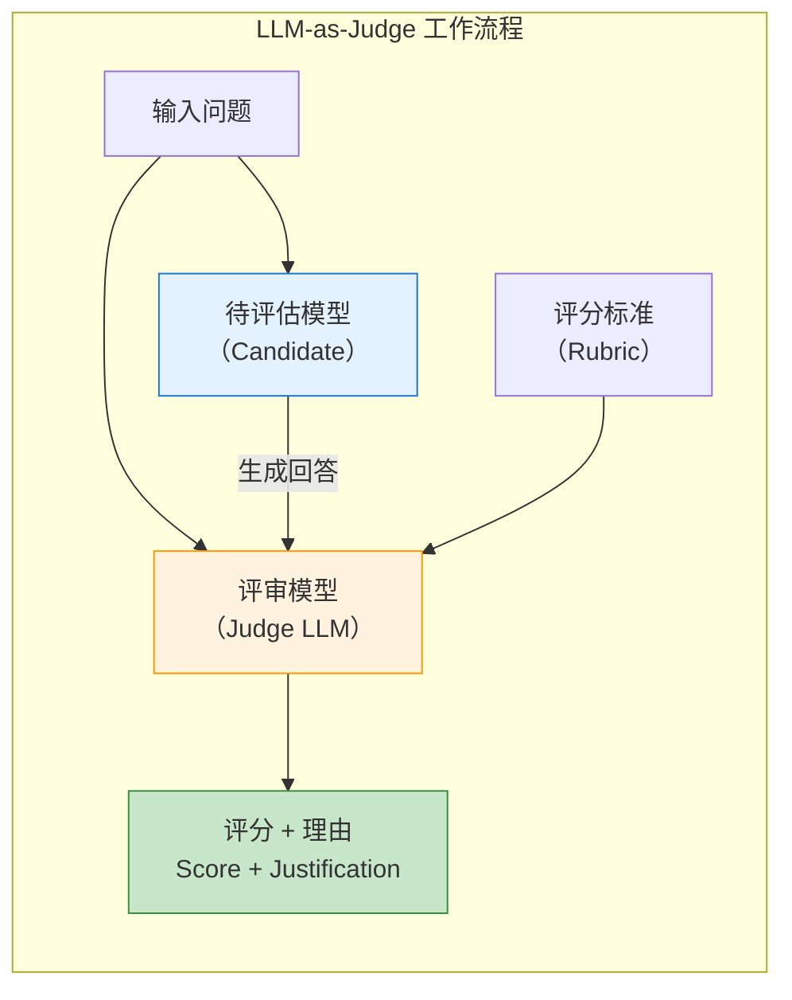
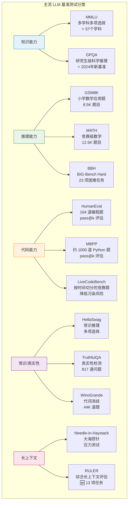

# 第 36 章 大模型评估基础 ⭐⭐⭐⭐
> [!abstract] 本章导航
> **定位**：第五部分 数据、训练、对齐、评估与安全中的第 36 章；围绕“大模型评估基础”建立单一、可追踪的知识主线。
>
> **先修**：[[35_训练稳定性与诊断|第 35 章 训练稳定性与诊断]]。
>
> **学习目标**：
> - 解释 评估概述：为什么LLM评估与传统ML不同 ⭐⭐⭐⭐ 的核心问题、机制与适用边界。
> - 实现或评估 自动评估指标 ⭐⭐⭐ 的最小闭环。
> - 使用可复现证据诊断 LLM-as-Judge 评估范式 ⭐⭐⭐⭐⭐ 的工程取舍与失败模式。
>
> **建议路径**：评估概述：为什么LLM评估与传统ML不同 ⭐⭐⭐⭐ → 自动评估指标 ⭐⭐⭐ → LLM-as-Judge 评估范式 ⭐⭐⭐⭐⭐ → 主流基准测试 ⭐⭐⭐⭐ → 人工评估方法论 ⭐⭐⭐。
>
> **配套代码**：`code/ch36_evaluation/`。

本章先回答“评估概述：为什么LLM评估与传统ML不同 ⭐⭐⭐⭐”为什么成立，再沿着机制、实现、评估和边界逐步展开。阅读时先建立因果链，再运行或推演示例，最后用章末自测检查能否脱离原文复述。
## 36.1 评估概述：为什么LLM评估与传统ML不同 ⭐⭐⭐⭐

### 36.1.1 生成任务 vs 分类任务的评估差异

分类任务常用准确率、精确率、召回率和 F1；回归、排序、概率预测等传统 ML 任务还需要各自指标。
大模型应用通常产生自由文本、结构化结果或工具轨迹，合理答案可能不唯一，因此必须把任务成功、
事实性、格式、安全、延迟和成本拆开评估。

| 维度 | 传统 ML 评估 | LLM 评估 |
|------|------------|---------|
| **输出形式** | 标签、数值、排序等任务定义输出 | 自由文本、结构化结果、工具调用或轨迹 |
| **评估标准** | 由具体任务与损失/指标定义 | 常需拆分任务成功、事实性、格式、安全等维度 |
| **正确答案** | 可能唯一，也可能是连续值或多标签 | 经常存在多个合理答案或多条有效路径 |
| **评估方式** | 自动指标为主，也可人工检查 | 确定性检查 + 统计指标 + 人工/模型辅助 |
| **可复现性** | 取决于数据切分、随机种子与实现 | 还受模型 revision、采样、工具与环境状态影响 |
| **评估成本** | 随任务与数据规模变化 | 随 Judge、人工标注、工具执行与重复次数变化 |

### 36.1.2 评估的核心挑战



### 36.1.3 评估金字塔



**金字塔解读**：
- **底层（自动评估）**：适合大批量回归；成本与可信度取决于指标和 Judge，不能只用单一分数。
- **中层（人工评估）**：用于校准 rubric、建立参考标签和复核关键失败；人工也会有分歧和偏差。
- **顶层（红队测试）**：按风险模型覆盖安全与鲁棒性；不是“一次性上线门槛”，还要持续扩充攻击集并监控。

## 36.2 自动评估指标 ⭐⭐⭐

### 36.2.1 BLEU（Bilingual Evaluation Understudy）

**原理**：BLEU 通过计算生成文本与参考文本之间的 **n-gram 精确匹配度** 来评估质量。最初用于机器翻译评估。

$$ \text{BLEU} = \text{BP} \cdot \exp\left(\sum_{n=1}^{N} w_n \log p_n\right) $$

其中 $p_n$ 是 n-gram 精确率，BP（Brevity Penalty）是长度惩罚因子：

$$ \text{BP} = \begin{cases} 1 & \text{if } c > r \\ e^{(1 - r/c)} & \text{if } c \leq r \end{cases} $$

$c$ 为候选文本长度，$r$ 为参考文本长度。当候选文本过短时施加惩罚。

```python
# BLEU 计算示例（使用 NLTK 和 SacreBLEU）
from nltk.translate.bleu_score import sentence_bleu, SmoothingFunction
from sacrebleu import corpus_bleu

# 参考文本和候选文本
reference = ["The cat is on the mat".split()]
candidate = "The cat sits on the mat".split()

# NLTK BLEU（使用平滑处理避免零值）
smooth = SmoothingFunction().method1
bleu_1 = sentence_bleu(reference, candidate,
                        weights=(1, 0, 0, 0),
                        smoothing_function=smooth)
bleu_4 = sentence_bleu(reference, candidate,
                        weights=(0.25, 0.25, 0.25, 0.25),
                        smoothing_function=smooth)

print(f"BLEU-1: {bleu_1:.4f}")
print(f"BLEU-4: {bleu_4:.4f}")

# SacreBLEU（推荐用于科研，结果可复现）
refs = [["The cat is on the mat"]]
hyps = ["The cat sits on the mat"]
score = corpus_bleu(hyps, refs)
print(f"SacreBLEU: {score.score:.2f}")
```

**BLEU 的局限性**：
- 只衡量 n-gram 表面匹配，不捕获语义相似性
- 对同义词、改述（paraphrase）不友好 —— "The feline is on the rug" 与
  "The cat is on the mat" 含义接近，但表面词形差异会显著拉低 BLEU
- 不适用于开放式生成任务（如故事创作、对话生成）

### 36.2.2 ROUGE（Recall-Oriented Understudy for Gisting Evaluation）

**原理**：ROUGE 侧重**召回率**，衡量参考文本中的 n-gram 有多少出现在生成文本中。主要用于摘要评估。

| ROUGE 变体 | 计算方式 | 关注点 |
|-----------|---------|-------|
| ROUGE-N | n-gram 召回率 | 信息覆盖度 |
| ROUGE-L | 最长公共子序列（LCS） | 句子结构保持 |
| ROUGE-W | 加权 LCS | 连续匹配的奖励 |
| ROUGE-S | Skip-bigram | 允许跳词的配对 |

$$ \text{ROUGE-N Recall} = \frac{\sum_{S \in \text{Ref}} \sum_{\text{gram}_n \in S} \text{Count}_{\text{match}}(\text{gram}_n)}{\sum_{S \in \text{Ref}} \sum_{\text{gram}_n \in S} \text{Count}(\text{gram}_n)} $$

```python
# ROUGE 计算示例（使用 rouge_score 库）
from rouge_score import rouge_scorer

scorer = rouge_scorer.RougeScorer(
    ['rouge1', 'rouge2', 'rougeL'],
    use_stemmer=True
)

reference = "The cat sat on the mat under the warm sunlight."
candidate = "A cat is sitting on a mat in the sunlight."

scores = scorer.score(reference, candidate)
for metric, score in scores.items():
    print(f"{metric}: Precision={score.precision:.3f}, "
          f"Recall={score.recall:.3f}, F1={score.fmeasure:.3f}")
```

### 36.2.3 BERTScore

**原理**：BERTScore 使用预训练语言模型（如 BERT）的上下文嵌入来计算生成文本和参考文本之间的**语义相似度**，而不是表面 n-gram 匹配。

$$ \text{BERTScore}_{\text{precision}} = \frac{1}{|x|} \sum_{x_i \in x} \max_{y_j \in y} \cos(E(x_i), E(y_j)) $$

$$ \text{BERTScore}_{\text{recall}} = \frac{1}{|y|} \sum_{y_j \in y} \max_{x_i \in x} \cos(E(y_j), E(x_i)) $$

$$ \text{BERTScore}_{\text{F1}} = 2 \cdot \frac{P \cdot R}{P + R} $$

其中 $E(\cdot)$ 是 BERT 的 token 嵌入函数，$\cos(\cdot, \cdot)$ 是余弦相似度。

```python
# BERTScore 计算示例
from bert_score import score

references = ["The cat is sitting on the mat."]
candidates = ["A feline rests upon the rug."]

P, R, F1 = score(candidates, references,
                 model_type="microsoft/deberta-xlarge-mnli",
                 lang="en",
                 verbose=True)

print(f"BERTScore Precision: {P.mean().item():.4f}")
print(f"BERTScore Recall:    {R.mean().item():.4f}")
print(f"BERTScore F1:        {F1.mean().item():.4f}")
```

结果取决于 backbone、版本、IDF/baseline rescaling、tokenization 和库版本，不能把某次输出写成通用
分数。配套脚本默认 `LLM_MOCK=1`，不会加载或下载模型；真实运行需显式设置 `LLM_MOCK=0`。

### 36.2.4 Perplexity（困惑度）

**原理**：困惑度衡量语言模型对给定文本的"意外程度"。困惑度越低，模型对文本的预测越好。

$$ \text{PPL} = \exp\left(-\frac{1}{N} \sum_{i=1}^{N} \log p(x_i | x_{<i})\right) = \exp(\text{Cross-Entropy Loss}) $$

其中 $p(x_i | x_{<i})$ 是模型在给定前文 $x_{<i}$ 下预测 token $x_i$ 的概率。

```python
# Perplexity 计算示例（使用 Hugging Face Transformers）
import torch
from transformers import AutoModelForCausalLM, AutoTokenizer

def compute_perplexity(text, model_name="openai-community/gpt2"):
    tokenizer = AutoTokenizer.from_pretrained(model_name)
    model = AutoModelForCausalLM.from_pretrained(model_name)
    model.eval()

    encodings = tokenizer(text, return_tensors="pt")
    max_len = model.config.max_position_embeddings
    input_ids = encodings.input_ids[:, :max_len]

    with torch.no_grad():
        outputs = model(input_ids, labels=input_ids)
        loss = outputs.loss  # Cross-Entropy Loss

    ppl = torch.exp(loss).item()
    return ppl

# 测试
text_fluent = "The weather is beautiful today and I plan to go for a walk."
text_gibberish = "The weather beautiful today plan walk for go and I a to."

ppl_fluent = compute_perplexity(text_fluent)
ppl_gibberish = compute_perplexity(text_gibberish)

print(f"流畅文本 PPL: {ppl_fluent:.2f}")
print(f"乱序文本 PPL: {ppl_gibberish:.2f}")
```

这只是用小型历史模型演示计算方法，不是当前模型推荐。PPL 只在模型、tokenizer、数据预处理和
截断口径可比时才适合比较；不能预设两段文本必然相差多少。配套脚本默认离线跳过模型加载。

### 36.2.5 自动评估指标速查表

| 指标 | 适用范围 | 核心思想 | 优点 | 局限性 |
|------|---------|---------|------|-------|
| **BLEU** | 机器翻译 | n-gram 精确匹配 | 快速、标准化 | 不捕获语义，对改述敏感 |
| **ROUGE** | 文本摘要 | n-gram 召回率 | 关注信息覆盖 | 同样不捕获语义 |
| **BERTScore** | 通用文本生成 | 上下文嵌入余弦相似度 | 捕获语义相似性 | 依赖预训练模型质量 |
| **Perplexity** | 固定模型/Tokenizer 下的语言建模 | 交叉熵的指数 | 衡量模型对样本的平均意外程度 | 跨 tokenizer 不可直接比较，也不评估事实正确性 |
| **METEOR** | 机器翻译 | 同义词 + 词形变化匹配 | 比 BLEU 更强健 | 依赖外部资源 |
| **CIDEr** | 图像描述 | TF-IDF 加权 n-gram | 考虑信息量 | 依赖参考文本质量 |

> ⭐ **面试提示**：面试官常问"BLEU 和 BERTScore 有什么区别？"——核心答案：BLEU 是**表面形式匹配**（n-gram overlap），BERTScore 是**深度语义匹配**（上下文嵌入余弦相似度）。BERTScore 能识别"猫"和"小猫"的语义相近，BLEU 不行。

## 36.3 LLM-as-Judge 评估范式 ⭐⭐⭐⭐⭐

### 36.3.1 核心思想

**LLM-as-Judge** 是让模型按明确 rubric 对另一个模型的输出做分类、打分或成对比较。Judge 可以
提高评估吞吐量，但它不是天然可靠的“类人裁判”：必须用人工标签校准，测量一致性、偏见和方差，
并为高风险结论保留人工复核。



### 36.3.2 Judge 设计要素

| 设计要素 | 说明 | 示例 |
|---------|------|------|
| **评分维度** | 评估哪些方面 | 准确性、流畅性、相关性、安全性 |
| **评分标准** | 每个维度的评分细则 | 1-5 分 Likert 量表，明确每分的含义 |
| **输出格式** | 结构化输出便于解析 | JSON / XML / 特定标记 |
| **参考锚点** | Few-shot 示例作为评分参考 | 提供 2-3 个"好回答"和"差回答"示例 |
| **对比设计** | 成对比较 vs 单点打分 | Pairwise 比 Pointwise 更稳定 |

### 36.3.3 实战：使用 OpenAI Responses API 做 Judge

配套示例 `code/ch36_evaluation/llm/05_llm_as_judge.py` 默认 `LLM_MOCK=1`，不会读取密钥或联网；
只有显式设置 `LLM_MOCK=0` 才调用真实 API。真实模式的依赖、凭据和解析错误会直接失败，不会静默
返回模拟分数。以下只展示真实模式的核心请求：

```python
import json
import os
from openai import OpenAI

if os.getenv("LLM_MOCK", "1") != "0":
    raise SystemExit("默认离线；真实评估请显式设置 LLM_MOCK=0")
if not os.getenv("OPENAI_API_KEY"):
    raise RuntimeError("缺少 OPENAI_API_KEY")

schema = {
    "type": "object",
    "properties": {
        "score": {"type": "integer", "minimum": 1, "maximum": 5},
        "reason": {"type": "string"},
    },
    "required": ["score", "reason"],
    "additionalProperties": False,
}
response = OpenAI().responses.create(
    model=os.getenv("OPENAI_MODEL", "gpt-5.6"),
    instructions="按给定 rubric 独立评分；不要因答案更长或位置靠前而加分。",
    input="问题：...\n候选回答：...\nrubric：...",
    reasoning={"effort": "low"},
    text={
        "format": {
            "type": "json_schema",
            "name": "judge_result",
            "schema": schema,
            "strict": True,
        }
    },
)
result = json.loads(response.output_text)
```

结构化输出解决的是**格式与解析约束**，不是 Judge 有效性。即使采样设置固定，服务端模型 revision、
非确定性执行和 prompt 微小变化仍可能改变结果。正式验收至少应：

1. 用人工标注的校准集测 Judge 与专家的一致性、偏差和置信区间；
2. Pairwise 交换 A/B 位置复评，报告翻转率，不把“先出现”当成质量；
3. 固定数据 revision、rubric、模型 snapshot/alias 返回值、推理配置和代码版本；
4. 对事实、安全或高风险结论保留人工复核，不把 Judge 分数直接当事实真值。

### 36.3.4 MT-Bench / Chatbot Arena（现 Arena）原理

| 特性 | MT-Bench | Chatbot Arena（后称 LMArena，2026-01 更名 Arena） |
|------|---------|---------------|
| **设计理念** | 多轮对话基准测试 | 众包人类偏好竞技场 |
| **评估方式** | 原始论文的历史配置使用当时的 GPT-4 Judge | 匿名成对人类偏好投票 |
| **题目数量** | 原始 MT-Bench 为 80 个多轮问题 | 用户自由提问；线上题目持续变化 |
| **覆盖领域** | 写作、推理、编码、数学等 8 类 | 开放式，所有领域 |
| **评分机制** | 历史基准为 1-10 分与成对比较 | 排名方法随平台版本演进，需记录当期方法 |
| **优点** | 可扩展、自动化 | 反映真实用户偏好 |
| **局限性** | Judge 自身偏见 | 人力成本高、被试者偏差 |

**传统 Elo 更新公式**（教学简化版，不等同于当前线上 Arena 的完整排名流水线）：

$$P(\text{A 胜 B}) = \frac{1}{1 + 10^{(R_B - R_A) / 400}}$$

$$R_A^{new} = R_A + K \cdot (S_A - E_A)$$

其中 $R_A$ 是模型 A 的评分，$K$ 是预先选择并报告的更新步长，$S_A$ 是实际结果
（1=胜，0=负，0.5=平），$E_A$ 是期望胜率。不同 $K$、抽样、去重、异常流量处理和
置信区间方法会影响榜单；复现实验不能只记录最终名次。

## 36.4 主流基准测试 ⭐⭐⭐⭐

### 36.4.1 基准测试全景图



### 36.4.2 MMLU（Massive Multitask Language Understanding）

**MMLU** 是经典且广泛使用的 LLM 知识评估基准，原始版本覆盖 57 个学科（从初等到高等）。

- **题目形式**：4 选 1 多项选择
- **题目数量**：原始版本约 15,908 道；使用时记录数据集 revision 与 split
- **评估方式**：零样本或 5-shot，计算准确率
- **结果边界**：不要抄录“当前最高分”。同一模型在 MMLU 原版/MMLU-Pro、zero-shot/5-shot、
  chat template、答案提取器和污染控制不同的情况下不可横向比较。

**MMLU 的计算方法**：

$$\text{MMLU} = \frac{1}{K} \sum_{k=1}^{K} \frac{1}{N_k} \sum_{i=1}^{N_k} \mathbb{1}[f(q_{k,i}) = a_{k,i}]$$

其中 $K=57$ 是原始版本学科数，$N_k$ 是第 $k$ 个学科的题目数，$f(q_{k,i})$ 是模型预测，
$a_{k,i}$ 是正确答案。上式是按学科宏平均的写法；若框架使用全题微平均，必须明确报告。

### 36.4.3 HumanEval / MBPP（代码生成评估）

**HumanEval** 是经典代码生成基准之一。

- **题目**：164 道 Python 编程题，每道题包含函数签名和 docstring
- **评估指标**：pass@k（$k$ 次采样中至少有一次通过所有测试用例的概率）
- **无偏估计公式**：

$$\text{pass@k} = \mathop{\mathbb{E}}_{\text{Problems}} \left[ 1 - \frac{\binom{n-c}{k}}{\binom{n}{k}} \right]$$

其中 $n$ 是总采样数，$c$ 是通过测试的采样数。

报告 HumanEval/MBPP 时，至少固定数据集 revision、模型精确版本、prompt/chat template、采样参数、
样本数 $n$、$k$、执行沙箱、超时和评分框架 commit；缺少这些信息的 pass@k 数字不具备复现性。

### 36.4.4 GSM8K / MATH（数学推理）

| 特性 | GSM8K（原始发布） | MATH（原始发布） |
|------|-------|------|
| 难度 | 小学数学应用题 | 竞赛级（AMC 10/12, AIME） |
| 题目数量 | ~8,500 训练 + 1,319 测试 | 12,500（7,500 训练 + 5,000 测试） |
| 题型 | 多步文字应用题 | 代数/几何/数论/概率 |
| 主要评估 | 思维链推理正确率 | 最终答案正确率 |
| 复现要点 | 数据集 revision、few-shot/CoT 模板、答案提取 | 数据版本、采样预算、答案归一化与 verifier |

### 36.4.5 HellaSwag / TruthfulQA

**HellaSwag**：衡量模型常识推理和句子补全能力。给定一个场景描述，模型需要从 4 个候选中
选择最合理的续写。结果必须注明任务版本、few-shot 数、模型 revision 和评测框架。

**TruthfulQA**：原始发布含 817 道问题、38 个类别，目标是测试模型是否复述常见误解。
当前运行仍需锁定数据 revision、prompt 与评分实现。原始任务常见指标：
- **MC1**：单选项准确率。
- **MC2**：多选项归一化准确率。

> ⭐ **回答要点**："MMLU 测知识广度，HumanEval 测代码能力，GSM8K 测数学推理，HellaSwag 测常识，TruthfulQA 测真实性 —— 单一基准无法全面衡量模型能力，面试时要展示你了解各基准的设计意图和局限性。"

## 36.5 人工评估方法论 ⭐⭐⭐

### 36.5.1 评估标准设计（Likert 量表）

Likert 量表是常用的人工评估工具之一，可让评估者在 1-5 或 1-7 等有序尺度上评分。

**5 点 Likert 量表示例**（锚点必须按任务校准，不是跨项目通用标准）：

| 分数 | 描述 | 含义 |
|------|------|------|
| **1** | 非常差 | 回答完全错误、无关或有害 |
| **2** | 较差 | 回答存在重大错误或遗漏关键信息 |
| **3** | 一般 | 回答基本正确但有明显改进空间 |
| **4** | 良好 | 回答准确、相关，小瑕疵可忽略 |
| **5** | 优秀 | 回答全面、准确、富有洞察力 |

**多维度评估表设计示例**：

| 维度 | 1 (很差) | 2 (差) | 3 (一般) | 4 (好) | 5 (很好) |
|------|---------|--------|---------|--------|---------|
| 准确性 | 事实严重错误 | 有明显错误 | 基本正确 | 大部分正确 | 完全准确 |
| 完整性 | 遗漏关键信息 | 覆盖不充分 | 覆盖基本要点 | 覆盖全面 | 超出预期 |
| 流畅性 | 完全不通顺 | 多处不通顺 | 基本流畅 | 流畅自然 | 文笔优美 |
| 安全性 | 包含有害内容 | 有潜在风险 | 无明显风险 | 安全可靠 | 主动防范风险 |
| 有用性 | 完全不帮助 | 帮助有限 | 基本有用 | 相当有用 | 极大帮助 |

### 36.5.2 评分者间一致性（Cohen's Kappa）

当多个评估者对同一批回答评分时，需要衡量他们的评分一致性。

**Cohen's Kappa 公式**：

$$\kappa = \frac{p_o - p_e}{1 - p_e}$$

其中 $p_o$ 是观察一致率（observed agreement），$p_e$ 是期望一致率（expected agreement by chance）。

```python
# Cohen's Kappa 计算示例
import numpy as np
from sklearn.metrics import cohen_kappa_score

# 两个评估者对 10 个回答的 Likert 评分 (1-5)
rater_a = [4, 5, 3, 4, 5, 2, 4, 3, 5, 4]
rater_b = [4, 5, 3, 5, 4, 2, 4, 4, 5, 4]

raw_agreement = np.mean(np.asarray(rater_a) == np.asarray(rater_b))
unweighted = cohen_kappa_score(rater_a, rater_b)
quadratic = cohen_kappa_score(rater_a, rater_b, weights="quadratic")
print(f"Raw agreement: {raw_agreement:.4f}")
print(f"Unweighted Kappa: {unweighted:.4f}")
print(f"Quadratic weighted Kappa: {quadratic:.4f}")  # Likert 是有序标签

# Fleiss' Kappa（多个评估者）
from statsmodels.stats.inter_rater import fleiss_kappa

# 3 位评估者对 5 个回答的评分分布
# 每行是一个回答，每列是某个评分被选中的次数
table = np.array([
    [0, 0, 0, 2, 1],  # 回答1: 2人选4分，1人选5分
    [0, 0, 0, 1, 2],  # 回答2: 1人选4分，2人选5分
    [0, 0, 2, 1, 0],  # 回答3: 2人选3分，1人选4分
    [0, 1, 1, 1, 0],  # 回答4: 1人选2分，1人选3分，1人选4分
    [0, 0, 0, 2, 1],  # 回答5: 2人选4分，1人选5分
])
fkappa = fleiss_kappa(table)
print(f"Fleiss' Kappa: {fkappa:.4f}")
```

Landis-Koch 一类分段只能作为历史经验描述，**不是通用验收阈值**。Kappa 会受类别基率、
类别数量和边际分布影响；Likert 应考虑加权 Kappa。报告时至少同时给出原始一致率、Kappa 类型、
类别分布、样本量和置信区间，并按错误后果确定项目自己的验收线。

### 36.5.3 评估平台

| 平台 | 特点 | 适用场景 | 成本 |
|------|------|---------|------|
| **Label Studio** | 开源核心、灵活、支持多种标注类型 | 学术研究、中小团队 | 自托管/商业计划与运维成本需核对 |
| **Scale AI** | 企业级、大规模、高质量 | 商业应用 | 付费 |
| **Surge AI** | 专注 LLM 评估、专家标注 | 高质量 LLM 评估 | 付费 |
| **Prolific** | 众包平台、多样化参与者 | 学术研究（大规模） | 按人数付费 |
| **Argilla** | 开源核心、数据管理、人工反馈 | 数据策展与模型训练 | 自托管/云计划与运维成本需核对 |
## 🧭 本章小结

- 评估概述：为什么LLM评估与传统ML不同 ⭐⭐⭐⭐：能够说清问题、机制、证据与边界。
- 自动评估指标 ⭐⭐⭐：能够说清问题、机制、证据与边界。
- LLM-as-Judge 评估范式 ⭐⭐⭐⭐⭐：能够说清问题、机制、证据与边界。

## ✅ 自测与练习

1. 不看正文，解释“评估概述：为什么LLM评估与传统ML不同 ⭐⭐⭐⭐”解决什么问题，并给出一个不适用场景。
2. 为“自动评估指标 ⭐⭐⭐”设计一个最小可复现实验，明确输入、指标和通过条件。
3. 比较“LLM-as-Judge 评估范式 ⭐⭐⭐⭐⭐”的至少两种方案，说明质量、成本、延迟或风险取舍。

## 🧪 配套代码与验收

- `code/ch36_evaluation/`

```powershell
python code/scripts/run_all_examples.py --chapter ch36 --tier core
```

默认验收不下载模型、不调用付费 API；真实 API 或 GPU 示例必须按 metadata 显式启用。成功标准是相关脚本输出 `OK`，条件不足时输出可解释的 `[SKIP]`。

## 🎯 面试题精讲

回答本章问题时使用四步结构：先给结论，再解释机制，然后给项目证据，最后主动说明适用边界。涉及性能或效果时，补充模型、硬件、数据、并发、版本和统计口径；条件不完整时明确说“需要实测”。

## 📋 本章速查表

| 主题 | 回答主线 |
|---|---|
| 评估概述：为什么LLM评估与传统ML不同 ⭐⭐⭐⭐ | 问题 → 机制 → 示例 → 指标 → 边界 |
| 自动评估指标 ⭐⭐⭐ | 问题 → 机制 → 示例 → 指标 → 边界 |
| LLM-as-Judge 评估范式 ⭐⭐⭐⭐⭐ | 问题 → 机制 → 示例 → 指标 → 边界 |
| 主流基准测试 ⭐⭐⭐⭐ | 问题 → 机制 → 示例 → 指标 → 边界 |
| 人工评估方法论 ⭐⭐⭐ | 问题 → 机制 → 示例 → 指标 → 边界 |

## 🔗 相关章节

- [[35_训练稳定性与诊断|第 35 章 训练稳定性与诊断]]
- [[37_RAG_Agent与安全评估|第 37 章 RAG、Agent 与安全评估]]

## 📖 一手参考资料

> 核验基线：2026-07-31；结构复核：2026-08-05。产品、API、法规、价格与 benchmark 会变化，使用前应再次核验。

- [[docs/AUTHORITATIVE_SOURCES|章节权威来源索引]]：按主题维护官方文档、标准、原论文和官方仓库。
