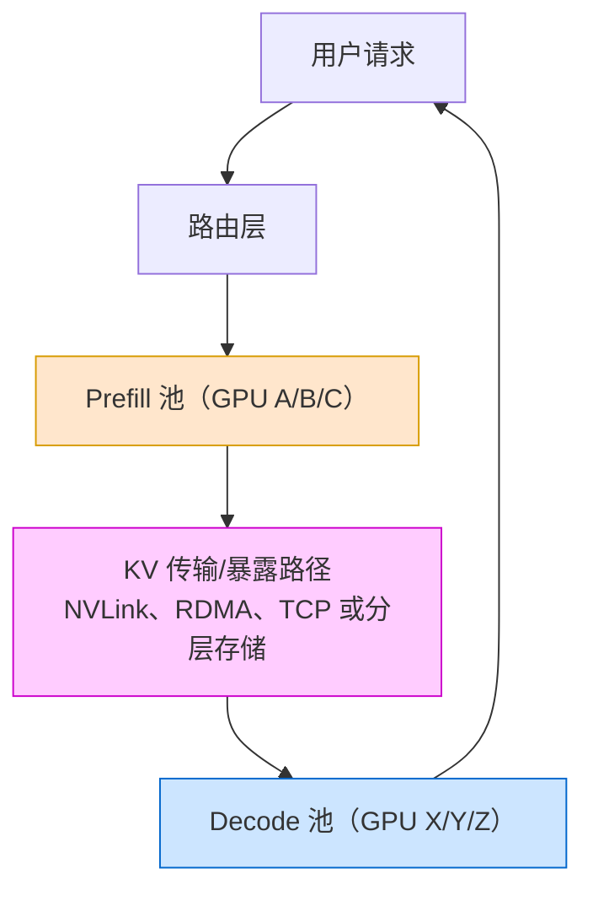

# 第 37 章 PD 分离推理架构与跨节点 KV 传输：DistServe、Mooncake、RDMA ⭐⭐⭐

> [!abstract] 本章导航
> **定位**：深入 Prefill/Decode 分离与 KV 池化，分析跨节点推理的数据路径。
>
> **先修**：[[19_分布式训练系统]]、[[25_推理引擎与高性能服务]]。
>
> **学习目标**：
> - 解释 PD 分离、KV 传输和资源池化的系统动机。
> - 建立计算、网络、排队与命中率的延迟模型。
> - 根据流量和基础设施判断分离部署是否值得。
>
> **建议路径**：PD 分离动机：Prefill vs Decode 差异 → DistServe：早期代表性 PD 分离系统（OSDI 2024） → Mooncake：KV Cache 池化与 RDMA 传输 → … → 与 Chunked Prefill 的协同。先完成主线，再按需要阅读进阶内容。
>
> **配套代码**：本章暂无独立代码目录，使用正文推导、自测题和决策表验收。

> [!info] 阅读提示
> 自回归推理通常可分为 Prefill（常偏计算密集）与 Decode（常偏显存带宽/访存密集）。
> PD 分离把两阶段部署到可独立配置的资源池。本章梳理 DistServe/Mooncake、跨节点 KV
> 传输、SGLang PD 实操，以及何时额外网络跳和双份权重并不划算。
>
> 🆕 **截至 2026-07-31**：Mooncake 已开源 Transfer Engine 与 Mooncake Store；SGLang 支持
> Mooncake、NIXL 等 PD 传输后端；NVIDIA Dynamo 也提供分离式服务方案。RDMA 是跨节点高性能路径之一，
> 但是否值得分离必须由具体模型、输入/输出分布、TTFT/TPOT SLO、网络拓扑和故障成本共同决定。

## 37.1 PD 分离动机：Prefill vs Decode 差异 ⭐⭐⭐⭐⭐

### 37.1.1 Prefill vs Decode 本质区别

| 维度 | Prefill | Decode |
|-----|---------|--------|
| 计算 | 计算密集（大批次 self-attention） | 访存密集（小批次 KV fetch） |
| 单请求每步 token 数 | 一次处理整段 prompt | 每个序列通常新增 1 token，可跨请求组成 batch |
| 时间分布 | 一次性（开始时） | 每 token（持续） |
| 资源需求 | 大 GPU 算力 | 大显存带宽 + 大显存（KV Cache） |
| 扩缩容 | 独立扩缩（Prefill 池） | 独立扩缩（Decode 池） |

### 37.1.2 PD 分离架构图



## 37.2 DistServe：早期代表性 PD 分离系统（OSDI 2024）⭐⭐⭐⭐

### 37.2.1 DistServe 核心思想

DistServe（OSDI 2024）：
1. 分离 Prefill 和 Decode 到不同 GPU 池
2. 分别围绕 TTFT 与 TPOT 优化资源数量和并行策略
3. 根据集群带宽做放置，降低阶段间 KV 传输成本
4. 用满足两类延迟约束的 **per-GPU goodput**，而非裸 token/s，衡量系统

### 37.2.2 DistServe 性能收益

论文在 OPT-13B/66B/175B、ShareGPT/HumanEval/LongBench 和其设定的 TTFT/TPOT 约束下报告：
- 在超过 90% 请求满足延迟约束时，最高可服务 **7.4×** 更多请求；
- 或在固定负载下承受最高 **12.6×** 更严格的 SLO。

这是论文特定基线、硬件、负载和 SLO 下的上界结果，不应写成任意部署都能获得的固定倍数，也不能直接
等同为成本降低比例。

原因：
- Prefill/Decode 可采用不同的资源数量和模型并行策略
- 消除长 prefill 对进行中 decode 的调度干扰
- 两个池可分别按 TTFT、TPOT 和到达率扩缩容

## 37.3 Mooncake：KV Cache 池化与 RDMA 传输 ⭐⭐⭐⭐

### 37.3.1 Mooncake 简介

Mooncake（Moonshot AI 发起并开源）包括：
- **Transfer Engine**：统一搬运 VRAM、DRAM、NVMe 中的数据，支持 TCP、InfiniBand/RoCE RDMA、
  GPUDirect、NVMe-oF、NVLink 等多种传输；
- **Mooncake Store**：基于 Transfer Engine 的分布式 KV Cache 存储，用于跨位置保存和复用 KV；
- 基于客户端的数据面可以是去中心化的，不能简单描述成一个“集中式 KV 池”。

### 37.3.2 RDMA 为何重要？

RDMA = Remote Direct Memory Access（远程直接内存访问）：
- 在注册内存和受支持网卡/协议下，让远端内存访问减少内核参与和中间拷贝
- 常可获得更低 CPU 开销、更高吞吐和更稳定的尾延迟
- 真实延迟取决于消息大小、NIC、交换网络、PCIe/NUMA、拥塞和软件栈；TCP 与 RDMA 都不存在跨环境通用的
  毫秒级保证

### 37.3.3 Mooncake 传输引擎

在直接 PD 传输中，decode 端通常先分配目标 KV 页并交换连接/地址元数据，prefill 端再把 KV 写入或发送到
decode 端；在分层缓存场景也可经 Mooncake Store 复用 DRAM/NVMe 中的 KV。具体流程取决于 SGLang、
vLLM 等上层引擎和所选后端。

```python
"""框架无关的接口示意；不是 Mooncake 的真实 Python API。"""
from typing import Protocol

class KVTransfer(Protocol):
    def register_target(self, request_id: str, layout: dict) -> str:
        """Decode 端分配 KV 页，返回不可伪造的传输句柄。"""
        ...

    def put(self, handle: str, kv_blocks, *, timeout_s: float) -> None:
        """Prefill 端按句柄传输；实现可选择 RDMA、TCP 或本机链路。"""
        ...

    def wait_ready(self, handle: str, *, timeout_s: float) -> None:
        """Decode 端等待完整性确认；超时必须清理预留页。"""
        ...
```

## 37.4 SGLang PD 模式：工程实操 ⭐⭐⭐⭐

### 37.4.1 SGLang PD 模式配置

SGLang 的 PD 角色由服务端命令行参数配置，不是 `sglang.Runtime(mode=...)`。下面命令来自官方文档的
单机双 GPU 结构；模型、网卡名、端口和版本必须按部署环境替换：

```bash
# Mooncake 路径：先在服务端环境安装当前文档要求的传输引擎
uv pip install mooncake-transfer-engine

# 终端 1：prefill-only；网卡名须替换为本机实际 IB/RoCE 设备
python -m sglang.launch_server \
  --model-path meta-llama/Llama-3.1-8B-Instruct \
  --disaggregation-mode prefill \
  --port 30000 \
  --disaggregation-ib-device mlx5_roce0

# 终端 2：decode-only
python -m sglang.launch_server \
  --model-path meta-llama/Llama-3.1-8B-Instruct \
  --disaggregation-mode decode \
  --port 30001 \
  --base-gpu-id 1 \
  --disaggregation-ib-device mlx5_roce0

# 终端 3：PD Router
python -m sglang_router.launch_router \
  --pd-disaggregation \
  --prefill http://127.0.0.1:30000 \
  --decode http://127.0.0.1:30001 \
  --host 0.0.0.0 --port 8000
```

跨节点 RDMA 还需在两端配置相容的 `--disaggregation-ib-device`、bootstrap 端口、驱动/容器权限和网络；
安装、参数名及支持矩阵随 SGLang release 变化，应锁定版本后再生成部署清单。

## 37.5 工程权衡：跨节点延迟 vs 池化收益 ⭐⭐⭐

### 37.5.1 何时该用 PD 分离？

| 场景 | 适用 PD 分离 | 原因 |
|-----|-------------|-----|
| 高并发多用户（在线聊天） | 候选，需同 trace A/B | Decode 可独立扩缩容，但多一条路由/传输链路 |
| 长 prompt、长输出或 P/D 压力明显不同 | ✅ 值得压测 | 可独立配置并行策略和实例数 |
| 低延迟单用户（代码补全） | ⚠️ 可选 | 跨节点延迟可能抵消收益 |
| 短 prompt、低并发或传输链路慢 | ⚠️ 通常先用聚合部署 | 额外网络跳与双份模型权重可能不划算 |

没有“少于 8 张 GPU 一定不分离”的通用阈值。应在相同 trace 下比较聚合与分离部署的 TTFT、TPOT、
goodput、GPU 小时/请求和失败率，并把 KV 字节数、实测带宽/尾延迟、模型副本显存和路由开销计入。

### 37.5.2 KV Cache 优化与池化权衡

KV 压缩：
- **KV 量化**：体积收益取决于原始 dtype、量化格式和 scale 元数据，必须验证精度与 kernel 支持
- **KV 稀疏**：drop 不重要的 KV
- **Prefix Caching**：共享相同前缀的 KV

池化收益 = 更好的利用率 - 网络传输开销

## 37.6 与 Chunked Prefill 的协同 ⭐⭐⭐

Chunked Prefill 把长 prompt 切成若干 chunk，以限制单次 prefill 对其他请求 decode 的阻塞。在支持增量 KV
传输的实现中，前面 chunk 的 KV 传输可与后续 chunk 的 prefill 重叠，从而隐藏一部分通信。

但同一请求的自回归生成依赖**完整 prompt** 的上下文：decode 不能只拿到 chunk 1 就开始生成最终答案。
是否改善端到端延迟取决于 chunk 大小、调度、传输重叠率和额外 kernel/通信开销，必须实测。

### 37.6.1 上线前的完整性门禁

- P/D 两端锁定相同模型 revision、tokenizer、dtype、attention/KV layout、block size 与并行映射；
- 对 bootstrap、目标页预留、传输完成、超时、取消、重试和孤儿 KV 页设计状态机；
- 做 admission control、背压、健康检查、优雅下线和聚合模式回退；
- 监控 TTFT、TPOT/ITL、goodput、传输字节/带宽/P95-P99、KV 命中、排队与传输失败；
- 验证 RDMA 设备、UCX/NIXL/Mooncake 日志、容器权限、网络隔离和跨租户数据清理。

## 🧭 本章小结

本章应形成以下可复述结论：

- 解释 PD 分离、KV 传输和资源池化的系统动机。
- 建立计算、网络、排队与命中率的延迟模型。
- 根据流量和基础设施判断分离部署是否值得。

## ✅ 自测与练习

先合上正文，再回答以下问题；无法说明证据或边界时，回到对应小节复习。

1. 你能否解释 PD 分离、KV 传输和资源池化的系统动机？
2. 你能否建立计算、网络、排队与命中率的延迟模型？
3. 你能否根据流量和基础设施判断分离部署是否值得？

## 🧪 配套代码与验收

本章暂无独立代码目录。验收时应完成正文中的推导或决策题，并能在自测中说明适用边界。

成功标准：概念、输入输出、关键指标和失败条件能够相互对应，不用未经验证的性能数字代替结论。

## 🎯 面试题精讲

### 真题 1：Prefill 与 Decode 有什么本质区别？为什么要分离？

**答**：

区别（详见本章表）：
- Prefill：计算密集、大批次、一次性
- Decode：访存密集、小批次、每 token

分离原因：
- 资源需求不同（Prefill 要算力、Decode 要显存带宽）
- Prefill/Decode 池可独立定容；能否使用不同型号或更小 GPU 取决于权重、KV 布局、互联与性能验证
- 更好的利用率（Prefill 打包更多请求）

---

### 真题 2：RDMA 是什么？为什么适合 KV 传输？TCP 相比有什么缺点？

**答**：

RDMA = Remote Direct Memory Access：
- 在注册内存和支持的 NIC/协议下减少内核参与与中间拷贝
- 通常降低 CPU 开销，并改善大块 KV 传输的带宽和尾延迟

适合 KV 传输：
- KV 体积可能很大，传输位于 TTFT→Decode 的关键路径
- 可结合 GPUDirect 减少 GPU 与远端之间的额外 staging

TCP 具有部署面广、调试简单等优势，也可能满足小规模场景；它和 RDMA 的差异必须用目标消息大小、并发和
网络拓扑实测，不能用固定毫秒数替代 benchmark。

---

### 真题 3：DistServe/Mooncake/SGLang PD 三者各是什么？关系是什么？

**答**：

- **DistServe**：OSDI 2024 的 goodput 优化分离式服务系统与放置算法
- **Mooncake**：KVCache-centric 的开源存储/传输项目，支持多类存储和传输协议
- **SGLang PD**：推理引擎的分离式 worker 与路由实现，可选 Mooncake/NIXL 后端

三者解决的问题相关，但不是“论文原型 → 组件 → 生产框架”的单线继承关系；应分别核对论文假设、
Mooncake 组件边界和 SGLang 当前版本的兼容矩阵。

---

### 真题 4：何时该用 PD 分离？何时不该用？

**答**：

该用：
- 长 prompt/长输出或 P/D 资源压力明显不对称
- 独立扩缩能改善目标 TTFT/TPOT，且 KV 链路足够快

不该用：
- 短上下文、低并发或聚合部署已经满足 SLO
- 网络/故障复杂度和双份模型权重成本超过收益

---

### 真题 5：PD 分离与 Chunked Prefill 如何协同？

**答**：

前面 chunk 的 KV 可以在后续 chunk 计算时增量传输；这可隐藏部分通信并限制长 prefill 的调度阻塞。
但 decode 必须等完整 prompt 处理完成后才能开始该请求的自回归生成。收益需按 chunk 大小和传输重叠率实测。

## 📋 本章速查表

| 知识点 | 核心概念 | 面试考察重点 |
|-------|---------|-------------|
| Prefill vs Decode | 计算密集 vs 访存密集 | 本质差异表 |
| PD 分离架构 | Prefill 池、Decode 池、KV 传输路径 | TTFT/TPOT 与 goodput |
| DistServe | OSDI 2024、特定实验最高 7.4× 请求率或 12.6× 更严 SLO | 基线与适用边界 |
| Mooncake | Transfer Engine、Mooncake Store、多种传输 | 不等于单一集中式 RDMA 池 |
| SGLang PD 模式 | worker CLI + PD Router | 版本、后端和部署门禁 |
| 工程权衡 | 何时用 PD 分离、传输 vs 池化 | 场景选择法则 |
| 与 Chunked Prefill 协同 | 流水线并行 | 延迟降低原理 |

## 🔗 相关章节

- [[25_推理引擎与高性能服务]]：vLLM/SGLang 基础、Continuous Batching
- [[16_模型微调与推理优化]]：KV Cache、量化、Speculative Decoding
- [[24_云原生部署与工程化]]：K8s GPU 调度、模型网关

## 📖 一手参考资料

### 截至 2026-07-31 的权威资料

- [DistServe（OSDI 2024 / arXiv）](https://arxiv.org/abs/2401.09670)
- [Mooncake 官方仓库](https://github.com/kvcache-ai/Mooncake)
- [Mooncake 架构文档](https://kvcache-ai.github.io/Mooncake/design/architecture.html)
- [SGLang：PD Disaggregation 官方文档](https://docs.sglang.io/docs/advanced_features/pd_disaggregation)
- [NVIDIA Dynamo：Disaggregated Serving](https://docs.nvidia.com/dynamo/latest/user-guides/disaggregated-serving)

### 一手参考资料

> 核验日期：2026-08-04。版本、价格、法规、模型能力和 benchmark 以链接页面当前状态为准。

- [[docs/AUTHORITATIVE_SOURCES|章节权威来源索引]]：按章节维护的官方文档、标准、原论文和官方仓库。
