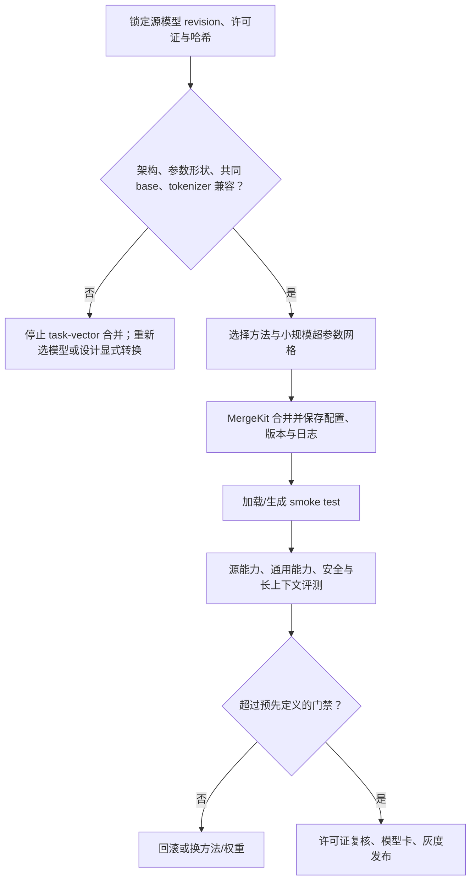

# 第 38 章 模型合并 MergeKit：SLERP、TIES、DARE 算法 ⭐⭐

> [!abstract] 本章导航
> **定位**：建立无需完整再训练的权重组合方法，并强调评测与许可边界。
>
> **先修**：[[16_模型微调与推理优化]]、[[17_大模型评估体系]]。
>
> **学习目标**：
> - 解释 Linear、SLERP、Task Arithmetic、TIES 和 DARE。
> - 设计可复现的 MergeKit 合并与回滚计划。
> - 评估能力干扰、安全、许可和部署收益。
>
> **建议路径**：模型合并动机：权重空间组合 → 基础算法：Linear Merge 与 SLERP → 高级算法：Task Arithmetic、TIES、DARE → … → 合并评测与最佳实践。先完成主线，再按需要阅读进阶内容。
>
> **配套代码**：本章暂无独立代码目录，使用正文推导、自测题和决策表验收。

> [!info] 阅读提示
> 模型合并（Model Merging）通常不做梯度训练，而是在权重空间组合兼容 checkpoint。它可能转移或组合能力，
> 也可能造成干扰、遗忘或安全退化，不能从“数学模型 + 代码模型”直接推出“两者兼顾”。本章梳理
> MergeKit、SLERP/TIES/DARE/Task Arithmetic，以及上线前的兼容、评测与许可门禁。
>
> 🆕 **截至 2026-07-31**：PyPI 上 MergeKit 最新正式包为 **0.1.4（2025-10-31）**，并没有可核验的
> “v1.0 已发布”；GitHub `main` 可能领先于 PyPI。算法没有跨模型、跨任务的统一首选，必须锁定
> package/commit，并用同一评测协议选择方法和超参数。

## 38.1 模型合并动机：权重空间组合 ⭐⭐⭐

### 38.1.1 为什么要合并？

| 方案 | 优点 | 缺点 |
|-----|------|-----|
| 继续预训练 | 效果好 | 成本高、有灾难性遗忘 |
| LoRA 融合 | 成本低 | 仅 LoRA 权重、非完整模型 |
| **模型合并** | 合并本身通常无需梯度训练；单模型推理成本可不变 | 仍有下载、合并、存储、调参与全量评测成本；效果无保证 |

### 38.1.2 合并场景示例

- **同一 base 的任务微调**：尝试合并数学与代码 fine-tune，并验证两类任务及通用能力
- **相邻训练阶段 checkpoint**：用线性插值探索性能/行为折中
- **多个兼容稠密模型作为专家**：用 `mergekit-moe` 构建 MoE 起点，再验证或继续训练

### 38.1.3 可复现合并流程



## 38.2 基础算法：Linear Merge 与 SLERP ⭐⭐⭐⭐

### 38.2.1 Linear Merge（线性合并）

最简单的合并：权重加权平均

$$\theta_{\text{merged}} = (1-\lambda)\theta_1 + \lambda\theta_2$$

其中 $\lambda$ 为权重（0~1）。

```python
"""Linear Merge 实现"""
import torch

def linear_merge(theta1: torch.Tensor, theta2: torch.Tensor, lam: float = 0.5):
    if theta1.shape != theta2.shape or not 0.0 <= lam <= 1.0:
        raise ValueError("shape mismatch or invalid interpolation weight")
    return (1 - lam) * theta1 + lam * theta2
```

优点是实现简单；缺点是可能产生能力干扰或把任务特征平均掉。

### 38.2.2 SLERP（球面线性插值）

权重在超球面上插值（不是欧氏空间），保留方向信息。

SLERP 公式：
$$
\theta_{\text{merged}} = \frac{\sin((1-\lambda)\Omega)}{\sin\Omega} \theta_1 + \frac{\sin(\lambda\Omega)}{\sin\Omega} \theta_2
$$

其中 $\Omega$ 是 $\theta_1$ 与 $\theta_2$ 的夹角：$\cos\Omega = \frac{\theta_1 \cdot \theta_2}{|\theta_1||\theta_2|}$。

```python
"""SLERP 实现"""
import torch

def slerp(theta1: torch.Tensor, theta2: torch.Tensor, lam: float = 0.5, dot_threshold: float = 0.9995):
    if theta1.shape != theta2.shape or not 0.0 <= lam <= 1.0:
        raise ValueError("shape mismatch or invalid interpolation weight")
    norm_product = torch.norm(theta1) * torch.norm(theta2)
    if norm_product.item() == 0:
        raise ValueError("SLERP is undefined for a zero vector")
    dot = torch.clamp(torch.sum(theta1 * theta2) / norm_product, -1.0, 1.0)
    if dot.item() < -dot_threshold:
        raise ValueError("antipodal vectors do not define a unique SLERP path")
    if dot.item() > dot_threshold:
        # 几乎同方向，退化为 linear
        return (1 - lam) * theta1 + lam * theta2
    omega = torch.acos(dot)
    sin_omega = torch.sin(omega)
    a = torch.sin((1 - lam) * omega) / sin_omega
    b = torch.sin(lam * omega) / sin_omega
    return a * theta1 + b * theta2
```

SLERP 也不天然“更好”，且不同实现可能按 tensor、层或全模型计算方向；近反向向量的路径并不唯一。
必须与 linear 在同一评测集上比较。

## 38.3 高级算法：Task Arithmetic、TIES、DARE ⭐⭐⭐⭐

### 38.3.1 Task Arithmetic（任务算术）

核心思想：$\theta_{\text{merged}} = \theta_{\text{base}} + (\theta_{\text{task1}} - \theta_{\text{base}}) + (\theta_{\text{task2}} - \theta_{\text{base}})$

即：将「任务向量」（任务微调减 base）加到 base 上。

```python
"""Task Arithmetic 实现"""
def task_arithmetic(theta_base: torch.Tensor, thetas_task: list[torch.Tensor], alphas: list[float] = None):
    alphas = alphas or [1.0]*len(thetas_task)
    if len(alphas) != len(thetas_task):
        raise ValueError("one alpha is required per task checkpoint")
    delta_sum = torch.zeros_like(theta_base)
    for theta_t, alpha in zip(thetas_task, alphas):
        delta = theta_t - theta_base
        delta_sum += alpha * delta
    return theta_base + delta_sum
```

### 38.3.2 TIES（修剪-符号-合并）

TIES 论文中的全称是 **TRIM, ELECT SIGN & MERGE**，用于缓解小幅冗余更新和符号冲突：
1. **Trim**：修剪小的 delta（仅保留重要的）
2. **Elect Sign**：为每个参数位置选出聚合符号
3. **Merge**：只聚合与选定符号一致的非零更新

TIES 在论文的多种模型/任务上优于若干基线，但不存在可迁移到任意 LLM 的固定“提升 5%~10%”。

### 38.3.3 DARE（Drop And REscale）

DARE = Drop And REscale（丢弃-重缩放）：
1. **Drop**：以丢弃率 $\rho$ 随机置零 delta 参数
2. **REscale**：把保留项除以 $1-\rho$，使随机估计的期望保持不变

DARE 论文观察到同源 SFT 模型的 delta 存在较强冗余，并用随机丢弃缓解多模型参数干扰；
“冗余”不等于所有被丢弃项都是噪声，丢弃率也必须调参。

```python
"""DARE 实现（简化）"""
import torch

def dare(theta_base: torch.Tensor, theta_task: torch.Tensor, drop_rate: float = 0.9, seed: int = 42):
    if theta_base.shape != theta_task.shape or not 0.0 <= drop_rate < 1.0:
        raise ValueError("shape mismatch or invalid drop rate")
    delta = theta_task - theta_base
    generator = torch.Generator(device=delta.device).manual_seed(seed)
    keep = torch.rand(delta.shape, device=delta.device, generator=generator) >= drop_rate
    delta_sparse = delta * keep
    delta_rescaled = delta_sparse / (1 - drop_rate)
    return theta_base + delta_rescaled
```

### 38.3.4 DARE-TIES：一种组合方法

DARE-TIES 将随机 pruning/rescale 与 TIES 的符号共识结合：
1. DARE 稀疏化
2. TIES 修剪-符号-合并

## 38.4 MergeKit 工具链完整使用 ⭐⭐⭐⭐

### 38.4.1 MergeKit 配置 YAML

MergeKit 用 YAML 配置合并：

```yaml
# merge_config.yaml
# 下面三个 ID 是占位符；必须替换为“同一个已核验 base”及其兼容 fine-tune。
models:
  - model: org/math-finetune
    parameters:
      weight: 0.5
      density: 0.1
  - model: org/code-finetune
    parameters:
      weight: 0.5
      density: 0.1
merge_method: dare_ties
base_model: org/common-base
parameters:
  normalize: true
  int8_mask: true
dtype: bfloat16
tokenizer:
  source: base
chat_template: auto
```

`density` 在 MergeKit 中是**保留密度**，而前文公式中的 $\rho$ 是**丢弃率**，两者满足
`density = 1 - ρ`。配置层级有优先级；不同模型需要不同权重/密度时，应放在相应
`models[*].parameters` 下。

### 38.4.2 完整命令行

```bash
# 安装
python -m pip install "mergekit==0.1.4"

# 合并
mergekit-yaml merge_config.yaml ./output-model

# 确认当前安装所支持的参数；GitHub main 与 PyPI 包可能不同
mergekit-yaml --help

# 从“完整 fine-tune 与 base 的差值”近似提取 PEFT LoRA；这不是合并多个 LoRA
mergekit-extract-lora \
  --model org/finetuned-model \
  --base-model org/common-base \
  --out-path ./extracted-lora
```

MergeKit 没有官方 `mergekit-lora` 命令。要把一个或多个 LoRA adapter 合入 base，应使用与这些 adapter
兼容的 PEFT 流程，明确顺序/权重后调用其 merge API，再保存完整模型；仍需重新评测。

## 38.5 MoE 合并：新热点 ⭐⭐⭐

### 38.5.1 合并多个模型为 MoE

MergeKit 提供 `mergekit-moe`，可把多个**兼容的稠密模型**组装为 MoE，作为直接试验或继续训练的起点。

示例：
1. 模型 A：数学好 → 专家 1
2. 模型 B：代码好 → 专家 2
3. 合并为：MoE（专家 1 + 专家 2）
4. 配置兼容的路由/架构；是否继续训练取决于输出架构和目标质量

它避免直接平均每个专家的全部权重，但不能保证“完全保留各自能力”：共享层、tokenizer、路由选择、
专家负载和推理引擎支持都会影响结果。运行 `mergekit-moe --help` 并按所锁定版本的官方配置执行，
不要把普通 `mergekit-yaml` 的参数套到 MoE 命令。

## 38.6 合并评测与最佳实践 ⭐⭐⭐

### 38.6.1 评测基准

合并后需要测：
- 源能力：每个源模型的目标任务，报告相对源模型和共同 base 的变化
- 通用能力：与部署语言、上下文长度、工具调用格式相匹配的任务
- 生成质量：固定 tokenizer/chat template/generation config，多随机种子
- 安全与稳健性：越狱、隐私、偏见、拒答过度、结构化输出和长上下文回归
- 工程指标：可加载性、NaN/Inf、显存、吞吐、延迟及目标推理引擎兼容性

### 38.6.2 常见问题与解决

| 问题 | 原因 | 解决 |
|-----|-----|-----|
| 能力平均化 | 权重空间干扰或超参数不合适 | 对比 TIES/DARE/Task Arithmetic，并以验证集选参 |
| 负迁移 | 任务更新冲突或源模型并不同源 | 降权、换源模型或停止合并；MoE 也需评测 |
| 数值/加载异常 | shape、dtype、量化或参数语义不兼容 | 在浮点 checkpoint 上合并，逐 tensor 校验 NaN/Inf 与 shape |
| 输出格式错乱 | tokenizer/special tokens/chat template 不一致 | 显式配置并做 encode/decode 与模板回归 |

### 38.6.3 合并前的硬门禁

1. 对 task-vector/TIES/DARE：确认 fine-tune 的**真实共同 base revision**，不能只看模型名中都有
   “Qwen/Llama”；
2. 比对架构类、层数、hidden size、QKV/MLP shape、参数名语义、RoPE 与 tied embeddings；
3. 记录 tokenizer 文件哈希、special token ID、chat template 和 generation config；
4. 优先使用未量化浮点权重；量化 checkpoint 需有明确反量化和误差方案；
5. 审核每个源模型的许可证、acceptable-use 条款、归属、再分发和衍生模型限制；
6. 保存源 revision/hash、MergeKit 版本/commit、YAML、随机种子、日志和评测结果，失败可回滚。

## 🧭 本章小结

本章应形成以下可复述结论：

- 解释 Linear、SLERP、Task Arithmetic、TIES 和 DARE。
- 设计可复现的 MergeKit 合并与回滚计划。
- 评估能力干扰、安全、许可和部署收益。

## ✅ 自测与练习

先合上正文，再回答以下问题；无法说明证据或边界时，回到对应小节复习。

1. 你能否解释 Linear、SLERP、Task Arithmetic、TIES 和 DARE？
2. 你能否设计可复现的 MergeKit 合并与回滚计划？
3. 你能否评估能力干扰、安全、许可和部署收益？

## 🧪 配套代码与验收

本章暂无独立代码目录。验收时应完成正文中的推导或决策题，并能在自测中说明适用边界。

成功标准：概念、输入输出、关键指标和失败条件能够相互对应，不用未经验证的性能数字代替结论。

## 🎯 面试题精讲

### 真题 1：Linear Merge 与 SLERP 有什么区别？SLERP 是否一定更好？

**答**：

Linear Merge：欧氏空间加权平均，可能把方向「平均掉」。

SLERP：超球面上插值，保留方向信息，公式见本章。

SLERP 沿球面路径插值，适合探索两个兼容 checkpoint 之间的几何折中；近同向时通常退化为 linear。
它不保证保留语义或优于 linear，反向/零向量和实现粒度还需数值处理，结论只能来自评测。

---

### 真题 2：Task Arithmetic 是什么？为什么可以合并多个任务？

**答**：

Task Arithmetic = base + 各任务向量之和（任务向量 = 任务微调减 base）。

直觉：
- $\theta_{\text{base}}$ = 通用能力
- $\theta_t - \theta_{\text{base}}$ = 任务 t 的「专属能力向量」
- 相加融合多个专属能力

---

### 真题 3：DARE 的「Drop-And-REscale」有什么直觉与适用边界？

**答**：

直觉：
- 同源 SFT delta 中存在较多冗余
- 随机丢弃一部分 delta，并将保留项除以 $1-\rho$ 以保持期望
- 多模型合并时可能减少参数干扰

它不是按重要性“只保留信号”，也没有固定提升；应在多个随机种子和任务集上比较方差、源能力与安全退化。

---

### 真题 4：你会用 MergeKit 合并哪两个模型？写配置 YAML

**答**：

先选出共享同一 base revision 的两个 fine-tune，再用本章占位 YAML 替换为真实 ID。不能仅凭
“DeepSeek-R1-Distill-Qwen”名称假设它与某个 Qwen Instruct checkpoint 具有可用于 task arithmetic 的
共同 base，也不能预先承诺聊天与推理能力都会保留。

---

### 真题 5：合并有什么常见问题？如何解决？

**答**：

常见问题：
1. **源模型不兼容**：核验共同 base、参数语义与 tokenizer，不兼容则停止；
2. **能力/安全负迁移**：以 source/base 为对照做多维评测，失败就回滚或换方法；
3. **数值与加载异常**：使用浮点权重、逐 tensor 检查 shape/NaN/Inf，验证目标引擎；
4. **许可问题**：逐一检查源许可证和衍生/再分发条款，不能只看 MergeKit 自身许可证。

## 📋 本章速查表

| 知识点 | 核心概念/公式 | 面试考察重点 |
|-------|-------------|-------------|
| Linear Merge | $\theta_{\text{merged}} = (1-\lambda)\theta_1 + \lambda\theta_2$ | 简单但可能产生干扰 |
| SLERP | 球面插值公式 | 数值边界与“不保证更好” |
| Task Arithmetic | $\theta_{\text{base}} + \sum \alpha_i (\theta_i - \theta_{\text{base}})$ | 任务向量直觉 |
| TIES | Trim, Elect Sign & Merge | 三步流程 |
| DARE | Drop-And-REscale（$\rho$ 为丢弃率） | 冗余、期望保持与调参 |
| DARE-TIES | DARE + TIES | 与其他方法同协议比较 |
| MergeKit 工具 | YAML 配置、命令行使用 | 完整代码示例 |
| MoE 合并 | 将兼容稠密模型组装为专家 | 路由、共享层与推理引擎兼容 |

## 🔗 相关章节

- [[16_模型微调与推理优化]]：LoRA 合并与模型合并的关系
- [[32_DeepSeek风格MoE与MLA深度解析]]：MoE 合并与 DeepSeek MoE 的关系
- [[17_大模型评估体系]]：合并后的评测方法

## 📖 一手参考资料

### 截至 2026-07-31 的权威资料

- [MergeKit 官方仓库与命令说明](https://github.com/arcee-ai/mergekit)
- [MergeKit PyPI 发布记录（0.1.4）](https://pypi.org/project/mergekit/)
- [Arcee's MergeKit（EMNLP Industry 2024）](https://aclanthology.org/2024.emnlp-industry.36/)
- [Editing Models with Task Arithmetic（ICLR 2023）](https://openreview.net/forum?id=6t0Kwf8-jrj)
- [TIES-Merging（NeurIPS 2023）](https://arxiv.org/abs/2306.01708)
- [Language Models are Super Mario / DARE（ICML 2024）](https://proceedings.mlr.press/v235/yu24p.html)

### 一手参考资料

> 核验日期：2026-08-04。版本、价格、法规、模型能力和 benchmark 以链接页面当前状态为准。

- [[docs/AUTHORITATIVE_SOURCES|章节权威来源索引]]：按章节维护的官方文档、标准、原论文和官方仓库。
