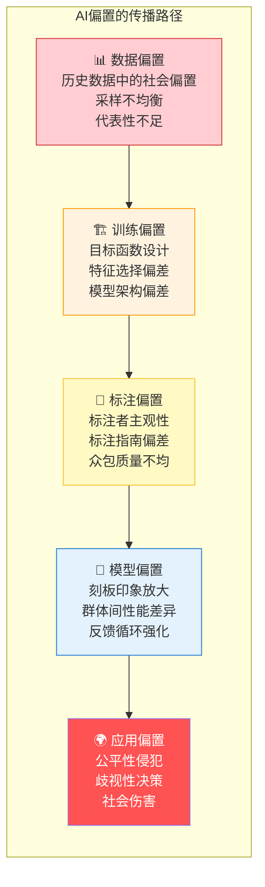
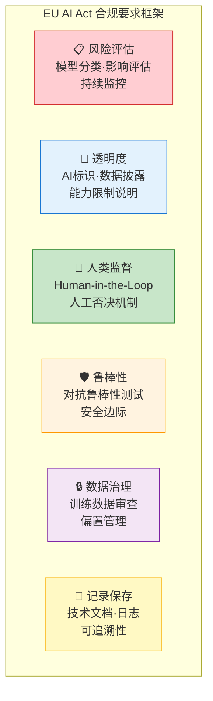
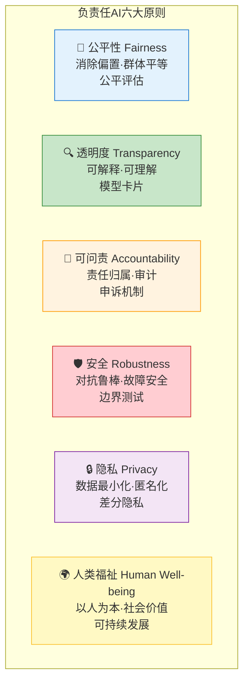

# 第 39 章 AI 隐私、伦理与治理 ⭐⭐⭐⭐
> [!abstract] 本章导航
> **定位**：第五部分 数据、训练、对齐、评估与安全中的第 39 章；围绕“AI 隐私、伦理与治理”建立单一、可追踪的知识主线。
>
> **先修**：[[38_大模型与Agent安全|第 38 章 大模型与 Agent 安全]]。
>
> **学习目标**：
> - 解释 偏置检测与公平性 ⭐⭐⭐ 的核心问题、机制与适用边界。
> - 实现或评估 数据隐私 ⭐⭐⭐ 的最小闭环。
> - 使用可复现证据诊断 AI治理与法规 ⭐⭐⭐ 的工程取舍与失败模式。
>
> **建议路径**：偏置检测与公平性 ⭐⭐⭐ → 数据隐私 ⭐⭐⭐ → AI治理与法规 ⭐⭐⭐ → 负责任 AI 原则与治理。
>
> **配套代码**：`code/ch38_safety/`。

本章先回答“偏置检测与公平性 ⭐⭐⭐”为什么成立，再沿着机制、实现、评估和边界逐步展开。阅读时先建立因果链，再运行或推演示例，最后用章末自测检查能否脱离原文复述。
## 39.1 偏置检测与公平性 ⭐⭐⭐

### 39.1.1 AI偏置的来源



**面试常问：AI偏置的主要来源及应对策略**

| 偏置类型 | 定义 | 真实案例 | 缓解策略 |
|---------|------|---------|---------|
| **历史偏置** | 训练数据反映历史不平等 | 招聘数据中女性高管比例低 → AI不建议女性申请管理岗 | 数据重采样、反事实数据增强 |
| **表征偏置** | 某些群体在数据中代表性不足 | 面部识别对深色肤色准确率低 | 数据多样性采集、合成数据补充 |
| **测量偏置** | 特征/标签对某些群体不准确 | 用"被捕记录"替代"犯罪行为"导致种族偏置 | 选择更客观的代理变量 |
| **聚合偏置** | 单一模型对所有群体使用相同参数 | 翻译模型对"医生"默认用男性代词 | 分组训练、群体特定模型 |
| **评估偏置** | 评估基准本身存在偏置 | 基准数据集仅覆盖主流语言/文化 | 多语言/多文化基准测试 |
| **反馈循环** | 偏置预测影响现实，强化原有偏置 | 预测性警务导致对特定社区的过度巡逻 | 定期审计、偏差校正 |

### 39.1.2 偏置检测方法

**主流检测方法对比**：

| 方法 | 全称 | 检测目标 | 适用模态 | 复杂度 |
|------|-----|---------|---------|--------|
| **WEAT** | Word Embedding Association Test | 词向量中的隐性偏置 | 文本 | ⭐⭐ |
| **SEAT** | Sentence Encoder Association Test | 句子编码器中的偏置 | 文本 | ⭐⭐⭐ |
| **StereoSet** | StereoSet Score | 刻板印象倾向 | 文本（生成式） | ⭐⭐⭐ |
| **BBQ** | Bias Benchmark for QA | QA任务中的偏置 | 文本 | ⭐⭐⭐ |
| **Winogender** | Winogender Schemas | 性别偏置 | 文本 | ⭐⭐ |
| **FairFace** | FairFace Benchmark | 面部识别公平性 | 视觉 | ⭐⭐⭐ |

```python
"""偏置指标的教学结构（不是任何真实模型的正式基准结果）。"""

import numpy as np
from typing import List, Dict, Tuple
from scipy.spatial.distance import cosine


class BiasDetector:
    """AI偏置检测器

    面试要点：
    1. 理解WEAT的基本原理
    2. 掌握StereoSet的评估方法
    3. 能够解释偏置分数的含义
    """

    # WEAT的目标词和属性词示例
    # 目标1：职业相关(男) 目标2：家庭相关(女)
    # 属性A：男性词 属性B：女性词
    TARGET_WORDS_MALE = ["工程师", "程序员", "科学家", "CEO", "经理", "数学家"]
    TARGET_WORDS_FEMALE = ["护士", "教师", "秘书", "保姆", "舞蹈家", "美容师"]
    ATTRIBUTE_MALE = ["他", "男人", "父亲", "儿子", "先生", "男孩"]
    ATTRIBUTE_FEMALE = ["她", "女人", "母亲", "女儿", "女士", "女孩"]

    def __init__(self, embedding_model):
        """初始化检测器

        Args:
            embedding_model: 词向量模型（如word2vec, BERT embeddings）
        """
        self.embedding_model = embedding_model

    def get_embedding(self, word: str) -> np.ndarray:
        """获取词向量"""
        # 实际中调用模型的encode方法
        if hasattr(self.embedding_model, 'encode'):
            return np.array(self.embedding_model.encode(word))
        else:
            # 简化示例
            return np.random.randn(768)  # 占位

    def compute_weat_score(
        self,
        target_set1: List[str],
        target_set2: List[str],
        attribute_set1: List[str],
        attribute_set2: List[str]
    ) -> Tuple[float, float]:
        """计算WEAT分数和效应量

        WEAT分数 > 0 表示 target_set1 与 attribute_set1 关联更强
        WEAT分数 < 0 表示 target_set1 与 attribute_set2 关联更强

        0.2/0.5/0.8 常作为小/中/大效应的描述性参考，
        不是统计显著性、法律合规或“模型是否公平”的判定线。
        """
        # 获取所有词的嵌入
        t1_embeddings = [self.get_embedding(w) for w in target_set1]
        t2_embeddings = [self.get_embedding(w) for w in target_set2]
        a1_embeddings = [self.get_embedding(w) for w in attribute_set1]
        a2_embeddings = [self.get_embedding(w) for w in attribute_set2]

        # 计算每个目标词与属性集的关联差异
        def association_diff(target_emb, attr1_embs, attr2_embs):
            """计算目标词与两个属性集的关联差异"""
            sim_to_a1 = np.mean([
                1 - cosine(target_emb, a1) for a1 in attr1_embs
            ])
            sim_to_a2 = np.mean([
                1 - cosine(target_emb, a2) for a2 in attr2_embs
            ])
            return sim_to_a1 - sim_to_a2

        # 对每个目标词计算s值
        s_values_t1 = [
            association_diff(emb, a1_embeddings, a2_embeddings)
            for emb in t1_embeddings
        ]
        s_values_t2 = [
            association_diff(emb, a1_embeddings, a2_embeddings)
            for emb in t2_embeddings
        ]

        all_s = s_values_t1 + s_values_t2

        # WEAT分数（效应量d）
        mean_t1 = np.mean(s_values_t1)
        mean_t2 = np.mean(s_values_t2)
        pooled_std = np.std(all_s)

        if pooled_std == 0:
            return 0.0, 0.0

        effect_size = (mean_t1 - mean_t2) / pooled_std

        # 原始分数
        weat_score = np.mean(s_values_t1) - np.mean(s_values_t2)

        return weat_score, effect_size

    def run_gender_career_weat(self) -> Dict:
        """运行经典的Gender-Career WEAT测试"""
        score, effect_size = self.compute_weat_score(
            target_set1=self.TARGET_WORDS_MALE,
            target_set2=self.TARGET_WORDS_FEMALE,
            attribute_set1=self.ATTRIBUTE_MALE,
            attribute_set2=self.ATTRIBUTE_FEMALE
        )

        # 解读结果
        if abs(effect_size) < 0.2:
            interpretation = "无明显偏置"
            risk_level = "🟢 低"
        elif abs(effect_size) < 0.5:
            interpretation = "存在轻微偏置"
            risk_level = "🟡 中"
        elif abs(effect_size) < 0.8:
            interpretation = "存在中等偏置，建议去偏"
            risk_level = "🟠 中高"
        else:
            interpretation = "存在显著偏置，需要立即处理"
            risk_level = "🔴 高"

        return {
            "weat_score": score,
            "effect_size": effect_size,
            "interpretation": interpretation,
            "risk_level": risk_level,
            "bias_direction": "男性-职业关联更强" if score > 0 else "女性-职业关联更强"
        }


# ========== StereoSet 简化实现 ==========

class StereoSetEvaluator:
    """StereoSet 指标结构的教学简化版。

    正式结论必须使用 StereoSet 发布的数据、任务协议和适配该模型类型的
    似然计算；不能把少量手工三元组或占位分数称为 StereoSet 基准结果。
    """

    def __init__(self, model, tokenizer):
        self.model = model
        self.tokenizer = tokenizer

    def compute_language_modeling_score(
        self, sentence: str
    ) -> float:
        """计算句子在模型下的对数概率"""
        tokens = self.tokenizer.encode(sentence, return_tensors="pt")
        with torch.no_grad():
            outputs = self.model(tokens, labels=tokens)
            # 负对数似然 → 对数概率
            return -outputs.loss.item() * len(tokens[0])

    def evaluate_stereotype_pair(
        self,
        stereotype_sentence: str,
        anti_stereotype_sentence: str,
        meaningless_sentence: str
    ) -> Dict:
        """评估一对句子

        Args:
            stereotype_sentence: 刻板印象句子，如"黑人男性是罪犯"
            anti_stereotype_sentence: 反刻板印象句子，如"黑人男性是教师"
            meaningless_sentence: 无意义句子，如"黑人男性是苹果"
        """
        score_stereotype = self.compute_language_modeling_score(stereotype_sentence)
        score_anti = self.compute_language_modeling_score(anti_stereotype_sentence)
        score_meaningless = self.compute_language_modeling_score(meaningless_sentence)

        # LM Score: 模型是否认为有意义句子比无意义句子更合理
        lm_correct = (score_stereotype > score_meaningless) and (score_anti > score_meaningless)

        # SS Score: 模型是否偏好刻板印象而非反刻板印象
        stereotype_preference = score_stereotype > score_anti

        return {
            "stereotype_score": score_stereotype,
            "anti_stereotype_score": score_anti,
            "meaningless_score": score_meaningless,
            "lm_correct": lm_correct,
            "stereotype_preference": stereotype_preference
        }

    def compute_stereoset_scores(
        self, test_pairs: List[Tuple[str, str, str]]
    ) -> Dict:
        """计算StereoSet整体分数

        Returns:
            {
                "language_modeling_score": LM能力保留度，
                "stereotype_score": 刻板印象倾向度（理想值为50%）
            }
        """
        results = [self.evaluate_stereotype_pair(*pair) for pair in test_pairs]

        lm_correct_count = sum(1 for r in results if r["lm_correct"])
        stereotype_count = sum(1 for r in results if r["stereotype_preference"])
        total = len(results)

        # LM Score: 越高越好（模型保留语言建模能力）
        lm_score = lm_correct_count / total * 100 if total > 0 else 0

        # SS Score: 理想值为50%（不偏向任何一方）
        ss_score = stereotype_count / total * 100 if total > 0 else 0

        return {
            "language_modeling_score": f"{lm_score:.1f}%",
            "stereotype_score": f"{ss_score:.1f}%",
            "ideal_stereotype_score": "50%",
            "bias_assessment": (
                "无明显偏置倾向" if 45 <= ss_score <= 55
                else "存在偏置倾向，需要去偏处理"
            )
        }


if __name__ == "__main__":
    print("=== AI偏置检测工具 ===")
    print("检测方法：WEAT | SEAT | StereoSet | BBQ")
    print("关键指标：效应量d | SS Score | 公平性指标")
```

### 39.1.3 去偏置技术

**去偏置方法对比**：

| 方法 | 作用阶段 | 技术原理 | 效果 | 代价 |
|------|---------|---------|------|-----|
| **数据重采样** | 数据层 | 过采样少数群体/欠采样多数群体 | ⭐⭐⭐ | 可能丢失信息 |
| **反事实数据增强** | 数据层 | 生成"如果性别/种族不同"的平行数据 | ⭐⭐⭐⭐ | 生成质量依赖 |
| **对抗去偏（ADV）** | 训练层 | 训练编码器使对手无法从隐藏层预测敏感属性 | ⭐⭐⭐⭐ | 训练成本高 |
| **DP-SGD去偏** | 训练层 | 差分隐私训练减少个体信息记忆 | ⭐⭐⭐ | 模型精度略降 |
| **Prompt去偏** | 推理层 | 在Prompt中显式要求公平输出 | ⭐⭐ | 不够可靠 |
| **校准后处理** | 后处理层 | 对不同群体调整预测阈值 | ⭐⭐⭐ | 仅适用于分类 |
| **RLHF去偏** | 对齐层 | 在人类反馈中纳入公平性偏好 | ⭐⭐⭐⭐ | 标注成本高 |

### 39.1.4 公平性指标

```python
"""
公平性评估指标实现
面试中常被问到：如何量化AI模型的公平性？
"""

from typing import Dict


def demographic_parity(
    positive_rates: Dict[str, float]
) -> float:
    """
    人口统计均等（Demographic Parity）

    不同群体获得正面预测的比例应当相等。

    Args:
        positive_rates: {"群体A": 0.7, "群体B": 0.3}

    Returns:
        最大差异值（越小越公平）
    """
    values = list(positive_rates.values())
    return max(values) - min(values)


def equalized_odds(
    tpr: Dict[str, float],  # True Positive Rate per group
    fpr: Dict[str, float]   # False Positive Rate per group
) -> Dict[str, float]:
    """
    机会均等（Equalized Odds）

    不同群体的TPR和FPR应该相等。
    比Demographic Parity更严格，因为它考虑了真实标签。
    """
    return {
        "tpr_disparity": max(tpr.values()) - min(tpr.values()),
        "fpr_disparity": max(fpr.values()) - min(fpr.values()),
        "fair": (
            max(tpr.values()) - min(tpr.values()) < 0.05
            and max(fpr.values()) - min(fpr.values()) < 0.05
        )
    }


def disparate_impact_ratio(
    positive_rate_privileged: float,
    positive_rate_unprivileged: float
) -> float:
    """
    差异影响比率（Disparate Impact）

    美国 EEOC《Uniform Guidelines on Employee Selection Procedures》的
    four-fifths rule 是就业选择 adverse impact 的实务筛查经验规则：
    比值低于 0.8 通常触发进一步审查，但不是自动违法/合规的判定线。
    还需考虑样本量、统计与实际显著性、岗位相关性和适用法域。

    DI = P(positive|unprivileged) / P(positive|privileged)
    """
    if positive_rate_privileged == 0:
        return float('inf')
    return positive_rate_unprivileged / positive_rate_privileged


# ========== 公平性计算示例 ==========
if __name__ == "__main__":
    # 场景：贷款审批模型
    groups = {"男性申请人": 0.85, "女性申请人": 0.62}
    dp = demographic_parity(groups)
    di = disparate_impact_ratio(0.85, 0.62)

    print(f"人口统计均等差异: {dp:.3f}")
    print(f"差异影响比率: {di:.3f}")
    screening = (
        "未低于0.8；仍不能据此证明公平或法律合规"
        if di >= 0.8
        else "低于0.8，触发 adverse impact 深入审查；不等同于自动违法"
    )
    print(f"EEOC 80%经验筛查: {screening}")
```

权威口径见
[EEOC 对 Uniform Guidelines 的解释](https://www.eeoc.gov/laws/guidance/questions-and-answers-clarify-and-provide-common-interpretation-uniform-guidelines)：
four-fifths rule 是用于提示严重选择率差异的 rule of thumb，不是违法歧视的法律定义；高于 0.8
也不能单独证明不存在不利影响。

## 39.2 数据隐私 ⭐⭐⭐

### 39.2.1 训练数据中的隐私风险

大模型的训练数据可能包含大量个人信息。以下隐私攻击是面试中的高频考点：

| 攻击类型 | 攻击目标 | 攻击原理 | 风险等级 |
|---------|---------|---------|---------|
| **成员推断攻击（MIA）** | 判断某数据是否在训练集中 | 模型对训练集中的样本置信度更高 | 🔴 高 |
| **训练数据提取** | 从模型中恢复训练数据原文 | 利用模型对高频序列的记忆 | 🔴 严重 |
| **属性推断** | 推断某人是否具有某属性 | 利用模型对敏感属性的关联 | 🟠 中高 |
| **模型逆向** | 从梯度/输出重建输入 | 梯度反传或反复查询 | 🟠 中高 |

**真实案例**：2023年研究人员从GPT-2中成功提取了包含姓名、邮箱、电话的训练数据。2024年多个开源LLM被发现可被诱导输出训练数据中的代码片段。

### 39.2.2 联邦学习在大模型中的应用

联邦学习（Federated Learning）允许多方在不共享原始数据的情况下协同训练模型。

```python
"""
联邦学习在大模型微调中的应用（概念示例）

面试要点：
1. 联邦学习的核心原则："数据不动模型动"
2. 大模型场景下的特殊挑战（通信开销、模型大小）
3. 联邦微调（Federated Fine-Tuning）vs 联邦预训练
"""

import copy
from typing import List


class FederatedFineTuning:
    """联邦微调框架（概念演示）

    面试中可以用伪代码解释流程，重点是：
    1. 各客户端在本地数据上微调
    2. 只上传梯度/参数更新
    3. 服务端聚合更新
    4. 差分隐私噪声注入
    """

    def __init__(self, global_model, num_clients: int = 10):
        self.global_model = global_model
        self.num_clients = num_clients
        self.client_models = [copy.deepcopy(global_model) for _ in range(num_clients)]

    def client_update(
        self, client_id: int, local_data, local_epochs: int = 3
    ):
        """客户端本地更新

        面试要点：说明为什么需要多轮本地更新
        答：减少通信轮次，提高效率
        """
        # 面试伪代码：
        # model = self.client_models[client_id]
        # for epoch in range(local_epochs):
        #     for batch in local_data:
        #         loss = model.forward(batch)
        #         loss.backward()
        #         optimizer.step()
        # return model.get_parameters()
        pass

    def server_aggregate(self, client_updates: List, noise_scale: float = 1.0):
        """服务端聚合（FedAvg算法）

        面试要点：
        1. FedAvg = 加权平均各客户端参数
        2. 权重 = 客户端数据量占比
        3. 可添加差分隐私噪声
        """
        # 面试伪代码：
        # global_params = weighted_average(client_updates)
        # if dp_enabled:
        #     global_params += gaussian_noise(std=noise_scale)
        # self.global_model.load_parameters(global_params)
        pass

    def train_round(self, clients_data: List) -> Dict:
        """一轮联邦训练"""
        # 1. 选择参与客户端
        # 2. 分发全局模型
        # 3. 客户端本地训练
        # 4. 收集更新
        # 5. 服务端聚合
        # 6. 返回本轮指标
        pass


# ========== 隐私风险评估 ==========
def membership_inference_risk(
    model_confidence_on_train: float,
    model_confidence_on_test: float
) -> str:
    """评估成员推断攻击风险

    原理：如果训练集上的置信度显著高于测试集，
    则存在成员推断风险。

    面试中可讨论：如何量化这个风险？
    - 使用AUC-ROC评估攻击者区分训练/非训练样本的能力
    - AUC > 0.7 表示存在显著风险
    """
    confidence_gap = model_confidence_on_train - model_confidence_on_test
    if confidence_gap < 0.05:
        return "🟢 低风险"
    elif confidence_gap < 0.1:
        return "🟡 中等风险"
    else:
        return "🔴 高风险"
```

### 39.2.3 差分隐私（DP-SGD）

| 概念 | 解释 | 面试关键词 |
|------|-----|-----------|
| **ε（epsilon）** | 隐私预算，越小隐私保护越强（通常0.1-10） | 隐私预算 |
| **δ（delta）** | 失败概率，通常设为数据集大小的倒数 | 失败概率 |
| **灵敏度（Sensitivity）** | 单个样本对输出的最大影响 | 裁剪范数C |
| **高斯噪声** | 添加到梯度中的噪声，标准差 = C * σ | 噪声乘数 |
| **隐私会计（Privacy Accounting）** | 追踪训练过程中累计的隐私损失 | Moments Accountant |

> 📚 **交叉引用**：DP-SGD的实现细节详见[[30_SFT_LoRA与QLoRA]]。

### 39.2.4 数据最小化与匿名化

```python
"""
数据匿名化处理示例

面试要点：
1. 区分匿名化（不可逆）vs 去标识化（可逆）
2. k-匿名性（k-anonymity）概念
3. 大模型场景下的特殊考虑
"""

import hashlib
import re
from typing import List, Set


class DataAnonymizer:
    """数据匿名化处理器"""

    # PII（个人身份信息）模式
    PII_PATTERNS = {
        "email": r'[\w\.-]+@[\w\.-]+\.\w+',
        "phone_cn": r'1[3-9]\d{9}',
        "id_card": r'\d{17}[\dXx]',
        "ip": r'\d{1,3}\.\d{1,3}\.\d{1,3}\.\d{1,3}',
    }

    def __init__(self, salt: str = ""):
        """
        Args:
            salt: 哈希盐值，确保不可逆
        """
        self.salt = salt
        self.replacement_map = {}  # 储存替换映射（生产环境中仅存内存）

    def anonymize_text(self, text: str) -> str:
        """对文本中的PII进行匿名化"""
        cleaned = text

        # 1. 邮箱脱敏
        for match in re.finditer(self.PII_PATTERNS["email"], cleaned):
            email = match.group()
            replacement = f"[EMAIL_{self._hash(email)[:8]}]"
            self.replacement_map[email] = replacement
            cleaned = cleaned.replace(email, replacement)

        # 2. 手机号脱敏
        for match in re.finditer(self.PII_PATTERNS["phone_cn"], cleaned):
            phone = match.group()
            # 保留前3后4，中间替换
            replacement = phone[:3] + "****" + phone[-4:]
            cleaned = cleaned.replace(phone, replacement)

        # 3. 身份证号脱敏
        for match in re.finditer(self.PII_PATTERNS["id_card"], cleaned):
            id_card = match.group()
            replacement = id_card[:6] + "********" + id_card[-4:]
            cleaned = cleaned.replace(id_card, replacement)

        return cleaned

    def _hash(self, value: str) -> str:
        """不可逆哈希"""
        return hashlib.sha256((value + self.salt).encode()).hexdigest()

    def check_k_anonymity(self, dataset: List[List], k: int = 5) -> Dict:
        """检查k-匿名性

        k-匿名性：每个准标识符组合在数据集中至少出现k次。
        """
        from collections import Counter

        # 将每个记录的准标识符转为元组并计数
        records = [tuple(record) for record in dataset]
        counts = Counter(records)

        violations = {
            record: count
            for record, count in counts.items()
            if count < k
        }

        return {
            "total_records": len(dataset),
            "unique_combinations": len(counts),
            "k_target": k,
            "violations": len(violations),
            "k_anonymous": len(violations) == 0,
            "min_group_size": min(counts.values()),
            "max_group_size": max(counts.values())
        }
```

## 39.3 AI治理与法规 ⭐⭐⭐

### 39.3.1 EU AI Act 核心要求



**EU AI Act 关键时间线（截至 2026-07-31）**：

《AI Act》（Regulation (EU) 2024/1689）原始文本规定一般适用日为 **2026-08-02**，同时设置分阶段例外。
此后，[Regulation (EU) 2026/1744](https://eur-lex.europa.eu/legal-content/EN/TXT/?uri=CELEX%3A32026R1744)
（AI Omnibus）已于 **2026-07-27** 生效并修改部分日期。因此，不能再把2025年的委员会提案或
2026年5月的临时政治协议当作当前法律状态，也不能笼统称“2026年全部条款全面执行”。

| 日期 | 截至本章更新时间的法律状态 | 主要影响 |
|------|----------------------------|----------|
| **2025-02-02** | 已适用 | 原法第I、II章，包括原有禁止性AI实践等；Omnibus新增禁止项另见2026-12-02 |
| **2025-08-02** | 已适用 | 治理、GPAI模型义务及部分执法/处罚规则 |
| **2026-07-27** | 已生效 | AI Omnibus成为正式法规，而非仍处提案阶段 |
| **2026-08-02** | 一般适用日 | 除另有过渡期或被Omnibus延期的条款外，其余AI Act规则开始适用 |
| **2026-12-02** | Omnibus调整后的日期 | Omnibus新增禁止项开始适用；2026-08-02前已投放市场的生成系统须在此日前满足Article 50(2)技术标记义务 |
| **2027-12-02** | Omnibus延期 | Annex III所列独立高风险AI系统的相关要求适用 |
| **2028-08-02** | Omnibus延期 | Annex I受监管产品中嵌入的高风险AI系统相关要求适用 |

> **合规提醒**：法规适用取决于角色（provider/deployer等）、系统分类、投放市场时间及具体条款。
> 教程给出的是日期导航，不替代对合并文本、行业法规和个案过渡条款的法律审查。

### 39.3.2 中国AI治理框架

| 法规/政策 | 发布时间 | 核心要求 | 适用范围 |
|----------|---------|---------|---------|
| **《生成式人工智能服务管理暂行办法》** | 2023.8 | 安全评估、算法备案、内容标识、未成年人保护 | 向中国公众提供生成式AI服务 |
| **《互联网信息服务算法推荐管理规定》** | 2022.3 | 算法备案、算法透明度、用户选择权、防沉迷 | 算法推荐服务 |
| **《互联网信息服务深度合成管理规定》** | 2023.1 | 深度合成标识、数据安全、个人信息保护 | 深度合成服务 |
| **《数据安全法》** | 2021.9 | 数据分类分级、数据安全审查、跨境数据管理 | 全部数据处理活动 |
| **《个人信息保护法》** | 2021.11 | 知情同意、最小必要、跨境传输规则 | 个人信息处理 |
| **《人工智能生成合成内容标识办法》** | 2025.3 发布，2025.9.1 施行 | 显式/隐式标识、传播平台核验、用户声明、日志与标识保护 | 生成合成服务及内容传播服务 |
| **GB 45438-2025** | 2025.2 发布，2025.9.1 实施 | 生成合成内容标识的强制性技术方法 | 生成合成与传播服务提供者 |

**面试常问：中国的生成式AI服务备案流程**：

```
1. 算法备案（网信办）→ 2. 安全评估（需提交自评报告）
→ 3. 内容安全测试 → 4. 上线前审查 → 5. 备案公示
→ 6. 持续监管（用户投诉、内容抽查、定期报告）
```

上述流程不是所有项目都机械适用；应先判断是否面向境内公众、是否具有舆论属性或社会动员能力、所用算法和业务形态，再由法务/合规确认备案、安全评估及行业许可范围。

### 39.3.3 2025 生成合成内容标识新规（现行）

截至 **2026-07-31**，《人工智能生成合成内容标识办法》和强制性国家标准 **GB 45438-2025《网络安全技术 人工智能生成合成内容标识方法》**均已于 2025-09-01 实施。面试或设计评审应能区分：

1. **显式标识**：用户可明显感知的文字、声音或图形提示；文本、图片、音频、视频和虚拟场景有不同呈现位置要求。
2. **隐式标识**：写入文件元数据的生成合成属性、服务提供者名称/编码、内容编号等制作要素；数字水印属于鼓励方式，不能代替法定元数据要求。
3. **传播平台义务**：核验元数据；结合用户声明或检测到的生成痕迹，在内容周边提示“生成”“可能生成”或“疑似生成”，并补充传播要素信息。
4. **用户与服务协议**：平台应提供声明/标识功能；用户发布生成合成内容时应主动声明。不得恶意删除、篡改、伪造或隐匿标识。
5. **有限例外不等于免标识**：按办法第九条向特定用户提供不含显式标识的内容，需要协议明确义务与责任，并依法留存对象信息等日志不少于六个月；隐式标识和其他义务仍需按适用规则判断。

落地检查应覆盖“生成端添加 → 下载/导出保留 → 传播端核验与补标 → 用户声明 → 元数据互认 → 日志与投诉处置”，不能只在页面角落放一个“AI”图标。

权威来源：[四部门《人工智能生成合成内容标识办法》](https://www.nrta.gov.cn/art/2025/3/14/art_113_70340.html?xxgkhide=1)、[国家标准 GB 45438-2025](https://openstd.samr.gov.cn/bzgk/std/newGbInfo?hcno=F32EA2A561F1886CD8D606513512D547&refer=outter)。

### 39.3.4 美国AI行政令

**2023年AI行政令（EO 14110）主要条款**：

1. **安全测试与报告**：使用超过10^26 FLOPs训练的模型需向政府报告
2. **红队测试**：要求对"两用基础模型"进行红队安全测试
3. **内容水印**：推动AI生成内容的数字水印标准
4. **隐私保护**：加速隐私保护技术（PETs）的研发和采用
5. **联邦AI使用规范**：政府采购AI需满足安全标准

> 🆕 2025年底多个州通过了更细化的AI立法（科罗拉多州AI法、加州AI安全法案），2026年联邦层面仍在讨论统一框架。

### 39.3.5 企业级AI治理框架

```python
"""
企业级AI治理框架的核心组件（架构示例）

面试要点：
1. AI治理不是一次性活动，而是持续生命周期
2. 需要跨部门协作（技术+法务+合规+业务）
"""

from enum import Enum
from typing import List, Dict
from datetime import datetime


class AIRiskLevel(Enum):
    """AI系统风险等级（参考EU AI Act）"""
    MINIMAL = "最低风险"
    LIMITED = "有限风险"
    HIGH = "高风险"
    UNACCEPTABLE = "不可接受"


class AIGovernanceFramework:
    """企业AI治理框架

    覆盖六大治理维度：
    1. 策略与政策
    2. 风险评估
    3. 合规审查
    4. 监控与审计
    5. 培训与意识
    6. 事件响应
    """

    def __init__(self):
        self.ai_inventory = []  # AI系统清单
        self.policies = {}       # 治理政策
        self.audit_log = []      # 审计日志

    def register_ai_system(
        self,
        name: str,
        description: str,
        use_case: str,
        model_info: Dict,
        data_sources: List[str],
        risk_level: AIRiskLevel
    ) -> str:
        """注册AI系统到治理清单

        每个AI系统上线前必须完成注册，
        记录元数据、风险评估、合规状态。
        """
        system = {
            "name": name,
            "description": description,
            "use_case": use_case,
            "model_info": model_info,
            "data_sources": data_sources,
            "risk_level": risk_level,
            "registered_at": datetime.now().isoformat(),
            "approved": False,
            "last_review": None,
            "compliance_status": {}
        }
        self.ai_inventory.append(system)
        return f"System '{name}' registered with risk level: {risk_level.value}"

    def conduct_impact_assessment(self, system_name: str) -> Dict:
        """AI影响评估（参考EU AI Act高风险要求）

        面试常问：什么情况需要做影响评估？
        - 涉及基本权利（就业、教育、信贷）
        - 涉及公共安全
        - 涉及大规模数据收集
        """
        assessment = {
            "system": system_name,
            "assessed_at": datetime.now().isoformat(),
            "dimensions": {
                "fundamental_rights": "需要评估对隐私、非歧视等基本权利的影响",
                "safety": "需要评估对人身安全、公共安全的潜在风险",
                "fairness": "需要评估对不同群体的差异化影响",
                "transparency": "需要评估用户是否能理解AI决策",
                "accountability": "需要明确AI决策的责任归属"
            },
            "mitigation_required": []
        }
        return assessment

    def generate_model_card(self, system_name: str) -> Dict:
        """生成模型卡片（Model Card）

        模型卡片是AI透明度的关键工具，
        参考Google Model Cards for Model Reporting框架。
        """
        system = next(
            (s for s in self.ai_inventory if s["name"] == system_name),
            None
        )
        if not system:
            return {"error": f"System '{system_name}' not found in inventory"}

        return {
            "model_details": {
                "name": system["name"],
                "version": system["model_info"].get("version", "N/A"),
                "type": system["model_info"].get("type", "N/A"),
                "release_date": datetime.now().isoformat()
            },
            "intended_use": {
                "primary_use_case": system["use_case"],
                "out_of_scope_uses": [],
                "intended_users": system["model_info"].get("users", [])
            },
            "performance": {
                "metrics": {},
                "evaluation_data": {},
                "limitations": []
            },
            "ethical_considerations": {
                "bias_assessment": "待补充",
                "privacy_analysis": "待补充",
                "safety_testing": "待补充"
            },
            "recommendations": {
                "monitoring": "建议每月审查",
                "human_oversight": "高风险系统需要人工审核"
            }
        }
```

### 39.3.6 模型卡片（Model Card）与系统卡片

**模型卡片应包含的核心字段**：

| 字段组 | 具体字段 | 说明 |
|-------|---------|-----|
| **模型详情** | 名称、版本、类型、架构、参数量 | 基本信息 |
| **预期用途** | 主要用例、非预期用途、目标用户 | 定界使用范围 |
| **性能指标** | 准确率、各子群体表现、鲁棒性分数 | 量化表现 |
| **评估数据** | 测试集来源、覆盖范围、潜在偏置 | 数据透明 |
| **伦理考量** | 偏置分析、隐私分析、安全测试 | 伦理合规 |
| **限制与建议** | 已知限制、监控建议、人工监督要求 | 风险管理 |

> 📚 **交叉引用**：模型评估的详细方法见[[36_大模型评估基础]]。

## 39.4 负责任 AI 原则与治理

### 39.4.1 负责任AI的原则与框架



**各大公司负责任AI框架对比**：

| 公司/组织 | 框架名称 | 核心特色 | 开源工具 |
|----------|---------|---------|---------|
| **Google** | AI Principles | 7大原则，应用审查流程 | Model Cards, LIT |
| **Microsoft** | Responsible AI Standard | 6大原则，影响评估工具 | Fairlearn, InterpretML, Error Analysis |
| **Meta** | Responsible AI | 5大支柱，开放研究 | Llama Guard, Prompt Guard |
| **OpenAI** | Safety Systems | 对齐研究，红队测试，安全系统 | Moderation API, Evals |
| **NIST（美）** | AI RMF | 政府级风险管理框架 | AI RMF Playbook |
| **信通院（中）** | 可信AI评估体系 | 中国标准体系，安全评估指南 | 可信AI评测平台 |
## 🧭 本章小结

- 偏置检测与公平性 ⭐⭐⭐：能够说清问题、机制、证据与边界。
- 数据隐私 ⭐⭐⭐：能够说清问题、机制、证据与边界。
- AI治理与法规 ⭐⭐⭐：能够说清问题、机制、证据与边界。

## ✅ 自测与练习

1. 不看正文，解释“偏置检测与公平性 ⭐⭐⭐”解决什么问题，并给出一个不适用场景。
2. 为“数据隐私 ⭐⭐⭐”设计一个最小可复现实验，明确输入、指标和通过条件。
3. 比较“AI治理与法规 ⭐⭐⭐”的至少两种方案，说明质量、成本、延迟或风险取舍。

## 🧪 配套代码与验收

- `code/ch38_safety/`

```powershell
python code/scripts/run_all_examples.py --chapter ch38 --tier core
```

默认验收不下载模型、不调用付费 API；真实 API 或 GPU 示例必须按 metadata 显式启用。成功标准是相关脚本输出 `OK`，条件不足时输出可解释的 `[SKIP]`。

## 🎯 面试题精讲

回答本章问题时使用四步结构：先给结论，再解释机制，然后给项目证据，最后主动说明适用边界。涉及性能或效果时，补充模型、硬件、数据、并发、版本和统计口径；条件不完整时明确说“需要实测”。

## 📋 本章速查表

| 主题 | 回答主线 |
|---|---|
| 偏置检测与公平性 ⭐⭐⭐ | 问题 → 机制 → 示例 → 指标 → 边界 |
| 数据隐私 ⭐⭐⭐ | 问题 → 机制 → 示例 → 指标 → 边界 |
| AI治理与法规 ⭐⭐⭐ | 问题 → 机制 → 示例 → 指标 → 边界 |
| 负责任 AI 原则与治理 | 问题 → 机制 → 示例 → 指标 → 边界 |

## 🔗 相关章节

- [[38_大模型与Agent安全|第 38 章 大模型与 Agent 安全]]
- [[40_推理内存量化与批处理|第 40 章 推理内存、量化与批处理]]

## 📖 一手参考资料

> 核验基线：2026-07-31；结构复核：2026-08-05。产品、API、法规、价格与 benchmark 会变化，使用前应再次核验。

- [[docs/AUTHORITATIVE_SOURCES|章节权威来源索引]]：按主题维护官方文档、标准、原论文和官方仓库。
