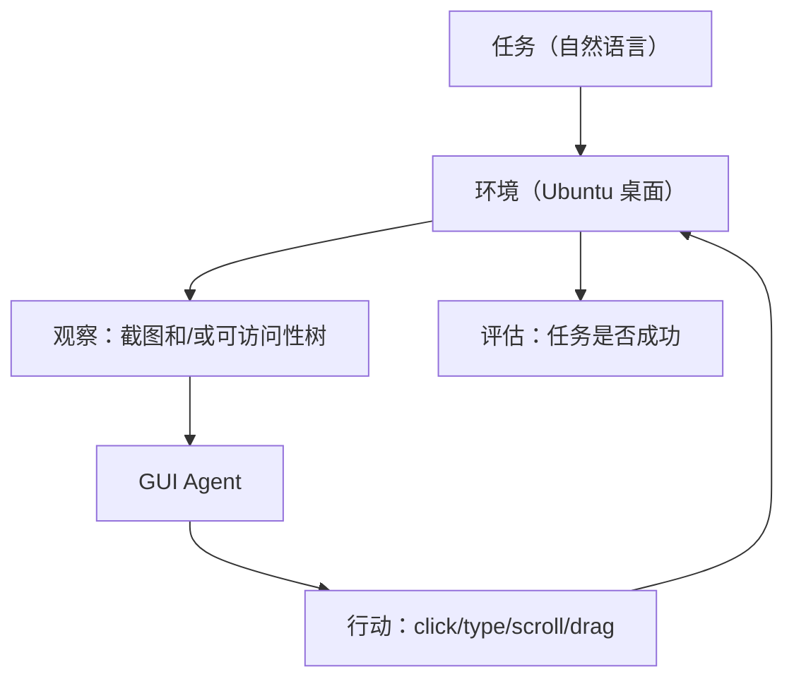
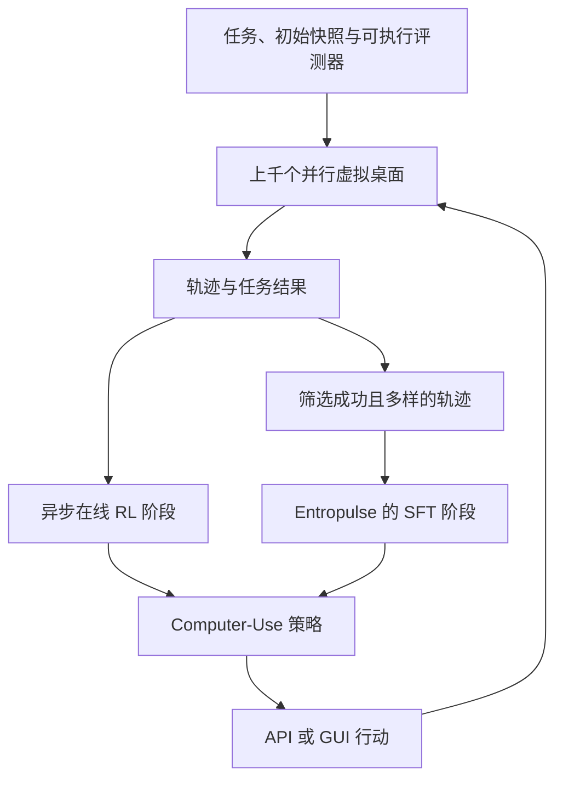

# 第 39 章 Computer-Use 与 GUI Agent 训练：OSWorld、ComputerRL 与版本化评测 ⭐⭐

> [!abstract] 本章导航
> **定位**：把 Agent 扩展到真实 GUI 环境，连接数据、策略学习、沙箱和安全评测。
>
> **先修**：[[15_Agent智能体开发]]、[[21_多模态大模型]]、[[23_AI安全与伦理]]。
>
> **学习目标**：
> - 解释 Computer-Use 任务、环境和评测协议。
> - 设计从轨迹数据、SFT 到 RL 的训练闭环。
> - 评估权限隔离、动作副作用和基准有效性。
>
> **建议路径**：Computer-Use 任务定义与基准 → OSWorld 基准详解 → 从 SFT 到 RL：GUI Agent 训练范式 → … → 与现有 Agent 框架的集成。先完成主线，再按需要阅读进阶内容。
>
> **配套代码**：本章暂无独立代码目录，使用正文推导、自测题和决策表验收。

> [!info] 阅读提示
> Computer-Use（计算机使用）让 Agent 通过截图、可访问性树或程序化 API 感知并操作桌面/网页。
> 本章梳理 OSWorld/WebArena、ComputerRL 及其论文模型，并说明环境、评测和安全边界。
>
> 🆕 **截至 2026-07-31**：OSWorld 2.0 已于 2026-06 发布，当前可复现 release 为
> `osworld-v2-2026.06.24`；ComputerRL 已发表于 ICLR 2026，由清华大学、Z.AI（智谱）与中国科学院大学作者
> 完成。官方发布表面的模型命名和结果并不一致：当前 arXiv 论文使用 **AutoGLM-OS-9B**
> 并报告 `48.1 ± 1.0`，ICLR 2026 官方页面使用 **GLM-ComputerRL-9B** 并报告 `48.9%`。
> 引用时必须带来源/版本，不能把二者拼成同一结果；该工作也不属于字节跳动项目。不同 OSWorld
> 版本、任务集与 agent scaffold 的成绩不可直接横向排名。

## 39.1 Computer-Use 任务定义与基准 ⭐⭐⭐⭐

### 39.1.1 Computer-Use 是什么？

Computer-Use = 让 Agent 像人一样操作计算机：
- 观察：屏幕截图、可访问性树/控件元数据，或二者组合
- 行动：点击、键入、滚动、拖拽
- 目标：完成自然语言任务（如「订一张去北京的机票」）

### 39.1.2 主流基准

| 基准 | 类型 | 环境与边界 | 报告结果时必须带上 |
|-----|-----|------------|--------------------|
| **OSWorld 原始版** | 桌面 GUI | 主 benchmark 为 369 个 Ubuntu 任务，另有 43 个 Windows 补充任务用于分析 | benchmark revision、OS/任务子集、模型与 scaffold |
| **OSWorld-Verified** | 修订后的桌面 GUI 基准 | 2025 年修复问题并重新评测；不能与原始版分数混用 | Verified revision、环境/任务与评测器版本 |
| **OSWorld 2.0** | 长时程桌面任务 | 新任务/资产/模拟网站；与 v1 不是同一协议 | `v2026.06.24` 等 release 全套组件 |
| **WebArena** | 网页操作 | 可独立部署、可复现的网站环境，不是任意线上真实网站 | 环境版本、任务版本、文本/视觉观察 |
| **WindowsAgentArena** | Windows 桌面 | Windows 11 VM，150+ 任务 | VM 快照、任务集、agent 与评测器版本 |
| **Mind2Web** | 网页轨迹/泛化评测 | 以离线网页交互数据为主，不等同于完整在线 OS 环境 | task split、元素候选与评测指标 |

## 39.2 OSWorld 基准详解 ⭐⭐⭐⭐

### 39.2.1 OSWorld 架构



OSWorld 原始环境支持 Ubuntu、Windows 和 macOS；论文主 benchmark 是 369 个 Ubuntu 任务，
另有 43 个 Windows 补充任务用于分析。OSWorld-Verified 是后续修订，成绩必须显式标注 revision。
OSWorld 2.0 则是新的长时程基准；其代码、任务类、资产、模拟网站和 provider 镜像必须来自同一
release，不能把原始版/Verified 的分数抄到 v2 表格中。

### 39.2.2 任务示例

任务：在 LibreOffice Calc 中创建一个表格，计算 A1 到 A10 的和，保存为 `sum.ods`

观察：屏幕截图、当前活动窗口、鼠标位置

行动空间：
```python
ActionSpace = {
    "click": {"x": int, "y": int},
    "type": {"text": str},
    "scroll": {"direction": "up/down", "amount": int},
    "drag": {"x1": int, "y1": int, "x2": int, "y2": int},
    "key": {"key": "ctrl+a/enter/esc"}
}
```

## 39.3 从 SFT 到 RL：GUI Agent 训练范式 ⭐⭐⭐⭐

### 39.3.1 SFT 范式（基线）

SFT = 用人工标注轨迹微调：
1. 收集演示轨迹（人类操作记录）
2. 将轨迹转为 `(obs, act)` 对
3. 标准下一个 token 预测微调

缺点：
- 人工标注贵、慢
- 演示未必最优
- 行为克隆可能产生分布偏移和错误累积；泛化能力取决于数据覆盖与模型

### 39.3.2 ComputerRL 范式（强化学习）

ComputerRL（ICLR 2026）是一个可扩展的端到端在线 RL 框架，但论文没有证明它是历史上“第一个”GUI RL
框架。它的可核验组件包括：

核心组件：
1. **API-GUI 范式**：同时允许程序化 API 与直接 GUI 操作；
2. **分布式环境**：用 Docker/QEMU、gRPC 等组织上千个并行虚拟桌面；
3. **异步在线 RL**：与 AgentRL 训练基础设施集成，而非论文所称的固定“PPO + Actor-Critic”；
4. **Entropulse**：从成功 rollout 构造 SFT 数据，在长时间 RL 中交替插入 SFT 阶段以恢复探索熵；
5. **可执行评测器**：RL 仍需要任务、初始化、可验证成功条件和稳定环境，并非“无需标注/监督”。



## 39.4 AutoGLM-OS / GLM-ComputerRL-9B：先分清发布版本 ⭐⭐⭐⭐

### 39.4.1 论文结果与版本边界

ComputerRL 作者来自清华大学、Z.AI（智谱）与中国科学院大学；部分工作在 Z.AI 实习期间完成。
截至本章复核日期，两个官方表面的口径如下：

- arXiv 论文把 ComputerRL 应用于 GLM-4-9B-0414 与 Qwen2.5-14B，模型名为
  **AutoGLM-OS-9B/14B**；表格给出 AutoGLM-OS-9B 的 OSWorld 结果 `48.1 ± 1.0`；
- ICLR 2026 官方页面写的是 GLM-4-9B-0414 与 GLM-4.1V-9B-Thinking，并把结果模型命名为
  **GLM-ComputerRL-9B**，摘要报告 `48.9%`；
- 两者不能在不说明来源的情况下互换名称、骨干或分数。这些也都不是 OSWorld 2.0 成绩，
  不应长期标作“当前 SOTA”。

论文的主要贡献是 API-GUI、并行虚拟桌面基础设施和 Entropulse；旧稿所写的“双视觉头/坐标头”没有
官方依据，已删除。模型内部实现应以论文和官方仓库为准。

### 39.4.2 工程行动契约示意

```python
"""框架无关的行动边界；不是 AutoGLM-OS 的官方模型实现。"""
from dataclasses import dataclass
from enum import Enum

class ActionKind(str, Enum):
    CLICK = "click"
    TYPE = "type"
    SCROLL = "scroll"
    KEY = "key"

@dataclass(frozen=True)
class GUIAction:
    kind: ActionKind
    x: int | None = None
    y: int | None = None
    text: str | None = None
    amount: int | None = None

def validate_action(action: GUIAction, *, width: int, height: int) -> None:
    if action.kind is ActionKind.CLICK:
        if action.x is None or action.y is None:
            raise ValueError("click requires x and y")
        if not (0 <= action.x < width and 0 <= action.y < height):
            raise ValueError("click is outside the current screenshot")
    elif action.kind in {ActionKind.TYPE, ActionKind.KEY} and not action.text:
        raise ValueError("type/key requires text")
    elif action.kind is ActionKind.SCROLL and action.amount is None:
        raise ValueError("scroll requires amount")
```

模型输出必须先做 schema、坐标系、当前窗口和策略校验，再交给执行器；转账、发送、删除、安装软件、
上传文件等外部副作用还要单独审批，不能把“能解析”视为“已授权”。

## 39.5 工程栈：环境模拟、沙箱隔离、安全 ⭐⭐⭐

### 39.5.1 无头桌面环境模拟

| 工具 | 平台 | 特点 |
|-----|-----|-----|
| **QEMU/云 VM/桌面虚拟机** | 跨平台/云 | 完整 OS、快照恢复，是桌面 benchmark 常见隔离单元 |
| **Xvfb** | Linux/X11 | 无物理显示器的 framebuffer；不等于完整安全沙箱 |
| **Playwright/Selenium** | 浏览器 | 通过浏览器自动化接口操作 Web，不等同于任意桌面像素操作 |
| **PyAutoGUI / OS 可访问性 API** | 多平台/系统相关 | 分别提供坐标输入与结构化控件访问；需处理缩放、焦点和权限 |

### 39.5.2 沙箱隔离

GUI Agent 同时接触不可信屏幕内容和高权限执行通道。容器能帮助打包环境，但不能单独作为运行任意桌面、
浏览器内核或不可信文档的充分安全边界。

沙箱方案：
- **一次性 VM + 快照**：每个任务从已校验快照启动，完成后销毁；禁止宿主目录、剪贴板和设备直通；
- **隔离身份与秘密**：使用测试账号和最小权限短期凭证，不把个人邮箱、支付卡或生产 token 放入环境；
- **网络与数据边界**：默认拒绝出站，按域名/协议 allowlist；上传、下载和跨租户 KV/日志分别审计；
- **策略层审批**：发送、购买、转账、删除、公开发布、安装和提权必须在人类确认后执行；
- **审计与回滚**：记录 observation/action、模型/提示版本、审批人和外部结果，敏感字段脱敏；
- **抗提示注入**：网页、邮件、文档中的指令一律视为不可信数据，不能覆盖系统策略或泄露秘密。

## 39.6 与现有 Agent 框架的集成 ⭐⭐⭐

### 39.6.1 稳定的工具边界

不要把未定义的 GUI tool 或某个版本的 LangChain import 当成可运行示例。无论使用哪种编排框架，
Computer-Use 工具都应暴露一个小而稳定的契约：

1. 输入是版本化的 `GUIAction` schema，携带目标窗口/会话和幂等 request ID；
2. 工具层重新校验坐标、焦点、allowlist、租户、权限和审批状态；
3. 返回结构化 observation、实际副作用、截图哈希和错误类别，而不是只有自然语言；
4. 对 timeout/未知结果先查询外部状态，不盲目重复 click/type；
5. 模型无法直接读取宿主秘密或绕过策略层调用底层自动化驱动。

## 🧭 本章小结

本章应形成以下可复述结论：

- 解释 Computer-Use 任务、环境和评测协议。
- 设计从轨迹数据、SFT 到 RL 的训练闭环。
- 评估权限隔离、动作副作用和基准有效性。

## ✅ 自测与练习

先合上正文，再回答以下问题；无法说明证据或边界时，回到对应小节复习。

1. 你能否解释 Computer-Use 任务、环境和评测协议？
2. 你能否设计从轨迹数据、SFT 到 RL 的训练闭环？
3. 你能否评估权限隔离、动作副作用和基准有效性？

## 🧪 配套代码与验收

本章暂无独立代码目录。验收时应完成正文中的推导或决策题，并能在自测中说明适用边界。

成功标准：概念、输入输出、关键指标和失败条件能够相互对应，不用未经验证的性能数字代替结论。

## 🎯 面试题精讲

### 真题 1：Computer-Use 任务有什么特殊？为什么比对话 Agent 难？

**答**：

Computer-Use 特殊：
- 观察是像素/视窗元素树（多模态）
- 行动空间连续/离散混合（坐标+文本+行动类型）
- 环境是真实计算机（状态大、不可完全观测）
- 奖励稀疏（仅最后成功=1）

更难原因：
- 多模态观察比纯文本复杂
- 行动空间更复杂
- 环境是真实世界（不可预测、有噪声）

---

### 真题 2：SFT vs RL 训练 GUI Agent 各有什么优缺点？

**答**：

SFT：
- 优点：稳定、易实现
- 缺点：标注贵、慢、演示未必最优、泛化差

RL：
- 优点：可从可验证任务结果优化多步策略，并学习错误恢复
- 缺点：仍需任务/评测器/环境，采样昂贵，可能 reward hacking，泛化不保证

常见组合是先用行为克隆建立可用策略，再做在线 RL；ComputerRL 的 Entropulse 还在 RL 阶段之间插入成功
轨迹 SFT。是否最佳必须由目标环境和消融实验决定。

---

### 真题 3：ComputerRL 与论文模型是什么关系？为什么名称和成绩必须带版本？

**答**：

ComputerRL 是训练/环境框架；arXiv 将其验证模型写作 AutoGLM-OS，ICLR 2026 官方页面则写作
GLM-ComputerRL-9B。论文贡献包括：
1. API-GUI 统一行动范式；
2. 可扩展到上千虚拟桌面的分布式基础设施；
3. 异步在线 RL；
4. 交替 RL 与成功轨迹 SFT 的 Entropulse。

arXiv 表格为 `48.1 ± 1.0`，ICLR 页面摘要为 `48.9%`。回答时必须带具体来源，并说明两者都不是
OSWorld 2.0 分数，不能自行推断它们只是同一模型的简单改名。

---

### 真题 4：GUI Agent 安全有什么风险？如何做沙箱隔离？

**答**：

风险：
- 误操作破坏真实环境
- 访问敏感数据
- 网页/邮件/文档 prompt injection 诱导泄密或越权
- 重试造成重复发送、购买或删除
- 恶意下载、供应链与网络攻击

沙箱隔离：
- 一次性 VM 与任务前快照，任务后销毁
- 测试身份/短期凭证、权限最小化
- 出站 allowlist、敏感挂载/剪贴板/宿主设备禁用
- 高风险副作用的人类审批、完整审计与状态核验
- 将网页/邮件/文档指令视为不可信，抵御 prompt injection

---

### 真题 5：你会如何设计一个 GUI Agent？画架构图

**答**：

架构图见本章 ComputerRL 图。生产架构还要在策略和执行器之间增加独立授权层。

核心组件：
1. 多模态策略（截图/可访问性树/任务上下文）
2. 版本化行动 schema 与确定性解析/校验
3. 可重置虚拟桌面、任务初始化和可执行评测器
4. SFT/RL 数据与训练系统；具体算法以实验为准
5. 独立授权、审批、审计、失败恢复和观测指标

## 📋 本章速查表

| 知识点 | 核心概念 | 面试考察重点 |
|-------|---------|-------------|
| Computer-Use 定义 | 观察（截图）→ 行动（click/type/scroll/drag）→ 目标 | 完整流程 |
| OSWorld 基准 | v1/Verified/2.0 的任务与 release 不同 | 版本化、不可跨协议比较 |
| SFT 范式 | 人工/合成/成功 rollout 轨迹的行为克隆 | 分布偏移与错误累积 |
| ComputerRL | API-GUI、并行虚拟桌面、异步在线 RL、Entropulse | 论文组件与复现边界 |
| 论文模型命名 | arXiv：AutoGLM-OS-9B；ICLR 页面：GLM-ComputerRL-9B | 分别为 48.1±1.0 与 48.9；来源不可混用，均非 OSWorld 2.0 |
| 环境模拟 | VM/QEMU、Xvfb、浏览器自动化、OS 控件 API | 隔离层与动作层要区分 |
| 沙箱隔离 | 一次性 VM、最小权限、审批、审计、网络隔离 | 容器本身不充分 |

## 🔗 相关章节

- [[15_Agent智能体开发]]：Agent 基础，GUI Agent 是其中一类
- [[26_世界模型与具身AI]]：具身 AI 与 GUI Agent 的关系（具身=物理机器人，GUI=数字具身）
- [[27_推理模型与Test-Time_Compute]]：推理模型用于复杂任务规划
- [[35_生产级Agent记忆框架]]：GUI Agent 的记忆（记住之前操作过什么）

## 📖 一手参考资料

### 截至 2026-07-31 的权威资料

- [OSWorld 2.0 官方仓库与 release 说明](https://github.com/xlang-ai/OSWorld-V2)
- [OSWorld 2.0 论文（arXiv:2606.29537）](https://arxiv.org/abs/2606.29537)
- [OSWorld（NeurIPS 2024）](https://proceedings.neurips.cc/paper_files/paper/2024/hash/5d413e48f84dc61244b6be550f1cd8f5-Abstract-Datasets_and_Benchmarks_Track.html)
- [OSWorld 官方仓库（含 OSWorld-Verified 更新）](https://github.com/xlang-ai/OSWorld)
- [WebArena 官方仓库](https://github.com/web-arena-x/webarena)
- [WindowsAgentArena 官方仓库](https://github.com/microsoft/WindowsAgentArena)
- [ComputerRL（arXiv 论文）](https://arxiv.org/abs/2508.14040)
- [ComputerRL（ICLR 2026 官方页面）](https://iclr.cc/virtual/2026/poster/10007435)
- [ComputerRL 官方代码](https://github.com/THUDM/ComputerRL)

### 一手参考资料

> 核验日期：2026-08-04。版本、价格、法规、模型能力和 benchmark 以链接页面当前状态为准。

- [[docs/AUTHORITATIVE_SOURCES|章节权威来源索引]]：按章节维护的官方文档、标准、原论文和官方仓库。
