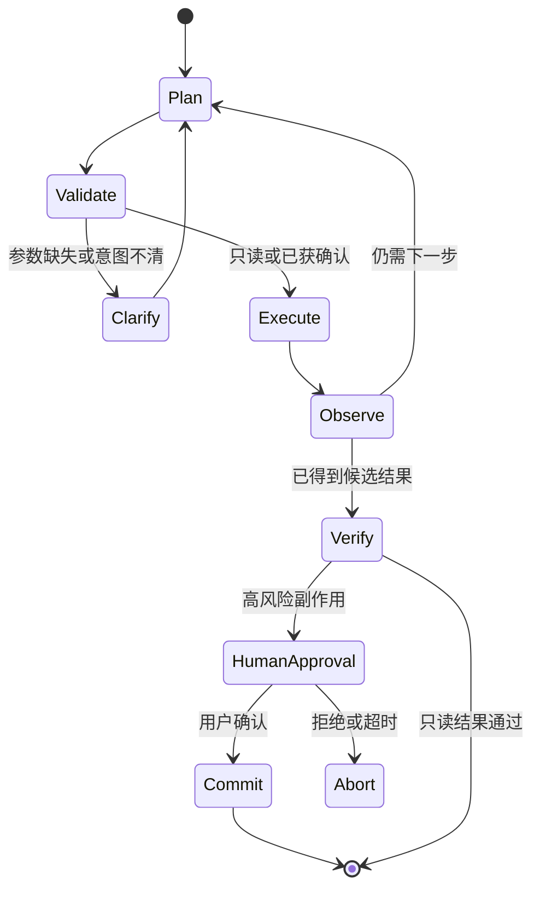
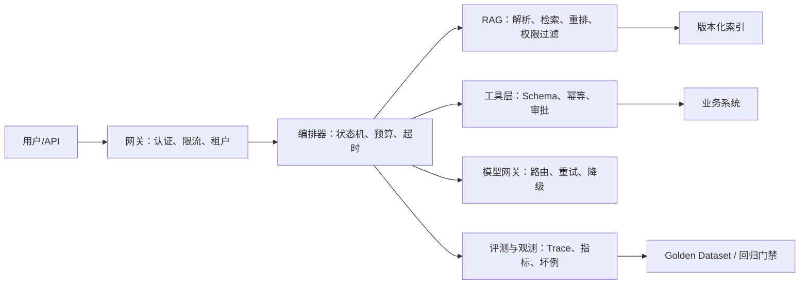

# 第 40 章 国内大模型岗位面试实战：JD 对齐、项目深挖与系统设计 ⭐⭐⭐⭐⭐

> [!abstract] 本章导航
> **定位**：将前 39 章知识压缩成可验证的项目证据、系统设计和面试表达。
>
> **先修**：[[14_RAG检索增强生成]]、[[15_Agent智能体开发]]、[[17_大模型评估体系]]、[[20_LLMOps与模型可观测性]]、[[25_推理引擎与高性能服务]]。
>
> **学习目标**：
> - 从公开 JD 提取岗位能力与证据要求。
> - 用项目卡、指标卡和坏例卡组织真实经历。
> - 完成分层回答、追问演练和 14 天训练计划。
>
> **建议路径**：近期岗位信号：从“会调 API”转向“可稳定交付” → 项目深挖：用“六张卡”组织回答 → RAG 高频深挖：从总分转向漏斗归因 → … → 14 天训练计划。先完成主线，再按需要阅读进阶内容。
>
> **配套代码**：本章暂无独立代码目录，使用正文推导、自测题和决策表验收。

> [!info] 阅读提示
> **适用岗位**：大模型应用开发、AI Agent、RAG、模型算法、推理部署 / AI Infra
>
> **证据日期**：2026-07-31。JD 代表企业公开要求；面经是候选人自述，只能用于发现题型，不能视为公司官方题库或录用标准。
>
> **本章目标**：把前 39 章的知识组织成“能说明真实问题、真实指标、真实取舍”的面试答案。不要背虚构数据；没有线上流量时，应明确说“离线实验”或“个人项目”。

## 40.1 近期岗位信号：从“会调 API”转向“可稳定交付”

### 40.1.1 公开 JD 样本的共同要求

| 岗位方向 | 公开要求中的共同信号 | 面试时要拿出的证据 |
|---|---|---|
| 大模型应用 / Agent | Python、RAG、工作流/Agent、Function Calling/MCP、上下文与记忆 | 可运行项目、评测集、失败恢复、成本与延迟 |
| AI 后端工程 | FastAPI/Django、缓存、消息队列、异步、高并发、Docker/K8s | 接口设计、压测结果、限流熔断、日志与告警 |
| 模型算法 / Post-training | 数据治理、SFT、RM/DPO/RL、奖励设计、模型评测 | 数据构建依据、实验对照、曲线解释、坏例分析 |
| 推理部署 / AI Infra | vLLM/SGLang、KV Cache、量化、CUDA/NCCL、Profiler | TTFT/TPOT/吞吐、显存估算、瓶颈定位过程 |

本章在 2026-07-31 目的性抽样了 4 份公开岗位信息：3 份来自企业官方招聘页，1 份来自高校
就业平台上的拼多多岗位信息。样本中，Agent 岗位同时出现安全、可观测性、
业务指标、RAG/MCP；应用工程样本出现真实数据回放、A/B 测试和 CI/CD；训推样本覆盖 PyTorch、
NCCL 与 Profiler。这里只能用于提炼面试准备方向，不代表 2026 年 7 月全部公开岗位的统计分布。

### 40.1.2 面试评价的四层结构

```text
基础正确性 → 项目真实性 → 工程闭环 → 业务取舍
```

1. **基础正确性**：能解释原理、复杂度、适用边界。
2. **项目真实性**：说清个人职责、输入输出、数据来源和运行环境。
3. **工程闭环**：有评测、监控、坏例归因、回归和故障恢复。
4. **业务取舍**：能解释为什么不用更复杂方案，以及收益是否覆盖成本。

只讲框架名称通常停在第二层之前；能给出可复现实验与失败案例，才容易进入深挖。

## 40.2 项目深挖：用“六张卡”组织回答

### 40.2.1 六张卡模板

| 卡片 | 必答内容 | 常见追问 |
|---|---|---|
| 业务卡 | 用户、痛点、输入、输出、风险等级 | 为什么需要 LLM？规则系统不行吗？ |
| 数据卡 | 来源、规模、清洗、权限、版本、标注 | 数据能否用于训练？如何防泄露？ |
| 架构卡 | 关键模块、同步/异步、状态、依赖 | 单点故障在哪里？如何扩容？ |
| 指标卡 | 基线、目标、离线/线上口径、样本量 | 指标怎么计算？谁标注？置信度如何？ |
| 坏例卡 | 失败样本、链路归因、修复与回归 | 为什么确定是检索问题而不是生成问题？ |
| 取舍卡 | 备选方案、成本、延迟、复杂度 | 为什么选这个模型/框架/向量库？ |

### 40.2.2 90 秒项目陈述

按以下顺序回答，不要从技术名词开始：

> 我负责的是【用户/场景】中的【具体问题】。原方案的基线是【可验证现状】。我负责【个人边界】，将链路拆成【3～5 个模块】。离线评测使用【数据来源、样本量、切分方式】，主要指标是【指标与口径】；上线/回放后观察【延迟、错误、业务指标】。最大的坏例是【真实失败】，根因位于【链路节点】，通过【改动】修复，并把该样本加入回归集。最终【如实说明结果】，代价是【成本或复杂度】。

**禁止**：

- 把团队结果全部写成个人结果；
- 把“感觉更好”写成准确率提升；
- 没有压测却声称支持“万级并发”；
- 不说明样本量、基线和统计口径；
- 用 RAGAS、LangSmith 等工具名代替评测设计。

### 40.2.3 不同项目的核心指标

| 项目 | 效果指标 | 工程指标 | 风险指标 |
|---|---|---|---|
| RAG | Recall@K、MRR/nDCG、Faithfulness、拒答正确率 | 分阶段 P95、Token/请求、索引更新时间 | 越权召回率、引用错误率 |
| Agent | 任务成功率、工具选择准确率、参数合法率 | 平均步数、P95 延迟、单任务成本 | 重复副作用率、人工接管率 |
| Post-training | 任务集得分、Pass@1、胜率、能力保持率 | 训练吞吐、显存、收敛步数 | Reward Hacking、KL 漂移 |
| 推理服务 | 输出质量回归 | TTFT、TPOT、吞吐、P99、GPU 利用率 | OOM 率、超时率、降级成功率 |

指标必须说明“在哪个数据集、哪个版本、多少样本、如何标注”。个人项目可以没有线上业务指标，但必须有诚实的离线基线。

## 40.3 RAG 高频深挖：从总分转向漏斗归因

### 40.3.1 建立可回归的 Golden Dataset

最小评测单元不是“问题—答案”二元组，而是：

```text
query
→ relevant_document_ids / relevant_chunks
→ reference_answer
→ answerable / should_abstain
→ metadata_scope / permission_scope
→ tags（多跳、时效、表格、歧义、越权等）
```

数据集至少拆成：

- `train/dev`：用于调 chunk、召回、Prompt 与阈值；
- `test`：冻结，只用于最终比较；
- `regression`：每次线上/评审坏例修复后追加；
- `adversarial`：Prompt Injection、越权、过期知识和无答案问题。

### 40.3.2 RAG 漏斗诊断表

| 阶段 | 先看什么 | 常见根因 | 有针对性的修复 |
|---|---|---|---|
| 解析 | 页/表/标题保留率 | OCR、表格错位、编码异常 | 版面解析、结构化抽取、抽样验收 |
| 分块 | 答案跨块率、上下文完整性 | chunk 太小或语义断裂 | 标题继承、滑窗、父子块 |
| 查询理解 | 改写成功率、实体保留率 | 指代、省略、术语不一致 | 多查询、实体标准化、先澄清 |
| 召回 | Recall@K | embedding 不匹配、过滤过严 | BM25+dense、多路召回、过滤校准 |
| 排序 | MRR/nDCG、Context Precision | reranker 域外、候选集太小 | 域内评测、调候选数与融合权重 |
| 生成 | Faithfulness、引用准确率 | 上下文冲突、Prompt 无约束 | 引用绑定、冲突检测、结构化输出 |
| 决策 | 拒答正确率 | 阈值固定、模型过度回答 | 校准置信度、无答案分类、人工兜底 |

**面试回答示例**：

> 我不会只报一个端到端正确率。先用 `relevant_document_ids` 计算 Recall@K，确认答案证据是否进入候选集；再用 MRR/nDCG 看排序；最后评估忠实度、引用准确率和拒答。若 Recall@K 正常而 Faithfulness 下降，优先检查上下文冲突和生成约束，而不是盲目更换 embedding。

### 40.3.3 知识库如何不停服更新

使用“双版本索引 + 原子切换”：

1. 新文档写入 staging，完成解析、去重、权限标签和质量检查；
2. 构建 `index_vN+1`，对固定回归集做召回与延迟检查；
3. 通过逻辑别名将读流量从 `vN` 原子切换到 `vN+1`；
4. 保留旧版本与变更日志，异常时回滚；
5. 增量更新使用文档版本号和内容哈希，删除使用 tombstone；
6. 缓存键包含 `index_version`，避免新旧答案串用。

追问“为什么不能直接 upsert”时，要指出大批量更新期间会出现部分新、部分旧的混合视图，难以验证和回滚。

## 40.4 Agent 高频深挖：把工作流、状态和副作用说清楚

### 40.4.1 Workflow 与 Agent 的边界

- **Workflow**：路径基本确定，适合合规、高风险、可枚举流程；
- **Agent**：模型动态选择步骤，适合开放任务和不确定工具组合；
- **生产实践**：外层确定性 Workflow 管权限、预算和审批，内层 Agent 在有限动作空间中决策。

不要把所有流程都 Agent 化。转账、删除、发信等有副作用操作，必须经过确定性校验和显式确认。

### 40.4.2 可恢复 Agent 状态机



每一步持久化 `run_id`、`step_id`、输入、工具版本、结果摘要、错误类型和预算消耗。恢复时从最后一个“已确认完成”的步骤继续，而不是重放整个对话。

### 40.4.3 故障语义与处理策略

| 故障 | 是否自动重试 | 关键设计 |
|---|---|---|
| 模型超时/限流 | 可以，指数退避+抖动 | 总预算、备用模型、熔断 |
| 只读工具 5xx | 可以，限定次数 | timeout、retry-after、缓存 |
| 参数 Schema 错误 | 修正后最多重试一次 | JSON Schema、错误反馈给模型 |
| 写操作结果未知 | 不能盲重试 | 幂等键、查询操作状态、人工确认 |
| 连续同动作/震荡 | 停止 | 最大步数、轨迹相似检测 |
| Prompt Injection | 不执行 | 数据/指令分离、权限最小化、输出过滤 |
| 上下文接近上限 | 压缩后继续 | 保留目标、约束、已确认事实和工具结果 |

工具选择准确率要和**参数合法率、执行成功率、任务成功率**分开统计。否则“选对工具但参数错”会被错误归因。

### 40.4.4 写操作的幂等骨架

仅在本地写入“已执行结果”还不够：进程可能在外部副作用成功后、写本地结果前崩溃。此时重启后看不到结果，
再次调用就会重复扣款、发消息或建单。可靠设计需要稳定的业务意图 ID、请求哈希、持久化唯一约束/租约，
以及**下游同一幂等键**或可查询的外部操作状态。

```python
from dataclasses import dataclass
from enum import Enum
from hashlib import sha256
import json
from typing import Any, Literal, Protocol


@dataclass(frozen=True)
class ToolRequest:
    tenant_id: str
    intent_id: str  # 客户端创建并在重试/恢复时复用；不是每次运行新生成
    tool_name: str
    arguments: dict[str, Any]

    @property
    def idempotency_key(self) -> str:
        raw = f"{self.tenant_id}:{self.intent_id}:{self.tool_name}"
        return sha256(raw.encode("utf-8")).hexdigest()

    @property
    def request_hash(self) -> str:
        canonical = json.dumps(
            self.arguments,
            sort_keys=True,
            separators=(",", ":"),
            ensure_ascii=False,
        )
        return sha256(canonical.encode("utf-8")).hexdigest()


class OperationState(str, Enum):
    IN_PROGRESS = "in_progress"
    SUCCEEDED = "succeeded"
    FAILED_UNKNOWN = "failed_unknown"


@dataclass(frozen=True)
class Claim:
    owner: bool  # 仅新建记录或租约过期后的接管者为 True
    state: OperationState
    request_hash: str
    result: dict[str, Any] | None = None


@dataclass(frozen=True)
class Lookup:
    status: Literal["succeeded", "not_found", "unknown"]
    result: dict[str, Any] | None = None


class OperationStore(Protocol):
    def claim_or_get(self, key: str, request_hash: str, lease_s: int) -> Claim: ...
    def mark_succeeded(self, key: str, result: dict[str, Any]) -> None: ...
    def mark_unknown(self, key: str) -> None: ...


class IdempotentTool(Protocol):
    def lookup(self, idempotency_key: str) -> Lookup: ...
    def execute(
        self,
        *,
        idempotency_key: str,
        arguments: dict[str, Any],
    ) -> dict[str, Any]: ...


class OperationInProgress(RuntimeError):
    pass


def execute_write(
    request: ToolRequest,
    tool: IdempotentTool,
    store: OperationStore,
) -> dict[str, Any]:
    key = request.idempotency_key
    claim = store.claim_or_get(key, request.request_hash, lease_s=30)
    if claim.request_hash != request.request_hash:
        raise ValueError("same idempotency key was reused with different arguments")
    if claim.state is OperationState.SUCCEEDED:
        if claim.result is None:
            raise RuntimeError("corrupt operation record: result is missing")
        return claim.result
    if not claim.owner:
        raise OperationInProgress("another worker owns the active lease")

    # 恢复时先查下游：关闭“外部成功、本地落库前崩溃”的窗口。
    observed = tool.lookup(key)
    if observed.status == "succeeded":
        if observed.result is None:
            raise RuntimeError("downstream succeeded but returned no result")
        store.mark_succeeded(key, observed.result)
        return observed.result
    if observed.status == "unknown":
        store.mark_unknown(key)
        raise RuntimeError("downstream outcome is unknown; do not retry blindly")

    try:
        # 下游必须把相同 key 视为同一业务操作；重复调用返回第一次结果。
        result = tool.execute(idempotency_key=key, arguments=request.arguments)
    except TimeoutError:
        observed = tool.lookup(key)
        if observed.status == "succeeded" and observed.result is not None:
            store.mark_succeeded(key, observed.result)
            return observed.result
        store.mark_unknown(key)
        raise

    store.mark_succeeded(key, result)
    return result
```

`claim_or_get` 要由数据库唯一约束和带过期时间的租约实现，并原子校验 request hash。若副作用与操作记录在
同一个数据库，可放入同一事务；若调用外部系统，优先使用对方的幂等 API 与状态查询。下游既不幂等、也不能
查询时，本地表无法提供 exactly-once：应使用 transactional outbox、业务唯一约束、对账/补偿（Saga）或人工
处理 `FAILED_UNKNOWN`，而不是承诺自动重试安全。

## 40.5 模型算法 / Post-training：面试官在看实验判断力

### 40.5.1 SFT 何时进入 RL

不要回答“训练若干 epoch 后”。应给出门槛：

1. 基础格式、工具协议和任务完成率已稳定；
2. 独立验证集不再持续提升，且无明显过拟合；
3. 奖励可验证，难例上仍存在可优化空间；
4. SFT 模型能产生一定比例的正确轨迹，RL 才有有效探索起点；
5. 已建立通用能力回归集，防止专项优化造成能力退化。

SFT 主要学习示范分布；RL 用可验证奖励重新分配策略概率。若奖励设计不可靠，直接上 RL 只会更快放大偏差。

### 40.5.2 高频追问与答题抓手

**为什么有 Reasoning 数据还要 RL？**

- SFT 模仿给定轨迹，不直接优化最终任务奖励；
- 多条推理路径可能都正确，RL 可以探索示范之外的有效策略；
- 但规则明确、数据足够且探索收益低的任务，SFT 可能已经够用。

**如何判断数据质量？**

- 正确性、一致性、难度、覆盖度、污染、去重和标注者一致率；
- 按任务/难度/来源分桶看指标，不能只报总体均值；
- 人工抽检 + 规则校验 + 模型辅助筛选，模型裁判结果需做校准。

**如何识别 Reward Hacking？**

- reward 上升而独立任务得分、人工偏好或约束满足率下降；
- 输出变长、格式投机、关键词堆叠或利用判题漏洞；
- 用多奖励交叉验证、隐藏测试、长度归一化和人工审计处理。

**GRPO 显存如何估算？**

按组成拆解，而不是背固定数字：

```text
总显存 ≈ 权重 + 梯度 + 优化器状态 + 激活
       + 多条 rollout 的 token / logits / old log-prob
       + 通信缓冲区与碎片
```

优化顺序：缩短序列或组大小、梯度检查点、ZeRO/FSDP、低精度、分离 rollout 与训练、vLLM/SGLang 生成、降低峰值并发。必须说明模型规模、序列长度、组大小、精度和并行策略，脱离这些条件的显存数字没有意义。

## 40.6 推理部署 / AI Infra：从背原理到定位瓶颈

### 40.6.1 先分解性能问题

| 现象 | 优先检查 | 可能手段 |
|---|---|---|
| TTFT 高 | Prefill、排队、长 Prompt、调度 | Chunked Prefill、Prompt Cache、扩容 |
| TPOT 高 | Decode、内存带宽、并行通信 | 量化、优化 kernel、调整 TP/EP |
| 吞吐低但 GPU 利用率低 | 请求批量、CPU/网络、同步等待 | Continuous Batching、异步、profile |
| OOM | KV Cache、长序列、碎片、批量 | 限长、PagedAttention、降低并发 |
| P99 抖动 | 混部、超长请求、GC/网络 | 请求分级、隔离队列、背压 |
| 多卡扩展差 | NCCL、拓扑、通信计算比 | Nsight、绑卡、调整并行策略 |

### 40.6.2 性能题回答结构

> 先确认 SLO 和负载模型，包括输入/输出长度分布、并发和流式要求；再用 trace 将排队、Prefill、Decode、网络分开；随后用 profiler 证明瓶颈在算力、显存带宽还是通信；只改变一个变量做对照实验；最后同时报告质量、TTFT、TPOT、吞吐、P99、显存和成本，避免“吞吐提升但尾延迟失控”。

高分答案必须包含**测量方法**。只说“换 vLLM”或“加 GPU”不构成性能分析。

## 40.7 系统设计题：企业知识与操作 Agent

### 40.7.1 需求澄清

先问清：

- 用户是谁，峰值并发和延迟目标是什么？
- 只读问答还是允许写数据库、发消息、提交审批？
- 文档更新频率、租户隔离和权限模型是什么？
- 是否允许公有云模型，数据是否可离境？
- 错误答案的损失、人工接管 SLA 和审计保留期是多少？

### 40.7.2 参考架构



### 40.7.3 必须主动讲出的非功能设计

- 租户与文档权限在召回前后双重校验；
- 模型、Prompt、工具 Schema、索引均带版本；
- 写操作显式确认、幂等、审计、补偿；
- 流式连接中断后，服务端任务状态与客户端展示解耦；
- 模型不可用时按风险选择备用模型、规则降级或人工处理；
- 线上反馈不能直接进入训练集，需脱敏、审核和版本化。

## 40.8 编程与现场题：不能只准备大模型八股

近期面经仍会穿插基础算法和后端题。至少练习：

1. 两数之和、Top-K、二分、滑动窗口、LRU；
2. `asyncio` 限并发、超时、取消和重试；
3. SSE 流式接口与断线清理；
4. JSON Schema 参数校验与错误分类；
5. 幂等写、分布式锁边界、消息重复消费；
6. 文档去重、滑窗分块、倒排索引；
7. 向量 Top-K 与余弦相似度；
8. 指标聚合：P50/P95/P99、成功率和分桶统计。

现场写代码时依次说明：

```text
输入与边界 → 数据结构 → 复杂度 → 正常实现 → 测试用例 → 可选优化
```

AI 编程工具可以用于日常开发，但面试中仍需解释生成代码的正确性、测试和安全边界。

## 40.9 高频追问速答

### 题1：为什么不用长上下文直接替代 RAG？

长上下文降低了检索工程复杂度，但仍有成本、延迟、权限隔离、时效更新和 Context Rot 问题。小规模静态资料可直接放上下文；大规模、多租户、频繁更新且需要引用审计的场景仍适合 RAG。

### 题2：RAG 最难的是什么？

不是向量库 API，而是数据治理与可归因评测：解析质量、权限、版本、查询分布和坏例长尾决定上限。回答时应给出自己遇到的一个坏例和漏斗定位过程。

### 题3：Agent 失败为什么不能统一重试三次？

因为只读调用和有副作用调用语义不同。写操作超时可能“已成功但响应丢失”，盲目重试会重复扣款或写入；应使用幂等键、状态查询和人工确认。

### 题4：如何证明 Agent 比 Workflow 更合适？

比较任务路径是否可枚举、工具选择的不确定性、失败成本和动态信息量。若路径固定且高风险，Workflow 更稳；只有动态规划带来的收益超过成本和风险时才使用 Agent。

### 题5：模型选型怎么回答？

先定义质量、延迟、成本、上下文、工具调用、安全和部署约束；用同一评测集比较候选模型；按任务路由而非全链路使用最贵模型；保留可回滚版本。不要用公开榜单代替业务评测。

### 题6：你的指标提升是否可信？

说明基线、唯一变量、冻结测试集、样本量、置信区间或重复实验，并展示坏例分桶。若只是小样本个人实验，应主动说明结论范围。

### 题7：线上效果下降怎么排查？

先确认监控口径和版本变更，再按输入数据、解析/检索、模型/Prompt、工具、依赖服务逐层定位；用 trace 找首次异常节点；回放同一请求；必要时回滚；修复后加入回归集。

### 题8：你在项目里具体负责什么？

按“我设计/实现/验证”和“团队提供/他人负责”分开回答，给出代码模块、实验或文档证据。诚实的边界比模糊地声称“主导全链路”更可信。

## 40.10 模拟面试评分表

每道项目题按 0～2 分评分：

| 维度 | 0 分 | 1 分 | 2 分 |
|---|---|---|---|
| 问题定义 | 只讲技术 | 有场景，无约束 | 用户、风险、SLO 清楚 |
| 个人贡献 | 团队成果混用 | 能说模块 | 有代码/实验/决策证据 |
| 技术原理 | 名词堆砌 | 基本正确 | 能讲边界与复杂度 |
| 指标口径 | 无数据或编数字 | 有单一指标 | 基线、样本、分桶、回归完整 |
| 故障处理 | “加重试” | 有异常处理 | 语义、幂等、降级、审计完整 |
| 取舍复盘 | 只有优点 | 提到备选 | 解释收益、成本与未解决问题 |

总分建议：

- **10～12 分**：可以进入压力追问；
- **7～9 分**：补指标口径和失败案例；
- **0～6 分**：先重写项目证据链，不要继续背题。

## 40.11 14 天训练计划

| 天数 | 任务 | 验收物 |
|---|---|---|
| D1～D2 | 选定目标岗位，收集 20～30 份近期 JD | 技能词频表 + 目标岗位画像 |
| D3～D4 | 为主项目完成六张卡 | 90 秒陈述 + 架构图 |
| D5～D6 | 建 50～100 条最小评测集 | 基线报告 + 5 个坏例 |
| D7～D8 | 做一次性能/可靠性实验 | 对照表 + trace/日志 |
| D9～D10 | 手写 8 类基础题 | 可运行代码 + 测试 |
| D11～D12 | 完成两次 45 分钟模拟面试 | 录音/文字复盘 + 评分表 |
| D13 | 按薄弱项回看对应章节 | 一页速查 |
| D14 | 用新问题盲测 | 不看稿完成项目深挖与系统设计 |

建议主线：

- 应用 / Agent：[[09_Web开发与FastAPI]] → [[14_RAG检索增强生成]] → [[15_Agent智能体开发]] → [[17_大模型评估体系]] → [[20_LLMOps与模型可观测性]]
- 算法 / Post-training：[[12_Transformer与大模型原理]] → [[16_模型微调与推理优化]] → [[22_大模型数据工程]] → [[27_推理模型与Test-Time_Compute]] → [[33_训练稳定性与诊断]]
- 推理 / Infra：[[19_分布式训练系统]] → [[24_云原生部署与工程化]] → [[25_推理引擎与高性能服务]] → [[37_PD分离推理架构与KV池化]]

## 🧭 本章小结

本章应形成以下可复述结论：

- 从公开 JD 提取岗位能力与证据要求。
- 用项目卡、指标卡和坏例卡组织真实经历。
- 完成分层回答、追问演练和 14 天训练计划。

## ✅ 自测与练习

先合上正文，再回答以下问题；无法说明证据或边界时，回到对应小节复习。

1. 你能否从公开 JD 提取岗位能力与证据要求？
2. 你能否用项目卡、指标卡和坏例卡组织真实经历？
3. 你能否完成分层回答、追问演练和 14 天训练计划？

## 🧪 配套代码与验收

本章暂无独立代码目录。验收时应完成正文中的推导或决策题，并能在自测中说明适用边界。

成功标准：概念、输入输出、关键指标和失败条件能够相互对应，不用未经验证的性能数字代替结论。

## 🎯 面试题精讲

1. 用 30 秒说明本章解决的问题、核心机制和一个适用边界。
2. 如果面试官要求落地，你会如何用项目卡、指标卡和坏例卡组织真实经历？
3. 给出一个反例或失败场景，说明如何完成分层回答、追问演练和 14 天训练计划。

回答时采用“问题 → 机制 → 证据 → 取舍”的结构；没有线上数据时，明确区分离线实验、个人项目和生产结果。

## 📋 本章速查表

| 面试官问法 | 回答主线 |
|---|---|
| “介绍项目” | 六张卡 + 90 秒陈述 |
| “效果怎么样” | 基线、数据集、口径、分桶、回归 |
| “RAG 怎么优化” | 解析→分块→查询→召回→排序→生成→拒答 |
| “Agent 怎么防失控” | 状态机、预算、权限、幂等、确认、审计 |
| “为什么上 RL” | SFT 门槛、可验证奖励、探索空间、能力回归 |
| “推理为什么慢” | 负载模型→trace→profile→单变量实验 |
| “为什么选这个方案” | 约束、备选、收益、成本、边界 |
| “你具体做了什么” | 个人模块 + 代码/实验/决策证据 |

## 🔗 相关章节

- [[00_目录索引]]：按岗位选择完整学习路线
- [[14_RAG检索增强生成]]：RAG 原理、检索与高级模式
- [[15_Agent智能体开发]]：Agent、MCP、记忆与安全
- [[17_大模型评估体系]]：离线/在线评测与 LLM-as-Judge
- [[20_LLMOps与模型可观测性]]：Trace、指标、成本与告警
- [[25_推理引擎与高性能服务]]：TTFT、TPOT、吞吐与引擎优化

## 📖 一手参考资料

下列链接于 2026-07-31 做章节级复核。4 份岗位信息是目的性抽样，不是全量统计；招聘页和
第三方面经都会变更、下架或要求登录，投递/引用前应再次核验岗位 ID、职责、地点和发布日期。

### 企业官方招聘页

1. [海康威视高级应用软件开发（大模型）](https://talent.hikvision.com/home/socity/position?postId=B4F6AAF8C5C1FEB7D6C131231EBAB46F)：
   本章保存的 2026-07-31 字段快照为“真实数据回放、A/B 测试、Harness、CI/CD、熔断限流与
   运维”。该链接是动态招聘页，当前页面内容或可访问性不属于本章保证范围；投递前须按
   `postId=B4F6AAF8C5C1FEB7D6C131231EBAB46F` 重新核验，页面失效时不得把快照当作在招证明。
2. [百度公有云模型训推加速工程师](https://talent.baidu.com/jobs/detail/SOCIAL/d9421f0c-7cc8-4fd8-bfff-daa37d460fb4)：SFT/RL、量化、KV Cache、CUDA/CUTLASS、NCCL、Profiler、vLLM/SGLang。
3. [百度大模型算法工程师](https://talent.baidu.com/jobs/detail/SOCIAL/f16d38a1-440b-4e7b-b09b-ddfdfaf643e4)：数据治理、SFT/DPO/RLHF、评测、RAG、Agent 与工程落地。

### 高校就业平台岗位信息（非企业官方页）

1. [拼多多 AI Agent 研发工程师（中央民族大学就业信息平台）](https://career.muc.edu.cn/front/zwxx.jspa?xqzwId=37668&zpxxId=31784)：
   页面内容包含 Agent、RAG、高并发、安全、可观测性与 MCP，只能作为岗位职责线索，不能替代
   [拼多多官方招聘门户](https://careers.pddglobalhr.com/)上的在招状态、岗位 ID 和投递入口核验。

### 系统设计与幂等

1. [AWS Builders' Library：Making retries safe with idempotent APIs](https://aws.amazon.com/builders-library/making-retries-safe-with-idempotent-APIs/)：
   调用方稳定 request ID、相同 key 不同意图、迟到请求和服务端语义。
2. [Stripe API：Idempotent requests](https://docs.stripe.com/api/idempotent_requests)：
   外部副作用 API 复用幂等键并返回首次结果的具体工程示例；实际保留期和错误语义以供应商文档为准。

### 候选人面经（非官方题库）

1. [美团大模型算法岗一面/二面](https://www.nowcoder.com/feed/main/detail/b264abf14d4d4c44bc022c9ea1dce981)：SFT→RL 门槛、GRPO 显存、奖励设计、Reward Hacking、数据质量。
2. [Agent 开发面经汇总：阿里/蚂蚁/字节](https://www.nowcoder.com/discuss/877151327091027968)：项目深挖、RAG 评估、Agent 重试、知识库热更新、SSE/WebSocket。
3. [第四范式 Agent 开发实习面经](https://www.nowcoder.com/feed/main/detail/77a81a03b55143c89d1caf76833676d9)：项目网址与个人职责、确认节点、记忆压缩、模型路由和熔断。

> 样本不能证明所有公司都采用相同标准。投递前应重新采集目标城市、职级和公司的 20～30 份 JD，并据此调整准备权重。

> 核验日期：2026-08-04。版本、价格、法规、模型能力和 benchmark 以链接页面当前状态为准。

- [[docs/AUTHORITATIVE_SOURCES|章节权威来源索引]]：按章节维护的官方文档、标准、原论文和官方仓库。
