# 第 40 章 推理内存、量化与批处理 ⭐⭐⭐⭐
> [!abstract] 本章导航
> **定位**：第六部分 推理服务与 LLMOps中的第 40 章；围绕“推理内存、量化与批处理”建立单一、可追踪的知识主线。
>
> **先修**：[[39_AI隐私伦理与治理|第 39 章 AI 隐私、伦理与治理]]。
>
> **学习目标**：
> - 解释 推理优化技术 ⭐⭐⭐⭐⭐ 的核心问题、机制与适用边界。
> - 实现或评估 模型量化与压缩 ⭐⭐⭐ 的最小闭环。
> - 使用可复现证据诊断 推理核心原理 的工程取舍与失败模式。
>
> **建议路径**：推理优化技术 ⭐⭐⭐⭐⭐ → 模型量化与压缩 ⭐⭐⭐ → 推理核心原理 → 关键优化技术。
>
> **配套代码**：`code/ch30_lora_qlora/`、`code/ch41_inference_engines/`。

本章先回答“推理优化技术 ⭐⭐⭐⭐⭐”为什么成立，再沿着机制、实现、评估和边界逐步展开。阅读时先建立因果链，再运行或推演示例，最后用章末自测检查能否脱离原文复述。
## 40.1 推理优化技术 ⭐⭐⭐⭐⭐

### 40.1.1 推理优化技术全景

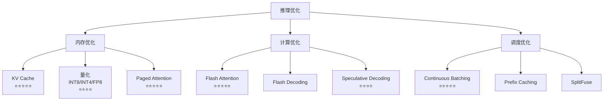

### 40.1.2 KV Cache ⭐⭐⭐⭐⭐

KV Cache 是自回归解码中减少重复键值计算的基础机制。

**核心原理**：Transformer 解码时，每一步都需要计算前面所有 token 的 Key 和 Value。这些 K/V 在自回归生成中**不会变化**，可以缓存复用。

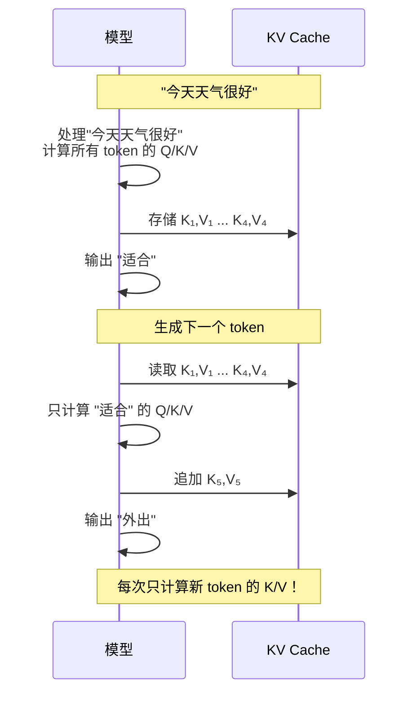

**KV Cache 显存估算**：

$$
M_{\mathrm{KV}}
= 2_{\mathrm{K,V}} \times B \times L \times H_{\mathrm{KV}}
\times T \times D_h \times s
$$

其中，$B$ 为批大小，$L$ 为层数，$H_{\mathrm{KV}}$ 为 KV 头数，$T$ 为已缓存 token 数，
$D_h$ 为每个头的维度，$s$ 为每个缓存元素的字节数。以 LLaMA-2-7B（bf16）为例：

- $B=1$、$L=32$、$H_{\mathrm{KV}}=32$、$T=4096$、$D_h=128$、$s=2$ 字节
- KV Cache = $2 \times 1 \times 32 \times 32 \times 4096 \times 128 \times 2$
  = 2,147,483,648 字节 = 2 GiB（约 2.15 GB）

> [!NOTE]
> GQA/MQA 模型必须代入实际的 KV 头数 $H_{\mathrm{KV}}$，不能直接使用查询头数
> $H_{\mathrm{Q}}$；其 KV Cache 相对 MHA 的比例约为 $H_{\mathrm{KV}}/H_{\mathrm{Q}}$。

```python
# KV Cache 在 PyTorch 中的概念实现
class KVCache:
    """KV Cache 简化实现"""

    def __init__(
        self,
        num_layers: int,
        batch_size: int,
        num_kv_heads: int,
        head_dim: int,
        max_seq_len: int,
    ):
        self.num_layers = num_layers
        # 预分配 [layers, 2(k/v), batch, kv_heads, max_seq, head_dim]
        self.cache = torch.zeros(
            num_layers, 2, batch_size, num_kv_heads, max_seq_len, head_dim,
            dtype=torch.bfloat16, device="cuda"
        )
        self.current_len = 0

    def get(self, layer_idx: int) -> tuple[torch.Tensor, torch.Tensor]:
        """获取指定层的 K/V（到当前长度）"""
        k = self.cache[layer_idx, 0, :, :, :self.current_len, :]
        v = self.cache[layer_idx, 1, :, :, :self.current_len, :]
        return k, v

    def update(self, layer_idx: int, new_k: torch.Tensor, new_v: torch.Tensor):
        """追加新的 K/V"""
        seq_len = new_k.shape[2]
        self.cache[layer_idx, 0, :, :, self.current_len:self.current_len+seq_len, :] = new_k
        self.cache[layer_idx, 1, :, :, self.current_len:self.current_len+seq_len, :] = new_v

    def increment(self, delta: int = 1):
        self.current_len += delta
```

### 40.1.3 Flash Attention ⭐⭐⭐⭐⭐

Flash Attention 通过**分块计算（Tiling）**和**IO 感知的注意力算法**，将 Attention 的显存复杂度从 $O(N^2)$ 降低到**线性**，同时避免了大矩阵的显存读写。

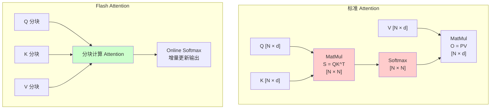

**Flash Attention 核心思想**：

标准 Attention 需要显式计算 $N \times N$ 的注意力矩阵：

$$\text{Attention}(Q, K, V) = \text{softmax}\left(\frac{QK^T}{\sqrt{d_k}}\right)V$$

Flash Attention 将 Q、K、V 分成小块，在 SRAM（高速缓存）中完成分块计算，避免将 $O(N^2)$ 的中间结果写入 HBM（显存）：

1. **分块（Tiling）**：将 Q、K、V 分成能在 SRAM 容纳的小块
2. **Online Softmax**：增量计算 softmax，无需存储完整的注意力矩阵
3. **重计算（Recomputation）**：反向传播时不保存注意力矩阵，重新分块计算

**效果**：

| 指标 | 标准 Attention | Flash Attention |
|------|--------------|-----------------|
| **显存** | $O(N^2)$ | $O(N)$ |
| **速度** | 大量 HBM 读写 | 常可更快；收益依序列、形状、GPU、精度与内核版本 |
| **最长序列** | 受显存限制 | 显著延长 |

```python
# Flash Attention 使用（PyTorch 2.0+ 原生支持）
import torch
import torch.nn.functional as F

# 方式1：PyTorch 原生 scaled_dot_product_attention（自动选择最优实现）
with torch.backends.cuda.sdp_kernel(
    enable_flash=True,      # 启用 Flash Attention
    enable_math=False,      # 禁用数学实现
    enable_mem_efficient=False
):
    output = F.scaled_dot_product_attention(Q, K, V, is_causal=True)

# 方式2：Flash Attention 2 库
from flash_attn import flash_attn_func
output = flash_attn_func(Q, K, V, causal=True)
```

### 40.1.4 Paged Attention ⭐⭐⭐⭐⭐

Paged Attention 借鉴操作系统的**虚拟内存分页机制**，解决 KV Cache 的**显存碎片化**和**共享低效**问题。

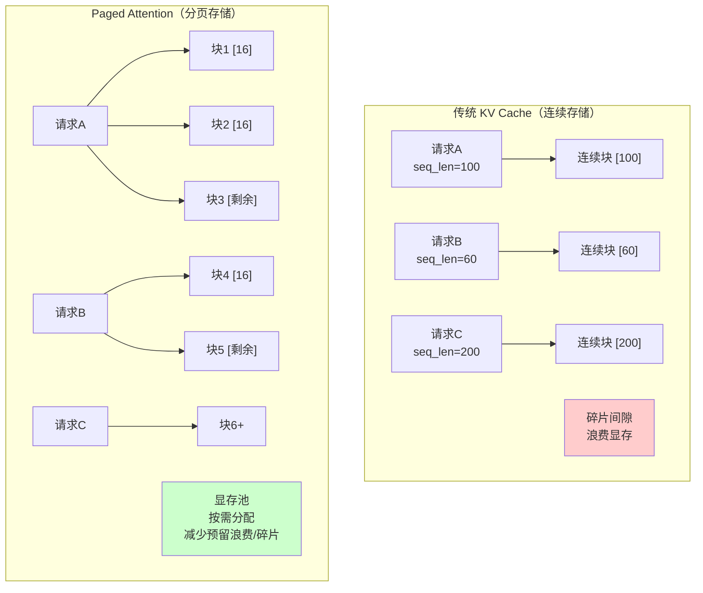

**Paged Attention 核心设计**：

| 概念 | 类比操作系统 | 作用 |
|------|-----------|------|
| **逻辑块（Logical Block）** | 虚拟地址空间 | 序列的连续逻辑分块 |
| **物理块（Physical Block）** | 物理内存页 | KV Cache 的固定大小存储单元；block size 由引擎/配置决定 |
| **块表（Block Table）** | 页表 | 逻辑块 → 物理块的映射 |
| **显存池（Memory Pool）** | 物理内存池 | 预分配的显存块池，按需分配 |

**Paged Attention 的优势**：
1. **减少预留浪费与碎片**：固定大小的物理块，按需分配；不能理解为完全“消除”
2. **高效共享**：启用兼容的前缀缓存后，共享前缀可复用物理块；命中率和显存收益取决于流量
3. **支持 Continuous Batching**：不同长度的请求可以灵活调度

### 40.1.5 Continuous Batching ⭐⭐⭐⭐⭐

传统 Batch 处理等所有序列完成后才释放资源，导致**GPU 空转**（某些短序列完成后，长序列还在继续）。

Continuous Batching（也称为 In-flight Batching 或 Iteration-level Batching）在**每个生成迭代**后动态调整 batch：

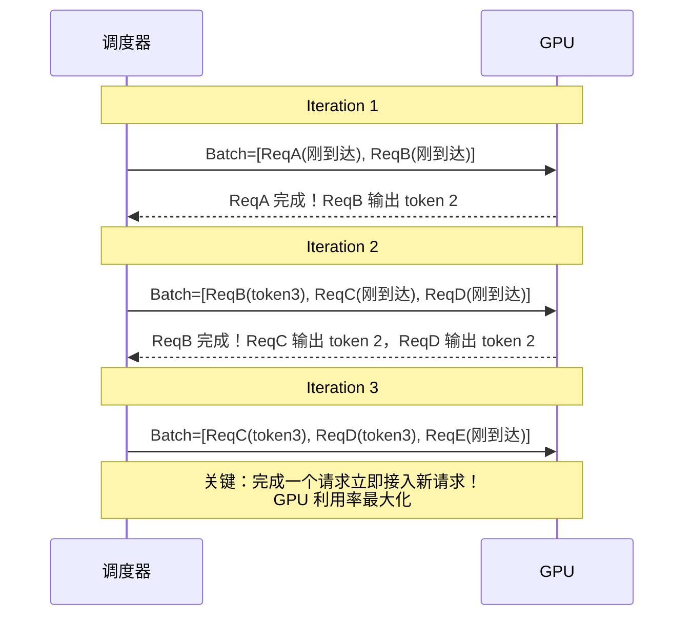

**收益边界**：Continuous Batching 通常能减少 padding 与队头阻塞，但吞吐、TTFT 和 P99
取决于模型、输入/输出长度、到达率、调度参数与硬件；必须在相同延迟 SLO 下对照压测。

### 40.1.6 Speculative Decoding（推测解码）⭐⭐⭐⭐

用一个**小模型（Draft Model）**快速生成候选序列，再用**大模型**并行验证，接受正确的部分。

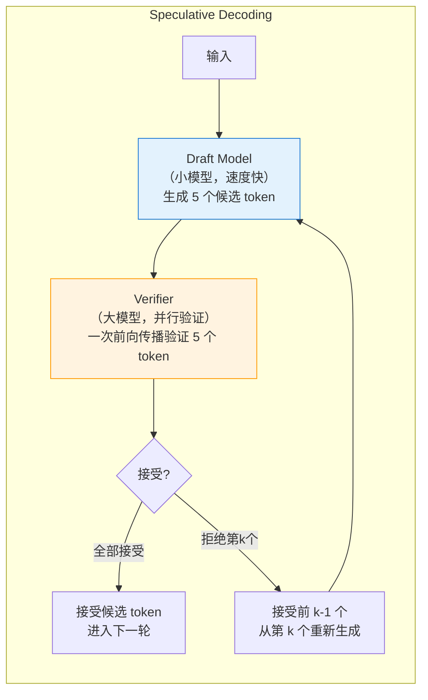

**加速原理**：Draft/proposer 先提出候选，Target 并行验证；算法保持目标分布，但工程收益由
接受率、proposer 成本、候选长度、采样参数、batch 与硬件共同决定，低接受率时可能没有收益。

**关键参数**：
- **Draft/proposer 选择**：可用小模型、n-gram、Medusa/EAGLE/MTP 等，需与引擎兼容
- **候选 token 数（gamma）**：越多不一定越快，需联合接受率调参
- **接受率**：必须从目标请求分布实测，不设跨模型通用阈值

## 40.2 模型量化与压缩 ⭐⭐⭐

### 40.2.1 量化技术概览

量化将模型权重从高精度（FP32/BF16）压缩到低精度（INT8/INT4），大幅降低显存占用。

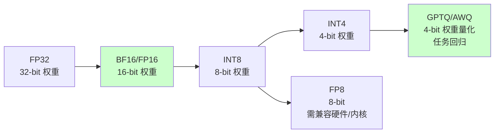

### 40.2.2 GPTQ vs AWQ vs GGUF

| 量化方法 | 类型 | 原理 | 优点 | 缺点 |
|----------|------|------|------|------|
| **GPTQ** | 后训练量化 | 逐层量化，最小化输出误差 | 通用性好，精度较高 | 量化速度慢 |
| **AWQ** | 后训练量化 | **激活感知**，保护显著权重通道 | 常见权重量化路线 | 效果依模型、校准集和实现 |
| **GGUF** | 文件格式 | llama.cpp 的量化格式 | 跨平台、CPU 友好 | 主要面向消费级 |
| **BitsAndBytes (NF4)** | 加载/训练时量化 | 4-bit NormalFloat | 使用方便，常见于 QLoRA | 与 GPTQ/AWQ 的质量不可脱离任务比较 |

**AWQ vs GPTQ 的核心区别**：

AWQ 的核心洞察是**并非所有权重量化后的损失都相同** —— 保护"对激活值影响更大"的权重，可以获得更好的精度。

```python
# AWQ 量化模型加载
from awq import AutoAWQForCausalLM
from transformers import AutoTokenizer

model = AutoAWQForCausalLM.from_quantized(
    "TheBloke/Llama-2-7B-AWQ",
    fuse_layers=True,           # 融合层，加速推理
    use_exllama=True,           # 使用 ExLlama 内核
)
tokenizer = AutoTokenizer.from_pretrained("TheBloke/Llama-2-7B-AWQ")

# GPTQ 量化模型加载（使用 AutoGPTQ）
from auto_gptq import AutoGPTQForCausalLM

model = AutoGPTQForCausalLM.from_quantized(
    "TheBloke/Llama-2-7B-GPTQ",
    device="cuda:0",
    use_triton=True,            # Triton 加速内核
)
```

## 40.3 推理核心原理

### 40.3.1 自回归生成的计算特性

LLM 推理分为两个阶段：

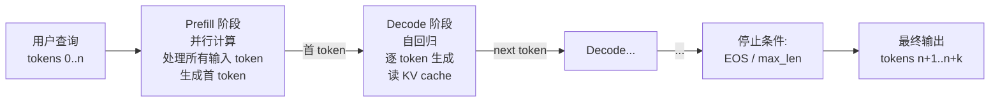

| 阶段 | 计算特征 | 瓶颈 |
|------|---------|------|
| **Prefill** | 计算密集（GEMM 主导） | GPU 算力 |
| **Decode** | 访存密集（每步读 KV） | HBM 带宽 |

### 40.3.2 KV Cache 原理与显存估算

每个 Transformer 层的 KV Cache 大小：

```
KV Cache Size (bytes) = 2 × n_layers × seq_len × n_kv_heads × head_dim × precision_bytes × batch_size
```

**示例**: LLaMA-70B (n_layers=80, n_kv_heads=8, head_dim=128, fp16) 服务 8K context, batch=32:

```
KV = 2 × 80 × 8192 × 8 × 128 × 2 × 32
   = 85,899,345,920 bytes
   = 80 GiB ≈ 85.9 GB（batch=32；单请求约 2.5 GiB）
```

这里使用二进制 GiB 与十进制 GB 分别展示，避免容量规划时混用单位。实际服务还要为权重、激活、CUDA Graph、临时 workspace 和显存碎片预留空间。

### 40.3.3 推理优化目标（3 个核心指标）

| 指标 | 定义 | 优化方向 |
|------|------|---------|
| **TTFT** (Time To First Token) | 从收到请求到返回首 token 的时间 | Prefill 优化、Prompt Caching |
| **TPOT** (Time Per Output Token) | 每个输出 token 间隔 | Decode 优化、Batching |
| **Throughput** | 单位时间处理的请求/token 数 | Continuous Batching、PD-Disaggregation |

## 40.4 关键优化技术

### 40.4.1 Continuous Batching

```mermaid
gantt
    title Static vs Continuous Batching
    dateFormat  X
    axisFormat %s
    section Static Batching
    请求1 (5 tok) :a1, 0, 5
    请求2 (3 tok) :a2, 0, 3
    请求3 (7 tok) :a3, 0, 7
    section Continuous Batching
    请求1 (5 tok) :b1, 0, 5
    请求2 (3 tok) :b2, 2, 5
    请求3 (7 tok) :b3, 4, 11
```

**Continuous Batching 收益边界**：它减少短请求等待长请求和空闲 slot 的浪费，通常改善吞吐与
排队延迟；实际幅度由长度分布、并发、batch/token 上限、模型与硬件决定，应与同版本 static
基线在相同 SLO 下压测。

### 40.4.2 PD-Disaggregation (Prefill-Decode 分离)

生产级推理系统常将 Prefill 和 Decode 部署在不同 GPU：

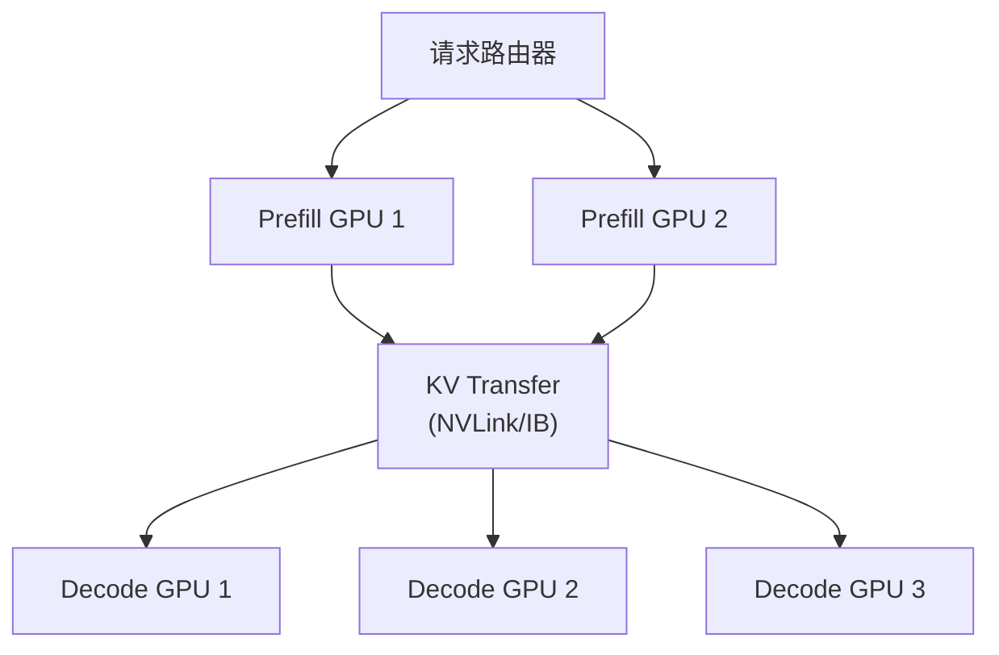

**收益边界**：PD 分离能隔离计算密集的 Prefill 与访存密集的 Decode，并允许独立扩缩；是否提升
取决于 KV 传输、路由、负载比例与拓扑。报告收益时必须绑定 SGLang 版本、模型、NVL/IB 拓扑、
输入/输出长度、并发和 TTFT/TPOT SLO，不能把某个 NVL72 演示结果泛化为固定倍数。

### 40.4.3 Speculative Decoding


**核心数学**: 接受率 = min(1, P_target(x) / P_draft(x))，保证生成分布一致。

**2026 主流变体**:
- **EAGLE-3**: 训练式特征级 proposer，收益取决于目标模型支持与接受率
- **DFlash**: 并行 draft/verify 研究路线，需核对模型与引擎实现
- **Medusa**: 多头并行预测
- **n-gram**: 无需训练

### 40.4.4 量化阶梯 (Quantization Ladder)

| 格式 | 名义位宽 | 原始权重字节/FP32 | 质量与兼容性边界 | 常见引擎 |
|------|---------|------------------|-------------------|---------|
| FP32 | 32 | 1 | 基线 | 通用 |
| FP16/BF16 | 16 | 约 1/2 | 数值范围不同，仍需任务回归 | 通用 |
| FP8 (E4M3/E5M2) | 8 | 约 1/4 | 依赖硬件、校准与算子支持 | vLLM/SGLang/TensorRT-LLM |
| **INT8 (W8A8)** | 8 | 约 1/4 | 对离群值和校准集敏感 | 依实现而定 |
| **MXFP4 / NVFP4** | 4 | 约 1/8 | 依赖缩放策略、模型配方与支持矩阵 | 以 NVIDIA/引擎文档为准 |
| **INT4 (AWQ/GPTQ)** | 4 | 约 1/8 | 权重量化；任务质量不可由位宽直接推断 | vLLM/SGLang/TensorRT-LLM |
| **GGUF Q4_K_M** | 4-bit 族 | 约 1/8，另有元数据开销 | 不同量化类型不可混为同一精度 | llama.cpp |

> 上表只比较原始权重存储量的理论阶次；总显存还包含量化 scale/zero-point、KV Cache、
> 激活、工作区和框架开销。任何“质量损失小/大”都必须在目标任务、模型版本和硬件上实测。

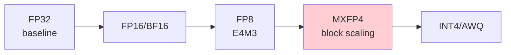

### 40.4.5 MoE 专家并行

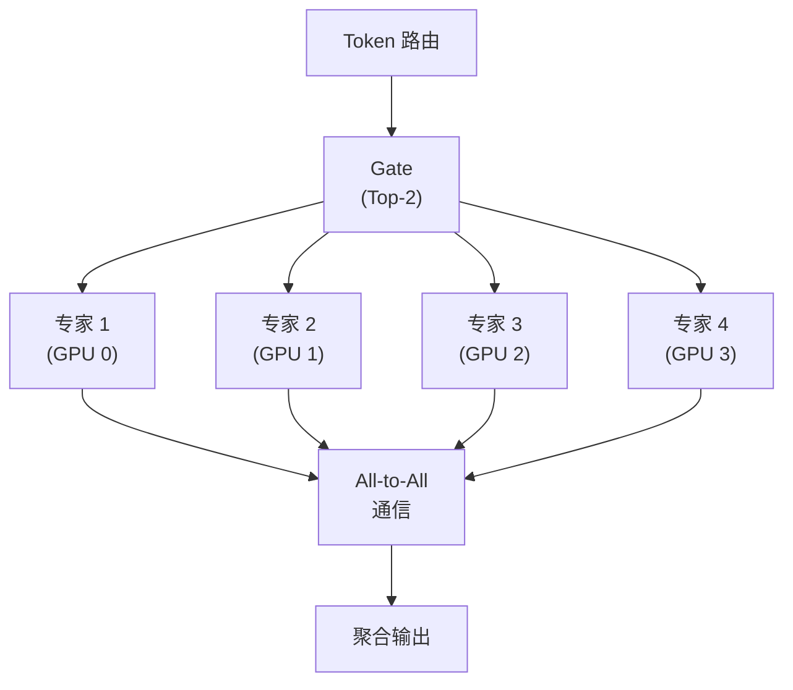

**关键模式**: Expert Parallelism (EP) + Tensor Parallel (TP) + Pipeline Parallel (PP) 混合。

### 40.4.6 稀疏注意力 (Long-Context 推理)

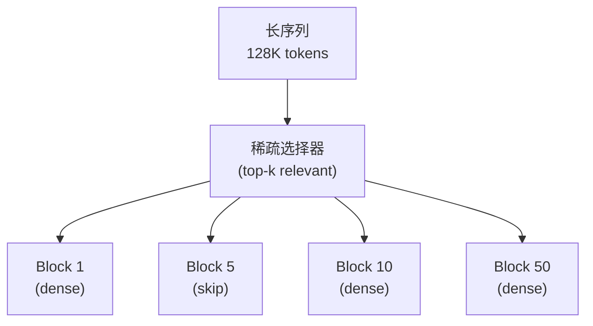

**实现边界**：稀疏注意力首先是模型/算子设计，例如 DeepSeek-V4 公布的 DSA；推理引擎还需提供
匹配的算子和调度支持。不要把所有长上下文优化都称为稀疏注意力——Paged KV Cache、
Chunked Prefill、量化和上下文并行是不同路径，必须按模型版本与引擎兼容矩阵验收。
## 🧭 本章小结

- 推理优化技术 ⭐⭐⭐⭐⭐：能够说清问题、机制、证据与边界。
- 模型量化与压缩 ⭐⭐⭐：能够说清问题、机制、证据与边界。
- 推理核心原理：能够说清问题、机制、证据与边界。

## ✅ 自测与练习

1. 不看正文，解释“推理优化技术 ⭐⭐⭐⭐⭐”解决什么问题，并给出一个不适用场景。
2. 为“模型量化与压缩 ⭐⭐⭐”设计一个最小可复现实验，明确输入、指标和通过条件。
3. 比较“推理核心原理”的至少两种方案，说明质量、成本、延迟或风险取舍。

## 🧪 配套代码与验收

- `code/ch30_lora_qlora/`
- `code/ch41_inference_engines/`

```powershell
python code/scripts/run_all_examples.py --chapter ch30 --tier core
python code/scripts/run_all_examples.py --chapter ch41 --tier core
```

默认验收不下载模型、不调用付费 API；真实 API 或 GPU 示例必须按 metadata 显式启用。成功标准是相关脚本输出 `OK`，条件不足时输出可解释的 `[SKIP]`。

## 🎯 面试题精讲

回答本章问题时使用四步结构：先给结论，再解释机制，然后给项目证据，最后主动说明适用边界。涉及性能或效果时，补充模型、硬件、数据、并发、版本和统计口径；条件不完整时明确说“需要实测”。

## 📋 本章速查表

| 主题 | 回答主线 |
|---|---|
| 推理优化技术 ⭐⭐⭐⭐⭐ | 问题 → 机制 → 示例 → 指标 → 边界 |
| 模型量化与压缩 ⭐⭐⭐ | 问题 → 机制 → 示例 → 指标 → 边界 |
| 推理核心原理 | 问题 → 机制 → 示例 → 指标 → 边界 |
| 关键优化技术 | 问题 → 机制 → 示例 → 指标 → 边界 |

## 🔗 相关章节

- [[39_AI隐私伦理与治理|第 39 章 AI 隐私、伦理与治理]]
- [[41_高性能推理引擎与服务|第 41 章 高性能推理引擎与服务]]

## 📖 一手参考资料

> 核验基线：2026-07-31；结构复核：2026-08-05。产品、API、法规、价格与 benchmark 会变化，使用前应再次核验。

- [[docs/AUTHORITATIVE_SOURCES|章节权威来源索引]]：按主题维护官方文档、标准、原论文和官方仓库。
