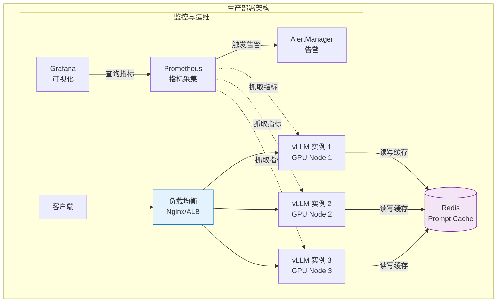
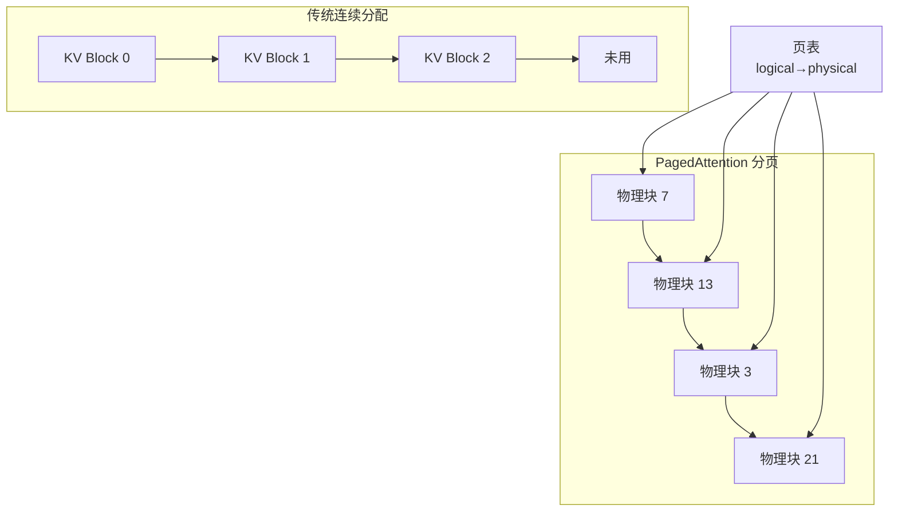
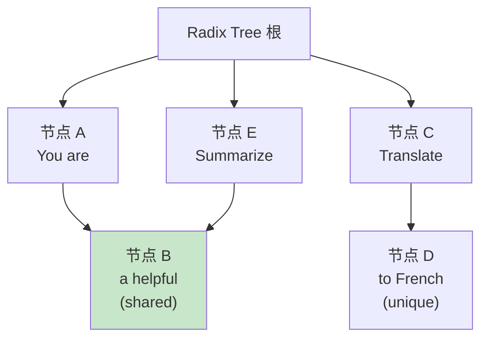
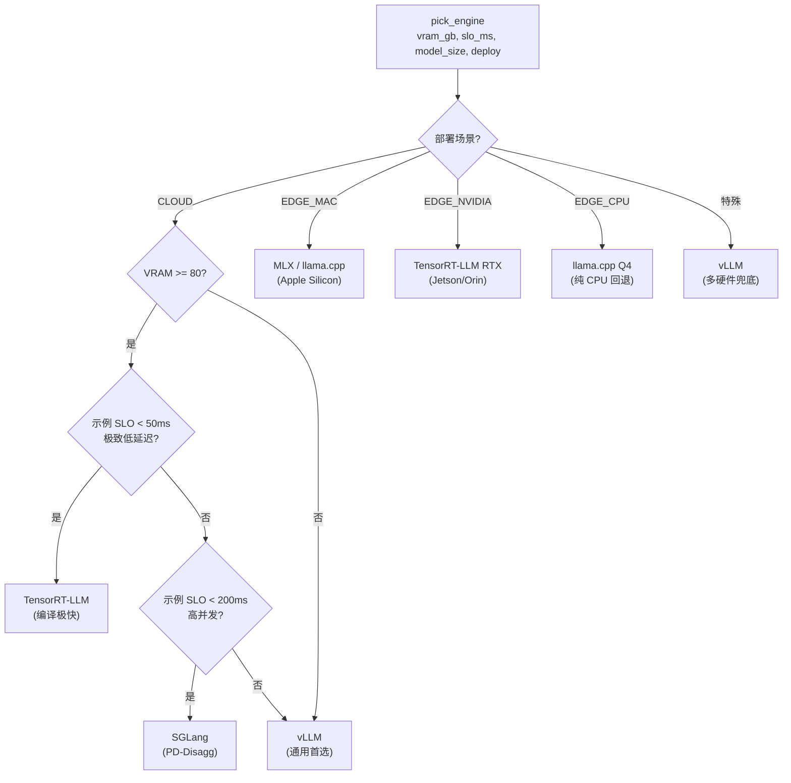

# 第 41 章 高性能推理引擎与服务 ⭐⭐⭐⭐
> [!abstract] 本章导航
> **定位**：第六部分 推理服务与 LLMOps中的第 41 章；围绕“高性能推理引擎与服务”建立单一、可追踪的知识主线。
>
> **先修**：[[40_推理内存量化与批处理|第 40 章 推理内存、量化与批处理]]。
>
> **学习目标**：
> - 解释 模型部署 ⭐⭐⭐⭐ 的核心问题、机制与适用边界。
> - 实现或评估 推理引擎的集群化集成 的最小闭环。
> - 使用可复现证据诊断 主流推理引擎对比 的工程取舍与失败模式。
>
> **建议路径**：模型部署 ⭐⭐⭐⭐ → 推理引擎的集群化集成 → 主流推理引擎对比 → vLLM 部署实战 → 推理引擎选型决策树。
>
> **配套代码**：`code/ch41_inference_engines/`。

本章先回答“模型部署 ⭐⭐⭐⭐”为什么成立，再沿着机制、实现、评估和边界逐步展开。阅读时先建立因果链，再运行或推演示例，最后用章末自测检查能否脱离原文复述。
## 41.1 模型部署 ⭐⭐⭐⭐

### 41.1.1 部署框架对比（2026年更新）

| 维度 | vLLM | TensorRT-LLM | llama.cpp | Xinference 🆕 |
|------|------|--------------|-----------|--------------|
| **定位** | **高吞吐服务** | **低延迟推理** | **跨平台本地部署** | **开源模型推理平台** |
| **GPU 支持** | ✅ CUDA/ROCm（以版本支持矩阵为准） | ✅ NVIDIA | ✅ CUDA/Vulkan/Metal | ✅ CUDA |
| **CPU 支持** | 不是主要目标 | 不是主要目标 | ✅ **核心优势** | ✅ |
| **量化** | AWQ/GPTQ/FP8 等 | FP8/INT8/INT4 等 | GGUF/Q4/Q5/Q8 | 取决于所选后端 |
| **关键特性** | PagedAttention + Continuous Batching | NVIDIA kernel 优化 | 消费级硬件友好 | 统一管理多模型 |
| **部署方式** | OpenAI-compatible API | Python/C++ runtime | 独立二进制/绑定 | REST API + Web UI |
| **适用场景** | **生产 GPU 集群** | **高性能 NVIDIA 环境** | **Mac/边缘设备/CPU** | **中小规模模型管理** |

> 版本号变化很快。表中能力按 **2026-07-31** 的公开文档归类；实施时应锁定依赖版本并核对对应 release notes。

### 41.1.2 vLLM 部署实战

```python
"""
vLLM 部署大模型服务 - 完整实战
"""
from vllm import LLM, SamplingParams
from fastapi import FastAPI, Request
from pydantic import BaseModel
import uvicorn

# ========== 方式1：脚本直接推理 ==========

def vllm_direct_inference():
    """直接使用 vLLM 推理"""

    # 加载模型（自动启用 PagedAttention + Continuous Batching）
    llm = LLM(
        model="Qwen/Qwen2.5-7B-Instruct",
        tensor_parallel_size=1,      # GPU 数量
        gpu_memory_utilization=0.85,  # GPU 显存利用率上限
        max_model_len=4096,           # 最大序列长度
        quantization=None,            # 或 "awq" / "gptq" / "fp8"
    )

    # 采样参数
    sampling_params = SamplingParams(
        temperature=0.7,
        top_p=0.9,
        max_tokens=512,
    )

    # 批量推理
    prompts = [
        "请用一句话介绍机器学习。",
        "什么是深度学习？",
        "Transformer 架构的核心思想是什么？",
    ]

    outputs = llm.generate(prompts, sampling_params)

    for prompt, output in zip(prompts, outputs):
        print(f"Prompt: {prompt}")
        print(f"Output: {output.outputs[0].text}")
        print()


# ========== 方式2：FastAPI 服务封装 ==========

app = FastAPI(title="LLM Inference Service")

# 全局模型（启动时加载）
llm_engine: LLM = None

class InferenceRequest(BaseModel):
    prompt: str
    temperature: float = 0.7
    top_p: float = 0.9
    max_tokens: int = 512

class InferenceResponse(BaseModel):
    text: str
    usage: dict

@app.on_event("startup")
def load_model():
    """服务启动时加载模型"""
    global llm_engine
    llm_engine = LLM(
        model="Qwen/Qwen2.5-7B-Instruct",
        tensor_parallel_size=1,
        gpu_memory_utilization=0.9,
        max_model_len=8192,
    )
    print("模型加载完成")

@app.post("/v1/chat/completions", response_model=InferenceResponse)
async def chat_completion(request: InferenceRequest):
    """兼容 OpenAI 格式的 Chat Completion API"""

    sampling_params = SamplingParams(
        temperature=request.temperature,
        top_p=request.top_p,
        max_tokens=request.max_tokens,
    )

    outputs = llm_engine.generate(request.prompt, sampling_params)
    generated_text = outputs[0].outputs[0].text

    # 统计 token 使用量
    input_tokens = len(outputs[0].prompt_token_ids)
    output_tokens = len(outputs[0].outputs[0].token_ids)

    return InferenceResponse(
        text=generated_text,
        usage={
            "prompt_tokens": input_tokens,
            "completion_tokens": output_tokens,
            "total_tokens": input_tokens + output_tokens,
        }
    )

@app.get("/health")
def health():
    return {"status": "healthy", "model_loaded": llm_engine is not None}


# ========== 方式3：Docker 容器化部署 ==========

"""
Dockerfile 示例：

FROM vllm/vllm-openai:latest

# 设置环境变量
ENV MODEL_NAME="Qwen/Qwen2.5-7B-Instruct"
ENV TENSOR_PARALLEL_SIZE=1

# 暴露端口
EXPOSE 8000

# 启动 OpenAI-compatible 服务
ENTRYPOINT python -m vllm.entrypoints.openai.api_server \
    --model ${MODEL_NAME} \
    --tensor-parallel-size ${TENSOR_PARALLEL_SIZE} \
    --gpu-memory-utilization 0.85 \
    --max-model-len 8192 \
    --port 8000

构建和运行：
docker build -t llm-service .
docker run --gpus all -p 8000:8000 -e MODEL_NAME="Qwen/Qwen2.5-7B-Instruct" llm-service

调用方式（OpenAI SDK 兼容）：
import openai
client = openai.OpenAI(base_url="http://localhost:8000/v1", api_key="dummy")
response = client.chat.completions.create(
    model="Qwen/Qwen2.5-7B-Instruct",
    messages=[{"role": "user", "content": "Hello!"}]
)
"""


if __name__ == "__main__":
    # 启动 FastAPI 服务
    uvicorn.run(app, host="0.0.0.0", port=8000)
```

### 41.1.3 Xinference 部署

Xinference 是 2025-2026 年崛起的**开源模型推理平台**，定位是"模型推理的 Kubernetes"——统一管理多种模型的部署、扩缩容和监控。

```python
"""
🆕 Xinference 部署示例 —— 2026年推荐的多模型管理方案
"""
# 安装: pip install xinference

# 启动 Xinference 服务
# xinference-local --host 0.0.0.0 --port 9997

from xinference.client import Client

client = Client("http://localhost:9997")

# 列出可用的内置模型
print(client.list_models())

# 部署模型（自动下载 + 启动推理服务）
model_uid = client.launch_model(
    model_name="qwen2.5-instruct",  # 模型名称
    model_size_in_billions=7,       # 7B 参数
    model_format="pytorch",         # 格式
    quantization="none",            # 不量化（或 "4-bit", "8-bit"）
    n_gpu=1,                        # GPU 数量
)

# 获取模型句柄，进行推理
model = client.get_model(model_uid)
response = model.chat(
    messages=[{"role": "user", "content": "你好！"}],
    generate_config={"temperature": 0.7, "max_tokens": 512}
)
print(response["choices"][0]["message"]["content"])

# 停止模型释放资源
client.terminate_model(model_uid)
```

**Xinference vs vLLM 直接部署**：

| 维度 | vLLM 直接部署 | Xinference |
|------|--------------|-----------|
| **模型管理** | 手动管理每个模型 | 统一管理，Web UI 操作 |
| **多模型** | 每个模型一个服务 | 一个平台管理多个模型 |
| **自动扩缩** | 需配合 K8s HPA | 内置自动扩缩容 |
| **适用规模** | 大规模生产 | **中小规模、快速迭代** |
| **上手难度** | 中（需配置） | 低（一键启动） |

### 41.1.4 DeepSeek 系列模型部署：选择公开可验证的后端

截至 **2026-07-31**，本节只保留 DeepSeek 官方组织可核验的公开模型与通用部署后端；原稿中无法由官方仓库、PyPI 和 release notes 复现的端侧引擎名及示例 API 已删除。教程、简历或生产方案都不应引用不可复现的产品/API。

DeepSeek-R1 Distill 等公开权重应使用模型卡给出的准确组织名（例如 `deepseek-ai/...`），再按目标硬件选择公开后端。吞吐必须注明模型文件、量化格式、上下文、batch、硬件和软件版本，不能给出脱离测试条件的固定 tokens/s。

**部署方案选择**：

| 场景 | 方案 | 模型 | 硬件 |
|------|------|------|------|
| **端侧（手机/IoT）** | MLC-LLM / ExecuTorch（先核对模型支持） | 小参数蒸馏或量化模型 | 手机 NPU / 嵌入式 |
| **个人 PC** | llama.cpp + GGUF | DeepSeek-R1-Distill-Qwen 系列 | 消费级 GPU / Apple Silicon / CPU |
| **边缘服务器** | vLLM + AWQ | DeepSeek-R1-Distill-14B/32B | A10 / L4 |
| **云端生产** | vLLM + TensorRT-LLM | DeepSeek-V3 / DeepSeek-R1 | A100 / H100 |

参考：[DeepSeek 官方 GitHub](https://github.com/deepseek-ai)、[DeepSeek-R1 模型仓库](https://github.com/deepseek-ai/DeepSeek-R1)。

### 41.1.5 部署架构最佳实践



**生产部署关键考量**：

| 维度 | 建议 |
|------|------|
| **GPU 选型** | A100/H100 用于高吞吐，L4/A10 用于成本敏感场景 |
| **批处理** | 使用 vLLM 的 Continuous Batching，配合动态 batching 参数 |
| **负载均衡** | 按 token 数量路由（而非请求数），避免单节点过载 |
| **Prompt Cache** | 对 System Prompt 做前缀缓存，减少重复计算 |
| **自动扩缩容** | 基于 GPU 利用率和队列长度做 HPA |
| **优雅降级** | 队列满时返回 429，避免 OOM |

## 41.2 推理引擎的集群化集成

> **本章定位**：传统 K8s 章节解决了"如何把模型服务跑起来"，本节聚焦"如何把 2026 年主流推理引擎（vLLM/SGLang/TRT-LLM/MLC/llama.cpp）以最优拓扑跑在 K8s 上"。涵盖 PD 分离、MoE 专家并行、FP4 量化阶梯、Speculative Decoding、跨硬件可移植性以及新兴的 Ollama Cloud / Anthropic Managed Agents 等部署形态。

### 41.2.1 主流推理引擎的 K8s 适配全景

| 推理引擎 | 核心优势 | 2026 状态 | K8s 部署形态 | 适用模型规模 |
|---------|---------|-----------|-------------|------------|
| **vLLM** | PagedAttention、Continuous Batching、Prefix Cache 工业级成熟 | v1.0 稳定，V1 Engine 单架构 | Deployment + Helm Chart，operator 雏形 | 7B–700B 通用 LLM |
| **SGLang** | RadixAttention、结构化生成 DSL、端到端低延迟 | v0.4，PD-Disaggregation 一等公民 | Helm + 自定义 CRD | 推理规划、Agent、长上下文 |
| **TensorRT-LLM** | NVIDIA 极致优化、In-flight Batching、FP4/FP8 原生 | v1.0 整合 Triton/TRT | Triton Inference Server on K8s | NVIDIA 硬件、生产级高 QPS |
| **MLC-LLM** | 端侧/边缘编译、跨硬件统一 IR（TVM/MLC） | v0.20+ 支持 WebGPU/Metal/Vulkan | K8s Job 模式 + 边缘节点调度 | 7B–13B 边缘/端侧 |
| **llama.cpp** | GGUF 量化矩阵、CPU/Apple Silicon 友好 | b5000+ 支持 MoE、Speculative | K8s + hostPath（GPU passthrough 可选） | 1B–70B（轻量部署） |

**典型 Helm Chart 骨架（vLLM + SGLang 共用模式）：**

```yaml
# charts/llm-inference/Chart.yaml
apiVersion: v2
name: llm-inference
description: Production-grade LLM inference stack (vLLM / SGLang / TRT-LLM)
type: application
version: 1.6.0
appVersion: "2026.06"
maintainers:
  - name: Platform Team
keywords:
  - llm
  - vllm
  - sglang
  - inference
dependencies:
  - name: nvidia-device-plugin
    version: "0.17.0"
    repository: https://nvidia.github.io/k8s-device-plugin
  - name: dcgm-exporter
    version: "4.0.0-rc.1"
    repository: https://nvidia.github.io/dcgm-exporter

---
# charts/llm-inference/values.yaml
engine:
  type: vllm               # vllm | sglang | trtllm | mlc | llamacpp
  version: "1.0.0"
  model:
    id: "Qwen/Qwen3-Next-80B-A3B-Instruct"
    mountPath: /models
    pvc: model-weights-pvc
  parallel:
    tensorParallelSize: 4
    pipelineParallelSize: 1
    expertParallelSize: 8       # MoE 专家并行
    dataParallelSize: 2         # 副本维度
  quant:
    format: nvfp4               # fp4 | nvfp4 | mxfp4 | awq | gptq | gguf
    kvCacheDtype: fp8
    activation: fp8
  speculative:
    enabled: true
    method: eagle3               # eagle3 | medusa | ngram | draft-model
    draftModel: "Qwen/Qwen3-0.6B"
    numSpeculativeTokens: 5
  pdDisaggregation:
    enabled: true
    transport: nixl              # nixl | ucx | gloo | rdma
    prefillRoster:
      replicas: 2
      gpusPerPod: 4
    decodeRoster:
      replicas: 8
      gpusPerPod: 1

hardware:
  gpu:
    product: "B200"              # 节点标签选择
    memory: "180Gi"
    mig: false
  fabric:
    nvlink: true
    nvswitch: true
    roce: false

network:
  serviceType: ClusterIP
  ingress:
    enabled: true
    host: llm.example.com
    tls:
      secretName: llm-tls
  serviceMesh: istio              # istio | linkerd | none

autoscaling:
  hpa:
    enabled: true
    minReplicas: 2
    maxReplicas: 16
    metrics:
      - type: Pods
        pods:
          metric:
            name: vllm:num_requests_waiting
          target:
            type: AverageValue
            averageValue: "8"
  vpa: false
  keda:
    enabled: true
    prometheusAddress: http://prometheus.monitoring:9090

observability:
  prometheus:
    enabled: true
    port: 9090
  otel:
    enabled: true
    endpoint: http://otel-collector:4317
  dashboards:
    - grafana://llm-inference-overview
    - grafana://pd-disaggregation-heatmap

---
# charts/llm-inference/templates/statefulset.yaml
apiVersion: apps/v1
kind: StatefulSet
metadata:
  name: {{ include "llm-inference.fullname" . }}-{{ .Values.engine.type }}
  labels:
    engine: {{ .Values.engine.type }}
    model: {{ .Values.engine.model.id | replace "/" "-" }}
spec:
  serviceName: {{ include "llm-inference.fullname" . }}
  replicas: {{ .Values.autoscaling.hpa.minReplicas }}
  selector:
    matchLabels:
      app: {{ include "llm-inference.name" . }}
  template:
    metadata:
      annotations:
        prometheus.io/scrape: "true"
        prometheus.io/port: "9090"
    spec:
      nodeSelector:
        nvidia.com/gpu.product: {{ .Values.hardware.gpu.product }}
      tolerations:
        - key: nvidia.com/gpu
          operator: Exists
          effect: NoSchedule
      containers:
        - name: {{ .Values.engine.type }}-server
          image: "{{ .Values.engine.type }}-runtime:{{ .Values.engine.version }}-cuda12.6"
          args:
            - --model={{ .Values.engine.model.mountPath }}/{{ .Values.engine.model.id }}
            - --tensor-parallel-size={{ .Values.engine.parallel.tensorParallelSize }}
            - --expert-parallel-size={{ .Values.engine.parallel.expertParallelSize }}
            - --quantization={{ .Values.engine.quant.format }}
            - --kv-cache-dtype={{ .Values.engine.quant.kvCacheDtype }}
            {{- if .Values.engine.pdDisaggregation.enabled }}
            - --enable-pd-disaggregation
            - --pd-transport={{ .Values.engine.pdDisaggregation.transport }}
            {{- end }}
            {{- if .Values.engine.speculative.enabled }}
            - --speculative-method={{ .Values.engine.speculative.method }}
            - --num-speculative-tokens={{ .Values.engine.speculative.numSpeculativeTokens }}
            {{- end }}
          resources:
            limits:
              nvidia.com/gpu: {{ .Values.hardware.gpu.memory | replace "Gi" "" | int | div 24 }}
              memory: 512Gi
          volumeMounts:
            - name: model-weights
              mountPath: {{ .Values.engine.model.mountPath }}
              readOnly: true
            - name: dshm
              mountPath: /dev/shm
  volumeClaimTemplates:
    - metadata:
        name: model-weights
      spec:
        accessModes: ["ReadOnlyMany"]
        storageClassName: ceph-rbd-ro
        resources:
          requests:
            storage: 1Ti
```

### 41.2.2 MoE 专家并行拓扑

MoE（Mixture of Experts）模型（如 Qwen3-Next-80B-A3B、DeepSeek-V3-671B）需要 **专家并行（Expert Parallelism, EP）**，与传统的 TP/PP 正交：

```text
┌─────────────────────────── MoE 块并行拓扑 ──────────────────────────┐
│                                                                      │
│  Node 1 (B200×8)                Node 2 (B200×8)                     │
│  ┌──────────────┐                ┌──────────────┐                    │
│  │ Expert 0     │                │ Expert 4     │                    │
│  │ Expert 1     │  ←─All-to-All─→│ Expert 5     │                    │
│  │ Expert 2     │   (NCCL/        │ Expert 6     │                    │
│  │ Expert 3     │    NVLink)      │ Expert 7     │                    │
│  └──────────────┘                └──────────────┘                    │
│       ↑                               ↑                              │
│  Shared Expert                  Shared Expert                       │
│  (TP=4 切分)                    (TP=4 切分)                         │
│       ↑                               ↑                              │
│  Dense 层                        Dense 层                           │
│  (TP=4)                           (TP=4)                             │
│                                                                      │
│  关键参数：                                                          │
│   - EP=8  (专家分散到 8 张卡)                                        │
│   - TP=4  (Attention/Dense 内部张量并行)                             │
│   - PP=1  (流水线一般不开，因 All-to-All 频次高)                    │
│   - All-to-All 通信量：O(seq_len × hidden × num_experts_per_tok)    │
└──────────────────────────────────────────────────────────────────────┘
```

**K8s 中的 MoE 调度约束：**

```yaml
# MoE 推理 Pod 的调度关键 — 必须保证 Expert Parallel 维度的卡在同一 NVLink Domain
spec:
  schedulerName: volcano       # 使用 Volcano 做 Gang Scheduling
  affinity:
    podAntiAffinity:
      requiredDuringSchedulingIgnoredDuringExecution:
        - labelSelector:
            matchLabels:
              role: moe-prefill
          topologyKey: kubernetes.io/hostname   # 同一 Node
    nodeAffinity:
      requiredDuringSchedulingIgnoredDuringExecution:
        nodeSelectorTerms:
          - matchExpressions:
              - key: nvidia.com/gpu.nvlink-domain
                operator: In
                values: ["single-domain-8gpu"]  # 8 卡同域
  topologySpreadConstraints:
    - maxSkew: 1
      topologyKey: topology.kubernetes.io/zone
      whenUnsatisfiable: ScheduleAnyway
```

### 41.2.3 FP4 / NVFP4 / MXFP4 量化阶梯

| 量化格式 | 名义位宽 | 常见硬件/后端 | 质量验收 | 适用场景 |
|---------|----------|---------|---------|---------|
| **FP16/BF16** | 16 | 主流加速器 | 作为任务级基线 | 训练、对质量敏感 |
| **INT8 (W8A8)** | 8 | 依引擎兼容矩阵 | 对目标集回归 | 通用推理 |
| **FP8 (E4M3 / E5M2)** | 8 | 支持 FP8 的加速器/内核 | 对目标集回归 | 数据中心推理 |
| **AWQ / GPTQ (INT4)** | 4 | 依模型与引擎实现 | 校准集与目标集回归 | 显存受限 |
| **NVFP4 (E2M1 + 块缩放)** | 4 | Blackwell 与兼容引擎 | 对 checkpoint/任务回归 | Blackwell 推理 |
| **MXFP4** | 4 | 以硬件和引擎版本文档为准 | 对 checkpoint/任务回归 | 支持该格式的后端 |
| **GGUF Q4_K / Q2_K** | 约 4–2 | llama.cpp 支持平台 | 按量化类型和任务回归 | 端侧 / 边缘 |

名义位宽不是完整运行内存，也不能推出统一“精度损失”；还要计入 scale/metadata、
KV Cache、激活与工作区，并用相同模型 revision、数据集和解码参数对比。

**vLLM NVFP4 部署示例：**

```bash
# 在兼容的 Blackwell 节点加载已验证的 NVFP4 checkpoint
vllm serve /models/<compatible-nvfp4-checkpoint> \
  --quantization nvfp4 \
  --kv-cache-dtype fp8 \
  --tensor-parallel-size 8 \
  --max-model-len 65536 \
  --enable-prefix-caching \
  --enable-pd-disaggregation
```

**量化的部署侧决策树：**

```text
┌─── 你的硬件是什么？─────────────────────────────────────┐
│                                                            │
├─ NVIDIA B200/H200 ─→ NVFP4 (首选) / FP8 (次选)           │
├─ NVIDIA A100/H100 ─→ FP8 (H100) / INT8 AWQ (A100)        │
├─ Google TPU v5e/v6 ─→ BF16 / MXFP4                       │
├─ Intel Gaudi 2/3 ────→ BF16 / INT8 / MXFP4               │
├─ Huawei Ascend 910B ─→ BF16 / W8A8 (MindIE)              │
├─ Apple Silicon M3/M4 → GGUF Q4_K_M (llama.cpp)           │
└─ 普通 CPU x86 ──────→ GGUF Q4_K_M / INT4 (llama.cpp)     │
```

### 41.2.4 Speculative Decoding 作为部署期旋钮

Speculative Decoding（推测解码）是部署期性能旋钮：draft 先提出候选，target 再批量验证。
采用严格接受-拒绝校正的算法可以保持 target 分布；工程变体若改变采样或使用近似验证，仍需做
质量回归。吞吐收益不是算法名称对应的固定常数，主要受接受率、draft/target 速度比、候选长度、
batch、输入/输出长度、并发、硬件和实现版本影响。原始算法边界见
[Leviathan et al., 2023](https://arxiv.org/abs/2211.17192)。

| 方法 | 候选来源 | 主要额外资源 | 部署与验收要点 |
|------|---------|-------------|---------------|
| **EAGLE-3** | 轻量特征/草稿模块 | 草稿权重与验证开销 | 同 Pod 常见；记录接受率、TPOT、吞吐与显存 |
| **Medusa** | 同模型的多个预测头 | 额外预测头 | 与基座版本严格匹配，做质量回归 |
| **n-gram** | 已有文本片段匹配 | 索引/匹配开销 | 前缀重复高时更可能受益 |
| **Draft Model** | 独立小模型 | 小模型权重与 KV | 优先同进程/同 Pod；跨 Pod 需证明传输成本可接受 |
| **Self-Speculative** | 同模型浅层/跳层 | 控制逻辑与验证开销 | 收益依模型结构和退出策略实测 |

**SGLang 启用 EAGLE-3 Speculative Decoding：**

```bash
python -m sglang.launch_server \
  --model /models/Qwen3-Next-80B-A3B \
  --speculative-algorithm EAGLE3 \
  --speculative-draft-model-path /models/Qwen3-0.6B-EAGLE3 \
  --speculative-num-steps 5 \
  --speculative-eagle-topk 8 \
  --speculative-num-draft-tokens 32
```

### 41.2.5 推理引擎选型决策速查（2026）

| 场景 | 候选 | 首要验证项 |
|------|------|------------|
| 通用数据中心推理 | vLLM / SGLang | 模型支持、continuous batching、prefix cache、SLO |
| PD 分离或长上下文 | vLLM / SGLang 的对应实现 | KV 传输后端、拓扑、TTFT/TPOT 与失败恢复 |
| NVIDIA 编译优化 | TensorRT-LLM | GPU/驱动矩阵、构建时间、模型与量化支持 |
| 浏览器/移动端 | MLC-LLM / WebLLM / llama.cpp | 设备覆盖、包体、内存、能耗与首包延迟 |
| CPU/小模型 | llama.cpp | GGUF 量化质量、线程/NUMA 与吞吐 |
| 快速本地原型 | Ollama | 当前模型清单、本地/云端数据边界 |
| 私网工具执行 | 自建 worker、Managed Agents self-hosted sandbox、MCP Tunnel | 工具输入/输出的数据流、身份、网络与审计 |

成本不能用脱离云区、GPU 单价、利用率、模型、量化、输入/输出比例和副本数的固定
`$/M tokens` 表示。统一用 `总基础设施与平台成本 / 成功输出 token` 计算，并同时报告
SLO 达标率与空闲容量。

## 41.3 主流推理引擎对比

| 引擎 | 核心特性 | 最佳场景 | 维护方 | 生产成熟度 |
|------|---------|---------|--------|-----------|
| **vLLM** | PagedAttention, Continuous Batching | 通用 LLM 部署 | UC Berkeley / Anyscale | ⭐⭐⭐⭐⭐ |
| **SGLang** | RadixAttention, PD-Disaggregation | 高并发生产部署 | LMSYS / Stanford | ⭐⭐⭐⭐⭐ |
| **TensorRT-LLM** | 极致优化, NVIDIA 生态 | NVIDIA GPU 生产部署 | NVIDIA | ⭐⭐⭐⭐⭐ |
| **MLC-LLM** | 跨平台编译 | 移动端/边缘 | CMU | ⭐⭐⭐⭐ |
| **llama.cpp** | CPU/Mac/嵌入式 | 本地推理, GGUF 格式 | 社区 (ggerganov) | ⭐⭐⭐⭐⭐ |
| **TokenSpeed** | Agent 工作负载、混合前缀缓存、PD 状态传输 | Qwen3.5/B200 等受支持环境 | LightSeek Foundation | 新兴，按 release 验证 |

### 41.3.1 vLLM 核心：PagedAttention

传统 KV Cache 管理是连续分配（浪费显存，易碎片化）。PagedAttention 借鉴操作系统的虚拟内存 + 页表思想：



**收益边界**：PagedAttention 论文报告 KV Cache 接近零浪费；其原始 vLLM 实验在论文指定的模型、
请求分布与硬件上，相对 FasterTransformer/Orca 在相同延迟水平获得 2–4× 吞吐。该数字不是
PagedAttention 单一机制或任意版本的通用保证，复现时必须固定引擎 commit、模型、输入/输出长度、
并发、硬件与延迟 SLO。来源：
[PagedAttention/vLLM 论文](https://arxiv.org/abs/2309.06180)。

### 41.3.2 SGLang 核心：RadixAttention

SGLang 的 RadixAttention 自动识别相同的前缀，共享 KV Cache：



**适用场景**: 高 QPS 系统、Few-shot Prompt、对话系统中"system prompt 共享"。

### 41.3.3 TensorRT-LLM 核心特性

- **Engine 编译**：提前将模型编译为针对特定硬件的优化引擎
- **In-flight batching**：动态 batching
- **Kernel fusion**：融合 Attention/MLM 算子
- **支持 Speculative Decoding、EAGLE-3、Medusa**

### 41.3.4 llama.cpp 核心：GGUF 格式

GGUF (GPT-Generated Unified Format) 是 llama.cpp 的标准模型格式：

- 支持 CPU/GPU/混合
- 4-bit 量化（Q4_K_M、Q5_K_M）
- Apple Silicon Metal 加速

### 41.3.5 TokenSpeed：推理引擎，不是训练流水线

PyTorch 官方 2026-05-27 文章将 TokenSpeed 定位为面向 Agent 工作负载的开源 **LLM 推理引擎**。公开的“约 580 tok/s”结果来自 Qwen3.5-397B-A17B-NVFP4 在 B200、TP8、batch=1 等特定设置下的单用户解码测试，不能外推成其他模型、硬件或并发下的通用性能，更不能写成训练吞吐。

复现时至少固定 commit/镜像、模型与量化、GPU 与 TP/EP、输入/输出长度、并发和前缀命中率，并同时报告 TTFT、TPOT/ITL 与吞吐。来源：[PyTorch 官方 TokenSpeed 文章](https://pytorch.org/blog/up-to-580tps-new-speed-record-of-qwen3-5-397b-a17b-on-gpu-for-agentic-workloads-with-tokenspeed/)（截至 2026-07-31）。

## 41.4 vLLM 部署实战

```python
# vLLM 部署 7B 模型示例
from vllm import LLM, SamplingParams

llm = LLM(
    model="meta-llama/Llama-2-7b-chat-hf",
    tensor_parallel_size=2,
    gpu_memory_utilization=0.9,
    max_num_batched_tokens=8192,
    enable_prefix_caching=True,
    quantization="awq"  # 或 "fp8" / "gptq"
)

sampling_params = SamplingParams(
    temperature=0.7,
    top_p=0.9,
    max_tokens=512
)

# 批处理请求 (Continuous Batching)
prompts = ["Hello, my name is", "The capital of France is"]
outputs = llm.generate(prompts, sampling_params)
for output in outputs:
    print(output.outputs[0].text)
```

### 41.4.1 vLLM 启动参数速查

| 参数 | 说明 |
|------|------|
| `--tensor-parallel-size N` | 张量并行度 |
| `--pipeline-parallel-size N` | 流水线并行度 |
| `--gpu-memory-utilization` | GPU 显存使用率 (0-1) |
| `--max-num-batched-tokens` | 批处理最大 token 数 |
| `--enable-prefix-caching` | 启用 prefix cache (SGLang 称 RadixAttention) |
| `--quantization` | 量化方式 (awq/gptq/fp8/squeezellm) |
| `--speculative-config` | 投机解码方法、draft 模型与 token 数等配置 |
| `--enable-chunked-prefill` | 启用 chunked prefill (混合 PD 调度) |
| `--kv-cache-dtype` | KV Cache 精度 (fp8/auto) |

## 41.5 推理引擎选型决策树

下面这张 mermaid 完整映射了 `12_engine_selection_decision_tree.py` 中 `pick_engine()` 的 7 个推荐分支（云端 + 三种端侧 + 极端情况），所有分支都已被代码枚举覆盖：



`pick_engine()` 输出结构（dataclass 简化）：

```python
@dataclass
class EngineRecommendation:
    primary: str          # 推荐引擎
    rationale: list[str]  # 关键理由
    fallback: str         # 备选引擎
    notes: str            # 硬件 / 依赖警告
```

**使用示例**（无需 GPU，纯逻辑跑通）：

```bash
cd code/
python ch41_inference_engines/gpu/12_engine_selection_decision_tree.py
# 预期输出: 7 个场景的引擎推荐 + 理由 + 备选
```
## 🧭 本章小结

- 模型部署 ⭐⭐⭐⭐：能够说清问题、机制、证据与边界。
- 推理引擎的集群化集成：能够说清问题、机制、证据与边界。
- 主流推理引擎对比：能够说清问题、机制、证据与边界。

## ✅ 自测与练习

1. 不看正文，解释“模型部署 ⭐⭐⭐⭐”解决什么问题，并给出一个不适用场景。
2. 为“推理引擎的集群化集成”设计一个最小可复现实验，明确输入、指标和通过条件。
3. 比较“主流推理引擎对比”的至少两种方案，说明质量、成本、延迟或风险取舍。

## 🧪 配套代码与验收

- `code/ch41_inference_engines/`

```powershell
python code/scripts/run_all_examples.py --chapter ch41 --tier core
```

默认验收不下载模型、不调用付费 API；真实 API 或 GPU 示例必须按 metadata 显式启用。成功标准是相关脚本输出 `OK`，条件不足时输出可解释的 `[SKIP]`。

## 🎯 面试题精讲

回答本章问题时使用四步结构：先给结论，再解释机制，然后给项目证据，最后主动说明适用边界。涉及性能或效果时，补充模型、硬件、数据、并发、版本和统计口径；条件不完整时明确说“需要实测”。

## 📋 本章速查表

| 主题 | 回答主线 |
|---|---|
| 模型部署 ⭐⭐⭐⭐ | 问题 → 机制 → 示例 → 指标 → 边界 |
| 推理引擎的集群化集成 | 问题 → 机制 → 示例 → 指标 → 边界 |
| 主流推理引擎对比 | 问题 → 机制 → 示例 → 指标 → 边界 |
| vLLM 部署实战 | 问题 → 机制 → 示例 → 指标 → 边界 |
| 推理引擎选型决策树 | 问题 → 机制 → 示例 → 指标 → 边界 |

## 🔗 相关章节

- [[40_推理内存量化与批处理|第 40 章 推理内存、量化与批处理]]
- [[42_PD分离推理与KV池化|第 42 章 PD 分离推理与 KV 池化]]

## 📖 一手参考资料

> 核验基线：2026-07-31；结构复核：2026-08-05。产品、API、法规、价格与 benchmark 会变化，使用前应再次核验。

- [[docs/AUTHORITATIVE_SOURCES|章节权威来源索引]]：按主题维护官方文档、标准、原论文和官方仓库。
