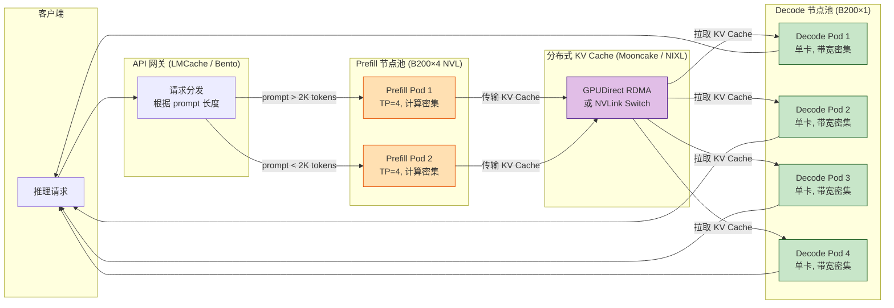
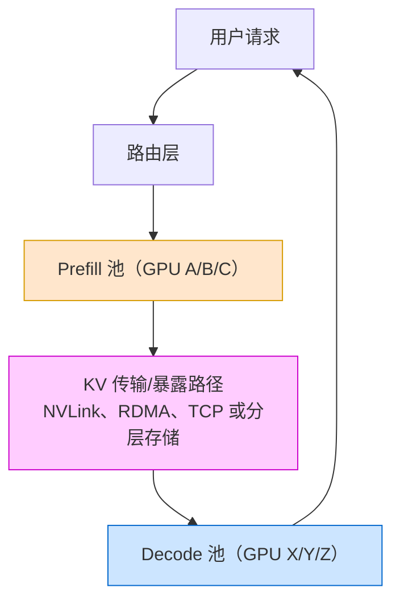

# 第 42 章 PD 分离推理与 KV 池化 ⭐⭐⭐⭐
> [!abstract] 本章导航
> **定位**：第六部分 推理服务与 LLMOps中的第 42 章；围绕“PD 分离推理与 KV 池化”建立单一、可追踪的知识主线。
>
> **先修**：[[41_高性能推理引擎与服务|第 41 章 高性能推理引擎与服务]]。
>
> **学习目标**：
> - 解释 PD 分离集群部署 的核心问题、机制与适用边界。
> - 实现或评估 PD 分离动机：Prefill vs Decode 差异 ⭐⭐⭐⭐⭐ 的最小闭环。
> - 使用可复现证据诊断 DistServe：早期代表性 PD 分离系统（OSDI 2024）⭐⭐⭐⭐ 的工程取舍与失败模式。
>
> **建议路径**：PD 分离集群部署 → PD 分离动机：Prefill vs Decode 差异 ⭐⭐⭐⭐⭐ → DistServe：早期代表性 PD 分离系统（OSDI 2024）⭐⭐⭐⭐ → Mooncake：KV Cache 池化与 RDMA 传输 ⭐⭐⭐⭐ → SGLang PD 模式：工程实操 ⭐⭐⭐⭐ → 工程权衡：跨节点延迟 vs 池化收益 ⭐⭐⭐ → 生产边界与面试表达。
>
> **配套代码**：`code/ch41_inference_engines/`。

本章先回答“PD 分离集群部署”为什么成立，再沿着机制、实现、评估和边界逐步展开。阅读时先建立因果链，再运行或推演示例，最后用章末自测检查能否脱离原文复述。
## 42.1 PD 分离集群部署
### 42.1.1 PD-Disaggregation on NVL（Prefill/Decode 分离）

**核心思想**：Prefill（计算密集型）和 Decode（显存带宽密集型）对硬件资源的需求完全不同，传统同 Pod 部署会造成算力与带宽的相互等待。PD-Disaggregation 把两个阶段拆分到不同 Pod，通过 NVLink-C2C（NVL）或 RDMA 互联。



**SGLang PD-Disaggregation 启动参数示例：**

```bash
# Prefill 节点
python -m sglang.launch_server \
  --model /models/Qwen3-Next-80B-A3B \
  --port 30000 \
  --disaggregation-mode prefill \
  --disaggregation-transfer-backend nixl \
  --tp-size 4 \
  --nccl-init-addr prefill-0.llm-svc:5000

# Decode 节点
python -m sglang.launch_server \
  --model /models/Qwen3-Next-80B-A3B \
  --port 30001 \
  --disaggregation-mode decode \
  --disaggregation-transfer-backend nixl \
  --tp-size 1 \
  --base-gpu-id 0
```

**验收模板（仓库未提供实测结果）：**

| 指标 | 传统同实例 | PD-Disaggregation | 还需记录 |
|------|------------|-------------------|----------|
| TTFT P50/P99 | 实测 | 实测 | Prefill 队列、输入长度 |
| TPOT/ITL P50/P99 | 实测 | 实测 | Decode 并发、输出长度 |
| tokens/s、req/s | 实测 | 实测 | 到达率与 SLO |
| KV 传输延迟/失败率 | 不适用 | 实测 | NVLink/IB/RDMA/NIXL 拓扑 |
| GPU 利用率与 OOM | 实测 | 分 Prefill/Decode 报告 | 实例数与扩缩策略 |

PD 分离能隔离 Prefill 与 Decode 并独立扩缩，但 KV 传输、路由和负载失配也可能抵消收益；
只有上述同流量 A/B 才能给出结论。

## 42.2 PD 分离动机：Prefill vs Decode 差异 ⭐⭐⭐⭐⭐

### 42.2.1 Prefill vs Decode 本质区别

| 维度 | Prefill | Decode |
|-----|---------|--------|
| 计算 | 计算密集（大批次 self-attention） | 访存密集（小批次 KV fetch） |
| 单请求每步 token 数 | 一次处理整段 prompt | 每个序列通常新增 1 token，可跨请求组成 batch |
| 时间分布 | 一次性（开始时） | 每 token（持续） |
| 资源需求 | 大 GPU 算力 | 大显存带宽 + 大显存（KV Cache） |
| 扩缩容 | 独立扩缩（Prefill 池） | 独立扩缩（Decode 池） |

### 42.2.2 PD 分离架构图



## 42.3 DistServe：早期代表性 PD 分离系统（OSDI 2024）⭐⭐⭐⭐

### 42.3.1 DistServe 核心思想

DistServe（OSDI 2024）：
1. 分离 Prefill 和 Decode 到不同 GPU 池
2. 分别围绕 TTFT 与 TPOT 优化资源数量和并行策略
3. 根据集群带宽做放置，降低阶段间 KV 传输成本
4. 用满足两类延迟约束的 **per-GPU goodput**，而非裸 token/s，衡量系统

### 42.3.2 DistServe 性能收益

论文在 OPT-13B/66B/175B、ShareGPT/HumanEval/LongBench 和其设定的 TTFT/TPOT 约束下报告：
- 在超过 90% 请求满足延迟约束时，最高可服务 **7.4×** 更多请求；
- 或在固定负载下承受最高 **12.6×** 更严格的 SLO。

这是论文特定基线、硬件、负载和 SLO 下的上界结果，不应写成任意部署都能获得的固定倍数，也不能直接
等同为成本降低比例。

原因：
- Prefill/Decode 可采用不同的资源数量和模型并行策略
- 消除长 prefill 对进行中 decode 的调度干扰
- 两个池可分别按 TTFT、TPOT 和到达率扩缩容

## 42.4 Mooncake：KV Cache 池化与 RDMA 传输 ⭐⭐⭐⭐

### 42.4.1 Mooncake 简介

Mooncake（Moonshot AI 发起并开源）包括：
- **Transfer Engine**：统一搬运 VRAM、DRAM、NVMe 中的数据，支持 TCP、InfiniBand/RoCE RDMA、
  GPUDirect、NVMe-oF、NVLink 等多种传输；
- **Mooncake Store**：基于 Transfer Engine 的分布式 KV Cache 存储，用于跨位置保存和复用 KV；
- 基于客户端的数据面可以是去中心化的，不能简单描述成一个“集中式 KV 池”。

### 42.4.2 RDMA 为何重要？

RDMA = Remote Direct Memory Access（远程直接内存访问）：
- 在注册内存和受支持网卡/协议下，让远端内存访问减少内核参与和中间拷贝
- 常可获得更低 CPU 开销、更高吞吐和更稳定的尾延迟
- 真实延迟取决于消息大小、NIC、交换网络、PCIe/NUMA、拥塞和软件栈；TCP 与 RDMA 都不存在跨环境通用的
  毫秒级保证

### 42.4.3 Mooncake 传输引擎

在直接 PD 传输中，decode 端通常先分配目标 KV 页并交换连接/地址元数据，prefill 端再把 KV 写入或发送到
decode 端；在分层缓存场景也可经 Mooncake Store 复用 DRAM/NVMe 中的 KV。具体流程取决于 SGLang、
vLLM 等上层引擎和所选后端。

```python
"""框架无关的接口示意；不是 Mooncake 的真实 Python API。"""
from typing import Protocol

class KVTransfer(Protocol):
    def register_target(self, request_id: str, layout: dict) -> str:
        """Decode 端分配 KV 页，返回不可伪造的传输句柄。"""
        ...

    def put(self, handle: str, kv_blocks, *, timeout_s: float) -> None:
        """Prefill 端按句柄传输；实现可选择 RDMA、TCP 或本机链路。"""
        ...

    def wait_ready(self, handle: str, *, timeout_s: float) -> None:
        """Decode 端等待完整性确认；超时必须清理预留页。"""
        ...
```

## 42.5 SGLang PD 模式：工程实操 ⭐⭐⭐⭐

### 42.5.1 SGLang PD 模式配置

SGLang 的 PD 角色由服务端命令行参数配置，不是 `sglang.Runtime(mode=...)`。下面命令来自官方文档的
单机双 GPU 结构；模型、网卡名、端口和版本必须按部署环境替换：

```bash
# Mooncake 路径：先在服务端环境安装当前文档要求的传输引擎
uv pip install mooncake-transfer-engine

# 终端 1：prefill-only；网卡名须替换为本机实际 IB/RoCE 设备
python -m sglang.launch_server \
  --model-path meta-llama/Llama-3.1-8B-Instruct \
  --disaggregation-mode prefill \
  --port 30000 \
  --disaggregation-ib-device mlx5_roce0

# 终端 2：decode-only
python -m sglang.launch_server \
  --model-path meta-llama/Llama-3.1-8B-Instruct \
  --disaggregation-mode decode \
  --port 30001 \
  --base-gpu-id 1 \
  --disaggregation-ib-device mlx5_roce0

# 终端 3：PD Router
python -m sglang_router.launch_router \
  --pd-disaggregation \
  --prefill http://127.0.0.1:30000 \
  --decode http://127.0.0.1:30001 \
  --host 0.0.0.0 --port 8000
```

跨节点 RDMA 还需在两端配置相容的 `--disaggregation-ib-device`、bootstrap 端口、驱动/容器权限和网络；
安装、参数名及支持矩阵随 SGLang release 变化，应锁定版本后再生成部署清单。

## 42.6 工程权衡：跨节点延迟 vs 池化收益 ⭐⭐⭐

### 42.6.1 何时该用 PD 分离？

| 场景 | 适用 PD 分离 | 原因 |
|-----|-------------|-----|
| 高并发多用户（在线聊天） | 候选，需同 trace A/B | Decode 可独立扩缩容，但多一条路由/传输链路 |
| 长 prompt、长输出或 P/D 压力明显不同 | ✅ 值得压测 | 可独立配置并行策略和实例数 |
| 低延迟单用户（代码补全） | ⚠️ 可选 | 跨节点延迟可能抵消收益 |
| 短 prompt、低并发或传输链路慢 | ⚠️ 通常先用聚合部署 | 额外网络跳与双份模型权重可能不划算 |

没有“少于 8 张 GPU 一定不分离”的通用阈值。应在相同 trace 下比较聚合与分离部署的 TTFT、TPOT、
goodput、GPU 小时/请求和失败率，并把 KV 字节数、实测带宽/尾延迟、模型副本显存和路由开销计入。

### 42.6.2 KV Cache 优化与池化权衡

KV 压缩：
- **KV 量化**：体积收益取决于原始 dtype、量化格式和 scale 元数据，必须验证精度与 kernel 支持
- **KV 稀疏**：drop 不重要的 KV
- **Prefix Caching**：共享相同前缀的 KV

池化收益 = 更好的利用率 - 网络传输开销

## 42.7 与 Chunked Prefill 的协同 ⭐⭐⭐

Chunked Prefill 把长 prompt 切成若干 chunk，以限制单次 prefill 对其他请求 decode 的阻塞。在支持增量 KV
传输的实现中，前面 chunk 的 KV 传输可与后续 chunk 的 prefill 重叠，从而隐藏一部分通信。

但同一请求的自回归生成依赖**完整 prompt** 的上下文：decode 不能只拿到 chunk 1 就开始生成最终答案。
是否改善端到端延迟取决于 chunk 大小、调度、传输重叠率和额外 kernel/通信开销，必须实测。

### 42.7.1 上线前的完整性门禁

- P/D 两端锁定相同模型 revision、tokenizer、dtype、attention/KV layout、block size 与并行映射；
- 对 bootstrap、目标页预留、传输完成、超时、取消、重试和孤儿 KV 页设计状态机；
- 做 admission control、背压、健康检查、优雅下线和聚合模式回退；
- 监控 TTFT、TPOT/ITL、goodput、传输字节/带宽/P95-P99、KV 命中、排队与传输失败；
- 验证 RDMA 设备、UCX/NIXL/Mooncake 日志、容器权限、网络隔离和跨租户数据清理。
## 🧭 本章小结

- PD 分离集群部署：能够说清问题、机制、证据与边界。
- PD 分离动机：Prefill vs Decode 差异 ⭐⭐⭐⭐⭐：能够说清问题、机制、证据与边界。
- DistServe：早期代表性 PD 分离系统（OSDI 2024）⭐⭐⭐⭐：能够说清问题、机制、证据与边界。

## ✅ 自测与练习

1. 不看正文，解释“PD 分离集群部署”解决什么问题，并给出一个不适用场景。
2. 为“PD 分离动机：Prefill vs Decode 差异 ⭐⭐⭐⭐⭐”设计一个最小可复现实验，明确输入、指标和通过条件。
3. 比较“DistServe：早期代表性 PD 分离系统（OSDI 2024）⭐⭐⭐⭐”的至少两种方案，说明质量、成本、延迟或风险取舍。

## 🧪 配套代码与验收

- `code/ch41_inference_engines/`

```powershell
python code/scripts/run_all_examples.py --chapter ch41 --tier core
```

默认验收不下载模型、不调用付费 API；真实 API 或 GPU 示例必须按 metadata 显式启用。成功标准是相关脚本输出 `OK`，条件不足时输出可解释的 `[SKIP]`。

## 🎯 面试题精讲

回答本章问题时使用四步结构：先给结论，再解释机制，然后给项目证据，最后主动说明适用边界。涉及性能或效果时，补充模型、硬件、数据、并发、版本和统计口径；条件不完整时明确说“需要实测”。

## 📋 本章速查表

| 主题 | 回答主线 |
|---|---|
| PD 分离集群部署 | 问题 → 机制 → 示例 → 指标 → 边界 |
| PD 分离动机：Prefill vs Decode 差异 ⭐⭐⭐⭐⭐ | 问题 → 机制 → 示例 → 指标 → 边界 |
| DistServe：早期代表性 PD 分离系统（OSDI 2024）⭐⭐⭐⭐ | 问题 → 机制 → 示例 → 指标 → 边界 |
| Mooncake：KV Cache 池化与 RDMA 传输 ⭐⭐⭐⭐ | 问题 → 机制 → 示例 → 指标 → 边界 |
| SGLang PD 模式：工程实操 ⭐⭐⭐⭐ | 问题 → 机制 → 示例 → 指标 → 边界 |

## 🔗 相关章节

- [[41_高性能推理引擎与服务|第 41 章 高性能推理引擎与服务]]
- [[43_云原生部署与模型网关|第 43 章 云原生部署与模型网关]]

## 📖 一手参考资料

> 核验基线：2026-07-31；结构复核：2026-08-05。产品、API、法规、价格与 benchmark 会变化，使用前应再次核验。

- [[docs/AUTHORITATIVE_SOURCES|章节权威来源索引]]：按主题维护官方文档、标准、原论文和官方仓库。
