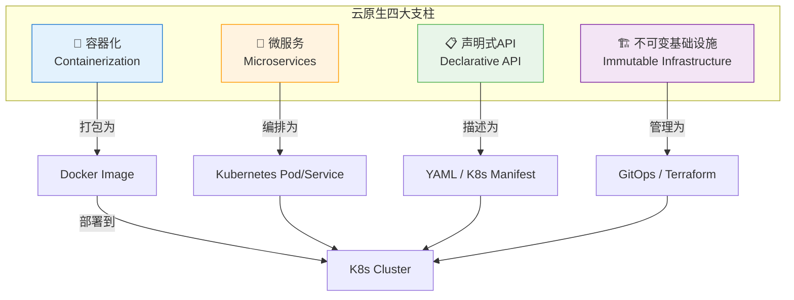
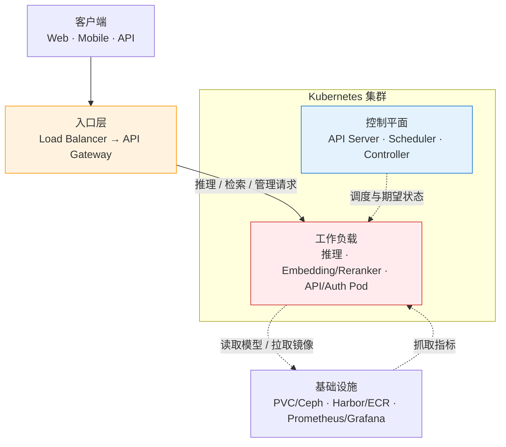
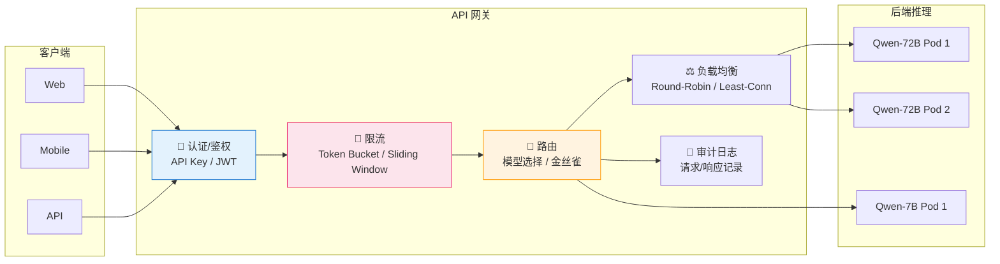

# 第 43 章 云原生部署与模型网关 ⭐⭐⭐⭐
> [!abstract] 本章导航
> **定位**：第六部分 推理服务与 LLMOps中的第 43 章；围绕“云原生部署与模型网关”建立单一、可追踪的知识主线。
>
> **先修**：[[42_PD分离推理与KV池化|第 42 章 PD 分离推理与 KV 池化]]。
>
> **学习目标**：
> - 解释 云原生概述 ⭐⭐ 的核心问题、机制与适用边界。
> - 实现或评估 Docker 容器化模型服务 ⭐⭐⭐ 的最小闭环。
> - 使用可复现证据诊断 Kubernetes 编排与弹性扩缩 ⭐⭐⭐ 的工程取舍与失败模式。
>
> **建议路径**：云原生概述 ⭐⭐ → Docker 容器化模型服务 ⭐⭐⭐ → Kubernetes 编排与弹性扩缩 ⭐⭐⭐ → gRPC vs REST for Model Serving ⭐⭐⭐ → 模型网关与流量管理 ⭐⭐⭐ → 多云部署策略 ⭐⭐。
>
> **配套代码**：`code/ch43_cloudnative/`。

本章先回答“云原生概述 ⭐⭐”为什么成立，再沿着机制、实现、评估和边界逐步展开。阅读时先建立因果链，再运行或推演示例，最后用章末自测检查能否脱离原文复述。
## 43.1 云原生概述 ⭐⭐

### 43.1.1 云原生的核心概念

云原生（Cloud Native）不仅是一套技术栈，更是一种构建和运行应用的方法论。CNCF（Cloud Native Computing Foundation）给出了权威定义：**云原生技术有利于各组织在公有云、私有云和混合云等新型动态环境中，构建和运行可弹性扩展的应用**。



**四大支柱详解：**

| 概念 | 核心思想 | 大模型场景举例 |
|------|---------|-------------|
| **容器化** | 将应用及其依赖（包括 CUDA、Python 库）打包为轻量级、可移植的镜像 | 将 vLLM + LLaMA 3.1 打包为 Docker 镜像，确保开发/测试/生产环境一致 |
| **微服务** | 将大型应用拆分为独立部署的小服务，每个服务专注单一职责 | Embedding 服务、LLM 推理服务、Reranker 服务独立部署、独立扩缩容 |
| **声明式API** | 用户描述"期望状态"，控制器自动调和至目标状态 | 声明"我需要 3 个 GPU Pod"，K8s 自动调度、监控、自愈 |
| **不可变基础设施** | 服务器/容器一旦部署就不修改，变更通过替换而非修补 | 模型更新通过滚动更新替换整个 Pod，而非进入容器修改模型文件 |

### 43.1.2 大模型应用云原生部署的特殊挑战

大模型应用将云原生部署推向了性能与资源管理的极限：

| 挑战 | 传统Web应用 | 大模型应用 | 应对策略 |
|------|-----------|----------|---------|
| **镜像大小** | 100-500 MB | 5-50 GB（含模型权重+GPU驱动） | 模型外挂、多阶段构建、分层缓存 |
| **启动时间** | 秒级 | 分钟级（模型加载到GPU显存） | Pod 预热池、Lazy Loading、模型缓存 |
| **资源调度** | CPU/内存 | GPU（稀缺资源）+ 显存（HBM带宽） | GPU 亲和性调度、MIG 分区、分时复用 |
| **扩缩容延迟** | 秒级 | 分钟级（冷启动加载模型） | 预留缓冲 Pod、模型预热镜像、HPA 提前量 |
| **网络吞吐** | 数百 QPS / Pod | 数万 Token/s / GPU（带宽密集型） | gRPC 长连接、连接池、异步流式 |
| **成本模型** | CPU 核数 × 时间 | GPU 型号/数量 × 时间，并计入存储、网络和托管费 | 按目标区域实时报价建模、Spot 实例、自动缩容、模型量化 |

### 43.1.3 大模型部署架构全景图

下面展示一个云原生推理服务参考架构。它用于讨论组件关系，不代表生产必需项，也不替代安全、
容量、成本、数据治理、容灾与运维验收：



## 43.2 Docker 容器化模型服务 ⭐⭐⭐

### 43.2.1 Docker 核心概念速览

| 概念 | 类比 | 命令示例 |
|------|------|---------|
| **Image（镜像）** | 类（Class）—— 只读模板 | `docker build -t llm-server:v1 .` |
| **Container（容器）** | 实例（Instance）—— 镜像的运行态 | `docker run --gpus all llm-server:v1` |
| **Registry（仓库）** | Maven Central / PyPI —— 镜像的存储分发中心 | `docker push harbor.company.com/llm-server:v1` |
| **Dockerfile** | Makefile / CMakeLists.txt —— 镜像构建脚本 | 见下方详例 |
| **Volume** | 外挂硬盘 —— 持久化存储（如模型文件） | `docker run -v /data/models:/models ...` |
| **Network** | 虚拟局域网 —— 容器间通信 | `docker network create llm-net` |

### 43.2.2 大模型服务 Dockerfile 最佳实践

大模型服务的 Dockerfile 面临几个特殊问题：(1) 模型权重文件动辄数十 GB；(2) GPU 驱动和 CUDA 运行时版本必须精确匹配；(3) 构建时间和镜像体积极度敏感。

**最佳实践清单：**

1. **使用 NVIDIA 官方 CUDA 基础镜像**，而非从 Ubuntu 裸机装驱动
2. **多阶段构建**：构建阶段安装依赖，运行阶段只复制必要产物
3. **模型权重外挂**：模型文件通过 Volume 挂载，不打入镜像
4. **`.dockerignore` 排除大文件**：避免将模型权重、测试数据、日志打入构建上下文
5. **分层缓存优化**：依赖安装（变化频率低）放在 COPY 之前
6. **非 root 用户运行**：安全合规
7. **HEALTHCHECK 健康检查**：配合 K8s Readiness Probe

### 43.2.3 多阶段构建优化镜像大小

```dockerfile
# ====== 阶段1：构建阶段 ======
FROM nvidia/cuda:12.4.0-runtime-ubuntu22.04 AS builder

# 设置国内/内网镜像源加速
RUN sed -i 's/archive.ubuntu.com/mirrors.aliyun.com/g' /etc/apt/sources.list && \
    apt-get update && apt-get install -y --no-install-recommends \
    python3.11 python3.11-venv python3.11-dev curl && \
    rm -rf /var/lib/apt/lists/*

# 安装 pip
RUN curl -sS https://bootstrap.pypa.io/get-pip.py | python3.11

# 复制依赖清单（先于代码，利用 Docker 缓存层）
WORKDIR /app
COPY requirements.txt .

# 安装依赖到虚拟环境
RUN python3.11 -m venv /opt/venv && \
    . /opt/venv/bin/activate && \
    pip install --no-cache-dir -r requirements.txt

# ====== 阶段2：运行阶段 ======
FROM nvidia/cuda:12.4.0-runtime-ubuntu22.04 AS runtime

# 安装运行时依赖（仅 Python 运行时，不装编译工具）
RUN apt-get update && apt-get install -y --no-install-recommends \
    python3.11 python3.11-venv && \
    rm -rf /var/lib/apt/lists/*

# 创建非 root 用户
RUN groupadd -r llm && useradd -r -g llm -d /app llm

# 从构建阶段复制虚拟环境
COPY --from=builder /opt/venv /opt/venv

# 复制应用代码
WORKDIR /app
COPY --chown=llm:llm src/ ./src/
COPY --chown=llm:llm config.yaml .

# 模型目录作为挂载点（不复制模型权重）
RUN mkdir -p /models && chown llm:llm /models

# 设置环境变量
ENV PATH="/opt/venv/bin:$PATH"
ENV PYTHONUNBUFFERED=1
ENV MODEL_PATH=/models/Qwen2.5-72B-Instruct-AWQ

# 健康检查（vLLM 暴露健康检查端点）
HEALTHCHECK --interval=30s --timeout=10s --start-period=120s --retries=3 \
    CMD curl -f http://localhost:8000/health || exit 1

USER llm
EXPOSE 8000

ENTRYPOINT ["python3.11", "-m", "vllm.entrypoints.openai.api_server"]
CMD ["--model", "/models/Qwen2.5-72B-Instruct-AWQ", \
     "--tensor-parallel-size", "4", \
     "--max-model-len", "32768", \
     "--gpu-memory-utilization", "0.95", \
     "--host", "0.0.0.0", \
     "--port", "8000"]
```

**镜像体积对比：**

| 构建方式 | 镜像大小 | 构建时间 | 安全性 |
|---------|---------|---------|-------|
| 单阶段构建（含编译工具） | 15.2 GB | 12 min | 低（含 gcc/cmake） |
| 单阶段构建（仅运行时） | 8.1 GB | 8 min | 中 |
| **多阶段构建** | **5.3 GB** | 10 min | 高 |
| 多阶段 + Squash | 4.1 GB | 14 min | 最高 |

### 43.2.4 GPU 容器配置（NVIDIA Container Toolkit）

大模型推理离不开 GPU。NVIDIA Container Toolkit 允许容器访问宿主机的 GPU 设备。

**安装 NVIDIA Container Toolkit（Ubuntu）：**

```bash
# 1. 添加 NVIDIA 仓库
curl -fsSL https://nvidia.github.io/libnvidia-container/gpgkey | \
    sudo gpg --dearmor -o /usr/share/keyrings/nvidia-container-toolkit-keyring.gpg

curl -s -L https://nvidia.github.io/libnvidia-container/stable/deb/nvidia-container-toolkit.list | \
    sed 's#deb https://#deb [signed-by=/usr/share/keyrings/nvidia-container-toolkit-keyring.gpg] https://#g' | \
    sudo tee /etc/apt/sources.list.d/nvidia-container-toolkit.list

# 2. 安装
sudo apt-get update
sudo apt-get install -y nvidia-container-toolkit

# 3. 配置 Docker Runtime
sudo nvidia-ctk runtime configure --runtime=docker
sudo systemctl restart docker

# 4. 验证
docker run --rm --gpus all nvidia/cuda:12.4.0-base-ubuntu22.04 nvidia-smi
```

**GPU 分配策略对比：**

| 策略 | 命令 | 适用场景 |
|------|------|---------|
| 全部 GPU | `--gpus all` | 单模型独占用满整机 |
| 指定 GPU 数量 | `--gpus 2` | 指定使用前 2 块 |
| 指定 GPU 索引 | `--gpus '"device=0,2"'` | 使用指定 GPU（如 GPU 0 和 2） |
| MIG 分区 | `--gpus '"device=0:1g.10gb"'` | A100/H100 MIG 模式，细粒度隔离 |
| 共享显存（实验性） | 需 Time-slicing 配置 | 开发测试环境 |

### 43.2.5 代码示例：FastAPI + vLLM 模型服务容器化

下面展示一个完整的生产级 FastAPI + vLLM 模型服务 Python 代码：

```python
"""
大模型推理服务 —— FastAPI + vLLM 后端
支持 OpenAI 兼容 API、流式输出、并发控制
"""

import os
import time
import asyncio
from contextlib import asynccontextmanager
from typing import Optional, AsyncGenerator

import uvicorn
from fastapi import FastAPI, HTTPException, Request
from fastapi.responses import StreamingResponse, JSONResponse
from fastapi.middleware.cors import CORSMiddleware
from pydantic import BaseModel, Field
import logging

# 配置结构化日志
logging.basicConfig(
    level=logging.INFO,
    format="%(asctime)s [%(levelname)s] %(name)s: %(message)s"
)
logger = logging.getLogger("llm-server")

# ====== 配置 ======
class ServerConfig:
    MODEL_PATH: str = os.getenv("MODEL_PATH", "/models/Qwen2.5-72B-Instruct-AWQ")
    TENSOR_PARALLEL_SIZE: int = int(os.getenv("TENSOR_PARALLEL_SIZE", "4"))
    MAX_MODEL_LEN: int = int(os.getenv("MAX_MODEL_LEN", "32768"))
    GPU_MEMORY_UTILIZATION: float = float(os.getenv("GPU_MEMORY_UTILIZATION", "0.95"))
    MAX_CONCURRENT_REQUESTS: int = int(os.getenv("MAX_CONCURRENT_REQUESTS", "64"))
    PORT: int = int(os.getenv("PORT", "8000"))

config = ServerConfig()

# ====== 请求/响应模型 ======
class ChatMessage(BaseModel):
    role: str
    content: str

class ChatCompletionRequest(BaseModel):
    model: str = "qwen2.5-72b"
    messages: list[ChatMessage]
    temperature: float = Field(default=0.7, ge=0.0, le=2.0)
    max_tokens: int = Field(default=2048, ge=1, le=32768)
    top_p: float = Field(default=1.0, ge=0.0, le=1.0)
    stream: bool = False

# ====== 信号量控制并发 ======
semaphore = asyncio.Semaphore(config.MAX_CONCURRENT_REQUESTS)

# ====== 应用生命周期 ======
@asynccontextmanager
async def lifespan(app: FastAPI):
    """应用启动/关闭的生命周期管理"""
    logger.info(f"Loading model from {config.MODEL_PATH}...")
    t0 = time.time()

    # 动态导入 vLLM（延迟加载，避免 import 时就需要 GPU）
    from vllm.engine.async_llm_engine import AsyncLLMEngine
    from vllm.engine.arg_utils import AsyncEngineArgs

    engine_args = AsyncEngineArgs(
        model=config.MODEL_PATH,
        tensor_parallel_size=config.TENSOR_PARALLEL_SIZE,
        max_model_len=config.MAX_MODEL_LEN,
        gpu_memory_utilization=config.GPU_MEMORY_UTILIZATION,
        enable_prefix_caching=True,          # 🆕 2026: 自动 Prefix Cache
        enable_chunked_prefill=True,         # 分块预填充，优化 TTFT
        max_num_batched_tokens=8192,         # 批量 Token 上限
    )
    app.state.engine = AsyncLLMEngine.from_engine_args(engine_args)

    logger.info(f"Model loaded in {time.time() - t0:.1f}s. Ready to serve.")
    yield
    # 清理资源
    if hasattr(app.state, "engine"):
        del app.state.engine
    logger.info("Server shutting down.")

# ====== FastAPI 应用 ======
app = FastAPI(title="LLM Inference Server", version="1.0.0", lifespan=lifespan)

app.add_middleware(
    CORSMiddleware,
    allow_origins=["*"],
    allow_methods=["*"],
    allow_headers=["*"],
)

# ====== 端点 ======
@app.get("/health")
async def health():
    """K8s Readiness / Liveness Probe 端点"""
    return {"status": "healthy", "model_loaded": hasattr(app.state, "engine")}

@app.post("/v1/chat/completions")
async def chat_completions(request: ChatCompletionRequest, raw_request: Request):
    """OpenAI 兼容的 Chat Completions 端点"""
    if request.stream:
        return StreamingResponse(
            _stream_generate(request),
            media_type="text/event-stream",
        )

    async with semaphore:
        try:
            result = await _generate_completion(request)
            return JSONResponse(content=result)
        except Exception as e:
            logger.error(f"Generation error: {e}")
            raise HTTPException(status_code=500, detail=str(e))

# ====== 推理核心 ======
async def _generate_completion(request: ChatCompletionRequest) -> dict:
    """同步（一次性）生成"""
    from vllm.sampling_params import SamplingParams
    from vllm.utils import random_uuid

    prompt = _build_prompt(request.messages)
    sampling_params = SamplingParams(
        temperature=request.temperature,
        max_tokens=request.max_tokens,
        top_p=request.top_p,
    )

    request_id = random_uuid()
    final_output = None
    async for result in app.state.engine.generate(prompt, sampling_params, request_id):
        final_output = result

    if final_output is None:
        raise HTTPException(status_code=500, detail="Generation failed")

    completion_text = final_output.outputs[0].text
    return {
        "id": request_id,
        "object": "chat.completion",
        "model": request.model,
        "choices": [{
            "index": 0,
            "message": {"role": "assistant", "content": completion_text},
            "finish_reason": "stop",
        }],
        "usage": {
            "prompt_tokens": len(final_output.prompt_token_ids),
            "completion_tokens": len(final_output.outputs[0].token_ids),
            "total_tokens": len(final_output.prompt_token_ids) + len(final_output.outputs[0].token_ids),
        },
    }

async def _stream_generate(request: ChatCompletionRequest) -> AsyncGenerator[str, None]:
    """流式 SSE（Server-Sent Events）生成"""
    from vllm.sampling_params import SamplingParams
    from vllm.utils import random_uuid
    import json

    async with semaphore:
        try:
            prompt = _build_prompt(request.messages)
            sampling_params = SamplingParams(
                temperature=request.temperature,
                max_tokens=request.max_tokens,
                top_p=request.top_p,
            )

            request_id = random_uuid()
            async for result in app.state.engine.generate(
                prompt, sampling_params, request_id
            ):
                text = result.outputs[0].text
                chunk = {
                    "id": request_id,
                    "object": "chat.completion.chunk",
                    "model": request.model,
                    "choices": [{
                        "index": 0,
                        "delta": {"content": text},
                        "finish_reason": None,
                    }],
                }
                yield f"data: {json.dumps(chunk)}\n\n"

            yield "data: [DONE]\n\n"
        except Exception as e:
            logger.error(f"Streaming error: {e}")
            yield f"data: {json.dumps({'error': str(e)})}\n\n"

def _build_prompt(messages: list[ChatMessage]) -> str:
    """将消息列表构建为模型 Prompt"""
    return "".join(
        f"<|im_start|>{msg.role}\n{msg.content}<|im_end|>\n"
        for msg in messages
    ) + "<|im_start|>assistant\n"

# ====== 入口 ======
if __name__ == "__main__":
    uvicorn.run(
        "server:app",
        host="0.0.0.0",
        port=config.PORT,
        workers=1,               # vLLM 内部已多进程，uvicorn 用 1 个 worker
        log_level="info",
        limit_concurrency=config.MAX_CONCURRENT_REQUESTS,
    )
```

**对应的 `requirements.txt`：**

```
vllm>=0.8.0,<1.0.0     # 推理引擎
fastapi>=0.115.0        # Web 框架
uvicorn[standard]>=0.32.0  # ASGI 服务器
pydantic>=2.0           # 数据校验
torch>=2.5.0            # PyTorch（需与 CUDA 12.4 匹配）
transformers>=4.46.0    # HuggingFace Transformers
```

## 43.3 Kubernetes 编排与弹性扩缩 ⭐⭐⭐

### 43.3.1 K8s 核心概念

| 概念 | 一句话解释 | 理解关键词 |
|------|----------|----------|
| **Pod** | K8s 最小调度单元，包含一个或多个容器 | 共享网络/存储命名空间 |
| **Service** | Pod 的稳定网络入口（IP + DNS） | 负载均衡、服务发现 |
| **Deployment** | 管理 Pod 的声明式副本集 | 滚动更新、回滚、副本数 |
| **ConfigMap/Secret** | 配置与敏感信息管理 | 环境注入、热更新 |
| **Ingress** | 外部流量的七层路由规则 | 域名路由、TLS 终止 |
| **StatefulSet** | 有状态应用（如模型缓存服务） | 固定 Pod 名、持久存储 |
| **HPA** | 基于指标自动扩缩 Pod 副本数 | CPU/内存/自定义指标驱动 |
| **NodeSelector / Affinity** | 控制 Pod 调度到特定节点 | GPU 节点亲和性 |

### 43.3.2 GPU 节点管理与调度

在 K8s 集群中管理 GPU 节点，需要解决两个核心问题：(1) 如何识别 GPU 资源；(2) 如何将 GPU 工作负载调度到正确的节点。

**GPU 节点标签与污染（Taint）：**

```bash
# 1. 给 GPU 节点打标签
kubectl label node gpu-node-01 accelerator=nvidia
kubectl label node gpu-node-01 nvidia.com/gpu.product=A100-SXM4-80GB

# 2. GPU 节点加 Taint（防止非 GPU 工作负载调度上来）
kubectl taint node gpu-node-01 nvidia.com/gpu=true:NoSchedule
```

**🚀 GPU Operator 自动化管理（推荐方式）：**

```bash
# 安装 NVIDIA GPU Operator（Helm）
helm repo add nvidia https://helm.ngc.nvidia.com/nvidia
helm install gpu-operator nvidia/gpu-operator \
  --namespace gpu-operator --create-namespace \
  --set driver.enabled=true \
  --set toolkit.enabled=true

# 验证 GPU 资源已注册
kubectl describe node gpu-node-01 | grep nvidia.com/gpu
```

**Pod 请求 GPU 资源：**

```yaml
# 在 Pod spec 中声明 GPU 需求
resources:
  limits:
    nvidia.com/gpu: 4   # 请求 4 块 GPU（整数）
  requests:
    nvidia.com/gpu: 4
```

### 43.3.3 HPA（Horizontal Pod Autoscaler）配置

大模型推理服务的 HPA 需要使用自定义指标（如 GPU 利用率、推理队列深度），而非简单的 CPU 指标。

**安装 Prometheus Adapter 以暴露自定义指标：**

```bash
helm repo add prometheus-community https://prometheus-community.github.io/helm-charts
helm install prometheus-adapter prometheus-community/prometheus-adapter \
  --namespace monitoring
```

**HPA 配置（基于 GPU 利用率和请求队列深度）：**

> 下列副本数、利用率和队列阈值仅用于展示字段；生产值应由目标 GPU、模型、batch 策略、
> 冷启动时间和负载测试确定，并用端到端延迟/错误率作为护栏。

```yaml
apiVersion: autoscaling/v2
kind: HorizontalPodAutoscaler
metadata:
  name: llm-inference-hpa
spec:
  scaleTargetRef:
    apiVersion: apps/v1
    kind: Deployment
    name: llm-inference-server
  minReplicas: 2      # 最少维持 2 个 Pod（避免冷启动）
  maxReplicas: 10     # 最多扩展到 10 个 Pod
  metrics:
    # 指标1：GPU 利用率（超过 80% 扩容）
    - type: Pods
      pods:
        metric:
          name: DCGM_FI_DEV_GPU_UTIL
        target:
          type: AverageValue
          averageValue: "80"
    # 指标2：推理请求队列深度
    - type: Pods
      pods:
        metric:
          name: llm_inference_queue_depth
        target:
          type: AverageValue
          averageValue: "10"
  behavior:
    scaleUp:
      stabilizationWindowSeconds: 60    # 扩容前观察 60s
      policies:
        - type: Pods
          value: 2                       # 每次最多新增 2 个 Pod
          periodSeconds: 60
    scaleDown:
      stabilizationWindowSeconds: 300   # 缩容前观察 5min（避免频繁扩缩）
      policies:
        - type: Pods
          value: 1                       # 每次最多缩 1 个 Pod
          periodSeconds: 60
```

### 43.3.4 模型服务的 K8s 部署 YAML 实战

```yaml
# ====== 1. Namespace ======
apiVersion: v1
kind: Namespace
metadata:
  name: llm-inference

---
# ====== 2. ConfigMap（非敏感配置） ======
apiVersion: v1
kind: ConfigMap
metadata:
  name: llm-server-config
  namespace: llm-inference
data:
  MODEL_PATH: "/models/Qwen2.5-72B-Instruct-AWQ"
  TENSOR_PARALLEL_SIZE: "4"
  MAX_MODEL_LEN: "32768"
  GPU_MEMORY_UTILIZATION: "0.95"
  MAX_CONCURRENT_REQUESTS: "64"

---
# ====== 3. Secret（敏感信息） ======
apiVersion: v1
kind: Secret
metadata:
  name: llm-server-secret
  namespace: llm-inference
type: Opaque
stringData:
  HF_TOKEN: "hf_your_huggingface_token_here"
  API_KEY: "sk-your-api-key"

---
# ====== 4. PersistentVolumeClaim（模型存储） ======
apiVersion: v1
kind: PersistentVolumeClaim
metadata:
  name: model-storage-pvc
  namespace: llm-inference
spec:
  accessModes:
    - ReadOnlyMany      # 多个 Pod 只读挂载
  storageClassName: ceph-filesystem  # 或 nfs / efs
  resources:
    requests:
      storage: 500Gi    # 模型文件需要大容量

---
# ====== 5. Deployment ======
apiVersion: apps/v1
kind: Deployment
metadata:
  name: llm-inference-server
  namespace: llm-inference
  labels:
    app: llm-inference
    model: qwen2.5-72b
spec:
  replicas: 2           # 初始 2 个副本
  strategy:
    type: RollingUpdate
    rollingUpdate:
      maxSurge: 1       # 滚动更新时最多多出 1 个
      maxUnavailable: 0  # 滚动更新期间不可中断（零停机）
  selector:
    matchLabels:
      app: llm-inference
  template:
    metadata:
      labels:
        app: llm-inference
        model: qwen2.5-72b
      annotations:
        prometheus.io/scrape: "true"
        prometheus.io/port: "8000"
    spec:
      # ====== GPU 节点调度 ======
      nodeSelector:
        accelerator: nvidia
        nvidia.com/gpu.product: A100-SXM4-80GB   # 精确匹配 GPU 型号
      tolerations:
        - key: nvidia.com/gpu
          operator: Exists
          effect: NoSchedule

      # ====== 容器配置 ======
      containers:
      - name: inference-server
        image: harbor.company.com/llm-server:v2.1.0
        imagePullPolicy: IfNotPresent
        ports:
        - containerPort: 8000
          name: http
        - containerPort: 9090
          name: metrics       # Prometheus 指标端口

        # ====== 环境变量 ======
        envFrom:
        - configMapRef:
            name: llm-server-config
        - secretRef:
            name: llm-server-secret

        # ====== 资源请求与限制 ======
        resources:
          requests:
            nvidia.com/gpu: 4       # 请求 4 块 GPU
            memory: "400Gi"         # CPU 内存
            cpu: "32"
          limits:
            nvidia.com/gpu: 4       # GPU 硬限制
            memory: "512Gi"
            cpu: "48"

        # ====== 卷挂载 ======
        volumeMounts:
        - name: model-storage
          mountPath: /models
          readOnly: true
        - name: dshm
          mountPath: /dev/shm       # vLLM 需要大共享内存

        # ====== 探针 ======
        livenessProbe:
          httpGet:
            path: /health
            port: 8000
          initialDelaySeconds: 300  # 模型加载需要时间
          periodSeconds: 30
          timeoutSeconds: 10
          failureThreshold: 5

        readinessProbe:
          httpGet:
            path: /health
            port: 8000
          initialDelaySeconds: 180
          periodSeconds: 10
          timeoutSeconds: 5
          failureThreshold: 3

        # ====== 启动探针（给模型加载足够时间） ======
        startupProbe:
          httpGet:
            path: /health
            port: 8000
          initialDelaySeconds: 30
          periodSeconds: 10
          failureThreshold: 60     # 最多等 30+10*60=630 秒
          timeoutSeconds: 5

      # ====== 卷定义 ======
      volumes:
      - name: model-storage
        persistentVolumeClaim:
          claimName: model-storage-pvc
      - name: dshm
        emptyDir:
          medium: Memory
          sizeLimit: 16Gi

---
# ====== 6. Service ======
apiVersion: v1
kind: Service
metadata:
  name: llm-inference-svc
  namespace: llm-inference
spec:
  selector:
    app: llm-inference
  ports:
  - name: http
    protocol: TCP
    port: 80
    targetPort: 8000
  type: ClusterIP
  sessionAffinity: ClientIP   # ⚠️ 可选：同客户端路由到同一 Pod

---
# ====== 7. HPA ======
apiVersion: autoscaling/v2
kind: HorizontalPodAutoscaler
metadata:
  name: llm-inference-hpa
  namespace: llm-inference
spec:
  scaleTargetRef:
    apiVersion: apps/v1
    kind: Deployment
    name: llm-inference-server
  minReplicas: 2
  maxReplicas: 10
  metrics:
    - type: Resource
      resource:
        name: cpu
        target:
          type: Utilization
          averageUtilization: 70
```

### 43.3.5 滚动更新与零停机部署

K8s 的 Deployment 原生支持滚动更新，但大模型服务的特殊性在于 **Pod 启动时间长（分钟级）** 和 **GPU 资源稀缺（不能随便多启动一个 Pod 预热）**。

**滚动更新策略对比：**

| 策略 | 配置 | 优点 | 缺点 | 适用 |
|------|------|------|------|------|
| **滚动更新** | `maxSurge:1, maxUnavailable:0` | 零停机，逐步替换 | 需要 1 个额外 GPU 配额 | 生产环境 |
| **蓝绿部署** | 先起一套新 Deployment，再切流量 | 瞬间回滚 | GPU 资源翻倍 | 大变更 |
| **灰度（金丝雀）** | 新 Pod 只接收 5% 流量，逐步加大 | 风险可控 | 需要网关配合 | 模型版本升级 |

**零停机部署的检查清单：**

```bash
# 1. 更新镜像前先预热（可选策略：提前触发模型下载）
kubectl set image deployment/llm-inference-server \
  inference-server=harbor.company.com/llm-server:v2.2.0 \
  -n llm-inference

# 2. 监控滚动更新状态
kubectl rollout status deployment/llm-inference-server -n llm-inference

# 3. 如果发现问题，立即回滚
kubectl rollout undo deployment/llm-inference-server -n llm-inference

# 4. 查看回滚历史
kubectl rollout history deployment/llm-inference-server -n llm-inference
```

## 43.4 gRPC vs REST for Model Serving ⭐⭐⭐

### 43.4.1 gRPC vs REST 协议对比

大模型推理对通信协议有独特需求：高吞吐、低延迟、流式输出、二进制安全。gRPC 和 REST 各有优劣。

| 维度 | REST (HTTP/JSON) | gRPC (HTTP/2 + Protobuf) |
|------|------------------|-------------------------|
| **序列化格式** | JSON（文本） | Protobuf（二进制） |
| **传输协议** | HTTP/1.1 或 HTTP/2 | HTTP/2（强制，多路复用） |
| **流式支持** | SSE（Server-Sent Events，单工） | Native Streaming（双工/单向流） |
| **序列化开销** | 受 JSON 库、字段和 payload 影响 | 常更紧凑；收益必须用真实消息基准测试 |
| **数据体积** | 文本与字段名会增加开销 | 二进制编码通常更小；比例依 schema/数据分布 |
| **类型安全** | 弱（运行时 Schema 校验） | 强（编译时 `.proto` 生成代码） |
| **浏览器支持** | 原生 | 需 gRPC-Web 代理 |
| **生态/调试** | curl / Postman / 浏览器直接调试 | grpcurl / BloomRPC / grpcui |
| **适用场景** | 对外 API、Web 前端、简单交互 | 微服务间通信、高吞吐、流式推理 |

### 43.4.2 Protobuf 定义模型服务接口

```protobuf
syntax = "proto3";

package llm.inference.v1;

// 模型推理服务
service LLMInference {
    // 单次生成（Unary）
    rpc Generate(GenerateRequest) returns (GenerateResponse);

    // 流式生成（Server Streaming）
    rpc GenerateStream(GenerateRequest) returns (stream GenerateStreamResponse);

    // 双向流（多轮对话 + 实时控制）
    rpc ChatStream(stream ChatMessage) returns (stream ChatStreamResponse);

    // 获取模型信息
    rpc GetModelInfo(ModelInfoRequest) returns (ModelInfoResponse);

    // 🆕 2026: Batch推理（客户端流式上传多条请求）
    rpc BatchGenerate(stream GenerateRequest) returns (BatchGenerateResponse);
}

// ====== 消息定义 ======

message GenerateRequest {
    string model_id = 1;          // 模型标识
    repeated ChatMessage messages = 2;  // 对话历史
    SamplingParams sampling_params = 3; // 采样参数
    string request_id = 4;        // 请求追踪 ID
    map<string, string> metadata = 5; // 扩展元数据
}

message ChatMessage {
    string role = 1;              // "system" | "user" | "assistant"
    string content = 2;           // 消息内容
    repeated ToolCall tool_calls = 3; // 工具调用（可选）
}

message ToolCall {
    string id = 1;
    string name = 2;
    string arguments = 3;         // JSON 序列化的参数
}

message SamplingParams {
    float temperature = 1;
    int32 max_tokens = 2;
    float top_p = 3;
    int32 top_k = 4;
    repeated string stop_sequences = 5;
    float frequency_penalty = 6;
    float presence_penalty = 7;
}

message GenerateResponse {
    string request_id = 1;
    repeated Completion completion = 2;
    TokenUsage usage = 3;
    bool is_truncated = 4;
}

message Completion {
    int32 index = 1;
    string text = 2;
    string finish_reason = 3;     // "stop" | "length" | "tool_calls"
    repeated float logprobs = 4;
}

message TokenUsage {
    int32 prompt_tokens = 1;
    int32 completion_tokens = 2;
    int32 total_tokens = 3;
    float cost_usd = 4;           // 🆕 2026: 实时成本估算
}

// ====== 流式消息 ======

message GenerateStreamResponse {
    string request_id = 1;
    oneof content {
        TokenDelta token = 2;     // 增量 Token
        ErrorInfo error = 3;      // 错误信息
        Metrics metrics = 4;      // 🆕 流式指标（TTFT, TPOT 等）
    }
}

message TokenDelta {
    int32 index = 1;
    string delta_text = 2;
    bool is_final = 3;
    string finish_reason = 4;
}

message ErrorInfo {
    int32 code = 1;
    string message = 2;
    bool is_retryable = 3;
}

message Metrics {
    double ttft_ms = 1;           // Time To First Token
    double tpot_ms = 2;           // Time Per Output Token (平均)
    double throughput_tps = 3;     // Token Per Second
}

// ====== 模型信息 ======

message ModelInfoRequest {}

message ModelInfoResponse {
    string model_id = 1;
    string model_family = 2;
    int64 parameter_count = 3;
    int32 max_context_length = 4;
    repeated string supported_languages = 5;
    string quantization = 6;      // e.g. "AWQ", "GPTQ", "FP16"
}
```

### 43.4.3 gRPC 服务端实现

```python
"""
gRPC 大模型推理服务端 —— 使用 vLLM AsyncEngine
"""

import asyncio
import grpc
from concurrent import futures

import llm_inference_pb2
import llm_inference_pb2_grpc
from vllm.engine.async_llm_engine import AsyncLLMEngine
from vllm.engine.arg_utils import AsyncEngineArgs
from vllm.sampling_params import SamplingParams
from vllm.utils import random_uuid


class LLMInferenceServicer(llm_inference_pb2_grpc.LLMInferenceServicer):
    def __init__(self, engine: AsyncLLMEngine):
        self.engine = engine

    async def Generate(self, request, context):
        """单次生成（Unary RPC）"""
        # 构建 SamplingParams
        sp = request.sampling_params
        sampling_params = SamplingParams(
            temperature=sp.temperature,
            max_tokens=sp.max_tokens,
            top_p=sp.top_p,
            top_k=sp.top_k,
        )

        # 构建 Prompt
        prompt = self._build_prompt(request.messages)

        # 推理
        request_id = request.request_id or random_uuid()
        final_output = None
        async for result in self.engine.generate(
            prompt, sampling_params, request_id
        ):
            final_output = result

        if final_output is None:
            context.set_code(grpc.StatusCode.INTERNAL)
            context.set_details("Generation returned no output")
            return llm_inference_pb2.GenerateResponse()

        return llm_inference_pb2.GenerateResponse(
            request_id=request_id,
            completion=[
                llm_inference_pb2.Completion(
                    index=0,
                    text=final_output.outputs[0].text,
                    finish_reason="stop",
                )
            ],
            usage=llm_inference_pb2.TokenUsage(
                prompt_tokens=len(final_output.prompt_token_ids),
                completion_tokens=len(final_output.outputs[0].token_ids),
                total_tokens=(
                    len(final_output.prompt_token_ids) +
                    len(final_output.outputs[0].token_ids)
                ),
            ),
        )

    async def GenerateStream(self, request, context):
        """流式生成（Server Streaming RPC）"""
        sp = request.sampling_params
        sampling_params = SamplingParams(
            temperature=sp.temperature,
            max_tokens=sp.max_tokens,
            top_p=sp.top_p,
        )

        prompt = self._build_prompt(request.messages)
        request_id = request.request_id or random_uuid()

        async for result in self.engine.generate(
            prompt, sampling_params, request_id
        ):
            yield llm_inference_pb2.GenerateStreamResponse(
                request_id=request_id,
                token=llm_inference_pb2.TokenDelta(
                    index=0,
                    delta_text=result.outputs[0].text,
                    is_final=False,
                ),
            )

        # 最终完成信号
        yield llm_inference_pb2.GenerateStreamResponse(
            request_id=request_id,
            token=llm_inference_pb2.TokenDelta(
                index=0,
                delta_text="",
                is_final=True,
                finish_reason="stop",
            ),
        )

    @staticmethod
    def _build_prompt(messages) -> str:
        parts = []
        for msg in messages:
            parts.append(f"<|im_start|>{msg.role}\n{msg.content}<|im_end|>\n")
        parts.append("<|im_start|>assistant\n")
        return "".join(parts)


async def serve():
    # 初始化 vLLM Engine
    engine_args = AsyncEngineArgs(
        model="/models/Qwen2.5-72B-Instruct-AWQ",
        tensor_parallel_size=4,
        max_model_len=32768,
        gpu_memory_utilization=0.95,
        enable_prefix_caching=True,
    )
    engine = AsyncLLMEngine.from_engine_args(engine_args)

    # 启动 gRPC 服务
    server = grpc.aio.server(
        futures.ThreadPoolExecutor(max_workers=10),
        options=[
            ("grpc.max_send_message_length", 100 * 1024 * 1024),  # 100MB
            ("grpc.max_receive_message_length", 100 * 1024 * 1024),
            ("grpc.keepalive_time_ms", 30000),
            ("grpc.keepalive_timeout_ms", 10000),
        ],
    )

    llm_inference_pb2_grpc.add_LLMInferenceServicer_to_server(
        LLMInferenceServicer(engine), server
    )

    server.add_insecure_port("[::]:50051")
    await server.start()
    print("gRPC LLM Inference Server started on port 50051")
    await server.wait_for_termination()


if __name__ == "__main__":
    asyncio.run(serve())
```

### 43.4.4 性能对比的正确测法（延迟/吞吐/序列化效率）

仓库没有随附下表所需的原始结果，不能把一组示意数字写成“实测”。应在同一模型 revision、
引擎、GPU、输入/输出长度、并发、连接复用、TLS 与 warmup 条件下做 A/B，并至少报告：

| 指标 | 必须固定/记录 | 解释边界 |
|------|---------------|----------|
| TTFT、端到端 P50/P95/P99 | 相同请求集、并发与超时 | 模型计算往往占主导，协议不能保证固定降幅 |
| tokens/s、req/s | 输入/输出 token 分布、batch 策略 | 分别报告单请求与系统吞吐 |
| 请求/响应字节数 | JSON/Protobuf schema 与压缩设置 | Protobuf 常更紧凑，但幅度取决于 payload |
| 编解码 CPU 时间 | 客户端/服务端语言与库版本 | 与模型延迟分开统计 |
| 连接数与复用率 | HTTP/1.1、HTTP/2、keep-alive/TLS | gRPC 的 HTTP/2 多路复用是机制，不是固定收益 |

### 43.4.5 流式推理的协议选择

| 协议方案 | 实现方式 | 延迟 | 实现复杂度 | 浏览器支持 | 推荐场景 |
|---------|---------|------|-----------|----------|---------|
| **SSE (REST)** | `text/event-stream` | 中 | 低 | 原生 `EventSource` | 简单流式 Web 应用 |
| **WebSocket** | 全双工 | 低 | 中 | 原生 | 需要客户端发送控制信号 |
| **gRPC Server Streaming** | Protobuf Stream | 最低 | 中 | 需 gRPC-Web | 微服务间流式推理 |
| **gRPC Bidirectional** | Protobuf Duplex Stream | 最低 | 高 | 需 gRPC-Web | 多轮对话 + 中断控制 |

## 43.5 模型网关与流量管理 ⭐⭐⭐

### 43.5.1 API 网关模式

在大模型推理架构中，API 网关是连接客户端与后端推理服务的关键中间件，承担**负载均衡、限流、认证、路由、协议转换**等职责。



**常见网关选型对比：**

| 网关 | 类型 | 优势 | 大模型场景适配度 |
|------|------|------|----------------|
| **Envoy** | Sidecar 代理 | 性能极高、L7 路由、gRPC 原生支持 | ★★★★★ 最佳 |
| **Kong** | API 网关 | 插件丰富、Admin API | ★★★★☆ |
| **APISIX** | API 网关 | 动态配置、性能高 | ★★★★☆ |
| **Nginx** | 反向代理 | 成熟稳定、生态大 | ★★★☆☆（需 Lua 扩展） |
| **Traefik** | 云原生网关 | 自动发现 K8s Service | ★★★☆☆ |

### 43.5.2 模型路由策略

生产环境中常同时运行多个模型版本，需要精细化路由：

| 策略 | 原理 | 用途 | 实现方式 |
|------|------|------|---------|
| **A/B 测试** | 50/50 分流到两个模型版本 | 评估模型效果差异 | Header/Cookie 路由 |
| **金丝雀发布** | 从小比例（如 5%，按风险设定）逐步加大 | 降低新模型上线风险 | 权重路由 |
| **流量镜像** | 复制流量同时发送到新旧版，新版结果丢弃 | 静默验证新模型 | Envoy Traffic Mirroring |
| **基于用户路由** | 按用户 ID Hash 路由到固定模型 | VIP 用户专用模型 | 一致性 Hash |
| **基于负载路由** | 选择当前负载最低的 Pod | 优化延迟 | Least Outstanding Requests |

**Envoy 金丝雀路由配置示例：**

```yaml
# Envoy 配置：按权重将流量分发到新旧模型版本
route_config:
  virtual_hosts:
  - name: llm_service
    domains: ["api.example.com"]
    routes:
    - match:
        prefix: "/v1/chat/completions"
      route:
        weighted_clusters:
          clusters:
          - name: llm-model-v2    # 🆕 新版本（接收 5%）
            weight: 5
          - name: llm-model-v1    # 稳定版本（接收 95%）
            weight: 95
      retry_policy:
        retry_on: "5xx,reset"
        num_retries: 2
        per_try_timeout: 30s
```

### 43.5.3 请求队列与背压处理

大模型推理是资源密集型操作，当请求超过 GPU 处理能力时，需要合理的背压机制：

```python
"""
模型网关中的请求队列与背压处理
"""

import asyncio
import time
from dataclasses import dataclass, field
from collections import deque
from enum import Enum


class ReqPriority(Enum):
    HIGH = 0      # 实时对话
    NORMAL = 1    # API 调用
    LOW = 2       # 批量任务


@dataclass
class InferenceRequest:
    request_id: str
    priority: ReqPriority
    payload: dict
    enqueue_time: float = field(default_factory=time.time)


class BackpressureGateway:
    """带背压控制的推理请求网关"""

    def __init__(
        self,
        max_queue_size: int = 100,
        max_concurrent: int = 32,
        timeout_seconds: float = 30.0,
    ):
        self.max_queue_size = max_queue_size
        self.max_concurrent = max_concurrent
        self.timeout = timeout_seconds
        self._semaphore = asyncio.Semaphore(max_concurrent)

        # 三级优先级队列
        self._queues = {
            ReqPriority.HIGH: deque(),
            ReqPriority.NORMAL: deque(),
            ReqPriority.LOW: deque(),
        }

        # 统计指标
        self.stats = {
            "accepted": 0,
            "rejected": 0,
            "timeout": 0,
            "completed": 0,
            "current_queue_depth": 0,
        }

    async def submit(self, request: InferenceRequest) -> dict:
        """提交推理请求（带背压）"""
        # 1. 队列满检查
        total_queued = sum(len(q) for q in self._queues.values())
        if total_queued >= self.max_queue_size:
            self.stats["rejected"] += 1
            return {"error": "queue_full", "retry_after_ms": 5000}

        # 2. 入队
        self._queues[request.priority].append(request)
        self.stats["accepted"] += 1

        # 3. 等待处理
        try:
            async with asyncio.timeout(self.timeout):
                async with self._semaphore:
                    # 从队列取出（按优先级）
                    req = self._dequeue()
                    self.stats["completed"] += 1
                    # 这里转发到实际的推理后端
                    return await self._forward_to_backend(req)
        except asyncio.TimeoutError:
            self.stats["timeout"] += 1
            return {"error": "timeout", "message": "Request timed out"}

    def _dequeue(self) -> InferenceRequest:
        """按优先级出队：高优先 > 普通 > 低优先"""
        for priority in (ReqPriority.HIGH, ReqPriority.NORMAL, ReqPriority.LOW):
            q = self._queues[priority]
            if q:
                return q.popleft()
        raise RuntimeError("Queue unexpectedly empty")

    async def _forward_to_backend(self, request: InferenceRequest) -> dict:
        """转发到推理后端（简化示例）"""
        # 实际实现中会调用 gRPC / HTTP 客户端
        await asyncio.sleep(0.5)  # 模拟推理耗时
        return {"request_id": request.request_id, "result": "generated..."}

    def get_stats(self) -> dict:
        """获取网关统计"""
        self.stats["current_queue_depth"] = sum(
            len(q) for q in self._queues.values()
        )
        return self.stats
```

### 43.5.4 多模型版本管理

```
生产环境中同时运行多个模型版本是常态。以下是一个多模型路由示例：

请求头: X-Model-Version: prod-v3
         X-Model-Version: canary-v4-beta
         X-Model-Version: embedding-v2

网关根据请求头自动路由到对应的模型后端：
  - prod-v3  → llm-qwen-72b-v3 (100% 生产流量)
  - canary    → llm-qwen-72b-v4 (5% 金丝雀流量)
  - embedding → embedding-server-v2 (独立 Embedding 服务)
```

## 43.6 多云部署策略 ⭐⭐

### 43.6.1 公有云 AI 服务对比

| 服务 | 云厂商 | 核心能力 | 定价模式 | 锁定风险 |
|------|-------|---------|---------|---------|
| **Amazon SageMaker** | AWS | 全托管训练+推理、JumpStart 模型市场 | 按实例小时 | 中（SageMaker SDK） |
| **Amazon Bedrock** 🆕 | AWS | 无服务器 LLM API（Claude/LLaMA/Titan） | 按 Token | 低（OpenAI 兼容） |
| **Vertex AI** | GCP | 托管训练+推理、Model Garden、AutoML | 按实例小时/Token | 中 |
| **Azure AI Foundry** | Azure | 模型目录、推理端点、AI Search、内容安全 | 按实例小时/Token | 中高（Azure 生态） |
| **GPU Cloud (CoreWeave/Lambda)** | 独立 | GPU 实例与托管集群，价格需按地区/合同实时询价 | 按实例小时/合同 | 低至中 |

**AWS SageMaker 部署示例：**

```python
"""
使用 SageMaker SDK 部署大模型推理端点
"""

import sagemaker
from sagemaker.huggingface import HuggingFaceModel

# 1. 创建 HuggingFace Model
hub = {
    "HF_MODEL_ID": "Qwen/Qwen2.5-72B-Instruct-AWQ",
    "HF_TASK": "text-generation",
    "SM_NUM_GPUS": "4",
    "MAX_INPUT_LENGTH": "32768",
    "MAX_TOTAL_TOKENS": "4096",
}

huggingface_model = HuggingFaceModel(
    env=hub,
    role=sagemaker.get_execution_role(),
    transformers_version="4.46",
    pytorch_version="2.5",
    py_version="py311",
    model_data=None,  # 从 HuggingFace Hub 直接加载
)

# 2. 部署到 GPU 端点
predictor = huggingface_model.deploy(
    initial_instance_count=2,           # 2 个 GPU 实例
    instance_type="ml.p4d.24xlarge",    # A100 x8
    container_startup_health_check_timeout=600,  # 模型加载需要时间
)
```

### 43.6.2 混合云部署架构

对于数据安全敏感的企业，混合云（私有化 GPU 集群 + 公有云弹性补充）是常见选择。

**混合云流量调度策略：**

1. **基线负载跑私有云**：利用已购 GPU 处理日常流量
2. **弹性扩缩跑公有云**：流量峰值时自动扩容公有云 GPU
3. **数据敏感型跑私有云**：涉及 PII/客户数据在私有集群处理
4. **通用对话跑公有云**：非敏感通用对话使用公有云模型 API

### 43.6.3 成本优化策略

大模型推理通常同时受 GPU/加速器占用、模型加载、KV Cache、空闲副本与平台费用影响；
成本优化必须和质量、延迟 SLO、可用性一起验收。

| 策略 | 原理 | 主要代价/风险 | 需要测量 |
|------|------|---------------|----------|
| **Spot / 抢占实例** | 使用可中断容量 | 回收、中断恢复、容量不可得 | 实时报价、完成率、重试成本 |
| **Prefix Cache** | 复用公共前缀的 KV | 命中率、缓存容量、租户隔离 | 命中率、TTFT、GPU 时间 |
| **自动缩容** | 低谷降低副本 | 冷启动和排队 | 分时流量、冷启动、SLO 达标率 |
| **模型量化** | 降低权重/计算位宽 | 任务质量、算子兼容与校准 | 质量、显存、吞吐、延迟 |
| **Continuous Batching** | 合并活跃请求的迭代 | 单请求等待与尾延迟 | 吞吐、P99、batch 分布 |
| **多模型分级** | 简单请求路由到更小模型 | 误路由与质量回退 | 分层命中、质量、单位成功请求成本 |
| **预留/承诺用量** | 用期限承诺换价格 | 锁定与利用率不足 | 当前合同价、利用率、机会成本 |

**自动缩容脚本（基于 GPU 利用率）：**

```python
"""
基于 Prometheus 指标的 GPU 节点自动缩容策略
结合 K8s HPA + KEDA 实现事件驱动弹性
"""

# KEDA ScaledObject 配置示例（数值仅为字段示意，生产阈值必须压测）
KEDA_SCALED_OBJECT = """
apiVersion: keda.sh/v1alpha1
kind: ScaledObject
metadata:
  name: llm-inference-scaler
  namespace: llm-inference
spec:
  scaleTargetRef:
    apiVersion: apps/v1
    kind: Deployment
    name: llm-inference-server
  minReplicaCount: 1
  maxReplicaCount: 8
  cooldownPeriod: 300   # 缩容冷却 5 分钟
  triggers:
    # 🆕 2026: 基于 GPU 利用率的触发
    - type: prometheus
      metadata:
        serverAddress: http://prometheus.monitoring:9090
        metricName: DCGM_FI_DEV_GPU_UTIL
        threshold: "75"       # GPU 利用率 > 75% 触发扩容
        query: |
          avg(
            DCGM_FI_DEV_GPU_UTIL{
              namespace="llm-inference",
              deployment="llm-inference-server"
            }
          )
    # 推理队列深度触发
    - type: prometheus
      metadata:
        serverAddress: http://prometheus.monitoring:9090
        metricName: llm_inference_queue_depth
        threshold: "20"
        query: |
          sum(llm_inference_queue_depth{
            namespace="llm-inference"
          })
"""
```
## 🧭 本章小结

- 云原生概述 ⭐⭐：能够说清问题、机制、证据与边界。
- Docker 容器化模型服务 ⭐⭐⭐：能够说清问题、机制、证据与边界。
- Kubernetes 编排与弹性扩缩 ⭐⭐⭐：能够说清问题、机制、证据与边界。

## ✅ 自测与练习

1. 不看正文，解释“云原生概述 ⭐⭐”解决什么问题，并给出一个不适用场景。
2. 为“Docker 容器化模型服务 ⭐⭐⭐”设计一个最小可复现实验，明确输入、指标和通过条件。
3. 比较“Kubernetes 编排与弹性扩缩 ⭐⭐⭐”的至少两种方案，说明质量、成本、延迟或风险取舍。

## 🧪 配套代码与验收

- `code/ch43_cloudnative/`

```powershell
python code/scripts/run_all_examples.py --chapter ch43 --tier core
```

默认验收不下载模型、不调用付费 API；真实 API 或 GPU 示例必须按 metadata 显式启用。成功标准是相关脚本输出 `OK`，条件不足时输出可解释的 `[SKIP]`。

## 🎯 面试题精讲

回答本章问题时使用四步结构：先给结论，再解释机制，然后给项目证据，最后主动说明适用边界。涉及性能或效果时，补充模型、硬件、数据、并发、版本和统计口径；条件不完整时明确说“需要实测”。

## 📋 本章速查表

| 主题 | 回答主线 |
|---|---|
| 云原生概述 ⭐⭐ | 问题 → 机制 → 示例 → 指标 → 边界 |
| Docker 容器化模型服务 ⭐⭐⭐ | 问题 → 机制 → 示例 → 指标 → 边界 |
| Kubernetes 编排与弹性扩缩 ⭐⭐⭐ | 问题 → 机制 → 示例 → 指标 → 边界 |
| gRPC vs REST for Model Serving ⭐⭐⭐ | 问题 → 机制 → 示例 → 指标 → 边界 |
| 模型网关与流量管理 ⭐⭐⭐ | 问题 → 机制 → 示例 → 指标 → 边界 |

## 🔗 相关章节

- [[42_PD分离推理与KV池化|第 42 章 PD 分离推理与 KV 池化]]
- [[44_LLMOps生命周期与持续交付|第 44 章 LLMOps 生命周期与持续交付]]

## 📖 一手参考资料

> 核验基线：2026-07-31；结构复核：2026-08-05。产品、API、法规、价格与 benchmark 会变化，使用前应再次核验。

- [[docs/AUTHORITATIVE_SOURCES|章节权威来源索引]]：按主题维护官方文档、标准、原论文和官方仓库。
