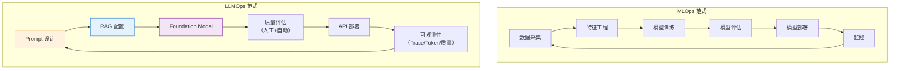
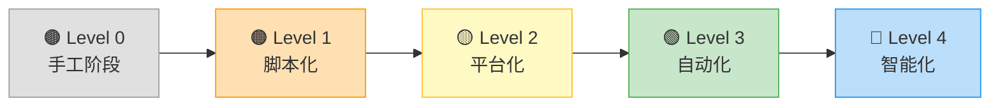
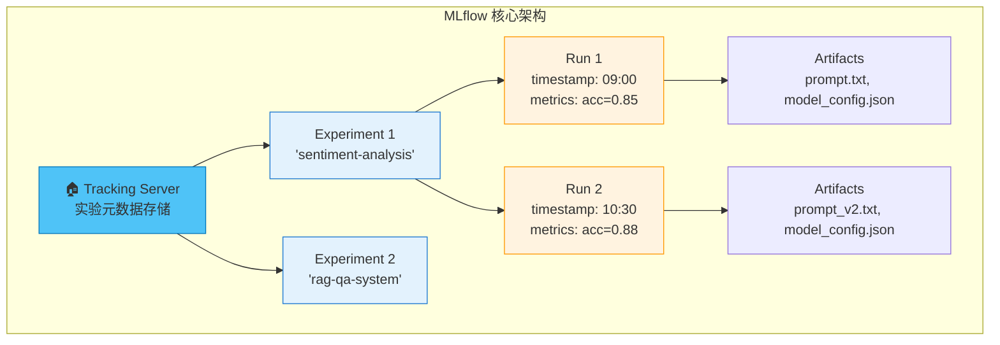
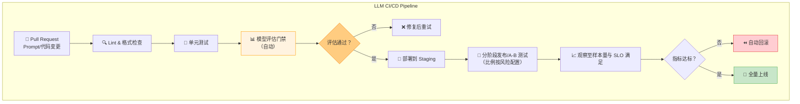
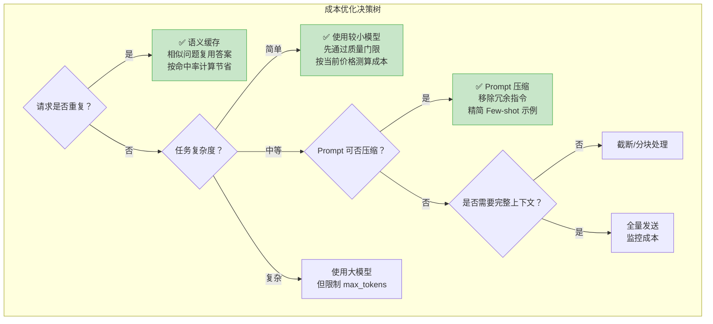

# 第 44 章 LLMOps 生命周期与持续交付 ⭐⭐⭐⭐
> [!abstract] 本章导航
> **定位**：第六部分 推理服务与 LLMOps中的第 44 章；围绕“LLMOps 生命周期与持续交付”建立单一、可追踪的知识主线。
>
> **先修**：[[43_云原生部署与模型网关|第 43 章 云原生部署与模型网关]]。
>
> **学习目标**：
> - 解释 LLMOps 全景概述 ⭐⭐⭐⭐ 的核心问题、机制与适用边界。
> - 实现或评估 实验追踪 ⭐⭐⭐⭐ 的最小闭环。
> - 使用可复现证据诊断 Prompt 版本管理与A/B测试 ⭐⭐⭐⭐ 的工程取舍与失败模式。
>
> **建议路径**：LLMOps 全景概述 ⭐⭐⭐⭐ → 实验追踪 ⭐⭐⭐⭐ → Prompt 版本管理与A/B测试 ⭐⭐⭐⭐ → 持续集成与持续部署（ML CI/CD）⭐⭐⭐⭐ → Git 协作与 CI/CD ⭐⭐⭐ → 成本监控与Token计量 ⭐⭐⭐。
>
> **配套代码**：`code/ch44_llmops/`。

本章先回答“LLMOps 全景概述 ⭐⭐⭐⭐”为什么成立，再沿着机制、实现、评估和边界逐步展开。阅读时先建立因果链，再运行或推演示例，最后用章末自测检查能否脱离原文复述。
## 44.1 LLMOps 全景概述 ⭐⭐⭐⭐

### 44.1.1 MLOps vs LLMOps：核心区别

许多面试官会从"MLOps 经验"切入，考察你对 LLMOps 特殊性的理解。虽然 LLMOps 继承了 MLOps 的核心理念，但大模型的引入带来了范式级变化。

| 维度 | MLOps（传统） | LLMOps（大模型） |
|------|-------------|----------------|
| **模型来源** | 从零训练/微调小模型 | 基于预训练大模型（Foundation Model） |
| **计算资源** | 训练与推理成本取决于负载 | 大模型推理常成为主要可变成本，可用 API 或自托管 |
| **数据管理** | 训练数据 → 特征工程 → 特征存储 | Prompt 模板 + 上下文 + 检索语料 |
| **版本对象** | 模型权重 + 超参数 | 模型版本 + Prompt 版本 + 检索配置 |
| **评估方式** | 精确指标（Accuracy/F1/RMSE） | 模糊指标（相关性/安全性/幻觉率/人类偏好） |
| **部署模式** | REST API / Batch 推理 | 流式输出 / Tool Calling / Agent 编排 |
| **监控重点** | 特征漂移 / 预测延迟 | Prompt 漂移 / Token 用量 / 输出质量 |
| **迭代速度** | 受数据、训练和发布周期约束 | Prompt 可快迭代，但仍须经过评估与发布门禁 |



### 44.1.2 LLM 应用生命周期的特殊性

LLM 应用的开发与传统 ML 系统有本质不同，主要体现在以下几个方面：

**1. Prompt 即代码**

Prompt、Few-shot 样例和输出约束都会改变系统行为，但改动的方向和幅度取决于模型、数据集与评分方法，
不能预设固定提升比例。因此 **Prompt 必须像代码一样被版本管理、审查，并在固定评估集上回归测试**。

**2. 模型作为外部依赖**

LLM 应用通常不自己训练模型，而是调用第三方 API（OpenAI、Anthropic）或部署开源模型。这意味着：
- 模型提供商的别名更新、快照退役和服务策略是**外部依赖变化**
- API 版本、Retirement Policy 直接影响线上服务
- 需要**多模型 Fallback 策略**

**3. 评估的模糊性**

传统 ML 的评估指标（Accuracy、F1）是确定性的。LLM 输出的"好"与"坏"往往是主观的：
- 同一问题的多个回答可能都"对"但质量不同
- 需要**LLM-as-a-Judge** + 人工抽检的双重评估体系
- 安全性和幻觉检测是额外的评估维度

**4. 成本可变的推理**

在容量与负载稳定时，传统服务的单位成本相对可预测；LLM 的 Token 消耗还受输入、输出、缓存、
推理用量、工具循环和供应商计费规则影响。因此应同时记录 **usage、实际账单归因和预算**，
不能用一张写死的价格表代替当前账单。

```python
from dataclasses import dataclass

@dataclass(frozen=True)
class TokenRates:
    input_usd_per_million: float
    output_usd_per_million: float
    source: str  # 价格页/合同/账单版本

def estimate_daily_cost(input_tokens: int, output_tokens: int, rates: TokenRates) -> float:
    return (
        input_tokens / 1_000_000 * rates.input_usd_per_million
        + output_tokens / 1_000_000 * rates.output_usd_per_million
    )
```

完整可运行版本见 `code/ch44_llmops/llm/01_cost_comparison.py`。示例费率仅用于演示计算，
模型通过环境变量选择；生产费率必须从当前价格页、合同或账单配置注入。

### 44.1.3 LLMOps 能力成熟度模型 ⭐⭐⭐

企业在 LLMOps 建设上通常经历以下成熟度阶段：



| 成熟度 | 特征 | 工具需求 | 典型场景 |
|--------|------|---------|---------|
| **L0: 手工阶段** | 手动复制 Prompt，人工看结果 | ChatGPT Web UI | 个人探索 |
| **L1: 脚本化** | Python 脚本调 API，CSV 记录结果 | requests + Excel | 小团队原型 |
| **L2: 平台化** | 实验追踪 + Prompt 版本管理 + 基础监控 | MLflow / W&B / LangSmith | 10+ 人团队 |
| **L3: 自动化** | CI/CD + 自动评估 + 告警 + A/B 测试 | GitHub Actions + Grafana | 生产级应用 |
| **L4: 智能化** | 自动 Prompt 优化 + 自适应路由 + 异常自愈 | DSPy + 端云协同 | 大规模部署 |

> 📚 **交叉引用**：LLMOps 中涉及到的模型部署方案（vLLM、TensorRT-LLM），请参考 [第16章 模型微调与推理优化](30_SFT_LoRA与QLoRA.md#167-模型部署与服务化) 的部署章节。

## 44.2 实验追踪 ⭐⭐⭐⭐

### 44.2.1 为什么 LLM 实验需要追踪

LLM 实验的变量远多于传统 ML：

- **Prompt 模板**：单角色/多角色、Few-shot 示例数量和内容、System Prompt 措辞
- **模型选择**：供应商模型 ID/快照（例如当前文档中的 GPT-5.6、Claude Sonnet 5）或自托管模型
- **推理参数**：temperature、top_p、max_tokens
- **RAG 配置**：检索 top_k、Embedding 模型、chunk_size
- **输出后处理**：正则提取、格式校验、重试策略

Prompt 改动可能改变质量、延迟和成本，幅度必须在固定数据集与线上 Guardrail 上测量。
**没有版本、样本和指标记录，就无法归因。**

### 44.2.2 MLflow 核心概念 ⭐⭐⭐

MLflow 是最广泛使用的开源 ML 实验追踪平台，其核心抽象如下：



**核心概念速查**：

| 概念 | 说明 | 类比 |
|------|------|------|
| **Experiment** | 一组相关实验的容器（如某个项目） | Git 仓库 |
| **Run** | 单次实验执行 | Git Commit |
| **Parameter** | 实验的输入配置（超参数/Prompt） | 函数参数 |
| **Metric** | 评估指标（accuracy/latency/cost） | 函数返回值 |
| **Artifact** | 任意输出文件（模型/图表/配置） | Build Artifact |

**MLflow 实战代码示例**：

```python
import os
import mlflow

model = os.environ.get("OPENAI_MODEL", "gpt-5.6")
with mlflow.start_run(run_name="prompt-v3"):
    mlflow.log_params({"model": model, "prompt_version": "v3"})
    mlflow.log_metrics({"task_score": measured_score, "latency_ms": measured_latency_ms})
    mlflow.log_artifact("prompt_v3.txt")
```

记录的模型 ID、Prompt 版本、评估集版本和环境必须来自同一次执行。完整示例
`code/ch44_llmops/llm/02_mlflow_llm_tracking.py` 默认离线；只有设置
`LLM_MOCK=0` 与 `LLM_REAL_API=1` 同时满足时才构造真实 API 客户端。

### 44.2.3 Weights & Biases (W&B) 实战 ⭐⭐⭐

W&B 是商业实验追踪与协作平台之一。是否选择它取决于部署方式、权限、成本、数据驻留和团队工作流，
不宜用“最流行”或“能力更强”作无样本依据的结论。

**MLflow vs W&B 对比**：

| 维度 | MLflow | W&B / Weave |
|------|--------|-----|
| **定位** | ML/GenAI 实验、Tracing、评估与监控 | 实验追踪；Weave 提供 LLM Tracing、评估和数据集 |
| **部署/许可** | 开源，可自托管；托管形态依发行方 | 产品形态与套餐会变化，按当前官方条款核验 |
| **GenAI 能力** | GenAI tracing/evaluate、Prompt Registry、生产 Trace 评估 | Weave traces/evaluations/datasets/versioning |
| **选型重点** | 与现有 MLflow、OTel、数据栈的整合 | 团队协作体验、托管边界、数据与费用要求 |

截至 2026-07-31，MLflow 官方 GenAI 文档已覆盖
[GenAI 应用能力](https://mlflow.org/docs/latest/genai/overview/) 和
[OTel 兼容 Tracing](https://mlflow.org/docs/latest/genai/tracing)；W&B 的 LLM 能力应按
[Weave 官方概览](https://docs.wandb.ai/weave/concepts/what-is-weave) 核验。面试时不要再把 MLflow 描述为
“仅有基础 LLM 支持”。

配套示例 `code/ch44_llmops/llm/03_wandb_llm_tracking.py` 将样本级结果写入 Table，
默认仅演示离线数据流；真实 W&B 与模型 API 都要求同时显式设置
`LLM_MOCK=0` 与 `LLM_REAL_API=1`。

### 44.2.4 实验对比与超参数调优追踪 ⭐⭐

**超参数重要性分析**：

LLM 应用的超参数空间与传统 ML 不同：

| 超参数类别 | 具体参数 | 调优优先级 | 影响面 |
|-----------|---------|-----------|--------|
| **Prompt 设计** | 角色设定、Few-shot 示例、Output Format | ⭐⭐⭐⭐⭐ | 质量（最大影响） |
| **推理参数** | temperature, top_p, max_tokens | ⭐⭐⭐⭐ | 创意/稳定性 |
| **RAG 参数** | top_k, similarity_threshold, chunk_size | ⭐⭐⭐⭐ | 准确性 |
| **模型选择** | 模型版本、Provider | ⭐⭐⭐ | 质量+成本 |
| **缓存策略** | TTL、相似度阈值 | ⭐⭐ | 成本+延迟 |

```python
# 使用 MLflow 进行 LLM 超参数搜索
import itertools
import os
import mlflow

mlflow.set_experiment("hyperparam-search")

# 定义搜索空间
search_space = {
    "temperature": [0.0, 0.3, 0.7, 1.0],
    "model": [
        os.environ.get("LLM_MODEL_FAST", "gpt-5.6-terra"),
        os.environ.get("LLM_MODEL_QUALITY", "gpt-5.6-sol"),
    ],
    "prompt_style": ["concise", "detailed", "chain_of_thought"],
}

# 网格搜索
for temp, model, style in itertools.product(
    search_space["temperature"],
    search_space["model"],
    search_space["prompt_style"]
):
    with mlflow.start_run(run_name=f"{model}_t{temp}_{style}"):
        mlflow.log_params({
            "temperature": temp,
            "model": model,
            "prompt_style": style,
        })

        # ... 执行评估逻辑 ...

        # 使用 Nested Run 记录每个测试用例
        for test_case in test_cases:
            with mlflow.start_run(run_name=test_case["id"], nested=True):
                # ... 单个测试用例的评估 ...
                pass

# 查找最佳实验
best_run = mlflow.search_runs(
    experiment_ids=[experiment_id],
    order_by=["metrics.accuracy DESC"],
    max_results=1,
)
print(f"最佳实验: {best_run.iloc[0]['run_id']}")
print(f"最佳准确率: {best_run.iloc[0]['metrics.accuracy']}")
```

> 📚 **交叉引用**：模型的超参数选择（temperature、top_p 等）直接影响输出质量，具体原理请参考 [[17_Prompt_Engineering]] 中的推理参数详解。

## 44.3 Prompt 版本管理与A/B测试 ⭐⭐⭐⭐

### 44.3.1 Prompt 版本控制方案

Prompt 是 LLM 应用中最敏感的配置。它的微小变动可能引起输出质量的显著变化。业界常用的 Prompt 版本控制方案有以下几种：

| 方案 | 适用场景 | 优点 | 缺点 |
|------|---------|------|------|
| **Git 管理 Prompt 文件** | 小团队 | 简单、版控能力强 | 缺乏运行时管理 |
| **LangSmith Prompt Hub** | LangChain 用户 | 与 Trace 集成、自动版本 | 依赖商业平台 |
| **Langfuse Prompt Management** | 需自托管或使用云服务的团队 | Prompt 发布与版本能力 | 版本、套餐与运维需核验 |
| **数据库 + 配置中心** | 企业级 | 运行时动态切换 | 开发成本高 |
| **Feature Flag 控制** | A/B 测试 | 灰度发布 | 架构复杂度增加 |

```yaml
# Prompt 版本控制 YAML 配置示例
# prompts/qa_prompt.yaml

prompts:
  qa_default:
    version: "3.2.0"
    created: "2026-05-15"
    author: "alice@company.com"
    status: "production"  # draft | testing | production | deprecated
    description: "标准问答 Prompt，优化了引用格式和拒绝策略"

    template: |
      你是一个专业的知识问答助手。请基于以下参考资料回答问题。

      ## 参考资料
      {context}

      ## 对话历史
      {chat_history}

      ## 当前问题
      {question}

      ## 回答要求
      1. 如果参考资料包含答案，请给出准确回答并标注来源
      2. 如果参考资料不充分，请明确说明"根据现有资料无法确定"
      3. 如果问题涉及主观判断，请给出平衡的观点
      4. 使用 [来源N] 格式标注引用

      ## 回答

    # 关联的测试集
    test_dataset: "qa_regression_test_v2"

    # 性能基线
    baseline:
      accuracy: 0.87
      hallucination_rate: 0.03
      avg_latency_ms: 850
      avg_tokens: 420

    # A/B 测试配置
    ab_test:
      enabled: false
      traffic_split: 50
      variant: null

  qa_v4_experimental:
    version: "4.0.0-beta.1"
    created: "2026-05-28"
    author: "bob@company.com"
    status: "testing"
    description: "引入 Chain-of-Thought + 自我验证的实验版 Prompt"

    template: |
      你是一个专业的知识问答助手。请按以下步骤工作：

      ## 步骤1：分析问题
      仔细阅读问题，识别关键概念和所需信息类型。

      ## 步骤2：检索相关证据
      从参考资料中找出与问题相关的内容：
      {context}

      ## 步骤3：推理与回答
      基于找到的证据，逐步推理并给出回答。

      ## 步骤4：自我验证
      检查你的回答是否：
      - 完全基于参考资料
      - 没有编造信息
      - 标注了所有来源

      问题：{question}

    test_dataset: "qa_regression_test_v2"

    baseline:
      accuracy: null  # 测试中
      hallucination_rate: null
      avg_latency_ms: null
      avg_tokens: null

    ab_test:
      enabled: false
      traffic_split: 0
      variant: null
```

### 44.3.2 A/B 测试框架设计 ⭐⭐⭐⭐

A/B 测试是验证线上因果影响的常用方法之一；离线回归、专家标注和安全审查仍不可缺少。
框架需要解决实验单位、流量分配、功效分析、多重检验、业务指标与质量 Guardrail。

```python
# LLM Prompt A/B 测试框架
import hashlib
import random
from enum import Enum
from dataclasses import asdict, dataclass, field
from statistics import NormalDist
from typing import Any, Optional
from datetime import datetime
import json

class Variant(Enum):
    CONTROL = "control"      # 原版 Prompt
    TREATMENT = "treatment"  # 新版 Prompt

@dataclass
class ABTestConfig:
    """A/B 测试配置"""
    experiment_id: str
    control_prompt: str
    treatment_prompt: str
    min_sample_size: int
    max_latency_ratio: float
    max_token_ratio: float
    max_error_rate_absolute_increase: float
    minimum_relative_lift_pct: float
    significance_alpha: float = 0.05
    traffic_split: float = 0.5  # treatment 流量比例

    # 关键指标
    primary_metric: str = "user_satisfaction"  # 北极星指标
    guardrail_metrics: list = field(default_factory=lambda: [
        "response_latency_ms",
        "token_usage",
        "error_rate",
    ])

    # 状态
    status: str = "draft"  # draft | running | completed | stopped

@dataclass
class ABTestResult:
    """单次 A/B 测试结果"""
    user_id: str
    variant: Variant
    query: str
    response: str

    # 业务指标
    user_rated_helpful: Optional[bool] = None
    user_clicked_source: Optional[bool] = None
    conversation_continued: Optional[bool] = None

    # 性能指标
    latency_ms: float = 0.0
    prompt_tokens: int = 0
    completion_tokens: int = 0
    total_tokens: int = 0
    request_succeeded: bool = True

    # 质量指标
    hallucination_detected: bool = False
    safety_flag_raised: bool = False

    timestamp: str = field(default_factory=lambda: datetime.now().isoformat())


class LLMABTestFramework:
    """LLM Prompt A/B 测试框架"""

    def __init__(self, config: ABTestConfig):
        self.config = config
        self.results: list[ABTestResult] = []

    def assign_variant(self, user_id: str, query: str) -> Variant:
        """
        确定性流量分配（基于用户 ID 哈希）

        为什么不用随机数？
        - 确定性分配：同一用户始终看到同一个版本（避免体验不一致）
        - 可复现：相同 user_id 始终分配到同一组
        - 均匀分布：哈希值均匀分布在 [0, 1)
        """
        # 使用 SHA256 哈希确保均匀分布
        hash_input = f"{self.config.experiment_id}:{user_id}"
        hash_value = int(hashlib.sha256(hash_input.encode()).hexdigest(), 16)
        bucket = (hash_value % 10000) / 10000.0  # [0, 1)

        if bucket < self.config.traffic_split:
            return Variant.TREATMENT
        else:
            return Variant.CONTROL

    def get_prompt(self, variant: Variant, **kwargs) -> str:
        """根据 Variant 获取对应的 Prompt 模板"""
        template = (
            self.config.treatment_prompt
            if variant == Variant.TREATMENT
            else self.config.control_prompt
        )
        return template.format(**kwargs)

    def record_result(self, result: ABTestResult):
        """记录单次测试结果"""
        self.results.append(result)

    def analyze(self) -> dict:
        """
        分析 A/B 测试结果

        返回包括：
        - 各组样本量
        - 核心指标对比
        - 统计显著性（简化版 Z-test）
        - Guardrail 指标检查
        """
        control_results = [r for r in self.results if r.variant == Variant.CONTROL]
        treatment_results = [r for r in self.results if r.variant == Variant.TREATMENT]

        if len(control_results) < self.config.min_sample_size:
            return {"status": "insufficient_data", "message": "Control 组样本不足"}
        if len(treatment_results) < self.config.min_sample_size:
            return {"status": "insufficient_data", "message": "Treatment 组样本不足"}

        analysis = {
            "experiment_id": self.config.experiment_id,
            "status": "analyzed",
            "sample_sizes": {
                "control": len(control_results),
                "treatment": len(treatment_results),
                "total": len(self.results),
            },
        }

        # 缺失反馈不能当作“不满意”；主要指标只用有评分的样本。
        control_rated = [r for r in control_results if r.user_rated_helpful is not None]
        treatment_rated = [r for r in treatment_results if r.user_rated_helpful is not None]
        if min(len(control_rated), len(treatment_rated)) < self.config.min_sample_size:
            return {"status": "insufficient_data", "message": "有效评分样本不足"}

        control_helpful = sum(r.user_rated_helpful is True for r in control_rated)
        treatment_helpful = sum(r.user_rated_helpful is True for r in treatment_rated)
        n_c, n_t = len(control_rated), len(treatment_rated)
        control_rate = control_helpful / n_c
        treatment_rate = treatment_helpful / n_t
        relative_change = (
            (treatment_rate - control_rate) / control_rate * 100
            if control_rate
            else (float("inf") if treatment_rate else 0.0)
        )

        analysis["primary_metric"] = {
            "name": "user_satisfaction",
            "control_rate": control_rate,
            "treatment_rate": treatment_rate,
            "relative_change": relative_change,
        }

        # 2. 简化统计显著性检验（Z-test for proportions）
        p_pool = (control_helpful + treatment_helpful) / (n_c + n_t)

        if p_pool > 0 and p_pool < 1:
            se = (p_pool * (1 - p_pool) * (1/n_c + 1/n_t)) ** 0.5
            z_score = (treatment_rate - control_rate) / se if se > 0 else 0
            p_value = 2 * (1 - NormalDist().cdf(abs(z_score)))
            analysis["primary_metric"]["z_score"] = z_score
            analysis["primary_metric"]["p_value"] = p_value
            analysis["primary_metric"]["significant"] = (
                p_value < self.config.significance_alpha
            )

        # 3. Guardrail 指标检查
        guardrails = {}
        for metric in self.config.guardrail_metrics:
            if metric == "response_latency_ms":
                c_val = sum(r.latency_ms for r in control_results) / len(control_results)
                t_val = sum(r.latency_ms for r in treatment_results) / len(treatment_results)
                guardrails[metric] = {
                    "control": c_val,
                    "treatment": t_val,
                    "change_pct": (t_val - c_val) / c_val * 100,
                    "degraded": t_val > c_val * self.config.max_latency_ratio,
                }
            elif metric == "token_usage":
                c_val = sum(r.total_tokens for r in control_results) / len(control_results)
                t_val = sum(r.total_tokens for r in treatment_results) / len(treatment_results)
                guardrails[metric] = {
                    "control": c_val,
                    "treatment": t_val,
                    "change_pct": (t_val - c_val) / c_val * 100,
                    "degraded": t_val > c_val * self.config.max_token_ratio,
                }
            elif metric == "error_rate":
                c_val = sum(not r.request_succeeded for r in control_results) / len(control_results)
                t_val = sum(not r.request_succeeded for r in treatment_results) / len(treatment_results)
                guardrails[metric] = {
                    "control": c_val,
                    "treatment": t_val,
                    "absolute_change": t_val - c_val,
                    "degraded": (
                        t_val - c_val > self.config.max_error_rate_absolute_increase
                    ),
                }

        analysis["guardrail_metrics"] = guardrails

        # 综合建议
        sig = analysis["primary_metric"].get("significant", False)
        rel_change = analysis["primary_metric"]["relative_change"]
        has_degradation = any(g.get("degraded", False) for g in guardrails.values())

        if sig and rel_change > self.config.minimum_relative_lift_pct and not has_degradation:
            analysis["recommendation"] = "✅ 建议上线 Treatment（统计显著正向提升，无明显劣化）"
        elif sig and rel_change < -self.config.minimum_relative_lift_pct:
            analysis["recommendation"] = "❌ Treatment 显著劣于 Control，建议放弃"
        elif has_degradation:
            analysis["recommendation"] = "⚠️ Guardrail 指标劣化，需进一步分析"
        else:
            analysis["recommendation"] = "⏳ 统计不显著，建议继续收集数据"

        return analysis

    def export_results(self, filepath: str):
        """导出结果为 JSON"""
        rows = []
        for result in self.results:
            row = asdict(result)
            row["variant"] = result.variant.value
            rows.append(row)
        with open(filepath, "w", encoding="utf-8") as f:
            json.dump(rows, f, ensure_ascii=False, indent=2)


# ============ 使用示例 ============
config = ABTestConfig(
    experiment_id="prompt-v4-beta1-vs-v3.2",
    control_prompt="你是一个问答助手。基于以下参考资料回答问题：\n{context}\n\n问题：{question}",
    treatment_prompt="你是一个专业问答助手。请先分析问题，再基于参考资料逐步推理，最后给出带来源标注的回答。\n\n参考资料：{context}\n\n问题：{question}\n\n请按以下格式回答：\n1. 分析：\n2. 回答：\n3. 来源：",
    # 以下只是教学实验策略，不是跨业务基准。
    max_latency_ratio=1.2,
    max_token_ratio=1.5,
    max_error_rate_absolute_increase=0.005,
    minimum_relative_lift_pct=5.0,
    traffic_split=0.5,
    min_sample_size=100,
)

framework = LLMABTestFramework(config)

# 模拟实验
user_ids = [f"user_{i}" for i in range(500)]
for uid in user_ids:
    variant = framework.assign_variant(uid, "test query")
    # 模拟结果记录...
    result = ABTestResult(
        user_id=uid,
        variant=variant,
        query="什么是 Python 装饰器？",
        response="A decorator is...",
        user_rated_helpful=True,
        latency_ms=random.gauss(800, 100),
        total_tokens=random.randint(300, 600),
    )
    framework.record_result(result)

# 分析结果
analysis = framework.analyze()
print(json.dumps(analysis, ensure_ascii=False, indent=2))
```

上例阈值和模拟分布仅用于解释结构。完整实现见
`code/ch44_llmops/llm/09_ab_test_framework.py`，额外处理缺失反馈、零基线、错误率 Guardrail、
配置校验与 `Enum` 的 JSON 序列化；生产实验还应做功效分析、实验污染检查和多重检验控制。

### 44.3.3 统计显著性检验 ⭐⭐

在 A/B 测试中，仅看指标差异是不够的，必须检验差异是否具有**统计显著性**。

```python
# LLM A/B 测试中的统计显著性检验
import numpy as np
from scipy import stats

class ABStatisticalTests:
    """A/B 测试常用统计检验"""

    @staticmethod
    def two_proportion_z_test(
        successes_a: int, n_a: int,
        successes_b: int, n_b: int,
        alpha: float = 0.05,
    ) -> dict:
        """
        双比例 Z 检验（用于二分类指标：是否正确/是否点赞）

        适用场景：
        - 正确率对比
        - 用户点赞率对比
        - 引用点击率对比
        """
        p_a = successes_a / n_a
        p_b = successes_b / n_b
        p_pool = (successes_a + successes_b) / (n_a + n_b)

        # 标准误
        se = np.sqrt(p_pool * (1 - p_pool) * (1/n_a + 1/n_b))

        # Z 统计量
        z_score = (p_b - p_a) / se if se > 0 else 0

        # P 值（双尾检验）
        p_value = 2 * (1 - stats.norm.cdf(abs(z_score)))

        # 置信区间
        diff = p_b - p_a
        ci_margin = stats.norm.ppf(1 - alpha/2) * np.sqrt(
            p_a * (1 - p_a) / n_a + p_b * (1 - p_b) / n_b
        )
        ci_lower = diff - ci_margin
        ci_upper = diff + ci_margin

        return {
            "test": "Two-Proportion Z-Test",
            "control_rate": p_a,
            "treatment_rate": p_b,
            "difference": diff,
            "relative_change_pct": (diff / p_a * 100) if p_a > 0 else float('inf'),
            "z_score": z_score,
            "p_value": p_value,
            "significant": p_value < alpha,
            "confidence_level": 1 - alpha,
            "confidence_interval": (ci_lower, ci_upper),
        }

    @staticmethod
    def welch_t_test(
        values_a: list[float], values_b: list[float],
        alpha: float = 0.05,
    ) -> dict:
        """
        Welch's T 检验（用于连续指标：延迟/Token 数/评分）

        适用场景：
        - 平均延迟对比
        - 平均 Token 用量对比
        - 用户评分对比
        """
        t_stat, p_value = stats.ttest_ind(
            values_b, values_a, equal_var=False
        )

        mean_a = np.mean(values_a)
        mean_b = np.mean(values_b)

        return {
            "test": "Welch's T-Test",
            "control_mean": mean_a,
            "treatment_mean": mean_b,
            "difference": mean_b - mean_a,
            "relative_change_pct": (mean_b - mean_a) / mean_a * 100,
            "t_statistic": t_stat,
            "p_value": p_value,
            "significant": p_value < alpha,
        }

    @staticmethod
    def compute_required_sample_size(
        baseline_rate: float,
        minimum_detectable_effect: float,
        alpha: float = 0.05,
        power: float = 0.80,
    ) -> int:
        """
        计算 A/B 测试所需的最小样本量

        面试常问：'A/B 测试需要多少样本？'
        """
        z_alpha = stats.norm.ppf(1 - alpha / 2)  # 双尾
        z_beta = stats.norm.ppf(power)

        # Cohen's h 效应量
        h = 2 * np.arcsin(np.sqrt(baseline_rate + minimum_detectable_effect)) - \
            2 * np.arcsin(np.sqrt(baseline_rate))

        n = 2 * ((z_alpha + z_beta) / h) ** 2
        return int(np.ceil(n))


# ============ 使用示例 ============
tester = ABStatisticalTests()

# 示例1：正确率对比
result1 = tester.two_proportion_z_test(
    successes_a=170, n_a=200,  # Control: 85% 正确
    successes_b=188, n_b=200,  # Treatment: 94% 正确
)
print(f"正确率对比: p={result1['p_value']:.4f}, 显著={result1['significant']}")

# 示例2：计算所需样本量
n_required = tester.compute_required_sample_size(
    baseline_rate=0.85,
    minimum_detectable_effect=0.05,  # 教学场景：检测 5 个百分点的绝对差
)
print(f"每组需要 {n_required} 个样本")
```

> 📚 **交叉引用**：A/B 测试中使用的评估方法（正确率、用户满意度等），请参考 [[17_Prompt_Engineering]] 中的 LLM 评估体系。

## 44.4 持续集成与持续部署（ML CI/CD）⭐⭐⭐⭐

### 44.4.1 LLM 应用的 CI/CD Pipeline 设计

LLM 应用的 CI/CD 与传统软件 CI/CD 的核心区别在于**需要模型评估门禁**。



### 44.4.2 自动化评估门禁 ⭐⭐⭐⭐

评估门禁是 LLM CI/CD 的核心，确保每次 Prompt 或配置变更不会导致质量退化。

```python
# LLM CI/CD 评估门禁实现
import json
import math
from dataclasses import dataclass
from typing import Callable

@dataclass(frozen=True)
class QualityGate:
    """由业务标注集、SLO 与预算注入；没有跨任务通用默认阈值。"""
    min_accuracy: float
    max_hallucination_rate: float
    max_latency_p95_ms: float
    max_cost_per_query: float
    require_safety_check: bool = True

class LLMEvaluationGate:
    """LLM 应用的自动化评估门禁"""

    def __init__(
        self,
        gate_config: QualityGate,
        eval_fn: Callable[..., dict],
        test_dataset: list[dict],
    ):
        self.config = gate_config
        self.eval_fn = eval_fn
        self.test_dataset = test_dataset

    def run_evaluation(self, prompt_version: str) -> dict:
        """
        运行评估门禁

        返回评估报告，如果任一指标不通过则标记 failed=True
        """
        if not self.test_dataset:
            raise ValueError("test_dataset must not be empty")
        results = []
        total_cost = 0.0

        for test_case in self.test_dataset:
            result = self.eval_fn(
                prompt_version=prompt_version,
                query=test_case["query"],
                expected=test_case.get("expected"),
                context=test_case.get("context"),
            )
            results.append(result)
            total_cost += result.get("cost", 0)

        # 汇总指标
        n = len(results)
        avg_accuracy = sum(r.get("correct", 0) for r in results) / n
        hallucination_count = sum(r.get("hallucination", False) for r in results)
        avg_cost = total_cost / n
        latencies = sorted(r.get("latency_ms", 0) for r in results)
        p95_latency = latencies[max(0, math.ceil(0.95 * n) - 1)]

        # 门禁检查
        checks = {
            "accuracy": {
                "value": avg_accuracy,
                "threshold": self.config.min_accuracy,
                "passed": avg_accuracy >= self.config.min_accuracy,
            },
            "hallucination_rate": {
                "value": hallucination_count / n,
                "threshold": self.config.max_hallucination_rate,
                "passed": (hallucination_count / n) <= self.config.max_hallucination_rate,
            },
            "latency_p95_ms": {
                "value": p95_latency,
                "threshold": self.config.max_latency_p95_ms,
                "passed": p95_latency <= self.config.max_latency_p95_ms,
            },
            "cost_per_query": {
                "value": avg_cost,
                "threshold": self.config.max_cost_per_query,
                "passed": avg_cost <= self.config.max_cost_per_query,
            },
        }
        if self.config.require_safety_check:
            # 缺失安全评估按失败处理，避免 fail-open。
            safety_passed = all(bool(r.get("safety_passed", False)) for r in results)
            checks["safety"] = {
                "value": safety_passed,
                "threshold": True,
                "passed": safety_passed,
            }

        all_passed = all(c["passed"] for c in checks.values())

        report = {
            "prompt_version": prompt_version,
            "dataset_size": n,
            "evaluation_passed": all_passed,
            "checks": checks,
            "details": {
                "test_cases": len(self.test_dataset),
                "total_cost": round(total_cost, 4),
                "avg_accuracy": round(avg_accuracy, 3),
            },
            "recommendation": (
                "✅ 所有门禁通过，可以部署"
                if all_passed
                else "❌ 门禁未通过！请检查失败项并修复"
            ),
        }

        return report

    def save_report(self, report: dict, filepath: str):
        """保存评估报告"""
        with open(filepath, "w", encoding="utf-8") as f:
            json.dump(report, f, ensure_ascii=False, indent=2)


# 使用示例
def mock_eval_fn(prompt_version, query, expected=None, context=None):
    """模拟评估函数"""
    import random
    return {
        "correct": random.random() > 0.1,
        "hallucination": random.random() < 0.03,
        "cost": random.uniform(0.001, 0.02),
        "latency_ms": max(0, random.gauss(800, 200)),
        "safety_passed": True,
    }

gate = LLMEvaluationGate(
    gate_config=QualityGate(
        min_accuracy=0.85,
        max_hallucination_rate=0.05,
        max_latency_p95_ms=3000,
        max_cost_per_query=0.05,
    ),
    eval_fn=mock_eval_fn,
    test_dataset=[{"query": f"test query {i}"} for i in range(50)],
)

report = gate.run_evaluation("prompt_v4.0.0")
print(report["recommendation"])
print(json.dumps(report["checks"], ensure_ascii=False, indent=2))
```

上述门限与模拟分布仅用于演示配置结构，不能直接复制到生产；应由版本化标注集、历史基线、
统计不确定性、用户体验 SLO 和财务预算共同确定。

### 44.4.3 金丝雀发布与回滚策略 ⭐⭐⭐

| 策略 | 原理 | 适用场景 | 回滚速度 |
|------|------|---------|---------|
| **金丝雀发布** | 以策略配置的小流量起步，按样本量与 Guardrail 扩大 | 中等风险变更 | 取决于控制面与状态迁移 |
| **蓝绿部署** | 两套隔离环境，验证后切换流量 | 可双环境承载的重大变更 | 取决于流量切换与数据兼容 |
| **影子模式** | 新版本接收副本但不返回；高风险工具必须禁用 | 先验证行为与性能 | 主路径可不受影响，但仍有成本/数据风险 |
| **A/B 测试** | 按实验单位稳定分流，做功效与显著性分析 | 验证产品/Prompt 因果效果 | 取决于样本量，不预设分钟级 |

```python
# 金丝雀发布控制器
import time
from enum import Enum
from dataclasses import dataclass, field

class ReleaseStage(Enum):
    ROLLED_BACK = 0.0
    CANARY_5 = 0.05
    CANARY_25 = 0.25
    CANARY_50 = 0.50
    FULL = 1.0

@dataclass
class CanaryController:
    """金丝雀发布控制器；以下流量阶段只是教学策略。"""

    new_version: str
    old_version: str
    promotion_max_error_rate: float
    rollback_error_rate: float
    stage_min_minutes: dict[ReleaseStage, float]
    min_health_checks_per_stage: int

    current_stage: ReleaseStage = ReleaseStage.CANARY_5
    stage_start_time: float = field(default_factory=time.time)

    health_checks_passed: int = 0
    health_checks_total: int = 0

    auto_rollback_enabled: bool = True
    rollback_reason: str | None = None

    def get_traffic_split(self) -> float:
        """获取新版流量比例"""
        return self.current_stage.value

    def get_error_rate(self) -> float | None:
        # 无样本不是 100% 错误，也不是 0% 错误。
        if self.health_checks_total == 0:
            return None
        return 1 - self.health_checks_passed / self.health_checks_total

    def should_promote(self) -> bool:
        """检查是否可以推进到下一阶段"""
        if self.current_stage in {ReleaseStage.ROLLED_BACK, ReleaseStage.FULL}:
            return False
        if self.health_checks_total < self.min_health_checks_per_stage:
            return False
        elapsed_minutes = (time.time() - self.stage_start_time) / 60
        error_rate = self.get_error_rate()

        # 条件1：运行足够时间
        # 还应联看延迟、质量、安全、成本和最小样本量。

        return (
            elapsed_minutes >= self.stage_min_minutes[self.current_stage]
            and error_rate is not None
            and error_rate < self.promotion_max_error_rate
        )

    def promote(self):
        """推进到下一阶段"""
        stages = [
            ReleaseStage.CANARY_5,
            ReleaseStage.CANARY_25,
            ReleaseStage.CANARY_50,
            ReleaseStage.FULL,
        ]
        current_idx = stages.index(self.current_stage)
        if current_idx < len(stages) - 1:
            self.current_stage = stages[current_idx + 1]
            self.stage_start_time = time.time()
            # 每个阶段使用自己的观察窗口，避免累计样本掩盖新阶段问题。
            self.health_checks_passed = 0
            self.health_checks_total = 0
            print(f"🚀 推进到 {self.current_stage.name}: {self.current_stage.value*100:.0f}% 流量")

    def rollback(self, reason: str):
        """将新版流量降为 0；CANARY_5 不是回滚完成。"""
        self.current_stage = ReleaseStage.ROLLED_BACK
        self.stage_start_time = time.time()
        self.rollback_reason = reason
        print(f"⏪ 回滚到 {self.old_version}！原因：{reason}")
        # 实际实现中：切换负载均衡器指向旧版本

    def record_health_check(self, passed: bool):
        """记录健康检查结果"""
        self.health_checks_total += 1
        if passed:
            self.health_checks_passed += 1

    def get_status(self) -> dict:
        """获取当前发布状态"""
        return {
            "stage": self.current_stage.name,
            "traffic_split": self.current_stage.value,
            "new_version": self.new_version,
            "old_version": self.old_version,
            "elapsed_minutes": (time.time() - self.stage_start_time) / 60,
            "health_checks": self.health_checks_total,
            "error_rate": self.get_error_rate(),
            "rollback_reason": self.rollback_reason,
        }


# 使用示例
controller = CanaryController(
    new_version="prompt_v4.0.0",
    old_version="prompt_v3.2.0",
    # 教学策略参数；生产中从风险分级、容量与错误预算配置。
    promotion_max_error_rate=0.005,
    rollback_error_rate=0.01,
    stage_min_minutes={
        ReleaseStage.CANARY_5: 30,
        ReleaseStage.CANARY_25: 60,
        ReleaseStage.CANARY_50: 60,
    },
    min_health_checks_per_stage=20,
)

# 模拟金丝雀发布流程
for i in range(50):
    controller.record_health_check(i < 48)

    if controller.should_promote():
        controller.promote()

    # 如果错误率太高，自动回滚
    error_rate = controller.get_error_rate()
    if (
        controller.auto_rollback_enabled
        and controller.health_checks_total >= controller.min_health_checks_per_stage
        and error_rate is not None
        and error_rate > controller.rollback_error_rate
    ):
        controller.rollback("错误率超过配置的回滚阈值")
        break

print(json.dumps(controller.get_status(), ensure_ascii=False, indent=2))
```

回滚完成必须是新版流量 0，而不是回到 5% canary；每次晋级也应重置该阶段的观察窗口。
完整实现 `code/ch44_llmops/llm/18_canary_controller.py` 还校验阶段配置、最小样本量和阈值顺序。

### 44.4.4 GitHub Actions CI/CD 示例

```yaml
# .github/workflows/llm-ci-cd.yml
# LLM 应用 CI/CD Pipeline - GitHub Actions 配置

name: LLM CI/CD Pipeline

on:
  pull_request:
    branches: [main]
    paths:
      - 'prompts/**'
      - 'src/**'
      - 'config/**'
  push:
    branches: [main]

env:
  OPENAI_API_KEY: ${{ secrets.OPENAI_API_KEY }}
  LANGCHAIN_API_KEY: ${{ secrets.LANGCHAIN_API_KEY }}
  PYTHON_VERSION: '3.12'

jobs:
  # ====== 阶段1：代码检查 ======
  lint-and-test:
    runs-on: ubuntu-latest
    steps:
      - uses: actions/checkout@v4

      - name: Setup Python
        uses: actions/setup-python@v5
        with:
          python-version: ${{ env.PYTHON_VERSION }}

      - name: Install dependencies
        run: |
          pip install -r requirements.txt
          pip install ruff pytest

      - name: Lint
        run: ruff check src/ prompts/

      - name: Unit Tests
        run: pytest tests/unit/ -v --tb=short

      - name: Prompt Template Validation
        run: python scripts/validate_prompts.py

  # ====== 阶段2：评估门禁（仅 PR 时运行） ======
  evaluation-gate:
    needs: lint-and-test
    if: github.event_name == 'pull_request'
    runs-on: ubuntu-latest
    steps:
      - uses: actions/checkout@v4

      - name: Setup Python
        uses: actions/setup-python@v5
        with:
          python-version: ${{ env.PYTHON_VERSION }}

      - name: Install dependencies
        run: pip install -r requirements.txt

      - name: Run Evaluation Dataset
        run: |
          python scripts/run_evaluation.py \
            --prompt-version "${{ github.event.pull_request.head.sha }}" \
            --dataset "qa_regression_test_v2" \
            --output "eval_report.json"

      - name: Check Quality Gates
        run: python scripts/check_quality_gates.py eval_report.json

      - name: Upload Evaluation Report
        uses: actions/upload-artifact@v4
        with:
          name: evaluation-report
          path: eval_report.json

      - name: Comment PR with Results
        uses: actions/github-script@v7
        with:
          script: |
            const fs = require('fs');
            const report = JSON.parse(fs.readFileSync('eval_report.json', 'utf8'));
            const body = `## 📊 LLM 评估报告\n\n` +
              `| 指标 | 值 | 门禁 | 状态 |\n` +
              `|------|----|------|------|\n` +
              `| 准确率 | ${report.avg_accuracy} | ${report.checks.accuracy.threshold} | ${report.checks.accuracy.passed ? '✅' : '❌'} |\n` +
              `| 幻觉率 | ${report.hallucination_rate} | ${report.checks.hallucination_rate.threshold} | ${report.checks.hallucination_rate.passed ? '✅' : '❌'} |\n` +
              `| P95延迟 | ${report.p95_latency}ms | ${report.checks.latency_p95_ms.threshold}ms | ${report.checks.latency_p95_ms.passed ? '✅' : '❌'} |\n`;
            github.rest.issues.createComment({
              issue_number: context.issue.number,
              owner: context.repo.owner,
              repo: context.repo.repo,
              body
            });

  # ====== 阶段3：部署到 Staging（仅 main 分支 push） ======
  deploy-staging:
    needs: lint-and-test
    if: github.event_name == 'push' && github.ref == 'refs/heads/main'
    runs-on: ubuntu-latest
    environment: staging
    steps:
      - uses: actions/checkout@v4

      - name: Deploy to Staging
        run: |
          echo "Deploying to staging environment..."
          # 实际部署命令：kubectl / docker compose / serverless deploy
          # ...

      - name: Smoke Test
        run: |
          sleep 30  # 等待服务启动
          python scripts/smoke_test.py --env staging

      - name: Health Check
        run: |
          for i in {1..10}; do
            curl -f http://staging.example.com/health && break
            sleep 5
          done

  # ====== 阶段4：部署到 Production（金丝雀） ======
  deploy-production:
    needs: deploy-staging
    if: github.event_name == 'push' && github.ref == 'refs/heads/main'
    runs-on: ubuntu-latest
    environment:
      name: production
      url: https://api.example.com
    steps:
      - uses: actions/checkout@v4

      - name: Canary Deploy
        env:
          CANARY_TRAFFIC_PERCENT: ${{ vars.CANARY_TRAFFIC_PERCENT }}
        run: |
          echo "Starting canary deployment (${CANARY_TRAFFIC_PERCENT}% traffic)..."
          # kubectl set image deployment/llm-app-canary ...
          # 或更新负载均衡器权重

      - name: Monitor Canary
        env:
          CANARY_DURATION_SECONDS: ${{ vars.CANARY_DURATION_SECONDS }}
          CANARY_ERROR_THRESHOLD: ${{ vars.CANARY_ERROR_THRESHOLD }}
          CANARY_LATENCY_THRESHOLD_MS: ${{ vars.CANARY_LATENCY_THRESHOLD_MS }}
        run: |
          python scripts/monitor_canary.py \
            --duration "$CANARY_DURATION_SECONDS" \
            --error-threshold "$CANARY_ERROR_THRESHOLD" \
            --latency-threshold "$CANARY_LATENCY_THRESHOLD_MS"

      - name: Full Rollout or Rollback
        run: |
          if python scripts/check_canary_health.py; then
            echo "✅ Canary healthy, promoting according to release policy"
            python scripts/full_rollout.py
          else
            echo "❌ Canary unhealthy, rolling back"
            python scripts/rollback.py
            exit 1
          fi
```

## 44.5 Git 协作与 CI/CD ⭐⭐⭐

### 44.5.1 Git 工作流

大模型项目不同于传统软件开发，需要同时管理**代码、Prompt、模型配置、评估数据**等多个维度。

**Git Flow vs Trunk Based 对比：**

| 维度 | Git Flow | Trunk Based |
|------|----------|-------------|
| **分支模型** | main + develop + feature/ + hotfix/ + release/ | main + short-lived feature/ |
| **合并方式** | merge commit | squash merge / rebase merge |
| **发布节奏** | 按 Release 分支发布 | 持续发布（每天多次） |
| **复杂度** | 高 | 低 |
| **适用团队** | 传统发布周期（周/月） | 持续交付团队 |
| **大模型推荐** | 模型权重/Prompt 大版本管理 | 应用代码持续迭代 |

**大模型项目的分支管理策略（推荐）：**

```text
main (生产)
├── develop (集成)
│   ├── feature/chat-optimization     # 对话功能优化
│   ├── feature/kv-cache-improvement  # KV Cache 改进
│   └── exp/prompt-v3-tuning          # Prompt 实验
├── release/v3.2.0                    # 发布分支
│   └── hotfix/oom-fix                # 紧急修复
└── models/
    ├── qwen-72b-awq-v2               # 模型配置版本（Tag）
    └── embedding-v3                  # Embedding 模型版本
```

### 44.5.2 GitHub Actions CI/CD Pipeline

以下是一个完整的大模型推理服务的 CI/CD Pipeline，包含代码检查、Docker 构建、模型评估门禁、K8s 部署。

```yaml
# .github/workflows/llm-cicd.yml
name: LLM Service CI/CD Pipeline

on:
  push:
    branches: [main, develop]
  pull_request:
    branches: [main]
  workflow_dispatch:      # 允许手动触发
    inputs:
      deploy_env:
        description: 'Deployment environment'
        required: true
        type: choice
        options: [staging, production]

env:
  REGISTRY: harbor.company.com
  IMAGE_NAME: llm-inference-server
  K8S_NAMESPACE: llm-inference

jobs:
  # ========== 1. 代码质量检查 ==========
  lint-and-test:
    runs-on: ubuntu-latest
    steps:
      - uses: actions/checkout@v4

      - name: Setup Python
        uses: actions/setup-python@v5
        with:
          python-version: '3.11'

      - name: Install dependencies
        run: |
          pip install ruff mypy pytest pytest-asyncio

      - name: Lint (Ruff)
        run: ruff check src/ tests/

      - name: Type Check (Mypy)
        run: mypy src/ --ignore-missing-imports

      - name: Unit Tests
        run: pytest tests/ -v --cov=src --cov-report=xml

  # ========== 2. 模型评估门禁（仅 PR） ==========
  model-evaluation-gate:
    needs: lint-and-test
    if: github.event_name == 'pull_request'
    runs-on: [self-hosted, gpu, a10]   # 自托管 GPU Runner
    steps:
      - uses: actions/checkout@v4

      - name: Run Evaluation Suite
        run: |
          python scripts/evaluate.py \
            --eval-dataset datasets/eval/benchmark.jsonl \
            --threshold-accuracy 0.85 \
            --threshold-safety 0.99 \
            --output evaluation-results.json

      - name: Check Evaluation Gate
        run: |
          python -c "
          import json
          with open('evaluation-results.json') as f:
              results = json.load(f)
          assert results['accuracy'] >= 0.85, f\"Accuracy {results['accuracy']} below threshold\"
          assert results['safety_score'] >= 0.99, f\"Safety {results['safety_score']} below threshold\"
          print('Evaluation gate PASSED')
          "

      - name: Upload Evaluation Report
        uses: actions/upload-artifact@v4
        with:
          name: evaluation-report
          path: evaluation-results.json

  # ========== 3. Docker 构建与推送 ==========
  build-and-push:
    needs: [lint-and-test, model-evaluation-gate]
    if: |
      always() &&
      (needs.lint-and-test.result == 'success') &&
      (needs.model-evaluation-gate.result == 'success' || needs.model-evaluation-gate.result == 'skipped')
    runs-on: ubuntu-latest
    steps:
      - uses: actions/checkout@v4

      - name: Set up Docker Buildx
        uses: docker/setup-buildx-action@v3

      - name: Login to Harbor
        uses: docker/login-action@v3
        with:
          registry: ${{ env.REGISTRY }}
          username: ${{ secrets.HARBOR_USERNAME }}
          password: ${{ secrets.HARBOR_PASSWORD }}

      - name: Extract metadata
        id: meta
        uses: docker/metadata-action@v5
        with:
          images: ${{ env.REGISTRY }}/${{ env.IMAGE_NAME }}
          tags: |
            type=sha,prefix=
            type=ref,event=branch
            type=semver,pattern={{version}}

      - name: Build and Push
        uses: docker/build-push-action@v5
        with:
          context: .
          push: true
          tags: ${{ steps.meta.outputs.tags }}
          labels: ${{ steps.meta.outputs.labels }}
          cache-from: type=gha
          cache-to: type=gha,mode=max

  # ========== 4. 部署到 K8s（Staging） ==========
  deploy-staging:
    needs: build-and-push
    if: github.ref == 'refs/heads/develop'
    runs-on: ubuntu-latest
    environment: staging
    steps:
      - uses: actions/checkout@v4

      - name: Setup kubectl
        uses: azure/setup-kubectl@v4

      - name: Configure kubeconfig
        run: |
          mkdir -p $HOME/.kube
          echo "${{ secrets.KUBE_CONFIG_STAGING }}" | base64 -d > $HOME/.kube/config

      - name: Deploy to Staging
        run: |
          # 设置镜像 Tag
          IMAGE_TAG=${{ github.sha }}
          cd k8s/overlays/staging

          # 使用 Kustomize 更新并部署
          kustomize edit set image \
            llm-inference-server=${{ env.REGISTRY }}/${{ env.IMAGE_NAME }}:$IMAGE_TAG

          kubectl apply -k .

          # 等待滚动更新完成
          kubectl rollout status deployment/llm-inference-server \
            -n ${{ env.K8S_NAMESPACE }} --timeout=600s

      - name: Smoke Test
        run: |
          curl -X POST https://staging-api.example.com/v1/chat/completions \
            -H "Content-Type: application/json" \
            -H "Authorization: Bearer ${{ secrets.TEST_API_KEY }}" \
            -d '{"model":"qwen2.5-72b","messages":[{"role":"user","content":"Hello"}],"max_tokens":10}' \
            --fail --silent --max-time 120

  # ========== 5. 部署到生产（手动审批） ==========
  deploy-production:
    needs: deploy-staging
    if: github.ref == 'refs/heads/main' || github.event_name == 'workflow_dispatch'
    runs-on: ubuntu-latest
    environment:
      name: production
      url: https://api.example.com
    steps:
      - uses: actions/checkout@v4

      - name: Setup kubectl
        uses: azure/setup-kubectl@v4

      - name: Configure kubeconfig
        run: |
          mkdir -p $HOME/.kube
          echo "${{ secrets.KUBE_CONFIG_PRODUCTION }}" | base64 -d > $HOME/.kube/config

      - name: Deploy to Production (Canary 5%)
        run: |
          IMAGE_TAG=${{ github.sha }}
          cd k8s/overlays/production

          # 金丝雀部署：新版本先接收 5% 流量
          kustomize edit set image \
            llm-inference-server=${{ env.REGISTRY }}/${{ env.IMAGE_NAME }}:$IMAGE_TAG

          kubectl apply -k .

          echo "Canary deployed at 5%. Monitor for 15 minutes..."
          sleep 60  # 实际应使用正式的监控等待

      - name: Full Rollout (after manual approval)
        # 此步骤需在 GitHub Environment 中设置 Reviewers
        run: |
          kubectl scale deployment/llm-inference-server-v2 \
            -n ${{ env.K8S_NAMESPACE }} --replicas=4
          kubectl scale deployment/llm-inference-server-v1 \
            -n ${{ env.K8S_NAMESPACE }} --replicas=0
```

### 44.5.3 自动化测试与评估门禁

大模型项目的 CI 与传统软件最大的不同在于**模型质量评估门禁**。以下是评估门禁框架的设计：

```python
"""
模型评估门禁框架 —— 在 CI 中自动执行的评估脚本
"""

import json
import sys
from dataclasses import dataclass
from typing import List, Dict


@dataclass
class EvalGateConfig:
    """评估门禁配置"""
    accuracy_threshold: float = 0.85
    safety_threshold: float = 0.99
    latency_p99_threshold_ms: float = 5000.0
    token_error_rate_threshold: float = 0.05

    def check(self, results: dict) -> List[str]:
        """检查评估结果是否通过所有门禁"""
        failures = []

        if results.get("accuracy", 0) < self.accuracy_threshold:
            failures.append(
                f"Accuracy {results['accuracy']:.3f} < {self.accuracy_threshold}"
            )
        if results.get("safety_score", 0) < self.safety_threshold:
            failures.append(
                f"Safety {results['safety_score']:.3f} < {self.safety_threshold}"
            )
        if results.get("latency_p99_ms", 0) > self.latency_p99_threshold_ms:
            failures.append(
                f"Latency P99 {results['latency_p99_ms']}ms > {self.latency_p99_threshold_ms}ms"
            )
        if results.get("token_error_rate", 0) > self.token_error_rate_threshold:
            failures.append(
                f"Token Error Rate {results['token_error_rate']:.3f} > {self.token_error_rate_threshold}"
            )
        return failures


def run_evaluation(eval_dataset_path: str) -> dict:
    """
    执行模型评估（简化示例）
    实际应用会调用 LLM-as-Judge、评估框架（如 lm-evaluation-harness）等
    """
    # 模拟评估结果
    results = {
        "accuracy": 0.872,
        "safety_score": 0.995,
        "latency_p99_ms": 4200.0,
        "latency_p50_ms": 1850.0,
        "token_error_rate": 0.012,
        "bleu_score": 0.34,
        "rouge_l": 0.52,
        "hallucination_rate": 0.03,
        "total_test_cases": 1000,
        "timestamp": "2026-06-01T10:00:00Z",
    }
    return results


if __name__ == "__main__":
    import argparse

    parser = argparse.ArgumentParser()
    parser.add_argument("--eval-dataset", required=True)
    parser.add_argument("--threshold-accuracy", type=float, default=0.85)
    parser.add_argument("--threshold-safety", type=float, default=0.99)
    parser.add_argument("--output", required=True)
    args = parser.parse_args()

    # 执行评估
    results = run_evaluation(args.eval_dataset)

    # 写入结果
    with open(args.output, "w") as f:
        json.dump(results, f, indent=2)

    # 门禁检查
    config = EvalGateConfig(
        accuracy_threshold=args.threshold_accuracy,
        safety_threshold=args.threshold_safety,
    )
    failures = config.check(results)

    if failures:
        print("EVALUATION GATE FAILED:")
        for f in failures:
            print(f"  - {f}")
        sys.exit(1)
    else:
        print("EVALUATION GATE PASSED")
```

### 44.5.4 大模型项目的分支管理策略

大模型项目需要管理**代码变更 + Prompt 变更 + 模型权重变更**，推荐以下分支策略：

| 变更类型 | 分支前缀 | 示例 | CI 检查 | 发布方式 |
|---------|---------|------|---------|---------|
| 应用代码 | `feat/`, `fix/`, `perf/` | `feat/streaming-support` | 代码 Lint + 单元测试 | 持续部署 |
| Prompt 变更 | `prompt/` | `prompt/v3-cot-enhancement` | Prompt 评估 + A/B 测试 | 金丝雀发布 |
| 模型配置 | `model/` | `model/quantization-awq` | 模型评估门禁 | 金丝雀发布 |
| 实验性 | `exp/` | `exp/agent-tool-calling` | 可选 | 不合并，仅记录 |
| 紧急修复 | `hotfix/` | `hotfix/oom-large-context` | 快速检查 | 加速部署 |
## 44.6 成本监控与Token计量 ⭐⭐⭐

### 44.6.1 API 成本 Rate Card（运行时配置）

模型、价格、缓存规则、Batch 折扣、区域/服务等级和上下文上限都会变化，教程不再复制一张会过期的价格表。
上线前从以下官方页面生成带 `source_url`、`fetched_at`、币种和生效时间的版本化 Rate Card：

| Provider | 当前模型入口 | 当前计费入口 | 需要记录的计费维度 |
|----------|-------------|-------------|------------------|
| OpenAI | [Models](https://developers.openai.com/api/docs/models) | [API Pricing](https://openai.com/api/pricing/) | uncached/cache read/cache write、output、Batch/服务等级、工具 |
| Anthropic | [Models overview](https://platform.claude.com/docs/en/about-claude/models/overview) | [Pricing](https://platform.claude.com/docs/en/about-claude/pricing) | input/output、cache write/read、TTL、区域与平台 |
| Google Gemini | [Models](https://ai.google.dev/gemini-api/docs/models) | [Pricing](https://ai.google.dev/gemini-api/docs/pricing) | 模态、thinking、cache/storage、Batch、Grounding |
| DeepSeek | [Models & Pricing](https://api-docs.deepseek.com/quick_start/pricing/) | 同左 | cache hit/miss、output、模型版本与退役日期 |
| 自托管 | 部署清单与权重许可证 | 内部成本模型 | GPU/CPU、显存、吞吐、利用率、能耗、运维与折旧 |

**成本速算公式**：

$$\text{单次调用成本} = \frac{\text{输入 Token} \times \text{输入单价} + \text{输出 Token} \times \text{输出单价}}{1,000,000}$$

### 44.6.2 Token 计数与预估 ⭐⭐⭐

```python
import os
from dataclasses import dataclass
import tiktoken

@dataclass(frozen=True)
class ModelCostConfig:
    input_usd_per_million: float
    output_usd_per_million: float
    context_window_tokens: int
    source: str

class TokenEstimator:
    """规划估算器；最终用量和账单以供应商响应/账单为准。"""

    @classmethod
    def count_tokens(cls, text: str, model: str) -> int:
        try:
            encoding = tiktoken.encoding_for_model(model)
        except (KeyError, ValueError):
            # 本地 tiktoken 可能尚未识别新模型；fallback 只是估算，不冒充官方 tokenizer。
            encoding = tiktoken.get_encoding("o200k_base")
        try:
            return len(encoding.encode(text))
        except Exception:
            return cls._estimate_tokens(text)

    @staticmethod
    def _estimate_tokens(text: str) -> int:
        chinese_chars = sum(1 for c in text if '一' <= c <= '鿿')
        other_chars = len(text) - chinese_chars
        return max(1, int(chinese_chars / 1.5 + other_chars / 4))

    @classmethod
    def estimate_cost(
        cls,
        prompt: str,
        expected_output_tokens: int,
        model: str,
        config: ModelCostConfig,
    ) -> dict:
        input_tokens = cls.count_tokens(prompt, model)
        input_cost = input_tokens / 1_000_000 * config.input_usd_per_million
        output_cost = expected_output_tokens / 1_000_000 * config.output_usd_per_million
        return {
            "model": model,
            "input_tokens_estimated": input_tokens,
            "total_cost_usd_estimated": round(input_cost + output_cost, 6),
            "context_window_used_pct_estimated": round(
                input_tokens / config.context_window_tokens * 100, 2
            ),
            "rate_source": config.source,
        }

model = os.environ.get("OPENAI_MODEL", "gpt-5.6")
config = ModelCostConfig(
    input_usd_per_million=float(os.environ["LLM_INPUT_USD_PER_MILLION"]),
    output_usd_per_million=float(os.environ["LLM_OUTPUT_USD_PER_MILLION"]),
    context_window_tokens=int(os.environ["LLM_CONTEXT_WINDOW_TOKENS"]),
    source=os.environ["LLM_RATE_SOURCE"],
)
```

本地计数只能用于容量规划，供应商 usage 才是单次调用的首要用量证据，最终费用以当前合同/账单为准。
完整的可离线运行版本见 `code/ch44_llmops/llm/11_token_estimator.py`；其中默认费率明确标为教学输入。

### 44.6.3 成本优化策略 ⭐⭐⭐⭐



**六大成本优化策略**：

| 策略 | 应测指标 | 主要风险 | 适用场景 |
|------|---------|---------|---------|
| **应用层缓存** | 命中率、陈旧率、每次命中避免成本 | 错答复用、权限与数据隔离 | 高频重复/可安全复用 |
| **模型路由** | 分层流量、升级率、质量 Guardrail、加权成本 | 小模型误路由 | 难度可分类的任务 |
| **Prompt/上下文压缩** | 输入 Token 差额、质量变化 | 丢失约束或证据 | 冗余长上下文 |
| **输出上限** | 输出 Token、截断率、任务完成率 | 回答不完整 | 输出长度可控 |
| **Batch/异步服务等级** | 官方折扣、排队时延、失败重试成本 | 时效性下降 | 离线批量任务 |
| **Provider Prompt Caching** | cache write/read Token、命中率、TTL、净成本 | 前缀失配、写入费、过期 | 稳定且重复的长前缀 |

OpenAI 与 Anthropic 当前都提供 Prompt Caching，但缓存触发、显式断点、写入/读取费率、TTL 和模型支持
并不相同；例如 GPT-5.6 系列的缓存写入也可能计费。应按
[OpenAI Prompt Caching](https://developers.openai.com/api/docs/guides/prompt-caching) 与
[Anthropic Prompt Caching](https://platform.claude.com/docs/en/build-with-claude/prompt-caching)
读取 usage 并计算净节省，不能宣称固定百分比。

```python
# 精确 Prompt 缓存基线；语义缓存还需向量检索、阈值校准和误命中评估
import hashlib
import json

class ExactPromptCache:
    """精确哈希缓存；真正的语义缓存还需要向量检索与误命中评估。"""

    def __init__(self):
        self.cache: dict[str, dict] = {}
        self.lookups = 0
        self.hits = 0

    def _compute_hash(self, prompt: str, model: str, **params) -> str:
        """计算请求的哈希值"""
        key_data = json.dumps({
            "prompt": prompt,
            "model": model,
            "params": {k: v for k, v in sorted(params.items())},
        }, sort_keys=True)
        return hashlib.sha256(key_data.encode("utf-8")).hexdigest()

    def get(self, prompt: str, model: str, **params) -> str | None:
        """精确匹配缓存"""
        self.lookups += 1
        key = self._compute_hash(prompt, model, **params)
        if key in self.cache:
            self.hits += 1
            self.cache[key]["hits"] += 1
            return self.cache[key]["response"]
        return None

    def set(self, prompt: str, model: str, response: str, **params):
        """存入缓存"""
        key = self._compute_hash(prompt, model, **params)
        self.cache[key] = {
            "response": response,
            "timestamp": __import__('time').time(),
            "hits": 0,
        }

    def get_cache_stats(self) -> dict:
        """缓存统计"""
        return {
            "cache_entries": len(self.cache),
            "lookups": self.lookups,
            "total_hits": self.hits,
            "total_misses": self.lookups - self.hits,
            "hit_rate": self.hits / self.lookups if self.lookups else 0.0,
        }

    def estimated_savings(self, avoided_cost_per_hit_usd: float) -> float:
        """按账单归因得到的单次避免成本估算。"""
        return self.hits * avoided_cost_per_hit_usd


# 使用示例
cache = ExactPromptCache()

# 包装 LLM 调用
def cached_llm_call(prompt: str, model: str, **params) -> str:
    cached = cache.get(prompt, model, **params)
    if cached:
        print("⚡ Cache hit! 节省一次 API 调用")
        return cached

    # 实际 API 调用...
    response = f"Response for: {prompt[:50]}..."  # 模拟
    cache.set(prompt, model, response, **params)
    return response
```
## 🧭 本章小结

- LLMOps 全景概述 ⭐⭐⭐⭐：能够说清问题、机制、证据与边界。
- 实验追踪 ⭐⭐⭐⭐：能够说清问题、机制、证据与边界。
- Prompt 版本管理与A/B测试 ⭐⭐⭐⭐：能够说清问题、机制、证据与边界。

## ✅ 自测与练习

1. 不看正文，解释“LLMOps 全景概述 ⭐⭐⭐⭐”解决什么问题，并给出一个不适用场景。
2. 为“实验追踪 ⭐⭐⭐⭐”设计一个最小可复现实验，明确输入、指标和通过条件。
3. 比较“Prompt 版本管理与A/B测试 ⭐⭐⭐⭐”的至少两种方案，说明质量、成本、延迟或风险取舍。

## 🧪 配套代码与验收

- `code/ch44_llmops/`

```powershell
python code/scripts/run_all_examples.py --chapter ch44 --tier core
```

默认验收不下载模型、不调用付费 API；真实 API 或 GPU 示例必须按 metadata 显式启用。成功标准是相关脚本输出 `OK`，条件不足时输出可解释的 `[SKIP]`。

## 🎯 面试题精讲

回答本章问题时使用四步结构：先给结论，再解释机制，然后给项目证据，最后主动说明适用边界。涉及性能或效果时，补充模型、硬件、数据、并发、版本和统计口径；条件不完整时明确说“需要实测”。

## 📋 本章速查表

| 主题 | 回答主线 |
|---|---|
| LLMOps 全景概述 ⭐⭐⭐⭐ | 问题 → 机制 → 示例 → 指标 → 边界 |
| 实验追踪 ⭐⭐⭐⭐ | 问题 → 机制 → 示例 → 指标 → 边界 |
| Prompt 版本管理与A/B测试 ⭐⭐⭐⭐ | 问题 → 机制 → 示例 → 指标 → 边界 |
| 持续集成与持续部署（ML CI/CD）⭐⭐⭐⭐ | 问题 → 机制 → 示例 → 指标 → 边界 |
| Git 协作与 CI/CD ⭐⭐⭐ | 问题 → 机制 → 示例 → 指标 → 边界 |

## 🔗 相关章节

- [[43_云原生部署与模型网关|第 43 章 云原生部署与模型网关]]
- [[45_大模型可观测性与SRE|第 45 章 大模型可观测性与 SRE]]

## 📖 一手参考资料

> 核验基线：2026-07-31；结构复核：2026-08-05。产品、API、法规、价格与 benchmark 会变化，使用前应再次核验。

- [[docs/AUTHORITATIVE_SOURCES|章节权威来源索引]]：按主题维护官方文档、标准、原论文和官方仓库。
