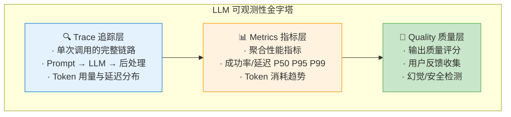
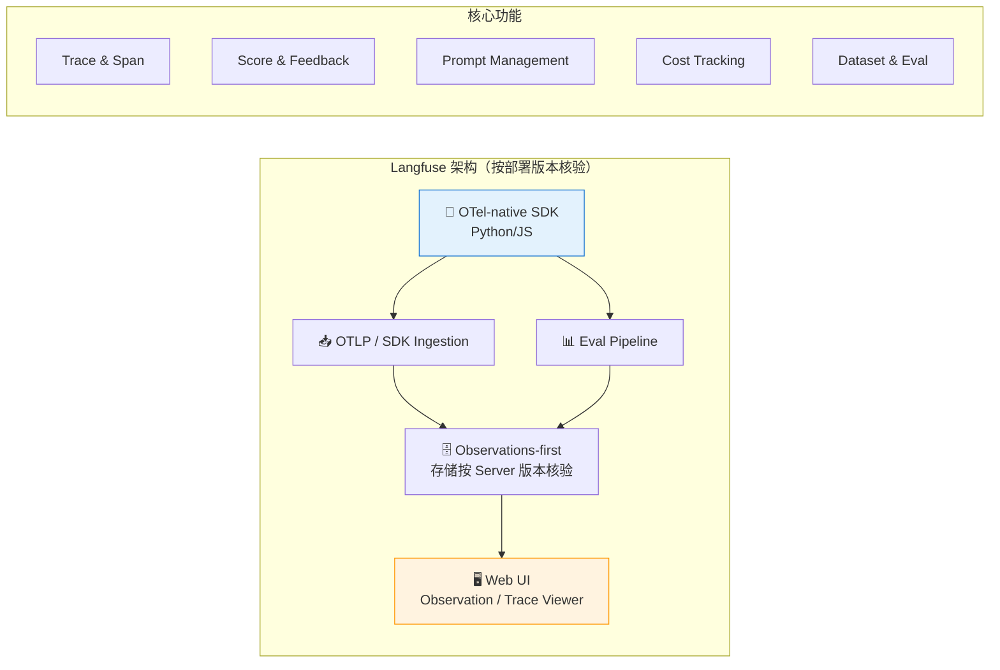
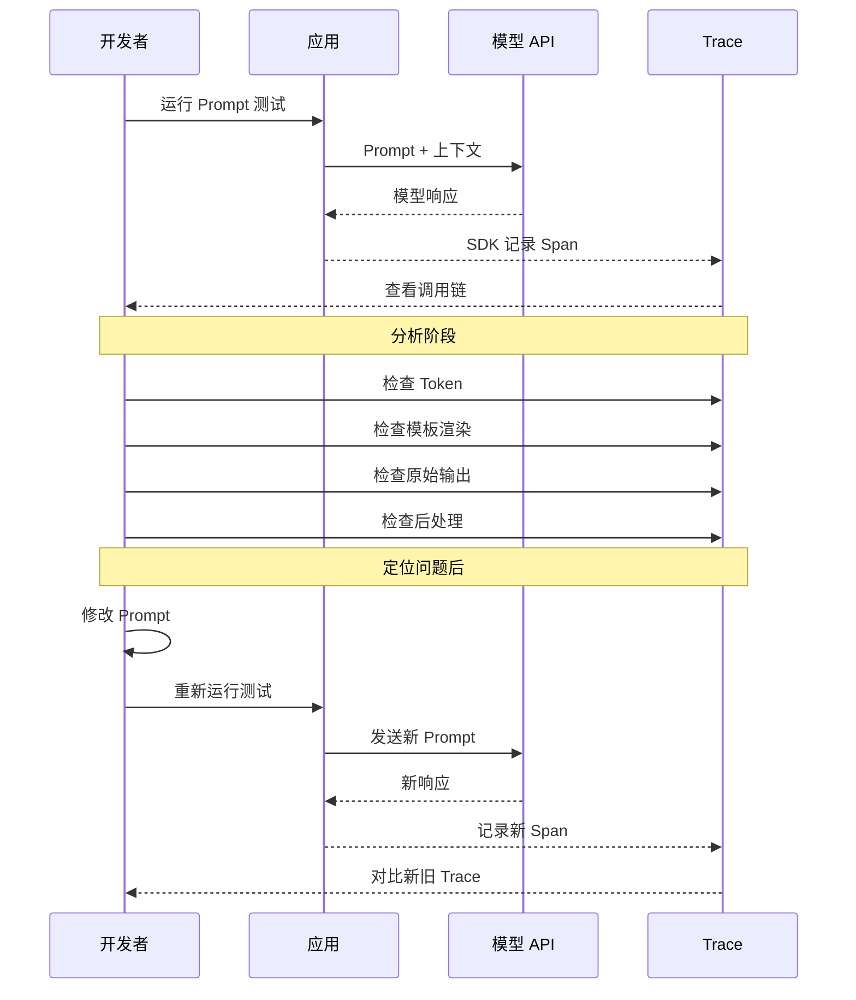
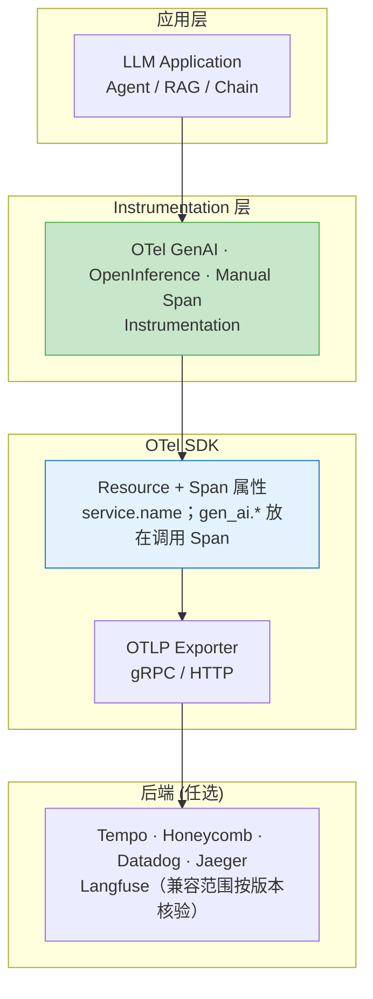
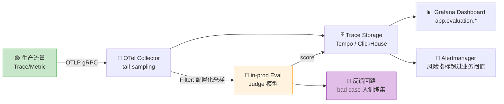
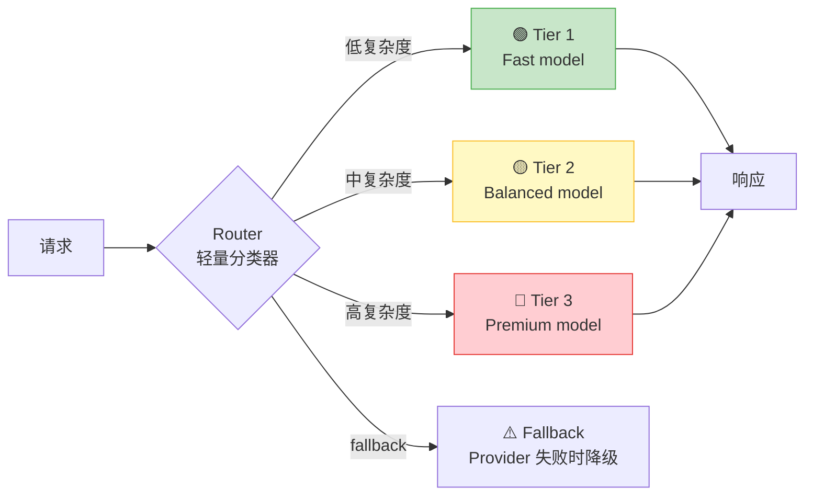

# 第 45 章 大模型可观测性与 SRE ⭐⭐⭐⭐
> [!abstract] 本章导航
> **定位**：第六部分 推理服务与 LLMOps中的第 45 章；围绕“大模型可观测性与 SRE”建立单一、可追踪的知识主线。
>
> **先修**：[[44_LLMOps生命周期与持续交付|第 44 章 LLMOps 生命周期与持续交付]]。
>
> **学习目标**：
> - 解释 LLM可观测性 ⭐⭐⭐⭐⭐ 的核心问题、机制与适用边界。
> - 实现或评估 模型监控与告警 ⭐⭐⭐⭐ 的最小闭环。
> - 使用可复现证据诊断 OpenTelemetry GenAI 语义约定（截至 2026-07-31）⭐⭐⭐⭐⭐ 的工程取舍与失败模式。
>
> **建议路径**：LLM可观测性 ⭐⭐⭐⭐⭐ → 模型监控与告警 ⭐⭐⭐⭐ → OpenTelemetry GenAI 语义约定（截至 2026-07-31）⭐⭐⭐⭐⭐。
>
> **配套代码**：`code/ch44_llmops/`。

本章先回答“LLM可观测性 ⭐⭐⭐⭐⭐”为什么成立，再沿着机制、实现、评估和边界逐步展开。阅读时先建立因果链，再运行或推演示例，最后用章末自测检查能否脱离原文复述。
## 45.1 LLM可观测性 ⭐⭐⭐⭐⭐

> 可观测性（Observability）连接线上请求、模型调用、检索、工具、成本和评测证据。实验追踪回答“做过什么实验”，运行时可观测性回答“这次请求发生了什么以及为何失败”。

### 45.1.1 什么是 LLM 可观测性

LLM 可观测性包含三个层次：



### 45.1.2 LangSmith 核心功能 ⭐⭐⭐⭐⭐

LangSmith 是 LangChain 团队推出的 LLM 可观测性平台，其核心抽象与 MLflow 类似但专注于 LLM 链路：

| 概念 | 说明 | 示例 |
|------|------|------|
| **Trace** | 一次完整的 LLM 调用链路 | 用户提问 → RAG检索 → LLM生成 → 后处理 |
| **Run** | Trace 中的单个步骤 | 单次 Embedding 计算、单次 LLM 调用 |
| **Feedback** | 对 Run 结果的人工/自动评价 | 👍/👎、5星评分、Correct/Incorrect |
| **Dataset** | 测试用例集合 | 100个标注好的问答对 |
| **Experiment** | 在 Dataset 上的一次批量评估 | 测试 Prompt v2 的准确率 |

**LangSmith 集成代码示例**：

```python
# LangSmith 可观测性实战
import os
from langsmith import traceable, Client
from openai import OpenAI

# 真实联网必须显式 opt-in；凭据只从运行环境/密钥管理系统提供。
if os.environ.get("LLM_MOCK") != "0" or os.environ.get("LLM_REAL_API") != "1":
    raise RuntimeError("live mode requires LLM_MOCK=0 and LLM_REAL_API=1")
model = os.environ.get("OPENAI_MODEL", "gpt-5.6")

client = Client()
openai_client = OpenAI()

# 方法1：使用 @traceable 装饰器自动追踪
@traceable(
    run_type="chain",
    name="QA Pipeline",
    metadata={"version": "1.2.0", "environment": "staging"}
)
def qa_pipeline(question: str, context_docs: list[str]) -> dict:
    """完整的 QA 流水线，LangSmith 自动追踪每个步骤"""

    # 步骤1：构建 Prompt
    prompt = build_prompt(question, context_docs)

    # 步骤2：调用 LLM
    answer = call_llm(prompt)

    # 步骤3：后处理
    result = post_process(answer)

    return result

@traceable(run_type="prompt", name="Build Prompt")
def build_prompt(question: str, docs: list[str]) -> str:
    """构建 Prompt（LangSmith 自动记录输入/输出）"""
    context = "\n\n".join(docs)
    return f"""基于以下上下文回答问题。

上下文：
{context}

问题：{question}

回答："""

@traceable(run_type="llm", name="LLM Call")
def call_llm(prompt: str) -> str:
    """LLM 调用；延迟可由 Span 计时，Token 仍应从 Provider usage 显式上报。"""
    response = openai_client.chat.completions.create(
        model=model,
        messages=[{"role": "user", "content": prompt}],
        temperature=0.1,
    )
    return response.choices[0].message.content

@traceable(run_type="chain", name="Post-process")
def post_process(answer: str) -> dict:
    """后处理"""
    return {
        "answer": answer.strip(),
        "length": len(answer),
        "has_citation": "来源" in answer,
    }

# 方法2：手动创建 Run 和 Feedback
def manual_trace_example():
    """手动创建 Trace 并添加 Feedback"""

    # 创建 Run
    run = client.create_run(
        name="manual-qa-evaluation",
        run_type="chain",
        inputs={"question": "什么是向量数据库？"},
        project_name=os.environ.get("LANGCHAIN_PROJECT", "my-qa-system"),
    )

    # 执行...
    result = qa_pipeline("什么是向量数据库？", ["向量数据库是...", "它用于..."])

    # 更新 Run 输出
    client.update_run(
        run.id,
        outputs=result,
        end_time=None,  # 自动记录结束时间
    )

    # 添加人工反馈
    client.create_feedback(
        run.id,
        key="user-rating",
        score=0.9,  # 0-1 评分
        comment="回答准确，引用了正确的来源",
    )

    # 添加自动评估反馈
    client.create_feedback(
        run.id,
        key="contains-citation",
        score=1.0 if result["has_citation"] else 0.0,
        comment="自动检测引用",
    )

# 运行示例
result = qa_pipeline(
    "什么是 MCP 协议？",
    ["MCP (Model Context Protocol) 是 Anthropic 推出的..."]
)
print(f"Answer: {result['answer'][:100]}...")
print(f"🔗 在 LangSmith UI 查看完整 Trace")
```

**LangSmith 在面试中的高频使用场景**：

| 场景 | LangSmith 功能 | 面试话术 |
|------|---------------|---------|
| **调试 Prompt** | 查看完整 Trace，定位哪一步出错 | "我使用 LangSmith 的 Trace 功能定位到 Prompt 中的指令歧义" |
| **回归测试** | Dataset + Experiment 对比新旧 Prompt | "每次改 Prompt 后，在 LangSmith 上跑一遍 Dataset 确保不退化" |
| **用户反馈闭环** | Feedback API 收集用户评分 | "通过 LangSmith Feedback 收集用户纠错，持续优化" |
| **成本归因** | Trace 级别的 Token 统计 | "通过 LangSmith 按项目/用户查看 Token 消耗分布" |

### 45.1.3 Langfuse：开源可观测性平台 ⭐⭐⭐⭐

Langfuse 提供 LLM Tracing、评估、Prompt 管理和数据集能力，核心可开源自托管，也有云与商业功能。
截至 2026-07-31，Cloud 已进入 v4 的 observations-first 数据模型，Python SDK v4 是当前主版本；自托管
Server 与 SDK 仍需按兼容矩阵配对。以 [Langfuse v4](https://langfuse.com/docs/v4)、
[Python v3 → v4 迁移](https://langfuse.com/docs/observability/sdk/upgrade-path/python-v3-to-v4)、
[自托管说明](https://langfuse.com/faq/all/self-hosting-langfuse) 和
[版本兼容矩阵](https://langfuse.com/docs/compatibility) 为准。



**LangSmith vs Langfuse 对比**：

| 维度 | LangSmith | Langfuse |
|------|-----------|----------|
| **产品/许可** | 商业平台；套餐与部署能力按官方条款核验 | 核心 OSS 为 MIT；云和企业能力另有条款 |
| **部署** | 按当前企业方案核验 | 可自托管；需承担数据库、升级、备份和安全运维 |
| **Prompt/评估** | 支持 Dataset、Experiment、Feedback 等工作流 | 支持 Prompt、Dataset、Experiment、Score 等工作流 |
| **集成** | 与 LangChain/LangGraph 紧密，同时支持其他集成 | 多 SDK/框架与 OTel 路径；兼容性按版本矩阵验证 |
| **成本** | 以当前套餐和用量为准 | SaaS 费用或自托管 TCO，不能把 OSS 等同于零成本 |

```python
from langfuse import get_client, observe, propagate_attributes

langfuse = get_client()  # 仅在显式 live 入口中初始化

@observe(
    name="customer-support-agent",
    as_type="agent",
    capture_input=False,
    capture_output=False,
)
def handle_customer_query(query: str, conversation_history: list) -> dict:
    # v4 用 propagate_attributes 将关联属性传播到当前及子 observations。
    with propagate_attributes(
        trace_name="customer-support-agent",
        tags=["customer-support"],
        metadata={"channel": "web"},
    ):
        intent = classify_intent(query)
        langfuse.update_current_span(metadata={"intent": intent})
        docs = retrieve_knowledge(query, intent)
        answer = generate_response(query, docs, conversation_history)
        langfuse.update_current_span(
            output={"intent": intent, "source_count": len(docs)}
        )
        langfuse.score_current_trace(
            name="response_length",
            value=min(len(answer) / 500, 1.0),
            data_type="NUMERIC",
        )
        trace_id = langfuse.get_current_trace_id()
    return {"answer": answer, "trace_id": trace_id}

# 已结束 Trace 的异步评分使用 create_score，而不是旧版 score()。
def evaluate_response_quality(trace_id: str, score: float) -> None:
    langfuse.create_score(
        trace_id=trace_id,
        name="quality_score",
        value=score,
        data_type="NUMERIC",
    )
```

`@observe` 默认会捕获参数与返回值；Prompt、检索文档或用户输入可能包含敏感数据，因此示例按官方
[Instrumentation](https://langfuse.com/docs/observability/sdk/instrumentation) 使用
`capture_input=False, capture_output=False`。配套脚本
`code/ch44_llmops/llm/06_langfuse_observability.py` 默认离线且不读取凭据。

### 45.1.4 Prompt 调试与优化 ⭐⭐⭐

**Prompt 调试**是可观测性工具的常见场景。应说明如何用 Trace 区分模板、上下文、模型、工具和输出解析问题，而不只展示一条调用链。

**Prompt 调试工作流**：



**常见 Prompt 问题及 Trace 定位方法**：

| 问题 | Trace 表现 | 定位方法 |
|------|-----------|---------|
| **Prompt 过长或被截断** | 输入 Token 接近模型/网关的上下文预算，或出现明确截断信号 | 用实际 tokenizer、Provider usage 与当前上下文上限核验 |
| **指令未被遵循** | LLM 输出格式与期望不符 | 对比 Prompt 原文与渲染结果 |
| **RAG 检索错误** | 检索结果不相关 | 检查检索步骤 Run 的输入/输出 |
| **幻觉问题** | 输出包含不存在的信息 | 对比 retrieval Run 输出与 LLM Run 输出 |
| **后处理 Bug** | LLM 输出正确但最终结果错误 | 检查后处理 Run 的输入/输出对比 |

```python
# 使用 LangSmith SDK 进行 Prompt 调试（真实查询需显式 live 授权）
import os
from langsmith import Client

if os.environ.get("LLM_MOCK") != "0" or os.environ.get("LLM_REAL_API") != "1":
    raise RuntimeError("live mode requires LLM_MOCK=0 and LLM_REAL_API=1")
client = Client()

def debug_prompt_issue(
    project_name: str,
    *,
    min_prompt_chars: int,
    max_prompt_chars: int,
):
    """字符数只做初筛；是否截断必须再核对 tokenizer、usage 和上下文上限。"""

    # 查找所有相关 Trace
    runs = list(client.list_runs(
        project_name=project_name,
        execution_order=1,
        filter=f'eq(name, "Build Prompt")',
    ))

    issues = {
        "short_prompts": [],
        "empty_contexts": [],
        "long_prompts_by_chars": [],
    }

    for run in runs:
        prompt_text = run.outputs.get("prompt", "") if run.outputs else ""
        input_data = run.inputs or {}

        if len(prompt_text) < min_prompt_chars:
            issues["short_prompts"].append({
                "run_id": run.id,
                "prompt_chars": len(prompt_text),
                "input": input_data,
            })

        # 检测2：上下文是否为空
        if not input_data.get("context"):
            issues["empty_contexts"].append({
                "run_id": run.id,
                "question": input_data.get("question"),
            })

        if len(prompt_text) > max_prompt_chars:
            issues["long_prompts_by_chars"].append({
                "run_id": run.id,
                "prompt_chars": len(prompt_text),
            })

    # 生成诊断报告
    print(f"=== Prompt 诊断报告 ===")
    print(f"总 Trace 数: {len(runs)}")
    print(f"字符数偏短: {len(issues['short_prompts'])}")
    print(f"空上下文: {len(issues['empty_contexts'])}")
    print(f"字符数偏长: {len(issues['long_prompts_by_chars'])}")

    # 返回问题的 Trace ID 供进一步分析
    return issues

# 使用示例
issues = debug_prompt_issue(
    "my-qa-system",
    min_prompt_chars=20,
    max_prompt_chars=8000,
)
```

上面的字符阈值只是教学筛选策略，不是任何模型的 Token 上限；生产中应把它们版本化，并用真实
tokenizer、Provider usage、网关截断日志和目标模型当前上下文限制复核。

### 45.1.5 Token 用量追踪 ⭐⭐⭐

```python
rates = rate_card[model]  # 来自当前价格页/合同/账单配置
cost_usd = (
    input_tokens / 1_000_000 * rates.input_usd_per_million
    + output_tokens / 1_000_000 * rates.output_usd_per_million
)
budget_tracker.record(model=model, cost_usd=cost_usd, rate_source=rates.source)
```

必须把缓存读写、批处理、推理 Token 等供应商特定计费项纳入 Rate Card；未知模型应失败并告警，
不能静默按 0 元或套用其他模型价格。完整实现见
`code/ch44_llmops/llm/08_token_tracker.py`，预算、告警比率和教学费率均可配置。

## 45.2 模型监控与告警 ⭐⭐⭐⭐

### 45.2.1 核心监控指标

LLM 应用需要多维度监控，一个完整的监控体系包含以下指标类别：

| 指标类别 | 具体指标 | 阈值来源 | 采集方式 |
|---------|---------|---------|---------|
| **延迟** | TTFT、端到端 P50/P95/P99 | 用户体验 SLO，按流式/非流式和任务分桶 | 客户端与服务端 Span |
| **吞吐** | QPS/RPM、排队、限流余量 | 供应商配额与容量压测 | 请求计数器/限流响应头 |
| **错误率** | 4xx/5xx、超时、重试后失败 | 历史基线与错误预算 | HTTP 状态码/Span status |
| **Token 用量** | 输入/输出/缓存/推理 Token | 财务预算与任务分布 | Provider usage/账单 |
| **输出质量** | 任务评分、用户反馈、不支持断言 | 标注集基线与风险等级 | 用户反馈 + 自动/人工评估 |
| **模型可用性** | 成功率、区域/Provider 故障 | 产品可用性 SLO | Health Check + 合成请求 |
| **缓存** | 命中率、陈旧率、误命中率、净节省 | 自有流量基线 | 缓存层统计 + 账单 |

```python
import math

def nearest_rank(values: list[float], percentile: float) -> float:
    if not values:
        raise ValueError("percentile requires at least one observation")
    ordered = sorted(values)
    return ordered[max(0, math.ceil(percentile * len(ordered)) - 1)]

alert_policy = {
    # 从用户体验 SLO、历史基线、错误预算和最小请求量注入，不能照抄教程数值。
    "error_rate_threshold": configured_error_rate,
    "p95_latency_threshold_ms": configured_p95_ms,
    "minimum_requests": configured_minimum_requests,
    "window": configured_window,
}
```

分位数必须明确窗口、样本量和算法；“当前采集窗口无请求”只有在该窗口本应有流量时才是故障。
完整的线程安全离线示例见 `code/ch44_llmops/llm/13_llm_metrics_collector.py`。

### 45.2.2 数据漂移检测（Embedding Drift）⭐⭐

LLM 应用的数据漂移可表现为用户问题的话题、语言或难度分布变化，但“检测到 embedding
分布变化”不等于“质量一定下降”。应把漂移信号与任务成功率、人工复核和检索/生成指标联动。

```python
import numpy as np
from scipy.spatial.distance import cosine
from scipy.stats import ks_2samp

class EmbeddingDriftDetector:
    def __init__(
        self,
        *,
        centroid_distance_threshold: float,
        ks_familywise_alpha: float,
        min_samples_per_window: int,
        max_ks_dimensions: int,
    ):
        self.centroid_threshold = centroid_distance_threshold
        self.ks_familywise_alpha = ks_familywise_alpha
        self.min_samples = min_samples_per_window
        self.max_ks_dimensions = max_ks_dimensions

    def detect_drift(self, reference: np.ndarray, current: np.ndarray) -> dict:
        if len(reference) < self.min_samples or len(current) < self.min_samples:
            # “数据不足”不能记作“未漂移”。
            return {"drift_detected": None, "status": "insufficient_data"}

        ref_array = np.asarray(reference, dtype=float)
        cur_array = np.asarray(current, dtype=float)
        if ref_array.ndim != 2 or cur_array.shape[1] != ref_array.shape[1]:
            raise ValueError("reference/current must be finite 2-D arrays with the same dimension")

        ref_centroid = np.mean(ref_array, axis=0)
        cur_centroid = np.mean(cur_array, axis=0)
        centroid_distance = float(cosine(ref_centroid, cur_centroid))

        tested_dimensions = min(ref_array.shape[1], self.max_ks_dimensions)
        pvalues = [
            float(ks_2samp(ref_array[:, dim], cur_array[:, dim]).pvalue)
            for dim in range(tested_dimensions)
        ]
        # 平均 p-value 不是显著性检验；这里用 Bonferroni 控制多重比较。
        per_dimension_alpha = self.ks_familywise_alpha / tested_dimensions
        ks_drift = min(pvalues) < per_dimension_alpha
        drift_detected = (
            centroid_distance > self.centroid_threshold or ks_drift
        )
        return {
            "drift_detected": drift_detected,
            "centroid_cosine_distance": round(centroid_distance, 4),
            "minimum_ks_pvalue": min(pvalues),
            "ks_per_dimension_alpha": per_dimension_alpha,
        }
```

质心阈值、窗口、显著性水平和抽样维度没有跨业务通用值，应使用 reference-vs-reference
回放/Bootstrap 控制误报，再用已标注的真实漂移与下游质量变化验证召回。逐维 KS 也不是完整的
多变量检验；高风险场景还应比较 MMD/分类器两样本检验等方法。完整离线实现见
`code/ch44_llmops/llm/14_embedding_drift_detector.py`。

### 45.2.3 输出质量监控 ⭐⭐⭐

```python
# LLM 输出质量自动监控
from typing import Optional

class OutputQualityMonitor:
    """LLM 输出质量自动检测器"""

    @staticmethod
    def check_hallucination_indicators(response: str, context: str = None) -> dict:
        """
        幻觉检测（基于启发式规则 + 简单检测）

        注意：这只是一个轻量级检测器，生产环境建议使用专门的幻觉检测模型
        """
        indicators = {
            "excessive_confidence": False,
            "unverifiable_claims": False,
            "contradiction": False,
            "hallucination_risk": "low",
        }

        # 检测1：过度自信模式
        overconfident_phrases = [
            "毫无疑问", "绝对是", "100%确定", "一定是",
            "definitely", "absolutely", "without any doubt",
        ]
        for phrase in overconfident_phrases:
            if phrase in response:
                indicators["excessive_confidence"] = True
                break

        # 检测2：无法验证的陈述（在无上下文时）
        if context:
            # 简化：检查回答中的关键实体是否出现在上下文中
            pass

        # 检测3：自我矛盾
        if "但是" in response and "因此" in response:
            # 简化检测：有转折又有结论时需要关注
            indicators["hallucination_risk"] = "medium"

        # 综合评分
        risk_score = sum([
            indicators["excessive_confidence"],
            indicators["unverifiable_claims"],
            indicators["contradiction"],
        ])

        if risk_score >= 2:
            indicators["hallucination_risk"] = "high"

        return indicators

    @staticmethod
    def check_safety(response: str) -> dict:
        """安全检查（简化版）"""
        safety_flags = {
            "harmful_content": False,
            "pii_leak": False,
            "prompt_injection_reflected": False,
            "overall_safe": True,
        }

        # PII 检测（简化正则）
        import re
        pii_patterns = {
            "phone": r'\b1[3-9]\d{9}\b',
            "email": r'\b[\w.-]+@[\w.-]+\.\w+\b',
            "id_card": r'\b\d{17}[\dXx]\b',
        }

        for pii_type, pattern in pii_patterns.items():
            if re.search(pattern, response):
                safety_flags["pii_leak"] = True
                safety_flags["overall_safe"] = False
                break

        return safety_flags

    @staticmethod
    def check_format_compliance(
        response: str, expected_format: str = "json"
    ) -> dict:
        """格式合规检查"""
        import json as json_module

        result = {
            "format": expected_format,
            "compliant": False,
            "error": None,
        }

        if expected_format == "json":
            try:
                # 尝试提取 JSON（处理 ```json ... ``` 包裹）
                if "```json" in response:
                    start = response.index("```json") + 7
                    end = response.index("```", start)
                    json_str = response[start:end].strip()
                elif "{" in response:
                    start = response.index("{")
                    end = response.rindex("}") + 1
                    json_str = response[start:end]
                else:
                    json_str = response

                json_module.loads(json_str)
                result["compliant"] = True
            except (ValueError, json_module.JSONDecodeError) as e:
                result["error"] = str(e)

        return result


# 使用示例
monitor = OutputQualityMonitor()

# 检测幻觉风险
response = "毫无疑问，Python 是世界上最完美的编程语言，没有任何缺点。"
hallucination = monitor.check_hallucination_indicators(response)
print(f"幻觉风险: {hallucination['hallucination_risk']}")
# 输出: 幻觉风险: high
```

### 45.2.4 Prometheus + Grafana 集成 ⭐⭐⭐

```yaml
# prometheus.yml - LLM 应用监控配置示例
global:
  scrape_interval: 15s
  evaluation_interval: 15s

scrape_configs:
  - job_name: 'llm-application'
    static_configs:
      - targets: ['localhost:8000']  # FastAPI metrics 端点
    metrics_path: '/metrics'

  - job_name: 'llm-model-gateway'
    static_configs:
      - targets: ['model-gateway:9090']

  - job_name: 'node-exporter'
    static_configs:
      - targets: ['localhost:9100']

# 告警规则
rule_files:
  - 'alerts/llm_alerts.yml'
```

```yaml
# alerts/llm_alerts.yml - LLM 应用告警规则
groups:
  - name: llm_alerts
    rules:
      # 告警1：高错误率
      - alert: HighErrorRate
        expr: |
          rate(llm_requests_failed_total[5m]) / clamp_min(rate(llm_requests_total[5m]), 1)
          > on() llm_error_rate_slo_threshold
        for: 5m
        labels:
          severity: critical
          team: llm-ops
        annotations:
          summary: "LLM API 错误率超过业务 SLO"
          description: "过去 5 分钟错误率 {{ $value | humanizePercentage }}"

      # 告警2：P95 延迟过高
      - alert: HighLatency
        expr: |
          histogram_quantile(0.95, rate(llm_request_duration_seconds_bucket[5m]))
          > on() llm_latency_p95_slo_seconds
        for: 5m
        labels:
          severity: warning
        annotations:
          summary: "P95 延迟超过业务 SLO"
          description: "当前 P95 延迟: {{ $value }}s"

      # 告警3：Token 用量逼近预算
      - alert: TokenBudgetWarning
        expr: |
          llm_token_cost_daily_total / clamp_min(llm_token_budget_daily, 0.000001)
          > on() llm_budget_warning_ratio
        for: 1m
        labels:
          severity: warning
        annotations:
          summary: "Token 成本已超过业务配置的预算预警比率"
```

上述三个阈值 Gauge 由配置系统发布；值来自业务 SLO、错误预算、基线和财务政策。缓存命中率本身
不宜设跨业务通用下限，应联合陈旧率、误命中率和净节省诊断。

```python
# FastAPI 应用中暴露 Prometheus 指标
import os
from fastapi import FastAPI
from prometheus_client import (
    CONTENT_TYPE_LATEST,
    CollectorRegistry,
    Counter,
    Histogram,
    generate_latest,
)
from starlette.responses import Response

app = FastAPI()
default_model = os.environ.get("OPENAI_MODEL", "gpt-5.6")
registry = CollectorRegistry()

# Prometheus 指标定义
llm_requests_total = Counter(
    "llm_requests_total",
    "Total LLM requests",
    ["model", "status"],
    registry=registry,
)

llm_request_duration = Histogram(
    "llm_request_duration_seconds",
    "LLM request duration in seconds",
    ["model"],
    buckets=[0.1, 0.5, 1.0, 2.0, 3.0, 5.0, 10.0, 30.0],
    registry=registry,
)

llm_token_usage = Counter(
    "llm_token_usage_total",
    "Total tokens used",
    ["model", "type"],  # type: input / output
    registry=registry,
)

# Prometheus metrics 端点
@app.get("/metrics")
async def metrics():
    return Response(
        content=generate_latest(registry),
        headers={"Content-Type": CONTENT_TYPE_LATEST},
    )

# 在 LLM 调用处记录指标
@app.post("/chat")
async def chat(request: dict):
    model = request.get("model", default_model)

    with llm_request_duration.labels(model=model).time():
        try:
            # ... LLM 调用 ...
            response = {"answer": "mock response"}

            # 记录成功
            llm_requests_total.labels(model=model, status="success").inc()
            llm_token_usage.labels(model=model, type="input").inc(100)
            llm_token_usage.labels(model=model, type="output").inc(50)

            return response
        except Exception as e:
            llm_requests_total.labels(model=model, status="error").inc()
            raise
```

这里使用独立 `CollectorRegistry`，避免测试或应用工厂重复构建时注册同名指标。成本应由 Provider usage
与版本化 Rate Card/账单归因后记录，不能在请求路径凭固定单价伪造“日成本” Gauge。

## 45.3 OpenTelemetry GenAI 语义约定（截至 2026-07-31）⭐⭐⭐⭐⭐

> 🆕 **截至 2026-07-31**：OpenTelemetry 已形成 GenAI 语义约定，但相关定义已迁移到独立的 GenAI semantic-conventions 仓库，部分信号/属性仍处于 Development 或迁移阶段。工程中必须锁定 semconv 与 instrumentation 版本，不能笼统宣称“全部 Stable 1.x”。

### 45.3.1 背景：从私有 Trace 到 OTLP `gen_ai.*` 标准

过去 LLM 可观测性高度依赖各厂商私有协议（LangSmith Trace、Langfuse Span），导致：

- 跨厂商、跨框架的 Trace 难以对齐
- 评估指标（cost / quality / safety）没有统一字段
- 与现有 APM（Datadog / Grafana Tempo / Honeycomb）集成成本高

当前可用 **OpenTelemetry GenAI Semantic Conventions**（OTel `gen_ai.*` 命名空间）表达跨后端信号，
也可使用 **OpenInference** 的 LLM/RAG 专用 Span 语义；二者并非互斥，版本与映射需显式管理：

| 规范 | 主导方 | 核心特点 | 2026 状态 |
|------|--------|---------|-----------|
| **OTel GenAI SemConv** | CNCF OpenTelemetry | OTLP 原生、定义通用 `gen_ai.*` 字段 | **部分仍为 Development；需锁版本** |
| **OpenInference** | Arize AI | LLM 专用 SpanKind、覆盖 RAG/Agent | 与 OTel 融合 |
| **LangSmith/Langfuse 产品 schema** | 各厂商 | 产品工作流与 UI | OTel 兼容范围按当前版本核验 |



### 45.3.2 OTLP `gen_ai.*` 核心字段

OTel GenAI 语义约定对通用调用字段进行了建模。下表只列截至 2026-07-31 可在官方 registry 中核验的字段；成本、RAG 命中和业务评分应放入自有命名空间，并在团队内维护 schema。

| 字段 | 类型 | 含义 | 示例 |
|------|------|------|------|
| `gen_ai.operation.name` | string | 操作类型 | `chat` / `text_completion` |
| `gen_ai.provider.name` | string | 模型提供商 | `openai` / `anthropic` / `gcp.gemini` |
| `gen_ai.request.model` | string | 请求的模型 | `gpt-5.6`、`claude-sonnet-5` |
| `gen_ai.request.temperature` | double | 采样温度 | `0.7` |
| `gen_ai.request.max_tokens` | int | 输出上限 | `2048` |
| `gen_ai.usage.input_tokens` | int | prompt tokens | `1234` |
| `gen_ai.usage.output_tokens` | int | completion tokens | `512` |
| `gen_ai.usage.cache_creation.input_tokens` | int | 缓存写入的输入 token；已包含在 input 总数中 | `200` |
| `gen_ai.usage.cache_read.input_tokens` | int | 缓存读取的输入 token；已包含在 input 总数中 | `800` |
| `gen_ai.usage.reasoning.output_tokens` | int | 推理 token；已包含在 output 总数中 | `120` |
| `gen_ai.response.finish_reasons` | string[] | 结束原因 | `["stop"]` |
| `gen_ai.response.model` | string | 实际响应模型（与请求可能不同） | `claude-sonnet-5` |
| `gen_ai.response.id` | string | Provider 响应 ID | `chatcmpl-abc123` |
| `gen_ai.operation.name` | string | 工具执行子 Span 的操作类型 | `execute_tool` |
| `gen_ai.tool.name` | string | 工具执行子 Span 的工具名 | `search_knowledge_base` |
| `gen_ai.tool.call.id` | string | 工具执行子 Span 的调用 ID | `call_xyz` |
| `gen_ai.tool.call.arguments` | object/JSON | 工具参数；Opt-In，可能包含敏感信息 | `{"query":"..."}` |

建议自定义字段使用 `app.*` 前缀，例如 `app.llm.cost.usd`、`app.rag.retrieved_documents`、
`app.evaluation.score`，避免与未来标准字段冲突。Prompt、响应和工具参数都可能含 PII/密钥，
默认不采集正文，只在经过脱敏、采样和权限控制后启用。`cache_creation.input_tokens` 与
`cache_read.input_tokens` 都属于
`input_tokens` 的子集，`reasoning.output_tokens` 是 `output_tokens` 的子集，汇总或计费时不可重复相加。
当前定义以已迁移的
[OpenTelemetry GenAI Semantic Conventions 独立仓库](https://github.com/open-telemetry/semantic-conventions-genai)
为准；旧 registry 仅保留迁移提示，相关定义仍可能处于 Development。

> 💡 **面试回答边界**：OTel 解决跨后端的信号命名和导出，LangSmith/Langfuse 等平台提供
> 调试、评估与协作能力；二者可以组合，不能据少量岗位或面经断言前者正在替代后者。

### 45.3.3 代码示例 1：OpenTelemetry SDK + GenAI 语义约定

```python
"""
20.10.3 - OpenTelemetry GenAI 语义约定的最小生产连接骨架
- 使用当前 registry 中的 gen_ai.* 属性
- 业务成本、RAG 与评估字段使用 app.* 自定义命名空间
- 通过 OTLP gRPC 导出到 Tempo / Honeycomb
"""
import os
from opentelemetry import trace, metrics
from opentelemetry.sdk.resources import Resource, SERVICE_NAME, SERVICE_VERSION
from opentelemetry.sdk.trace import TracerProvider
from opentelemetry.sdk.trace.export import BatchSpanProcessor
from opentelemetry.exporter.otlp.proto.grpc.trace_exporter import OTLPSpanExporter
from opentelemetry.exporter.otlp.proto.grpc.metric_exporter import OTLPMetricExporter
from opentelemetry.sdk.metrics import MeterProvider
from opentelemetry.sdk.metrics.export import PeriodicExportingMetricReader

if os.environ.get("OTEL_EXPORT_ENABLED") != "1":
    raise RuntimeError("set OTEL_EXPORT_ENABLED=1 only for an authorized OTLP endpoint")

# ---------- 1. Resource：服务身份 ----------
resource = Resource.create(
    {
        SERVICE_NAME: "qa-agent-prod",
        SERVICE_VERSION: "v2.3.0",
        "deployment.environment.name": "production",
    }
)

# ---------- 2. Tracer Provider + OTLP Exporter ----------
provider = TracerProvider(resource=resource)
otlp_exporter = OTLPSpanExporter(
    endpoint=os.getenv("OTEL_EXPORTER_OTLP_ENDPOINT", "http://otel-collector:4317"),
    headers={"x-api-key": os.getenv("OTEL_API_KEY", "")},
    # 可选：gzip 可能减少传输字节但增加 CPU；需按链路实测
    # compression=Compression.Gzip,
)
provider.add_span_processor(BatchSpanProcessor(otlp_exporter))
trace.set_tracer_provider(provider)
tracer = trace.get_tracer("qa-agent.instrumentation", "1.0.0")

# ---------- 3. Meter Provider：成本 / Token / 延迟指标 ----------
metric_exporter = OTLPMetricExporter(
    endpoint=os.getenv("OTEL_EXPORTER_OTLP_ENDPOINT", "http://otel-collector:4317")
)
metric_reader = PeriodicExportingMetricReader(metric_exporter)
meter_provider = MeterProvider(
    resource=resource,
    metric_readers=[metric_reader],
)
metrics.set_meter_provider(meter_provider)
meter = metrics.get_meter("qa-agent.metrics")

# 标准 Token 指标 + 业务成本指标
llm_cost_histogram = meter.create_histogram(
    name="app.llm.cost",
    unit="usd",
    description="LLM 调用成本（USD）",
)
llm_token_usage = meter.create_histogram(
    name="gen_ai.client.token.usage",
    unit="{token}",
    description="每次调用使用的输入或输出 Token 数",
)


# ---------- 4. 业务封装：自动附加 gen_ai.* 属性 ----------
class GenAITelemetry:
    def __init__(self, tracer, meter):
        self.tracer = tracer
        self.meter = meter

    def record_llm_call(
        self,
        provider_name: str,
        model: str,
        input_tokens: int,
        output_tokens: int,
        cost_usd: float | None,
        response_id: str | None,
        finish_reason: str,
        cached_input_tokens: int = 0,
        cache_creation_input_tokens: int = 0,
        thinking_budget_tokens: int | None = None,
        thinking_tokens_used: int | None = None,
        tool_calls: list[dict] | None = None,
        retrieval: dict | None = None,
        judge_scores: dict[str, float] | None = None,
        user_id: str | None = None,
        trajectory_id: str | None = None,
    ) -> None:
        """记录一次 LLM 调用；不默认写入 prompt/response 正文。"""
        with self.tracer.start_as_current_span(
            f"chat {model}",
            kind=trace.SpanKind.CLIENT,
        ) as span:
            # ---- 请求侧属性 ----
            span.set_attribute("gen_ai.operation.name", "chat")
            span.set_attribute("gen_ai.provider.name", provider_name)
            span.set_attribute("gen_ai.request.model", model)
            span.set_attribute("gen_ai.request.temperature", 0.7)
            span.set_attribute("gen_ai.request.max_tokens", 2048)

            # ---- 响应侧属性 ----
            span.set_attribute("gen_ai.response.model", model)
            if response_id:
                span.set_attribute("gen_ai.response.id", response_id)
            span.set_attribute("gen_ai.response.finish_reasons", [finish_reason])

            # ---- Token 与成本 ----
            span.set_attribute("gen_ai.usage.input_tokens", input_tokens)
            span.set_attribute("gen_ai.usage.output_tokens", output_tokens)
            if cached_input_tokens:
                span.set_attribute("gen_ai.usage.cache_read.input_tokens", cached_input_tokens)
            if cache_creation_input_tokens:
                span.set_attribute(
                    "gen_ai.usage.cache_creation.input_tokens",
                    cache_creation_input_tokens,
                )
            if cost_usd is not None:
                span.set_attribute("app.llm.cost.usd", cost_usd)

            # reasoning.output_tokens 已包含在 output_tokens 中，不能重复计费
            if thinking_budget_tokens is not None:
                span.set_attribute("app.llm.reasoning_budget_tokens", thinking_budget_tokens)
            if thinking_tokens_used is not None:
                span.set_attribute(
                    "gen_ai.usage.reasoning.output_tokens", thinking_tokens_used
                )

            # ---- Tool Calls：每次工具执行使用标准 INTERNAL 子 Span ----
            for tc in tool_calls or []:
                tool_name = tc.get("name", "unknown")
                with self.tracer.start_as_current_span(
                    f"execute_tool {tool_name}",
                    kind=trace.SpanKind.INTERNAL,
                ) as tool_span:
                    tool_span.set_attribute("gen_ai.operation.name", "execute_tool")
                    tool_span.set_attribute("gen_ai.tool.name", tool_name)
                    tool_span.set_attribute("gen_ai.tool.call.id", tc.get("id", ""))
                    # 参数与结果可能含敏感信息，默认不记录正文。

            # ---- RAG 检索：团队自定义 schema ----
            if retrieval:
                span.set_attribute("app.rag.hit", retrieval.get("hit", False))
                span.set_attribute("app.rag.retrieved_documents", retrieval.get("documents", 0))
                if "score_max" in retrieval:
                    span.set_attribute("app.rag.score_max", retrieval["score_max"])

            # ---- Judge 评估分数：团队自定义 schema ----
            if judge_scores:
                for name, score in judge_scores.items():
                    span.add_event(
                        "app.evaluation",
                        attributes={
                            "app.evaluation.name": name,
                            "app.evaluation.score": score,
                        },
                    )

            # ---- 业务标识 ----
            if user_id:
                span.set_attribute("user.id", user_id)
            if trajectory_id:
                span.set_attribute("app.agent.trajectory_id", trajectory_id)

            # ---- 指标记录 ----
            common_attrs = {
                "gen_ai.operation.name": "chat",
                "gen_ai.provider.name": provider_name,
                "gen_ai.request.model": model,
                "gen_ai.response.model": model,
            }
            if cost_usd is not None:
                llm_cost_histogram.record(cost_usd, attributes=common_attrs)
            llm_token_usage.record(
                input_tokens,
                attributes={**common_attrs, "gen_ai.token.type": "input"},
            )
            llm_token_usage.record(
                output_tokens,
                attributes={**common_attrs, "gen_ai.token.type": "output"},
            )


# ---------- 5. 使用示例 ----------
telemetry = GenAITelemetry(tracer, meter)
observed_cost = os.environ.get("LLM_OBSERVED_COST_USD")

telemetry.record_llm_call(
    provider_name="anthropic",
    model=os.environ.get("ANTHROPIC_MODEL", "claude-sonnet-5"),
    input_tokens=128,
    output_tokens=87,
    cost_usd=float(observed_cost) if observed_cost is not None else None,
    response_id="offline-response-001",
    finish_reason="end_turn",
    cached_input_tokens=64,
    cache_creation_input_tokens=0,
    thinking_budget_tokens=2048,
    thinking_tokens_used=512,
    tool_calls=[
        {"name": "search_web", "id": "toolu_01A", "arguments": {"query": "entanglement"}}
    ],
    retrieval={"hit": True, "documents": 5, "score_max": 0.87},
    judge_scores={"relevance": 0.92, "factuality": 0.88, "conciseness": 0.75},
    user_id=None,
    trajectory_id="traj-abc-001",
)
```

`OTLPMetricExporter` 只是 exporter；要让 SDK 周期性收集并导出指标，还必须把
`PeriodicExportingMetricReader` 传入 `MeterProvider.metric_readers`。Token 指标按规范使用
`gen_ai.client.token.usage` Histogram，并以必需属性 `gen_ai.token.type=input|output` 区分方向；
仅在提供方返回用量或 instrumentation 能可靠计数时上报。参考
[OpenTelemetry GenAI 独立规范仓库](https://github.com/open-telemetry/semantic-conventions-genai) 与
[OpenTelemetry Python SDK：PeriodicExportingMetricReader](https://opentelemetry-python.readthedocs.io/en/latest/sdk/metrics.export.html#opentelemetry.sdk.metrics.export.PeriodicExportingMetricReader)
（截至 2026-07-31）。

### 45.3.4 代码示例 2：OpenInference + OTLP 双规范导出

OpenInference 在 RAG / Agent 场景下提供更细粒度的 SpanKind，二者可以并存导出：

```python
"""
20.10.4 - OpenInference + OpenTelemetry 双规范
- SpanKind: CHAIN / LLM / RETRIEVER / TOOL / AGENT / EMBEDDING
- 通过 OTelSpanExporter 统一导出到 OTLP 后端
"""
import os
from openinference.instrumentation.langchain import LangChainInstrumentor
from openinference.instrumentation.openai import OpenAIInstrumentor
from openinference.semconv.trace import (
    SpanAttributes,
    OpenInferenceSpanKindValues,
)
from opentelemetry import trace
from opentelemetry.exporter.otlp.proto.grpc.trace_exporter import OTLPSpanExporter
from opentelemetry.sdk.trace import TracerProvider
from opentelemetry.sdk.trace.export import BatchSpanProcessor
from opentelemetry.sdk.resources import Resource
from opentelemetry.semconv.resource import ResourceAttributes

# 1. 初始化 OTel Provider
resource = Resource.create(
    {
        ResourceAttributes.SERVICE_NAME: "rag-qa-service",
        ResourceAttributes.SERVICE_VERSION: "1.4.0",
    }
)
provider = TracerProvider(resource=resource)
provider.add_span_processor(
    BatchSpanProcessor(
        OTLPSpanExporter(endpoint="http://otel-collector:4317")
    )
)
trace.set_tracer_provider(provider)

# 2. 自动 instrument 只在显式 live 模式启用
if os.environ.get("LLM_MOCK") != "0" or os.environ.get("LLM_REAL_API") != "1":
    raise RuntimeError("live mode requires LLM_MOCK=0 and LLM_REAL_API=1")
LangChainInstrumentor().instrument(tracer_provider=provider)
OpenAIInstrumentor().instrument(tracer_provider=provider)


# 3. 手动记录 RAG 检索 Span（OpenInference RETRIEVER Kind）
def instrument_retrieval(query: str, top_k: int = 5, capture_content: bool = False):
    tracer = trace.get_tracer("rag.retriever")
    with tracer.start_as_current_span("vector_search") as span:
        # OpenInference 语义约定
        span.set_attribute(SpanAttributes.OPENINFERENCE_SPAN_KIND, "RETRIEVER")
        if capture_content:
            span.set_attribute(SpanAttributes.RETRIEVAL_QUERY_TEXT, query)
        span.set_attribute(SpanAttributes.RETRIEVAL_TOP_K, top_k)

        # 业务执行
        docs = vector_store.similarity_search(query, k=top_k)

        # 检索结果属性
        span.set_attribute(SpanAttributes.RETRIEVAL_DOCUMENT_COUNT, len(docs))
        for i, d in enumerate(docs[:3]):  # 写入前3条
            span.set_attribute(
                f"{SpanAttributes.RETRIEVAL_DOCUMENTS}.{i}.document.id", d.metadata["id"]
            )
            span.set_attribute(
                f"{SpanAttributes.RETRIEVAL_DOCUMENTS}.{i}.document.score", d.metadata["score"]
            )
            if capture_content:
                span.set_attribute(
                    f"{SpanAttributes.RETRIEVAL_DOCUMENTS}.{i}.document.content",
                    d.page_content[:256],
                )

        # RAG 指标属于应用自定义 schema，不冒充 OTel GenAI 标准字段
        span.set_attribute("app.rag.hit", len(docs) > 0)
        if docs:
            span.set_attribute(
                "app.rag.score_max", max(d.metadata["score"] for d in docs)
            )
        return docs


# 4. 手动记录 Agent 决策 Span
def instrument_agent_step(
    step_name: str,
    decision: str,
    observation: str,
    capture_content: bool = False,
):
    tracer = trace.get_tracer("agent.react")
    with tracer.start_as_current_span(f"agent.{step_name}") as span:
        span.set_attribute(SpanAttributes.OPENINFERENCE_SPAN_KIND, "AGENT")
        span.set_attribute("agent.step.name", step_name)
        if capture_content:
            span.set_attribute("agent.decision", decision)
            span.set_attribute("agent.observation", observation[:512])
        return decision
```

### 45.3.5 in-prod Eval Pipeline 模式

离线 Eval 使用固定测试集，**in-prod eval（生产中评估）** 则对经过权限控制与采样的线上 Trace
运行评分。它能发现真实分布中的问题，但会引入成本、隐私、选择偏差和 Judge 漂移，不能替代离线回归与人工复核。



**典型流水线**（伪代码）：

```python
"""
20.10.5 - in-prod Eval Pipeline 模式
- 采样率、Judge 和阈值由配置注入
- 评估分数回写 Trace 属性
- 触发 bad case 自动入库
"""
import random
import os
from opentelemetry import trace

JUDGE_PROBABILITY = float(os.environ.get("LLM_JUDGE_SAMPLE_RATIO", "0.01"))
JUDGE_MODEL = os.environ.get("LLM_JUDGE_MODEL", "gpt-5.6")
BAD_CASE_THRESHOLD = float(os.environ.get("LLM_BAD_CASE_THRESHOLD", "0.7"))
tracer = trace.get_tracer("in-prod-eval")

def with_judge(llm_call_span, response_text: str, query: str, ground_truth: str | None = None):
    """在线上 Span 上挂载 Judge 评估"""
    if random.random() > JUDGE_PROBABILITY:
        return None  # 采样外，跳过

    # 调用已配置的 Judge 模型评估
    scores = {
        "relevance": judge_relevance(query, response_text),
        "hallucination": judge_hallucination(response_text, ground_truth),
        "helpfulness": judge_helpfulness(query, response_text),
    }

    # 自定义评估字段使用 app.*；异步评估应创建关联 Span，
    # 不能尝试修改已经结束并导出的原始 LLM Span。
    for name, score in scores.items():
        llm_call_span.set_attribute(f"app.evaluation.{name}", score)
        llm_call_span.add_event(
            f"judge.{name}",
            attributes={
                "app.evaluation.name": name,
                "app.evaluation.score": score,
                "app.evaluation.judge_model": JUDGE_MODEL,
            },
        )

    # 触发 bad case 入库
    if scores["hallucination"] > BAD_CASE_THRESHOLD:
        bad_case_queue.put({
            "trace_id": llm_call_span.get_span_context().trace_id,
            "query": query,
            "response": response_text,
            "scores": scores,
        })
    return scores
```

`0.01` 与 `0.7` 只是可覆盖的教学默认值，不是行业基准；生产值应由隐私政策、Judge 预算、
标注集校准结果和 bad-case 人工复核能力共同决定。

### 45.3.6 成本遥测作为 SLO 维度（Cost Telemetry as SLO）

成本可以作为服务治理维度，但目标应来自业务预算与错误成本。`reasoning.output_tokens` 是 `output_tokens` 的子集，不能再按一份独立 token 重复计费；缓存、batch、图片和音频价格也必须按提供商账单口径拆分。

**核心公式**：

$$\text{单次成本} = \frac{I_{\text{uncached}}P_i + I_{\text{cache-read}}P_c + O_{\text{total}}P_o}{10^6} + C_{\text{tool/media}}$$

**SLI/SLO 模板**：

| SLI | 计算 | SLO 目标 | 维度 |
|-----|------|---------|------|
| **P95 单次成本** | `histogram_quantile(0.95, sum by (le) (rate(app_llm_cost_bucket[5m])))` | 按业务预算定义 | `gen_ai.request.model` |
| **每小时总成本** | `sum(increase(app_llm_cost_sum[1h]))` | 按租户/产品预算定义 | `service.name` |
| **Cost/Request P99** | `histogram_quantile(0.99, ...)` | 按流量分层定义 | `app.agent.trajectory_id` |
| **推理预算耗尽率** | `exhausted / reasoning_requests` | 由质量-成本实验确定 | `gen_ai.request.model` |

```yaml
# 20.10.6 - 成本 SLO PrometheusRule 示例
apiVersion: monitoring.coreos.com/v1
kind: PrometheusRule
metadata:
  name: llm-cost-slos
spec:
  groups:
    - name: llm.cost
      interval: 30s
      rules:
        # SLO 1：单次成本 P95
        - alert: LLMCostP95TooHigh
          expr: |
            histogram_quantile(0.95,
              sum by (le, gen_ai_request_model) (
                rate(app_llm_cost_bucket[5m])
              )
            ) > on(gen_ai_request_model) app_llm_cost_p95_budget_usd
          for: 10m
          labels:
            severity: warning
            slo: cost-p95
          annotations:
            summary: "LLM 单次成本 P95 超过模型预算"
            runbook: "https://wiki.example.com/runbook/llm-cost-p95"

        # SLO 2：按受控预算域聚合；不要把原始 user_id 放进 Prometheus label
        - alert: LLMBudgetScopeCostAnomaly
          expr: |
            sum by (budget_scope) (
              increase(app_llm_cost_sum[1h])
            ) > on(budget_scope) app_llm_hourly_budget_usd
          for: 5m
          labels:
            severity: critical
          annotations:
            summary: "预算域 {{ $labels.budget_scope }} 的 1h 成本超过配置"

        # SLO 3：Thinking Budget 命中率
        - record: llm:thinking_budget_hit_ratio
          expr: |
            1 - (
              sum(rate(app_llm_reasoning_budget_exhausted_total[10m]))
              /
              clamp_min(sum(rate(app_llm_reasoning_requests_total[10m])), 1)
            )
```

`app_llm_cost_p95_budget_usd` 与 `app_llm_hourly_budget_usd` 由财务/配置系统发布，
示例不内置美元阈值。用户级审计放在低基数以外的日志/Trace 或专用分析存储中。

### 45.3.7 Per-Trajectory Cost Attribution（按轨迹成本归因）

Agent 应用的"一次请求"可能是 5-20 次 LLM 调用，需要把成本按 **trajectory（轨迹）** 归因：

```python
"""
20.10.7 - Per-Trajectory 成本归因
- 每次 Agent 任务生成唯一 trajectory_id
- 所有子 Span 携带 trajectory_id 属性
- 在 Tempo / Grafana 按 trajectory_id 聚合成本
"""
from contextlib import contextmanager
import hashlib
import os
from opentelemetry import trace
from opentelemetry.trace import Status, StatusCode
import uuid


def classify_query(user_query: str) -> str:
    """只返回低基数业务类别；生产规则应版本化并避免敏感类别。"""
    normalized = user_query.lower()
    if "python" in normalized or "代码" in user_query:
        return "coding"
    return "general"


class TrajectoryCostTracker:
    def __init__(self):
        self.tracer = trace.get_tracer("agent.trajectory")

    @contextmanager
    def trajectory(self, user_query: str, agent_name: str = "react-agent"):
        """开启一条 Trajectory，所有子 Span 自动归因"""
        trajectory_id = f"traj-{uuid.uuid4().hex[:12]}"
        with self.tracer.start_as_current_span(
            f"trajectory.{agent_name}",
            attributes={
                "gen_ai.agent.name": agent_name,
                "app.agent.trajectory_id": trajectory_id,
                # 只记录低敏派生信息；哈希仍是伪名化数据，需要访问控制。
                "app.agent.query_length": len(user_query),
                "app.agent.query_category": classify_query(user_query),
                "app.agent.query_hash": hashlib.sha256(
                    user_query.encode("utf-8")
                ).hexdigest()[:16],
            },
        ) as root:
            cost_attrs = {"app.agent.trajectory_id": trajectory_id}
            try:
                yield trajectory_id, cost_attrs
                root.set_status(Status(StatusCode.OK))
            except Exception as e:
                root.set_status(Status(StatusCode.ERROR, str(e)))
                root.record_exception(e)
                raise

    def attribute_subspan(self, span, trajectory_id: str):
        """给子 Span 注入 trajectory_id"""
        span.set_attribute("app.agent.trajectory_id", trajectory_id)

    def cost_summary(self, trajectory_id: str, spans: list) -> dict:
        """汇总单条 Trajectory 的成本"""
        total_cost = 0.0
        total_input = 0
        total_output = 0
        total_thinking = 0
        total_input_cost = 0.0
        total_output_cost = 0.0
        llm_calls = 0
        tool_calls = 0

        for s in spans:
            if s.attributes.get("app.agent.trajectory_id") != trajectory_id:
                continue
            if s.attributes.get("openinference.span.kind") == "LLM":
                llm_calls += 1
                total_cost += s.attributes.get("app.llm.cost.usd", 0)
                total_input += s.attributes.get("gen_ai.usage.input_tokens", 0)
                total_output += s.attributes.get("gen_ai.usage.output_tokens", 0)
                total_thinking += s.attributes.get(
                    "gen_ai.usage.reasoning.output_tokens", 0
                )
                total_input_cost += s.attributes.get("app.llm.cost.input.usd", 0)
                total_output_cost += s.attributes.get("app.llm.cost.output.usd", 0)
            elif s.attributes.get("openinference.span.kind") == "TOOL":
                tool_calls += 1

        return {
            "trajectory_id": trajectory_id,
            "llm_calls": llm_calls,
            "tool_calls": tool_calls,
            "total_cost_usd": round(total_cost, 6),
            "total_input_tokens": total_input,
            "total_output_tokens": total_output,
            "total_thinking_tokens": total_thinking,
            "observed_cost_breakdown_usd": {
                "input": round(total_input_cost, 6),
                # reasoning 是 output 子集，不再单独计费
                "output_including_reasoning": round(total_output_cost, 6),
                "unattributed": round(
                    max(total_cost - total_input_cost - total_output_cost, 0), 6
                ),
            },
        }


# 使用示例
tracker = TrajectoryCostTracker()

with tracker.trajectory("帮我写一个 Python 装饰器") as (traj_id, cost_attrs):
    # 第 1 步 LLM 调用
    telemetry.record_llm_call(
        model=os.environ.get("ANTHROPIC_MODEL", "claude-sonnet-5"),
        ...,
        trajectory_id=traj_id,
    )
    # 第 2 步 Tool 调用
    span = tracer.start_span("tool.search_docs")
    tracker.attribute_subspan(span, traj_id)
    # ...
    # 第 3 步 LLM 调用
    telemetry.record_llm_call(
        model=os.environ.get("ANTHROPIC_FAST_MODEL", "claude-haiku-4-5"),
        ...,
        trajectory_id=traj_id,
    )
```

### 45.3.8 Reasoning Usage Guardrail（推理用量护栏）

不同提供商的控制面并不等价：有的暴露显式 token budget，有的只提供 `reasoning_effort` 档位。统一观测时记录实际 `gen_ai.usage.reasoning.output_tokens`，预算/档位和业务判定放在 `app.*` 字段。

```python
"""
20.10.8 - Thinking Budget SLO 监控
- 跟踪 thinking_tokens_used / thinking_budget_tokens
- 当 thinking_used ≥ budget 时判定为"思考超限"
- 当 thinking_used 远小于 budget 时判定为"预算浪费"
"""
from opentelemetry import metrics, trace

meter = metrics.get_meter("thinking-budget-slo")

# 三个核心指标
thinking_usage_hist = meter.create_histogram(
    "app.llm.reasoning.tokens",
    unit="{token}",
    description="实际使用的思考 token",
)
thinking_budget_hist = meter.create_histogram(
    "app.llm.reasoning.budget",
    unit="{token}",
    description="设定的思考预算",
)
thinking_overshoot_counter = meter.create_counter(
    "app.llm.reasoning.budget_exhausted",
    unit="{request}",
    description="思考超限次数（used >= budget）",
)
thinking_waste_counter = meter.create_counter(
    "app.llm.reasoning.underuse",
    unit="{request}",
    description="低于业务配置利用率阈值的次数",
)


def record_thinking_usage(
    provider_name: str,
    model: str,
    budget_tokens: int,
    used_tokens: int,
    span: trace.Span,
    overshoot_ratio: float,
    underuse_ratio: float,
):
    if budget_tokens <= 0 or used_tokens < 0:
        raise ValueError("budget_tokens must be positive and used_tokens non-negative")
    if not 0 <= underuse_ratio < 1 <= overshoot_ratio:
        raise ValueError("expected 0 <= underuse_ratio < 1 <= overshoot_ratio")
    """记录一次思考预算使用情况"""
    attrs = {
        "gen_ai.operation.name": "chat",
        "gen_ai.provider.name": provider_name,
        "gen_ai.request.model": model,
    }

    thinking_usage_hist.record(used_tokens, attributes=attrs)
    thinking_budget_hist.record(budget_tokens, attributes=attrs)

    utilization = used_tokens / budget_tokens
    span.set_attribute("gen_ai.usage.reasoning.output_tokens", used_tokens)
    span.set_attribute("app.llm.reasoning.budget_tokens", budget_tokens)
    span.set_attribute("app.llm.reasoning.utilization_ratio", round(utilization, 3))

    # SLO 判定
    if utilization > overshoot_ratio:
        thinking_overshoot_counter.add(1, attributes=attrs)
        span.set_attribute("app.llm.reasoning.guardrail_status", "budget_exhausted")
    elif utilization < underuse_ratio:
        thinking_waste_counter.add(1, attributes=attrs)
        span.set_attribute("app.llm.reasoning.guardrail_status", "underuse")
    else:
        span.set_attribute("app.llm.reasoning.guardrail_status", "within_budget")
```

**SLO 指标**：

| 指标 | 计算 | 目标设定 |
|------|------|---------|
| **Budget Exhaustion Rate** | exhausted / reasoning_requests | 按任务质量与成本实验设定 |
| **Underuse Rate** | underuse / reasoning_requests | 仅作诊断，不设跨业务通用阈值 |
| **Median Utilization** | histogram_quantile(0.5, utilization_ratio) | 按模型、档位和任务分桶 |

### 45.3.9 Cascade / Router 模型成本模式

Cascade Router（级联路由器）先用便宜模型，复杂 case 升级到贵模型。需要**分段成本监控**：



**关键 OTLP 属性**：

```python
"""
20.10.9 - Cascade Router 成本模式
- app.llm.router.tier 标识业务路由层
- app.llm.router.upgrade_reason 记录升级原因
"""
def cascade_route(
    complexity: float,
    routes: dict[str, str],
    fast_max_complexity: float,
    balanced_max_complexity: float,
) -> tuple[str, str]:
    """模型 ID 与阈值均从版本化配置注入。"""
    span = trace.get_current_span()
    span.set_attribute("app.llm.router.query_complexity", complexity)

    if complexity < fast_max_complexity:
        tier = "tier_1_fast"
    elif complexity < balanced_max_complexity:
        tier = "tier_2_balanced"
    else:
        tier = "tier_3_premium"
    span.set_attribute("app.llm.router.tier", tier)
    span.set_attribute("gen_ai.request.model", routes[tier])
    return tier, routes[tier]


def record_upgrade(
    original_tier: str,
    upgraded_tier: str,
    reason: str,
    estimated_cost_delta_usd: float,
):
    """记录级联升级事件"""
    span = trace.get_current_span()
    span.add_event(
        "cascade.upgrade",
        attributes={
            "app.llm.router.from_tier": original_tier,
            "app.llm.router.to_tier": upgraded_tier,
            "app.llm.router.upgrade_reason": reason,
            # 差额由当前 Rate Card × 本次 usage 计算后注入
            "app.llm.router.estimated_cost_delta_usd": estimated_cost_delta_usd,
        },
    )
```

**SLO 关注点**：

| 关注点 | 公式 | 目标 |
|--------|------|------|
| **Tier 分布** | count(tier) / total | 观察分布漂移，不设跨业务通用目标 |
| **升级率** | count(upgrade) / total | 由路由标注集与质量 Guardrail 校准 |
| **加权成本** | Σ(observed_cost) / requests | 不超过业务预算且质量不退化 |

### 45.3.10 Agent 回滚策略（Agent Rollback）

Agent 应用的回滚可能涉及 Prompt、Tool allowlist、模型路由和编排策略的多版本组合。
可以用 OTel Span/Event 保留决策证据，但回滚层级和时限必须结合系统架构与风险建模，不能宣称唯一“最佳实践”。

```python
"""
20.10.10 - Agent 多层回滚策略
- Level 1：流量回切
- Level 2：Prompt 版本回滚
- Level 3：Tool 白名单回滚
- Level 4：模型版本回滚
"""
from enum import Enum
from opentelemetry import trace

class RollbackLevel(Enum):
    TRAFFIC_SHIFT = 1        # 切回旧版本实例
    PROMPT_VERSION = 2       # 回滚 Prompt 到上一个稳定版
    TOOL_ALLOWLIST = 3       # 禁用高风险工具
    MODEL_VERSION = 4        # 回滚到上一版本模型


class AgentRollbackController:
    def __init__(self, otlp_exporter):
        self.tracer = trace.get_tracer("agent.rollback")
        self.exporter = otlp_exporter

    def detect_rollback_signal(self, span: trace.Span, signal: str, severity: float):
        """检测回滚信号，写入 Span Event"""
        span.add_event(
            "rollback.signal",
            attributes={
                "app.rollback.signal.name": signal,
                "app.rollback.signal.severity": severity,
            },
        )

    def execute_rollback(
        self,
        level: RollbackLevel,
        reason: str,
        target_version: str | None = None,
    ) -> dict:
        """执行多层回滚"""
        target_required = {
            RollbackLevel.TRAFFIC_SHIFT,
            RollbackLevel.PROMPT_VERSION,
            RollbackLevel.MODEL_VERSION,
        }
        if level in target_required and not target_version:
            raise ValueError(f"target_version is required for {level.name}")
        with self.tracer.start_as_current_span(f"rollback.{level.name}") as span:
            span.set_attribute("app.rollback.level", level.value)
            span.set_attribute("app.rollback.reason", reason)
            span.set_attribute("app.rollback.target_version", target_version or "")

            if level == RollbackLevel.TRAFFIC_SHIFT:
                # 切流量到旧版本（Kubernetes/Service Mesh）
                action = self._shift_traffic_to_old(target_version)
            elif level == RollbackLevel.PROMPT_VERSION:
                action = self._rollback_prompt_version(target_version)
            elif level == RollbackLevel.TOOL_ALLOWLIST:
                action = self._disable_risky_tools([
                    "send_email", "execute_code", "delete_file"
                ])
            elif level == RollbackLevel.MODEL_VERSION:
                action = self._rollback_model_version(target_version)
            else:
                action = "noop"

            span.set_attribute("app.rollback.action", action)
            return {"level": level.value, "action": action, "reason": reason}

    def _shift_traffic_to_old(self, version: str) -> str:
        return f"k8s_traffic_shifted_to_{version}"

    def _rollback_prompt_version(self, version: str) -> str:
        return f"prompt_registry_rollback_to_{version}"

    def _disable_risky_tools(self, tools: list) -> str:
        return f"tool_allowlist_disabled: {','.join(tools)}"

    def _rollback_model_version(self, version: str) -> str:
        return f"model_pinned_to_{version}"


# SLO 联动：阈值、持续窗口和冷却时间均由策略配置
def cost_overrun_auto_rollback(
    controller,
    current_cost_per_hour: float,
    budget_per_hour: float,
    overrun_multiplier: float,
):
    if current_cost_per_hour > budget_per_hour * overrun_multiplier:
        controller.execute_rollback(
            level=RollbackLevel.TRAFFIC_SHIFT,
            reason="cost_overrun",
            target_version="v2.2.0",  # 上一稳定版
        )
```

**回滚决策表**：

| 触发信号 | 候选等级 | 阈值/时限来源 | 目标 |
|---------|---------|--------------|------|
| 错误预算快速消耗、依赖故障 | L1 Traffic | 服务 SLO 与故障演练 | 上一 stable/健康 Provider |
| 质量回归且能归因到 Prompt | L2 Prompt | 标注集、线上 Guardrail 与人工复核 | 上一版 Prompt |
| 工具失败或风险策略触发 | L3 Tool Allowlist | 工具风险等级与审计策略 | 最小安全白名单 |
| 模型延迟/错误/行为回归 | L4 Model | 模型分桶 SLO 与回归集 | 已验证模型快照 |

### 45.3.11 面试实战建议

**Q1：你们团队如何统一 LLM 可观测性的字段？**
- 答：使用 OTel GenAI 语义约定，LLM 调用记录 `gen_ai.usage.input_tokens`、`gen_ai.usage.output_tokens` 和 `gen_ai.response.finish_reasons`；成本与轨迹不是标准 GenAI 字段，分别放入团队维护的 `app.llm.cost.usd`、`app.agent.trajectory_id`。配合 OpenInference 的 `SpanKind`（LLM/RETRIEVER/TOOL/AGENT）做 RAG/Agent 场景细分。

**Q2：成本 SLO 怎么设？**
- 答：把"单次调用成本 P95"和"每小时总成本"作为硬 SLO（写进 PrometheusRule 告警），把"Cost/Request P99"和"Thinking Budget 命中率"作为软 SLO（写进 Grafana Dashboard），用 burn-rate alert 防止成本爆炸。

**Q3：Cascade Router 怎么监控？**
- 答：路由不是 OTel GenAI 标准字段，使用团队自定义的 `app.llm.router.tier`
  （tier_1/tier_2/tier_3）和 `app.llm.router.upgrade_reason`
  （low_confidence/tool_error/length_limit），再计算“加权平均成本”和“升级率”，并给自定义
  schema 做版本管理。

**Q4：Agent 应用如何回滚？**
- 答：先把流量、Prompt、工具策略和模型快照分别版本化，再按故障归因选择最小影响的回滚层级。
  OTel Span/Event 提供证据和关联 ID，控制面执行仍需幂等、权限、审计、冷却时间和人工接管。
## 🧭 本章小结

- LLM可观测性 ⭐⭐⭐⭐⭐：能够说清问题、机制、证据与边界。
- 模型监控与告警 ⭐⭐⭐⭐：能够说清问题、机制、证据与边界。
- OpenTelemetry GenAI 语义约定（截至 2026-07-31）⭐⭐⭐⭐⭐：能够说清问题、机制、证据与边界。

## ✅ 自测与练习

1. 不看正文，解释“LLM可观测性 ⭐⭐⭐⭐⭐”解决什么问题，并给出一个不适用场景。
2. 为“模型监控与告警 ⭐⭐⭐⭐”设计一个最小可复现实验，明确输入、指标和通过条件。
3. 比较“OpenTelemetry GenAI 语义约定（截至 2026-07-31）⭐⭐⭐⭐⭐”的至少两种方案，说明质量、成本、延迟或风险取舍。

## 🧪 配套代码与验收

- `code/ch44_llmops/`

```powershell
python code/scripts/run_all_examples.py --chapter ch44 --tier core
```

默认验收不下载模型、不调用付费 API；真实 API 或 GPU 示例必须按 metadata 显式启用。成功标准是相关脚本输出 `OK`，条件不足时输出可解释的 `[SKIP]`。

## 🎯 面试题精讲

回答本章问题时使用四步结构：先给结论，再解释机制，然后给项目证据，最后主动说明适用边界。涉及性能或效果时，补充模型、硬件、数据、并发、版本和统计口径；条件不完整时明确说“需要实测”。

## 📋 本章速查表

| 主题 | 回答主线 |
|---|---|
| LLM可观测性 ⭐⭐⭐⭐⭐ | 问题 → 机制 → 示例 → 指标 → 边界 |
| 模型监控与告警 ⭐⭐⭐⭐ | 问题 → 机制 → 示例 → 指标 → 边界 |
| OpenTelemetry GenAI 语义约定（截至 2026-07-31）⭐⭐⭐⭐⭐ | 问题 → 机制 → 示例 → 指标 → 边界 |

## 🔗 相关章节

- [[44_LLMOps生命周期与持续交付|第 44 章 LLMOps 生命周期与持续交付]]
- [[46_端侧浏览器与边缘LLM|第 46 章 端侧、浏览器与边缘 LLM]]

## 📖 一手参考资料

> 核验基线：2026-07-31；结构复核：2026-08-05。产品、API、法规、价格与 benchmark 会变化，使用前应再次核验。

- [[docs/AUTHORITATIVE_SOURCES|章节权威来源索引]]：按主题维护官方文档、标准、原论文和官方仓库。
