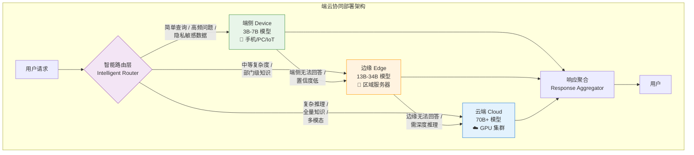
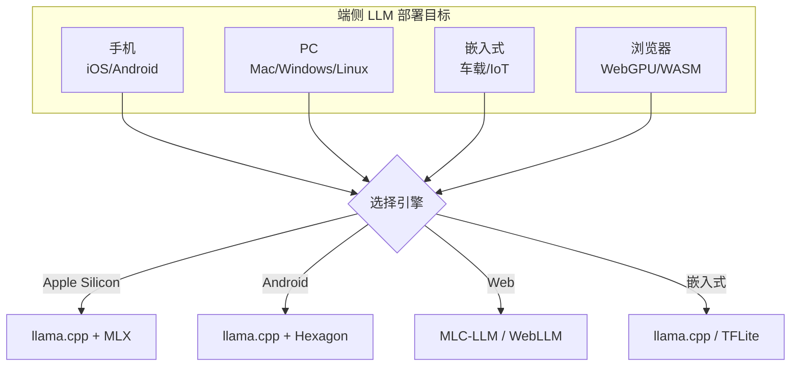
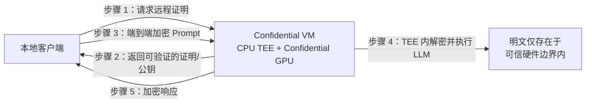

# 第 46 章 端侧、浏览器与边缘 LLM ⭐⭐⭐⭐
> [!abstract] 本章导航
> **定位**：第六部分 推理服务与 LLMOps中的第 46 章；围绕“端侧、浏览器与边缘 LLM”建立单一、可追踪的知识主线。
>
> **先修**：[[45_大模型可观测性与SRE|第 45 章 大模型可观测性与 SRE]]。
>
> **学习目标**：
> - 解释 端云协同部署架构（2026年面试热点） ⭐⭐⭐⭐⭐ 的核心问题、机制与适用边界。
> - 实现或评估 异构硬件与端云运行时 的最小闭环。
> - 使用可复现证据诊断 硬件可移植性 的工程取舍与失败模式。
>
> **建议路径**：端云协同部署架构（2026年面试热点） ⭐⭐⭐⭐⭐ → 异构硬件与端云运行时 → 硬件可移植性 → 端侧 LLM 全景 → 量化与压缩 → Apple MLX 框架 → 生产边界与面试表达。
>
> **配套代码**：`code/ch46_edge_llm/`。

本章先回答“端云协同部署架构（2026年面试热点） ⭐⭐⭐⭐⭐”为什么成立，再沿着机制、实现、评估和边界逐步展开。阅读时先建立因果链，再运行或推演示例，最后用章末自测检查能否脱离原文复述。
## 46.1 端云协同部署架构（2026年面试热点） ⭐⭐⭐⭐⭐

> **架构题**：端云协同是常见部署方案之一。面试时要能回答：**“何时值得引入端侧小模型，
> 端—边—云如何分工与验收？”**

### 46.1.1 端-边-云三层架构

一种常见但非必需的方案是**三层协同**：端侧（Device）→ 边缘（Edge）→ 云端（Cloud）。
是否需要边缘层取决于隐私、网络、SLO、运维和单位成本；简单系统不应为追求层级而增加复杂度。



### 46.1.2 各层模型选型与定位

| 层级 | 示例规模 | 代表性开放权重 | 定位 | 验收口径 |
|------|---------|----------------|------|---------|
| **端侧** | 小模型/量化模型 | Qwen2.5、Phi、Gemma 等端侧规格 | 高频问答、隐私处理、离线使用 | 按目标设备测 P95 TTFT/TPOT、能耗和峰值内存 |
| **边缘** | 中等规模/任务模型 | Qwen2.5、R1 Distill 等可部署规格 | 部门级知识、中等推理 | 按并发与网络边界测端到端 P95/P99 |
| **云端** | 大模型或托管 API | 自托管开放权重或厂商当前 API | 复杂推理、全量知识、多模态 | 同时验收质量、延迟、吞吐、可用性与单请求成本 |

规模与层级只是架构示例，不是延迟保证。SLO 由产品场景定义，不能从参数量或部署位置直接推出。

**端侧模型选型关键**：
- **3B 级别**：适合纯文本问答、简单分类（如 Qwen2.5-3B-Instruct）
- **7B 级别**：通用对话、代码补全、文档摘要（如 Qwen2.5-7B-Instruct）
- **量化方案**：端侧通常使用 INT4/INT8 量化，配合 llama.cpp/mlc-llm 部署

### 46.1.3 动态调度策略（面试核心）

动态调度是端云协同的**核心难点**，常见策略：

**1. 基于置信度的路由**

```python
# 🆕 基于置信度的动态路由
class ConfidenceRouter:
    """
    基于模型置信度的动态调度路由

    策略：端侧先尝试，置信度低于阈值则上云
    """

    def __init__(
        self,
        device_model,      # 端侧 3B-7B 模型
        edge_model,        # 边缘 13B-34B 模型
        cloud_model,       # 云端 70B+ 模型
        device_threshold=0.8,   # 端侧置信度阈值
        edge_threshold=0.75,    # 边缘置信度阈值
    ):
        self.models = {
            "device": device_model,
            "edge": edge_model,
            "cloud": cloud_model,
        }
        self.thresholds = {
            "device": device_threshold,
            "edge": edge_threshold,
        }

    def route(self, query: str, context: dict = None) -> dict:
        """
        动态路由决策

        返回: {"tier": "device|edge|cloud", "confidence": float, "response": str}
        """
        # 策略1：隐私检查 - 敏感数据直接端侧处理
        if context and context.get("privacy_level") == "high":
            return self._execute("device", query)

        # 策略2：逐层尝试（Cascade）
        for tier in ["device", "edge"]:
            result = self._execute(tier, query)
            if result["confidence"] >= self.thresholds[tier]:
                return result

        # 策略3：云端兜底
        return self._execute("cloud", query)

    def _execute(self, tier: str, query: str) -> dict:
        """在指定层级执行推理"""
        model = self.models[tier]
        response = model.generate(query)

        # 计算置信度（基于输出 token 的平均概率）
        confidence = self._compute_confidence(response)

        return {
            "tier": tier,
            "confidence": confidence,
            "response": response.text,
            "latency_ms": response.latency_ms,
        }

    def _compute_confidence(self, response) -> float:
        """计算模型输出的置信度"""
        # 使用输出 token 的平均概率作为置信度
        if hasattr(response, 'token_probs'):
            return sum(response.token_probs) / len(response.token_probs)
        return 0.5  # 默认中等置信度
```

**2. 基于查询特征的路由**

```python
# 🆕 基于查询特征的智能路由
class FeatureRouter:
    """基于查询特征的规则路由 —— 适合特定业务场景"""

    def route(self, query: str, query_type: str = None) -> str:
        """根据查询特征选择部署层级"""

        # 自动分类（或使用独立分类器）
        if query_type is None:
            query_type = self._classify(query)

        # 路由规则
        routing_rules = {
            # 简单问答 → 端侧
            "greeting": "device",
            "faq": "device",
            "definition": "device",

            # 中等复杂度 → 边缘
            "code_generation": "edge",
            "document_summary": "edge",
            "sql_query": "edge",

            # 复杂推理 → 云端
            "multi_step_reasoning": "cloud",
            "math_proof": "cloud",
            "creative_writing": "cloud",
            "multi_modal": "cloud",

            # 隐私敏感 → 端侧
            "personal_data": "device",
            "medical_query": "device",
        }

        return routing_rules.get(query_type, "cloud")  # 默认云端

    def _classify(self, query: str) -> str:
        """查询分类（可用小模型或规则）"""
        # 简化实现：关键词匹配
        keywords = {
            "greeting": ["你好", "hello", "hi"],
            "math_proof": ["证明", "推导", "求解方程"],
            "code_generation": ["写代码", "function", "算法"],
        }
        for qtype, words in keywords.items():
            if any(w in query.lower() for w in words):
                return qtype
        return "general"
```

**3. 基于成本-延迟权衡的路由**

| 策略 | 原理 | 适用场景 | 缺点 |
|------|------|---------|------|
| **Cascade（级联）** | 端侧→边缘→云端逐层尝试 | 成本敏感 | 延迟累积 |
| **Prediction（预测）** | 用分类器预判查询复杂度 | 延迟敏感 | 需要训练分类器 |
| **Parallel（并行）** | 端侧和云端同时请求 | 极低延迟要求 | 成本翻倍 |
| **Hybrid（混合）** | 简单问题端侧，复杂问题上云 | 均衡方案 | 需要维护规则 |

### 46.1.4 端侧部署技术栈（2026年）


| 框架               | 适用平台           | 模型支持        | 特点                         |
| ---------------- | -------------- | ----------- | -------------------------- |
| **llama.cpp**    | 全平台（CPU/GPU）   | GGUF 格式     | 跨平台候选，量化与后端支持按版本核对     |
| **mlc-llm**      | 手机/iOS/Android | 多种          | 移动端候选，需核对模型与设备支持         |
| **ExecuTorch**   | iOS/Android    | PyTorch 模型  | Meta 出品，与 PyTorch 生态深度集成   |
| **TensorRT-LLM** | NVIDIA 边缘设备    | 以支持矩阵为准   | NVIDIA 栈候选，需实测构建与运行时兼容性 |


### 46.1.5 生产部署关键考量


1. **模型同步策略**
   - 端侧模型 OTA 更新（增量更新，减少流量）
   - 边缘模型热更新（不中断服务）
   - 云端模型 A/B 切换

2. **监控指标**
   - 各层级调用比例（device:edge:cloud = ?）
   - 端侧命中率（目标由质量、延迟、隐私和成本约束共同确定）
   - 平均延迟 P50/P95/P99
   - 推理成本分布

3. **降级策略**
   - 云端不可用时，自动降级到边缘
   - 边缘不可用时，端侧独立运行（有限功能）
   - 所有层级不可用时，返回缓存答案

## 46.2 异构硬件与端云运行时
### 46.2.1 硬件可移植性：TPU / Gaudi / Ascend / Apple Silicon

| 硬件 | 推理引擎栈 | K8s 设备插件 | 镜像基础 | 性能特征 |
|------|----------|------------|---------|---------|
| **Google TPU v5e/v6** | JAX / Pathways / vLLM-TPU | `gke-tpu-plugin` 或 `cloud-tpu-oss` | `gcr.io/tpu-oss-base` | BF16 / MXFP4；Pod 内 4/8 卡高带宽 |
| **Intel Gaudi 2/3** | vLLM-HPU / Habana TGI | `intel-gaudi-device-plugin` | `vault.habana.ai/gaudi-docker` | 性价比高；FP8 / MXFP4 |
| **Huawei Ascend 910B/C** | MindIE / vLLM-Ascend | `huawei-ascend-device-plugin` | `swr.cn-south-1.myhuaweicloud.com/ascend` | 国产化首选；W8A8 |
| **Apple Silicon M3/M4** | llama.cpp / MLX | 无（Metal passthrough） | `mcr.microsoft.com/ml-infuse` | 端侧 / 内网工作站 |
| **CPU x86 (AMX/AVX512)** | llama.cpp / IPEX-LLM | 无 | `intel/oneapi-basekit` | 小模型 / 开发测试 |

**Apple Silicon 通过 K8s 调度（kind + macOS 节点）：**

```yaml
apiVersion: v1
kind: Pod
metadata:
  name: llamacpp-mac-node
spec:
  nodeSelector:
    kubernetes.io/os: linux
    hardware: apple-silicon-m3-max
  containers:
    - name: llama-server
      image: ghcr.io/ggerganov/llama.cpp:server-b5000
      securityContext:
        privileged: true        # 需要 Metal 设备访问
      volumeMounts:
        - name: metal-devices
          mountPath: /dev/dri
      command: ["llama-server"]
      args:
        - -m /models/Qwen3-7B-Q4_K_M.gguf
        - --host 0.0.0.0
        - --port 8080
        - -ngl 99              # 卸载到 GPU
        - --mlock
```

### 46.2.2 Ollama Cloud + ollama launch（2026 新形态）

Ollama 在 2026 年演化为两种部署模式：

1. **`ollama launch`**：本地一键启动，开发者体验最佳
2. **Ollama Cloud**：托管推理服务，Ollama 维护 GPU 池，按 Token 计费

**ollama launch 部署到 K8s 模式：**

```bash
# 本地开发者模式
ollama launch qwen3:80b --ctx 65536 --gpu all

# 企业 K8s 模式：把 ollama 包装为 K8s Deployment
# ollama 0.5+ 支持 --server 模式 + Prometheus metrics
```

```yaml
# ollama-server-k8s.yaml
apiVersion: apps/v1
kind: Deployment
metadata:
  name: ollama-server
  namespace: llm-inference
spec:
  replicas: 1
  selector:
    matchLabels:
      app: ollama
  template:
    metadata:
      labels:
        app: ollama
    spec:
      nodeSelector:
        accelerator: nvidia
        nvidia.com/gpu.product: A100-SXM4-80GB
      containers:
        - name: ollama
          image: ollama/ollama:0.5.0
          env:
            - name: OLLAMA_KEEP_ALIVE
              value: "24h"
            - name: OLLAMA_HOST
              value: "0.0.0.0:11434"
            - name: OLLAMA_MODELS
              value: /models
            - name: OLLAMA_NUM_PARALLEL
              value: "8"
            - name: OLLAMA_MAX_LOADED_MODELS
              value: "1"
          ports:
            - containerPort: 11434
          volumeMounts:
            - name: model-storage
              mountPath: /models
          resources:
            limits:
              nvidia.com/gpu: 1
```

**Ollama Cloud 集成（混合云场景）：**

```python
import os
import ollama

# 本地模型
client_local = ollama.Client(host="http://ollama.llm-inference:11434")
resp_local = client_local.chat(
    model="qwen3:8b",
    messages=[{"role": "user", "content": "Hello"}]
)

# 直接访问 Ollama Cloud：请求内容会发送到云端
client_cloud = ollama.Client(
    host="https://ollama.com",
    headers={"Authorization": f"Bearer {os.environ['OLLAMA_API_KEY']}"}
)
resp_cloud = client_cloud.chat(
    model="gpt-oss:120b",
    messages=[{"role": "user", "content": "Complex reasoning task"}]
)
```

通过本地 Ollama 使用 `*-cloud` 模型也会把推理请求卸载到云服务；“本地 client”不等于
“数据不出本地”。敏感数据必须先按组织策略完成分类、最小化与供应商合规评估。当前端点与
认证方式见 [Ollama Cloud 官方文档](https://docs.ollama.com/cloud)。

## 46.3 硬件可移植性

| 硬件 | 最佳引擎 | 关键优化 |
|------|---------|---------|
| **NVIDIA H200/B200** | vLLM/SGLang/TRT-LLM | FP4, PD-Disagg |
| **NVIDIA A100/H100** | vLLM/SGLang | FP8, Continuous Batching |
| **AMD MI300X** | vLLM (ROCm) | FP8, MoE |
| **Intel Gaudi 2/3** | vLLM-Habana | Custom kernels |
| **Google TPU v5e/v6** | JetStream/Pax | XLA 编译 |
| **Apple Silicon (M2/M3)** | llama.cpp (MLX) | Metal, ANE |
| **Ascend NPU 910B** | vLLM-Ascend | CANN |
| **Rebellions NPU** | SGLang-RBLN | RBLN SDK |

## 46.4 端侧 LLM 全景

```
[云端大模型]   →   [端侧大模型]
- 70B+ 推理       - 1B-7B 量化
- H100/A100 GPU   - 移动 NPU/Apple Silicon
- 高延迟            - 亚秒响应
- 隐私风险          - 数据本地
```



## 46.5 量化与压缩

### 46.5.1 GGUF 格式

GGUF (GPT-Generated Unified Format) 是 llama.cpp 的标准模型格式：

| 量化类型 | 相对体积 | 使用边界 |
|---------|----------|---------|
| **Q2_K** | 最小 | 质量风险通常最高，只应在目标任务上实测 |
| **Q4_K_M** | 较小 | 常见体积/质量折中，不代表“几乎无损” |
| **Q5_K_M / Q6_K** | 中等 | 通常降低量化误差，但占用同步增加 |
| **Q8_0** | 最大 | 量化误差较低但不等于零损失 |

具体文件大小取决于参数量、张量类型、词表和 GGUF 元数据；质量必须用目标模型、
数据集和推理参数评估，不能从量化名称直接推出。

### 46.5.2 端侧量化目标

| 设备示例 | 容量预筛 | 仍需验证 |
|------|----------|------------|
| 8GB 手机 | 先从 1B–3B 量化模型筛选 | OS 可用内存、温控、算子覆盖、上下文 |
| 16GB Apple Silicon | 7B 4-bit 可作为候选 | 统一内存压力、KV cache、实际速度 |
| 24GB NVIDIA GPU | 7B–14B 高精度或更大量化模型候选 | 权重 + KV cache + workspace + 并发；不能据此宣称 70B Q4 可单卡运行 |
| 12GB Snapdragon 设备 | 先从已验证的 1B–3B 模型开始 | Hexagon 后端支持矩阵、CPU/GPU 回退和真机日志 |

## 46.6 Apple MLX 框架

Apple MLX 是 Apple 在 2023 年底推出的机器学习框架，专为 Apple Silicon 优化。
截至 2026-07-31，Ollama 已提供 MLX 引擎，但支持的模型架构/格式仍需查当前模型页与发行说明。

```python
import mlx.core as mx
from mlx_lm import load, generate

# 加载模型 (Q4 量化)
model, tokenizer = load("mlx-community/Meta-Llama-3-8B-Instruct-4bit")

# 推理
prompt = "Hello, my name is"
messages = [{"role": "user", "content": prompt}]
prompt = tokenizer.apply_chat_template(messages, add_generation_prompt=True)

text = generate(model, tokenizer, prompt=prompt, max_tokens=100, verbose=True)
print(text)
```

### 46.6.1 MLX vs Core ML vs PyTorch MPS

| 维度 | MLX | Core ML | PyTorch MPS |
|------|-----|---------|-------------|
| 主要定位 | Apple Silicon 数组/模型开发框架 | Apple 平台模型部署与设备调度 | PyTorch 的 Metal 加速后端 |
| 常见工作流 | Python 研究、微调、推理 | 转换/编译后在 App 内推理 | 复用 PyTorch 训练与推理代码 |
| 训练能力 | 支持自动微分与训练 | 以部署为主，更新能力受模型/任务约束 | 支持，但算子覆盖和 fallback 需核对 |
| 内存说明 | 面向 Apple 统一内存设计 | 运行在统一内存硬件上，由 Core ML 管理 | 同样运行在统一内存硬件上；张量迁移/算子语义仍由 PyTorch 管理 |

## 46.7 llama.cpp 多平台

llama.cpp 是本地/端侧 LLM 部署中广泛使用的开源运行时之一：

### 46.7.1 后端 (Backends)

| 后端 | 硬件 | 加速 |
|------|------|------|
| **Metal** | Apple Silicon | GPU |
| **CUDA** | NVIDIA | GPU |
| **Vulkan** | 跨平台 GPU | GPU |
| **OpenCL** | Adreno/Mali | GPU |
| **Hexagon** | Snapdragon NPU | NPU |
| **CANN** | 华为昇腾 | NPU |
| **MUSA** | Moore Threads | GPU |
| **CPU** | 任意 | AVX/NEON |

### 46.7.2 Ollama 一键部署

```bash
# 安装 Ollama
curl -fsSL https://ollama.com/install.sh | sh

# 运行模型
ollama run llama3.2:3b

# 自定义 Modelfile
FROM llama3.2:3b
PARAMETER temperature 0.7
PARAMETER top_p 0.9
SYSTEM "You are a helpful assistant."
```

## 46.8 WebGPU / WASM 浏览器推理

### 46.8.1 WebLLM / MLC-LLM

```javascript
// WebLLM 浏览器推理
import { CreateMLCEngine } from "@mlc-ai/web-llm";

const engine = await CreateMLCEngine("Llama-3.2-3B-Instruct-q4f16_1-MLC", {
  initProgressCallback: (report) => console.log(report)
});

const response = await engine.chat.completions.create({
  messages: [{ role: "user", content: "Hello!" }]
});
console.log(response.choices[0].message.content);
```

### 46.8.2 WebGPU vs WebAssembly

| 特性 | WebGPU | WASM |
|------|--------|------|
| 执行设备 | 浏览器可用的 GPU adapter | CPU（以及运行时提供的 SIMD/线程能力） |
| 优势 | 适合并行张量计算 | 兼容路径较广、适合控制逻辑/CPU 算子 |
| 限制 | adapter、驱动、浏览器和显存/共享内存差异大 | 大模型张量计算通常受 CPU 与内存带宽限制 |
| 选型 | 运行时 feature detection + 目标设备实测 | 作为实现组成或受控 fallback，不给固定模型上限 |

## 46.9 Minions Secure Chat：Confidential Computing 研究原型

Stanford Hazy Research 于 **2025-05-12**公开了 Minions Secure Chat Protocol 研究原型。它不是“本地小模型生成加密嵌入、云端只看嵌入、本地解码”，而是使用远程证明与 confidential CPU/GPU **TEE** 建立可信执行边界：



**核心边界**：

- TLS/mTLS 只保护传输；远程证明用于确认服务端确实运行预期代码和 TEE 配置。
- Prompt 会在 TEE 内解密为明文供模型推理，并非“云端模型只看不可逆嵌入”。
- 安全保证依赖硬件、固件、证明服务、镜像/代码测量值和密钥管理；不能简化成“用了 HTTPS 就对云厂商保密”。
- 原作者明确说明这是**未经第三方安全审计、不可直接用于生产**的探索性原型。

来源：[Stanford Hazy Research: Mind the Trust Gap](https://hazyresearch.stanford.edu/blog/2025-05-12-security)（截至 2026-07-31）。

## 46.10 端云协同部署模式

| 模式 | 描述 | 适用 |
|------|------|------|
| **纯端侧** | 全部在本地 | 简单任务、隐私敏感 |
| **云端主力** | 主力在云端 | 复杂推理 |
| **路由分流** | 简单→端侧，复杂→云端 | 通用应用 |
| **Confidential TEE 推理** | 远程证明 + 加密传输 + TEE 内推理 | 需可信硬件、证明链与安全审计 |
| **端侧缓存** | 重复 query 本地缓存 | 客服/工具类 |
## 🧭 本章小结

- 端云协同部署架构（2026年面试热点） ⭐⭐⭐⭐⭐：能够说清问题、机制、证据与边界。
- 异构硬件与端云运行时：能够说清问题、机制、证据与边界。
- 硬件可移植性：能够说清问题、机制、证据与边界。

## ✅ 自测与练习

1. 不看正文，解释“端云协同部署架构（2026年面试热点） ⭐⭐⭐⭐⭐”解决什么问题，并给出一个不适用场景。
2. 为“异构硬件与端云运行时”设计一个最小可复现实验，明确输入、指标和通过条件。
3. 比较“硬件可移植性”的至少两种方案，说明质量、成本、延迟或风险取舍。

## 🧪 配套代码与验收

- `code/ch46_edge_llm/`

```powershell
python code/scripts/run_all_examples.py --chapter ch46 --tier core
```

默认验收不下载模型、不调用付费 API；真实 API 或 GPU 示例必须按 metadata 显式启用。成功标准是相关脚本输出 `OK`，条件不足时输出可解释的 `[SKIP]`。

## 🎯 面试题精讲

回答本章问题时使用四步结构：先给结论，再解释机制，然后给项目证据，最后主动说明适用边界。涉及性能或效果时，补充模型、硬件、数据、并发、版本和统计口径；条件不完整时明确说“需要实测”。

## 📋 本章速查表

| 主题 | 回答主线 |
|---|---|
| 端云协同部署架构（2026年面试热点） ⭐⭐⭐⭐⭐ | 问题 → 机制 → 示例 → 指标 → 边界 |
| 异构硬件与端云运行时 | 问题 → 机制 → 示例 → 指标 → 边界 |
| 硬件可移植性 | 问题 → 机制 → 示例 → 指标 → 边界 |
| 端侧 LLM 全景 | 问题 → 机制 → 示例 → 指标 → 边界 |
| 量化与压缩 | 问题 → 机制 → 示例 → 指标 → 边界 |

## 🔗 相关章节

- [[45_大模型可观测性与SRE|第 45 章 大模型可观测性与 SRE]]
- [[47_多模态表征与多模态大模型|第 47 章 多模态表征与多模态大模型]]

## 📖 一手参考资料

> 核验基线：2026-07-31；结构复核：2026-08-05。产品、API、法规、价格与 benchmark 会变化，使用前应再次核验。

- [[docs/AUTHORITATIVE_SOURCES|章节权威来源索引]]：按主题维护官方文档、标准、原论文和官方仓库。
