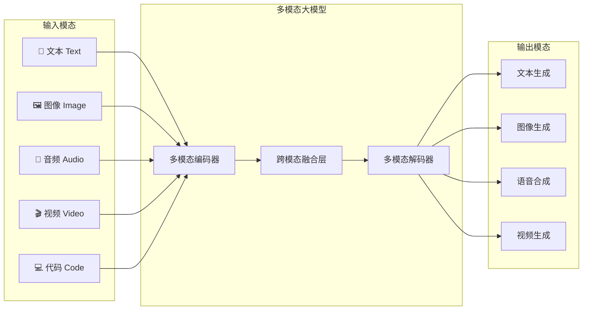
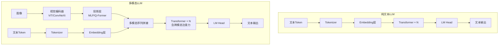
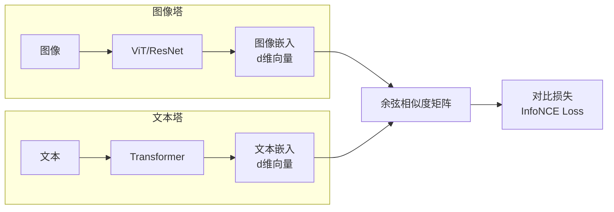
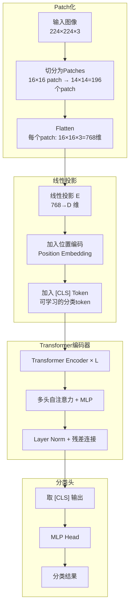
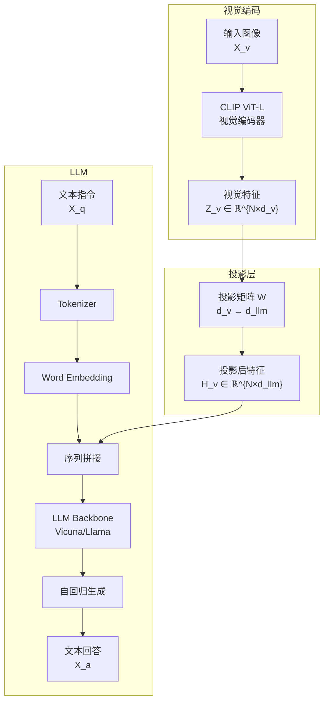
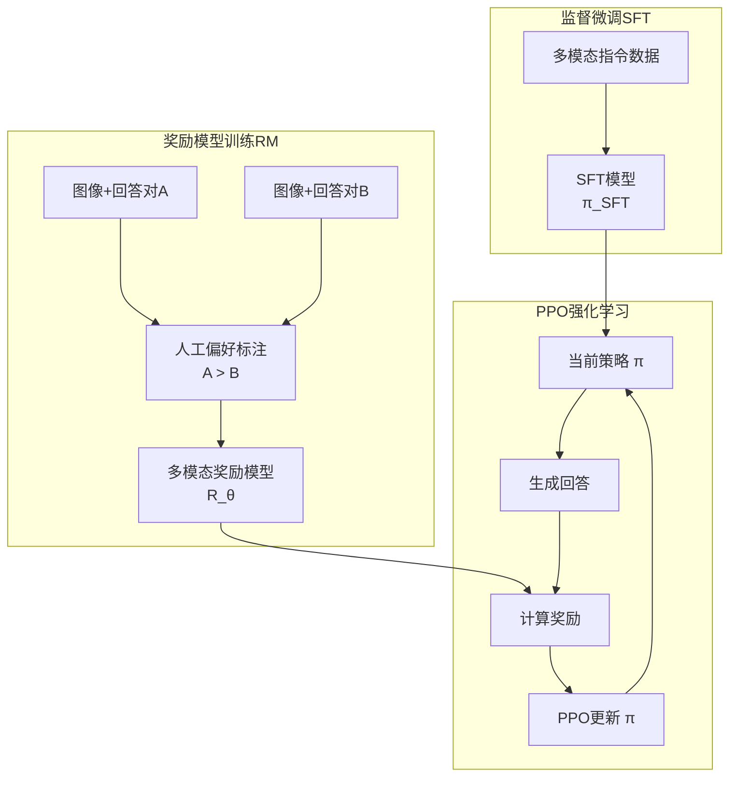

# 第 47 章 多模态表征与多模态大模型 ⭐⭐⭐⭐
> [!abstract] 本章导航
> **定位**：第七部分 多模态与前沿架构中的第 47 章；围绕“多模态表征与多模态大模型”建立单一、可追踪的知识主线。
>
> **先修**：[[46_端侧浏览器与边缘LLM|第 46 章 端侧、浏览器与边缘 LLM]]。
>
> **学习目标**：
> - 解释 多模态概述 的核心问题、机制与适用边界。
> - 实现或评估 CLIP与对比学习 的最小闭环。
> - 使用可复现证据诊断 视觉Transformer（ViT） 的工程取舍与失败模式。
>
> **建议路径**：多模态概述 → CLIP与对比学习 → 视觉Transformer（ViT） → 多模态LLM架构 → 多模态微调与对齐。
>
> **配套代码**：`code/ch47_multimodal/`。

本章先回答“多模态概述”为什么成立，再沿着机制、实现、评估和边界逐步展开。阅读时先建立因果链，再运行或推演示例，最后用章末自测检查能否脱离原文复述。
## 47.1 多模态概述

### 47.1.1 什么是多模态AI

**多模态AI**（Multimodal AI）指能够同时处理、理解和生成**多种信息模态**（文本、图像、音频、视频、代码等）的人工智能系统。与传统的单一模态模型（如纯文本GPT、纯视觉ResNet）不同，多模态模型能够在不同模态之间建立**跨模态关联**，实现更接近人类的综合感知能力。



### 47.1.2 从单模态到多模态的技术跨越

| 阶段 | 时间 | 代表模型 | 核心能力 | 局限 |
|------|------|----------|----------|------|
| **单模态时代** | 2012-2020 | ResNet, BERT, GPT-3 | 单一模态理解 | 模态隔离，无法跨模态推理 |
| **双塔对齐** | 2021-2022 | CLIP, ALIGN, BLIP | 图像-文本匹配 | 仅能做检索/分类，不能生成 |
| **浅层融合** | 2022-2023 | Flamingo, BLIP-2 | 图文浅层交互 | 模态交互深度不足 |
| **深度原生多模态** | 2023-2024 | GPT-4V, Gemini 1.0, LLaVA | 深度图文理解 | 视频/音频支持有限 |
| **能力分化与工具化** | 2025-2026 | GPT-5.6、Gemini 3.6 Flash、Claude Fable 5、Qwen3-VL、Llama 4 | 图像理解扩展到长上下文、视频/音频理解与 GUI 操作；具体模态依模型而定 | 模态、输出类型和工具支持不能由系列名推断 |

### 47.1.3 2026年多模态大模型格局

| 官方模型/系列 | 开放性 | 官方支持的输入 → 输出 | 使用边界 |
|------|--------|----------|----------|
| **GPT-5.6 Sol**（`gpt-5.6-sol`，`gpt-5.6` 为其别名） | 闭源 API | 文本、图像 → 文本 | 音频和视频不是该模型的输入模态；图像生成、computer use 是 Responses API 中可调用的工具能力 |
| **Gemini 3.6 Flash**（`gemini-3.6-flash`） | 闭源 API，稳定版 | 文本、图像、视频、音频、PDF → 文本 | 模型页明确标注不支持图像生成和音频生成；不要把输入理解能力写成生成能力 |
| **Claude Fable 5**（`claude-fable-5`） | 闭源 API | 文本、图像 → 文本 | 当前 Claude 模型统一支持视觉输入，不另设 `Vision` 型号后缀 |
| **Qwen3-VL**（如 `Qwen/Qwen3-VL-235B-A22B-Instruct`） | 开放权重，Apache-2.0 | 文本、图像、视频 → 文本 | 官方提供 Dense/MoE、Instruct/Thinking 等多种规格；系列命名以 `Qwen3-VL` 为准 |
| **Llama 4 Scout / Maverick** | 开放权重，自定义社区许可证 | 文本、图像 → 文本 | 不是 OSI 意义的“完全开源”；分发须遵守归属、可接受使用政策等条款，发布时月活超过 7 亿还需另行申请许可 |
| **DeepSeek-VL2** | 开放权重，DeepSeek Model License | 文本、图像 → 文本 | 截至核验日，DeepSeek 官方公开仓库可核验的是 VL2 系列；不据非官方名称推测能力 |

> **核验入口（2026-07-31）**：[OpenAI 模型目录](https://developers.openai.com/api/docs/models)、
> [Gemini 3.6 Flash 模型页](https://ai.google.dev/gemini-api/docs/models/gemini-3.6-flash)、
> [Claude 模型目录](https://platform.claude.com/docs/en/about-claude/models/overview)、
> [Qwen3-VL 官方仓库](https://github.com/QwenLM/Qwen3-VL)、
> [Llama 4 Model Card](https://github.com/meta-llama/llama-models/blob/main/models/llama4/MODEL_CARD.md) 与
> [Llama 4 Community License](https://github.com/meta-llama/llama-models/blob/main/models/llama4/LICENSE)。

### 47.1.4 多模态 vs 纯文本模型的架构差异



**核心差异**：
1. **输入处理**：多模态模型需要额外的模态编码器将非文本数据转换为LLM可理解的向量表示
2. **模态对齐**：需要投影层将不同模态的表示映射到统一语义空间
3. **训练策略**：通常分阶段训练——先预训练对齐，再指令微调
4. **计算开销**：视觉编码器带来的额外参数量（通常3-10亿参数）

> 📚 **相关章节**：[[15_Transformer架构与实现]]（MoE架构）、[[33_大模型分布式训练]]（多模态模型的分布式训练策略）

## 47.2 CLIP与对比学习

### 47.2.1 CLIP 核心思想

**CLIP**（Contrastive Language-Image Pre-training）由 OpenAI 于2021年提出，是多模态领域的奠基性工作。其核心思想极其优雅：**通过对比学习，将图像和文本映射到同一个向量空间，使得匹配的图文对在空间中距离最近**。

#### 47.2.1.1 双塔架构



**关键设计**：
- **双塔独立编码**：图像编码器和文本编码器各自独立工作，仅在最后通过对比损失进行对齐
- **大规模弱监督数据**：从互联网收集的4亿图文对，利用自然语言作为监督信号
- **零样本迁移能力**：训练完成后可以直接用于任意分类任务，无需微调

#### 47.2.1.2 零样本分类流程

给定一张图像和一组类别名称（如"猫"、"狗"、"汽车"），CLIP 的零样本分类流程如下：

1. 将类别名称转换为 prompt 模板：`"a photo of a {class_name}"`
2. 文本编码器对所有类别 prompt 进行编码，得到文本嵌入矩阵 $T \in \mathbb{R}^{N \times d}$
3. 图像编码器对输入图像编码，得到图像嵌入 $I \in \mathbb{R}^{1 \times d}$
4. 计算 $I$ 与 $T$ 中每一行的余弦相似度
5. 取相似度最大的类别作为预测结果

### 47.2.2 训练目标：InfoNCE Loss

CLIP 使用 **InfoNCE Loss**（Information Noise-Contrastive Estimation），在批量数据中同时优化图像到文本和文本到图像两个方向的匹配。

**前向传播**：
给定一个包含 $N$ 个图文对的批次 $\{(I_i, T_i)\}_{i=1}^{N}$：

1. 图像编码：$f_I(I_i) \in \mathbb{R}^d$，文本编码：$f_T(T_i) \in \mathbb{R}^d$
2. L2 归一化后计算相似度矩阵：$S_{ij} = \frac{f_I(I_i)^\top f_T(T_j)}{\tau}$

其中 $\tau$ 是可学习的温度参数。

**InfoNCE Loss**：

$$\mathcal{L}_{\text{CLIP}} = \frac{1}{2}\left(\mathcal{L}_{I \to T} + \mathcal{L}_{T \to I}\right)$$

$$\mathcal{L}_{I \to T} = -\frac{1}{N}\sum_{i=1}^{N} \log \frac{\exp(S_{ii})}{\sum_{j=1}^{N} \exp(S_{ij})}$$

$$\mathcal{L}_{T \to I} = -\frac{1}{N}\sum_{i=1}^{N} \log \frac{\exp(S_{ii})}{\sum_{j=1}^{N} \exp(S_{ji})}$$

**直观理解**：
- 对于第 $i$ 张图像，它的正样本是第 $i$ 条文本，其余 $N-1$ 条文本都是负样本
- 对称地，对于第 $i$ 条文本，它的正样本是第 $i$ 张图像
- 两个方向取平均，保证图文对齐的对称性

### 47.2.3 代码示例：使用 OpenCLIP

以下是真实权重路径，会读取本地图像，且 `pretrained` 可能触发权重下载。仓库中的配套脚本还要求
`CH21_OPENCLIP_RUN=1`，并在加载前校验 GPU 与 `CH21_IMAGE`；离线整库验收只会条件性跳过。

```python
import torch
import os
import torch.nn.functional as F
from PIL import Image
import open_clip

# 1. 加载模型和预处理
model_name = "ViT-B-32"
pretrained = "laion2b_s34b_b79k"

model, _, preprocess = open_clip.create_model_and_transforms(
    model_name, pretrained=pretrained
)
tokenizer = open_clip.get_tokenizer(model_name)
model = model.eval()

# 2. 准备输入
image = preprocess(Image.open("cat.jpg")).unsqueeze(0)  # [1, 3, 224, 224]
texts = [
    "a photo of a cat",
    "a photo of a dog",
    "a photo of a car"
]
text_tokens = tokenizer(texts)  # [3, 77]

# 3. 编码
with torch.no_grad():
    image_features = model.encode_image(image)  # [1, d]
    text_features = model.encode_text(text_tokens)  # [3, d]

    # L2归一化
    image_features = F.normalize(image_features, dim=-1)
    text_features = F.normalize(text_features, dim=-1)

    # 计算相似度
    similarity = (image_features @ text_features.T) * model.logit_scale.exp()
    # 或使用 temperature 参数: similarity = image_features @ text_features.T / τ

    probs = similarity.softmax(dim=-1)

print("分类概率:")
for text, prob in zip(texts, probs[0]):
    print(f"  {text}: {prob.item():.4f}")
```

### 47.2.4 实现 CLIP 训练（简化版）

```python
import torch
import torch.nn as nn
import torch.nn.functional as F

class SimpleCLIP(nn.Module):
    """简化版 CLIP 双塔模型"""
    def __init__(self, image_encoder, text_encoder, embed_dim=512):
        super().__init__()
        self.image_encoder = image_encoder
        self.text_encoder = text_encoder

        # 投影层：将编码器输出映射到统一的嵌入维度
        self.image_proj = nn.Linear(image_encoder.output_dim, embed_dim)
        self.text_proj = nn.Linear(text_encoder.output_dim, embed_dim)

        # 可学习的温度参数（初始化为 log(1/0.07) ≈ 2.659）
        self.logit_scale = nn.Parameter(torch.ones([]) * 2.659)

    def encode_image(self, image):
        features = self.image_encoder(image)
        features = self.image_proj(features)
        return F.normalize(features, dim=-1)

    def encode_text(self, text):
        features = self.text_encoder(text)
        features = self.text_proj(features)
        return F.normalize(features, dim=-1)

    def forward(self, image, text):
        # 编码
        image_embeds = self.encode_image(image)   # [B, d]
        text_embeds = self.encode_text(text)       # [B, d]

        # 计算相似度矩阵
        logit_scale = self.logit_scale.exp()
        logits_per_image = logit_scale * image_embeds @ text_embeds.T  # [B, B]
        logits_per_text = logits_per_image.T

        # 标签：对角线为正样本（第i张图对应第i条文本）
        labels = torch.arange(len(image), device=image.device)

        # 双向 InfoNCE Loss
        loss_i2t = F.cross_entropy(logits_per_image, labels)
        loss_t2i = F.cross_entropy(logits_per_text, labels)
        loss = (loss_i2t + loss_t2i) / 2

        return loss, image_embeds, text_embeds

# 使用示例
# model = SimpleCLIP(vision_encoder, text_encoder, embed_dim=512)
# loss, img_emb, txt_emb = model(images, texts)
```

### 47.2.5 CLIP 的局限性与改进

| 局限 | 描述 | 改进方案 |
|------|------|----------|
| **细粒度理解不足** | CLIP 擅长全局语义，但对物体位置、数量、空间关系理解差 | 引入区域级对比学习 |
| **文本编码器容量小** | 原始CLIP文本塔只有12层Transformer | 使用更大LLM作为文本塔 |
| **对比损失效率低** | 需要大batch size（通常32k+） | **SigLIP**：改用Sigmoid损失 |
| **训练数据噪声** | 互联网图文对包含大量噪声 | 数据清洗 + 质量过滤 |
| **分辨率受限** | 通常224×224或336×336 | 动态分辨率、多尺度训练 |

#### 47.2.5.1 SigLIP

**SigLIP**（Sigmoid Loss for Language Image Pre-training）将 CLIP 的 Softmax 对比损失改为更简单的**二分类 Sigmoid 损失**：

$$\mathcal{L}_{\text{SigLIP}} = -\frac{1}{|B|}\sum_{(i,j)} \left[y_{ij}\log\sigma(S_{ij}) + (1-y_{ij})\log(1-\sigma(S_{ij}))\right]$$

其中 $y_{ij}=1$ 当 $i=j$（正样本），否则 $y_{ij}=0$（负样本），$\sigma$ 是 Sigmoid 函数。

**优势**：不再需要全局归一化，允许更小的 batch size，训练更稳定，且在大规模数据上表现更好。

#### 47.2.5.2 EVA-CLIP

**EVA-CLIP** 使用基于 Masked Image Modeling 预训练的 EVA 视觉编码器；性能比较必须绑定具体 checkpoint、数据集、分辨率和评测协议。

> 📚 **相关章节**：[[19_RAG数据解析分块与索引]]（对比学习原理）、[[22_Agent基础与工具调用]]（多模态Agent）

## 47.3 视觉Transformer（ViT）

### 47.3.1 ViT 架构：图像即序列

**Vision Transformer (ViT)** 由 Google 于2020年提出，首次将纯 Transformer 架构应用于图像分类，证明了"CNN 不是必须的"。

**核心思想**：将图像分割为固定大小的 patch，将每个 patch 视为一个 token（类比 NLP 中的词），然后用标准 Transformer 处理。



**数学表示**：

给定图像 $\mathbf{x} \in \mathbb{R}^{H \times W \times C}$，将其分割为 $N = \frac{HW}{P^2}$ 个 patch（patch大小为 $P \times P$）：

$$\mathbf{x}_p = \text{Flatten}(\text{Patchify}(\mathbf{x})) \in \mathbb{R}^{N \times (P^2 \cdot C)}$$

通过线性投影 + 位置编码得到输入序列：

$$\mathbf{z}_0 = [\mathbf{x}_{\text{class}}; \mathbf{x}_p^1 \mathbf{E}; \mathbf{x}_p^2 \mathbf{E}; \ldots; \mathbf{x}_p^N \mathbf{E}] + \mathbf{E}_{\text{pos}}$$

其中 $\mathbf{E} \in \mathbb{R}^{(P^2 \cdot C) \times D}$ 是 patch embedding 矩阵，$\mathbf{E}_{\text{pos}} \in \mathbb{R}^{(N+1) \times D}$ 是可学习的位置编码。

### 47.3.2 ViT 代码实现

```python
import torch
import torch.nn as nn
import math

class PatchEmbedding(nn.Module):
    """将图像切分为patch并线性投影"""
    def __init__(self, img_size=224, patch_size=16, in_channels=3, embed_dim=768):
        super().__init__()
        self.img_size = img_size
        self.patch_size = patch_size
        self.num_patches = (img_size // patch_size) ** 2

        # 使用卷积实现patch切分（高效实现）
        self.proj = nn.Conv2d(
            in_channels, embed_dim,
            kernel_size=patch_size, stride=patch_size
        )

    def forward(self, x):
        # x: [B, 3, 224, 224]
        x = self.proj(x)  # [B, 768, 14, 14]
        x = x.flatten(2)  # [B, 768, 196]
        x = x.transpose(1, 2)  # [B, 196, 768]
        return x


class VisionTransformer(nn.Module):
    """简化版 ViT-Base"""
    def __init__(
        self,
        img_size=224,
        patch_size=16,
        in_channels=3,
        num_classes=1000,
        embed_dim=768,
        depth=12,
        num_heads=12,
        mlp_ratio=4.0,
        dropout=0.1
    ):
        super().__init__()
        self.patch_embed = PatchEmbedding(img_size, patch_size, in_channels, embed_dim)
        num_patches = self.patch_embed.num_patches

        # [CLS] token（可学习的分类token）
        self.cls_token = nn.Parameter(torch.zeros(1, 1, embed_dim))

        # 可学习的位置编码
        self.pos_embed = nn.Parameter(
            torch.zeros(1, num_patches + 1, embed_dim)
        )

        self.pos_drop = nn.Dropout(dropout)

        # Transformer 编码器层
        self.blocks = nn.ModuleList([
            TransformerBlock(embed_dim, num_heads, mlp_ratio, dropout)
            for _ in range(depth)
        ])

        self.norm = nn.LayerNorm(embed_dim)

        # 分类头
        self.head = nn.Linear(embed_dim, num_classes)

        # 初始化
        nn.init.trunc_normal_(self.pos_embed, std=0.02)
        nn.init.trunc_normal_(self.cls_token, std=0.02)
        self.apply(self._init_weights)

    def _init_weights(self, m):
        if isinstance(m, nn.Linear):
            nn.init.trunc_normal_(m.weight, std=0.02)
            if m.bias is not None:
                nn.init.zeros_(m.bias)

    def forward(self, x):
        B = x.shape[0]

        # Patch embedding
        x = self.patch_embed(x)  # [B, 196, 768]

        # 添加 [CLS] token
        cls_tokens = self.cls_token.expand(B, -1, -1)  # [B, 1, 768]
        x = torch.cat([cls_tokens, x], dim=1)  # [B, 197, 768]

        # 添加位置编码
        x = x + self.pos_embed
        x = self.pos_drop(x)

        # Transformer 编码
        for block in self.blocks:
            x = block(x)

        x = self.norm(x)

        # 取 [CLS] token 输出用于分类
        cls_output = x[:, 0]  # [B, 768]
        return self.head(cls_output)


class TransformerBlock(nn.Module):
    """单层 Transformer（Pre-LN 风格）"""
    def __init__(self, embed_dim, num_heads, mlp_ratio=4.0, dropout=0.1):
        super().__init__()
        self.norm1 = nn.LayerNorm(embed_dim)
        self.attn = nn.MultiheadAttention(
            embed_dim, num_heads, dropout=dropout, batch_first=True
        )
        self.norm2 = nn.LayerNorm(embed_dim)
        self.mlp = nn.Sequential(
            nn.Linear(embed_dim, int(embed_dim * mlp_ratio)),
            nn.GELU(),
            nn.Dropout(dropout),
            nn.Linear(int(embed_dim * mlp_ratio), embed_dim),
            nn.Dropout(dropout),
        )

    def forward(self, x):
        # Self-Attention
        x = x + self.attn(self.norm1(x), self.norm1(x), self.norm1(x))[0]
        # MLP
        x = x + self.mlp(self.norm2(x))
        return x


# 使用示例
# vit = VisionTransformer(img_size=224, patch_size=16, num_classes=1000)
# img = torch.randn(4, 3, 224, 224)
# logits = vit(img)  # [4, 1000]
```

### 47.3.3 ViT 与 CNN 的关系

| 维度 | CNN | ViT |
|------|-----|-----|
| **归纳偏置** | 强（局部性、平移等变性） | 弱（仅位置编码） |
| **感受野** | 局部→逐层扩大 | 全局（自注意力） |
| **数据需求** | 相对少 | 需要大量数据 |
| **计算复杂度** | $\mathcal{O}(N \cdot K^2)$ | $\mathcal{O}(N^2)$ |
| **可解释性** | 较好（特征图可视化） | 较差（注意力图稀疏） |
| **细粒度特征** | 擅长 | 需要更多数据 |

**互补趋势（2024-2026）**：
- **ConvNeXt**：用现代技术"现代化"CNN，接近ViT性能但保留CNN效率
- **混合架构**：早期层用CNN提取局部特征，深层用Transformer建模全局关系
- **Swin Transformer**：引入窗口注意力，融合CNN局部性和ViT全局性
- **InternImage**：使用可变形卷积的大规模CNN，在检测任务上超越ViT

### 47.3.4 DINO/DINOv2 自监督视觉预训练

**DINO**（Self-Distillation with No Labels）和 **DINOv2** 是 Meta 提出的自监督视觉预训练框架，不需要任何标签即可学到高质量的视觉表示。

**核心机制**：
1. **师生网络**：教师网络和学生网络结构相同，但在不同视角下处理同一张图像的增强版本
2. **动量更新**：教师参数 $\theta_t \leftarrow \lambda \theta_t + (1-\lambda) \theta_s$
3. **中心化与锐化**：防止模型坍塌到常数输出

**DINOv2 的改进**：
- 更大规模训练数据（1.42亿张精选图像）
- 统一的训练框架（分类/密集预测共用同一表示）
- 直接可作为高质量视觉特征提取器，广泛应用于多模态任务

### 47.3.5 位置编码在视觉中的处理

| 编码方式 | 原理 | 优点 | 缺点 |
|----------|------|------|------|
| **可学习位置编码** | 每个位置学习一个向量 | 简单，效果好 | 无法泛化到不同分辨率 |
| **正弦位置编码** | $\text{PE}_{(pos,2i)} = \sin(pos/10000^{2i/d})$ | 可外推 | 固定模式，不如学习型灵活 |
| **相对位置偏置** | 学习相对位置的注意力偏置 | 泛化性好 | 增加参数量 |
| **2D sin-cos编码** | 分别对行、列使用正弦编码 | 保留2D结构信息 | 实现稍复杂 |
| **RoPE in Vision** | 对Q、K分别施加旋转编码 | 更好的相对位置建模 | 2025年才在视觉中验证有效 🆕 |

> ⚠️ **面试高频**：ViT 如何处理不同分辨率？答：使用**位置编码插值**——将预训练的位置编码通过双线性插值调整到目标分辨率，这是 ViT 灵活处理多分辨率的关键技巧。

> 📚 **相关章节**：[[15_Transformer架构与实现]]（Transformer 详解）、[[30_SFT_LoRA与QLoRA]]（开源视觉模型）

## 47.4 多模态LLM架构

### 47.4.1 LLaVA：多模态对话的经典架构

**LLaVA**（Large Language and Vision Assistant）将视觉能力注入LLM，是开源社区最具影响力的多模态对话模型。其架构极简但有效，被誉为"多模态LLM的Hello World"。



#### 47.4.1.1 两阶段训练

| 阶段 | 目标 | 可训练参数 | 数据 |
|------|------|------------|------|
| **阶段1：特征对齐** | 将视觉特征映射到LLM词嵌入空间 | 仅投影层 W | 图文对（CC3M约59.5万） |
| **阶段2：指令微调** | 让模型学会多模态指令跟随 | 投影层 + LLM（视觉编码器冻结） | 多模态指令数据（约15万） |

### 47.4.2 LLaVA 核心代码实现

```python
import torch
import torch.nn as nn
from transformers import AutoModel, AutoTokenizer, CLIPVisionModel

class LLaVA(nn.Module):
    """简化版 LLaVA 架构"""
    def __init__(
        self,
        vision_encoder_name="openai/clip-vit-large-patch14-336",
        llm_name="meta-llama/Llama-3-8B-Instruct",
        vision_hidden_size=1024,
        llm_hidden_size=4096,
    ):
        super().__init__()

        # 1. 视觉编码器（通常冻结）
        self.vision_encoder = CLIPVisionModel.from_pretrained(vision_encoder_name)
        for param in self.vision_encoder.parameters():
            param.requires_grad = False

        # 2. 投影层：视觉空间 → LLM空间
        self.mm_projector = nn.Sequential(
            nn.Linear(vision_hidden_size, llm_hidden_size),
            nn.GELU(),
            nn.Linear(llm_hidden_size, llm_hidden_size),
        )

        # 3. 大语言模型
        self.llm = AutoModel.from_pretrained(llm_name)
        self.tokenizer = AutoTokenizer.from_pretrained(llm_name)

        # 添加特殊 token
        self.tokenizer.add_special_tokens({"additional_special_tokens": ["<image>"]})
        self.llm.resize_token_embeddings(len(self.tokenizer))

        self.image_token_id = self.tokenizer.convert_tokens_to_ids("<image>")

    def encode_image(self, image):
        """编码图像为视觉token序列"""
        # image: [B, 3, H, W]
        with torch.no_grad():
            vision_outputs = self.vision_encoder(image, output_hidden_states=True)
            # 取倒数第二层特征（LLaVA-1.5的做法）
            vision_features = vision_outputs.hidden_states[-2]  # [B, N_patches, 1024]

        # 投影到LLM空间
        vision_features = self.mm_projector(vision_features)  # [B, N_patches, 4096]
        return vision_features

    def prepare_inputs(self, images, texts):
        """
        构建多模态输入序列
        格式: <s> USER: <image>\n{text} ASSISTANT:
        """
        batch_input_ids = []
        batch_attention_mask = []

        image_features = self.encode_image(images)  # [B, N_vis, d_llm]

        for i, text in enumerate(texts):
            # Tokenize 文本（包含 <image> 占位符）
            chat = [
                {"role": "user", "content": f"<image>\n{text}"},
            ]
            prompt = self.tokenizer.apply_chat_template(
                chat, tokenize=False, add_generation_prompt=True
            )
            input_ids = self.tokenizer(prompt, return_tensors="pt").input_ids[0]

            # 找到 <image> token 的位置
            img_positions = (input_ids == self.image_token_id).nonzero(as_tuple=True)[0]

            # 用视觉特征替换 <image> token（这里简化处理，仅替换第一个）
            if len(img_positions) > 0:
                img_pos = img_positions[0]
                img_feat = image_features[i]  # [N_vis, d_llm]

                # 获取LLM的词嵌入
                word_embeds = self.llm.get_input_embeddings()(input_ids)

                # 在 <image> 位置插入视觉特征
                # 前部分 + 视觉特征 + 后部分
                prefix_embeds = word_embeds[:img_pos]       # 包含 <image> 之前
                suffix_embeds = word_embeds[img_pos+1:]     # <image> 之后

                # 拼接
                input_embeds = torch.cat([
                    prefix_embeds,
                    img_feat,
                    suffix_embeds,
                ], dim=0)

                batch_input_ids.append({
                    "inputs_embeds": input_embeds.unsqueeze(0),
                    "use_embeds": True
                })

        return batch_input_ids

    def generate(self, images, texts, max_new_tokens=256, **kwargs):
        """多模态文本生成"""
        prepared = self.prepare_inputs(images, texts)

        outputs = []
        for item in prepared:
            if item.get("use_embeds"):
                output = self.llm.generate(
                    inputs_embeds=item["inputs_embeds"],
                    max_new_tokens=max_new_tokens,
                    **kwargs
                )
            generated = self.tokenizer.decode(output[0], skip_special_tokens=True)
            outputs.append(generated)

        return outputs


# 使用示例
# model = LLaVA()
# from PIL import Image
# image = Image.open("scene.jpg")
# response = model.generate(
#     images=preprocess(image).unsqueeze(0),
#     texts=["请描述这张图片中的场景"]
# )
# print(response[0])
```

### 47.4.3 Qwen-VL 架构演进

阿里巴巴的 Qwen-VL 系列代表了开源多模态模型的持续演进：

| 版本 | 发布时间 | 核心改进 | 关键能力 |
|------|----------|----------|----------|
| **Qwen-VL** | 2023.08 | ViT-G + Qwen-7B，三阶段训练 | 基础图文理解 |
| **Qwen-VL-Plus** | 2024.01 | 动态分辨率，更好的OCR | 文档理解增强 |
| **Qwen2-VL** | 2024.08 | 原生动态分辨率，视频理解 | 视频对话，实时分析 |
| **Qwen2.5-VL** | 2025.01 | 视觉定位、长视频和文档理解增强 | 图像/视频理解与视觉 Agent |
| **Qwen3-VL** 🆕 | 2025.09 起 | Dense/MoE 多规格，提供 Instruct/Thinking 权重 | 图像/视频理解、空间推理与 Agent 交互 |

**核心创新点**：
1. **动态分辨率**：不固定图像尺寸，根据原始比例动态调整，保留更多细节
2. **Naive Dynamic Resolution**（Qwen2-VL）：按原始分辨率映射为动态数量的视觉 token
3. **Video MRoPE**：多维旋转位置编码，同时编码时间+空间位置

### 47.4.4 闭源模型：区分公开能力与内部架构

对于 GPT、Gemini、Claude 等闭源模型，官方模型页通常公开**模型 ID、输入/输出模态、上下文限制和工具支持**，
但不会完整公开视觉编码器、融合层、专家路由或训练配方。因此面试中应按下面两层回答：

| 可核验事实 | 可以怎样表述 | 不应怎样表述 |
|------|------|------|
| 模型页列出的输入/输出类型 | “Gemini 3.6 Flash 接受文本、图像、视频、音频和 PDF，输出文本” | “它一定用 3D 位置编码处理视频” |
| API 列出的工具 | “GPT-5.6 可通过 Responses API 使用 image generation / computer use 工具” | “GPT-5.6 的同一组权重原生生成图像、视频” |
| 官方技术报告或模型卡 | 引用其明确披露的结构与训练方法 | 依据产品演示反推 MoE 路由、融合层或训练数据 |

架构题需要展开时，优先引用可审计的 LLaVA、Qwen3-VL、Llama 4 等论文或模型卡，再把闭源模型限定为
“接口能力对比”。**工具编排上的统一体验，不等于模型权重和解码架构已经统一。**

### 47.4.5 多模态指令微调数据构建

**数据金字塔**（从下到上质量递增、数量递减）：

```
          / 高质量多模态对话 \
         /   （人工标注10K）   \
        /  学术数据集汇总100K   \
       /   自动生成数据500K      \
      /  图文对数据1B+           \
```

**数据构建方法**：

1. **图文对重标注**：使用GPT-4V对图文对生成详细描述和QA对
2. **数据集混合**：
   - 学术VQA数据集（VQAv2, GQA, OK-VQA, TextVQA）
   - OCR数据集（OCR-VQA, ST-VQA）
   - 文档理解（DocVQA, ChartQA, InfoVQA）
   - 多语言数据
3. **负样本挖掘**：故意放入不匹配的图文对，训练模型说"我不知道"
4. **思维链数据**：要求模型展示推理过程，逐步分析图像

> 📚 **相关章节**：[[30_SFT_LoRA与QLoRA]]（指令微调方法论）、[[17_Prompt_Engineering]]（多模态提示工程）

## 47.5 多模态微调与对齐

### 47.5.1 多模态LoRA微调

**LoRA**（Low-Rank Adaptation）在多模态场景中同样表现出色。对于多模态LLM，LoRA的典型配置：

| 配置项 | 推荐值 | 说明 |
|--------|--------|------|
| **目标模块** | 先定位语言层，再选择 q/k/v/o_proj 等 | 避免误把视觉塔同名层一起注入 |
| **Rank r** | 8-128，按任务验证 | 没有“视觉任务一定需要更高秩”的通用结论 |
| **Alpha** | 2×r | 缩放系数 |
| **连接模块** | 按具体 VLM 架构决定 | Qwen2-VL 并不存在通用的 `mm_projector` 变量 |
| **视觉编码器** | 冻结或小学习率微调 | 取决于领域偏移、数据量和显存 |

```python
import torch
from peft import LoraConfig, get_peft_model, TaskType
from transformers import (
    AutoProcessor,
    BitsAndBytesConfig,
    Qwen2VLForConditionalGeneration,
)

# 量化配置（节省显存）
bnb_config = BitsAndBytesConfig(
    load_in_4bit=True,
    bnb_4bit_compute_dtype=torch.bfloat16,
    bnb_4bit_use_double_quant=True,
    bnb_4bit_quant_type="nf4",
)

# 加载真正包含视觉塔的 VLM；不要用纯文本 Qwen2-7B 代替
model_id = "Qwen/Qwen2-VL-7B-Instruct"
processor = AutoProcessor.from_pretrained(model_id)
model = Qwen2VLForConditionalGeneration.from_pretrained(
    model_id,
    quantization_config=bnb_config,
    torch_dtype=torch.bfloat16,
    device_map="auto",
)

# LoRA 配置
lora_config = LoraConfig(
    task_type=TaskType.CAUSAL_LM,
    r=32,
    lora_alpha=64,
    lora_dropout=0.05,
    target_modules=["q_proj", "k_proj", "v_proj", "o_proj",
                    "gate_proj", "up_proj", "down_proj"],
    bias="none",
)

# 注入 LoRA 后冻结视觉塔；是否解冻应通过领域数据实验决定
model = get_peft_model(model, lora_config)
for param in model.base_model.model.visual.parameters():
    param.requires_grad = False
model.print_trainable_parameters()

# processor 负责图像/视频与文本模板；训练时还要：
# 1) 对 padding、用户指令和视觉占位 token 设置 label=-100；
# 2) 使用匹配当前 transformers/peft 版本的数据 collator；
# 3) 单卡可用 device_map，DDP/DeepSpeed 训练不要使用 device_map="auto"。
```

该片段只展示“正确加载 VLM + 注入 LoRA”的最小边界，不冒充完整训练脚本。完整训练还必须锁定 `transformers`/`peft` 版本并在小 batch 上验证图像输入、label mask、梯度和保存/恢复。参考：[Qwen2-VL 官方模型卡](https://huggingface.co/Qwen/Qwen2-VL-7B-Instruct)（截至 2026-07-31）。

### 47.5.2 视觉-语言对齐技术

| 对齐层次 | 方法 | 代表工作 | 特点 |
|----------|------|----------|------|
| **全局对齐** | 对比学习 | CLIP, SigLIP | 图像整体与文本匹配 |
| **区域对齐** | 目标检测+文本 | GLIP, GroundingDINO | 物体级别对齐 |
| **像素对齐** | 分割+文本 | SAM+CLIP, LSeg | 像素级别语义理解 |
| **细粒度对齐** | 属性绑定 | TIFA, VPEval | 颜色、数量、位置等属性 |
| **时序对齐** | 视频-文本对齐 | VideoCLIP, InternVideo | 动作与时序关系 |

### 47.5.3 多模态RLHF

多模态RLHF在传统RLHF基础上增加了视觉偏好维度：



**多模态RLHF的关键挑战**：
1. **幻觉奖励**：模型可能描述图像中不存在的物体，需要专门的幻觉检测奖励
2. **视觉真实性**：回答必须与视觉内容一致
3. **有帮助vs无害权衡**：拒绝回答vs编造答案之间的平衡

> ⭐ **难度标记**：多模态RLHF是当前多模态对齐的前沿方向（2025-2026），实现复杂度极高，面试中掌握原理即可。

### 47.5.4 多模态微调：从骨架到真实验收

配套 `code/ch47_multimodal/gpu/07_sft_training.py` 只演示图像与对话的整理结构和训练配置，
不会加载 checkpoint、创建空 `train_dataset` 后假装训练，也不会把“构造 Trainer”记为成功。

完整 SFT 至少要补齐并验证：

1. 锁定与 checkpoint 匹配的 `transformers`、`peft`、processor 和对话模板；
2. 用真实样本生成 `pixel_values`、`input_ids`、`attention_mask` 与只监督 assistant 的 labels；
3. 核对 LoRA target module 是否真实存在，避免误注入视觉塔或漏掉目标层；
4. 至少执行一次 forward/backward/optimizer step，断言可训练参数梯度有限且非全零；
5. 保存 adapter 与 processor，在新进程重新加载并做固定样本回归；
6. DDP/DeepSpeed/FSDP、量化、batch、序列长度和 checkpointing 按实际硬件独立验收。

因此，本节提供的是可审计的实现清单，不是未经数据与硬件验证的“一键完整训练脚本”。

> 📚 **相关章节**：[[30_SFT_LoRA与QLoRA]]（RLHF原理）、[[30_SFT_LoRA与QLoRA]]（LoRA详解）
## 🧭 本章小结

- 多模态概述：能够说清问题、机制、证据与边界。
- CLIP与对比学习：能够说清问题、机制、证据与边界。
- 视觉Transformer（ViT）：能够说清问题、机制、证据与边界。

## ✅ 自测与练习

1. 不看正文，解释“多模态概述”解决什么问题，并给出一个不适用场景。
2. 为“CLIP与对比学习”设计一个最小可复现实验，明确输入、指标和通过条件。
3. 比较“视觉Transformer（ViT）”的至少两种方案，说明质量、成本、延迟或风险取舍。

## 🧪 配套代码与验收

- `code/ch47_multimodal/`

```powershell
python code/scripts/run_all_examples.py --chapter ch47 --tier core
```

默认验收不下载模型、不调用付费 API；真实 API 或 GPU 示例必须按 metadata 显式启用。成功标准是相关脚本输出 `OK`，条件不足时输出可解释的 `[SKIP]`。

## 🎯 面试题精讲

回答本章问题时使用四步结构：先给结论，再解释机制，然后给项目证据，最后主动说明适用边界。涉及性能或效果时，补充模型、硬件、数据、并发、版本和统计口径；条件不完整时明确说“需要实测”。

## 📋 本章速查表

| 主题 | 回答主线 |
|---|---|
| 多模态概述 | 问题 → 机制 → 示例 → 指标 → 边界 |
| CLIP与对比学习 | 问题 → 机制 → 示例 → 指标 → 边界 |
| 视觉Transformer（ViT） | 问题 → 机制 → 示例 → 指标 → 边界 |
| 多模态LLM架构 | 问题 → 机制 → 示例 → 指标 → 边界 |
| 多模态微调与对齐 | 问题 → 机制 → 示例 → 指标 → 边界 |

## 🔗 相关章节

- [[46_端侧浏览器与边缘LLM|第 46 章 端侧、浏览器与边缘 LLM]]
- [[48_扩散模型与生成式视觉|第 48 章 扩散模型与生成式视觉]]

## 📖 一手参考资料

> 核验基线：2026-07-31；结构复核：2026-08-05。产品、API、法规、价格与 benchmark 会变化，使用前应再次核验。

- [[docs/AUTHORITATIVE_SOURCES|章节权威来源索引]]：按主题维护官方文档、标准、原论文和官方仓库。
