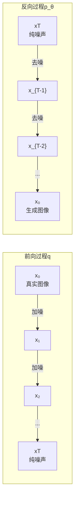
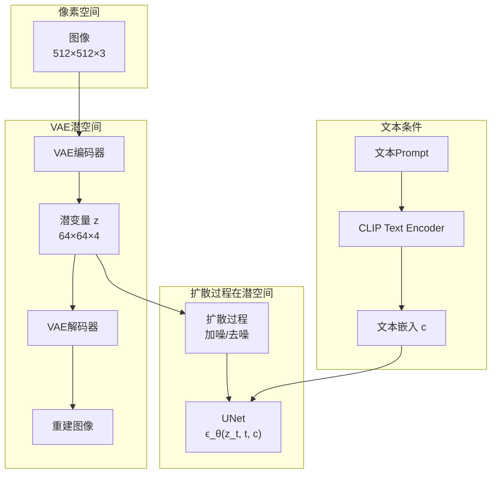

# 第 48 章 扩散模型与生成式视觉 ⭐⭐⭐⭐
> [!abstract] 本章导航
> **定位**：第七部分 多模态与前沿架构中的第 48 章；围绕“扩散模型与生成式视觉”建立单一、可追踪的知识主线。
>
> **先修**：[[47_多模态表征与多模态大模型|第 47 章 多模态表征与多模态大模型]]。
>
> **学习目标**：
> - 解释 扩散模型基础 的核心问题、机制与适用边界。
> - 实现或评估 扩散模型基础 的最小闭环。
> - 使用可复现证据诊断 扩散模型基础 的工程取舍与失败模式。
>
> **建议路径**：扩散模型基础。
>
> **配套代码**：`code/ch47_multimodal/`。

本章先回答“扩散模型基础”为什么成立，再沿着机制、实现、评估和边界逐步展开。阅读时先建立因果链，再运行或推演示例，最后用章末自测检查能否脱离原文复述。
## 48.1 扩散模型基础

### 48.1.1 DDPM 核心原理

**DDPM**（Denoising Diffusion Probabilistic Models）是扩散模型的奠基性工作，通过模拟物理中的扩散过程来生成数据。

**前向扩散过程（加噪）**：

给定真实数据 $\mathbf{x}_0 \sim q(\mathbf{x})$，逐步添加高斯噪声：

$$q(\mathbf{x}_t | \mathbf{x}_{t-1}) = \mathcal{N}(\mathbf{x}_t; \sqrt{1-\beta_t} \mathbf{x}_{t-1}, \beta_t \mathbf{I})$$

其中 $\beta_t \in (0, 1)$ 是噪声调度。经过 $T$ 步后，$\mathbf{x}_T$ 接近纯噪声。

**重参数化技巧**：可以直接从 $\mathbf{x}_0$ 采样任意时刻的 $\mathbf{x}_t$：

$$q(\mathbf{x}_t | \mathbf{x}_0) = \mathcal{N}(\mathbf{x}_t; \sqrt{\bar{\alpha}_t} \mathbf{x}_0, (1-\bar{\alpha}_t) \mathbf{I})$$

其中 $\alpha_t = 1-\beta_t$，$\bar{\alpha}_t = \prod_{s=1}^{t} \alpha_s$。

$$\mathbf{x}_t = \sqrt{\bar{\alpha}_t} \mathbf{x}_0 + \sqrt{1-\bar{\alpha}_t} \boldsymbol{\epsilon}, \quad \boldsymbol{\epsilon} \sim \mathcal{N}(0, \mathbf{I})$$

**反向去噪过程**：

学习一个神经网络 $\boldsymbol{\epsilon}_\theta(\mathbf{x}_t, t)$ 来预测添加的噪声：

$$\mathcal{L}_{\text{simple}} = \mathbb{E}_{t, \mathbf{x}_0, \boldsymbol{\epsilon}} \left[ \|\boldsymbol{\epsilon} - \boldsymbol{\epsilon}_\theta(\mathbf{x}_t, t)\|^2 \right]$$



### 48.1.2 DDPM 简化实现

```python
import torch
import torch.nn as nn
import torch.nn.functional as F
import math

class SinusoidalPositionEmbedding(nn.Module):
    """时间步的正弦位置嵌入"""
    def __init__(self, dim):
        super().__init__()
        self.dim = dim

    def forward(self, t):
        # t: [B]
        device = t.device
        half_dim = self.dim // 2
        embeddings = math.log(10000) / (half_dim - 1)
        embeddings = torch.exp(torch.arange(half_dim, device=device) * -embeddings)
        embeddings = t[:, None] * embeddings[None, :]
        embeddings = torch.cat([embeddings.sin(), embeddings.cos()], dim=-1)
        return embeddings


class SimpleUNet(nn.Module):
    """简化版 UNet，用于 DDPM 图像生成"""
    def __init__(self, in_channels=3, base_channels=64, time_emb_dim=256):
        super().__init__()
        self.time_mlp = nn.Sequential(
            SinusoidalPositionEmbedding(base_channels * 4),
            nn.Linear(base_channels * 4, time_emb_dim),
            nn.GELU(),
            nn.Linear(time_emb_dim, time_emb_dim),
        )

        # 编码器（下采样）
        self.enc1 = self._make_block(in_channels, base_channels)
        self.enc2 = self._make_block(base_channels, base_channels * 2)
        self.enc3 = self._make_block(base_channels * 2, base_channels * 4)

        # 中间层
        self.mid = self._make_block(base_channels * 4, base_channels * 4)

        # 时间嵌入投影
        self.time_proj = nn.Linear(time_emb_dim, base_channels * 4)

        # 解码器（上采样）
        self.dec3 = self._make_block(base_channels * 8, base_channels * 2)
        self.dec2 = self._make_block(base_channels * 4, base_channels)
        self.dec1 = self._make_block(base_channels * 2, base_channels)

        # 输出层
        self.final = nn.Conv2d(base_channels, in_channels, kernel_size=1)

        self.down = nn.MaxPool2d(2)
        self.up = nn.Upsample(scale_factor=2, mode='bilinear', align_corners=True)

    def _make_block(self, in_ch, out_ch):
        return nn.Sequential(
            nn.Conv2d(in_ch, out_ch, 3, padding=1),
            nn.GroupNorm(8, out_ch),
            nn.SiLU(),
            nn.Conv2d(out_ch, out_ch, 3, padding=1),
            nn.GroupNorm(8, out_ch),
            nn.SiLU(),
        )

    def forward(self, x, t):
        # x: [B, 3, H, W], t: [B]
        t_emb = self.time_mlp(t)  # [B, time_emb_dim]

        # 编码器
        e1 = self.enc1(x)        # [B, 64, H, W]
        e2 = self.enc2(self.down(e1))  # [B, 128, H/2, W/2]
        e3 = self.enc3(self.down(e2))  # [B, 256, H/4, W/4]

        # 注入时间信息
        t_proj = self.time_proj(t_emb)[:, :, None, None]  # [B, 256, 1, 1]
        mid = self.mid(self.down(e3))  # [B, 256, H/8, W/8]
        mid = mid + t_proj * mid  # 时间条件注入

        # 解码器（含跳跃连接）
        d3 = self.dec3(torch.cat([self.up(mid), e3], dim=1))
        d2 = self.dec2(torch.cat([self.up(d3), e2], dim=1))
        d1 = self.dec1(torch.cat([self.up(d2), e1], dim=1))

        return self.final(d1)


class DDPM:
    """DDPM 训练与采样框架"""
    def __init__(self, model, n_steps=1000, beta_start=1e-4, beta_end=0.02, device='cuda'):
        self.model = model.to(device)
        self.n_steps = n_steps
        self.device = device

        # 线性噪声调度
        self.betas = torch.linspace(beta_start, beta_end, n_steps).to(device)
        self.alphas = 1 - self.betas
        self.alpha_bars = torch.cumprod(self.alphas, dim=0)

    def add_noise(self, x0, t):
        """前向加噪：x0 -> xt"""
        alpha_bar_t = self.alpha_bars[t][:, None, None, None]
        epsilon = torch.randn_like(x0)
        xt = torch.sqrt(alpha_bar_t) * x0 + torch.sqrt(1 - alpha_bar_t) * epsilon
        return xt, epsilon

    def training_step(self, x0):
        """单步训练"""
        B = x0.shape[0]
        t = torch.randint(0, self.n_steps, (B,), device=self.device)

        xt, noise = self.add_noise(x0, t)
        pred_noise = self.model(xt, t)

        loss = F.mse_loss(pred_noise, noise)
        return loss

    @torch.no_grad()
    def sample(self, shape, return_intermediates=False):
        """DDPM 采样：从噪声生成图像"""
        self.model.eval()
        x = torch.randn(shape, device=self.device)

        intermediates = []
        for t in reversed(range(self.n_steps)):
            t_batch = torch.full((shape[0],), t, device=self.device, dtype=torch.long)

            # 预测噪声
            pred_noise = self.model(x, t_batch)

            # 计算 x_{t-1}
            alpha_t = self.alphas[t]
            alpha_bar_t = self.alpha_bars[t]
            beta_t = self.betas[t]

            if t > 0:
                noise = torch.randn_like(x)
            else:
                noise = 0

            x = (1 / torch.sqrt(alpha_t)) * (
                x - ((1 - alpha_t) / torch.sqrt(1 - alpha_bar_t)) * pred_noise
            ) + torch.sqrt(beta_t) * noise

            if return_intermediates and t % 100 == 0:
                intermediates.append(x.clone())

        if return_intermediates:
            return x, intermediates
        return x


# 训练示例
# unet = SimpleUNet(in_channels=3, base_channels=64)
# ddpm = DDPM(unet, n_steps=1000, device='cuda')
# optimizer = torch.optim.AdamW(unet.parameters(), lr=1e-4)
# for epoch in range(epochs):
#     for images in dataloader:
#         loss = ddpm.training_step(images)
#         optimizer.zero_grad()
#         loss.backward()
#         optimizer.step()
```

### 48.1.3 Stable Diffusion 架构

**Stable Diffusion** 的核心创新是**在潜空间（Latent Space）中进行扩散**，而非像素空间，大幅降低了计算成本。



**三大核心组件**：

| 组件 | 作用 | 参数量 | 训练状态 |
|------|------|--------|----------|
| **VAE** | 图像压缩到潜空间（8×压缩） | ~80M | 冻结 |
| **CLIP Text Encoder** | 文本条件编码 | ~123M | 冻结 |
| **UNet** | 潜空间去噪预测（含交叉注意力） | ~860M | 训练 |

**交叉注意力机制**（Cross-Attention）：将文本条件注入UNet的每一层。

$$\text{Attention}(Q, K, V) = \text{softmax}\left(\frac{Q K^\top}{\sqrt{d}}\right) V$$

其中：
- $Q$ 来自潜空间特征
- $K, V$ 来自 CLIP 文本编码

### 48.1.4 DiT：Diffusion Transformer 演进

**DiT**（Diffusion Transformer）将 UNet 替换为纯 Transformer，是扩散模型架构的重要演进。

| 架构 | UNet (SD) | DiT (SD3/Flux) |
|------|-----------|----------------|
| **主干网络** | CNN-based UNet | Transformer |
| **条件注入** | 交叉注意力 | AdaLN（自适应层归一化） |
| **位置编码** | 隐式（卷积） | 显式（位置嵌入） |
| **可扩展性** | 受限于CNN归纳偏置 | 随计算量增长持续提升 |
| **代表模型** | SD 1.5, SDXL | SD3, Flux, Sora |

**DiT Block 结构**：

$$\mathbf{x} \leftarrow \mathbf{x} + \text{MultiHeadSelfAttention}(\text{AdaLN}_1(\mathbf{x}, \mathbf{c}))$$
$$\mathbf{x} \leftarrow \mathbf{x} + \text{MLP}(\text{AdaLN}_2(\mathbf{x}, \mathbf{c}))$$

其中 $\text{AdaLN}(\mathbf{x}, \mathbf{c}) = \gamma(\mathbf{c}) \cdot \text{LayerNorm}(\mathbf{x}) + \beta(\mathbf{c})$

### 48.1.5 2026年图像生成趋势

| 趋势 | 代表模型/技术 | 核心创新 |
|------|--------------|----------|
| **DiT全面取代UNet** | Flux, SD3.5, Hunyuan-DiT | Transformer成为生成模型标配 |
| **理解模型与生成工具协作** | GPT-5.6 + GPT Image 2、Gemini 3.6 Flash + 专用图像模型 | 通过 API/Agent 工具组合完成理解与生成，不推断为同一模型权重 |
| **实时生成** | SD Turbo, LCM, SDXS | 1-4步即可完成生成 |
| **可控生成** | ControlNet, IP-Adapter, InstantID | 精确控制姿势、面部、风格 |
| **视频生成爆发** | Sora, Kling 2.0, Veo 3 | 从图像生成扩展到视频生成 |
| **3D/4D生成** | 3D Gaussian Splatting + Diffusion | 从2D扩散到3D场景生成 |

> 📚 **相关章节**：[[47_多模态表征与多模态大模型]]（音频生成）、[[47_多模态表征与多模态大模型]]（视频生成详解）
## 🧭 本章小结

- 扩散模型基础：能够说清问题、机制、证据与边界。

## ✅ 自测与练习

1. 不看正文，解释“扩散模型基础”解决什么问题，并给出一个不适用场景。
2. 为“扩散模型基础”设计一个最小可复现实验，明确输入、指标和通过条件。
3. 比较“扩散模型基础”的至少两种方案，说明质量、成本、延迟或风险取舍。

## 🧪 配套代码与验收

- `code/ch47_multimodal/`

```powershell
python code/scripts/run_all_examples.py --chapter ch47 --tier core
```

默认验收不下载模型、不调用付费 API；真实 API 或 GPU 示例必须按 metadata 显式启用。成功标准是相关脚本输出 `OK`，条件不足时输出可解释的 `[SKIP]`。

## 🎯 面试题精讲

回答本章问题时使用四步结构：先给结论，再解释机制，然后给项目证据，最后主动说明适用边界。涉及性能或效果时，补充模型、硬件、数据、并发、版本和统计口径；条件不完整时明确说“需要实测”。

## 📋 本章速查表

| 主题 | 回答主线 |
|---|---|
| 扩散模型基础 | 问题 → 机制 → 示例 → 指标 → 边界 |

## 🔗 相关章节

- [[47_多模态表征与多模态大模型|第 47 章 多模态表征与多模态大模型]]
- [[49_世界模型VLA与具身智能|第 49 章 世界模型、VLA 与具身智能]]

## 📖 一手参考资料

> 核验基线：2026-07-31；结构复核：2026-08-05。产品、API、法规、价格与 benchmark 会变化，使用前应再次核验。

- [[docs/AUTHORITATIVE_SOURCES|章节权威来源索引]]：按主题维护官方文档、标准、原论文和官方仓库。
