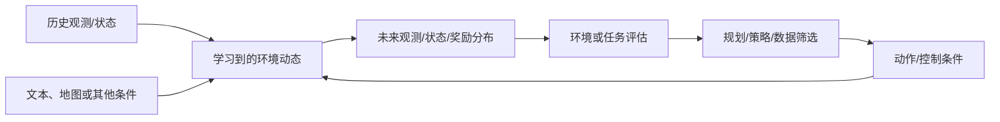
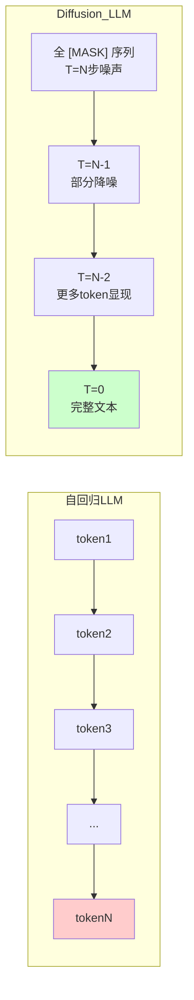
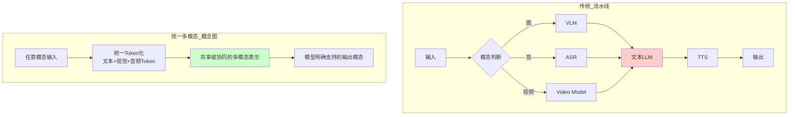
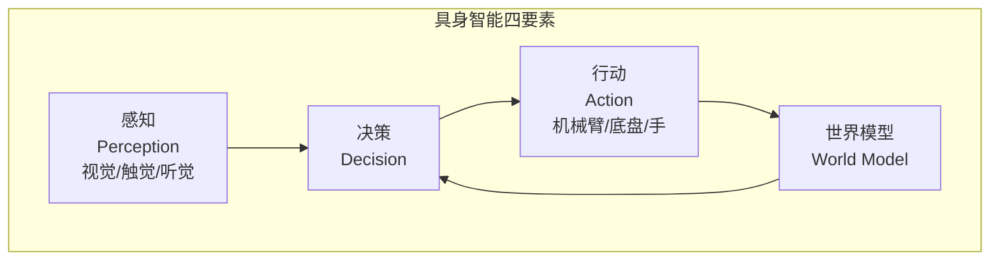
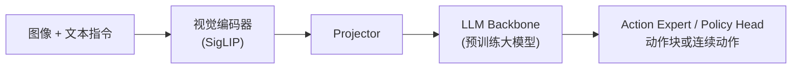
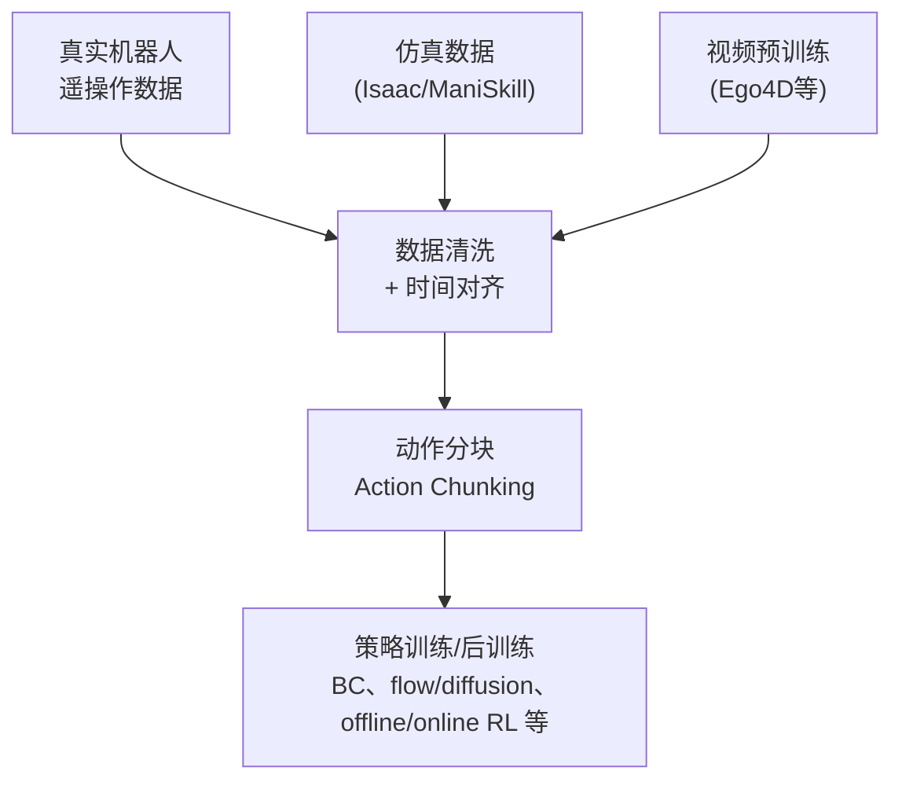
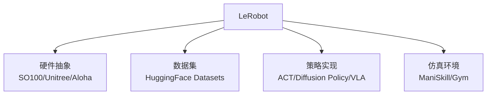
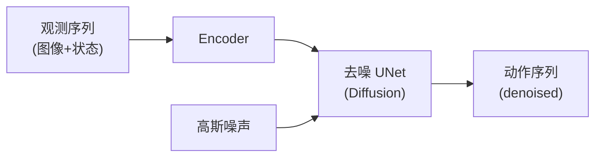
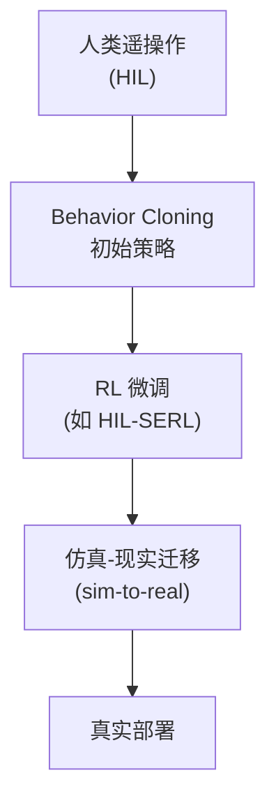

# 第 49 章 世界模型、VLA 与具身智能 ⭐⭐⭐⭐
> [!abstract] 本章导航
> **定位**：第七部分 多模态与前沿架构中的第 49 章；围绕“世界模型、VLA 与具身智能”建立单一、可追踪的知识主线。
>
> **先修**：[[48_扩散模型与生成式视觉|第 48 章 扩散模型与生成式视觉]]。
>
> **学习目标**：
> - 解释 世界模型与Diffusion LLM 的核心问题、机制与适用边界。
> - 实现或评估 具身智能全景 的最小闭环。
> - 使用可复现证据诊断 VLA 模型（Vision-Language-Action） 的工程取舍与失败模式。
>
> **建议路径**：世界模型与Diffusion LLM → 具身智能全景 → VLA 模型（Vision-Language-Action） → LeRobot 框架 → 模仿学习范式 → 强化学习在机器人 → 生产边界与面试表达。
>
> **配套代码**：`code/ch49_world_models/`。

本章先回答“世界模型与Diffusion LLM”为什么成立，再沿着机制、实现、评估和边界逐步展开。阅读时先建立因果链，再运行或推演示例，最后用章末自测检查能否脱离原文复述。
## 49.1 世界模型与Diffusion LLM

> ⭐⭐⭐⭐⭐ **截至 2026-07-31 的前沿快照**：本节聚焦**世界模型（World Models）**、
> **Diffusion LLM**、**实时语音模型**与**统一 Any-to-Any 模型**。这些方向迭代很快；
> 型号、开放程度、输入输出模态与 SDK 接口必须回到厂商模型页/仓库逐项核对。

### 49.1.1 世界模型（World Models）

**工程定义**：世界模型学习环境状态或观测随时间、动作和条件变化的规律，用于未来预测、
规划、数据生成或策略学习。它不一定输出像素，也不一定采用 DiT；“能生成逼真视频”更不等于
已经学会可靠物理规律。判断项目能力时至少要分开验证：长期一致性、动作可控性、因果/物理
指标、闭环任务收益与失败模式。



**代表系统（只比较官方公开边界，不做主观“物理强弱”排名）**：

| 系统 | 当前公开边界 | 能据此确认 | 仍需单独验证 |
|------|-------------|-----------|-------------|
| **Genie 3** | Google DeepMind 研究系统；官方页面给出 720p、20–24 FPS 的实时交互描述 | 可交互生成世界的产品/研究演示 | 权重、本地部署、目标任务长期一致性与闭环收益 |
| **Cosmos 3** | NVIDIA 开放的 Physical AI 世界基础模型平台；`Cosmos3-Nano`/`Super` 与官方代码、模型卡可查 | 文本、图像、视频、音频、动作等当前受支持模态与工具链 | 许可证适用性、目标硬件资源、物理正确性和机器人安全 |
| **通用视频生成产品** | Sora、Veo、可灵等按各自产品页提供视频生成能力 | 产品明确列出的时长、分辨率、音频与地区可用性 | 不能仅凭视频逼真度推断其是动作条件世界模型或可靠仿真器 |

**版本边界**：

- **Genie 3**：官方把它描述为实时可交互世界模型；其页面同时列出局限。教程不反推未公开的
  训练架构、loss、权重规模或本地显存需求。
- **Cosmos 3**：当前统一的 omni-model 取代早期 Cosmos 分立的 Predict、Reason、Transfer
  路线。当前 Diffusers 类名是 `Cosmos3OmniPipeline`，模型标识示例为
  `nvidia/Cosmos3-Nano`；旧 `CosmosPredictPipeline` 不是当前接口。
- 对任何系统，“官方演示可用”“模型权重可下载”“特定机器人闭环安全可部署”是三种不同证据。

```python
# Cosmos 3 当前 Diffusers 接口形状（会下载大体量权重；不是默认验收）
import json
import torch
from diffusers import Cosmos3OmniPipeline

pipe = Cosmos3OmniPipeline.from_pretrained(
    "nvidia/Cosmos3-Nano",
    torch_dtype=torch.bfloat16,
    device_map="cuda",
)

# 最小 text-to-image 形状；正式项目应使用官方 prompt-upsampling 与安全检查流程
result = pipe(
    prompt=json.dumps({"scene": "A robot arm in a kitchen"}),
    num_frames=1,
    height=720,
    width=1280,
)
result.video[0].save("cosmos3_t2i.jpg")
```

> 上述代码来自当前接口形状，但本仓库的默认 GPU 验收不会下载或运行 Cosmos 3。
> 真跑前必须阅读当前模型卡、NVIDIA Open Model License、安全检查要求和官方 cookbook，并先做
> 磁盘/显存预算；生成一张图也不能证明物理世界模型或机器人策略有效。

### 49.1.2 Diffusion LLM：扩散语言模型

**动机**：自回归LLM（GPT系）逐token生成，**无法并行、难以编辑、推理延迟与长度线性相关**。Diffusion LLM将扩散模型应用于离散token，支持**并行解码、双向上下文、任意位置编辑**。



**可公开核验的 Diffusion LLM 路线**：

| 工作 | 公开证据 | 核心创新 | 结论边界 |
|------|---------|---------|---------|
| **LLaDA 2.0** | 论文与官方仓库 | 将 AR checkpoint 转换并扩展到 block diffusion，提供不同规模开放权重 | 质量/速度只在论文指定模型、任务与实现内比较 |
| **BD3-LM** | ICLR 2025 论文与代码 | 块间自回归、块内扩散，支持可变长度与 KV cache | 论文结论是相对其研究基线，不等于生产服务固定加速 |
| **SEDD** | 论文与研究实现 | Score Entropy Discrete Diffusion | 适合作为方法基线，不能直接外推到商用大模型 |

**关键技术原理：**

- **Mask Diffusion**：前向过程随机将token替换为`[MASK]`，反向过程预测原token。与BERT的MLM一脉相承，但采样步数可调（1-50步）。
- **BD3-LM**：将序列切块（block），**块间自回归、块内扩散**，结合两者优势——长序列质量好、短块并行快。
- **推理实现**：并行 unmask、block KV cache 和动态步数都是可能的优化，但公开引擎的
  模型支持与 CLI 会变化；部署前必须以目标模型仓库和引擎兼容矩阵为准。
- **公平评测**：固定模型质量门限、输出长度、batch/QPS、硬件和采样参数，同时报告
  TTFT、TPOT、吞吐、峰值内存与任务质量，不能只比较供应商给出的 tokens/s。

参考：[LLaDA 2.0 论文](https://arxiv.org/abs/2512.15745)、
[BD3-LM 论文](https://arxiv.org/abs/2503.09573)与
[BD3-LM 官方代码](https://github.com/kuleshov-group/bd3lms)。

### 49.1.3 实时语音模型

**痛点**：传统语音 pipeline 常由 ASR + LLM + TTS 串联，端到端时延会叠加；端到端语音模型
可以保留更多声学信息并支持双工交互，但实际延迟仍受网络、VAD、codec、推理硬件和缓冲策略影响。

| 模型/接口（核验 2026-07-31） | 输入/输出边界 | 发布状态 | 延迟口径 |
|------|------|------|------|
| **Moshi** | 端到端语音/文本研究模型 | 开放代码/权重 | 论文给出其特定配置的理论 160ms、L4 实测约 200ms，不外推到其他部署 |
| **GPT-Realtime-2.1** | 文本/音频输入输出，图像仅输入，不支持视频 | OpenAI API | 官方未给本教程可复用的统一端到端 SLA，需按区域与网络压测 |
| **Gemini 3.1 Flash Live Preview** | Live API 音频到音频，并支持文档所列多模态交互 | Preview | 预览能力与限制会变化，按模型页和会话配置实测 |

**Moshi关键创新**：
- **Mimi neural codec**：12.5Hz超低码率（1.1kbps）音频token化
- **Inner Monologue**：模型同时输出"文字思考流"+"语音流"，提升语义连贯
- **多流Transformer**：用户音频流 + 模型音频流 + 文本流并行建模

```python
# Moshi 实时对话（伪代码）
from moshi import MoshiClient
import asyncio

async def realtime_chat():
    client = MoshiClient("ws://localhost:8998")

    # 全双工流：用户讲话和模型回复同时进行
    async def send_audio():
        async for chunk in mic_stream():        # 80ms chunks
            await client.send_user_audio(chunk)

    async def recv_audio():
        async for chunk in client.recv_model_audio():
            await speaker_play(chunk)            # 实际缓冲与播放延迟需端到端测量

    await asyncio.gather(send_audio(), recv_audio())
```

### 49.1.4 统一Any-to-Any模型

**Any-to-Any 是目标而非系列名自动保证的能力**。必须逐个核对输入模态、输出模态、
工具能力和部署接口；“可理解图像”不等于“可原生生成图像”。

| 模型（核验 2026-07-31） | 可核验的模态边界 | 开放性/状态 |
|------|---------|------|
| **GPT-Realtime-2.1** | 文本/音频输入输出，图像输入；不支持视频 | 闭源 API |
| **Gemini 3.1 Flash Live Preview** | Live API 的实时音频交互；其他模态以当前模型页为准 | 闭源 Preview |
| **Qwen3-Omni-30B-A3B-Instruct** | 文本、图像、音频、视频输入；文本与语音输出 | 开放权重，许可见模型仓库 |
| **MiniCPM-o 2.6** | 历史开放模型：图像、视频、音频输入与文本/语音能力 | 官方文档已于 2026-02 标为 archived |

**架构对比：传统 vs 统一**



**统一建模的潜在优势**（不是对闭源内部架构的披露）：
1. **跨模态推理**：可在图像中"看到"音频提示的内容
2. **链路简化**：可能减少显式 ASR/文本 LLM/TTS 间的信息损失；延迟仍需实测
3. **联合学习**：模态间共享训练信号，但效果取决于数据与训练配方
4. **情感保真**：语音中的情感、节奏、笑声端到端建模

### 49.1.5 四大方向技术对比与选型

| 维度 | 世界模型 | Diffusion LLM | 实时语音 | Any-to-Any |
|------|---------|---------------|---------|-----------|
| **代表** | Genie 3、Cosmos 等 | LLaDA 2.0、BD3-LM | Moshi、GPT-Realtime-2.1 | Qwen3-Omni；闭源 Live API 按模态矩阵判断 |
| **核心问题** | 时空一致+物理仿真 | 并行解码+双向编辑 | 低延迟双工 | 统一多模态空间 |
| **训练数据** | 视频+动作+物理 | 大规模文本 | 大规模对话音频 | 全模态混合 |
| **典型应用** | 游戏/机器人/影视 | 代码/长文本生成 | AI助手/客服 | 通用智能体 |
| **成熟度判断** | 按可控性与任务闭环验收 | 研究与早期工程并存 | 商用 API 与开放模型并存 | 能力边界依具体输入/输出矩阵 |
| **开放性** | 论文、开放权重与闭源产品并存 | LLaDA/BD3-LM 有公开实现 | Moshi 开放；厂商 API 闭源 | Qwen3-Omni 开放权重；厂商 Live API 闭源 |

> 💡 **选型建议**：
> - **游戏/仿真训练**：先核验世界模型是否提供动作条件、可控 rollout 与可用权重/API，再比较闭源研究系统和 Cosmos 等开放路线。
> - **视频内容创作**：按当前模型目录、地区可用性、素材权利、输出许可与人工质检选型，不沿用已弃用型号。
> - **Diffusion LLM**：当前更适合研究性 PoC；用目标质量门限和同硬件 benchmark 决定是否进入生产。
> - **语音 Agent**：可比较 GPT-Realtime-2.1、Gemini 3.1 Flash Live Preview 与 Moshi；重点测打断、噪声、端到端延迟、成本和隐私。
> - **多模态智能体**：闭源 API 与 Qwen3-Omni 等开放权重均按输入/输出模态矩阵和部署约束验收，MiniCPM-o 2.6 仅作历史参考。

> 📚 **相关章节**：[[15_Transformer架构与实现]]（DiT架构）、[[27_LLM框架与平台选型]]（SGLang部署）、[[22_Agent基础与工具调用]]（实时语音Agent）

## 49.2 具身智能全景



| 层级 | 任务 | 代表模型 |
|------|------|---------|
| **L0 感知** | 物体检测/分割/姿态 | DINO, SAM |
| **L1 行动** | 简单动作输出 | RT-1, RT-2 |
| **L2 VLA** | 视觉-语言条件的动作策略 | π0.5, GR00T N1.7, SmolVLA |
| **L3 世界模型** | 学习环境动态/生成未来状态 | Genie 3, Cosmos 3 |
| **L4 通用具身** | 跨任务泛化 | 待突破 |

## 49.3 VLA 模型（Vision-Language-Action）

VLA 是具身策略的一类重要路线：用视觉、语言和机器人状态共同条件化动作预测。动作可以是离散
token，也可以由连续回归、扩散或 flow matching action expert 生成；“把动作放进 LLM 词表”
并不是所有 VLA 的统一定义。

### 49.3.1 Pi0 / Pi0.5 (Physical Intelligence)



**Pi0 核心创新**: 流匹配 (Flow Matching) 而非传统回归，输出动作分布。

### 49.3.2 Isaac GR00T N1.7（NVIDIA）

- 当前公开仓库主线是 GR00T N1.7；旧 N1.5/N1.6 应作为历史版本标注。
- 官方仓库说明 N1.7 使用 Cosmos-Reason2-2B（Qwen3-VL 架构）作为 VLM backbone，并提供
  3B base checkpoint、微调与推理参考代码。
- “权重可获得”不代表目标机器人零样本可用；仍需 embodiment 配置、数据、评估与安全控制。

### 49.3.3 SmolVLA (HuggingFace)

- 官方 LeRobot 文档中的 `smolvla_base` 是 450M base model，输出连续动作并使用 flow matching。
- “轻量”不等于任意消费级设备即插即用；训练/推理资源取决于相机数、分辨率、batch、动作维度
  和目标平台，按当前模型卡与硬件指南核对。

### 49.3.4 VLA 训练数据流



## 49.4 LeRobot 框架

LeRobot 是 Hugging Face 维护的开源机器人学习框架与数据生态之一。它提供硬件、数据集、策略、
训练和评估工具，但“事实标准”需要采用率与组织场景证据，教程不作此断言。

### 49.4.1 LeRobot 核心组件



### 49.4.2 硬件与版本边界

LeRobot 支持的机器人、相机和策略会随版本变化，应以当前
[官方文档](https://huggingface.co/docs/lerobot/index)的硬件/策略目录为准。采购前还需核对
完整 BOM、地区价格、关税、售后、安全急停与标定工具，不能把历史裸机价格当作总成本。

### 49.4.3 LeRobot 训练示例

```bash
# 当前 LeRobot CLI 形状；版本、数据集和设备参数以官方文档为准
lerobot-train \
  --policy.type=act \
  --dataset.repo_id=<org>/<dataset> \
  --output_dir=outputs/train/<run_name> \
  --policy.device=cuda
```

## 49.5 模仿学习范式

### 49.5.1 主流算法对比

| 算法 | 原理 | 代表 | 数据效率 |
|------|------|------|---------|
| **BC (Behavior Cloning)** | 监督学习 | 最基础 | 低 |
| **ACT (Action Chunking Transformer)** | Transformer + 时间集成 | Aloha 团队 | 中 |
| **Diffusion Policy** | 扩散模型生成动作 | Stanford | 高 |
| **VQ-BeT** | 矢量量化 + Behavior Transformer | Toyota | 高 |
| **Multitask DiT** | 多任务 DiT | Google DeepMind | 极高 |

### 49.5.2 Diffusion Policy 详解



**优势**: 多模态动作分布建模、不确定性表达、平滑动作生成。

## 49.6 强化学习在机器人

| 方法 | 思想 | 代表 |
|------|------|------|
| **HIL-SERL** | 人类示范 + RL 微调 | Stanford |
| **TD-MPC 系列** | 学习潜在动态并做模型预测控制 | 研究路线 |
| **QC-FQL** | Q-加权的离线/在线策略学习路线 | 以原论文设置为准 |
| **SAC-X** | 自适应多任务 RL | DeepMind |



## 49.7 机器人基准测试

| 基准 | 任务 | 难度 |
|------|------|------|
| **LIBERO** | 多任务/持续学习的仿真操作套件 | 固定版本、suite、episode 数与 seed |
| **Meta-World** | 多任务机器人操作环境 | 固定任务集合和成功率口径 |
| **RLBench** | CoppeliaSim 上的多任务操作 benchmark | 不是“100 个真机任务” |
| **CALVIN** | 长视域语言条件操作 | 报告官方链式任务协议 |
| **ManiSkill** | 仿真操作与可复现实验环境 | 锁定主版本、资产和渲染后端 |
| **Open X-Embodiment** | 跨 embodiment 数据集合 | 数据源，不是单一在线 benchmark |
## 🧭 本章小结

- 世界模型与Diffusion LLM：能够说清问题、机制、证据与边界。
- 具身智能全景：能够说清问题、机制、证据与边界。
- VLA 模型（Vision-Language-Action）：能够说清问题、机制、证据与边界。

## ✅ 自测与练习

1. 不看正文，解释“世界模型与Diffusion LLM”解决什么问题，并给出一个不适用场景。
2. 为“具身智能全景”设计一个最小可复现实验，明确输入、指标和通过条件。
3. 比较“VLA 模型（Vision-Language-Action）”的至少两种方案，说明质量、成本、延迟或风险取舍。

## 🧪 配套代码与验收

- `code/ch49_world_models/`

```powershell
python code/scripts/run_all_examples.py --chapter ch49 --tier core
```

默认验收不下载模型、不调用付费 API；真实 API 或 GPU 示例必须按 metadata 显式启用。成功标准是相关脚本输出 `OK`，条件不足时输出可解释的 `[SKIP]`。

## 🎯 面试题精讲

回答本章问题时使用四步结构：先给结论，再解释机制，然后给项目证据，最后主动说明适用边界。涉及性能或效果时，补充模型、硬件、数据、并发、版本和统计口径；条件不完整时明确说“需要实测”。

## 📋 本章速查表

| 主题 | 回答主线 |
|---|---|
| 世界模型与Diffusion LLM | 问题 → 机制 → 示例 → 指标 → 边界 |
| 具身智能全景 | 问题 → 机制 → 示例 → 指标 → 边界 |
| VLA 模型（Vision-Language-Action） | 问题 → 机制 → 示例 → 指标 → 边界 |
| LeRobot 框架 | 问题 → 机制 → 示例 → 指标 → 边界 |
| 模仿学习范式 | 问题 → 机制 → 示例 → 指标 → 边界 |

## 🔗 相关章节

- [[48_扩散模型与生成式视觉|第 48 章 扩散模型与生成式视觉]]
- [[50_SSM_Mamba与非Transformer架构|第 50 章 SSM、Mamba 与非 Transformer 架构]]

## 📖 一手参考资料

> 核验基线：2026-07-31；结构复核：2026-08-05。产品、API、法规、价格与 benchmark 会变化，使用前应再次核验。

- [[docs/AUTHORITATIVE_SOURCES|章节权威来源索引]]：按主题维护官方文档、标准、原论文和官方仓库。
