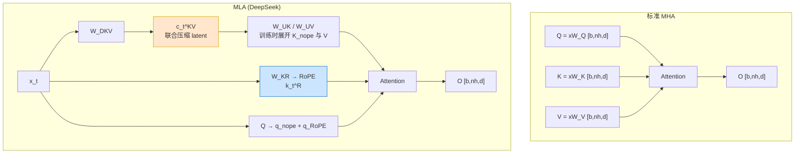
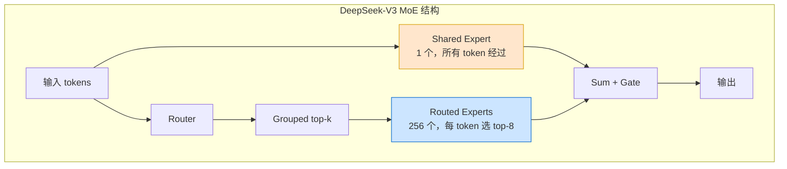

# 第 51 章 MoE、MLA、MTP 与 DeepSeek 架构 ⭐⭐⭐⭐
> [!abstract] 本章导航
> **定位**：第七部分 多模态与前沿架构中的第 51 章；围绕“MoE、MLA、MTP 与 DeepSeek 架构”建立单一、可追踪的知识主线。
>
> **先修**：[[50_SSM_Mamba与非Transformer架构|第 50 章 SSM、Mamba 与非 Transformer 架构]]。
>
> **学习目标**：
> - 解释 DeepSeek 风格架构深化 ⭐⭐⭐⭐⭐ 的核心问题、机制与适用边界。
> - 实现或评估 MLA：Multi-head Latent Attention ⭐⭐⭐⭐⭐ 的最小闭环。
> - 使用可复现证据诊断 Auxiliary-loss-free 负载均衡 ⭐⭐⭐⭐ 的工程取舍与失败模式。
>
> **建议路径**：DeepSeek 风格架构深化 ⭐⭐⭐⭐⭐ → MLA：Multi-head Latent Attention ⭐⭐⭐⭐⭐ → Auxiliary-loss-free 负载均衡 ⭐⭐⭐⭐ → Shared Experts 与细粒度分割 ⭐⭐⭐⭐ → Multi-Token Prediction (MTP) ⭐⭐⭐⭐⭐ → FP8 混合精度训练 ⭐⭐⭐⭐⭐ → 生产边界与面试表达。
>
> **配套代码**：`code/ch15_transformer/`。

本章先回答“DeepSeek 风格架构深化 ⭐⭐⭐⭐⭐”为什么成立，再沿着机制、实现、评估和边界逐步展开。阅读时先建立因果链，再运行或推演示例，最后用章末自测检查能否脱离原文复述。
## 51.1 DeepSeek 风格架构深化 ⭐⭐⭐⭐⭐

> 本节依据 DeepSeek-V2/V3 与 R1 的论文、技术报告和公开配置，介绍 **MLA 多头潜注意力**、**auxiliary-loss-free 负载均衡**、**shared experts + fine-grained segmentation**、**Multi-Token Prediction (MTP)**、**FP8 混合精度训练**。示例用于解释机制，不把报告中的单项成本口径外推为“比某闭源模型便宜固定倍数”。

### 51.1.1 MLA 多头潜注意力原理 ⭐⭐⭐⭐⭐

**动机：KV Cache 显存增长**。自回归推理时，各层需要缓存历史 token 的 K/V。设层数 $N_\ell$、KV 头数 $n_{kv}$、每头维度 $d_h$、序列长度 $L$、batch $B$、每元素 $s$ 字节：

$$\text{KVCache bytes} = 2_{\text{K,V}} \times N_\ell \times B \times L \times n_{kv} \times d_h \times s$$

例如一个假设的 60 层 MHA 模型，若 $n_{kv}=128$、$d_h=128$、$L=128K$、$B=1$、使用 fp16，则传统完整 K/V 约为 **480 GiB**（每层约 8 GiB）。这个数字是说明公式的 MHA 基线，不是 DeepSeek-V2 的实际缓存：DeepSeek-V2 为 **236B 总参数、约 21B 激活参数**，并使用 MLA；DeepSeek-V3/R1 才是 **671B 总参数、约 37B 激活参数**。

**MHA / GQA / MQA 对比**：

| 方案 | KV 头数 | KV Cache 大小 | 表达力 | 代表模型 |
|------|---------|--------------|--------|---------|
| **MHA** | $n_h$ | $O(n_h \cdot d_h)$ | 最强 | GPT-3, BERT |
| **MQA** | 1 | $O(d_h)$ | 最弱（质量下降明显） | PaLM, Falcon |
| **GQA** | $g$（分组共享） | $O(g \cdot d_h)$ | 中等 | LLaMA-2/3, Mistral |
| **MLA** | — | $O(d_c)$, $d_c \ll n_h d_h$ | **接近 MHA** | DeepSeek-V2/V3 |

MLA 的核心创新：**不是减少 KV 头数，而是用低秩投影把 KV 压缩到一个低维潜变量 $c_t$ 中缓存**。

**MLA 数学推导**：

1. **下投影（压缩）**：将 hidden $h_t \in \mathbb{R}^{d}$ 压缩为潜向量 $c_t \in \mathbb{R}^{d_c}$

$$c_t = W^{DKV} h_t, \quad d_c \ll n_h \cdot d_h$$

2. **上投影（还原）**：从 $c_t$ 还原出每个头的 K 和 V

$$k_t = W^{UK} c_t \in \mathbb{R}^{n_h \cdot d_h}, \quad v_t = W^{UV} c_t \in \mathbb{R}^{n_h \cdot d_h}$$

3. **Q 侧也做低秩**（DeepSeek-V2 进一步优化）：

$$q_t = W^{UQ}(W^{DQ} h_t)$$

4. **推理时只缓存 $c_t$**（而非完整 K/V），上投影矩阵 $W^{UK}, W^{UV}$ 在推理时才作用，KV Cache 从 $O(n_h d_h)$ 降到 $O(d_c)$。

**RoPE 兼容性 — 解耦维度**。RoPE 对 K 是位置相关的旋转，无法直接吸收进 $W^{UK}$。DeepSeek 的解法：把每个头拆成 **不旋转部分 $d_h^{nope}$**（走 MLA 低秩压缩）+ **旋转部分 $d_h^{rope}$**（单独保留小维度共享 RoPE）：

$$k_t = [k_t^{nope}; \, k_t^{rope}], \quad k_t^{rope} = \text{RoPE}(W^{KR} h_t)$$

**显存收益如何表述**：MLA 缓存低维 KV 潜变量以及位置相关部分，而不是每层每头的完整 K/V。具体字节数必须代入模型层数、`kv_lora_rank`、RoPE 维度、数据类型和运行时布局；不要用一个脱离配置的固定百分比代替计算。

```python
import torch
import torch.nn as nn

class MultiHeadLatentAttention(nn.Module):
    """MLA 简化实现（省略 RoPE 解耦，展示低秩 KV 压缩核心）"""
    def __init__(self, d_model, n_heads, d_head, d_c):
        super().__init__()
        self.n_heads, self.d_head = n_heads, d_head
        self.d_c = d_c  # 压缩潜维度，d_c << n_heads * d_head
        # Q 侧低秩
        self.W_DQ = nn.Linear(d_model, d_c, bias=False)
        self.W_UQ = nn.Linear(d_c, n_heads * d_head, bias=False)
        # KV 侧低秩
        self.W_DKV = nn.Linear(d_model, d_c, bias=False)
        self.W_UK = nn.Linear(d_c, n_heads * d_head, bias=False)
        self.W_UV = nn.Linear(d_c, n_heads * d_head, bias=False)
        self.W_O = nn.Linear(n_heads * d_head, d_model, bias=False)

    def forward(self, h, cache=None):
        # h: (B, L, d_model); cache: 已缓存的 c_{<t} (B, L_prev, d_c)
        c = self.W_DKV(h)                      # (B, L, d_c) ← 只缓存这个！
        q = self.W_UQ(self.W_DQ(h)).view(*h.shape[:2], self.n_heads, self.d_head)
        k = self.W_UK(c).view(*h.shape[:2], self.n_heads, self.d_head)
        v = self.W_UV(c).view(*h.shape[:2], self.n_heads, self.d_head)
        # Scaled dot-product attention（省略 mask/transpose 细节）
        attn = torch.einsum('blhd,bshd->blhs', q, k) / (self.d_head ** 0.5)
        attn = attn.softmax(dim=-1)
        out = torch.einsum('blhs,bshd->blhd', attn, v).reshape(h.shape[0], h.shape[1], -1)
        return self.W_O(out), c  # 返回 c 供后续缓存

# 对比简化缓存量（未计 allocator 对齐、RoPE cache 与运行时元数据）
B, L, n_layers, n_kv, d_h, d_c, bytes_per_elem = 1, 128*1024, 60, 128, 128, 512, 2
mha_kv = 2 * n_layers * B * L * n_kv * d_h * bytes_per_elem / 1024**3
mla_latent = n_layers * B * L * d_c * bytes_per_elem / 1024**3
print(f"传统 MHA KV Cache 基线: {mha_kv:.2f} GiB")
print(f"仅低维 latent（未计 RoPE 部分）: {mla_latent:.2f} GiB")
```

> **💡 面试要点**：MLA = 低秩 KV 压缩 + Q 也低秩 + RoPE 解耦维度。它把 KV Cache 从 $O(n_h d_h)$ 降到 $O(d_c)$，是 DeepSeek 能做长上下文 + 低成本推理的架构基石。

### 51.1.2 auxiliary-loss-free 负载均衡 ⭐⭐⭐⭐

**传统辅助损失（Switch/GShard）的问题**。早期 MoE 用辅助损失强制专家负载均衡：

$$L_{aux} = \alpha \cdot N \sum_{i=1}^{N} f_i \cdot P_i$$

其中 $f_i$ 是专家 $i$ 实际接收 token 的比例，$P_i$ 是 router 分配给专家 $i$ 的平均概率。该损失有三个副作用：(1) 与主任务损失相互干扰，**降低最终模型质量**；(2) 超参 $\alpha$ 难调；(3) 需在反向传播中维护额外的梯度路径。

**DeepSeek 的 auxiliary-loss-free 方案 — bias 项动态调节**。为每个专家维护一个**非梯度学习的路由选择偏置** $b_i$：

$$S_t = \operatorname{TopK}_i(s_{i,t} + b_i), \qquad
g_{i,t} \propto s_{i,t}\;\; (i \in S_t)$$

- $b_i$ 用于决定选中哪些专家；被选专家的门控权重仍由原始 affinity score $s_{i,t}$ 计算
- $b_i$ 不由反向传播更新，而是根据近期负载统计做规则更新
- 每个 step 统计各专家实际负载：若专家 $i$ 负载过高 → 增大 $b_i$ 的相反方向使其变小（被少选）；负载过低 → 调高 $b_i$（被多选）
- 更新规则（符号化）：若 $\text{load}_i > \text{mean}$ 则 $b_i \mathrel{-}= \gamma$；若 $\text{load}_i < \text{mean}$ 则 $b_i \mathrel{+}= \gamma$

**优势对比**：

| 维度 | 辅助损失（Switch/GShard） | auxiliary-loss-free（DeepSeek） |
|------|--------------------------|--------------------------------|
| 与主损失干扰 | ✅ 有，降低质量 | ❌ 无，主损失纯净 |
| 额外超参 | $\alpha$ 难调 | $\gamma$（步长）易调 |
| 均衡效果 | 一般，易塌缩 | 更稳，接近完美均衡 |
| 实现复杂度 | 反向传播改动 | 仅前向 + bias 增减 |

```python
class AuxLossFreeRouter(nn.Module):
    def __init__(self, d_model, n_experts, top_k=1, gamma=0.001):
        super().__init__()
        self.W = nn.Linear(d_model, n_experts, bias=False)
        self.bias = nn.Parameter(torch.zeros(n_experts), requires_grad=False)  # 不学梯度
        self.top_k, self.gamma, self.n_experts = top_k, gamma, n_experts

    def forward(self, h):
        scores = self.W(h)                             # (B, L, N)
        selection_scores = scores + self.bias
        _, topk_idx = selection_scores.topk(self.top_k, dim=-1)
        # bias 只影响选择；门控值来自未加 bias 的原始 score
        topk_val = scores.gather(-1, topk_idx)
        gate = topk_val.softmax(dim=-1)                # (B, L, K)
        return gate, topk_idx

    @torch.no_grad()
    def update_bias(self, topk_idx):
        """每 step 调用：根据实际负载动态调 bias"""
        load = torch.bincount(topk_idx.reshape(-1), minlength=self.n_experts).float()
        load = load / load.sum()
        mean = 1.0 / self.n_experts
        self.bias.add_((load < mean).float() * self.gamma)        # 欠载 → 增大
        self.bias.sub_((load > mean).float() * self.gamma)        # 过载 → 减小
```

> **💡 面试要点**：auxiliary-loss-free 的本质是**把「均衡约束」从损失函数搬到前向偏置项**，用非梯度的动态调节替代辅助损失，避免干扰主任务、提升最终模型质量。

### 51.1.3 shared experts 与 fine-grained segmentation ⭐⭐⭐⭐

DeepSeek-V2 的 MoE 设计有两个关键创新，解决了传统 MoE 的知识碎片化问题。

**(1) Fine-grained Segmentation（细粒度专家切分）**。传统 MoE（如 GShard、Mixtral）用 8~16 个大专家（每个 expert 是完整 FFN）。DeepSeek 把**单个大专家切成多个小专家**，专家总数大幅增加（如 64/160 个），但每个专家更小、每次激活更多个（如 6~8 个）：

| 方案 | 专家数 | 单专家维度 | 每 token 激活 | 激活参数量 |
|------|--------|-----------|--------------|-----------|
| Mixtral 8×7B | 8 | 大 | 2 | ≈13B |
| DeepSeek-V2 | 160 | 小（1/m 大小） | 6 | ≈可比 |

**动机**：(a) 更细粒度的组合，知识组合更灵活；(b) 在相同激活参数下，专家组合空间更大，**专家特化更精细**；(c) 路由更平滑（激活多个小专家 ≈ 软组合）。

**(2) Shared Experts（共享专家常驻）**。研究发现路由器会重复学习「通用知识」（语法、常见短语）到多个专家中，造成冗余。DeepSeek 设置 **K_s 个 shared expert**，**对所有 token 常驻激活**（不参与路由），专门承载通用知识：

$$\text{FFN}_{MoE}(x) = \underbrace{\sum_{i \in S_{shared}} E_i(x)}_{\text{常驻 shared experts}} + \underbrace{\sum_{j \in \text{TopK}(g)} g_j E_j(x)}_{\text{路由 routed experts}}$$

**优势**：(a) 通用知识只学一次到 shared experts，**消除冗余**；(b) routed experts 专注领域特化知识（数学、代码、多语言），**提升参数效率**；(c) 减少「路由抖动」——通用部分不依赖路由，更稳定。

```python
class DeepSeekMoELayer(nn.Module):
    """Shared experts + fine-grained routed experts 简化实现"""
    def __init__(self, d_model, d_ff, n_routed, n_shared, top_k):
        super().__init__()
        # 细粒度路由专家（数量多、单个体积小）
        self.routed_experts = nn.ModuleList([
            nn.Sequential(nn.Linear(d_model, d_ff), nn.SiLU(), nn.Linear(d_ff, d_model))
            for _ in range(n_routed)])
        # 共享专家（常驻，不路由）
        self.shared_experts = nn.ModuleList([
            nn.Sequential(nn.Linear(d_model, d_ff), nn.SiLU(), nn.Linear(d_ff, d_model))
            for _ in range(n_shared)])
        self.router = AuxLossFreeRouter(d_model, n_routed, top_k)
        self.top_k, self.n_shared = top_k, n_shared

    def forward(self, h):
        # 1. shared experts 对所有 token 常驻激活
        shared_out = sum(e(h) for e in self.shared_experts)  # (B, L, d)
        # 2. routed experts 按路由 top-K 激活
        gate, idx = self.router(h)             # gate: (B,L,K), idx: (B,L,K)
        routed_out = torch.zeros_like(h)
        for k in range(self.top_k):
            for e in range(len(self.routed_experts)):
                mask = (idx[..., k] == e)                     # (B, L)
                if mask.any():
                    routed_out += mask.unsqueeze(-1) * gate[..., k].unsqueeze(-1) * self.routed_experts[e](h)
        return shared_out + routed_out
```

> **💡 面试要点**：fine-grained segmentation 把大专家切小、增加组合灵活性；shared experts 把通用知识常驻化、消除冗余。二者共同提升 MoE 的参数效率，是 DeepSeek 在同等参数量下质量更优的关键。

### 51.1.4 Multi-Token Prediction (MTP) ⭐⭐⭐⭐⭐

**动机：打破 next-token 预测的「数据效率天花板」**。传统 CLM 每个 token 只用「上一个 token 预测下一个」一个信号，长程规划能力弱。MTP 让模型在训练时**一次预测后续多个 token**，强制模型做更前瞻的规划。

**MTP 模块结构**。主干仍执行标准 next-token prediction；在其后可串接 $M$ 个 MTP 模块，第 $m$ 个模块再预测更远一个未来 token。DeepSeek-V3 报告采用 **1 个 MTP 模块**，即除了主干的下一 token 目标，再增加一个未来 token 目标：

$$\text{MTP}_m: \quad \hat{y}_{t+m} = \text{LMHead}_m(\text{MTPModule}_m(h_t^{(0)}, \hat{h}_{t+m-1}^{(m-1)}))$$

每个 MTP Module 包含拼接投影与一个 Transformer Block，并复用主模型的 token embedding 和输出 head。这里“1 个 MTP 模块”不能写成“主干 + $M-1$ 个模块”，否则 $M=1$ 时会与“额外预测一个 token”自相矛盾。

**训练 loss 公式**。每个预测深度 $m$ 有独立交叉熵损失，求和：

$$L_{MTP} = \sum_{m=1}^{M} \lambda_m \cdot \mathbb{E}_t\left[ -\log P_{\theta_m}(y_{t+m} \mid y_{\leq t}; \text{MTP}_m) \right]$$

其中 $\lambda_m$ 是各深度损失的权重（通常均等或递减）。**推理时可以丢弃 MTP 头**（仅保留主干），无推理开销；也可保留用于推测解码。

**与推测解码（Speculative Decoding）的关系**：

| 维度 | 标准 Speculative Decoding | MTP 头 |
|------|--------------------------|--------|
| **draft 模型** | 额外的小模型 | 与主模型共享主干，无独立模型 |
| **训练对齐** | draft 与 target 训练目标不同，可能不一致 | MTP 头与主模型**联合训练**，分布天然对齐 |
| **接受率** | 受 draft 质量限制 | 接受率高（同源分布） |
| **额外参数** | 需维护 draft 模型 | 仅少量 MTP 模块，可丢弃 |

推理时：兼容的 MTP/投机解码实现可以先提出多个候选 token，再由主模型并行验证并接受匹配前缀；实际吞吐收益取决于接受率、验证开销、batch 和运行时实现。

```python
import torch
import torch.nn as nn

class MTPModule(nn.Module):
    """单层 MTP 模块：拼接主干隐状态 + 上一级隐状态 → Transformer Block → 隐状态"""
    def __init__(self, d_model, n_heads, vocab_size):
        super().__init__()
        self.proj = nn.Linear(2 * d_model, d_model)   # 拼接投影
        self.block = nn.TransformerEncoderLayer(
            d_model=d_model, nhead=n_heads, dim_feedforward=4*d_model, batch_first=True)
        # 教学简化：真实 DeepSeek-V3 MTP 与主模型共享输出 head。
        self.lm_head = nn.Linear(d_model, vocab_size, bias=False)

    def forward(self, h_main, h_prev_embed):
        # h_main: (B,L,d) 主干隐状态; h_prev_embed: 上一级预测 token 的嵌入
        x = self.proj(torch.cat([h_main, h_prev_embed], dim=-1))
        h_m = self.block(x)                            # (B, L, d)
        logits_m = self.lm_head(h_m)                   # 预测第 t+m 个 token
        return h_m, logits_m

# 训练 loss（伪代码）
# L = ce(logits_0, y_{1:T}) + sum_m lambda_m * ce(logits_m, y_{1+m : T+m})
```

> **💡 面试要点**：MTP 在训练时一次预测多个 token，提升数据效率与规划能力；推理时可丢弃（无开销）或用于同源推测解码（高接受率加速）。是 DeepSeek-V3 训练效率领先的关键技术之一。

### 51.1.5 FP8 混合精度训练 ⭐⭐⭐⭐⭐

**背景**。BF16/FP16 训练大模型时，激活和梯度动态范围大，低精度计算必须控制溢出与舍入误差。FP8 可以降低部分 GEMM 的数据搬运和计算成本，但不会自动让端到端显存或训练时间减半。DeepSeek-V3 是 **671B 总参数、约 37B 激活参数**的 MoE 模型，其报告公开了大规模 FP8 混合精度训练方案；它不是“万亿级模型”。

**FP8 的两种格式**：

| 格式 | 符号 | 指数 | 尾数 | 动态范围 | 适用 |
|------|------|------|------|---------|------|
| **E4M3** | 1 | 4 | 3 | 较小，精度较高 | 前向激活、权重 |
| **E5M2** | 1 | 5 | 2 | 较大，精度较低 | 反向梯度（范围大） |

**低精度 GEMM 与混合策略**。DeepSeek-V3 在主要矩阵乘法中将激活、权重或梯度按相应路径量化为 FP8 输入，同时让参数主存储、优化器状态、累加，以及 embedding、输出头、归一化、attention 和路由等敏感算子保留更高精度。不要把它简化成“所有权重永久以 E4M3 存储、所有梯度固定 E5M2”。

**Block-wise Scaling（分块缩放）—— 数值稳定性的核心**。FP8 单一全局 scale 无法兼顾不同张量区域的动态范围。DeepSeek 采用 **1×128 分块缩放**（对激活按 128 元素分块，权重按 128×128 块），每块独立计算 scale factor：

$$\hat{A}_{block} = \frac{A_{block}}{s_A}, \quad s_A = \max(|A_{block}|) / 448 \quad (\text{E4M3 最大值} \approx 448)$$

**为什么分块？** 大张量不同区域数值范围差异巨大，全局 scale 会导致小数值区域精度丢失（被量化到 0）、大数值区域溢出。分块让每块用最适配的 scale，**显著降低量化误差**。

**GEMM 计算流程**：

```text
FP8 输入 A, W → 反量化到 BF16 → BF16 累加 → FP8 输出
            (硬件 Tensor Core 支持 FP8 输入直接 BF16 累加)
```

```python
import torch

def fp8_blockwise_quantize(x, block_size=128, fmt='e4m3'):
    """分块缩放量化到 FP8（示意，实际在 H100 Tensor Core 上执行）"""
    orig_shape = x.shape
    # 把最后一维切成 block_size 一块
    x = orig_view_as_blocks(x, block_size)              # (..., n_blocks, block_size)
    s = x.abs().amax(dim=-1, keepdim=True) / 448.0      # 每块 scale
    s = s.clamp(min=1e-12)
    x_scaled = (x / s).clamp(-448, 448)                 # 防溢出
    # 模拟 FP8 量化（4 位尾数 → 256 级）
    x_fp8 = fake_fp8_round(x_scaled, fmt=fmt)
    return x_fp8, s

def fp8_gemm(A, W):
    """W8A8 FP8 GEMM：分块量化 → 硬件累加"""
    A_q, sA = fp8_blockwise_quantize(A, block_size=128)  # 激活 1x128 分块
    W_q, sW = fp8_blockwise_quantize(W, block_size=128)  # 权重 128x128 分块
    # Tensor Core: FP8 输入 → BF16 累加（伪代码）
    out_bf16 = fp8_matmul_kernel(A_q, W_q)
    # 反量化：乘回各块的 scale
    out = out_bf16 * (sA * sW.T)
    return out
```

**数值稳定性要点**：
1. **累加过程使用高于 FP8 的精度**，并针对 Tensor Core 累加误差采取工程处理
2. **关键层保持 BF16**：attention softmax、LayerNorm、router 的 logits 等敏感计算不降精度
3. **参数、optimizer state 的具体存储精度按报告与实现核对**，不能由一张格式表推断
4. **动态 scale 更新**：每隔若干步根据实际范围重算 scale，防止漂移

**收益如何回答**：FP8 可显著降低受支持 GEMM 的带宽和算力开销，但端到端收益取决于 GPU、通信、算子覆盖率、序列长度、并行策略和稳定性开销。面试中应引用特定报告或自己的 benchmark，不承诺“显存减半、速度固定提升 1.5～2 倍”。

> **💡 面试要点**：DeepSeek-V3 FP8 方案的重点是细粒度缩放、高精度累加与敏感算子保留高精度，而不是背诵一个覆盖所有张量的 E4M3/E5M2 固定映射。

本节依据 [DeepSeek-V3 Technical Report](https://arxiv.org/abs/2412.19437)；核对日期：2026-07-31。

## 51.2 MLA：Multi-head Latent Attention ⭐⭐⭐⭐⭐

### 51.2.1 为什么需要 MLA：Attention 的显存瓶颈

标准 MHA 需同时缓存 K 和 V，元素数为
$2n\,n_h d_h$。当 $n=128\text{K}$、$n_h=128$、$d_h=128$ 时，每层为
$2\times131072\times128\times128=4{,}294{,}967{,}296$ 个 FP16 元素，即约 **8 GiB/层**。
实际模型可能使用 GQA/MQA、分页和低精度 KV，必须按真实 KV heads、head dim、dtype、batch
与层数重新计算。

MLA 的核心洞察：**KV 可被联合低秩压缩，而不会显著影响精度**。

### 51.2.2 MLA 的数学形式

MLA（Multi-head Latent Attention）先把每个 token 的 K/V 信息联合压缩为低秩 latent
$c_t^{KV}$，并为 decoupled RoPE 另存一个小的 key 分量。DeepSeek-V3 的关键维度为
$d_c=512$、$d_h^R=64$。



数学推导：
$$
\begin{aligned}
c_t^{KV} &= W^{DKV}h_t \in \mathbb{R}^{d_c} \\
[k_{t,1}^{C},\ldots,k_{t,n_h}^{C},v_{t,1}^{C},\ldots,v_{t,n_h}^{C}]
  &= W^{UKV}c_t^{KV} \\
k_t^R &= \operatorname{RoPE}(W^{KR}h_t) \\
q_{t,i} &= [q_{t,i}^{C};q_{t,i}^{R}],\qquad
k_{t,i}=[k_{t,i}^{C};k_t^R]
\end{aligned}
$$

推理时可把上投影吸收到 Q/输出投影中，缓存只需每 token 的
$c_t^{KV}$ 与 $k_t^R$，即 $512+64=576$ 个标量。若与同维度的 MHA
$2\times128\times128=32768$ 个标量比较，理论元素数约减少 **56.9 倍**；与 GQA、不同 dtype
或包含量化元数据的实现比较时比例会不同。

```python
"""MLA 教学实现：缓存联合 KV latent 与 decoupled-RoPE key。

为便于阅读，代码在计算时显式展开 K/V；生产 decode 会吸收投影，避免每步展开全部历史。
"""
import torch
import torch.nn as nn
import torch.nn.functional as F

class MLAttention(nn.Module):
    def __init__(self, d_model: int, n_heads: int, kv_rank: int = 512,
                 qk_nope_dim: int = 128, rope_dim: int = 64,
                 v_head_dim: int = 128):
        super().__init__()
        self.n_heads = n_heads
        self.kv_rank = kv_rank
        self.qk_nope_dim = qk_nope_dim
        self.rope_dim = rope_dim
        self.v_head_dim = v_head_dim
        self.q_proj = nn.Linear(
            d_model, n_heads * (qk_nope_dim + rope_dim), bias=False
        )
        # 一次下投影同时产生 KV latent 与独立 RoPE key。
        self.kv_down = nn.Linear(d_model, kv_rank + rope_dim, bias=False)
        self.kv_up = nn.Linear(
            kv_rank, n_heads * (qk_nope_dim + v_head_dim), bias=False
        )
        self.out_proj = nn.Linear(n_heads * v_head_dim, d_model, bias=False)

    @staticmethod
    def _rotate_half(x: torch.Tensor) -> torch.Tensor:
        x1, x2 = x.chunk(2, dim=-1)
        return torch.cat((-x2, x1), dim=-1)

    def _rope(self, x: torch.Tensor, offset: int) -> torch.Tensor:
        # x: [batch, seq, heads, rope_dim]
        positions = torch.arange(
            offset, offset + x.shape[1], device=x.device, dtype=torch.float32
        )
        inv_freq = 1.0 / (
            10000 ** (
                torch.arange(0, self.rope_dim, 2, device=x.device).float()
                / self.rope_dim
            )
        )
        angles = torch.outer(positions, inv_freq)
        emb = torch.cat((angles, angles), dim=-1)[None, :, None, :]
        return x * emb.cos().to(x.dtype) + self._rotate_half(x) * emb.sin().to(x.dtype)

    def forward(self, x: torch.Tensor, past_kv=None):
        """
        x: [batch, seq_len, d_model]
        past_kv: (past_c_kv, past_k_rope)
        """
        b, l, _ = x.shape
        nh = self.n_heads
        q = self.q_proj(x).view(
            b, l, nh, self.qk_nope_dim + self.rope_dim
        )
        q_nope, q_rope = q.split([self.qk_nope_dim, self.rope_dim], dim=-1)

        down = self.kv_down(x)
        c_kv, k_rope = down.split([self.kv_rank, self.rope_dim], dim=-1)
        past_len = 0 if past_kv is None else past_kv[0].shape[1]
        q_rope = self._rope(q_rope, past_len)
        k_rope = self._rope(k_rope.unsqueeze(2), past_len)

        if past_kv is not None:
            c_kv = torch.cat((past_kv[0], c_kv), dim=1)
            k_rope = torch.cat((past_kv[1], k_rope), dim=1)
        new_past_kv = (c_kv, k_rope)

        # 教学版显式上投影；生产版会通过权重吸收避免展开历史 K/V。
        kv = self.kv_up(c_kv).view(
            b, c_kv.shape[1], nh, self.qk_nope_dim + self.v_head_dim
        )
        k_nope, value = kv.split(
            [self.qk_nope_dim, self.v_head_dim], dim=-1
        )
        key = torch.cat((k_nope, k_rope.expand(-1, -1, nh, -1)), dim=-1)
        query = torch.cat((q_nope, q_rope), dim=-1)
        scores = torch.einsum("blhd,bshd->bhls", query, key)
        scores = scores / (query.shape[-1] ** 0.5)
        key_pos = torch.arange(c_kv.shape[1], device=x.device)
        query_pos = past_len + torch.arange(l, device=x.device)
        causal = key_pos[None, :] <= query_pos[:, None]
        scores = scores.masked_fill(~causal[None, None, :, :], float("-inf"))
        probs = F.softmax(scores, dim=-1)
        out = torch.einsum("bhls,bshv->blhv", probs, value)
        return self.out_proj(out.reshape(b, l, -1)), new_past_kv
```

### 51.2.3 RoPE 的位置编码处理

MLA 将每个 head 的 Q/K 拆成 non-RoPE 与 RoPE 两部分。Q 的 $q_i^R$ 和共享的 key 分量
$k_t^R$ 都应用 RoPE；V 不使用 RoPE。缓存因此除了 $c_t^{KV}$ 还必须保存 $k_t^R$。

## 51.3 Auxiliary-loss-free 负载均衡 ⭐⭐⭐⭐

### 51.3.1 Switch Transformer 的辅助损失问题

Switch Transformer 的主要辅助负载损失写为：

$$
\mathcal{L}_{aux}=N\sum_{i=1}^{N} f_iP_i
$$

其中 $f_i$ 是发往专家 $i$ 的 token 比例，$P_i$ 是该专家平均路由概率。CV 形式见于其他
MoE 工作，不能直接标成 Switch Transformer 公式。

问题：
- 调参敏感（需平衡任务 loss 与负载 loss）
- 易「过均衡」——路由往均匀靠，牺牲任务性能
- 训练不稳定

### 51.3.2 DeepSeek-V3 的方案：动态偏置路由

DeepSeek-V3 对主负载均衡采用**不参与反向传播的 expert-wise correction bias**。它只影响
top-k 专家选择，实际混合权重仍来自未加 bias 的 affinity score。训练时根据近期负载，以固定
update speed 调低过载专家 bias、调高欠载专家 bias。论文还保留了很小的 sequence-wise
auxiliary loss，不能表述为“完全没有 auxiliary loss”。

路由概率计算：
$$
s_i(x)=\sigma(h_x^\top e_i),\qquad
g_i'(x)=
\begin{cases}
s_i(x),&s_i(x)+b_i\in\operatorname{TopK}\\
0,&\text{otherwise}
\end{cases}
$$

其中 $b_i$ 是非梯度 correction bias：
- 专家负载过高：**减小** $b_i$，降低后续入选概率；
- 专家负载过低：**增大** $b_i$，提高后续入选概率。

```python
"""DeepSeek-V3 风格 correction-bias 路由（省略 grouped top-k 与分布式同步）。"""
import torch
import torch.nn as nn

class CorrectionBiasRouter(nn.Module):
    def __init__(self, d_model: int, n_experts: int,
                 bias_update_speed: float = 1e-3):
        super().__init__()
        self.n_experts = n_experts
        self.bias_update_speed = bias_update_speed
        self.router = nn.Linear(d_model, n_experts, bias=False)
        # buffer：不由 optimizer/gradient 更新。
        self.register_buffer("correction_bias", torch.zeros(n_experts))

    def forward(self, x: torch.Tensor, top_k: int = 8):
        scores = self.router(x).sigmoid()
        selection_scores = scores + self.correction_bias
        indices = selection_scores.topk(top_k, dim=-1).indices
        # 组合专家输出时使用原始 score，不把 correction bias 混入权重。
        weights = scores.gather(-1, indices)
        weights = weights / weights.sum(dim=-1, keepdim=True).clamp_min(1e-9)
        if self.training:
            self.update_bias(indices)
        return indices, weights

    @torch.no_grad()
    def update_bias(self, indices: torch.Tensor) -> None:
        counts = torch.bincount(indices.reshape(-1), minlength=self.n_experts)
        target = counts.float().mean()
        # 生产分布式实现需先跨 DP ranks 汇总 counts。
        self.correction_bias.add_(
            self.bias_update_speed * torch.sign(target - counts.float())
        )
```

**为什么这样有效**：
- 主 task loss 不再被较强的全局均衡项直接牵引
- correction bias 形成负反馈，缓解专家过载
- 仍需 grouped top-k、capacity/通信监控和小的 sequence-wise auxiliary loss

## 51.4 Shared Experts 与细粒度分割 ⭐⭐⭐⭐

### 51.4.1 Shared Experts：常驻通用专家

Shared Experts 来自 DeepSeekMoE/DeepSeek-V2，并非 V3 首次引入。DeepSeek-V3 每个 MoE 层有
**1 个 shared expert、256 个 routed experts，每 token 激活 8 个 routed experts**，并采用
grouped top-k 限制通信范围。

动机：
- shared expert 用于捕获跨 token 常见模式，减少 routed experts 的知识冗余
- routed experts 允许更细粒度组合；不能在没有可解释性实验时把具体专家直接命名为“代码/数学/中文”
- shared expert 是额外的常驻 FFN 计算，并不会让部分 token 跳过路由

### 51.4.2 细粒度专家分割（Fine-grained Segmentation）

DeepSeek-V3 还将每个专家进一步分割为「小专家」，实现更细粒度的能力组合：



## 51.5 Multi-Token Prediction (MTP) ⭐⭐⭐⭐⭐

### 51.5.1 MTP 的动机：增加未来 token 的训练信号

MTP（Multi-Token Prediction）让每个位置除 next token 外再预测更远的未来 token，以提高
训练信号密度并鼓励表示预判后续内容。训练目标本身不等于投机解码；训练后可把 MTP 模块用于
speculative decoding，但还需实现 draft 生成、主模型验证和接受策略。

DeepSeek-V3 的第 $k$ 个 MTP module 将上一深度表示与第 $k$ 个未来 token 的共享 embedding
拼接并投影，经过一个 Transformer block，再复用共享输出 head。多个深度是**顺序依赖**的，
不是从同一个 hidden state 并行接若干小线性 head：

$$
h_i^{(k)}=\operatorname{TransformerBlock}_k
\left(M_k[h_i^{(k-1)};\operatorname{Emb}(t_{i+k})]\right)
$$

### 51.5.2 MTP 训练损失

标准 next-token prediction 仅预测下一个：
$$\mathcal{L}_\text{ce} = -\log P(y_t | x_1..x_{t-1})$$

MTP 在不同预测深度产生额外交叉熵：
$$\mathcal{L}_\text{mtp} = \frac{1}{D}\sum_{k=1}^{D}\mathcal{L}^{(k)}_\text{CE}$$

两者结合：
$$\mathcal{L}_\text{total} = \mathcal{L}_\text{ce} + \lambda \mathcal{L}_\text{mtp}$$

MTP 可以在推理系统中充当 draft proposer，但 DeepSeek-V3 的整体速度还来自 MLA、MoE、
FP8、并行与服务实现；不能把速度归因于 MTP 单一机制。

## 51.6 FP8 混合精度训练 ⭐⭐⭐⭐⭐

### 51.6.1 FP8 格式：E4M3 vs E5M2

FP8 有两种格式：

| 格式 | 指数位 | 尾数位 | 范围 | 精度 | 用途 |
|------|-------|-------|-----|-----|-----|
| **E4M3** | 4 | 3 | 最大有限值约 448 | 较高 | 常用于前向张量 |
| **E5M2** | 5 | 2 | 最大有限值约 57344 | 较低 | 需要更大动态范围的张量 |

DeepSeek-V3 报告对主要 GEMM 使用 E4M3 FP8，并保留高精度 master weights、归一化、部分累加与
敏感算子。常见 Transformer Engine HYBRID recipe 会前向用 E4M3、反向用 E5M2，但不能把该
通用 recipe 直接当作 V3 全部张量的固定映射。“显存减半/计算翻倍”也只在特定张量和支持 FP8
Tensor Core 的瓶颈下近似成立。

### 51.6.2 Block-wise Scaling（块级缩放）

直接转换会溢出或量化过粗。DeepSeek-V3 对**权重采用 128×128 block-wise scaling**，对
**激活采用 1×128 tile-wise scaling**；以下函数演示二维权重块量化，不代表完整训练 kernel。

```python
"""FP8 block-wise scaling 的简化实现"""
import torch

def to_fp8_blockwise(x: torch.Tensor, block_size: int = 128):
    """x: [m,n] → fp8 tensor + scale factors"""
    m, n = x.shape
    # padding 到 block_size 整数倍
    m_pad = ((m + block_size - 1) // block_size) * block_size
    n_pad = ((n + block_size - 1) // block_size) * block_size
    x_pad = torch.zeros(m_pad, n_pad, device=x.device, dtype=x.dtype)
    x_pad[:m, :n] = x
    # reshape 到 blocks
    blocks = x_pad.view(m_pad//block_size, block_size, n_pad//block_size, block_size)
    # 每个块独立 scale
    fp8_max = 448.0
    amax = blocks.abs().amax(dim=(1, 3), keepdim=True)
    scales = (amax / fp8_max).clamp_min(torch.finfo(torch.float32).tiny)
    q = (blocks / scales).clamp(-fp8_max, fp8_max).to(torch.float8_e4m3fn)
    return q, scales, (m, n)

def from_fp8_blockwise(fp8_blocks, scales, orig_shape):
    m, n = orig_shape
    blocks = fp8_blocks.to(torch.float32) * scales
    m_pad = blocks.shape[0] * blocks.shape[1]
    n_pad = blocks.shape[2] * blocks.shape[3]
    return blocks.reshape(m_pad, n_pad)[:m, :n]
```

### 51.6.3 数值稳定性技巧

- **scaling 因子更新**：EMA 平滑，避免每步剧烈变化
- **梯度裁剪**：保护 FP8 溢出
- **关键层保持 FP16**：LayerNorm、LM Head 等敏感层保持 FP16/BF16

## 51.7 DeepSeek-V3 成本拆解：2.788M H800 hours ⭐⭐⭐⭐

报告列出：预训练 2.664M、context extension 119K、alignment/post-training 5K H800
GPU-hours，合计 2.788M。按报告采用的假设租价 2 美元/GPU-hour，可得到 5.576M 美元。

这个数字只覆盖官方训练运行，不包含前期研究、消融实验、失败运行、数据获取/清洗、人员、存储、
网络、机房和推理服务，不能称为“完整训练总成本”。论文也没有给出“MoE 40%、通信 25%”或
“FP8 省 30%”等分项比例，故不应自行拆账。
## 🧭 本章小结

- DeepSeek 风格架构深化 ⭐⭐⭐⭐⭐：能够说清问题、机制、证据与边界。
- MLA：Multi-head Latent Attention ⭐⭐⭐⭐⭐：能够说清问题、机制、证据与边界。
- Auxiliary-loss-free 负载均衡 ⭐⭐⭐⭐：能够说清问题、机制、证据与边界。

## ✅ 自测与练习

1. 不看正文，解释“DeepSeek 风格架构深化 ⭐⭐⭐⭐⭐”解决什么问题，并给出一个不适用场景。
2. 为“MLA：Multi-head Latent Attention ⭐⭐⭐⭐⭐”设计一个最小可复现实验，明确输入、指标和通过条件。
3. 比较“Auxiliary-loss-free 负载均衡 ⭐⭐⭐⭐”的至少两种方案，说明质量、成本、延迟或风险取舍。

## 🧪 配套代码与验收

- `code/ch15_transformer/`

```powershell
python code/scripts/run_all_examples.py --chapter ch15 --tier core
```

默认验收不下载模型、不调用付费 API；真实 API 或 GPU 示例必须按 metadata 显式启用。成功标准是相关脚本输出 `OK`，条件不足时输出可解释的 `[SKIP]`。

## 🎯 面试题精讲

回答本章问题时使用四步结构：先给结论，再解释机制，然后给项目证据，最后主动说明适用边界。涉及性能或效果时，补充模型、硬件、数据、并发、版本和统计口径；条件不完整时明确说“需要实测”。

## 📋 本章速查表

| 主题 | 回答主线 |
|---|---|
| DeepSeek 风格架构深化 ⭐⭐⭐⭐⭐ | 问题 → 机制 → 示例 → 指标 → 边界 |
| MLA：Multi-head Latent Attention ⭐⭐⭐⭐⭐ | 问题 → 机制 → 示例 → 指标 → 边界 |
| Auxiliary-loss-free 负载均衡 ⭐⭐⭐⭐ | 问题 → 机制 → 示例 → 指标 → 边界 |
| Shared Experts 与细粒度分割 ⭐⭐⭐⭐ | 问题 → 机制 → 示例 → 指标 → 边界 |
| Multi-Token Prediction (MTP) ⭐⭐⭐⭐⭐ | 问题 → 机制 → 示例 → 指标 → 边界 |

## 🔗 相关章节

- [[50_SSM_Mamba与非Transformer架构|第 50 章 SSM、Mamba 与非 Transformer 架构]]
- [[52_知识编辑持续学习与机器遗忘|第 52 章 知识编辑、持续学习与机器遗忘]]

## 📖 一手参考资料

> 核验基线：2026-07-31；结构复核：2026-08-05。产品、API、法规、价格与 benchmark 会变化，使用前应再次核验。

- [[docs/AUTHORITATIVE_SOURCES|章节权威来源索引]]：按主题维护官方文档、标准、原论文和官方仓库。
